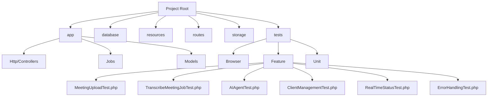
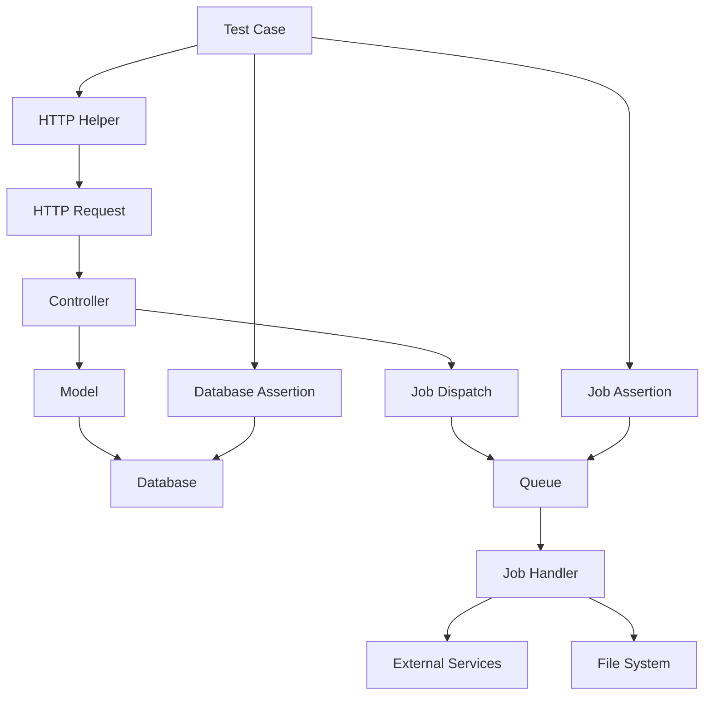
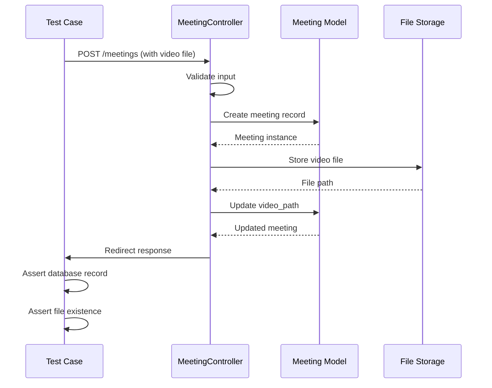
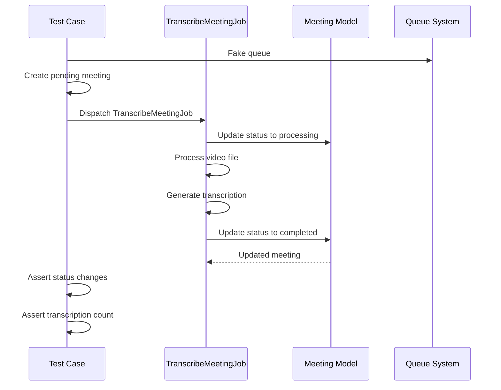
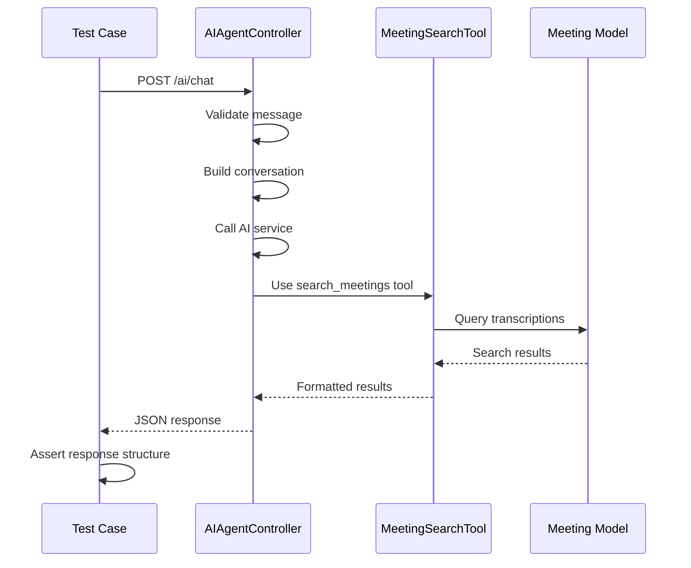
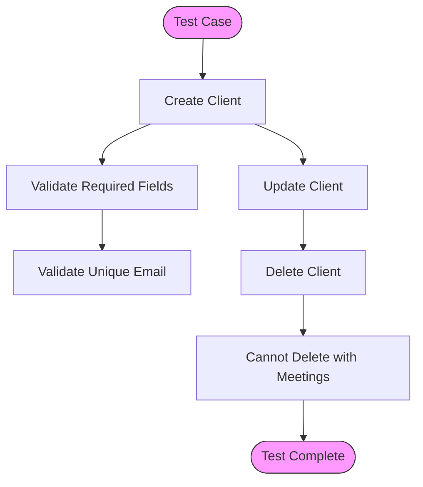
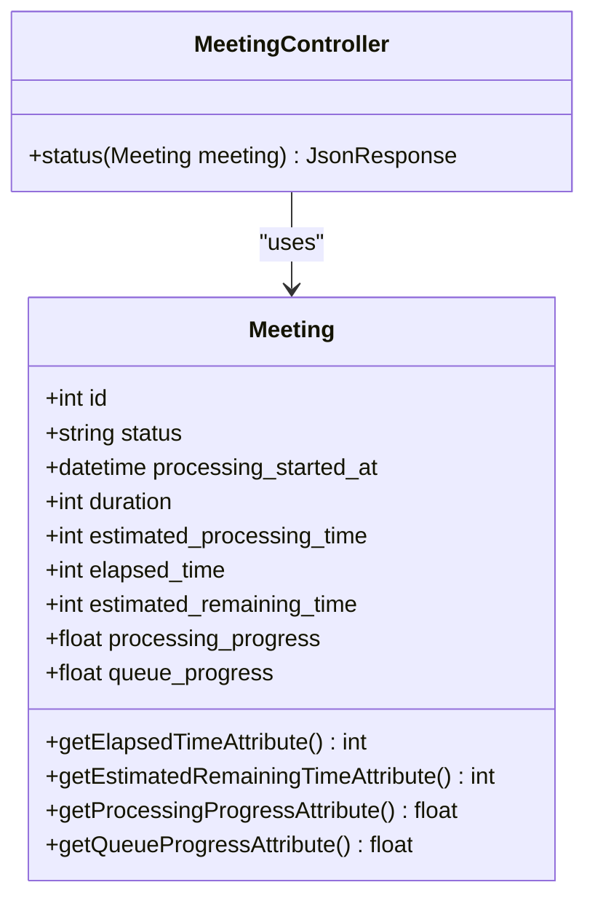
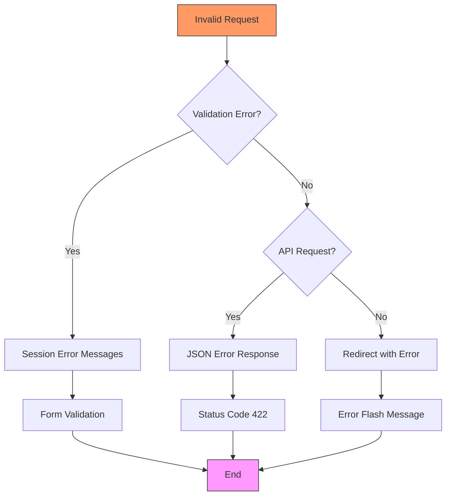
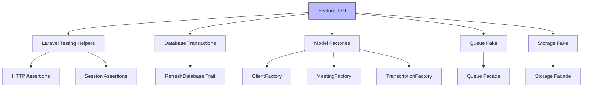

# Feature Testing

## Table of Contents
1. [Introduction](#introduction)
2. [Project Structure](#project-structure)
3. [Core Components](#core-components)
4. [Architecture Overview](#architecture-overview)
5. [Detailed Component Analysis](#detailed-component-analysis)
6. [Dependency Analysis](#dependency-analysis)
7. [Performance Considerations](#performance-considerations)
8. [Troubleshooting Guide](#troubleshooting-guide)
9. [Conclusion](#conclusion)

## Introduction
This document provides a comprehensive overview of feature testing in the meetingai application. Feature tests validate HTTP endpoints, controller logic, job dispatching, and business workflows across multiple components. The analysis covers key test files including MeetingUploadTest, TranscribeMeetingJobTest, AIAgentTest, ClientManagementTest, RealTimeStatusTest, and ErrorHandlingTest. It explains the use of Laravel's HTTP testing helpers, database transactions, and factories for seeding test data. The document also details how tests interact with routes defined in web.php and assert JSON responses, redirects, or database changes.

## Project Structure
The meetingai application follows a standard Laravel directory structure with clear separation of concerns. The application is organized into app, database, resources, routes, storage, and tests directories. The tests directory contains three main subdirectories: Browser, Feature, and Unit, following Laravel's testing conventions.

**Diagram sources**
- [tests/Feature/MeetingUploadTest.php](file://tests/Feature/MeetingUploadTest.php)
- [tests/Feature/TranscribeMeetingJobTest.php](file://tests/Feature/TranscribeMeetingJobTest.php)
- [tests/Feature/AIAgentTest.php](file://tests/Feature/AIAgentTest.php)

**Section sources**
- [tests/Feature/MeetingUploadTest.php](file://tests/Feature/MeetingUploadTest.php)
- [tests/Feature/TranscribeMeetingJobTest.php](file://tests/Feature/TranscribeMeetingJobTest.php)
- [tests/Feature/AIAgentTest.php](file://tests/Feature/AIAgentTest.php)

## Core Components
The core components of the feature testing system include test files that validate different aspects of the application. These components work together to ensure the reliability and correctness of the meetingai application's functionality.

**Section sources**
- [tests/Feature/MeetingUploadTest.php](file://tests/Feature/MeetingUploadTest.php)
- [tests/Feature/TranscribeMeetingJobTest.php](file://tests/Feature/TranscribeMeetingJobTest.php)
- [tests/Feature/AIAgentTest.php](file://tests/Feature/AIAgentTest.php)

## Architecture Overview
The feature testing architecture in meetingai follows a layered approach where tests validate the interaction between HTTP requests, controllers, models, jobs, and external services. The architecture ensures comprehensive coverage of business workflows and edge cases.

**Diagram sources**
- [MeetingController.php](file://app/Http/Controllers/MeetingController.php)
- [TranscribeMeetingJob.php](file://app/Jobs/TranscribeMeetingJob.php)
- [Meeting.php](file://app/Models/Meeting.php)

## Detailed Component Analysis

### Meeting Upload Testing
The MeetingUploadTest verifies file upload, validation, and database record creation. It uses Laravel's HTTP testing helpers to simulate form submissions and validate responses.

**Diagram sources**
- [MeetingUploadTest.php](file://tests/Feature/MeetingUploadTest.php)
- [MeetingController.php](file://app/Http/Controllers/MeetingController.php)

**Section sources**
- [MeetingUploadTest.php](file://tests/Feature/MeetingUploadTest.php)
- [MeetingController.php](file://app/Http/Controllers/MeetingController.php)

### Transcription Job Testing
The TranscribeMeetingJobTest ensures the job correctly processes meetings and updates status. It validates the job's interaction with the queue system and database.

**Diagram sources**
- [TranscribeMeetingJobTest.php](file://tests/Feature/TranscribeMeetingJobTest.php)
- [TranscribeMeetingJob.php](file://app/Jobs/TranscribeMeetingJob.php)

**Section sources**
- [TranscribeMeetingJobTest.php](file://tests/Feature/TranscribeMeetingJobTest.php)
- [TranscribeMeetingJob.php](file://app/Jobs/TranscribeMeetingJob.php)

### AI Agent Testing
The AIAgentTest validates the AI chat endpoint and tool integration. It tests both the chat functionality and direct search capabilities.

**Diagram sources**
- [AIAgentTest.php](file://tests/Feature/AIAgentTest.php)
- [AIAgentController.php](file://app/Http/Controllers/AIAgentController.php)
- [MeetingSearchTool.php](file://app/Tools/MeetingSearchTool.php)

**Section sources**
- [AIAgentTest.php](file://tests/Feature/AIAgentTest.php)
- [AIAgentController.php](file://app/Http/Controllers/AIAgentController.php)

### Client Management Testing
The ClientManagementTest covers CRUD operations for clients, including validation and business rules.

**Diagram sources**
- [ClientManagementTest.php](file://tests/Feature/ClientManagementTest.php)
- [ClientController.php](file://app/Http/Controllers/ClientController.php)

**Section sources**
- [ClientManagementTest.php](file://tests/Feature/ClientManagementTest.php)
- [ClientController.php](file://app/Http/Controllers/ClientController.php)

### Real-Time Status Testing
The RealTimeStatusTest confirms polling updates for meeting processing status. It validates the calculation of progress metrics.

**Diagram sources**
- [RealTimeStatusTest.php](file://tests/Feature/RealTimeStatusTest.php)
- [Meeting.php](file://app/Models/Meeting.php)
- [MeetingController.php](file://app/Http/Controllers/MeetingController.php)

**Section sources**
- [RealTimeStatusTest.php](file://tests/Feature/RealTimeStatusTest.php)
- [Meeting.php](file://app/Models/Meeting.php)

### Error Handling Testing
The ErrorHandlingTest checks proper error responses for various failure scenarios.

**Diagram sources**
- [ErrorHandlingTest.php](file://tests/Feature/ErrorHandlingTest.php)
- [MeetingController.php](file://app/Http/Controllers/MeetingController.php)

**Section sources**
- [ErrorHandlingTest.php](file://tests/Feature/ErrorHandlingTest.php)
- [MeetingController.php](file://app/Http/Controllers/MeetingController.php)

## Dependency Analysis
The feature tests in meetingai have a well-defined dependency structure that ensures isolated and reliable testing.

**Diagram sources**
- [TestCase.php](file://tests/TestCase.php)
- [MeetingFactory.php](file://database/factories/MeetingFactory.php)
- [ClientFactory.php](file://database/factories/ClientFactory.php)

**Section sources**
- [TestCase.php](file://tests/TestCase.php)
- [database/factories/MeetingFactory.php](file://database/factories/MeetingFactory.php)

## Performance Considerations
The feature tests are designed with performance in mind, using database transactions and fakes to minimize execution time.

**Section sources**
- [TranscribeMeetingJobTest.php](file://tests/Feature/TranscribeMeetingJobTest.php)
- [MeetingUploadTest.php](file://tests/Feature/MeetingUploadTest.php)

## Troubleshooting Guide
When writing or debugging feature tests in meetingai, consider the following common issues:

**Section sources**
- [ErrorHandlingTest.php](file://tests/Feature/ErrorHandlingTest.php)
- [TranscribeMeetingJobTest.php](file://tests/Feature/TranscribeMeetingJobTest.php)
- [MeetingUploadTest.php](file://tests/Feature/MeetingUploadTest.php)

## Conclusion
The feature testing system in meetingai provides comprehensive coverage of the application's business logic and workflows. By following Laravel's testing conventions and using appropriate testing helpers, the tests ensure the reliability and correctness of the application's functionality. The tests cover HTTP endpoints, controller logic, job dispatching, and business workflows across multiple components, providing confidence in the application's behavior.

**Referenced Files in This Document**   
- [MeetingUploadTest.php](file://tests/Feature/MeetingUploadTest.php)
- [TranscribeMeetingJobTest.php](file://tests/Feature/TranscribeMeetingJobTest.php)
- [AIAgentTest.php](file://tests/Feature/AIAgentTest.php)
- [ClientManagementTest.php](file://tests/Feature/ClientManagementTest.php)
- [RealTimeStatusTest.php](file://tests/Feature/RealTimeStatusTest.php)
- [ErrorHandlingTest.php](file://tests/Feature/ErrorHandlingTest.php)
- [web.php](file://routes/web.php)
- [MeetingController.php](file://app/Http/Controllers/MeetingController.php)
- [TranscribeMeetingJob.php](file://app/Jobs/TranscribeMeetingJob.php)
- [Meeting.php](file://app/Models/Meeting.php)
- [AIAgentController.php](file://app/Http/Controllers/AIAgentController.php)