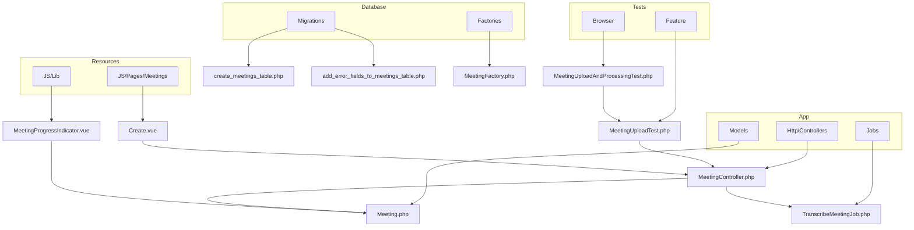
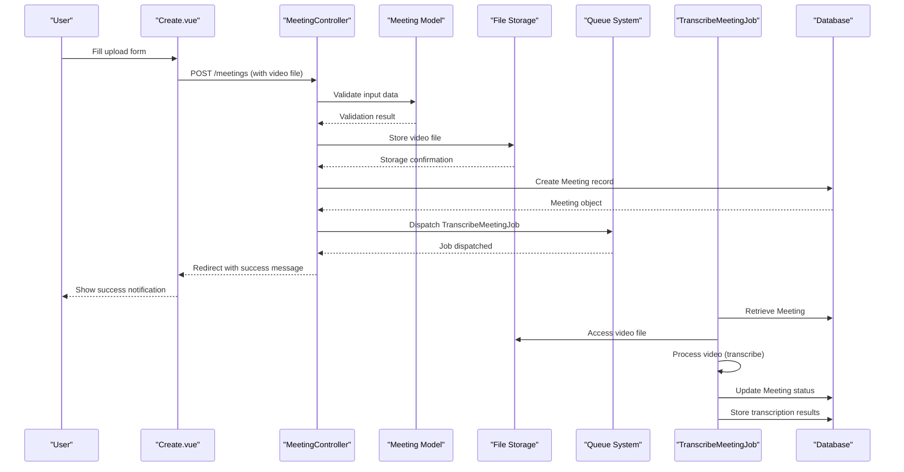
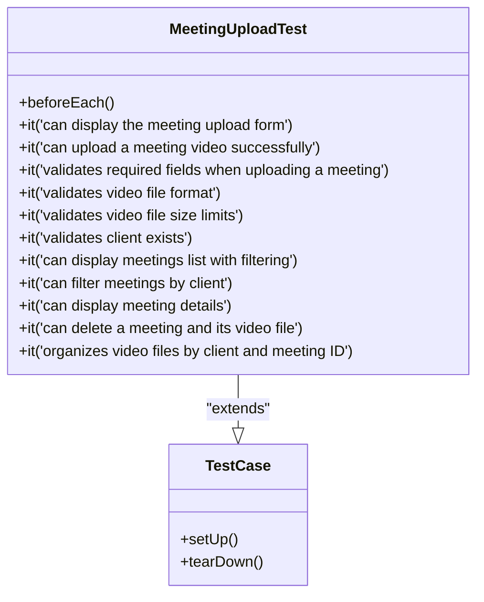
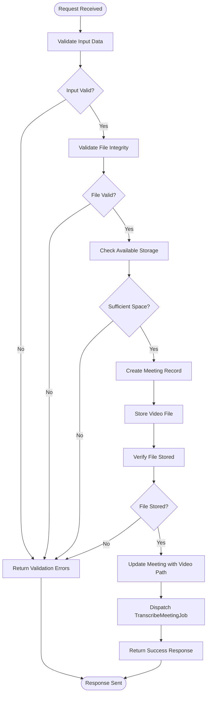
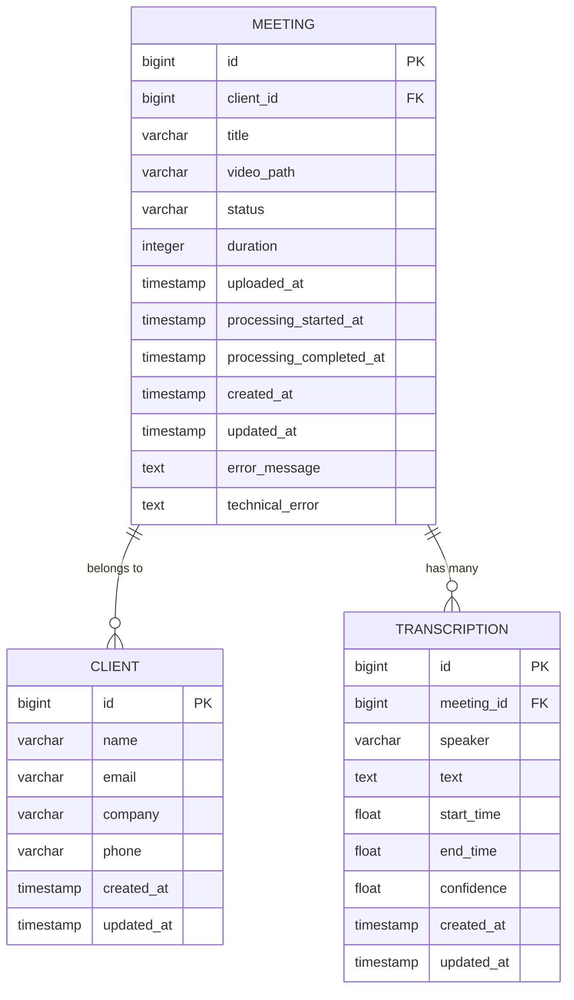
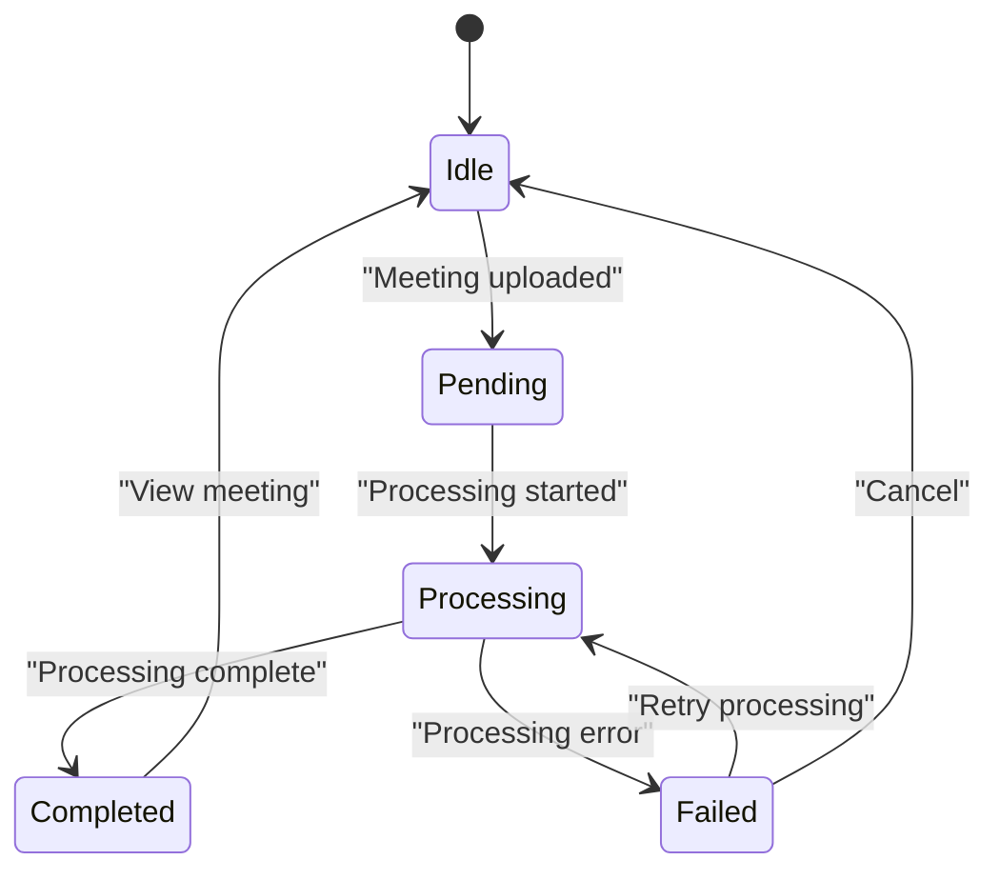
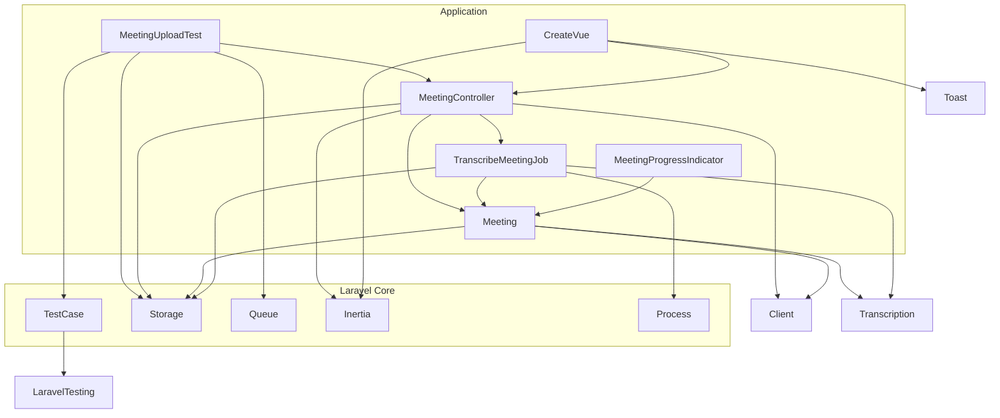

# Meeting Upload Testing


## Table of Contents
1. [Introduction](#introduction)
2. [Project Structure](#project-structure)
3. [Core Components](#core-components)
4. [Architecture Overview](#architecture-overview)
5. [Detailed Component Analysis](#detailed-component-analysis)
6. [Dependency Analysis](#dependency-analysis)
7. [Performance Considerations](#performance-considerations)
8. [Troubleshooting Guide](#troubleshooting-guide)
9. [Conclusion](#conclusion)

## Introduction
This document provides a comprehensive analysis of the meeting upload testing implementation in the MeetingAI application. It details how the `MeetingUploadTest` validates the end-to-end workflow of uploading meeting videos through the `MeetingController`, covering successful uploads, file validation, error handling, and database record creation. The documentation includes test cases for various scenarios, HTTP request examples, and integration with Laravel's testing utilities.

## Project Structure
The meeting upload functionality is organized across multiple directories in the Laravel application, following a standard MVC pattern with additional feature-based organization for tests and frontend components.





**Diagram sources**
- [MeetingController.php](file://app/Http/Controllers/MeetingController.php)
- [Meeting.php](file://app/Models/Meeting.php)
- [TranscribeMeetingJob.php](file://app/Jobs/TranscribeMeetingJob.php)
- [MeetingUploadTest.php](file://tests/Feature/MeetingUploadTest.php)
- [MeetingUploadAndProcessingTest.php](file://tests/Browser/MeetingUploadAndProcessingTest.php)
- [Create.vue](file://resources/js/pages/Meetings/Create.vue)
- [MeetingProgressIndicator.vue](file://resources/js/lib/MeetingProgressIndicator.vue)
- [2025_08_10_135205_create_meetings_table.php](file://database/migrations/2025_08_10_135205_create_meetings_table.php)
- [2025_08_10_160251_add_error_fields_to_meetings_table.php](file://database/migrations/2025_08_10_160251_add_error_fields_to_meetings_table.php)

**Section sources**
- [MeetingUploadTest.php](file://tests/Feature/MeetingUploadTest.php)
- [MeetingController.php](file://app/Http/Controllers/MeetingController.php)

## Core Components
The meeting upload testing system consists of several core components that work together to validate the upload workflow:

- **MeetingUploadTest**: Feature test class that validates the end-to-end upload process
- **MeetingController**: Handles HTTP requests for meeting creation and upload
- **Meeting Model**: Represents meeting data with business logic and relationships
- **TranscribeMeetingJob**: Queue job that processes uploaded videos
- **Create.vue**: Frontend component for the upload form
- **MeetingProgressIndicator**: Component for displaying processing status

These components are tested through both feature tests (HTTP-level) and browser tests (end-to-end), ensuring comprehensive coverage of the upload workflow.

**Section sources**
- [MeetingUploadTest.php](file://tests/Feature/MeetingUploadTest.php)
- [MeetingController.php](file://app/Http/Controllers/MeetingController.php)
- [Meeting.php](file://app/Models/Meeting.php)
- [TranscribeMeetingJob.php](file://app/Jobs/TranscribeMeetingJob.php)
- [Create.vue](file://resources/js/pages/Meetings/Create.vue)

## Architecture Overview
The meeting upload architecture follows a layered approach with clear separation of concerns between frontend, backend, and processing components.





**Diagram sources**
- [MeetingController.php](file://app/Http/Controllers/MeetingController.php)
- [Meeting.php](file://app/Models/Meeting.php)
- [TranscribeMeetingJob.php](file://app/Jobs/TranscribeMeetingJob.php)
- [Create.vue](file://resources/js/pages/Meetings/Create.vue)

## Detailed Component Analysis

### Meeting Upload Test Analysis
The `MeetingUploadTest` class uses PestPHP (a Laravel testing framework) to validate various aspects of the meeting upload workflow through feature tests.

#### Test Structure and Setup
The test class begins with a `beforeEach` hook that sets up a fake storage disk for testing file operations without affecting the real filesystem.


```php
beforeEach(function () {
    Storage::fake('public');
});
```


This ensures that all file operations during tests are performed on an in-memory filesystem, making tests faster and more reliable.





**Diagram sources**
- [MeetingUploadTest.php](file://tests/Feature/MeetingUploadTest.php)
- [TestCase.php](file://tests/TestCase.php)

**Section sources**
- [MeetingUploadTest.php](file://tests/Feature/MeetingUploadTest.php)

#### Successful Upload Test
The primary test case validates a successful meeting upload scenario:


```php
it('can upload a meeting video successfully', function () {
    $client = Client::factory()->create();
    $videoFile = UploadedFile::fake()->create('test-meeting.mp4', 1024, 'video/mp4');
    
    $response = $this->post(route('meetings.store'), [
        'title' => 'Test Meeting',
        'client_id' => $client->id,
        'video' => $videoFile,
    ]);
    
    $response->assertRedirect(route('meetings.index'))
        ->assertSessionHas('success', 'Meeting uploaded successfully and is being processed.');
    
    $this->assertDatabaseHas('meetings', [
        'title' => 'Test Meeting',
        'client_id' => $client->id,
        'status' => 'pending',
    ]);
    
    $meeting = Meeting::where('title', 'Test Meeting')->first();
    expect($meeting->video_path)->toContain("meetings/{$client->id}/{$meeting->id}/video.mp4");
    
    Storage::disk('public')->assertExists($meeting->video_path);
});
```


This test:
1. Creates a test client using Laravel's model factory
2. Generates a fake video file with specified properties
3. Sends a POST request to the meetings store endpoint
4. Asserts the response redirects to the meetings index with a success message
5. Verifies the meeting record exists in the database with correct attributes
6. Confirms the video file is stored in the expected location

**Section sources**
- [MeetingUploadTest.php](file://tests/Feature/MeetingUploadTest.php)

#### File Validation Tests
The test suite includes comprehensive validation tests for various error scenarios:

**MIME Type Validation**

```php
it('validates video file format', function () {
    $client = Client::factory()->create();
    $invalidFile = UploadedFile::fake()->create('test.txt', 1024, 'text/plain');
    
    $response = $this->post(route('meetings.store'), [
        'title' => 'Test Meeting',
        'client_id' => $client->id,
        'video' => $invalidFile,
    ]);
    
    $response->assertSessionHasErrors(['video']);
});
```


**File Size Validation**

```php
it('validates video file size limits', function () {
    $client = Client::factory()->create();
    $largeFile = UploadedFile::fake()->create('large-video.mp4', 600 * 1024, 'video/mp4'); // 600MB
    
    $response = $this->post(route('meetings.store'), [
        'title' => 'Test Meeting',
        'client_id' => $client->id,
        'video' => $largeFile,
    ]);
    
    $response->assertSessionHasErrors(['video']);
});
```


These tests verify that the system properly validates file types (only allowing MP4, MOV, AVI, WebM) and enforces size limits (maximum 500MB, minimum 1MB).

**Section sources**
- [MeetingUploadTest.php](file://tests/Feature/MeetingUploadTest.php)
- [MeetingController.php](file://app/Http/Controllers/MeetingController.php)

### Meeting Controller Analysis
The `MeetingController` handles the HTTP requests for meeting operations, with the `store` method being central to the upload functionality.

#### Input Validation
The controller implements comprehensive validation rules for meeting uploads:


```php
$validated = $request->validate([
    'title' => 'required|string|max:255',
    'client_id' => 'required|exists:clients,id',
    'video' => [
        'required',
        'file',
        File::types(['mp4', 'mov', 'avi', 'webm'])
            ->max(500 * 1024) // 500MB max
            ->min(1024) // 1MB min
    ]
], [
    'title.required' => 'Please enter a meeting title.',
    'title.max' => 'Meeting title cannot exceed 255 characters.',
    'client_id.required' => 'Please select a client for this meeting.',
    'client_id.exists' => 'The selected client is invalid.',
    'video.required' => 'Please select a video file to upload.',
    'video.file' => 'The uploaded file is not valid.',
    'video.types' => 'The video must be a file of type: MP4, MOV, AVI, or WebM.',
    'video.max' => 'The video file size cannot exceed 500MB.',
    'video.min' => 'The video file must be at least 1MB.',
]);
```


The validation includes:
- Required fields with custom error messages
- Client existence verification via database constraint
- File type restrictions using Laravel's File rule
- File size limits (500MB maximum, 1MB minimum)





**Diagram sources**
- [MeetingController.php](file://app/Http/Controllers/MeetingController.php)

**Section sources**
- [MeetingController.php](file://app/Http/Controllers/MeetingController.php)

#### Error Handling
The controller implements robust error handling with different exception types:


```php
try {
    // ... upload processing ...
} catch (\Illuminate\Validation\ValidationException $e) {
    throw $e;
} catch (\RuntimeException $e) {
    if ($meeting) {
        $meeting->delete();
    }
    return redirect()->back()
        ->withInput()
        ->with('error', $e->getMessage());
} catch (\Exception $e) {
    if ($meeting) {
        $meeting->delete();
    }
    \Log::error('Meeting upload failed', [
        'error' => $e->getMessage(),
        'trace' => $e->getTraceAsString(),
        'user_input' => $request->only(['title', 'client_id'])
    ]);
    return redirect()->back()
        ->withInput()
        ->with('error', 'Failed to upload meeting video. Please try again or contact support if the problem persists.');
}
```


The error handling strategy:
1. Re-throws validation exceptions for Laravel to handle
2. Catches runtime exceptions (file system issues) and cleans up created records
3. Catches general exceptions, logs detailed information, and provides user-friendly error messages
4. Always cleans up partially created meeting records to prevent data inconsistency

**Section sources**
- [MeetingController.php](file://app/Http/Controllers/MeetingController.php)

### Meeting Model Analysis
The `Meeting` model defines the structure and behavior of meeting records in the application.

#### Database Schema
The meetings table is defined in two migrations that create the core structure and add error tracking fields:


```php
// 2025_08_10_135205_create_meetings_table.php
Schema::create('meetings', function (Blueprint $table) {
    $table->id();
    $table->foreignId('client_id')->constrained()->onDelete('cascade');
    $table->string('title');
    $table->string('video_path', 500);
    $table->string('status', 50)->default('pending');
    $table->integer('duration')->nullable();
    $table->timestamp('uploaded_at')->nullable();
    $table->timestamp('processing_started_at')->nullable();
    $table->timestamp('processing_completed_at')->nullable();
    $table->timestamps();
    
    $table->index('client_id');
    $table->index('status');
    $table->index('uploaded_at');
});
```


```php
// 2025_08_10_160251_add_error_fields_to_meetings_table.php
Schema::table('meetings', function (Blueprint $table) {
    $table->text('error_message')->nullable()->after('processing_completed_at');
    $table->text('technical_error')->nullable()->after('error_message');
});
```


The schema supports:
- Foreign key relationship to clients
- Video file path storage
- Status tracking (pending, processing, completed, failed)
- Timestamps for various processing stages
- Error tracking for failed uploads
- Indexes for query performance





**Diagram sources**
- [2025_08_10_135205_create_meetings_table.php](file://database/migrations/2025_08_10_135205_create_meetings_table.php)
- [2025_08_10_160251_add_error_fields_to_meetings_table.php](file://database/migrations/2025_08_10_160251_add_error_fields_to_meetings_table.php)
- [Meeting.php](file://app/Models/Meeting.php)

**Section sources**
- [Meeting.php](file://app/Models/Meeting.php)
- [2025_08_10_135205_create_meetings_table.php](file://database/migrations/2025_08_10_135205_create_meetings_table.php)
- [2025_08_10_160251_add_error_fields_to_meetings_table.php](file://database/migrations/2025_08_10_160251_add_error_fields_to_meetings_table.php)

#### Model Attributes and Methods
The model includes several computed attributes for tracking processing progress:


```php
protected $appends = [
    'elapsed_time',
    'estimated_remaining_time',
    'processing_progress',
    'formatted_elapsed_time',
    'formatted_estimated_remaining_time',
    'queue_progress',
    'formatted_estimated_processing_time',
];
```


These attributes provide real-time status information for the frontend, including:
- Elapsed processing time
- Estimated remaining time
- Processing progress percentage
- Formatted time displays
- Queue position for pending meetings

The model also includes status checking methods:
- `isProcessing()`: Checks if status is 'processing'
- `isCompleted()`: Checks if status is 'completed'
- `isFailed()`: Checks if status is 'failed'

**Section sources**
- [Meeting.php](file://app/Models/Meeting.php)

### Frontend Implementation Analysis

#### Upload Form Component
The `Create.vue` component implements the meeting upload form with comprehensive validation and user feedback:


```vue
<template>
  <form @submit.prevent="submit" enctype="multipart/form-data">
    <!-- Meeting Title -->
    <div class="mb-6">
      <label for="title" class="block text-sm font-medium text-gray-700 mb-2">
        Meeting Title *
      </label>
      <input id="title" v-model="form.title" type="text" required />
      <p v-if="errors.title" class="mt-1 text-sm text-red-600">
        {{ errors.title }}
      </p>
    </div>

    <!-- Client Selection -->
    <div class="mb-6">
      <label for="client_id" class="block text-sm font-medium text-gray-700 mb-2">
        Client *
      </label>
      <select id="client_id" v-model="form.client_id" required>
        <option value="">Select a client</option>
        <option v-for="client in clients" :key="client.id" :value="client.id">
          {{ client.name }}
        </option>
      </select>
      <p v-if="errors.client_id" class="mt-1 text-sm text-red-600">
        {{ errors.client_id }}
      </p>
    </div>

    <!-- Video Upload -->
    <div class="mb-6">
      <label for="video" class="block text-sm font-medium text-gray-700 mb-2">
        Meeting Video *
      </label>

      <!-- File Drop Zone -->
      <div 
        @drop="handleDrop" 
        @dragover.prevent 
        @dragenter.prevent 
        @dragleave="handleDragLeave"
        :class="[/* styling classes */]"
      >
        <div v-if="!form.video" class="space-y-4">
          <svg><!-- upload icon --></svg>
          <div>
            <p class="text-lg font-medium text-gray-900">
              Drop your video file here, or
              <label for="video" class="text-blue-600 hover:text-blue-700 cursor-pointer font-medium">
                browse
              </label>
            </p>
            <p class="text-sm text-gray-500 mt-2">
              Supports MP4, MOV, AVI, WebM up to 500MB
            </p>
          </div>
        </div>

        <!-- Selected File Display -->
        <div v-else class="space-y-4">
          <svg><!-- success icon --></svg>
          <div>
            <p class="text-lg font-medium text-gray-900">{{ form.video.name }}</p>
            <p class="text-sm text-gray-500">{{ formatFileSize(form.video.size) }}</p>
            <button type="button" @click="removeFile"
              class="mt-2 text-red-600 hover:text-red-700 text-sm font-medium transition-colors">
              Remove file
            </button>
          </div>
        </div>
      </div>

      <input id="video" ref="fileInput" type="file"
        accept=".mp4,.mov,.avi,.webm,video/mp4,video/quicktime,video/x-msvideo,video/webm"
        @change="handleFileSelect" class="hidden" />

      <!-- File validation info -->
      <div class="mt-2 text-xs text-gray-500 space-y-1">
        <p>• Maximum file size: 500MB</p>
        <p>• Supported formats: MP4, MOV, AVI, WebM</p>
        <p>• Minimum file size: 1MB</p>
      </div>

      <!-- Upload Progress -->
      <div v-if="uploadProgress !== null" class="mt-4">
        <div class="flex justify-between text-sm text-gray-600 mb-2">
          <span class="font-medium">Uploading...</span>
          <span>{{ uploadProgress }}%</span>
        </div>
        <div class="w-full bg-gray-200 rounded-full h-3 overflow-hidden">
          <div 
            class="bg-gradient-to-r from-blue-500 to-blue-600 h-3 rounded-full transition-all duration-300 ease-out"
            :style="{ width: uploadProgress + '%' }"
          ></div>
        </div>
        <p class="text-xs text-gray-500 mt-1">
          Please don't close this page while uploading...
        </p>
      </div>
    </div>

    <!-- Submit Button -->
    <div class="flex justify-end space-x-4">
      <Link :href="route('meetings.index')"
        class="px-4 py-2 text-gray-700 bg-gray-100 hover:bg-gray-200 rounded-md font-medium transition-colors">
        Cancel
      </Link>
      <button type="submit" :disabled="processing || !form.title || !form.client_id || !form.video"
        class="px-6 py-2 bg-blue-600 hover:bg-blue-700 disabled:bg-gray-400 disabled:cursor-not-allowed text-white rounded-md font-medium transition-colors">
        {{ processing ? 'Uploading...' : 'Upload Meeting' }}
      </button>
    </div>
  </form>
</template>
```


The component provides:
- Drag-and-drop file upload interface
- Real-time upload progress indication
- Client-side file validation
- Clear error messaging
- Responsive design with Tailwind CSS

**Section sources**
- [Create.vue](file://resources/js/pages/Meetings/Create.vue)

#### Client-Side Validation
The component implements client-side validation that mirrors the server-side rules:


```javascript
const validateFile = (file: File): boolean => {
  const maxSize = 500 * 1024 * 1024 // 500MB
  const minSize = 1024 * 1024 // 1MB
  const allowedTypes = ['video/mp4', 'video/quicktime', 'video/x-msvideo', 'video/webm']
  
  if (!allowedTypes.includes(file.type)) {
    uploadError.value = 'Please select a valid video file (MP4, MOV, AVI, or WebM)'
    return false
  }
  
  if (file.size > maxSize) {
    uploadError.value = 'File size must be less than 500MB'
    return false
  }
  
  if (file.size < minSize) {
    uploadError.value = 'File size must be at least 1MB'
    return false
  }
  
  return true
}
```


This validation provides immediate feedback to users before submitting the form, improving the user experience by catching errors early.

**Section sources**
- [Create.vue](file://resources/js/pages/Meetings/Create.vue)

#### Form Submission
The form submission process includes progress tracking and error handling:


```javascript
const submit = () => {
  if (!form.video || !validateFile(form.video)) return

  processing.value = true
  uploadProgress.value = 0
  uploadError.value = ''

  const formData = new FormData()
  formData.append('title', form.title)
  formData.append('client_id', form.client_id)
  formData.append('video', form.video)

  router.post(route('meetings.store'), formData, {
    onProgress: (progress?: { percentage?: number }) => {
      if (progress?.percentage !== undefined && progress?.percentage !== null) {
        uploadProgress.value = Math.round(progress.percentage)
      }
    },
    onSuccess: () => {
      processing.value = false
      uploadProgress.value = null
      retryCount.value = 0
      
      if (window.toast) {
        window.toast.success(
          'Meeting uploaded successfully!',
          'Your meeting is now being processed and will be ready for review shortly.'
        )
      }
    },
    onError: (errors) => {
      processing.value = false
      uploadProgress.value = null
      
      if (errors.video) {
        uploadError.value = errors.video
      } else if (errors.title) {
        uploadError.value = 'Please check the meeting title'
      } else if (errors.client_id) {
        uploadError.value = 'Please select a client'
      } else {
        uploadError.value = 'Upload failed. Please try again.'
      }
      
      if (window.toast && retryCount.value < maxRetries) {
        window.toast.error(
          'Upload Failed',
          uploadError.value,
          {
            actions: [
              {
                label: 'Try Again',
                handler: retryUpload,
                primary: true
              }
            ]
          }
        )
      }
    },
    onFinish: () => {
      processing.value = false
      uploadProgress.value = null
    }
  })
}
```


Key features of the submission process:
- Uses Inertia.js for seamless page transitions
- Tracks upload progress with visual feedback
- Handles success and error responses appropriately
- Provides retry functionality for failed uploads
- Prevents accidental navigation during upload

**Section sources**
- [Create.vue](file://resources/js/pages/Meetings/Create.vue)

### Progress Indicator Component
The `MeetingProgressIndicator.vue` component displays real-time processing status to users:


```vue
<template>
  <div class="space-y-2">
    <!-- Processing Progress -->
    <div v-if="meeting.status === 'processing'" class="space-y-2">
      <div class="flex justify-between items-center text-xs text-gray-600">
        <span>Processing Video</span>
        <span v-if="meeting.processing_progress !== null" class="font-medium">
          {{ Math.round(meeting.processing_progress) }}%
        </span>
      </div>
      
      <div class="w-full bg-gray-200 rounded-full h-2">
        <div 
          class="bg-blue-600 h-2 rounded-full transition-all duration-500 ease-out"
          :style="{ width: `${meeting.processing_progress || 0}%` }"
        ></div>
      </div>
      
      <div class="grid grid-cols-2 gap-4 text-xs text-gray-500">
        <div v-if="meeting.formatted_elapsed_time" class="flex justify-between">
          <span>Elapsed:</span>
          <span class="font-mono text-gray-700">{{ meeting.formatted_elapsed_time }}</span>
        </div>
        <div v-if="meeting.formatted_estimated_remaining_time" class="flex justify-between">
          <span>Remaining:</span>
          <span class="font-mono text-gray-700">{{ meeting.formatted_estimated_remaining_time }}</span>
        </div>
      </div>
    </div>

    <!-- Queue Progress -->
    <div v-else-if="meeting.status === 'pending'" class="space-y-2">
      <div class="flex justify-between items-center text-xs text-gray-600">
        <span>In Queue</span>
        <span v-if="meeting.queue_progress !== null" class="font-medium">
          {{ Math.round(meeting.queue_progress) }}%
        </span>
      </div>
      
      <div class="w-full bg-gray-200 rounded-full h-2">
        <div 
          class="bg-yellow-500 h-2 rounded-full transition-all duration-500 ease-out"
          :style="{ width: `${meeting.queue_progress || 0}%` }"
        ></div>
      </div>
      
      <div class="text-xs text-gray-500">
        <div v-if="meeting.formatted_estimated_processing_time" class="flex justify-between">
          <span>Est. processing time:</span>
          <span class="font-mono text-gray-700">{{ meeting.formatted_estimated_processing_time }}</span>
        </div>
      </div>
    </div>

    <!-- Completed State -->
    <div v-else-if="meeting.status === 'completed'" class="space-y-1">
      <div class="flex items-center text-xs text-green-600">
        <svg><!-- check icon --></svg>
        <span>Transcription Complete</span>
      </div>
      <div v-if="meeting.formatted_elapsed_time" class="text-xs text-gray-500">
        Processing took {{ meeting.formatted_elapsed_time }}
      </div>
    </div>

    <!-- Failed State -->
    <div v-else-if="meeting.status === 'failed'" class="space-y-1">
      <div class="flex items-center text-xs text-red-600">
        <svg><!-- error icon --></svg>
        <span>Processing Failed</span>
      </div>
      <div class="text-xs text-gray-500">
        Please try uploading again
      </div>
    </div>
  </div>
</template>
```


The component handles all possible meeting statuses:
- **Pending**: Shows queue position and estimated processing time
- **Processing**: Displays progress percentage, elapsed time, and remaining time
- **Completed**: Indicates success with processing duration
- **Failed**: Shows failure state with retry suggestion





**Diagram sources**
- [MeetingProgressIndicator.vue](file://resources/js/lib/MeetingProgressIndicator.vue)
- [Meeting.php](file://app/Models/Meeting.php)

**Section sources**
- [MeetingProgressIndicator.vue](file://resources/js/lib/MeetingProgressIndicator.vue)

## Dependency Analysis
The meeting upload functionality depends on several Laravel components and external services:





**Diagram sources**
- [MeetingUploadTest.php](file://tests/Feature/MeetingUploadTest.php)
- [MeetingController.php](file://app/Http/Controllers/MeetingController.php)
- [Meeting.php](file://app/Models/Meeting.php)
- [TranscribeMeetingJob.php](file://app/Jobs/TranscribeMeetingJob.php)
- [Create.vue](file://resources/js/pages/Meetings/Create.vue)
- [MeetingProgressIndicator.vue](file://resources/js/lib/MeetingProgressIndicator.vue)

**Section sources**
- [MeetingUploadTest.php](file://tests/Feature/MeetingUploadTest.php)
- [MeetingController.php](file://app/Http/Controllers/MeetingController.php)
- [Meeting.php](file://app/Models/Meeting.php)
- [TranscribeMeetingJob.php](file://app/Jobs/TranscribeMeetingJob.php)

## Performance Considerations
The meeting upload system includes several performance optimizations:

1. **Database Indexing**: The meetings table has indexes on frequently queried columns (`client_id`, `status`, `uploaded_at`) to optimize filtering and sorting operations.

2. **File Storage Organization**: Videos are stored in a structured directory hierarchy (`meetings/{client_id}/{meeting_id}/video.mp4`) which improves file system organization and access patterns.

3. **Queue Processing**: Video processing is handled by a queued job, preventing blocking of the main application thread and allowing for horizontal scaling of processing workers.

4. **Progress Estimation**: The system provides estimated processing times based on video duration (1 second per minute of video), giving users realistic expectations.

5. **Client-Side Validation**: Frontend validation prevents unnecessary server requests for invalid files, reducing server load.

6. **Storage Space Check**: The controller checks available disk space before processing large files, preventing storage exhaustion.

7. **Error Logging**: Comprehensive error logging helps identify performance bottlenecks and failure points in the processing pipeline.

**Section sources**
- [MeetingController.php](file://app/Http/Controllers/MeetingController.php)
- [TranscribeMeetingJob.php](file://app/Jobs/TranscribeMeetingJob.php)
- [2025_08_10_135205_create_meetings_table.php](file://database/migrations/2025_08_10_135205_create_meetings_table.php)

## Troubleshooting Guide
Common issues and their solutions for the meeting upload system:

### Upload Validation Errors
**Issue**: "The video must be a file of type: MP4, MOV, AVI, or WebM"
**Solution**: Ensure the uploaded file has a supported format. Convert the video to MP4 if necessary.

**Issue**: "The video file size cannot exceed 500MB"
**Solution**: Compress the video file or split it into smaller segments before uploading.

**Issue**: "The video file must be at least 1MB"
**Solution**: Ensure the video file is not empty or corrupted.

### Server-Side Errors
**Issue**: "Insufficient storage space available"
**Solution**: Free up disk space on the server or configure a larger storage volume.

**Issue**: "Failed to store video file"
**Solution**: Check file system permissions and ensure the storage directory is writable.

**Issue**: "Video file was not properly saved"
**Solution**: Verify the storage disk configuration and check for file system errors.

### Processing Failures
**Issue**: "Command failed (exit X): Error message"
**Solution**: Check the Docker container logs and ensure the transcription microservice is running properly.

**Issue**: "Video file not found at path: /path/to/video"
**Solution**: Verify the file was properly uploaded and stored, and check the file path configuration.

**Issue**: "WAV conversion did not produce expected file"
**Solution**: Check the ffmpeg Docker container and ensure it has proper access to input and output directories.

### Debugging Tools
1. **Laravel Logs**: Check `storage/logs/laravel.log` for detailed error information.
2. **Queue Workers**: Monitor queue processing with `php artisan queue:work --verbose`.
3. **Database Inspection**: Query the meetings table to check status and error fields.
4. **Storage Verification**: Use `Storage::disk('public')->files()` to verify uploaded files.
5. **Browser Developer Tools**: Inspect network requests and console errors during upload.

**Section sources**
- [MeetingController.php](file://app/Http/Controllers/MeetingController.php)
- [TranscribeMeetingJob.php](file://app/Jobs/TranscribeMeetingJob.php)
- [Meeting.php](file://app/Models/Meeting.php)

## Conclusion
The meeting upload testing implementation provides comprehensive coverage of the end-to-end workflow, from form submission to video processing. The system uses Laravel's robust testing utilities, including feature tests, model factories, and mocked storage, to ensure reliable validation of all scenarios.

Key strengths of the implementation include:
- Comprehensive test coverage of success and error cases
- Realistic test data generation using model factories
- Isolated testing environment with fake storage
- Clear assertion of expected outcomes
- Integration with Laravel's validation and session systems

The architecture follows best practices with proper separation of concerns between frontend, backend, and processing components. The use of queued jobs for video processing ensures the main application remains responsive, while the progress tracking system provides users with real-time feedback.

To extend the tests, consider adding:
- Tests for additional file formats
- Tests for edge cases (very large files, very small files)
- Tests for concurrent uploads
- Tests for different client scenarios
- Tests for storage driver configurations

The current implementation provides a solid foundation for reliable meeting uploads with thorough testing and robust error handling.

**Referenced Files in This Document**   
- [MeetingUploadTest.php](file://tests/Feature/MeetingUploadTest.php)
- [MeetingController.php](file://app/Http/Controllers/MeetingController.php)
- [Meeting.php](file://app/Models/Meeting.php)
- [2025_08_10_135205_create_meetings_table.php](file://database/migrations/2025_08_10_135205_create_meetings_table.php)
- [2025_08_10_160251_add_error_fields_to_meetings_table.php](file://database/migrations/2025_08_10_160251_add_error_fields_to_meetings_table.php)
- [web.php](file://routes/web.php)
- [TranscribeMeetingJob.php](file://app/Jobs/TranscribeMeetingJob.php)
- [TranscribeMeetingJobTest.php](file://tests/Feature/TranscribeMeetingJobTest.php)
- [Create.vue](file://resources/js/pages/Meetings/Create.vue)
- [MeetingProgressIndicator.vue](file://resources/js/lib/MeetingProgressIndicator.vue)
- [MeetingUploadAndProcessingTest.php](file://tests/Browser/MeetingUploadAndProcessingTest.php)