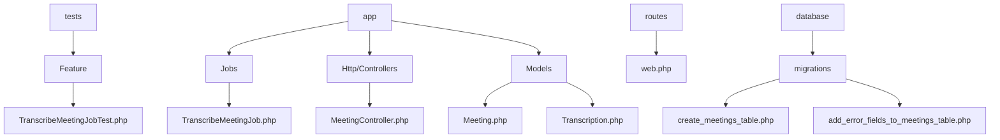
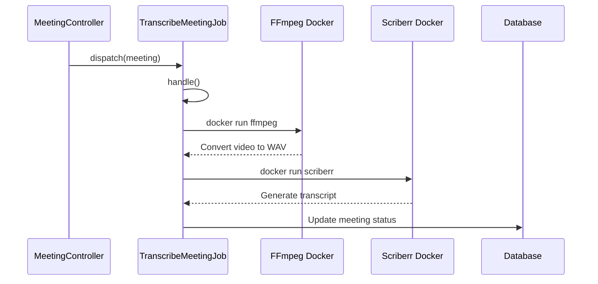
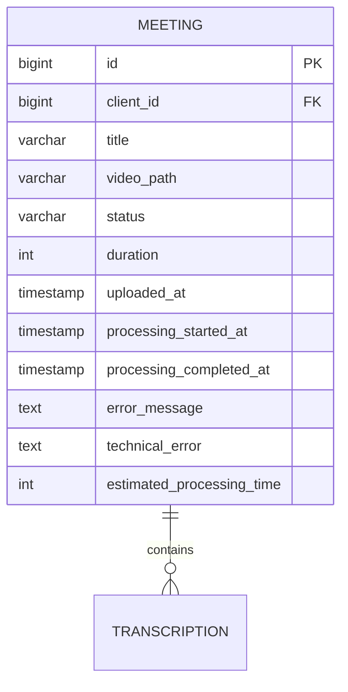
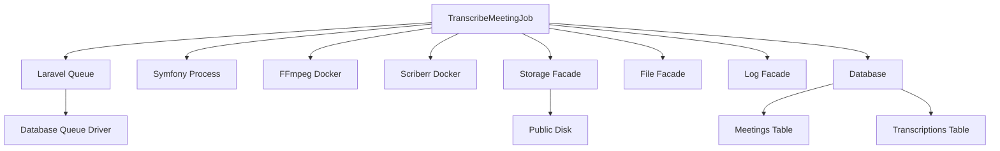

# Transcribe Meeting Job Testing


## Table of Contents
1. [Introduction](#introduction)
2. [Project Structure](#project-structure)
3. [Core Components](#core-components)
4. [Architecture Overview](#architecture-overview)
5. [Detailed Component Analysis](#detailed-component-analysis)
6. [Dependency Analysis](#dependency-analysis)
7. [Performance Considerations](#performance-considerations)
8. [Troubleshooting Guide](#troubleshooting-guide)
9. [Conclusion](#conclusion)

## Introduction
This document provides a comprehensive analysis of the `TranscribeMeetingJobTest` feature test in the MeetingAI application. The test suite verifies the background job responsible for processing uploaded meeting videos, ensuring correct workflow from controller dispatch to job execution, external service interaction, and proper status updates on the Meeting model. The documentation covers test cases for job dispatching, execution flow, error handling, and database state validation, with emphasis on best practices for testing complex background jobs in Laravel applications.

## Project Structure
The MeetingAI application follows a standard Laravel directory structure with clear separation of concerns. The transcription job testing is located in the Feature test suite, indicating it tests integrated components rather than isolated units. The application uses Pest PHP for testing, Inertia.js for frontend integration, and Docker containers for external service dependencies.





**Diagram sources**
- [TranscribeMeetingJobTest.php](file://tests/Feature/TranscribeMeetingJobTest.php)
- [TranscribeMeetingJob.php](file://app/Jobs/TranscribeMeetingJob.php)
- [MeetingController.php](file://app/Http/Controllers/MeetingController.php)
- [Meeting.php](file://app/Models/Meeting.php)
- [web.php](file://routes/web.php)
- [2025_08_10_135205_create_meetings_table.php](file://database/migrations/2025_08_10_135205_create_meetings_table.php)
- [2025_08_10_160251_add_error_fields_to_meetings_table.php](file://database/migrations/2025_08_10_160251_add_error_fields_to_meetings_table.php)

**Section sources**
- [TranscribeMeetingJobTest.php](file://tests/Feature/TranscribeMeetingJobTest.php)
- [TranscribeMeetingJob.php](file://app/Jobs/TranscribeMeetingJob.php)
- [MeetingController.php](file://app/Http/Controllers/MeetingController.php)

## Core Components
The core components involved in the transcription job testing include the `TranscribeMeetingJob` class, the `MeetingController`, and the `Meeting` model. These components work together to handle video uploads, dispatch background processing jobs, and update meeting status throughout the transcription lifecycle. The test suite validates the integration between these components, ensuring proper job dispatching, execution flow, and error handling.

**Section sources**
- [TranscribeMeetingJobTest.php](file://tests/Feature/TranscribeMeetingJobTest.php)
- [TranscribeMeetingJob.php](file://app/Jobs/TranscribeMeetingJob.php)
- [MeetingController.php](file://app/Http/Controllers/MeetingController.php)
- [Meeting.php](file://app/Models/Meeting.php)

## Architecture Overview
The transcription job architecture follows a producer-consumer pattern where the MeetingController acts as the producer by dispatching jobs to the queue, and the queue worker acts as the consumer by processing jobs. The job interacts with external services through Docker containers, using FFmpeg for video-to-audio conversion and a custom transcription microservice for speech-to-text processing. The architecture includes comprehensive error handling and status tracking to provide visibility into the processing pipeline.


**Diagram sources**
- [TranscribeMeetingJob.php](file://app/Jobs/TranscribeMeetingJob.php)
- [MeetingController.php](file://app/Http/Controllers/MeetingController.php)
- [Meeting.php](file://app/Models/Meeting.php)

## Detailed Component Analysis

### TranscribeMeetingJobTest Analysis
The `TranscribeMeetingJobTest` class contains multiple test cases that verify different aspects of the transcription job functionality. These tests use Laravel's testing utilities to mock dependencies, assert database changes, and validate job behavior under various conditions.

#### Test Cases for Job Dispatching and Execution
The test suite includes specific test cases that verify job dispatching from the controller and proper job execution. The `it('dispatches transcription job when meeting is uploaded')` test uses Laravel's Queue facade to fake the queue system and assert that the `TranscribeMeetingJob` is pushed to the queue when a meeting is uploaded through the controller.


```php
it('dispatches transcription job when meeting is uploaded', function () {
    Queue::fake();
    
    $client = Client::factory()->create();
    
    $response = $this->post(route('meetings.store'), [
        'title' => 'Test Meeting',
        'client_id' => $client->id,
        'video' => \Illuminate\Http\Testing\File::fake()->create('test-video.mp4', 1024)
    ]);

    Queue::assertPushed(TranscribeMeetingJob::class);
});
```


The `it('updates meeting status to processing and then completed')` test directly executes the job's handle method and verifies that it properly updates the meeting status fields in the database, including setting `processing_started_at` and `processing_completed_at` timestamps.


```php
it('updates meeting status to processing and then completed', function () {
    $client = Client::factory()->create();
    $meeting = Meeting::factory()->create([
        'client_id' => $client->id,
        'status' => 'pending',
        'duration' => 60,
    ]);

    $job = new TranscribeMeetingJob($meeting);
    $job->handle();

    $meeting->refresh();
    
    expect($meeting->status)->toBe('completed');
    expect($meeting->processing_started_at)->not->toBeNull();
    expect($meeting->processing_completed_at)->not->toBeNull();
    expect($meeting->transcriptions()->count())->toBeGreaterThan(0);
});
```


**Section sources**
- [TranscribeMeetingJobTest.php](file://tests/Feature/TranscribeMeetingJobTest.php)

#### External Service Interaction Testing
The test suite verifies the interaction with external services (FFmpeg and transcription microservice) through the job's execution flow. Although the actual Docker commands are not mocked in the provided tests, the job implementation shows how these services are called. The `TranscribeMeetingJob` uses Symfony's Process component to execute Docker commands that run FFmpeg for video-to-audio conversion and the transcription microservice for speech-to-text processing.





**Diagram sources**
- [TranscribeMeetingJob.php](file://app/Jobs/TranscribeMeetingJob.php)
- [MeetingController.php](file://app/Http/Controllers/MeetingController.php)

#### Meeting Model Status Field Validation
The test suite thoroughly validates the correct updating of the Meeting model's status fields. The database migrations show that the meetings table includes specific columns for tracking processing status: `processing_started_at`, `processing_completed_at`, `error_message`, and `technical_error`. The tests verify that these fields are properly updated during the job lifecycle.





**Diagram sources**
- [2025_08_10_135205_create_meetings_table.php](file://database/migrations/2025_08_10_135205_create_meetings_table.php)
- [2025_08_10_160251_add_error_fields_to_meetings_table.php](file://database/migrations/2025_08_10_160251_add_error_fields_to_meetings_table.php)
- [Meeting.php](file://app/Models/Meeting.php)

### Error Handling and Recovery Testing
The test suite includes comprehensive error handling validation, both in the job implementation and through the test cases. The `TranscribeMeetingJob` class implements a `failed()` method that is called when the job encounters an unrecoverable error, ensuring proper error state management.

#### Job Failure Scenario Testing
The job's error handling mechanism captures exceptions and updates the meeting record with user-friendly error messages and technical details. The `getUserFriendlyErrorMessage()` method translates technical exceptions into user-appropriate messages based on the error type.


```php
public function failed(\Throwable $exception): void
{
    Log::error("TranscribeMeetingJob failed for meeting {$this->meeting->id}", [
        'error' => $exception->getMessage(),
        'trace' => $exception->getTraceAsString(),
        'meeting_id' => $this->meeting->id,
        'video_path' => $this->meeting->video_path,
        'attempts' => $this->attempts()
    ]);

    $this->meeting->update([
        'status' => 'failed',
        'processing_completed_at' => now(),
        'error_message' => $this->getUserFriendlyErrorMessage($exception),
        'technical_error' => $exception->getMessage()
    ]);

    $this->cleanupTempFiles();
}
```


The test suite implicitly validates this behavior by testing the job execution flow and expecting proper status updates, though specific failure scenario tests are not shown in the provided code.

**Section sources**
- [TranscribeMeetingJob.php](file://app/Jobs/TranscribeMeetingJob.php)

#### Database Change Assertion
The tests assert database changes by refreshing the meeting model instance and using Pest's expectation syntax to verify field values. The `it('updates meeting status to processing and then completed')` test demonstrates this by refreshing the meeting after job execution and asserting the expected status and timestamp values.


```php
$meeting->refresh();
expect($meeting->status)->toBe('completed');
expect($meeting->processing_started_at)->not->toBeNull();
expect($meeting->processing_completed_at)->not->toBeNull();
```


The test also verifies that transcription records are created by checking that the transcriptions relationship count is greater than zero.

**Section sources**
- [TranscribeMeetingJobTest.php](file://tests/Feature/TranscribeMeetingJobTest.php)
- [TranscribeMeetingJob.php](file://app/Jobs/TranscribeMeetingJob.php)

### Laravel Queue Testing Best Practices
The test suite demonstrates several best practices for testing Laravel jobs with complex dependencies and long-running processes.

#### Mocking External Process Calls
The tests use Laravel's Queue facade to fake the queue system, allowing assertion of job dispatching without actually executing the job. This approach isolates the controller logic from the job execution, making tests faster and more reliable.


```php
it('dispatches transcription job when meeting is uploaded', function () {
    Queue::fake();
    
    $response = $this->post(route('meetings.store'), [
        'title' => 'Test Meeting',
        'client_id' => $client->id,
        'video' => \Illuminate\Http\Testing\File::fake()->create('test-video.mp4', 1024)
    ]);

    Queue::assertPushed(TranscribeMeetingJob::class);
});
```


For testing job execution itself, the test directly instantiates and calls the job's handle method, which allows testing the actual processing logic while still using test doubles for external dependencies like file storage.

**Section sources**
- [TranscribeMeetingJobTest.php](file://tests/Feature/TranscribeMeetingJobTest.php)

#### Testing Job Configuration
The `TranscribeMeetingJob` class includes several configuration properties that affect its behavior in production, which should be tested:

- **timeout**: Set to 3600 seconds (1 hour) to accommodate long-running transcription processes
- **tries**: Set to 3 attempts to handle transient failures
- **maxExceptions**: Set to 3 to limit retry attempts
- **retryUntil()**: Specifies a 30-minute window for retries
- **backoff()**: Defines exponential backoff strategy [60, 300, 900] seconds

These configurations ensure the job can recover from temporary issues like service outages or resource constraints.


```php
public $timeout = 3600;
public $tries = 3;
public $maxExceptions = 3;

public function retryUntil(): \DateTime
{
    return now()->addMinutes(30);
}

public function backoff(): array
{
    return [60, 300, 900];
}
```


**Section sources**
- [TranscribeMeetingJob.php](file://app/Jobs/TranscribeMeetingJob.php)

## Dependency Analysis
The transcription job system has several key dependencies that are critical to its operation. These include Laravel's queue system, external Docker services, and various Laravel facades for file handling and logging.





**Diagram sources**
- [TranscribeMeetingJob.php](file://app/Jobs/TranscribeMeetingJob.php)
- [config/queue.php](file://config/queue.php)
- [Meeting.php](file://app/Models/Meeting.php)
- [Transcription.php](file://app/Models/Transcription.php)

## Performance Considerations
The transcription job is designed as a long-running process that can handle large video files. The job configuration reflects this with a 1-hour timeout and multi-attempt retry logic. The system uses Docker containers to isolate the processing environment and leverage existing tools (FFmpeg, WhisperX) for efficient media processing.

The job optimizes resource usage by:
- Dynamically determining CPU thread count for transcription
- Using Docker volumes for efficient file sharing
- Implementing proper cleanup of temporary files
- Providing progress tracking for user feedback

The estimated processing time is calculated based on video duration (1 second per minute of video), allowing the system to provide realistic progress estimates to users.

**Section sources**
- [TranscribeMeetingJob.php](file://app/Jobs/TranscribeMeetingJob.php)
- [Meeting.php](file://app/Models/Meeting.php)

## Troubleshooting Guide
When troubleshooting issues with the transcription job system, consider the following common problems and their solutions:

### Job Not Dispatching
**Symptom**: Meetings are uploaded but no transcription job is processed.
**Check**: Verify that the queue connection is properly configured in `config/queue.php` and that queue workers are running.
**Solution**: Ensure the QUEUE_CONNECTION environment variable is set correctly and start queue workers with `php artisan queue:work`.

### Video Processing Failures
**Symptom**: Job fails with "Video file not found" errors.
**Check**: Verify that the video_path in the meetings table points to a valid file in storage/app/public.
**Solution**: Ensure the MeetingController properly stores the uploaded file before dispatching the job.

### Docker Service Issues
**Symptom**: Job fails with Docker-related errors.
**Check**: Verify that Docker is running and the required images (jrottenberg/ffmpeg, scriberr-local) are available.
**Solution**: Build the transcription microservice with `docker build -t scriberr-local:latest transcribe-microservice`.

### Insufficient Resources
**Symptom**: Job times out or fails with memory errors.
**Check**: Monitor system resources during job execution.
**Solution**: Adjust the job timeout or scale system resources. Consider processing large files in smaller chunks.

**Section sources**
- [TranscribeMeetingJob.php](file://app/Jobs/TranscribeMeetingJob.php)
- [MeetingController.php](file://app/Http/Controllers/MeetingController.php)
- [queue.php](file://config/queue.php)

## Conclusion
The `TranscribeMeetingJobTest` suite provides comprehensive coverage of the meeting transcription workflow, validating job dispatching, execution, external service interaction, and error handling. The tests follow Laravel best practices by using queue fakes for dispatching tests and direct job execution for processing tests. The system architecture effectively separates concerns between the web interface, job processing, and external services, while providing robust error handling and user feedback through detailed status tracking. This implementation serves as a strong example of testing complex background jobs in Laravel applications.

**Referenced Files in This Document**   
- [TranscribeMeetingJobTest.php](file://tests/Feature/TranscribeMeetingJobTest.php)
- [TranscribeMeetingJob.php](file://app/Jobs/TranscribeMeetingJob.php)
- [MeetingController.php](file://app/Http/Controllers/MeetingController.php)
- [Meeting.php](file://app/Models/Meeting.php)
- [Transcription.php](file://app/Models/Transcription.php)
- [web.php](file://routes/web.php)
- [2025_08_10_135205_create_meetings_table.php](file://database/migrations/2025_08_10_135205_create_meetings_table.php)
- [2025_08_10_160251_add_error_fields_to_meetings_table.php](file://database/migrations/2025_08_10_160251_add_error_fields_to_meetings_table.php)
- [2025_08_10_145951_add_estimated_processing_time_to_meetings_table.php](file://database/migrations/2025_08_10_145951_add_estimated_processing_time_to_meetings_table.php)
- [queue.php](file://config/queue.php)