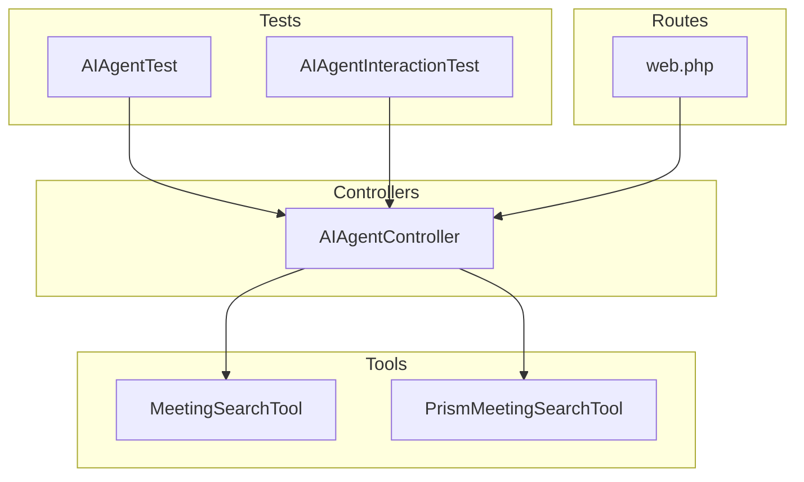
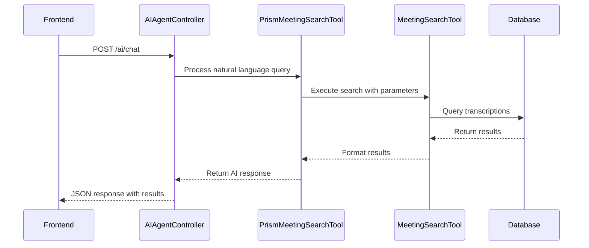
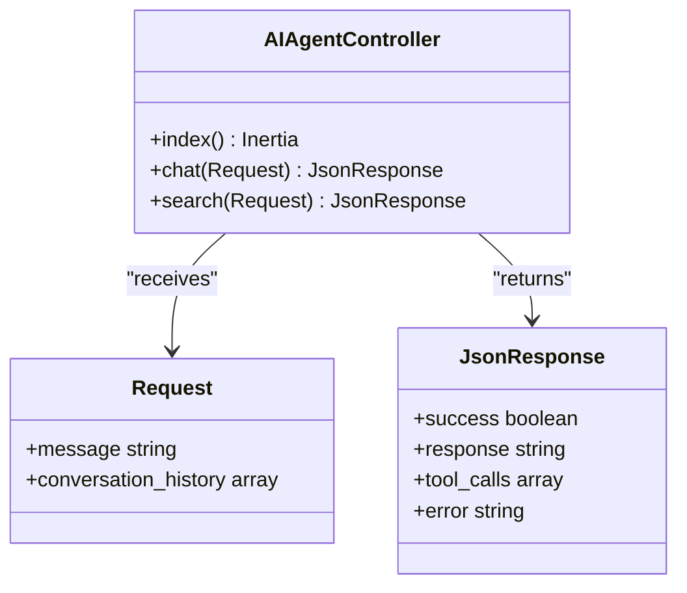
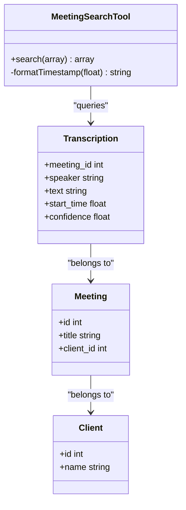
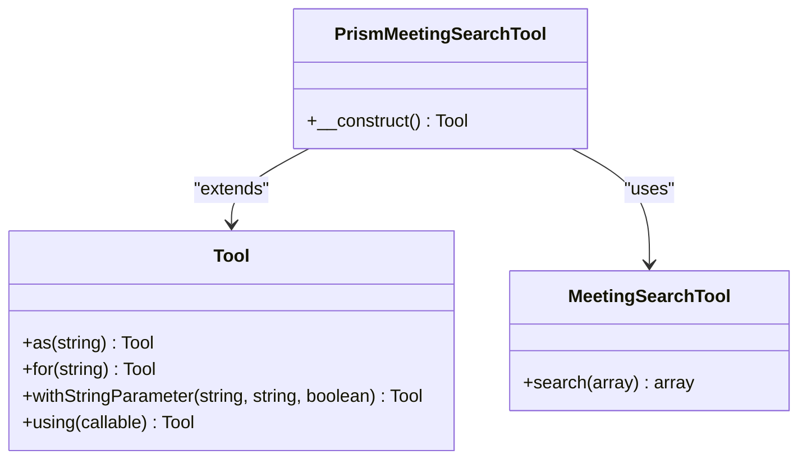
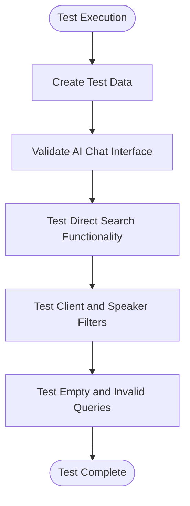
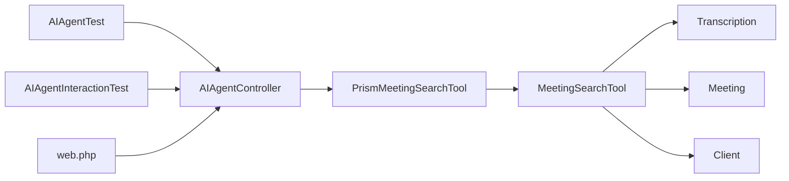
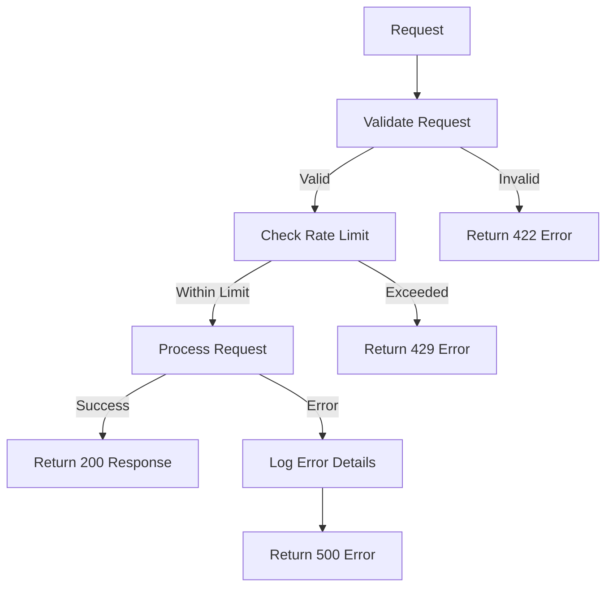

# AI Agent Testing

## Table of Contents
1. [Introduction](#introduction)
2. [Project Structure](#project-structure)
3. [Core Components](#core-components)
4. [Architecture Overview](#architecture-overview)
5. [Detailed Component Analysis](#detailed-component-analysis)
6. [Dependency Analysis](#dependency-analysis)
7. [Performance Considerations](#performance-considerations)
8. [Troubleshooting Guide](#troubleshooting-guide)
9. [Conclusion](#conclusion)

## Introduction
This document provides a comprehensive analysis of the AI agent testing implementation in the MeetingAI application. It focuses on how the system validates the AI chat endpoint and its integration with the Prism AI agent and custom tools. The analysis covers test cases that verify natural language queries are properly routed to the AIAgentController, tools like MeetingSearchTool are correctly invoked, and formatted responses with relevant meeting excerpts are returned. The document also examines how tests validate error handling when external AI services fail and demonstrates testing of context-aware responses and proper data serialization.

## Project Structure
The MeetingAI application follows a standard Laravel project structure with a clear separation of concerns. The AI agent functionality is primarily located in the `app/Http/Controllers`, `app/Tools`, and `tests/Feature` directories. The application uses Pest PHP for testing, with feature tests in the `tests/Feature` directory and browser tests in the `tests/Browser` directory.

**Diagram sources**
- [AIAgentController.php](file://app/Http/Controllers/AIAgentController.php#L1-L183)
- [MeetingSearchTool.php](file://app/Tools/MeetingSearchTool.php#L1-L86)
- [PrismMeetingSearchTool.php](file://app/Tools/PrismMeetingSearchTool.php#L1-L50)
- [AIAgentTest.php](file://tests/Feature/AIAgentTest.php#L1-L142)
- [AIAgentInteractionTest.php](file://tests/Browser/AIAgentInteractionTest.php#L1-L503)
- [web.php](file://routes/web.php#L1-L47)

**Section sources**
- [AIAgentController.php](file://app/Http/Controllers/AIAgentController.php#L1-L183)
- [MeetingSearchTool.php](file://app/Tools/MeetingSearchTool.php#L1-L86)
- [PrismMeetingSearchTool.php](file://app/Tools/PrismMeetingSearchTool.php#L1-L50)
- [AIAgentTest.php](file://tests/Feature/AIAgentTest.php#L1-L142)
- [AIAgentInteractionTest.php](file://tests/Browser/AIAgentInteractionTest.php#L1-L503)
- [web.php](file://routes/web.php#L1-L47)

## Core Components
The AI agent testing system consists of several core components that work together to validate the functionality of the AI chat endpoint. These components include the AIAgentController, which handles incoming requests; the MeetingSearchTool and PrismMeetingSearchTool, which provide search functionality; and the test files that validate the system's behavior.

**Section sources**
- [AIAgentController.php](file://app/Http/Controllers/AIAgentController.php#L1-L183)
- [MeetingSearchTool.php](file://app/Tools/MeetingSearchTool.php#L1-L86)
- [PrismMeetingSearchTool.php](file://app/Tools/PrismMeetingSearchTool.php#L1-L50)
- [AIAgentTest.php](file://tests/Feature/AIAgentTest.php#L1-L142)

## Architecture Overview
The AI agent architecture follows a layered approach with clear separation between the controller, tools, and testing components. The AIAgentController receives requests from the frontend and routes them to the appropriate tools. The MeetingSearchTool provides direct search functionality, while the PrismMeetingSearchTool integrates with the Prism AI agent to enable natural language queries. Tests validate both direct API calls and user interactions through the browser.

**Diagram sources**
- [AIAgentController.php](file://app/Http/Controllers/AIAgentController.php#L1-L183)
- [PrismMeetingSearchTool.php](file://app/Tools/PrismMeetingSearchTool.php#L1-L50)
- [MeetingSearchTool.php](file://app/Tools/MeetingSearchTool.php#L1-L86)

## Detailed Component Analysis

### AIAgentController Analysis
The AIAgentController is responsible for handling AI-related requests in the application. It has two main methods: `index()` which renders the AI chat interface, and `chat()` which processes natural language queries. The controller validates input, implements rate limiting, and handles errors appropriately.

**Diagram sources**
- [AIAgentController.php](file://app/Http/Controllers/AIAgentController.php#L1-L183)

**Section sources**
- [AIAgentController.php](file://app/Http/Controllers/AIAgentController.php#L1-L183)

### MeetingSearchTool Analysis
The MeetingSearchTool provides direct search functionality for meeting transcriptions. It searches through transcription text, supports filtering by client and speaker, and highlights search terms in the results. The tool returns structured data including meeting information, speaker details, and timestamps.

**Diagram sources**
- [MeetingSearchTool.php](file://app/Tools/MeetingSearchTool.php#L1-L86)

**Section sources**
- [MeetingSearchTool.php](file://app/Tools/MeetingSearchTool.php#L1-L86)

### PrismMeetingSearchTool Analysis
The PrismMeetingSearchTool integrates with the Prism AI agent to enable natural language queries. It defines a tool interface that can be used by the AI agent to search through meeting transcriptions. The tool extracts parameters from the AI request, calls the MeetingSearchTool, and formats the results for the AI agent to include in its response.

**Diagram sources**
- [PrismMeetingSearchTool.php](file://app/Tools/PrismMeetingSearchTool.php#L1-L50)
- [MeetingSearchTool.php](file://app/Tools/MeetingSearchTool.php#L1-L86)

**Section sources**
- [PrismMeetingSearchTool.php](file://app/Tools/PrismMeetingSearchTool.php#L1-L50)

### AIAgentTest Analysis
The AIAgentTest file contains feature tests that validate the AI agent functionality. These tests verify that natural language queries are properly routed to the AIAgentController, tools are correctly invoked, and formatted responses are returned. The tests also validate error handling and edge cases.

**Diagram sources**
- [AIAgentTest.php](file://tests/Feature/AIAgentTest.php#L1-L142)

**Section sources**
- [AIAgentTest.php](file://tests/Feature/AIAgentTest.php#L1-L142)

## Dependency Analysis
The AI agent testing system has a clear dependency chain from the frontend to the database. The AIAgentController depends on the PrismMeetingSearchTool, which in turn depends on the MeetingSearchTool. The MeetingSearchTool depends on the database models to retrieve transcription data. Tests depend on all these components to validate the system's behavior.

**Diagram sources**
- [AIAgentTest.php](file://tests/Feature/AIAgentTest.php#L1-L142)
- [AIAgentInteractionTest.php](file://tests/Browser/AIAgentInteractionTest.php#L1-L503)
- [AIAgentController.php](file://app/Http/Controllers/AIAgentController.php#L1-L183)
- [PrismMeetingSearchTool.php](file://app/Tools/PrismMeetingSearchTool.php#L1-L50)
- [MeetingSearchTool.php](file://app/Tools/MeetingSearchTool.php#L1-L86)
- [web.php](file://routes/web.php#L1-L47)

**Section sources**
- [AIAgentTest.php](file://tests/Feature/AIAgentTest.php#L1-L142)
- [AIAgentInteractionTest.php](file://tests/Browser/AIAgentInteractionTest.php#L1-L503)
- [AIAgentController.php](file://app/Http/Controllers/AIAgentController.php#L1-L183)
- [PrismMeetingSearchTool.php](file://app/Tools/PrismMeetingSearchTool.php#L1-L50)
- [MeetingSearchTool.php](file://app/Tools/MeetingSearchTool.php#L1-L86)
- [web.php](file://routes/web.php#L1-L47)

## Performance Considerations
The AI agent testing system includes several performance considerations. The AIAgentController implements rate limiting to prevent abuse, with a limit of 10 requests per minute per IP address. The MeetingSearchTool uses database queries with appropriate indexing and limits the number of results returned. The system also includes logging to monitor processing times and identify potential performance bottlenecks.

**Section sources**
- [AIAgentController.php](file://app/Http/Controllers/AIAgentController.php#L1-L183)
- [MeetingSearchTool.php](file://app/Tools/MeetingSearchTool.php#L1-L86)

## Troubleshooting Guide
The AI agent testing system includes comprehensive error handling to assist with troubleshooting. The AIAgentController catches exceptions and returns appropriate error messages and status codes. For example, it returns a 429 status code for rate limiting, 422 for validation errors, and 500 for internal server errors. The system also logs errors with detailed information including the request message, IP address, and stack trace.

**Diagram sources**
- [AIAgentController.php](file://app/Http/Controllers/AIAgentController.php#L1-L183)

**Section sources**
- [AIAgentController.php](file://app/Http/Controllers/AIAgentController.php#L1-L183)

## Conclusion
The AI agent testing implementation in the MeetingAI application provides comprehensive validation of the AI chat endpoint and its integration with the Prism AI agent and custom tools. The system uses feature tests to verify that natural language queries are properly routed to the AIAgentController, tools like MeetingSearchTool are correctly invoked, and formatted responses with relevant meeting excerpts are returned. The tests also validate error handling when external AI services fail and demonstrate testing of context-aware responses and proper data serialization. The architecture follows a clean separation of concerns with clear dependencies between components, making it maintainable and extensible.

**Referenced Files in This Document**   
- [AIAgentTest.php](file://tests/Feature/AIAgentTest.php)
- [AIAgentController.php](file://app/Http/Controllers/AIAgentController.php)
- [MeetingSearchTool.php](file://app/Tools/MeetingSearchTool.php)
- [PrismMeetingSearchTool.php](file://app/Tools/PrismMeetingSearchTool.php)
- [web.php](file://routes/web.php)
- [AIAgentInteractionTest.php](file://tests/Browser/AIAgentInteractionTest.php)