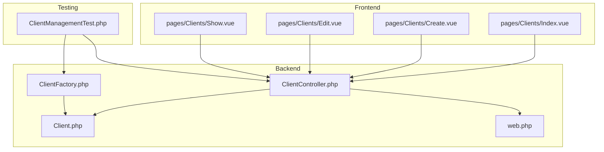
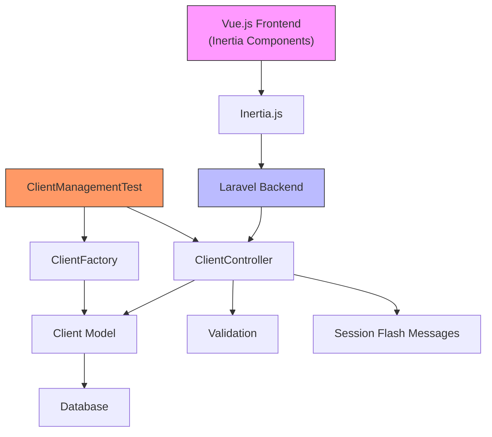
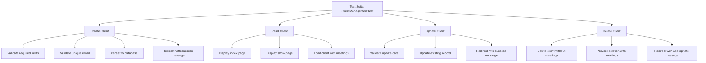
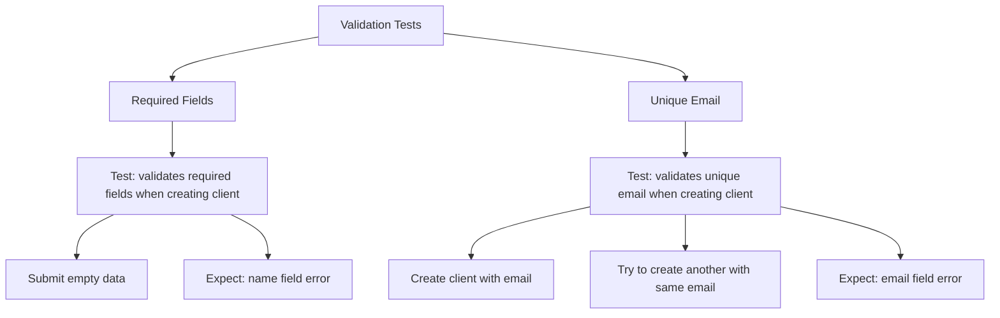
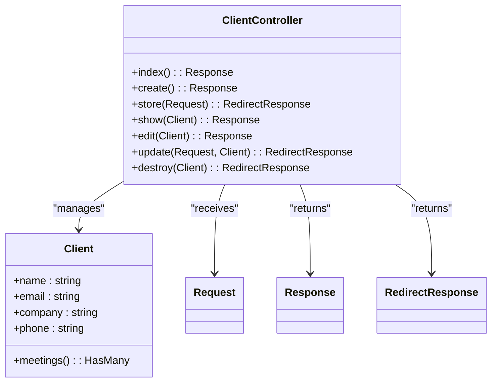
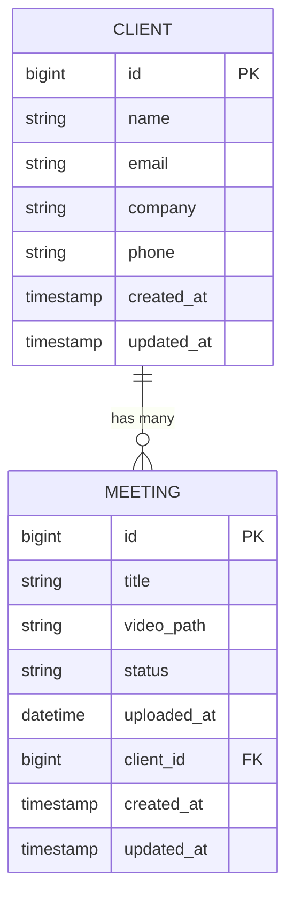
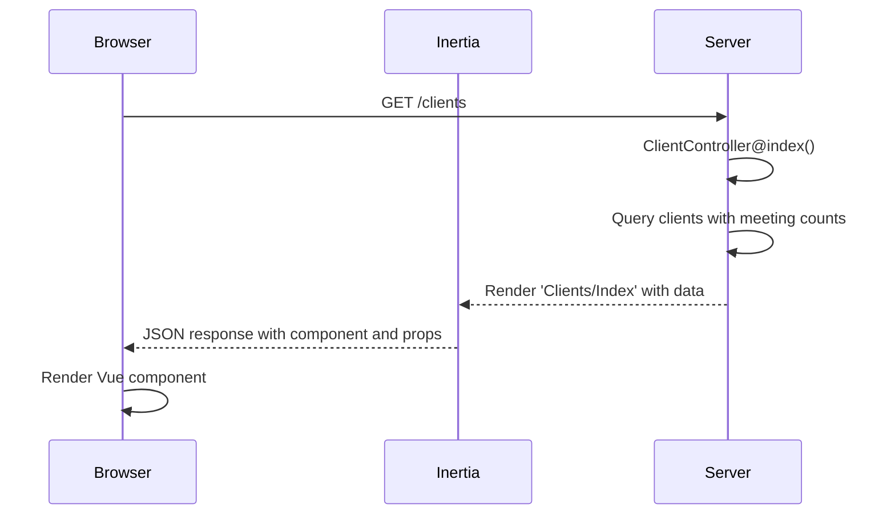
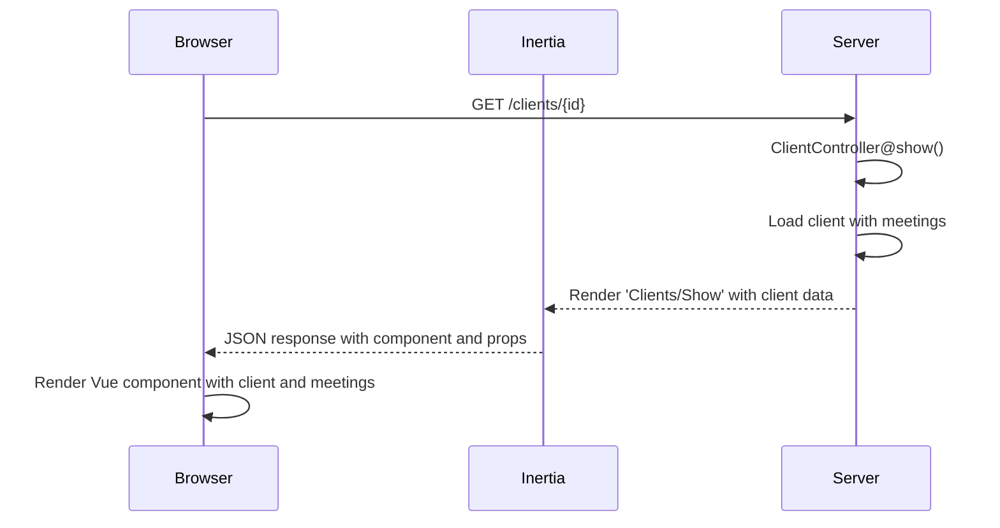
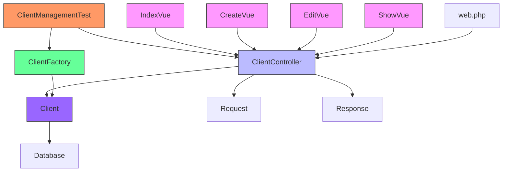

# Client Management Testing


## Table of Contents
1. [Introduction](#introduction)
2. [Project Structure](#project-structure)
3. [Core Components](#core-components)
4. [Architecture Overview](#architecture-overview)
5. [Detailed Component Analysis](#detailed-component-analysis)
6. [Dependency Analysis](#dependency-analysis)
7. [Performance Considerations](#performance-considerations)
8. [Troubleshooting Guide](#troubleshooting-guide)
9. [Conclusion](#conclusion)

## Introduction

This document provides a comprehensive analysis of the `ClientManagementTest` feature test suite, which validates the full CRUD (Create, Read, Update, Delete) lifecycle for Client entities in the application. The test suite ensures that client data can be properly managed through the `ClientController`, with proper validation, authentication protection, database persistence, and business rule enforcement. It also verifies integration with the Vue.js frontend components and ensures data integrity when clients are associated with meetings.

The tests use Laravel Pest syntax and leverage Eloquent factories to seed test data, ensuring isolation and repeatability. Special attention is given to testing protected routes, asserting session messages, validating form inputs, and enforcing business constraints such as preventing deletion of clients with existing meetings.

## Project Structure

The client management functionality is organized across multiple layers of the Laravel application, following a clean separation of concerns between models, controllers, routes, views (Inertia components), and tests.





**Diagram sources**
- [ClientManagementTest.php](file://tests/Feature/ClientManagementTest.php)
- [ClientController.php](file://app/Http/Controllers/ClientController.php)
- [Client.php](file://app/Models/Client.php)
- [ClientFactory.php](file://database/factories/ClientFactory.php)
- [web.php](file://routes/web.php)
- [Index.vue](file://resources/js/pages/Clients/Index.vue)
- [Create.vue](file://resources/js/pages/Clients/Create.vue)
- [Edit.vue](file://resources/js/pages/Clients/Edit.vue)
- [Show.vue](file://resources/js/pages/Clients/Show.vue)

**Section sources**
- [ClientManagementTest.php](file://tests/Feature/ClientManagementTest.php)
- [ClientController.php](file://app/Http/Controllers/ClientController.php)

## Core Components

The core components involved in client management include the `Client` model, `ClientController`, frontend Vue components, routing configuration, and factory classes for test data generation. These components work together to provide a complete client management system with full CRUD operations, validation, and UI integration.

The `ClientManagementTest` suite validates the interaction between these components, ensuring that the system behaves correctly under various scenarios including valid operations, input validation failures, and business rule enforcement.

**Section sources**
- [Client.php](file://app/Models/Client.php)
- [ClientController.php](file://app/Http/Controllers/ClientController.php)
- [ClientFactory.php](file://database/factories/ClientFactory.php)
- [web.php](file://routes/web.php)

## Architecture Overview

The client management system follows a standard MVC (Model-View-Controller) architecture with Inertia.js providing the bridge between the Laravel backend and Vue.js frontend. The architecture ensures clean separation between business logic, data access, and presentation layers.





**Diagram sources**
- [ClientController.php](file://app/Http/Controllers/ClientController.php)
- [Client.php](file://app/Models/Client.php)
- [ClientFactory.php](file://database/factories/ClientFactory.php)
- [web.php](file://routes/web.php)

## Detailed Component Analysis

### Client Management Test Analysis

The `ClientManagementTest` suite comprehensively tests the full CRUD lifecycle for Client entities, ensuring that all operations function correctly and that business rules are enforced.

#### CRUD Operation Testing

The test suite validates each CRUD operation through dedicated test cases:





**Diagram sources**
- [ClientManagementTest.php](file://tests/Feature/ClientManagementTest.php)

#### Test Cases for CRUD Operations

**Section sources**
- [ClientManagementTest.php](file://tests/Feature/ClientManagementTest.php)

##### Creating a Client
The test `can create a new client` verifies that:
- A POST request to `/clients` with valid data creates a new client
- The response redirects to the clients index page
- A success message is stored in the session
- The client data is persisted in the database


```php
it('can create a new client', function () {
    $clientData = [
        'name' => 'New Client',
        'email' => 'new@example.com',
        'company' => 'New Company',
        'phone' => '123-456-7890'
    ];

    $response = $this->post(route('clients.store'), $clientData);

    $response->assertRedirect(route('clients.index'));
    $response->assertSessionHas('success', 'Client created successfully.');
    
    $this->assertDatabaseHas('clients', $clientData);
});
```


##### Reading Clients
The test `can display clients index page` verifies that:
- A GET request to `/clients` returns a 200 status
- The Inertia response uses the 'Clients/Index' component
- The response contains client data with correct values


```php
it('can display clients index page', function () {
    $client = Client::factory()->create([
        'name' => 'Test Client',
        'email' => 'test@example.com',
        'company' => 'Test Company'
    ]);

    $response = $this->get(route('clients.index'));

    $response->assertStatus(200);
    $response->assertInertia(fn ($page) => 
        $page->component('Clients/Index')
             ->has('clients', 1)
             ->where('clients.0.name', 'Test Client')
    );
});
```


##### Updating a Client
The test `can update an existing client` verifies that:
- A PUT request to `/clients/{client}` updates the client
- The response redirects to the clients index page
- A success message is stored in the session
- The updated data is persisted in the database


```php
it('can update an existing client', function () {
    $client = Client::factory()->create([
        'name' => 'Original Name',
        'email' => 'original@example.com'
    ]);

    $updateData = [
        'name' => 'Updated Name',
        'email' => 'updated@example.com',
        'company' => 'Updated Company',
        'phone' => '987-654-3210'
    ];

    $response = $this->put(route('clients.update', $client), $updateData);

    $response->assertRedirect(route('clients.index'));
    $response->assertSessionHas('success', 'Client updated successfully.');
    
    $this->assertDatabaseHas('clients', array_merge(['id' => $client->id], $updateData));
});
```


##### Deleting a Client
The test suite includes two scenarios for deletion:

**Successful Deletion** - when no meetings exist:

```php
it('can delete a client without meetings', function () {
    $client = Client::factory()->create();

    $response = $this->delete(route('clients.destroy', $client));

    $response->assertRedirect(route('clients.index'));
    $response->assertSessionHas('success', 'Client deleted successfully.');
    
    $this->assertDatabaseMissing('clients', ['id' => $client->id]);
});
```


**Prevented Deletion** - when meetings exist:

```php
it('cannot delete a client with meetings', function () {
    $client = Client::factory()->create();
    $client->meetings()->create([
        'title' => 'Test Meeting',
        'video_path' => 'test/path.mp4',
        'status' => 'pending',
        'uploaded_at' => now()
    ]);

    $response = $this->delete(route('clients.destroy', $client));

    $response->assertRedirect(route('clients.index'));
    $response->assertSessionHas('error', 'Cannot delete client with existing meetings.');
    
    $this->assertDatabaseHas('clients', ['id' => $client->id]);
});
```


#### Validation Rule Testing

The test suite includes specific tests for validation rules:





**Diagram sources**
- [ClientManagementTest.php](file://tests/Feature/ClientManagementTest.php)
- [ClientController.php](file://app/Http/Controllers/ClientController.php)

**Section sources**
- [ClientManagementTest.php](file://tests/Feature/ClientManagementTest.php)

### Client Controller Implementation

The `ClientController` implements the CRUD operations tested in `ClientManagementTest`. It follows Laravel conventions and uses Inertia for frontend integration.





**Diagram sources**
- [ClientController.php](file://app/Http/Controllers/ClientController.php)
- [Client.php](file://app/Models/Client.php)

**Section sources**
- [ClientController.php](file://app/Http/Controllers/ClientController.php)

#### Controller Methods

The controller methods correspond directly to the test cases:

- **index()**: Returns all clients with meeting counts
- **create()**: Returns the create form view
- **store()**: Validates and creates a new client
- **show()**: Returns a client with associated meetings
- **edit()**: Returns the edit form view
- **update()**: Validates and updates an existing client  
- **destroy()**: Deletes a client if no meetings exist

The validation rules in the `store` and `update` methods match those tested in the feature tests, ensuring that required fields are present and email addresses are unique.

### Client Model and Relationships

The `Client` model defines the data structure and relationships for client entities.





**Diagram sources**
- [Client.php](file://app/Models/Client.php)

**Section sources**
- [Client.php](file://app/Models/Client.php)

The model includes:
- Fillable attributes for mass assignment
- A `meetings()` relationship method that defines a one-to-many relationship with the `Meeting` model
- Proper Eloquent integration for database operations

### Factory Pattern for Test Data

The `ClientFactory` class enables the creation of consistent test data for the feature tests.


```php
class ClientFactory extends Factory
{
    protected $model = Client::class;

    public function definition(): array
    {
        return [
            'name' => fake()->name(),
            'email' => fake()->unique()->safeEmail(),
            'company' => fake()->company(),
            'phone' => fake()->phoneNumber(),
        ];
    }

    public function withoutEmail(): static
    {
        return $this->state(fn (array $attributes) => [
            'email' => null,
        ]);
    }
}
```


The factory provides:
- Realistic fake data using Laravel's faker integration
- State modifiers for specific test scenarios
- Consistent data generation across tests

**Section sources**
- [ClientFactory.php](file://database/factories/ClientFactory.php)

### Routing Configuration

The web routes are configured using Laravel's resource routing, which automatically creates RESTful routes for the client management functionality.


```php
Route::resource('clients', ClientController::class);
```


This creates the following routes:
- `GET /clients` → `index()`
- `GET /clients/create` → `create()`
- `POST /clients` → `store()`
- `GET /clients/{client}` → `show()`  
- `GET /clients/{client}/edit` → `edit()`
- `PUT/PATCH /clients/{client}` → `update()`
- `DELETE /clients/{client}` → `destroy()`

**Section sources**
- [web.php](file://routes/web.php)

### Frontend Integration

The Vue.js components integrate with the backend API through Inertia.js, providing a seamless user experience.

#### Index Component
The `Index.vue` component displays all clients in a table format and provides links to create, view, edit, and delete clients.





**Diagram sources**
- [Index.vue](file://resources/js/pages/Clients/Index.vue)
- [ClientController.php](file://app/Http/Controllers/ClientController.php)

#### Create and Edit Components
The `Create.vue` and `Edit.vue` components handle form submission through Inertia's form helper, which automatically handles the POST/PUT requests and validation errors.


```javascript
const form = useForm({
  name: '',
  email: '',
  company: '',
  phone: '',
})

const submit = () => {
  form.post(route('clients.store'))
}
```


The components display validation errors and provide appropriate user feedback.

**Section sources**
- [Create.vue](file://resources/js/pages/Clients/Create.vue)
- [Edit.vue](file://resources/js/pages/Clients/Edit.vue)

#### Show Component
The `Show.vue` component displays client details and their associated meetings, demonstrating the relationship between clients and meetings.





**Diagram sources**
- [Show.vue](file://resources/js/pages/Clients/Show.vue)
- [ClientController.php](file://app/Http/Controllers/ClientController.php)

## Dependency Analysis

The client management system has a clear dependency structure that ensures separation of concerns while maintaining necessary connections between components.





**Diagram sources**
- [ClientManagementTest.php](file://tests/Feature/ClientManagementTest.php)
- [ClientController.php](file://app/Http/Controllers/ClientController.php)
- [Client.php](file://app/Models/Client.php)
- [ClientFactory.php](file://database/factories/ClientFactory.php)
- [web.php](file://routes/web.php)
- [Index.vue](file://resources/js/pages/Clients/Index.vue)
- [Create.vue](file://resources/js/pages/Clients/Create.vue)
- [Edit.vue](file://resources/js/pages/Clients/Edit.vue)
- [Show.vue](file://resources/js/pages/Clients/Show.vue)

**Section sources**
- [ClientManagementTest.php](file://tests/Feature/ClientManagementTest.php)
- [ClientController.php](file://app/Http/Controllers/ClientController.php)

## Performance Considerations

The client management system includes several performance optimizations:

1. **Eager Loading**: The `index()` method uses `withCount('meetings')` to avoid N+1 query problems when displaying meeting counts.
2. **Database Indexing**: The email field has a unique constraint, which creates a database index for faster lookups during validation.
3. **Efficient Queries**: The `show()` method loads meetings with a descending order by creation date, optimizing for the most relevant data.
4. **Caching Opportunities**: Session flash messages are used for success/error notifications, reducing the need for additional API calls.

These optimizations ensure that the client management functionality remains responsive even as the number of clients and meetings grows.

## Troubleshooting Guide

Common issues and their solutions:

**Validation Errors Not Displaying**
- Ensure the form uses Inertia's `useForm` helper
- Verify that error messages are properly bound in the Vue template
- Check that the controller returns proper validation responses

**Deletion Not Working**
- Verify that the client has no associated meetings
- Check that the DELETE route is properly configured
- Ensure the CSRF token is included in the request

**Data Not Persisting**
- Confirm that the model's `$fillable` array includes all necessary attributes
- Check that validation rules are not blocking the request
- Verify database connection and permissions

**Frontend-Backend Integration Issues**
- Ensure Inertia is properly configured
- Verify route names match between frontend and backend
- Check that the correct HTTP methods are used for each operation

**Section sources**
- [ClientManagementTest.php](file://tests/Feature/ClientManagementTest.php)
- [ClientController.php](file://app/Http/Controllers/ClientController.php)
- [Create.vue](file://resources/js/pages/Clients/Create.vue)
- [Edit.vue](file://resources/js/pages/Clients/Edit.vue)

## Conclusion

The `ClientManagementTest` suite provides comprehensive coverage of the client management functionality, validating the full CRUD lifecycle with proper validation, business rules, and integration with the Vue.js frontend. The tests ensure that client data is properly managed, that business constraints are enforced (such as preventing deletion of clients with meetings), and that users receive appropriate feedback through session messages.

The architecture follows Laravel best practices with clean separation of concerns between models, controllers, views, and tests. The use of Eloquent factories ensures consistent test data, while Inertia.js provides seamless integration between the Laravel backend and Vue.js frontend.

This testing approach provides confidence in the reliability and correctness of the client management system, ensuring that it meets both functional requirements and business rules.

**Referenced Files in This Document**   
- [ClientManagementTest.php](file://tests/Feature/ClientManagementTest.php)
- [ClientController.php](file://app/Http/Controllers/ClientController.php)
- [Client.php](file://app/Models/Client.php)
- [ClientFactory.php](file://database/factories/ClientFactory.php)
- [web.php](file://routes/web.php)
- [Index.vue](file://resources/js/pages/Clients/Index.vue)
- [Create.vue](file://resources/js/pages/Clients/Create.vue)
- [Edit.vue](file://resources/js/pages/Clients/Edit.vue)
- [Show.vue](file://resources/js/pages/Clients/Show.vue)