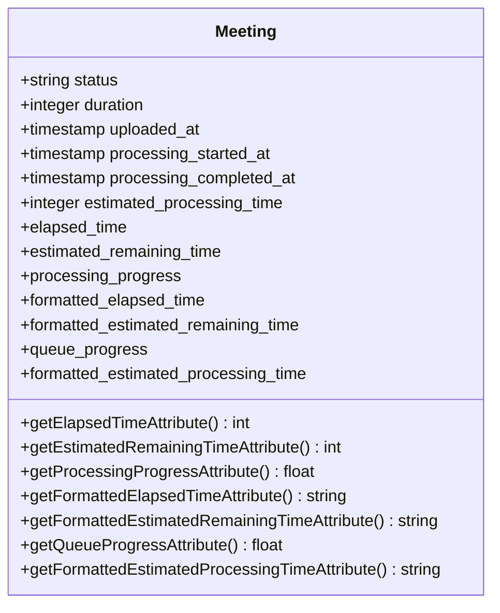
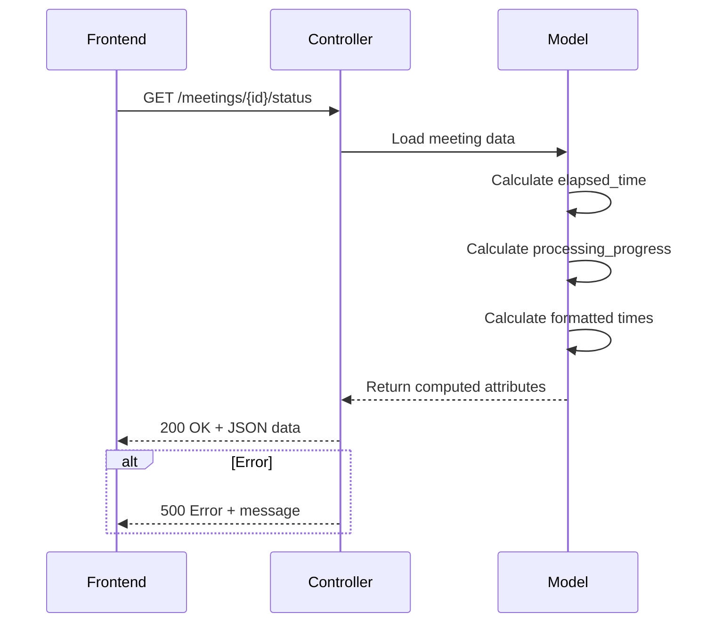
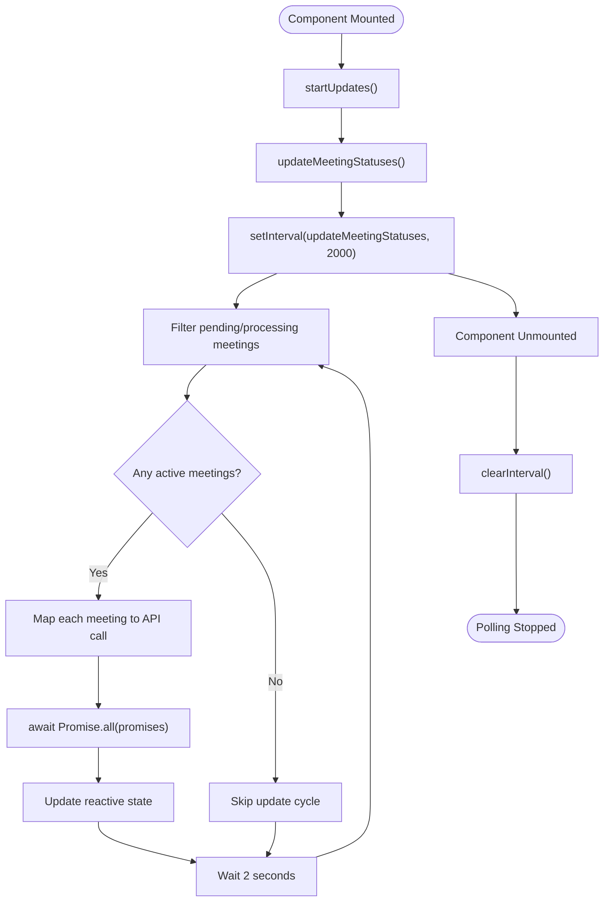
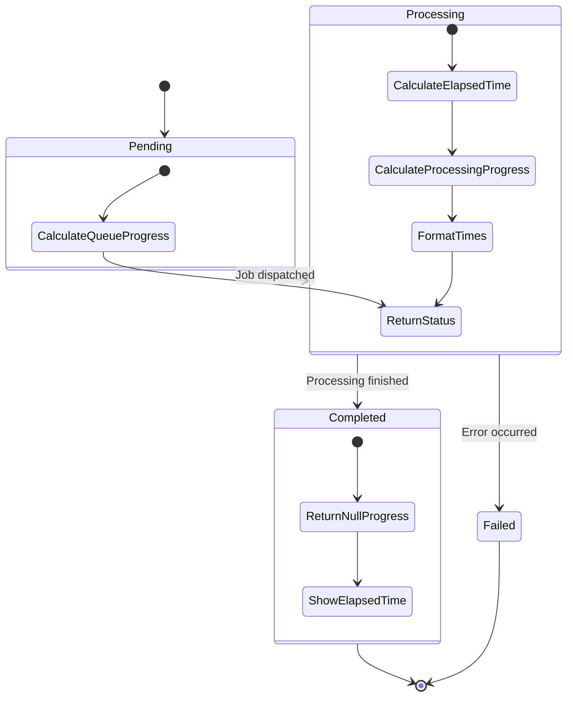

# Real-Time Status Testing


## Table of Contents
1. [Introduction](#introduction)
2. [Core Components](#core-components)
3. [Architecture Overview](#architecture-overview)
4. [Detailed Component Analysis](#detailed-component-analysis)
5. [Real-Time Status Testing Strategy](#real-time-status-testing-strategy)
6. [Test Case Implementation](#test-case-implementation)
7. [Edge Case Handling](#edge-case-handling)
8. [Frontend Integration Testing](#frontend-integration-testing)
9. [Conclusion](#conclusion)

## Introduction
The RealTimeStatusTest feature validates the real-time progress tracking system for meeting processing in the MeetingAI application. This document provides a comprehensive analysis of how the system enables frontend clients to poll or receive updates about a meeting's processing status, including estimated processing time, current status, and progress percentage. The testing framework ensures that both backend status calculations and frontend progress indicators function correctly across various meeting states (pending, processing, completed, failed). The implementation uses a combination of model attributes, API endpoints, and frontend polling mechanisms to deliver accurate, real-time status updates to users.

## Core Components
The real-time status tracking system consists of several interconnected components that work together to provide accurate progress information. These include the Meeting model with computed status attributes, the MeetingController that exposes status via API, the TranscribeMeetingJob that updates status during processing, and frontend components that display and update progress indicators. The system is designed to handle both queue progress (for pending meetings) and processing progress (for active meetings), with appropriate formatting and error handling.

**Section sources**
- [Meeting.php](file://app/Models/Meeting.php#L1-L178)
- [MeetingController.php](file://app/Http/Controllers/MeetingController.php#L1-L304)
- [TranscribeMeetingJob.php](file://app/Jobs/TranscribeMeetingJob.php#L1-L400)
- [useRealTimeUpdates.ts](file://resources/js/lib/useRealTimeUpdates.ts#L1-L87)

## Architecture Overview


```mermaid
graph TB
subgraph "Frontend"
A[MeetingProgressIndicator.vue]
B[useRealTimeUpdates.ts]
C[Browser]
end
subgraph "Backend"
D[MeetingController]
E[Meeting Model]
F[TranscribeMeetingJob]
end
subgraph "Database"
G[Meetings Table]
end
C --> B
B --> |Polls every 2s| D
D --> |GET /meetings/{id}/status| E
E --> G
F --> |Updates status| E
E --> |Returns status data| D
D --> |JSON response| B
B --> |Updates state| A
A --> |Visual progress| C
style A fill:#f9f,stroke:#333
style B fill:#f9f,stroke:#333
style C fill:#f9f,stroke:#333
style D fill:#bbf,stroke:#333
style E fill:#bbf,stroke:#333
style F fill:#bbf,stroke:#333
style G fill:#bbf,stroke:#333
```


**Diagram sources**
- [Meeting.php](file://app/Models/Meeting.php#L1-L178)
- [MeetingController.php](file://app/Http/Controllers/MeetingController.php#L1-L304)
- [useRealTimeUpdates.ts](file://resources/js/lib/useRealTimeUpdates.ts#L1-L87)
- [MeetingProgressIndicator.vue](file://resources/js/lib/MeetingProgressIndicator.vue#L1-L100)

## Detailed Component Analysis

### Meeting Model Analysis
The Meeting model implements several computed attributes that provide real-time status information. These attributes are defined as appended accessors and calculate progress based on timestamps and duration.





**Diagram sources**
- [Meeting.php](file://app/Models/Meeting.php#L1-L178)

**Section sources**
- [Meeting.php](file://app/Models/Meeting.php#L1-L178)

### API Endpoint Analysis
The status endpoint in MeetingController provides a JSON API for retrieving real-time meeting status. This endpoint is specifically designed for frontend polling and returns a comprehensive set of status fields.





**Diagram sources**
- [MeetingController.php](file://app/Http/Controllers/MeetingController.php#L285-L304)
- [Meeting.php](file://app/Models/Meeting.php#L1-L178)

**Section sources**
- [MeetingController.php](file://app/Http/Controllers/MeetingController.php#L285-L304)
- [web.php](file://routes/web.php#L44-L45)

### Frontend Integration Analysis
The frontend uses a composable pattern with useRealTimeUpdates.ts to manage real-time status polling. This hook automatically updates meeting status every 2 seconds for active meetings.





**Diagram sources**
- [useRealTimeUpdates.ts](file://resources/js/lib/useRealTimeUpdates.ts#L1-L87)
- [MeetingProgressIndicator.vue](file://resources/js/lib/MeetingProgressIndicator.vue#L1-L100)

**Section sources**
- [useRealTimeUpdates.ts](file://resources/js/lib/useRealTimeUpdates.ts#L1-L87)
- [MeetingProgressIndicator.vue](file://resources/js/lib/MeetingProgressIndicator.vue#L1-L100)

## Real-Time Status Testing Strategy
The RealTimeStatusTest.php file contains a comprehensive suite of tests that validate the real-time status tracking functionality. These tests verify that the system correctly calculates and formats time and progress data for meetings in various states. The testing strategy focuses on both happy paths and edge cases, ensuring robustness in the status tracking system.

The tests validate several key aspects:
- Elapsed time calculation for processing meetings
- Queue progress calculation for pending meetings
- Null progress values for completed meetings
- Edge case handling (missing timestamps, null durations)
- Time formatting consistency





**Diagram sources**
- [RealTimeStatusTest.php](file://tests/Feature/RealTimeStatusTest.php#L1-L84)
- [Meeting.php](file://app/Models/Meeting.php#L1-L178)

**Section sources**
- [RealTimeStatusTest.php](file://tests/Feature/RealTimeStatusTest.php#L1-L84)

## Test Case Implementation
The RealTimeStatusTest.php implementation uses Pest PHP testing framework to define clear, readable test cases for real-time status functionality. Each test creates meeting instances with specific states and verifies the computed status attributes.

### Elapsed Time Calculation Test
Verifies that processing meetings correctly calculate elapsed time since processing started:


```php
it('calculates elapsed time correctly for processing meetings', function () {
    $meeting = Meeting::factory()->create([
        'status' => 'processing',
        'processing_started_at' => now()->subMinutes(2),
        'duration' => 1800,
        'estimated_processing_time' => 30
    ]);

    expect($meeting->elapsed_time)->toBeGreaterThan(100);
    expect($meeting->formatted_elapsed_time)->toMatch('/\d+:\d{2}/');
    expect($meeting->processing_progress)->toBeGreaterThan(0);
});
```


### Queue Progress Test
Validates that pending meetings show appropriate queue progress based on time since upload:


```php
it('calculates queue progress for pending meetings', function () {
    $meeting = Meeting::factory()->create([
        'status' => 'pending',
        'uploaded_at' => now()->subSeconds(15),
        'estimated_processing_time' => 30
    ]);

    expect($meeting->queue_progress)->toBeGreaterThan(0);
    expect($meeting->queue_progress)->toBeLessThanOrEqual(100);
});
```


### Completed Meeting Test
Ensures completed meetings return null for progress values while still showing elapsed time:


```php
it('returns null progress for completed meetings', function () {
    $meeting = Meeting::factory()->create([
        'status' => 'completed',
        'processing_started_at' => now()->subMinutes(5),
        'processing_completed_at' => now()->subMinutes(2)
    ]);

    expect($meeting->processing_progress)->toBeNull();
    expect($meeting->queue_progress)->toBeNull();
    expect($meeting->elapsed_time)->toBeGreaterThan(0);
});
```


### Edge Case Handling Test
Tests robustness by verifying behavior with incomplete data:


```php
it('handles edge cases in progress calculations', function () {
    // Meeting without processing_started_at
    $meeting1 = Meeting::factory()->create([
        'status' => 'processing',
        'processing_started_at' => null
    ]);
    
    expect($meeting1->elapsed_time)->toBeNull();
    expect($meeting1->processing_progress)->toBeNull();
    
    // Meeting without duration
    $meeting2 = Meeting::factory()->create([
        'status' => 'processing',
        'processing_started_at' => now()->subMinutes(1),
        'duration' => null
    ]);
    
    expect($meeting2->processing_progress)->toBeNull();
});
```


### Time Formatting Test
Confirms consistent time formatting for display purposes:


```php
it('formats time correctly', function () {
    $meeting = Meeting::factory()->create([
        'status' => 'processing',
        'processing_started_at' => now()->subSeconds(125),
        'duration' => 3600
    ]);

    expect($meeting->formatted_elapsed_time)->toBe('2:05');
    expect($meeting->formatted_estimated_remaining_time)->toMatch('/\d+:\d{2}/');
});
```


**Section sources**
- [RealTimeStatusTest.php](file://tests/Feature/RealTimeStatusTest.php#L1-L84)
- [Meeting.php](file://app/Models/Meeting.php#L1-L178)

## Edge Case Handling
The real-time status system includes comprehensive edge case handling to ensure reliability under various conditions. The tests validate several critical edge cases:

### Missing Timestamps
When a processing meeting lacks a processing_started_at timestamp, the system returns null for elapsed time and processing progress, preventing incorrect calculations.

### Null Duration
For meetings with null duration values, the processing progress calculation returns null since progress cannot be determined without knowing the total duration.

### Completed Meetings
Completed meetings return null for both processing and queue progress values, as progress tracking is no longer relevant. However, elapsed time remains available for display.

### Failed Meetings
The system handles failed meetings gracefully by preserving the processing_started_at timestamp and calculating elapsed time up to the point of failure, providing users with information about how long processing attempted to run.

### Rapid Status Changes
The frontend polling mechanism is designed to handle rapid status changes (e.g., from pending to processing) by updating the displayed progress indicator accordingly, switching from queue progress to processing progress.

**Section sources**
- [RealTimeStatusTest.php](file://tests/Feature/RealTimeStatusTest.php#L58-L84)
- [Meeting.php](file://app/Models/Meeting.php#L1-L178)
- [TranscribeMeetingJob.php](file://app/Jobs/TranscribeMeetingJob.php#L1-L400)

## Frontend Integration Testing
The system's real-time status functionality is validated through integration between backend API endpoints and frontend components. The testing approach ensures seamless interaction across the entire stack.

### API Endpoint Validation
The status endpoint returns a consistent JSON structure that includes all necessary fields for frontend progress indicators:


```json
{
  "success": true,
  "data": {
    "id": 123,
    "status": "processing",
    "elapsed_time": 125,
    "estimated_remaining_time": 5,
    "processing_progress": 95.8,
    "formatted_elapsed_time": "2:05",
    "formatted_estimated_remaining_time": "0:05",
    "queue_progress": null,
    "formatted_estimated_processing_time": "3:00"
  }
}
```


### Polling Mechanism
The useRealTimeUpdates composable implements an efficient polling mechanism that:
- Updates immediately when mounted
- Polls every 2 seconds for active meetings
- Only requests status for pending or processing meetings
- Preserves existing meeting data while merging updates
- Automatically cleans up interval on component unmount

### Visual Feedback
The MeetingProgressIndicator component provides clear visual feedback based on meeting status:
- **Pending**: Yellow progress bar showing queue position
- **Processing**: Blue progress bar showing processing completion percentage
- **Completed**: Green checkmark with processing duration
- **Failed**: Red warning icon with error message

The component uses smooth CSS transitions (transition-all duration-500 ease-out) to provide a fluid user experience as progress updates.

**Section sources**
- [MeetingController.php](file://app/Http/Controllers/MeetingController.php#L285-L304)
- [useRealTimeUpdates.ts](file://resources/js/lib/useRealTimeUpdates.ts#L1-L87)
- [MeetingProgressIndicator.vue](file://resources/js/lib/MeetingProgressIndicator.vue#L1-L100)
- [web.php](file://routes/web.php#L44-L45)

## Conclusion
The RealTimeStatusTest feature provides comprehensive validation of the meeting processing status tracking system. The implementation successfully enables real-time progress monitoring through a well-designed combination of backend calculations, API endpoints, and frontend components. The testing strategy covers both normal operation and edge cases, ensuring reliability across various scenarios. Key strengths include the separation of queue progress and processing progress, consistent time formatting, and robust error handling. The system effectively simulates real-time updates through periodic polling, providing users with accurate information about their meeting processing status. This implementation serves as a solid foundation for real-time status tracking that could be extended with WebSocket support for even more immediate updates in the future.

**Referenced Files in This Document**   
- [RealTimeStatusTest.php](file://tests/Feature/RealTimeStatusTest.php)
- [Meeting.php](file://app/Models/Meeting.php)
- [MeetingController.php](file://app/Http/Controllers/MeetingController.php)
- [useRealTimeUpdates.ts](file://resources/js/lib/useRealTimeUpdates.ts)
- [MeetingProgressIndicator.vue](file://resources/js/lib/MeetingProgressIndicator.vue)
- [web.php](file://routes/web.php)
- [TranscribeMeetingJob.php](file://app/Jobs/TranscribeMeetingJob.php)
- [2025_08_10_145951_add_estimated_processing_time_to_meetings_table.php](file://database/migrations/2025_08_10_145951_add_estimated_processing_time_to_meetings_table.php)
- [2025_08_10_160251_add_error_fields_to_meetings_table.php](file://database/migrations/2025_08_10_160251_add_error_fields_to_meetings_table.php)