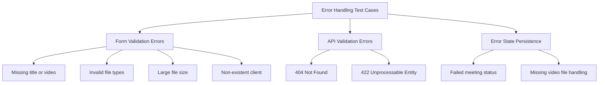
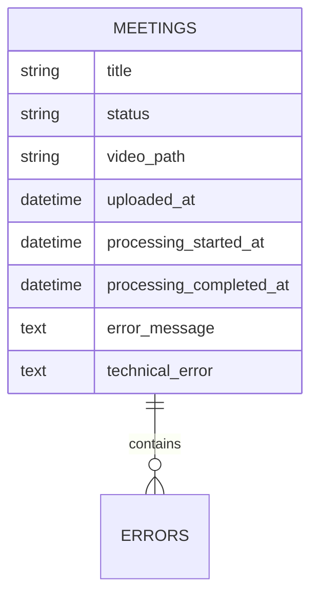
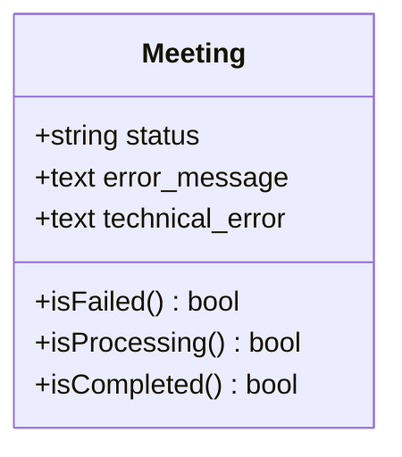
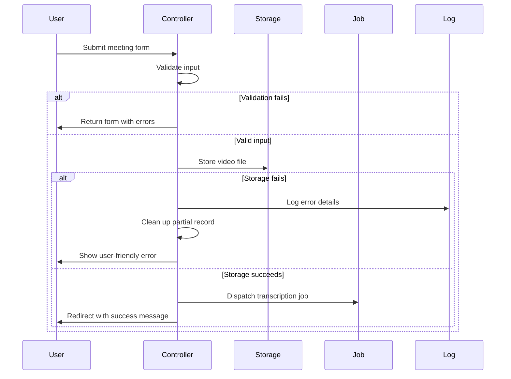
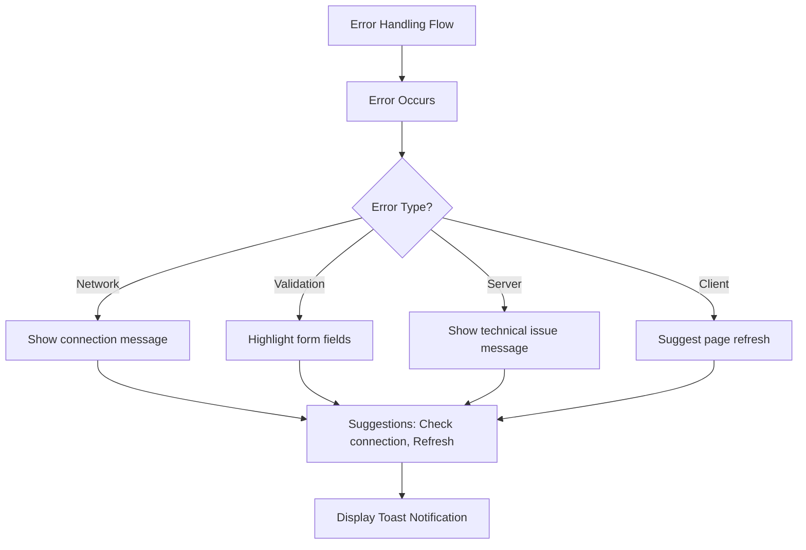

# Error Handling Testing


## Table of Contents
1. [Introduction](#introduction)
2. [Error Handling Test Cases](#error-handling-test-cases)
3. [Database Schema for Error Storage](#database-schema-for-error-storage)
4. [Meeting Model Error Properties](#meeting-model-error-properties)
5. [Backend Error Handling in Controller](#backend-error-handling-in-controller)
6. [Frontend Error Handling and User Experience](#frontend-error-handling-and-user-experience)
7. [Best Practices for Error Handling Testing](#best-practices-for-error-handling-testing)

## Introduction
The ErrorHandlingTest suite ensures the application's resilience and proper error reporting across both frontend and backend components. This document details how the system handles various failure scenarios including invalid file uploads, validation errors, missing resources, and internal processing failures. The test suite validates that appropriate HTTP status codes are returned, error responses follow a consistent format, and user-friendly messages are displayed without exposing sensitive system information. The system implements a comprehensive error handling strategy that captures both user-facing messages and technical details for debugging.

## Error Handling Test Cases

The `ErrorHandlingTest.php` file contains a comprehensive suite of tests that validate the application's behavior under various error conditions. These tests cover form validation, API responses, and error state persistence.





**Diagram sources**
- [ErrorHandlingTest.php](file://tests/Feature/ErrorHandlingTest.php#L1-L143)

**Section sources**
- [ErrorHandlingTest.php](file://tests/Feature/ErrorHandlingTest.php#L1-L143)

### Form Validation Error Tests
The test suite validates that the application properly handles form submission errors with appropriate user feedback:

- **Missing required fields**: The test `handles meeting upload validation errors gracefully` verifies that submissions without a title or video file result in session error messages for both `title` and `video` fields.
- **Invalid file types**: The test `handles invalid file types with proper error messages` confirms that uploading non-video files (e.g., PDF) triggers validation errors with specific messaging indicating accepted formats (MP4, MOV, AVI, WebM).
- **File size violations**: The test `handles file size validation errors` ensures files exceeding the 500MB limit are rejected with appropriate validation feedback.
- **Invalid relationships**: The test `handles missing client validation` validates that attempts to associate meetings with non-existent clients are properly rejected.

### API Error Response Tests
The suite includes tests for proper API error responses:

- **Resource not found**: The test `returns proper error response for meeting status API` verifies that requests for non-existent meetings return HTTP 404 status.
- **Input validation**: Tests `handles AI chat validation errors` and `handles AI chat with too long message` confirm that API endpoints return HTTP 422 status for invalid input, with proper JSON validation error structures.

### Error State and Recovery Tests
The test suite validates how the system handles and displays error states:

- **Error information storage**: The test `stores error information when meeting processing fails` verifies that meetings in a failed state properly store both user-facing error messages and technical error details.
- **Graceful degradation**: The test `handles meeting show with missing video file gracefully` ensures the application continues to function even when video files are missing, displaying appropriate error indicators in the UI.
- **Status API error context**: The test `provides proper error context in meeting status response` confirms that the status endpoint returns a consistent JSON structure even during processing states.

## Database Schema for Error Storage

The database schema includes specific fields for storing error information when meeting processing fails. These fields were added through a dedicated migration to support comprehensive error tracking.





**Diagram sources**
- [2025_08_10_160251_add_error_fields_to_meetings_table.php](file://database/migrations/2025_08_10_160251_add_error_fields_to_meetings_table.php#L1-L28)

**Section sources**
- [2025_08_10_160251_add_error_fields_to_meetings_table.php](file://database/migrations/2025_08_10_160251_add_error_fields_to_meetings_table.php#L1-L28)

The migration `2025_08_10_160251_add_error_fields_to_meetings_table.php` adds two nullable text fields to the meetings table:

- **error_message**: Stores user-friendly error descriptions that can be displayed in the UI
- **technical_error**: Contains detailed technical information for debugging purposes

Both fields are added after the `processing_completed_at` timestamp and are designed to capture the nature of any processing failures. The fields are nullable since most meetings will complete successfully without generating errors.

## Meeting Model Error Properties

The Meeting model implements several properties and methods that support error handling and status tracking.





**Diagram sources**
- [Meeting.php](file://app/Models/Meeting.php#L1-L178)

**Section sources**
- [Meeting.php](file://app/Models/Meeting.php#L1-L178)

### Status Check Methods
The model provides convenient methods to check the current status of a meeting:

- **isFailed()**: Returns true if the meeting status is 'failed', indicating a processing error occurred
- **isProcessing()**: Returns true if the status is 'processing', indicating active transcription
- **isCompleted()**: Returns true if the status is 'completed', indicating successful processing

### Error Field Management
The model includes the error fields in its `$fillable` array, allowing them to be mass-assigned during creation or updates:


```php
protected $fillable = [
    'client_id',
    'title',
    'video_path',
    'status',
    'duration',
    'estimated_processing_time',
    'uploaded_at',
    'processing_started_at',
    'processing_completed_at',
    'error_message',
    'technical_error',
];
```


This design allows the system to store error details when processing fails, providing both user-facing and technical information for troubleshooting.

## Backend Error Handling in Controller

The MeetingController implements comprehensive error handling for all meeting-related operations, particularly during the upload and processing workflow.





**Diagram sources**
- [MeetingController.php](file://app/Http/Controllers/MeetingController.php#L1-L304)

**Section sources**
- [MeetingController.php](file://app/Http/Controllers/MeetingController.php#L1-L304)

### Upload Process Error Handling
The `store` method in MeetingController implements a try-catch block that handles various error scenarios:

1. **Validation exceptions**: Laravel's built-in validation exceptions are re-thrown to be handled by the framework's error handling system
2. **Runtime exceptions**: Specific runtime errors (e.g., corrupted files, insufficient storage) are caught and result in user-friendly error messages
3. **General exceptions**: All other exceptions are caught, logged with full trace information, and result in a generic error message to avoid exposing system details

The controller also implements cleanup logic to delete partially created meeting records if an error occurs after the record is created but before processing completes.

### Status Endpoint Error Handling
The `status` method provides real-time updates on meeting processing and includes error handling:

- On success: Returns a JSON response with comprehensive status information including progress metrics
- On failure: Returns a 500 error response with a generic error message, while logging detailed technical information for debugging

This approach ensures that the frontend can provide meaningful feedback to users while protecting sensitive system information.

## Frontend Error Handling and User Experience

The frontend implements a sophisticated error handling system through the errorHandler.ts module, providing consistent user experiences across different error types.





**Diagram sources**
- [errorHandler.ts](file://resources/js/lib/errorHandler.ts#L1-L325)

**Section sources**
- [errorHandler.ts](file://resources/js/lib/errorHandler.ts#L1-L325)

### Error Categorization
The ErrorHandler class categorizes errors into five types:

- **Network**: Connection issues, handled with suggestions to check internet connectivity
- **Validation**: Form or input errors, with guidance to review form fields
- **Server**: HTTP 5xx errors and other server-side issues
- **Client**: JavaScript errors like TypeError or ReferenceError
- **Unknown**: Any other unclassified errors

### User-Friendly Error Presentation
The system transforms technical errors into user-friendly messages:

- **Generic messages**: Technical details are replaced with plain language explanations
- **Actionable suggestions**: Each error type includes specific recovery suggestions
- **Toast notifications**: Errors are displayed using toast messages with appropriate severity levels
- **Context preservation**: Error details are logged for debugging while showing simplified messages to users

The global event listeners catch unhandled JavaScript errors and promise rejections, ensuring no error goes unhandled and users always receive feedback.

## Best Practices for Error Handling Testing

Based on the implementation in this application, several best practices emerge for testing error handling:

### Test Comprehensive Failure Scenarios
The test suite covers multiple layers of potential failures:
- Input validation (empty fields, invalid formats)
- File system operations (missing files, storage issues)
- Resource access (non-existent records)
- API contract adherence (proper status codes, response formats)

### Verify Both User and Technical Perspectives
Effective error testing validates both:
- User-facing elements (messages, UI indicators, redirects)
- Technical implementation (database storage, logging, error fields)

### Ensure Security Through Error Handling
The implementation follows security best practices by:
- Never exposing stack traces or sensitive system information to end users
- Using generic error messages for production while logging detailed information server-side
- Implementing proper cleanup to prevent orphaned records

### Test Error Recovery and Cleanup
The tests verify that the system can recover from errors by:
- Properly cleaning up partial records
- Maintaining data integrity
- Allowing users to retry operations

### Validate Consistent Error Formats
The tests ensure API endpoints return consistent error structures, making it easier for frontend code to handle errors uniformly across different endpoints.

### Test Graceful Degradation
The implementation allows the application to continue functioning even when components fail (e.g., missing video files), and tests verify this graceful degradation behavior.

**Referenced Files in This Document**   
- [ErrorHandlingTest.php](file://tests/Feature/ErrorHandlingTest.php#L1-L143)
- [Meeting.php](file://app/Models/Meeting.php#L1-L178)
- [MeetingController.php](file://app/Http/Controllers/MeetingController.php#L1-L304)
- [2025_08_10_160251_add_error_fields_to_meetings_table.php](file://database/migrations/2025_08_10_160251_add_error_fields_to_meetings_table.php#L1-L28)
- [errorHandler.ts](file://resources/js/lib/errorHandler.ts#L1-L325)