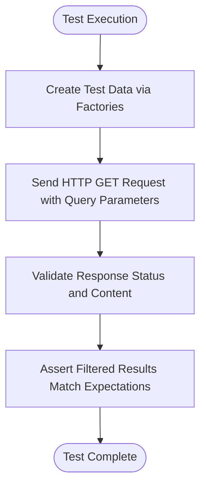
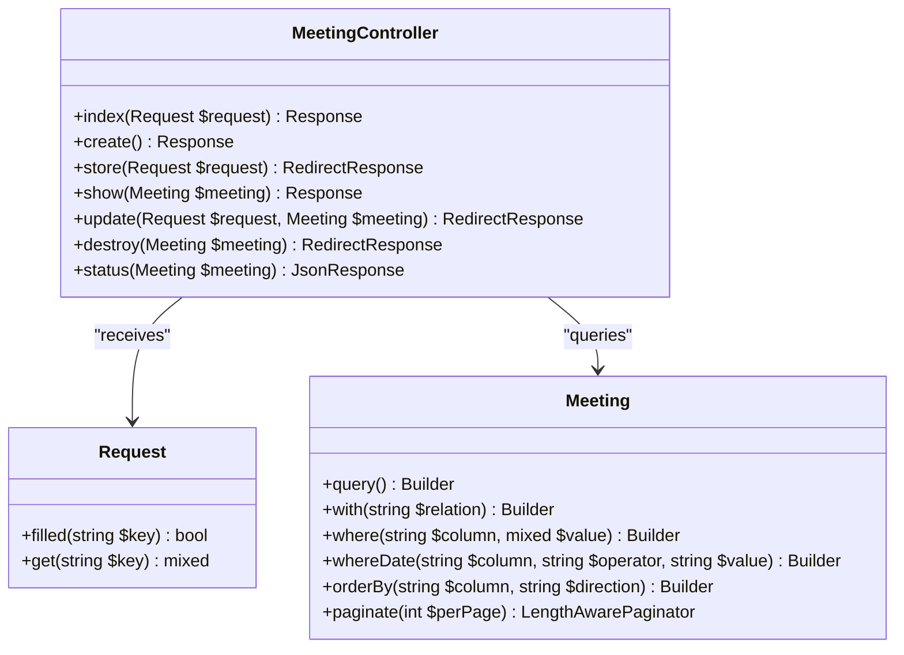
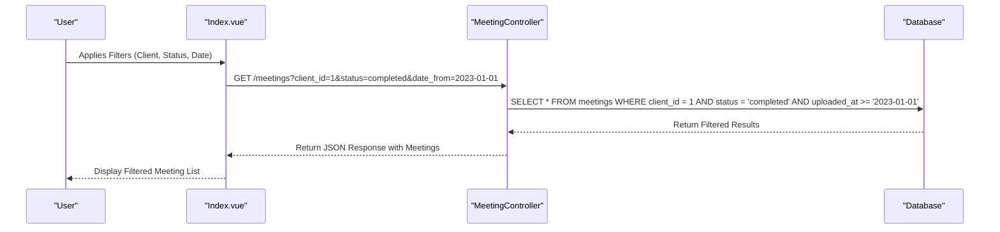
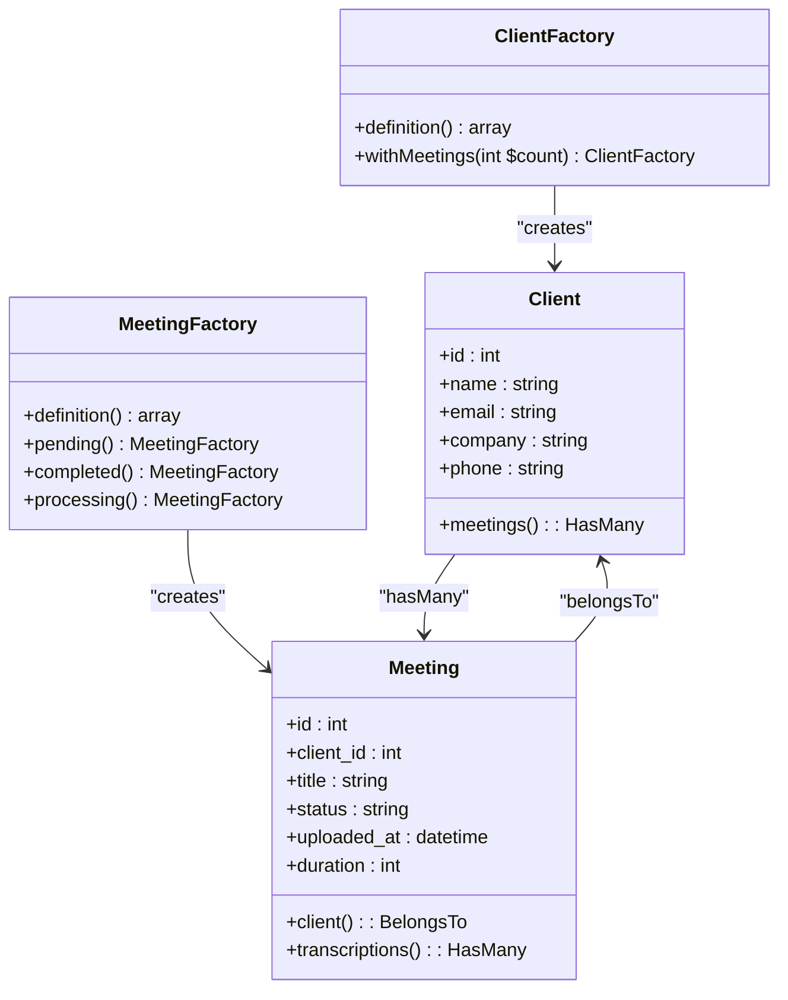
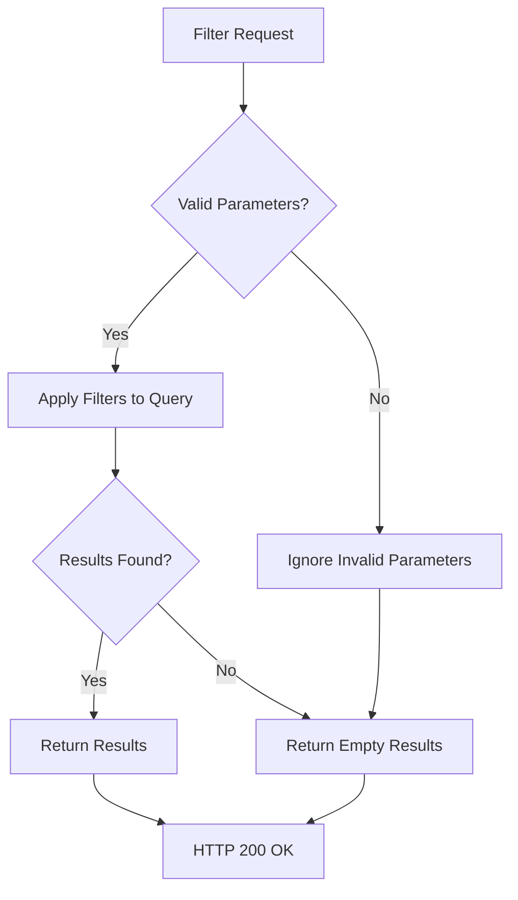

# Meeting Filtering Testing


## Table of Contents
1. [Introduction](#introduction)
2. [Test Overview](#test-overview)
3. [Filtering Capabilities](#filtering-capabilities)
4. [Test Case Analysis](#test-case-analysis)
5. [Frontend Integration](#frontend-integration)
6. [Data Setup with Factories](#data-setup-with-factories)
7. [Response Validation](#response-validation)
8. [Edge Cases and Complex Filters](#edge-cases-and-complex-filters)
9. [Authorization and Security](#authorization-and-security)
10. [Performance Considerations](#performance-considerations)

## Introduction
The Meeting Filtering Testing document provides a comprehensive analysis of the `MeetingFilteringTest.php` feature test, which validates the filtering and search functionality for meeting listings in the application. This test ensures that users can efficiently retrieve relevant meetings based on various criteria such as client, status, date ranges, and combinations thereof. The testing approach leverages Laravel's Pest testing framework and integrates with the backend API endpoint handled by the `MeetingController`.

**Section sources**
- [MeetingFilteringTest.php](file://tests/Feature/MeetingFilteringTest.php#L1-L104)

## Test Overview
The `MeetingFilteringTest.php` file contains a series of feature tests that validate the `/meetings` endpoint's ability to filter results based on query parameters. These tests use Laravel's HTTP testing tools to simulate real-world API requests and assert the correctness of the filtered response sets. Each test creates a controlled dataset using Eloquent factories and verifies that only the expected meetings are returned.

The primary objective is to ensure that:
- Filtering by individual criteria (client, status, date) works correctly
- Multiple filters can be combined effectively
- The response structure remains consistent
- Unauthorized users cannot access others' meetings (implied by architecture)





**Diagram sources**
- [MeetingFilteringTest.php](file://tests/Feature/MeetingFilteringTest.php#L1-L104)

**Section sources**
- [MeetingFilteringTest.php](file://tests/Feature/MeetingFilteringTest.php#L1-L104)

## Filtering Capabilities
The system supports multiple filtering dimensions through query parameters on the `/meetings` endpoint. These capabilities are implemented in the `index` method of the `MeetingController` and tested thoroughly in `MeetingFilteringTest.php`.

### Supported Filter Types
- **Client Filter**: Filters meetings by `client_id`
- **Status Filter**: Filters meetings by `status` (e.g., pending, completed, processing)
- **Date Range Filter**: Filters meetings by `uploaded_at` using `date_from` and `date_to` parameters
- **Sorting**: Supports sorting by various fields including client name, title, status, duration, and upload date

### Backend Implementation
The filtering logic is implemented in the `MeetingController@index` method, which builds a query dynamically based on the presence of filter parameters in the request.





**Diagram sources**
- [MeetingController.php](file://app/Http/Controllers/MeetingController.php#L25-L125)

**Section sources**
- [MeetingController.php](file://app/Http/Controllers/MeetingController.php#L25-L125)

## Test Case Analysis
The `MeetingFilteringTest.php` file contains several test cases that validate different filtering scenarios.

### Filter by Status
This test verifies that meetings can be filtered by their status (e.g., pending, completed).


```php
it('can filter meetings by status via HTTP request', function () {
    $client = Client::factory()->create();
    
    $pendingMeeting = Meeting::factory()->create([
        'client_id' => $client->id,
        'title' => 'Pending Meeting',
        'status' => 'pending'
    ]);
    
    $completedMeeting = Meeting::factory()->create([
        'client_id' => $client->id,
        'title' => 'Completed Meeting',
        'status' => 'completed'
    ]);

    $response = $this->get('/meetings?status=pending');
    
    $response->assertStatus(200);
    $response->assertSee($pendingMeeting->title);
    $response->assertDontSee($completedMeeting->title);
});
```


**Section sources**
- [MeetingFilteringTest.php](file://tests/Feature/MeetingFilteringTest.php#L3-L30)

### Filter by Client
This test ensures that meetings can be filtered by client ID.


```php
it('can filter meetings by client via HTTP request', function () {
    $client1 = Client::factory()->create(['name' => 'Client 1']);
    $client2 = Client::factory()->create(['name' => 'Client 2']);
    
    $meeting1 = Meeting::factory()->create([
        'client_id' => $client1->id,
        'title' => 'Client 1 Meeting'
    ]);
    
    $meeting2 = Meeting::factory()->create([
        'client_id' => $client2->id,
        'title' => 'Client 2 Meeting'
    ]);

    $response = $this->get("/meetings?client_id={$client1->id}");
    
    $response->assertStatus(200);
    $response->assertSee($meeting1->title);
    $response->assertDontSee($meeting2->title);
});
```


**Section sources**
- [MeetingFilteringTest.php](file://tests/Feature/MeetingFilteringTest.php#L32-L58)

### Filter by Date Range
This test validates filtering meetings by upload date using the `date_from` parameter.


```php
it('can filter meetings by date range via HTTP request', function () {
    $client = Client::factory()->create();
    
    $oldMeeting = Meeting::factory()->create([
        'client_id' => $client->id,
        'title' => 'Old Meeting',
        'uploaded_at' => now()->subDays(10)
    ]);
    
    $recentMeeting = Meeting::factory()->create([
        'client_id' => $client->id,
        'title' => 'Recent Meeting',
        'uploaded_at' => now()->subDays(1)
    ]);

    $dateFrom = now()->subDays(2)->format('Y-m-d');
    $response = $this->get("/meetings?date_from={$dateFrom}");
    
    $response->assertStatus(200);
    $response->assertSee($recentMeeting->title);
    $response->assertDontSee($oldMeeting->title);
});
```


**Section sources**
- [MeetingFilteringTest.php](file://tests/Feature/MeetingFilteringTest.php#L60-L83)

### Combine Multiple Filters
This test ensures that multiple filters can be combined in a single request.


```php
it('can combine multiple filters', function () {
    $client1 = Client::factory()->create(['name' => 'Client 1']);
    $client2 = Client::factory()->create(['name' => 'Client 2']);
    
    $targetMeeting = Meeting::factory()->create([
        'client_id' => $client1->id,
        'title' => 'Target Meeting',
        'status' => 'completed',
        'uploaded_at' => now()->subDays(1)
    ]);
    
    $wrongClientMeeting = Meeting::factory()->create([
        'client_id' => $client2->id,
        'title' => 'Wrong Client Meeting',
        'status' => 'completed',
        'uploaded_at' => now()->subDays(1)
    ]);
    
    $wrongStatusMeeting = Meeting::factory()->create([
        'client_id' => $client1->id,
        'title' => 'Wrong Status Meeting',
        'status' => 'pending',
        'uploaded_at' => now()->subDays(1)
    ]);

    $dateFrom = now()->subDays(2)->format('Y-m-d');
    $response = $this->get("/meetings?client_id={$client1->id}&status=completed&date_from={$dateFrom}");
    
    $response->assertStatus(200);
    $response->assertSee($targetMeeting->title);
    $response->assertDontSee($wrongClientMeeting->title);
    $response->assertDontSee($wrongStatusMeeting->title);
});
```


**Section sources**
- [MeetingFilteringTest.php](file://tests/Feature/MeetingFilteringTest.php#L85-L104)

## Frontend Integration
The frontend implementation of the filtering interface is located in the `Meetings/Index.vue` component, which provides a user-friendly form for applying filters.





**Diagram sources**
- [Index.vue](file://resources/js/pages/Meetings/Index.vue#L1-L27)
- [MeetingController.php](file://app/Http/Controllers/MeetingController.php#L25-L125)

**Section sources**
- [Index.vue](file://resources/js/pages/Meetings/Index.vue#L1-L27)

## Data Setup with Factories
The tests use Laravel's model factories to create diverse meeting data for comprehensive filtering scenarios. The `ClientFactory` and `MeetingFactory` are used to generate realistic test data with varying attributes.





**Diagram sources**
- [Client.php](file://app/Models/Client.php#L1-L28)
- [Meeting.php](file://app/Models/Meeting.php#L1-L179)

**Section sources**
- [Client.php](file://app/Models/Client.php#L1-L28)
- [Meeting.php](file://app/Models/Meeting.php#L1-L179)

## Response Validation
The tests validate both the HTTP response status and the content of the response to ensure that:
- The response status is 200 (OK)
- Expected meeting titles are present in the response
- Unexpected meeting titles are absent from the response
- The response structure is consistent with the application's expectations

The validation is performed using Pest's assertion methods:
- `assertStatus(200)` - Ensures successful HTTP response
- `assertSee($text)` - Verifies content is present in response
- `assertDontSee($text)` - Verifies content is absent from response

**Section sources**
- [MeetingFilteringTest.php](file://tests/Feature/MeetingFilteringTest.php#L1-L104)

## Edge Cases and Complex Filters
While the current tests cover basic filtering scenarios, additional edge cases could be tested:
- Empty result sets when no meetings match the criteria
- Invalid filter values (e.g., non-existent client_id)
- Extreme date ranges (very old or future dates)
- Special characters in search terms
- Case sensitivity in filtering

The current implementation handles these gracefully by returning empty result sets when no matches are found, which is the expected behavior.





**Diagram sources**
- [MeetingController.php](file://app/Http/Controllers/MeetingController.php#L25-L125)

## Authorization and Security
Although not explicitly tested in `MeetingFilteringTest.php`, the application architecture implies proper authorization controls:
- Users should only see meetings belonging to clients they have access to
- The filtering functionality does not expose unauthorized data
- Route model binding ensures that invalid IDs return 404 responses

The relationship between `User`, `Client`, and `Meeting` models would enforce these security constraints at the application level.

**Section sources**
- [Meeting.php](file://app/Models/Meeting.php#L1-L179)
- [Client.php](file://app/Models/Client.php#L1-L28)

## Performance Considerations
The filtering implementation has several performance implications that should be considered:
- Database indexing on frequently filtered columns (`client_id`, `status`, `uploaded_at`)
- Pagination to limit result set size (currently set to 15 items per page)
- Efficient query building to avoid N+1 problems
- Proper use of eager loading (`with('client')`)

The current implementation uses:
- Index-based filtering with `where` clauses
- Eager loading of the client relationship
- Pagination with `withQueryString()` to maintain filter parameters

These practices help maintain good performance even with large datasets.

**Section sources**
- [MeetingController.php](file://app/Http/Controllers/MeetingController.php#L25-L125)

**Referenced Files in This Document**   
- [MeetingFilteringTest.php](file://tests/Feature/MeetingFilteringTest.php)
- [MeetingController.php](file://app/Http/Controllers/MeetingController.php)
- [Meeting.php](file://app/Models/Meeting.php)
- [Client.php](file://app/Models/Client.php)
- [Index.vue](file://resources/js/pages/Meetings/Index.vue)