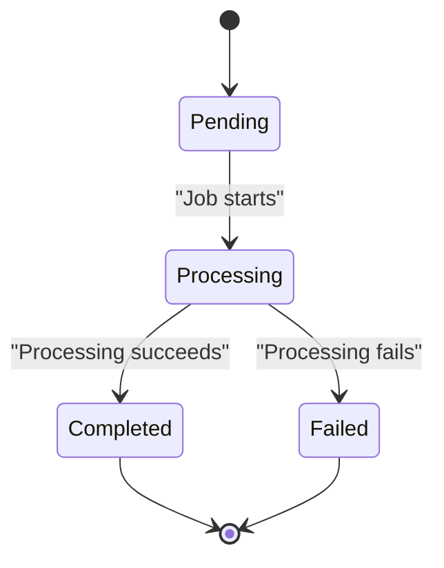
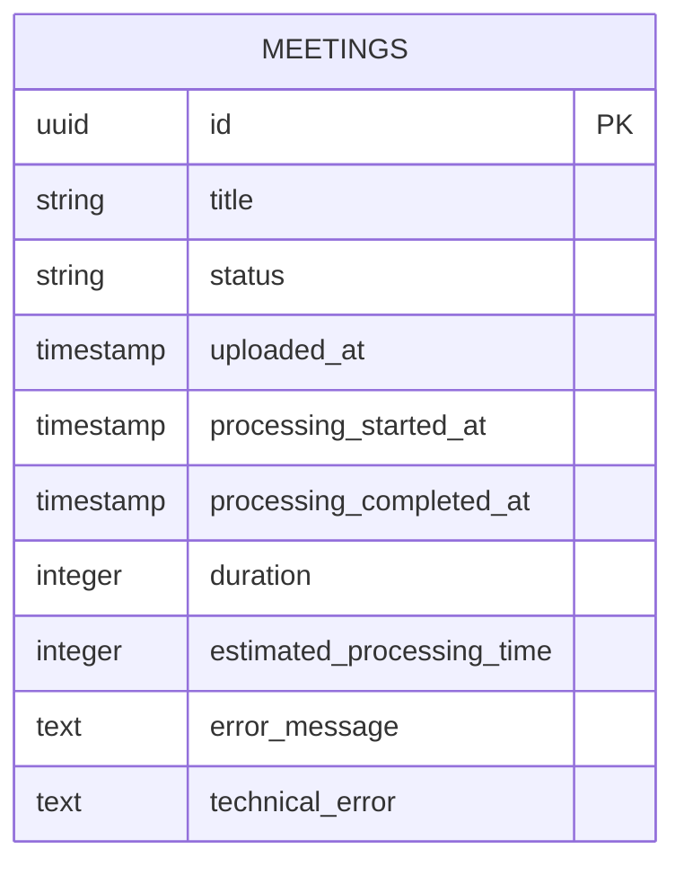
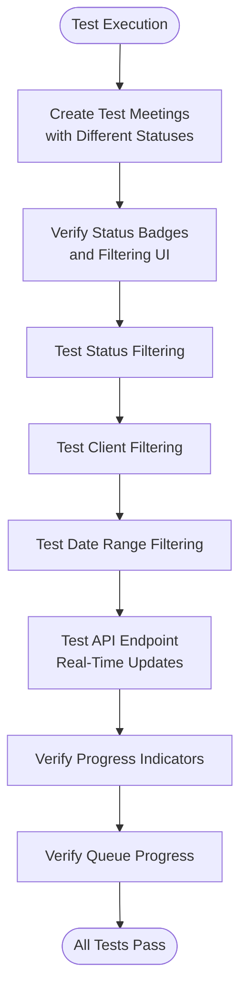
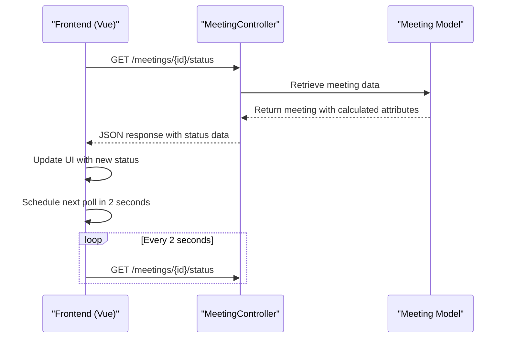
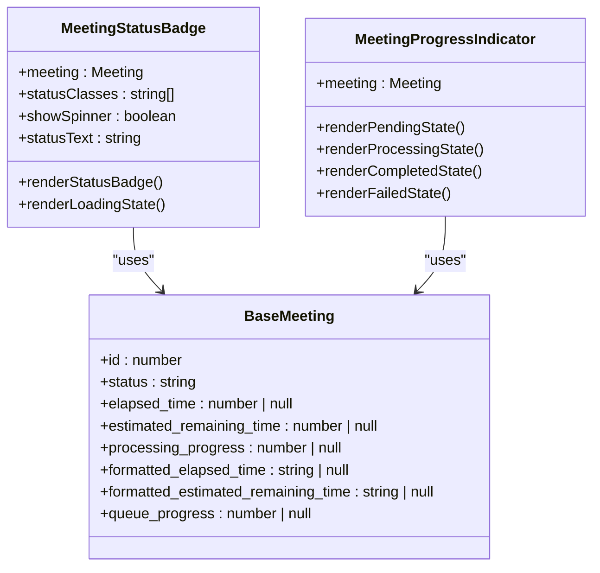
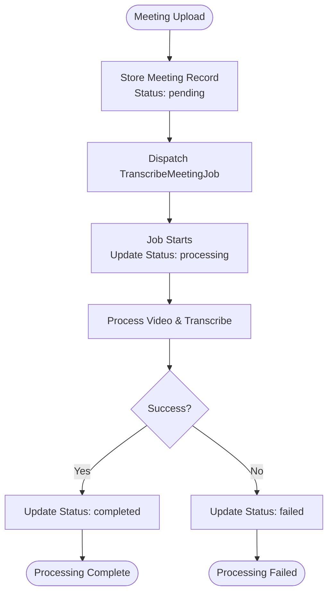
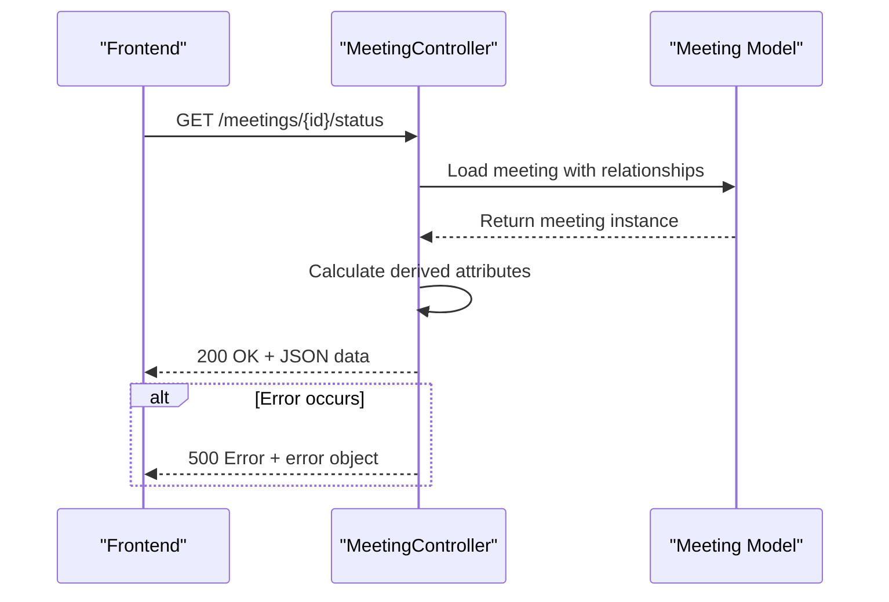
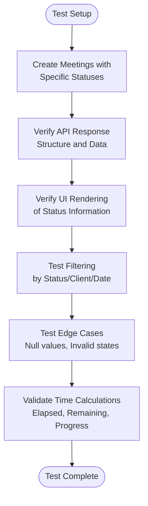
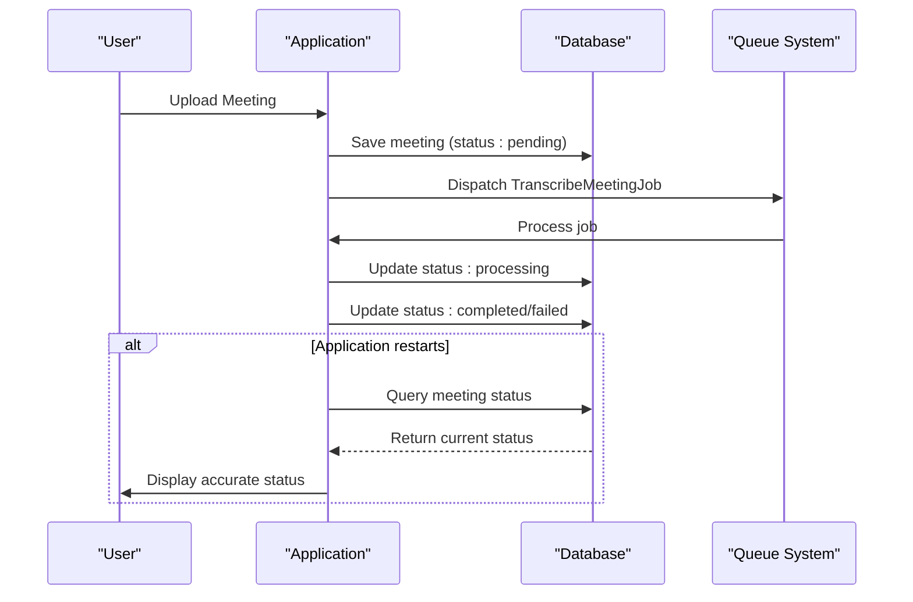

# Meeting Status Tracking Testing

## Table of Contents
1. [Introduction](#introduction)
2. [Status Lifecycle and Transitions](#status-lifecycle-and-transitions)
3. [Database Schema and Status Tracking Fields](#database-schema-and-status-tracking-fields)
4. [MeetingStatusTrackingTest.php Analysis](#meetingstatustrackingtestphp-analysis)
5. [Real-Time Status Updates Implementation](#real-time-status-updates-implementation)
6. [Frontend Status Visualization](#frontend-status-visualization)
7. [Business Logic for Status Updates](#business-logic-for-status-updates)
8. [API Endpoint for Status Information](#api-endpoint-for-status-information)
9. [Best Practices for Testing Time-Sensitive Status Updates](#best-practices-for-testing-time-sensitive-status-updates)
10. [Data Consistency and Persistence](#data-consistency-and-persistence)

## Introduction
The Meeting Status Tracking system provides comprehensive monitoring of meetings throughout their processing lifecycle. This documentation details the testing approach for the `MeetingStatusTrackingTest` feature test, which validates the complete status tracking functionality from upload to completion. The system tracks meetings through multiple states including uploaded (pending), processing, processed (completed), and failed, with appropriate timestamps and metadata recorded at each stage. The test suite ensures that status transitions are correctly recorded in the database, that estimated processing times are accurately calculated and displayed, and that status information is consistently available to the frontend through API endpoints.

**Section sources**
- [MeetingStatusTrackingTest.php](file://tests/Feature/MeetingStatusTrackingTest.php#L0-L183)

## Status Lifecycle and Transitions
The meeting status system implements a finite state machine with four primary states: pending, processing, completed, and failed. The transitions between these states are strictly controlled by business logic to prevent invalid state changes. When a meeting is first uploaded, it enters the "pending" state, indicating it is queued for processing. Once the transcription job begins, it transitions to "processing" with the `processing_started_at` timestamp recorded. Upon successful completion, it moves to "completed" status with `processing_completed_at` set. If any error occurs during processing, the meeting transitions to "failed" status.

The `TranscribeMeetingJob` enforces valid state transitions by updating the meeting status at key points in the processing pipeline. When the job starts, it updates the status from "pending" to "processing" and records the start time. If the job completes successfully, it updates to "completed" status. If the job fails or times out, it transitions to "failed" status. This ensures that only valid transitions occur and prevents scenarios like a meeting jumping directly from "pending" to "completed" without processing.

**Diagram sources**
- [TranscribeMeetingJob.php](file://app/Jobs/TranscribeMeetingJob.php#L50-L120)
- [MeetingFactory.php](file://database/factories/MeetingFactory.php#L35-L80)

**Section sources**
- [TranscribeMeetingJob.php](file://app/Jobs/TranscribeMeetingJob.php#L50-L120)
- [MeetingFactory.php](file://database/factories/MeetingFactory.php#L35-L80)

## Database Schema and Status Tracking Fields
The meeting status tracking system relies on several key database fields to record the lifecycle of each meeting. The `meetings` table contains timestamp fields that capture critical moments in the processing pipeline: `uploaded_at` records when the meeting was initially uploaded, `processing_started_at` marks when transcription began, and `processing_completed_at` indicates when processing finished.

A crucial addition to the schema is the `estimated_processing_time` field, which was added via the migration `2025_08_10_145951_add_estimated_processing_time_to_meetings_table.php`. This integer field stores the estimated processing duration in seconds and is nullable to accommodate meetings where estimation isn't available. The field includes a database comment explaining its purpose: "Estimated processing time in seconds".

The status field itself is a string that can take one of four values: 'pending', 'processing', 'completed', or 'failed'. This design allows for clear state identification while maintaining flexibility for future status additions. The combination of status and timestamp fields enables comprehensive tracking of a meeting's journey through the system.

**Diagram sources**
- [2025_08_10_145951_add_estimated_processing_time_to_meetings_table.php](file://database/migrations/2025_08_10_145951_add_estimated_processing_time_to_meetings_table.php#L0-L27)
- [Meeting.php](file://app/Models/Meeting.php)

**Section sources**
- [2025_08_10_145951_add_estimated_processing_time_to_meetings_table.php](file://database/migrations/2025_08_10_145951_add_estimated_processing_time_to_meetings_table.php#L0-L27)

## MeetingStatusTrackingTest.php Analysis
The `MeetingStatusTrackingTest.php` file contains comprehensive feature tests that validate the status tracking system. The test suite uses Pest PHP testing framework with browser testing capabilities to simulate real user interactions and verify status display, filtering, and real-time updates.

The test cases cover multiple aspects of status tracking:
- Display of meetings with status badges and filtering capabilities
- Filtering meetings by status, client, and date range
- Real-time status updates via API endpoint
- Progress indicators for processing meetings
- Queue progress display for pending meetings

Each test creates meeting instances with specific status values using Laravel factories, then verifies that the frontend correctly displays the appropriate status information. For example, the test for real-time status updates creates a processing meeting with a `processing_started_at` timestamp from two minutes prior, then verifies that the API response includes valid elapsed time and properly formatted time strings.

The tests also validate the structure of API responses, ensuring that the status endpoint returns the expected JSON structure with fields like `elapsed_time`, `estimated_remaining_time`, `processing_progress`, and formatted time representations. This comprehensive test coverage ensures that the status tracking system functions correctly across all user-facing components.

**Diagram sources**
- [MeetingStatusTrackingTest.php](file://tests/Feature/MeetingStatusTrackingTest.php#L0-L183)

**Section sources**
- [MeetingStatusTrackingTest.php](file://tests/Feature/MeetingStatusTrackingTest.php#L0-L183)

## Real-Time Status Updates Implementation
The real-time status update system enables the frontend to display current processing information without requiring full page reloads. This is implemented through a combination of backend API endpoints and frontend polling mechanisms.

The core of the system is the status API endpoint in `MeetingController.php`, which returns a JSON response containing comprehensive status information for a specific meeting. The endpoint calculates dynamic values such as elapsed time, estimated remaining time, and processing progress based on the current state and timestamps.

On the frontend, the `useRealTimeUpdates.ts` composable implements a polling mechanism that fetches status updates every 2 seconds for meetings in "pending" or "processing" states. This composable preserves existing meeting data while merging in updated status information, ensuring a smooth user experience. The polling automatically stops when a meeting reaches "completed" or "failed" status, as indicated by the component lifecycle hooks in `Show.vue`.

When the status changes to "completed" or "failed", the frontend triggers a page reload to display the final state and any generated transcription results. This ensures users see the complete meeting information once processing is finished.

**Diagram sources**
- [MeetingController.php](file://app/Http/Controllers/MeetingController.php#L250-L304)
- [useRealTimeUpdates.ts](file://resources/js/lib/useRealTimeUpdates.ts#L0-L87)
- [Show.vue](file://resources/js/pages/Meetings/Show.vue#L312-L343)

**Section sources**
- [MeetingController.php](file://app/Http/Controllers/MeetingController.php#L250-L304)
- [useRealTimeUpdates.ts](file://resources/js/lib/useRealTimeUpdates.ts#L0-L87)

## Frontend Status Visualization
The frontend implements a comprehensive status visualization system using Vue.js components that provide users with clear feedback about meeting processing states. The primary components involved are `MeetingStatusBadge.vue` and `MeetingProgressIndicator.vue`, which display status information in both list views and detailed meeting views.

The `MeetingStatusBadge` component renders different visual indicators based on the meeting status:
- "Pending" meetings show a queue indicator with estimated processing time
- "Processing" meetings display elapsed and remaining time
- "Completed" meetings show a success indicator
- "Failed" meetings display an error indicator

For processing meetings, the system calculates and displays progress percentages and formatted time strings. The elapsed time is shown in "MM:SS" format, making it easily readable for users. The estimated remaining time provides users with an expectation of how much longer processing will take.

The status badges include animated spinners for pending and processing states, providing visual feedback that processing is ongoing. Color coding is used consistently across the application: blue for pending, yellow for processing, green for completed, and red for failed states, following common UX conventions.

**Diagram sources**
- [MeetingStatusBadge.vue](file://resources/js/lib/MeetingStatusBadge.vue#L0-L37)
- [MeetingProgressIndicator.vue](file://resources/js/lib/MeetingProgressIndicator.vue#L59-L100)

**Section sources**
- [MeetingStatusBadge.vue](file://resources/js/lib/MeetingStatusBadge.vue#L0-L37)
- [MeetingProgressIndicator.vue](file://resources/js/lib/MeetingProgressIndicator.vue#L59-L100)

## Business Logic for Status Updates
The business logic for status updates is distributed across multiple components to ensure data consistency and proper state management. The primary source of truth for status calculations is the `Meeting` model, which implements several computed attributes that provide derived status information.

Key business logic rules include:
- Estimated processing time is calculated as the video duration divided by 60 (seconds per minute), with a minimum of 10 seconds
- Elapsed time is calculated as the difference between now and `processing_started_at` for processing meetings
- Queue progress for pending meetings is calculated based on time since upload relative to estimated processing time
- Processing progress is calculated as elapsed time divided by estimated total processing time, capped at 100%

The `TranscribeMeetingJob` enforces business rules around status transitions by updating the meeting status at appropriate points in the processing pipeline. It ensures that status changes are atomic and consistent by using database transactions. The job also implements retry logic with exponential backoff, allowing temporary failures to be recovered without immediately marking a meeting as failed.

Error handling is a critical aspect of the business logic. When processing fails, the system captures both user-friendly error messages and technical error details, allowing for appropriate user communication while preserving diagnostic information for developers.

**Diagram sources**
- [TranscribeMeetingJob.php](file://app/Jobs/TranscribeMeetingJob.php#L50-L120)
- [Meeting.php](file://app/Models/Meeting.php#L107-L153)

**Section sources**
- [TranscribeMeetingJob.php](file://app/Jobs/TranscribeMeetingJob.php#L50-L120)
- [Meeting.php](file://app/Models/Meeting.php#L107-L153)

## API Endpoint for Status Information
The status API endpoint, implemented in `MeetingController::status()`, serves as the primary interface between the backend status tracking system and the frontend user interface. This endpoint returns a structured JSON response containing comprehensive status information for a specific meeting.

The API response includes both raw data and formatted representations:
- Raw values: `elapsed_time`, `estimated_remaining_time`, `processing_progress`
- Formatted strings: `formatted_elapsed_time`, `formatted_estimated_remaining_time`
- Status metadata: `status`, `queue_progress`, `formatted_estimated_processing_time`

The endpoint is designed to be robust and handle potential errors gracefully. If an error occurs while retrieving status information, it returns a 500 error response with a structured error object, rather than failing silently. This allows the frontend to display appropriate error messages to users.

The API is consumed by the frontend's real-time update system, which polls this endpoint every 2 seconds for active meetings. The response structure is consistent across all status states, allowing the frontend to handle updates uniformly regardless of the meeting's current state.

**Diagram sources**
- [MeetingController.php](file://app/Http/Controllers/MeetingController.php#L250-L304)

**Section sources**
- [MeetingController.php](file://app/Http/Controllers/MeetingController.php#L250-L304)

## Best Practices for Testing Time-Sensitive Status Updates
Testing time-sensitive status updates requires careful consideration of timing dependencies and asynchronous behavior. The `MeetingStatusTrackingTest.php` suite demonstrates several best practices for effectively testing these scenarios.

One key practice is the use of Laravel's testing helpers to manipulate time, allowing tests to verify time-based calculations without actual delays. For example, creating a meeting with `processing_started_at` set to a time in the past allows immediate verification of elapsed time calculations.

The tests also demonstrate proper verification of API response structures using `assertJsonStructure()`, ensuring that all expected fields are present in the response. This protects against regressions where status fields might be accidentally removed or renamed.

For browser tests, the suite uses explicit assertions on UI elements that display status information, such as status badges and progress indicators. This ensures that not only is the data correct at the API level, but it is also properly rendered in the user interface.

Another best practice is testing edge cases, such as meetings without required timestamps or with null duration values. These tests verify that the system handles incomplete data gracefully, returning appropriate null values rather than throwing errors.

**Diagram sources**
- [MeetingStatusTrackingTest.php](file://tests/Feature/MeetingStatusTrackingTest.php#L0-L183)
- [RealTimeStatusTest.php](file://tests/Feature/RealTimeStatusTest.php#L0-L74)

**Section sources**
- [MeetingStatusTrackingTest.php](file://tests/Feature/MeetingStatusTrackingTest.php#L0-L183)
- [RealTimeStatusTest.php](file://tests/Feature/RealTimeStatusTest.php#L0-L74)

## Data Consistency and Persistence
Ensuring data consistency and persistence across application restarts is critical for the reliability of the status tracking system. The implementation uses several strategies to maintain data integrity throughout the meeting lifecycle.

Database transactions are used to ensure atomic updates to meeting status and timestamps. When the `TranscribeMeetingJob` updates the meeting status, it does so within a database transaction, preventing partial updates that could leave the meeting in an inconsistent state.

The system also implements proper error handling with cleanup procedures. If a job fails, it updates the meeting status to "failed" and records error details, ensuring that the meeting's final state is preserved even if the application restarts during processing.

For long-running jobs, the system uses Laravel's queue system with retry mechanisms, allowing jobs to resume after temporary failures. The job's `retryUntil()` and `backoff()` methods define a sensible retry strategy that balances reliability with system load.

The use of database-stored timestamps (rather than in-memory state) ensures that status information persists across application restarts. When the application restarts, it can reconstruct the current state of all meetings by querying the database, with no loss of tracking information.

**Diagram sources**
- [TranscribeMeetingJob.php](file://app/Jobs/TranscribeMeetingJob.php#L50-L120)
- [MeetingController.php](file://app/Http/Controllers/MeetingController.php#L150-L200)

**Section sources**
- [TranscribeMeetingJob.php](file://app/Jobs/TranscribeMeetingJob.php#L50-L120)
- [MeetingController.php](file://app/Http/Controllers/MeetingController.php#L150-L200)

**Referenced Files in This Document**   
- [MeetingStatusTrackingTest.php](file://tests/Feature/MeetingStatusTrackingTest.php)
- [MeetingController.php](file://app/Http/Controllers/MeetingController.php)
- [TranscribeMeetingJob.php](file://app/Jobs/TranscribeMeetingJob.php)
- [Meeting.php](file://app/Models/Meeting.php)
- [MeetingFactory.php](file://database/factories/MeetingFactory.php)
- [2025_08_10_145951_add_estimated_processing_time_to_meetings_table.php](file://database/migrations/2025_08_10_145951_add_estimated_processing_time_to_meetings_table.php)
- [useRealTimeUpdates.ts](file://resources/js/lib/useRealTimeUpdates.ts)
- [Show.vue](file://resources/js/pages/Meetings/Show.vue)