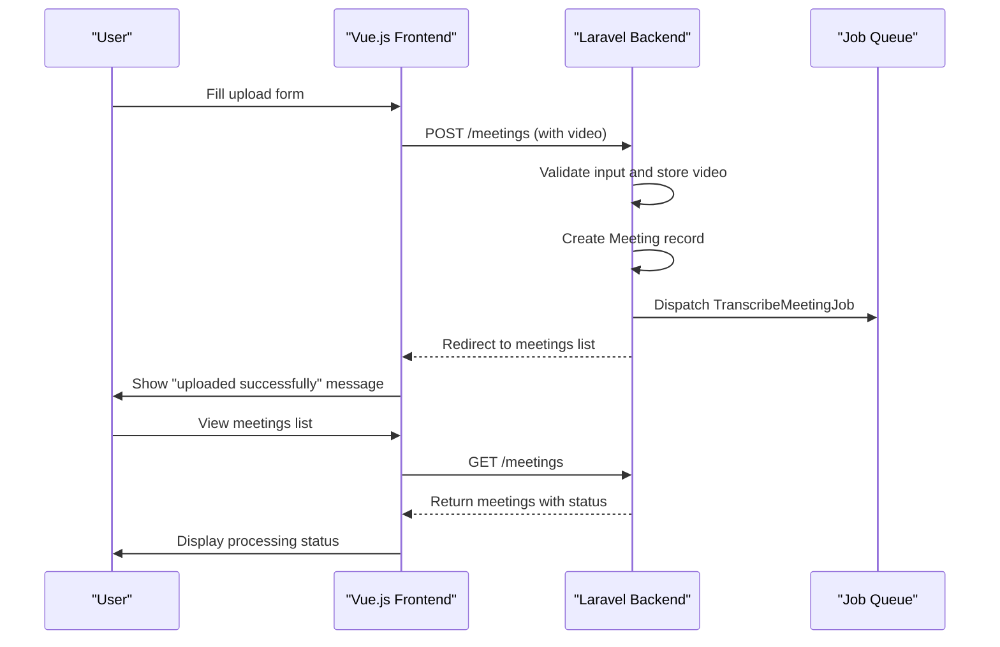
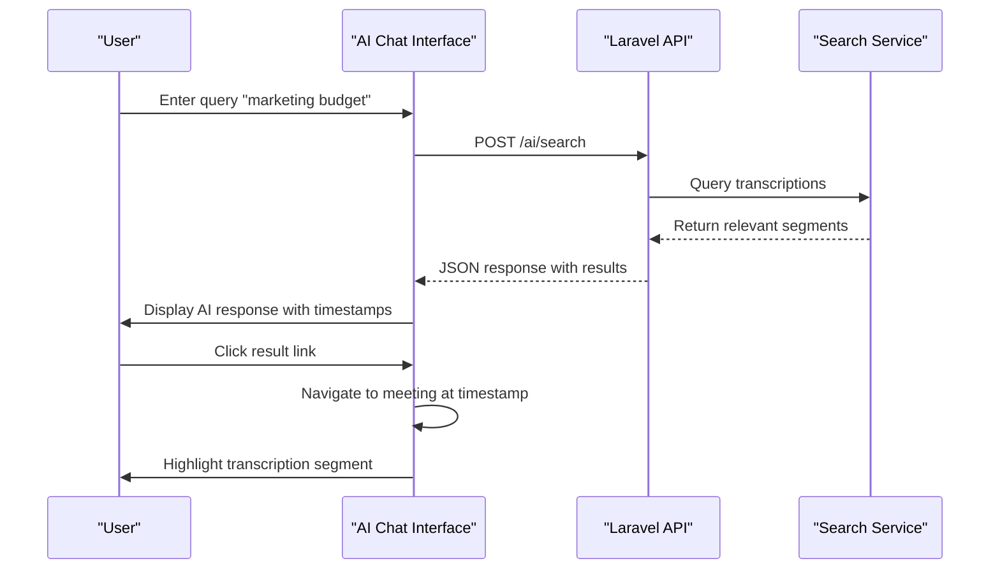
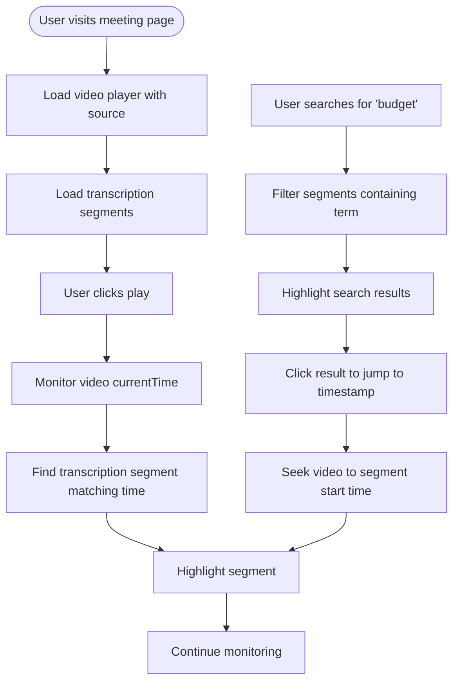
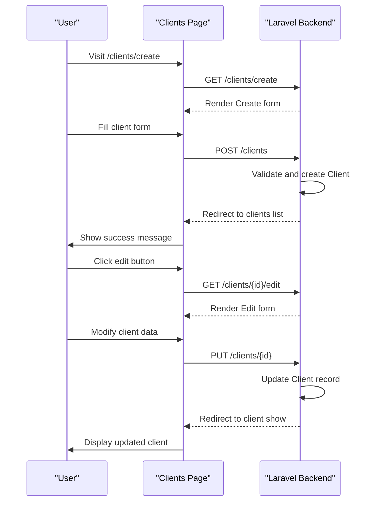

# Browser Testing


## Table of Contents
1. [Introduction](#introduction)
2. [Key Browser Test Files](#key-browser-test-files)
3. [Test Implementation Details](#test-implementation-details)
4. [Setup and Execution](#setup-and-execution)
5. [Best Practices and Challenges](#best-practices-and-challenges)

## Introduction
Browser testing in the meetingai application ensures that end-to-end (E2E) workflows function correctly from the user interface through backend processing. These tests simulate real user interactions with the Vue.js frontend, validate full-stack integration, and verify asynchronous operations such as video processing and AI-driven transcription analysis. The test suite uses Pest with Dusk-like browser testing capabilities to interact with the Inertia.js-powered frontend, asserting DOM changes, form submissions, and real-time updates. This document details the key test files, their implementation, setup requirements, and best practices for maintaining reliable E2E tests.

## Key Browser Test Files

### MeetingUploadAndProcessingTest
This test validates the complete workflow of uploading a meeting video, from UI interaction to backend processing status tracking. It verifies form validation, file upload, database record creation, job dispatching, and real-time status updates.





**Diagram sources**
- [MeetingUploadAndProcessingTest.php](file://tests/Browser/MeetingUploadAndProcessingTest.php)
- [MeetingController.php](file://app/Http/Controllers/MeetingController.php)

**Section sources**
- [MeetingUploadAndProcessingTest.php](file://tests/Browser/MeetingUploadAndProcessingTest.php#L1-L405)
- [MeetingController.php](file://app/Http/Controllers/MeetingController.php#L50-L150)

### AIAgentInteractionTest
This test verifies that natural language queries return correct AI responses with timestamped results from transcribed meetings. It confirms that search functionality works across transcriptions, supports filtering by client and speaker, and enables navigation to specific video timestamps.





**Diagram sources**
- [AIAgentInteractionTest.php](file://tests/Browser/AIAgentInteractionTest.php)
- [MeetingController.php](file://app/Http/Controllers/MeetingController.php)

**Section sources**
- [AIAgentInteractionTest.php](file://tests/Browser/AIAgentInteractionTest.php#L1-L503)
- [MeetingController.php](file://app/Http/Controllers/MeetingController.php#L200-L305)

### VideoPlayerAndTranscriptionTest
This test ensures synchronized playback between the video player and transcription viewer. It validates that the current transcription segment is highlighted during playback, search within transcriptions works, and keyboard controls function correctly.





**Diagram sources**
- [VideoPlayerAndTranscriptionTest.php](file://tests/Browser/VideoPlayerAndTranscriptionTest.php)
- [TranscriptionViewer.vue](file://resources/js/lib/TranscriptionViewer.vue)

**Section sources**
- [VideoPlayerAndTranscriptionTest.php](file://tests/Browser/VideoPlayerAndTranscriptionTest.php#L1-L437)
- [TranscriptionViewer.vue](file://resources/js/lib/TranscriptionViewer.vue#L200-L245)

### ClientManagementWorkflowTest
This test confirms CRUD operations for clients through the UI, including creating, editing, viewing, and deleting client records. It validates form handling, persistence, and proper UI feedback.





**Diagram sources**
- [ClientManagementWorkflowTest.php](file://tests/Browser/ClientManagementWorkflowTest.php)

**Section sources**
- [ClientManagementWorkflowTest.php](file://tests/Browser/ClientManagementWorkflowTest.php)

## Test Implementation Details

### Interaction with Vue Components and Inertia.js
Browser tests interact with Vue components rendered via Inertia.js by targeting data-testid attributes. When a form is submitted, Inertia handles the page transition, and tests assert the resulting component and props using the `assertInertia` method.

For example, after uploading a meeting:

```php
$response->assertInertia(fn ($page) => 
    $page->component('Meetings/Index')
         ->has('meetings.data', 1)
         ->where('meetings.data.0.title', 'Quarterly Review Meeting')
);
```


### Real API Calls and Asynchronous Operations
Tests validate real API calls such as the `/meetings/{id}/status` endpoint used for real-time processing updates. The `status` method in `MeetingController` returns JSON with current processing metrics:


```php
public function status(Meeting $meeting)
{
    return response()->json([
        'success' => true,
        'data' => [
            'id' => $meeting->id,
            'status' => $meeting->status,
            'elapsed_time' => $meeting->elapsed_time,
            'estimated_remaining_time' => $meeting->estimated_remaining_time,
            'processing_progress' => $meeting->processing_progress,
        ]
    ]);
}
```


Browser tests use `waitFor` to handle asynchronous updates:

```php
$browser->waitFor('[data-testid="status-update"]', 5)
        ->assertSee('2:'); // Elapsed time in minutes
```


### Form Interactions and DOM Assertions
Tests simulate user actions like typing, selecting, and clicking:

```php
$browser->type('[data-testid="meeting-title"]', 'Large Meeting File')
        ->select('[data-testid="client-selector"]', $client->id)
        ->attach('[data-testid="video-upload"]', $filePath)
        ->click('[data-testid="upload-button"]');
```


Assertions verify DOM state:

```php
->assertSee('Upload complete')
->assertVisible('[data-testid="progress-bar"]')
->assertHasClass('[data-testid="transcription-segment-45.0"]', 'highlighted');
```


### Real-Time Updates and Event Handling
The `TranscriptionViewer.vue` component uses watchers to respond to changes in the current segment and search query:


```javascript
watch(currentSegment, (newSegment) => {
  if (newSegment) {
    const index = filteredTranscriptions.value.findIndex(t => t.id === newSegment.id)
    currentSegmentIndex.value = index
    scrollToCurrentSegment()
  }
})

const highlightSearchTerm = (text: string): string => {
  if (!searchQuery.value.trim()) return text
  const query = searchQuery.value.trim()
  const regex = new RegExp(`(${query})`, 'gi')
  return text.replace(regex, '<mark class="bg-yellow-200 px-1 rounded">$1</mark>')
}
```


## Setup and Execution

### Environment Configuration
To run browser tests:
1. Install dependencies: `composer install && npm install`
2. Configure `.env.testing` with database and storage settings
3. Ensure ChromeDriver is available or use Docker

### Running Tests with Headless Chrome
Execute tests using Pest:

```bash
php artisan serve --port=9696 &
php vendor/bin/pest --browser
```


For headless execution:

```bash
php vendor/bin/pest --browser --headless
```


### Authentication Handling
Tests typically run as authenticated users. Use Laravel's `actingAs` method:

```php
$this->actingAs(User::factory()->create())
     ->get(route('meetings.create'));
```


### Waiting for Asynchronous Operations
Use built-in waiting methods:

```php
$browser->waitFor('[data-testid="upload-complete"]', 30)
        ->pause(2000)
        ->refresh();
```


## Best Practices and Challenges

### Addressing Test Flakiness
- Use explicit waits instead of fixed pauses where possible
- Avoid relying on exact timing; use assertions on final state
- Reset application state in `beforeEach`

### Managing Slow Execution
- Run tests in parallel when possible
- Use fake storage and queues for faster execution
- Focus on critical paths in CI, run full suite nightly

### Dockerized Environment Setup
Use Docker Compose for consistent test environments:

```yaml
services:
  app:
    build: .
    ports: ["9696:9696"]
  chrome:
    image: selenium/standalone-chrome
    shm_size: 2gb
```


### Recommended Best Practices
1. **Use descriptive data-testid attributes** for reliable element targeting
2. **Test one thing per test** to improve maintainability
3. **Use factories** for consistent test data
4. **Assert both success and error states**
5. **Mock external services** to avoid flakiness
6. **Run tests in headless mode** in CI/CD pipelines
7. **Use page objects** for complex UI interactions (when test suite grows)

By following these practices, the meetingai application maintains a robust suite of E2E browser tests that ensure reliability and functionality across the full stack.

**Referenced Files in This Document**   
- [MeetingUploadAndProcessingTest.php](file://tests/Browser/MeetingUploadAndProcessingTest.php)
- [AIAgentInteractionTest.php](file://tests/Browser/AIAgentInteractionTest.php)
- [VideoPlayerAndTranscriptionTest.php](file://tests/Browser/VideoPlayerAndTranscriptionTest.php)
- [ClientManagementWorkflowTest.php](file://tests/Browser/ClientManagementWorkflowTest.php)
- [MeetingController.php](file://app/Http/Controllers/MeetingController.php)
- [TranscriptionViewer.vue](file://resources/js/lib/TranscriptionViewer.vue)