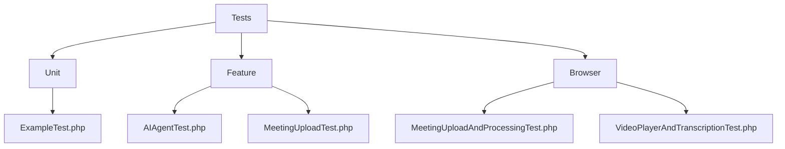
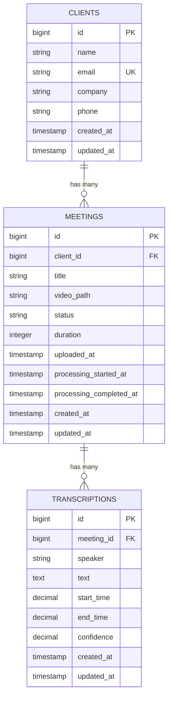

# Test Setup and Execution


## Table of Contents
1. [Test Configuration Overview](#test-configuration-overview)
2. [Test Suite Organization](#test-suite-organization)
3. [Pest Framework Bootstrapping](#pest-framework-bootstrapping)
4. [Base Test Case Setup](#base-test-case-setup)
5. [Environment and Database Configuration](#environment-and-database-configuration)
6. [Running Tests and Generating Coverage](#running-tests-and-generating-coverage)
7. [CI/CD Integration](#cicd-integration)
8. [Developer Instructions](#developer-instructions)
9. [Common Issues and Solutions](#common-issues-and-solutions)

## Test Configuration Overview

The test configuration in the meetingai application is managed through the `phpunit.xml` file located at the root of the project. This file defines the test suites, environment variables, and code coverage settings used during test execution.


```xml
<phpunit xmlns:xsi="http://www.w3.org/2001/XMLSchema-instance"
         xsi:noNamespaceSchemaLocation="vendor/phpunit/phpunit/phpunit.xsd"
         bootstrap="vendor/autoload.php"
         colors="true"
>
    <testsuites>
        <testsuite name="Unit">
            <directory>tests/Unit</directory>
        </testsuite>
        <testsuite name="Feature">
            <directory>tests/Feature</directory>
        </testsuite>
        <testsuite name="Browser">
            <directory>tests/Browser</directory>
        </testsuite>
    </testsuites>
    <source>
        <include>
            <directory>app</directory>
        </include>
    </source>
    <php>
        <env name="APP_ENV" value="testing"/>
        <env name="APP_MAINTENANCE_DRIVER" value="file"/>
        <env name="BCRYPT_ROUNDS" value="4"/>
        <env name="CACHE_STORE" value="array"/>
        <env name="DB_CONNECTION" value="mysql"/>
        <env name="MAIL_MAILER" value="array"/>
        <env name="PULSE_ENABLED" value="false"/>
        <env name="QUEUE_CONNECTION" value="sync"/>
        <env name="SESSION_DRIVER" value="array"/>
        <env name="TELESCOPE_ENABLED" value="false"/>
    </php>
</phpunit>
```


The configuration includes:
- **Test Suites**: Unit, Feature, and Browser test suites mapped to their respective directories.
- **Code Coverage**: The `app` directory is included for coverage analysis.
- **Environment Variables**: Key Laravel environment variables are set for testing, including in-memory cache (`array`), synchronous queue processing (`sync`), and array-based session storage.

**Section sources**
- [phpunit.xml](file://phpunit.xml#L1-L36)

## Test Suite Organization

The test suite is organized into three main directories under `tests/`:
- **Unit**: Contains isolated unit tests that verify individual components.
- **Feature**: Contains integration tests that verify application features and HTTP endpoints.
- **Browser**: Contains browser-based end-to-end tests that simulate user interactions.

Each test suite is defined in `phpunit.xml`, allowing selective execution of test types. This structure supports progressive testing from isolated logic to full user workflows.





**Diagram sources**
- [phpunit.xml](file://phpunit.xml#L10-L18)
- [tests/Unit/ExampleTest.php](file://tests/Unit/ExampleTest.php)
- [tests/Feature/MeetingUploadTest.php](file://tests/Feature/MeetingUploadTest.php)
- [tests/Browser/MeetingUploadAndProcessingTest.php](file://tests/Browser/MeetingUploadAndProcessingTest.php)

**Section sources**
- [phpunit.xml](file://phpunit.xml#L10-L18)

## Pest Framework Bootstrapping

The Pest testing framework is bootstrapped via the `tests/Pest.php` file. This file configures Pest to extend the application's base test case and apply traits for database management and browser testing.


```php
pest()->extend(Tests\TestCase::class)
    ->use(Illuminate\Foundation\Testing\RefreshDatabase::class)
    ->in('Feature');

pest()->extend(Tests\TestCase::class)
    ->use(Illuminate\Foundation\Testing\RefreshDatabase::class)
    ->use(Pest\Browser\Browsable::class)
    ->in('Browser');
```


Key configurations:
- **Feature Tests**: Use `RefreshDatabase` to reset the database before each test.
- **Browser Tests**: Include `Browsable` trait for browser automation capabilities.
- **Global Helpers**: Custom expectations (e.g., `toBeOne`) and helper functions can be defined globally.

This setup ensures consistent test isolation and enables expressive browser testing syntax.

**Section sources**
- [tests/Pest.php](file://tests/Pest.php#L15-L35)

## Base Test Case Setup

The `tests/TestCase.php` file defines the base test class that all tests inherit from. It extends Laravel's `BaseTestCase` and serves as the foundation for test execution.


```php
namespace Tests;

use Illuminate\Foundation\Testing\TestCase as BaseTestCase;

abstract class TestCase extends BaseTestCase
{
    //
}
```


Although minimal, this class can be extended to include:
- Shared setup/teardown logic
- Authentication helpers
- Common assertions
- Application bootstrapping

All tests in the application inherit this class either directly or through Pest configuration, ensuring uniform test initialization.

**Section sources**
- [tests/TestCase.php](file://tests/TestCase.php#L1-L11)

## Environment and Database Configuration

### Testing Environment
While a dedicated `.env.testing` file was not found, the `phpunit.xml` file defines all necessary environment variables for testing. The `APP_ENV=testing` setting triggers Laravel to use testing defaults.

### Database Configuration
The application uses a MySQL connection during testing (`DB_CONNECTION=mysql`), but with `CACHE_STORE=array` and `QUEUE_CONNECTION=sync`, performance is optimized for test speed.

Database schema is defined in migrations:
- **Clients Table**: Stores client information with name, email, company, and phone.
- **Meetings Table**: Tracks meeting metadata including video path, status, and timestamps.
- **Transcriptions Table**: Stores transcribed text with speaker, timing, and confidence scores.

Test data is seeded using:
- `ClientSeeder`: Creates predefined clients with varied data completeness.
- `MeetingSeeder`: Generates meetings in different states (pending, processing, completed, failed).





**Diagram sources**
- [database/migrations/2025_08_10_135157_create_clients_table.php](file://database/migrations/2025_08_10_135157_create_clients_table.php)
- [database/migrations/2025_08_10_135205_create_meetings_table.php](file://database/migrations/2025_08_10_135205_create_meetings_table.php)
- [database/migrations/2025_08_10_135210_create_transcriptions_table.php](file://database/migrations/2025_08_10_135210_create_transcriptions_table.php)

**Section sources**
- [phpunit.xml](file://phpunit.xml#L25-L34)
- [database/seeders/ClientSeeder.php](file://database/seeders/ClientSeeder.php)
- [database/seeders/MeetingSeeder.php](file://database/seeders/MeetingSeeder.php)

## Running Tests and Generating Coverage

### Test Execution Commands
Tests can be run using either Artisan or Pest directly:


```bash
# Using Artisan
php artisan test

# Using Pest directly
vendor/bin/pest

# Run specific test suites
vendor/bin/pest --group=unit
vendor/bin/pest --group=feature
vendor/bin/pest --group=browser

# Run specific test files
vendor/bin/pest tests/Feature/MeetingUploadTest.php
```


### Code Coverage
Code coverage is automatically configured to include the `app` directory. Generate HTML coverage reports with:


```bash
vendor/bin/pest --coverage --coverage-html=coverage
```


Coverage reports will be available in the `coverage/` directory, showing line-by-line coverage statistics.

**Section sources**
- [phpunit.xml](file://phpunit.xml#L19-L23)

## CI/CD Integration

No GitHub Actions workflow files were found in the `.github/workflows` directory. However, the test suite is structured to support CI/CD integration. A typical workflow would:

1. Install dependencies (`composer install`, `npm install`)
2. Set up testing environment
3. Run all tests with coverage
4. Upload coverage reports to services like Codecov or Coveralls

Example `.github/workflows/tests.yml`:

```yaml
name: Run Tests
on: [push, pull_request]
jobs:
  test:
    runs-on: ubuntu-latest
    steps:
      - uses: actions/checkout@v3
      - name: Setup PHP
        uses: shivammathur/setup-php@v2
        with:
          php-version: '8.2'
      - name: Install dependencies
        run: composer install
      - name: Run tests
        run: vendor/bin/pest --coverage
```


**Section sources**
- [phpunit.xml](file://phpunit.xml)

## Developer Instructions

### Setup and Execution
1. Install dependencies: `composer install`
2. Run all tests: `php artisan test` or `vendor/bin/pest`
3. Run specific groups:
   - Unit tests: `vendor/bin/pest --group=unit`
   - Feature tests: `vendor/bin/pest --group=feature`
   - Browser tests: `vendor/bin/pest --group=browser`

### Writing Tests
- Place unit tests in `tests/Unit/`
- Place feature tests in `tests/Feature/`
- Place browser tests in `tests/Browser/`
- Use Pest's expressive syntax for readable tests
- Leverage factories for test data: `Client::factory()->create()`

### Debugging Failed Tests
- Use `dump()` or `dd()` in tests to inspect variables
- Check Laravel logs in `storage/logs/`
- Run tests with `--verbose` flag for detailed output
- Isolate failing tests by running them individually

### Custom Test Helpers
Add global helpers in `tests/Pest.php`:

```php
function loginAsAdmin() {
    return test()->actingAs(User::factory()->admin()->create());
}
```


**Section sources**
- [tests/Pest.php](file://tests/Pest.php)
- [phpunit.xml](file://phpunit.xml)

## Common Issues and Solutions

### Database Seeding Conflicts
**Issue**: Seeder data may conflict with test-specific data.
**Solution**: Use `RefreshDatabase` trait to reset state between tests. Avoid relying on seeder data in tests; use factories instead.

### Port Conflicts in Browser Tests
**Issue**: Browser tests may fail due to port conflicts.
**Solution**: Ensure no other services are running on the default Laravel port (8000). Configure a different port in testing environment if needed.

### External Service Dependencies
**Issue**: Tests may depend on external APIs (e.g., transcription service).
**Solution**: Use mocking to simulate external responses:

```php
Http::fake([
    'api.transcribe.com/*' => Http::response(['transcript' => 'Hello world'], 200)
]);
```


### Test Performance
**Issue**: Tests may be slow due to database operations.
**Solution**: Use `RefreshDatabase` instead of `DatabaseMigrations` for faster resets. Consider SQLite in-memory database for even faster performance.

**Section sources**
- [tests/Pest.php](file://tests/Pest.php#L20-L25)
- [database/seeders/DatabaseSeeder.php](file://database/seeders/DatabaseSeeder.php)
- [phpunit.xml](file://phpunit.xml#L25-L34)

**Referenced Files in This Document**   
- [phpunit.xml](file://phpunit.xml)
- [tests/Pest.php](file://tests/Pest.php)
- [tests/TestCase.php](file://tests/TestCase.php)
- [database/migrations/2025_08_10_135157_create_clients_table.php](file://database/migrations/2025_08_10_135157_create_clients_table.php)
- [database/migrations/2025_08_10_135205_create_meetings_table.php](file://database/migrations/2025_08_10_135205_create_meetings_table.php)
- [database/migrations/2025_08_10_135210_create_transcriptions_table.php](file://database/migrations/2025_08_10_135210_create_transcriptions_table.php)
- [database/seeders/DatabaseSeeder.php](file://database/seeders/DatabaseSeeder.php)
- [database/seeders/ClientSeeder.php](file://database/seeders/ClientSeeder.php)
- [database/seeders/MeetingSeeder.php](file://database/seeders/MeetingSeeder.php)