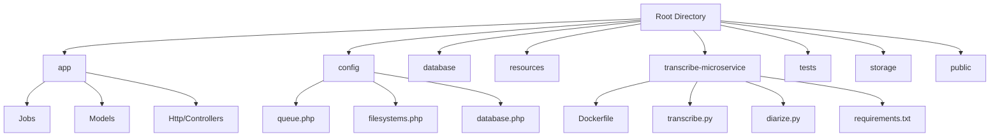
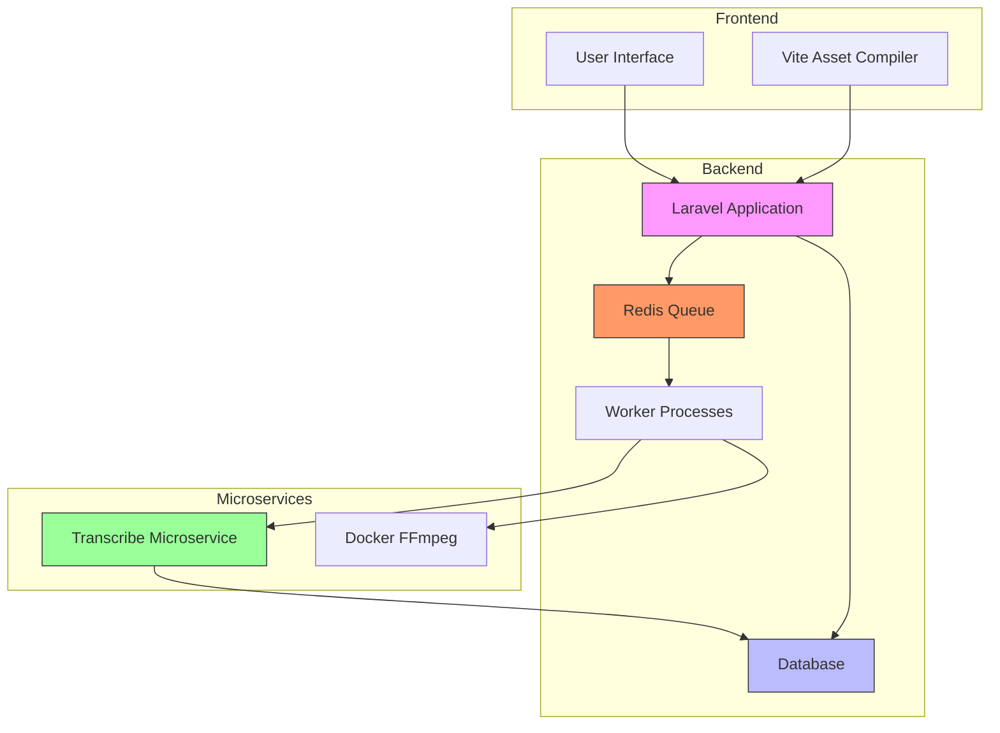
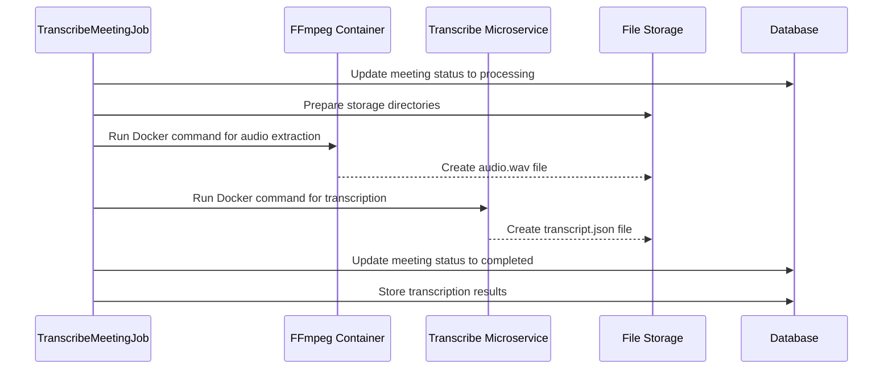
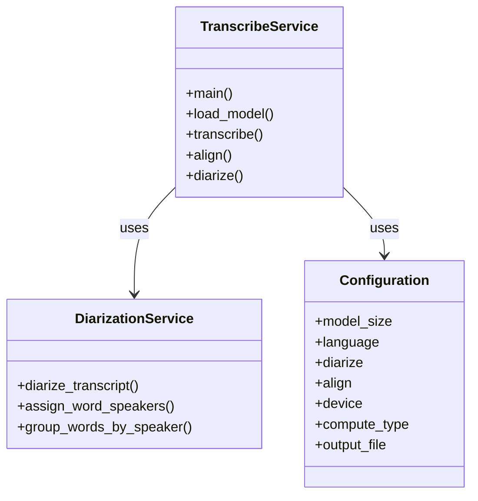
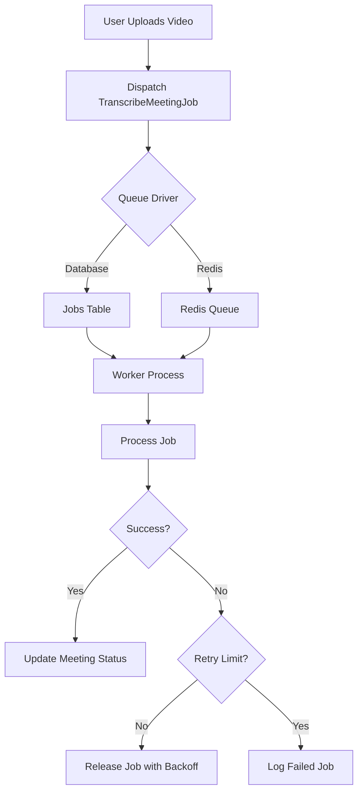
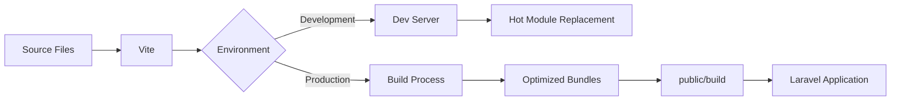
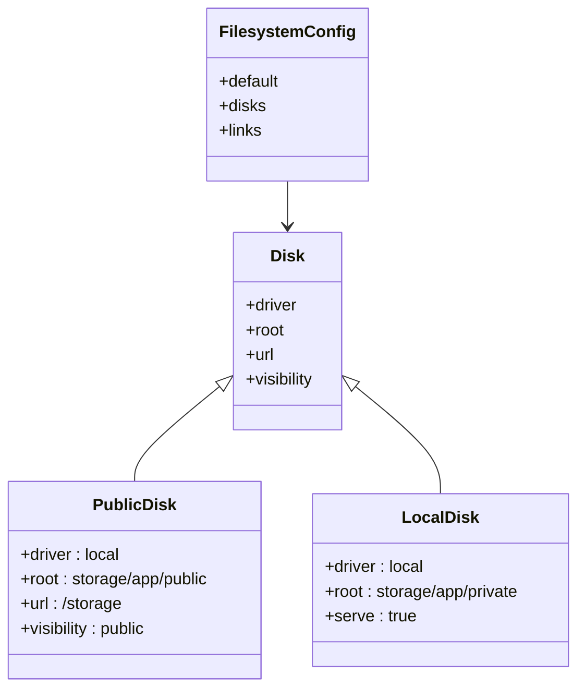
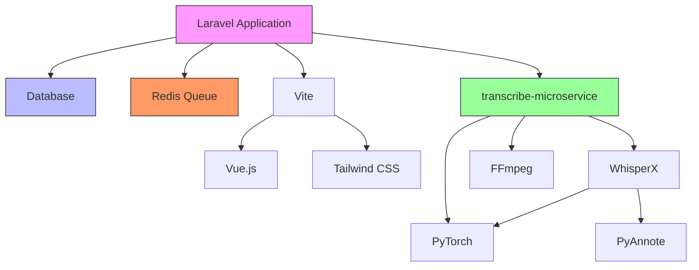

# Deployment Architecture

## Table of Contents
1. [Introduction](#introduction)
2. [Project Structure](#project-structure)
3. [Core Components](#core-components)
4. [Architecture Overview](#architecture-overview)
5. [Detailed Component Analysis](#detailed-component-analysis)
6. [Dependency Analysis](#dependency-analysis)
7. [Performance Considerations](#performance-considerations)
8. [Troubleshooting Guide](#troubleshooting-guide)
9. [Conclusion](#conclusion)

## Introduction
This document provides a comprehensive overview of the deployment architecture for the meetingai application in a production environment. The system is designed with a microservices approach, separating core components into independent containers for scalability and maintainability. The architecture includes a Laravel-based web application, a dedicated transcription microservice, Redis for queue management, and a relational database for persistent storage. This documentation details the integration between components, configuration management, job processing workflow, and production deployment considerations.

## Project Structure
The meetingai application follows a standard Laravel project structure with additional components for specialized functionality. The main application resides in the root directory with typical Laravel folders such as app, config, database, and resources. A key architectural feature is the transcribe-microservice directory, which contains a Python-based transcription service with its own Docker configuration. This separation allows the transcription functionality to be scaled independently from the main web application.

The application uses modern frontend tooling with Vite for asset compilation and Inertia.js for frontend integration. The storage directory contains both framework-generated files and user-uploaded content, while the tests directory includes comprehensive browser, feature, and unit tests using Pest.

**Diagram sources**
- [app/Jobs/TranscribeMeetingJob.php](file://app/Jobs/TranscribeMeetingJob.php)
- [config/queue.php](file://config/queue.php)
- [config/filesystems.php](file://config/filesystems.php)
- [config/database.php](file://config/database.php)
- [transcribe-microservice/Dockerfile](file://transcribe-microservice/Dockerfile)
- [transcribe-microservice/transcribe.py](file://transcribe-microservice/transcribe.py)

**Section sources**
- [app/Jobs/TranscribeMeetingJob.php](file://app/Jobs/TranscribeMeetingJob.php)
- [config/queue.php](file://config/queue.php)
- [config/filesystems.php](file://config/filesystems.php)
- [config/database.php](file://config/database.php)
- [transcribe-microservice/Dockerfile](file://transcribe-microservice/Dockerfile)

## Core Components
The meetingai application consists of several core components that work together to provide meeting transcription functionality. The main Laravel application handles user interface, authentication, and business logic. The TranscribeMeetingJob class processes transcription requests asynchronously. The transcribe-microservice performs the actual audio processing using WhisperX and related libraries. Redis manages the job queue, while the database stores application data and job metadata.

The system uses Vite for frontend asset compilation and serves static assets through the public directory. File storage is configured with separate disks for public and private content, with uploaded videos stored on the public disk for direct access.

**Section sources**
- [app/Jobs/TranscribeMeetingJob.php](file://app/Jobs/TranscribeMeetingJob.php)
- [config/queue.php](file://config/queue.php)
- [config/filesystems.php](file://config/filesystems.php)
- [vite.config.ts](file://vite.config.ts)

## Architecture Overview
The production deployment of meetingai follows a containerized microservices architecture with clear separation of concerns. The system consists of four main containers: the Laravel application container, the database container, the Redis container, and the transcribe-microservice container. These containers communicate through well-defined interfaces and protocols.

The workflow begins when a user uploads a meeting video through the Laravel application. The application stores the video file and dispatches a TranscribeMeetingJob to the queue. Worker processes pick up the job and use Docker to run the transcribe-microservice, which processes the audio and generates a transcription. The results are stored in the database and made available to the user through the application interface.

**Diagram sources**
- [app/Jobs/TranscribeMeetingJob.php](file://app/Jobs/TranscribeMeetingJob.php)
- [config/queue.php](file://config/queue.php)
- [config/database.php](file://config/database.php)
- [transcribe-microservice/Dockerfile](file://transcribe-microservice/Dockerfile)

## Detailed Component Analysis

### Transcription Job Processing
The TranscribeMeetingJob class implements the core transcription workflow, handling the entire process from video upload to completed transcription. The job is configured to run for up to one hour with three retry attempts, ensuring robust processing of large files.

When executed, the job updates the meeting status to "processing" and orchestrates two main operations: video-to-audio conversion using FFmpeg in a Docker container, and audio transcription using the transcribe-microservice. The job uses Docker volume mounting to share files between containers, with input videos mounted from the public storage and output files written to the application's storage directory.

**Diagram sources**
- [app/Jobs/TranscribeMeetingJob.php](file://app/Jobs/TranscribeMeetingJob.php#L50-L200)

**Section sources**
- [app/Jobs/TranscribeMeetingJob.php](file://app/Jobs/TranscribeMeetingJob.php)

### Transcribe Microservice
The transcribe-microservice is a Python application that performs speech-to-text conversion using the WhisperX library. The service is containerized with a Dockerfile that installs all necessary dependencies, including PyTorch, WhisperX, and FFmpeg. The Docker image can be configured for CPU or GPU processing through build arguments.

The microservice consists of two main components: transcribe.py, which handles the transcription workflow, and diarize.py, which performs speaker diarization. The service accepts various command-line arguments to control model size, language, diarization, alignment, and processing parameters. It outputs a JSON file containing the transcription with timestamps and speaker labels.

**Diagram sources**
- [transcribe-microservice/transcribe.py](file://transcribe-microservice/transcribe.py)
- [transcribe-microservice/diarize.py](file://transcribe-microservice/diarize.py)
- [transcribe-microservice/Dockerfile](file://transcribe-microservice/Dockerfile)

### Queue System
The application uses Laravel's queue system to handle transcription jobs asynchronously. The queue configuration supports multiple drivers, with the default set to database. However, Redis is available as an alternative driver for improved performance in production environments.

The TranscribeMeetingJob implements the ShouldQueue interface, allowing it to be dispatched to the queue system. The job is configured with a one-hour timeout and three retry attempts, with exponential backoff delays of 1, 5, and 15 minutes between attempts. Failed jobs are logged to the failed_jobs table in the database for monitoring and troubleshooting.

**Diagram sources**
- [app/Jobs/TranscribeMeetingJob.php](file://app/Jobs/TranscribeMeetingJob.php)
- [config/queue.php](file://config/queue.php)

**Section sources**
- [app/Jobs/TranscribeMeetingJob.php](file://app/Jobs/TranscribeMeetingJob.php)
- [config/queue.php](file://config/queue.php)

### Asset Compilation and Serving
The application uses Vite for frontend asset compilation and bundling. The Vite configuration is defined in vite.config.ts, which sets up the Laravel Vite plugin with the main application entry point at resources/js/app.ts. The configuration also includes plugins for Vue.js and Tailwind CSS, enabling modern frontend development workflows.

During development, Vite provides hot module replacement for rapid iteration. In production, assets are compiled into optimized bundles and served through the public directory. The Laravel application automatically generates asset URLs using the Vite manifest, ensuring cache-busting through content hashing.

**Diagram sources**
- [vite.config.ts](file://vite.config.ts)
- [resources/js/app.ts](file://resources/js/app.ts)

**Section sources**
- [vite.config.ts](file://vite.config.ts)

### File Storage Configuration
The application uses Laravel's filesystem abstraction to manage file storage. The configuration defines multiple disks, with the public disk used for storing uploaded videos and the local disk for private application data. The public disk is configured with a URL prefix that maps to the storage symbolic link in the public directory.

Uploaded videos are stored on the public disk, making them directly accessible via HTTP. Transcription outputs are stored in the application's storage directory, organized by meeting ID. The system uses Docker volume mounting to share these files with the transcribe-microservice container during processing.

**Diagram sources**
- [config/filesystems.php](file://config/filesystems.php)

**Section sources**
- [config/filesystems.php](file://config/filesystems.php)

## Dependency Analysis
The meetingai application has a well-defined dependency structure with clear separation between components. The main Laravel application depends on the database and queue system for persistent storage and job processing. The transcribe-microservice has its own set of Python dependencies, including WhisperX, PyTorch, and FFmpeg, which are managed through pip and Docker.

The frontend dependencies are managed through npm, with Vite, Vue.js, and Tailwind CSS as core components. The application uses Inertia.js to bridge the Laravel backend with the Vue.js frontend, providing a seamless single-page application experience.

**Diagram sources**
- [composer.json](file://composer.json)
- [package.json](file://package.json)
- [transcribe-microservice/requirements.txt](file://transcribe-microservice/requirements.txt)
- [transcribe-microservice/Dockerfile](file://transcribe-microservice/Dockerfile)

## Performance Considerations
The architecture includes several performance optimizations for production deployment. The use of Redis as a queue driver can significantly improve job processing throughput compared to the database driver. The transcribe-microservice can be configured for GPU acceleration by building the Docker image with CUDA support, dramatically reducing transcription time for large files.

Horizontal scaling is supported by running multiple Laravel application instances behind a load balancer and scaling worker processes independently based on queue load. The database can be optimized with proper indexing on frequently queried fields such as meeting status and timestamps.

For high availability, the system can be deployed across multiple servers with shared storage for uploaded videos and transcription outputs. Monitoring can be implemented using Laravel's logging system and external tools to track job processing times, error rates, and system resource usage.

## Troubleshooting Guide
Common issues in the meetingai deployment typically fall into several categories: file access problems, Docker execution errors, queue processing failures, and transcription service issues.

For file access problems, verify that the storage symbolic link is properly created and that file permissions allow the web server and worker processes to read and write to the storage directories. Docker execution errors often relate to volume mounting paths, especially on Windows systems where path conversion may be needed.

Queue processing failures can be diagnosed by checking the failed_jobs table in the database and reviewing application logs. Transcription service issues may require examining the Docker container logs and verifying that the required Python dependencies are properly installed.

The TranscribeMeetingJob includes comprehensive error handling with user-friendly error messages that distinguish between different failure modes such as missing video files, Docker execution failures, and transcription timeouts.

**Section sources**
- [app/Jobs/TranscribeMeetingJob.php](file://app/Jobs/TranscribeMeetingJob.php#L250-L400)

## Conclusion
The meetingai application is designed with a scalable, containerized architecture that separates concerns between the web application, database, queue system, and specialized microservices. This architecture enables independent scaling of components based on workload, with the transcription service being particularly resource-intensive and benefiting from dedicated resources.

The use of Docker for the transcribe-microservice ensures consistent execution across environments and simplifies dependency management for the complex Python transcription stack. The queue system provides reliable asynchronous processing with robust error handling and retry mechanisms.

For production deployment, considerations include selecting appropriate hardware for the transcription workload, implementing monitoring and alerting, and planning for backup and disaster recovery. The architecture supports horizontal scaling of web servers and worker processes, allowing the system to handle increased load by adding more instances of each component.

**Referenced Files in This Document**   
- [TranscribeMeetingJob.php](file://app/Jobs/TranscribeMeetingJob.php)
- [queue.php](file://config/queue.php)
- [filesystems.php](file://config/filesystems.php)
- [database.php](file://config/database.php)
- [vite.config.ts](file://vite.config.ts)
- [Dockerfile](file://transcribe-microservice/Dockerfile)
- [transcribe.py](file://transcribe-microservice/transcribe.py)
- [diarize.py](file://transcribe-microservice/diarize.py)
- [requirements.txt](file://transcribe-microservice/requirements.txt)