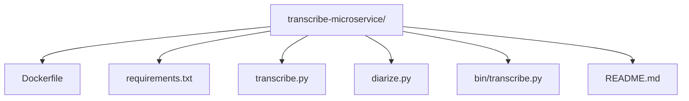
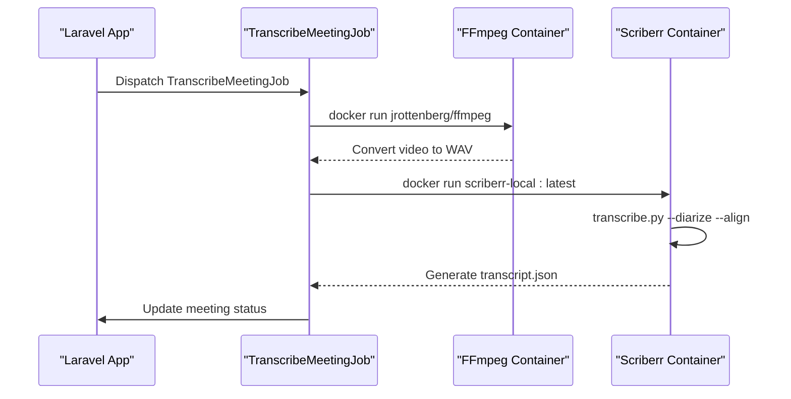
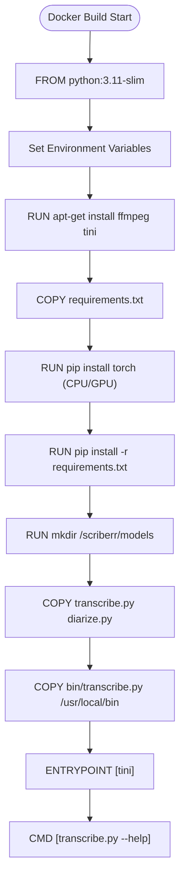
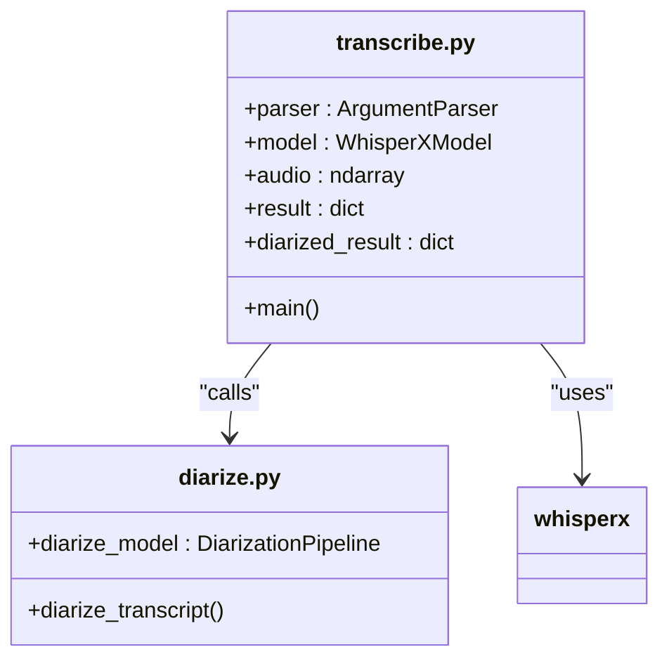
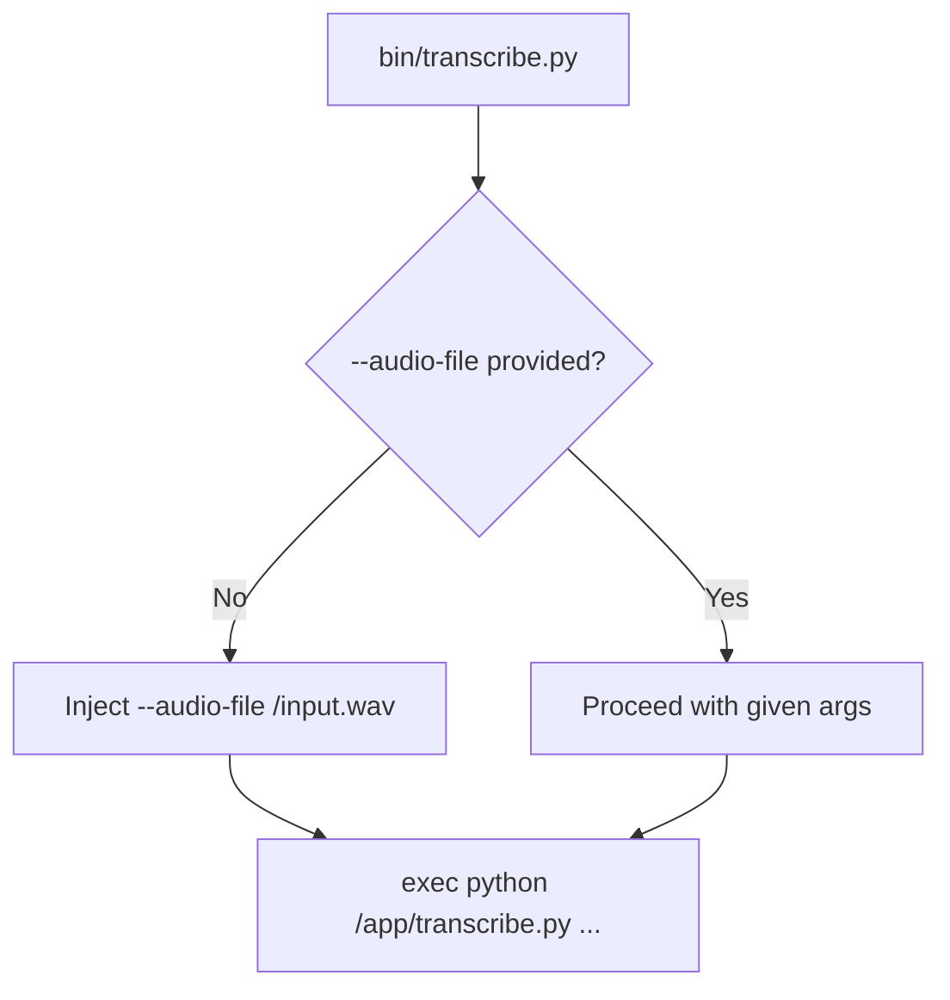
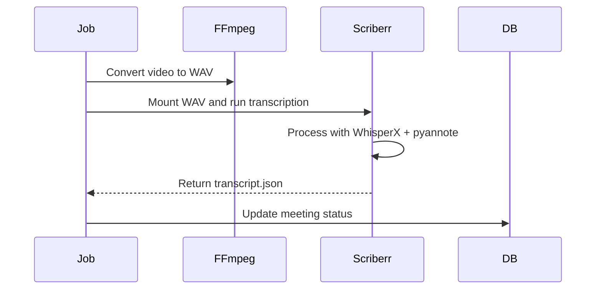
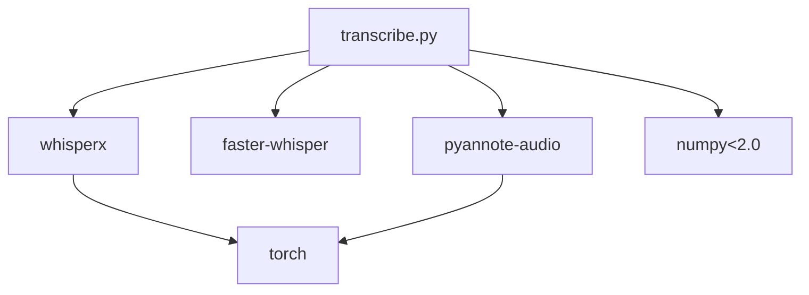

# Microservice Containerization


## Table of Contents
1. [Introduction](#introduction)
2. [Project Structure](#project-structure)
3. [Core Components](#core-components)
4. [Architecture Overview](#architecture-overview)
5. [Detailed Component Analysis](#detailed-component-analysis)
6. [Dependency Analysis](#dependency-analysis)
7. [Performance Considerations](#performance-considerations)
8. [Troubleshooting Guide](#troubleshooting-guide)
9. [Conclusion](#conclusion)

## Introduction
The **transcribe-microservice** is a Dockerized Python application designed to perform audio transcription, speaker diarization, and segment alignment using the WhisperX framework. It operates as a standalone CLI tool within a container, enabling integration with a Laravel-based host application via Docker-in-Docker execution. The microservice is optimized for reproducibility, caching, and efficient resource utilization, supporting both CPU and GPU inference. This document details its containerization strategy, component interactions, configuration, and operational best practices.

## Project Structure
The microservice resides in the `transcribe-microservice/` directory and includes essential components for transcription, containerization, and dependency management.





**Diagram sources**
- [transcribe-microservice/Dockerfile](file://transcribe-microservice/Dockerfile#L1-L54)
- [transcribe-microservice/transcribe.py](file://transcribe-microservice/transcribe.py#L1-L201)

**Section sources**
- [transcribe-microservice/Dockerfile](file://transcribe-microservice/Dockerfile#L1-L54)
- [transcribe-microservice/README.md](file://transcribe-microservice/README.md#L1-L77)

## Core Components
The microservice consists of several key components:
- **Dockerfile**: Defines the container image build process.
- **transcribe.py**: Main Python script for transcription using WhisperX.
- **diarize.py**: Handles speaker diarization using pyannote-audio.
- **bin/transcribe.py**: Bash wrapper that injects default arguments.
- **requirements.txt**: Specifies Python dependencies.
- **README.md**: Provides usage and build instructions.

These components work together to provide a robust, containerized transcription pipeline.

**Section sources**
- [transcribe-microservice/transcribe.py](file://transcribe-microservice/transcribe.py#L1-L201)
- [transcribe-microservice/diarize.py](file://transcribe-microservice/diarize.py#L1-L131)
- [transcribe-microservice/bin/transcribe.py](file://transcribe-microservice/bin/transcribe.py#L1-L18)

## Architecture Overview
The microservice is invoked by the Laravel application via the `TranscribeMeetingJob`, which orchestrates video-to-audio conversion and transcription using Docker containers.





**Diagram sources**
- [app/Jobs/TranscribeMeetingJob.php](file://app/Jobs/TranscribeMeetingJob.php#L1-L400)
- [transcribe-microservice/transcribe.py](file://transcribe-microservice/transcribe.py#L1-L201)

## Detailed Component Analysis

### Dockerfile Analysis
The Dockerfile implements a multi-stage build with optimized layering for caching and minimal image size.





**Key Features:**
- **Base Image**: Uses `python:3.11-slim` for minimal footprint.
- **Layering Strategy**: Dependencies are installed before code to leverage Docker layer caching.
- **CUDA Support**: Optional via `--build-arg WITH_CUDA=true`.
- **Security**: Runs as non-root user; minimal attack surface.
- **Init Process**: Uses `tini` to handle signals and zombie processes.

**Section sources**
- [transcribe-microservice/Dockerfile](file://transcribe-microservice/Dockerfile#L1-L54)

### transcribe.py Analysis
The main transcription script uses WhisperX for ASR, with optional alignment and diarization.





**Functionality:**
- Parses CLI arguments for model size, language, device, etc.
- Loads WhisperX model with specified compute type and threading.
- Performs transcription, optional alignment, and diarization.
- Outputs JSON transcript with speaker labels.

**Section sources**
- [transcribe-microservice/transcribe.py](file://transcribe-microservice/transcribe.py#L1-L201)

### bin/transcribe.py Analysis
The entrypoint script automatically injects `--audio-file /input.wav` if not provided.





This enables simplified invocation when input is mounted at `/input.wav`.

**Section sources**
- [transcribe-microservice/bin/transcribe.py](file://transcribe-microservice/bin/transcribe.py#L1-L18)

### Integration with Host Application
The Laravel application uses `TranscribeMeetingJob` to invoke the microservice.





The job uses `Symfony\Component\Process\Process` to execute Docker commands securely.

**Section sources**
- [app/Jobs/TranscribeMeetingJob.php](file://app/Jobs/TranscribeMeetingJob.php#L1-L400)

## Dependency Analysis
The microservice relies on several key Python packages:





**requirements.txt:**

```
numpy==2.3.2
whisperx==3.4.2
faster-whisper==1.2.0
pyannote-audio==3.3.2
pyannote-core==5.0.0
pyannote-pipeline==3.0.1
pyannote-database==5.1.3
pyannote-metrics==3.2.1
```


**Section sources**
- [transcribe-microservice/requirements.txt](file://transcribe-microservice/requirements.txt#L1-L9)
- [transcribe-microservice/transcribe.py](file://transcribe-microservice/transcribe.py#L1-L201)

## Performance Considerations
- **Threading**: Configured via `--threads` argument; sets `OMP_NUM_THREADS`, `torch.set_num_threads()`.
- **Compute Type**: Supports `int8`, `float16`, `float32` for inference optimization.
- **Model Caching**: Models stored in `/scriberr/models` for reuse across runs.
- **GPU Support**: Enabled via `WITH_CUDA=true` build arg and `--gpus all` runtime flag.
- **Memory Management**: Explicit CUDA cache clearing before/after diarization.

**Section sources**
- [transcribe-microservice/transcribe.py](file://transcribe-microservice/transcribe.py#L1-L201)
- [transcribe-microservice/diarize.py](file://transcribe-microservice/diarize.py#L1-L131)

## Troubleshooting Guide
Common issues and solutions:

- **Model Download Failures**: Ensure internet access; bind-mount `/scriberr/models`.
- **CUDA Out of Memory**: Reduce batch size or use CPU mode.
- **Diarization Failures**: Provide `HF_API_KEY` for private models.
- **File Not Found**: Verify volume mounts use correct paths (use `dockerPath()` helper).
- **Permission Errors**: Ensure container has read access to input files.

The `TranscribeMeetingJob` includes comprehensive logging and error handling with user-friendly messages.

**Section sources**
- [app/Jobs/TranscribeMeetingJob.php](file://app/Jobs/TranscribeMeetingJob.php#L1-L400)
- [transcribe-microservice/README.md](file://transcribe-microservice/README.md#L1-L77)

## Conclusion
The **transcribe-microservice** provides a robust, containerized solution for audio transcription with speaker diarization. Its modular design, optimized Docker build, and seamless integration with the Laravel host application make it a scalable and maintainable component. Key strengths include support for CPU/GPU inference, efficient layering for caching, and comprehensive error handling. Best practices include using environment variables for configuration, mounting model caches, and monitoring resource usage during transcription.

**Referenced Files in This Document**   
- [transcribe-microservice/Dockerfile](file://transcribe-microservice/Dockerfile#L1-L54)
- [transcribe-microservice/README.md](file://transcribe-microservice/README.md#L1-L77)
- [transcribe-microservice/bin/transcribe.py](file://transcribe-microservice/bin/transcribe.py#L1-L18)
- [transcribe-microservice/transcribe.py](file://transcribe-microservice/transcribe.py#L1-L201)
- [transcribe-microservice/diarize.py](file://transcribe-microservice/diarize.py#L1-L131)
- [transcribe-microservice/requirements.txt](file://transcribe-microservice/requirements.txt#L1-L9)
- [app/Jobs/TranscribeMeetingJob.php](file://app/Jobs/TranscribeMeetingJob.php#L1-L400)
- [config/services.php](file://config/services.php#L1-L46)