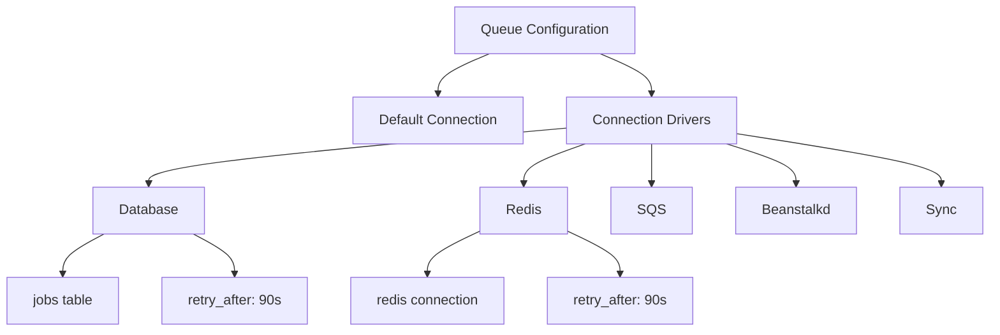
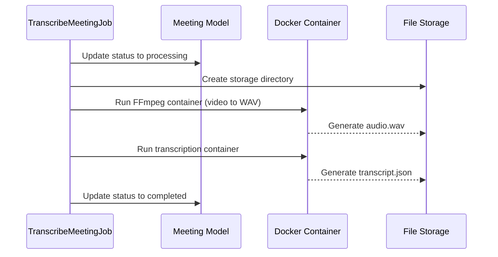
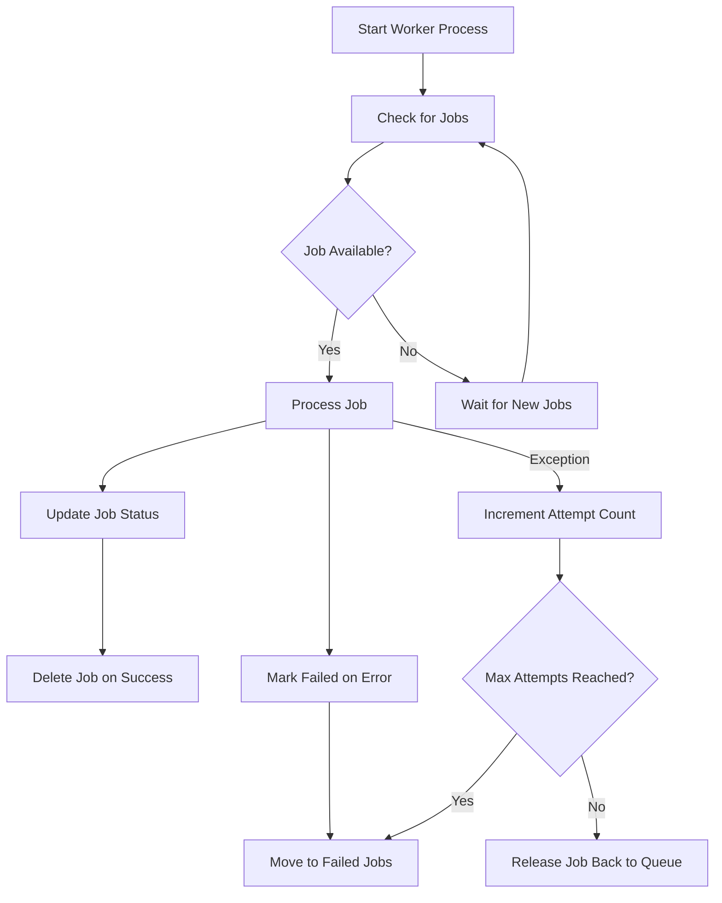
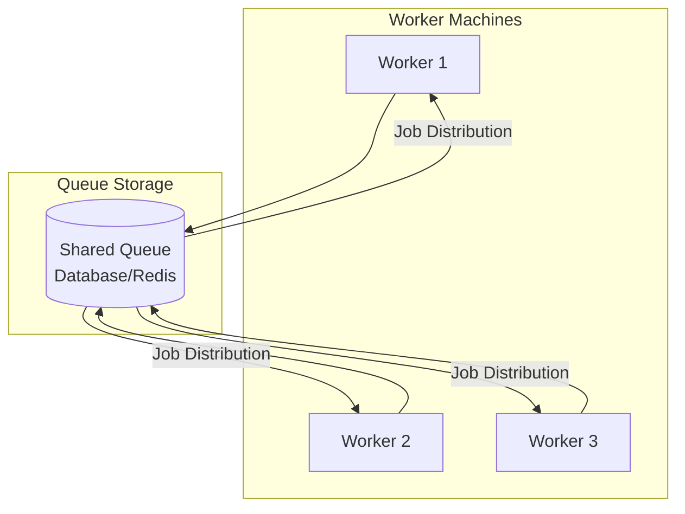
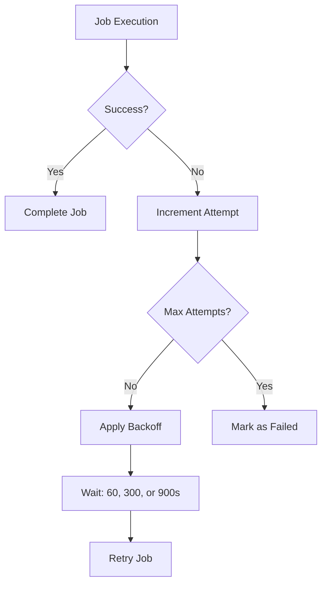
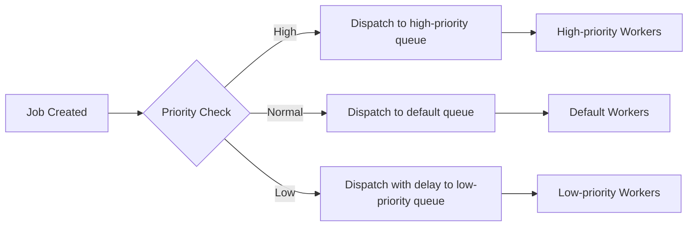
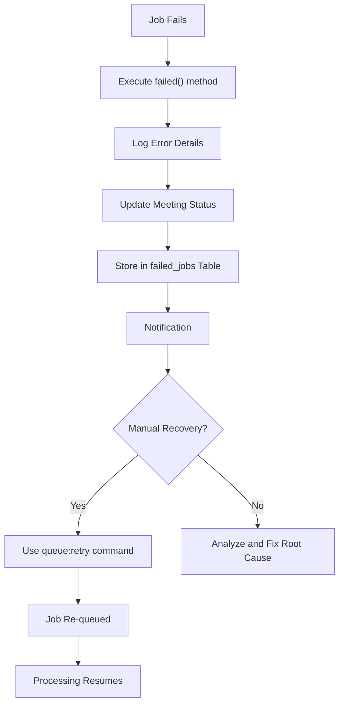

# Queue Processing Infrastructure


## Table of Contents
1. [Queue Configuration and Connection Drivers](#queue-configuration-and-connection-drivers)
2. [TranscribeMeetingJob Implementation](#transcribemeetingjob-implementation)
3. [Worker Process Execution and Daemon Configuration](#worker-process-execution-and-daemon-configuration)
4. [Scaling Strategies for Worker Processes](#scaling-strategies-for-worker-processes)
5. [Monitoring Queue Performance](#monitoring-queue-performance)
6. [Handling Long-Running Tasks and Timeouts](#handling-long-running-tasks-and-timeouts)
7. [Job Dispatching with Delay and Prioritization](#job-dispatching-with-delay-and-prioritization)
8. [Failed Jobs Management and Recovery](#failed-jobs-management-and-recovery)

## Queue Configuration and Connection Drivers

The queue system is configured through the `config/queue.php` file, which defines multiple connection drivers for handling asynchronous jobs. The default queue connection is set via the `QUEUE_CONNECTION` environment variable, defaulting to the `database` driver.

The configuration supports several queue backends:
- **sync**: Immediate execution without queuing
- **database**: Jobs stored in a database table
- **redis**: High-performance in-memory queue
- **sqs**: Amazon SQS cloud-based queue
- **beanstalkd**: Lightweight message queue

Each connection has specific configuration options including retry timing, queue names, and connection settings. The database driver uses the `jobs` table by default, while Redis uses a configurable connection and queue name.





**Diagram sources**
- [queue.php](file://config/queue.php#L1-L113)

**Section sources**
- [queue.php](file://config/queue.php#L1-L113)

## TranscribeMeetingJob Implementation

The `TranscribeMeetingJob` class handles the asynchronous transcription of meeting recordings. It implements the `ShouldQueue` interface and uses Laravel's queue traits for serialization and interaction.

### Job Properties and Configuration
The job is configured with specific execution parameters:
- **timeout**: 3600 seconds (1 hour) maximum execution time
- **tries**: 3 retry attempts allowed
- **maxExceptions**: 3 maximum exceptions before permanent failure


```php
public $timeout = 3600; // 1 hour timeout
public $tries = 3; // Allow 3 attempts
public $maxExceptions = 3;
```


### Job Execution Flow
The job processes meeting transcription through a multi-step workflow:
1. Updates meeting status to "processing"
2. Converts video to WAV format using Dockerized FFmpeg
3. Transcribes audio using a Dockerized transcription service
4. Updates meeting status to "completed" or "failed"

The job uses Docker containers for both conversion and transcription, ensuring consistent execution environments. It dynamically determines CPU thread count for optimal performance.





**Diagram sources**
- [TranscribeMeetingJob.php](file://app/Jobs/TranscribeMeetingJob.php#L0-L400)

**Section sources**
- [TranscribeMeetingJob.php](file://app/Jobs/TranscribeMeetingJob.php#L0-L400)

## Worker Process Execution and Daemon Configuration

Worker processes are executed using Laravel's Artisan command `queue:work`. The development environment configuration in `composer.json` shows the use of `queue:listen` with specific parameters:


```json
"dev": [
    "npx concurrently -c \"#93c5fd,#c4b5fd,#fdba74\" \"php artisan serve\" \"php artisan queue:listen --tries=1 --timeout=3600 --memory=512\" \"npm run dev\" --names='server,queue,vite'"
]
```


### Worker Configuration Parameters
- **tries**: Number of attempts before failing (1 in development)
- **timeout**: Maximum job execution time (3600 seconds)
- **memory**: Memory limit for the worker process (512MB)

For production, the `queue:work` command should be used with supervisor or similar process managers to ensure continuous operation. The worker should run as a daemon process with automatic restart capabilities.





**Diagram sources**
- [composer.json](file://composer.json#L44-L73)
- [queue.php](file://config/queue.php#L1-L113)

**Section sources**
- [composer.json](file://composer.json#L44-L73)

## Scaling Strategies for Worker Processes

The queue system can be scaled across multiple machines using shared queue storage. The database and Redis drivers both support distributed worker configurations.

### Horizontal Scaling Options
- **Database Driver**: Multiple workers can poll the same `jobs` table
- **Redis Driver**: High-performance option for distributed environments
- **SQS Driver**: Cloud-based solution for auto-scaling environments

### Worker Distribution Strategy
Workers should be distributed based on processing capacity:
- CPU-intensive transcription tasks benefit from dedicated worker machines
- Multiple workers can run on a single machine if sufficient CPU and memory
- Worker count should be tuned based on average job duration and queue volume

For optimal performance, consider separating workers by job type or priority, using different queue connections for different processing needs.





**Section sources**
- [queue.php](file://config/queue.php#L1-L113)

## Monitoring Queue Performance

The system includes several metrics for monitoring queue performance and job throughput.

### Real-Time Status Tracking
The Meeting model includes calculated attributes for monitoring:
- **elapsed_time**: Time since processing started
- **processing_progress**: Percentage of estimated processing complete
- **queue_progress**: Position in queue for pending jobs
- **estimated_remaining_time**: Predicted time until completion

These metrics are exposed through the `/meetings/{id}/status` API endpoint and updated in real-time via the frontend's `useRealTimeUpdates` composable.

### Performance Metrics
Key monitoring indicators include:
- **Job throughput**: Number of jobs processed per time period
- **Queue latency**: Time jobs spend waiting for processing
- **Failure rate**: Percentage of jobs that fail after all retries
- **Average processing time**: Duration of successful job execution


**Section sources**
- [Meeting.php](file://app/Models/Meeting.php#L107-L153)
- [useRealTimeUpdates.ts](file://resources/js/lib/useRealTimeUpdates.ts#L0-L38)

## Handling Long-Running Tasks and Timeouts

The system is designed to handle long-running transcription tasks with specific safeguards against timeouts and resource exhaustion.

### Timeout Configuration
The `TranscribeMeetingJob` has a 1-hour timeout, with subprocess commands given reduced timeouts to ensure proper error handling:


```php
public $timeout = 3600; // 1 hour timeout
$this->runShell($ffmpegCmd, $this->timeout - 60); // leave buffer
$this->runShell($scriberrCmd, $this->timeout - 120); // leave more buffer
```


### Memory Management
The worker process is configured with a 512MB memory limit to prevent memory leaks from affecting system stability. The job itself includes cleanup routines for temporary files.

### Failure Recovery
The job implements a backoff strategy for retries:

```php
public function backoff(): array
{
    return [60, 300, 900]; // 1 minute, 5 minutes, 15 minutes
}
```


This exponential backoff prevents overwhelming the system during transient failures.





**Section sources**
- [TranscribeMeetingJob.php](file://app/Jobs/TranscribeMeetingJob.php#L0-L400)

## Job Dispatching with Delay and Prioritization

Jobs are dispatched using Laravel's queue system, with the `TestTranscriptionWorkflow` command demonstrating the dispatch pattern:


```php
TranscribeMeetingJob::dispatch($meeting);
```


### Delayed Execution
While not explicitly shown in the code, Laravel supports delayed dispatching:

```php
TranscribeMeetingJob::dispatch($meeting)->delay(now()->addMinutes(10));
```


### Prioritization
The system can support job prioritization through:
- Multiple queue connections with different priorities
- Queue weighting in worker configuration
- Job-specific delay based on priority

The current configuration uses a single default queue, but could be extended to support multiple queues for different priority levels.





**Section sources**
- [TestTranscriptionWorkflow.php](file://app/Console/Commands/TestTranscriptionWorkflow.php#L0-L50)
- [TranscribeMeetingJob.php](file://app/Jobs/TranscribeMeetingJob.php#L0-L400)

## Failed Jobs Management and Recovery

The system provides comprehensive failed job management through database storage and recovery workflows.

### Failed Jobs Table Structure
The `failed_jobs` table is created by the migration and includes:
- **id**: Primary key
- **uuid**: Unique identifier
- **connection**: Queue connection used
- **queue**: Queue name
- **payload**: Job data in JSON format
- **exception**: Exception message and stack trace
- **failed_at**: Timestamp of failure


```php
Schema::create('failed_jobs', function (Blueprint $table) {
    $table->id();
    $table->string('uuid')->unique();
    $table->text('connection');
    $table->text('queue');
    $table->longText('payload');
    $table->longText('exception');
    $table->timestamp('failed_at')->useCurrent();
});
```


### Failure Handling Workflow
The `TranscribeMeetingJob` implements a `failed()` method that:
1. Logs detailed error information
2. Updates the meeting record with error details
3. Provides user-friendly error messages
4. Cleans up temporary files


```php
public function failed(\Throwable $exception): void
{
    Log::error("TranscribeMeetingJob failed for meeting {$this->meeting->id}", [
        'error' => $exception->getMessage(),
        'trace' => $exception->getTraceAsString(),
        'meeting_id' => $this->meeting->id,
        'attempts' => $this->attempts()
    ]);
    
    $this->meeting->update([
        'status' => 'failed',
        'processing_completed_at' => now(),
        'error_message' => $this->getUserFriendlyErrorMessage($exception),
        'technical_error' => $exception->getMessage()
    ]);
    
    $this->cleanupTempFiles();
}
```


### Recovery Strategies
Failed jobs can be recovered through:
- Manual retry via Laravel's queue:retry Artisan command
- Automatic retry within the configured retry window
- Data correction and manual job resubmission

The system configuration uses the `database-uuids` driver for failed job storage, ensuring persistent record of all failures.





**Diagram sources**
- [0001_01_01_000002_create_jobs_table.php](file://database/migrations/0001_01_01_000002_create_jobs_table.php#L36-L56)
- [queue.php](file://config/queue.php#L76-L111)
- [TranscribeMeetingJob.php](file://app/Jobs/TranscribeMeetingJob.php#L322-L398)

**Section sources**
- [0001_01_01_000002_create_jobs_table.php](file://database/migrations/0001_01_01_000002_create_jobs_table.php#L36-L56)
- [queue.php](file://config/queue.php#L76-L111)
- [TranscribeMeetingJob.php](file://app/Jobs/TranscribeMeetingJob.php#L322-L398)

**Referenced Files in This Document**   
- [queue.php](file://config/queue.php)
- [TranscribeMeetingJob.php](file://app/Jobs/TranscribeMeetingJob.php)
- [0001_01_01_000002_create_jobs_table.php](file://database/migrations/0001_01_01_000002_create_jobs_table.php)
- [TestTranscriptionWorkflow.php](file://app/Console/Commands/TestTranscriptionWorkflow.php)
- [composer.json](file://composer.json)