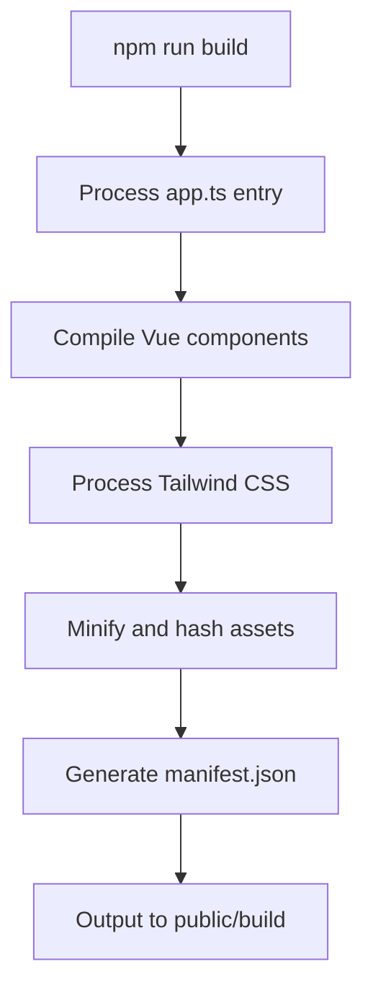
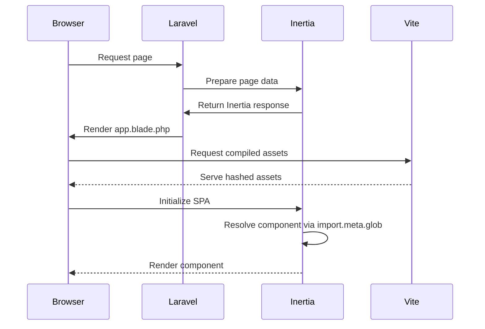
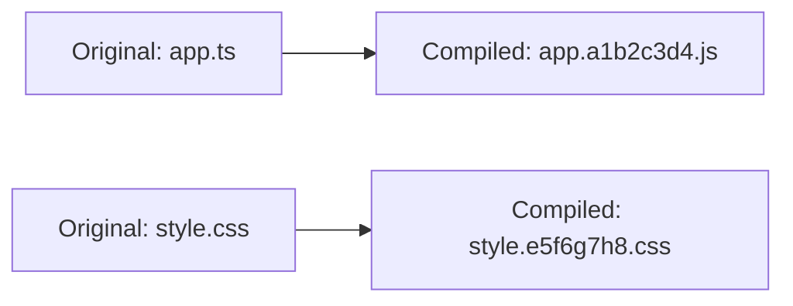
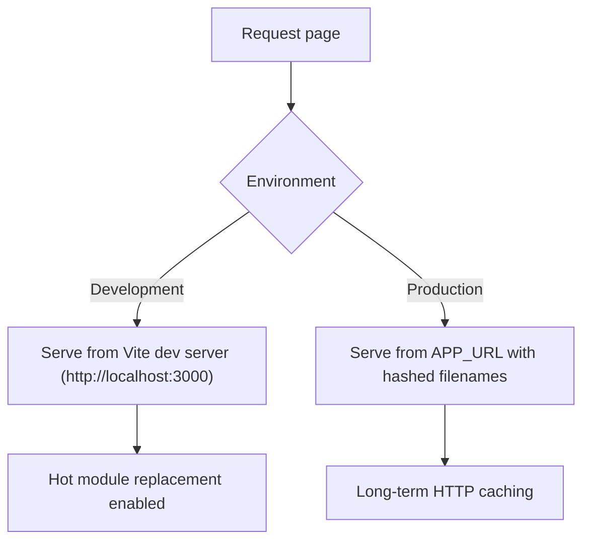
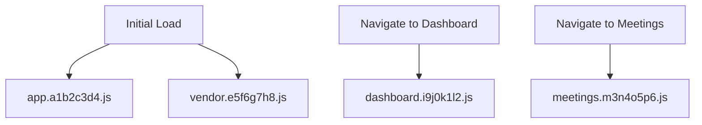

# Asset Compilation and Delivery


## Table of Contents
1. [Introduction](#introduction)
2. [Vite Configuration Overview](#vite-configuration-overview)
3. [Build Process and Asset Manifest](#build-process-and-asset-manifest)
4. [Inertia.js Asset Resolution](#inertiajs-asset-resolution)
5. [Cache-Busting Strategies](#cache-busting-strategies)
6. [Environment-Aware Asset Serving](#environment-aware-asset-serving)
7. [Frontend Optimization Techniques](#frontend-optimization-techniques)
8. [CDN Integration and CSP Configuration](#cdn-integration-and-csp-configuration)

## Introduction
This document provides a comprehensive overview of the frontend asset pipeline in production for the Laravel-based application using Vite, Inertia.js, and Vue 3. It details the configuration, build process, asset resolution, caching strategies, and optimization techniques that ensure efficient delivery of frontend assets. The system leverages modern tooling to provide fast development experiences and optimized production builds.

## Vite Configuration Overview

The Vite configuration is defined in `vite.config.ts` and orchestrates the entire frontend build process. It integrates Laravel-specific plugins with Vue 3 and Tailwind CSS support.


```typescript
import vue from '@vitejs/plugin-vue';
import laravel from 'laravel-vite-plugin';
import tailwindcss from '@tailwindcss/vite';
import { defineConfig } from 'vite';

export default defineConfig({
    plugins: [
        laravel({
            input: ['resources/js/app.ts'],
            ssr: 'resources/js/ssr.ts',
            refresh: true,
        }),
        tailwindcss(),
        vue({
            template: {
                transformAssetUrls: {
                    base: null,
                    includeAbsolute: false,
                },
            },
        }),
    ],
});
```


**Section sources**
- [vite.config.ts](file://vite.config.ts#L1-L23)

### Input/Output Configuration
The Vite configuration specifies the entry points for both client-side and server-side rendering:

- **Input**: `resources/js/app.ts` serves as the main entry point for client-side application initialization
- **SSR Entry**: `resources/js/ssr.ts` is used for server-side rendering when enabled
- **Output**: Compiled assets are automatically managed by Laravel's Vite plugin and served from the public directory during development and from the build output in production

### Environment-Specific Settings
The configuration supports different environments through Vite's built-in mode system and Laravel's environment variables. The `refresh` option enables hot module replacement during development, improving developer experience.

### CDN Integration
While not explicitly configured in `vite.config.ts`, the Laravel Vite plugin respects the `APP_URL` environment variable, allowing assets to be served from a CDN in production by setting the appropriate base URL.

## Build Process and Asset Manifest

The build process is triggered by the `npm run build` command, which executes Vite's build routine through the Laravel Vite plugin.


```json
{
    "scripts": {
        "dev": "vite",
        "build": "vite build",
        "preview": "vite preview"
    }
}
```


**Section sources**
- [package.json](file://package.json#L10-L15)

### Build Workflow
When `npm run build` is executed:

1. Vite processes the entry point `resources/js/app.ts`
2. The Laravel Vite plugin resolves all page components using dynamic imports
3. Vue 3 components are compiled and optimized
4. Tailwind CSS is processed and purged
5. Assets are minified and hashed for cache-busting
6. The manifest file is generated in the `public/build` directory

### Generated Asset Manifest
The build process generates a `manifest.json` file that maps original asset names to their hashed versions. This manifest is used by Laravel's `@vite` Blade directive to reference the correct asset files in production.





**Diagram sources**
- [vite.config.ts](file://vite.config.ts#L1-L23)
- [package.json](file://package.json#L10-L15)

## Inertia.js Asset Resolution

Inertia.js resolves compiled assets through a combination of server-side middleware and client-side initialization.

### Server-Side Configuration
The `HandleInertiaRequests` middleware configures Inertia's behavior:


```php
class HandleInertiaRequests extends Middleware
{
    protected $rootView = 'app';

    public function version(Request $request): ?string
    {
        return parent::version($request);
    }

    public function share(Request $request): array
    {
        return array_merge(parent::share($request), [
            'app' => [
                'name' => config('app.name'),
                'url' => config('app.url'),
                'environment' => config('app.env'),
            ],
            'ziggy' => [
                ...(new Ziggy)->toArray(),
                'location' => $request->url(),
            ],
            'user' => fn () => $request->user()
                ? $request->user()->only('id', 'name', 'email')
                : null,
        ]);
    }
}
```


**Section sources**
- [HandleInertiaRequests.php](file://app/Http/Middleware/HandleInertiaRequests.php#L1-L67)

### Client-Side Initialization
The `app.ts` file initializes the Inertia application and resolves page components:


```typescript
createInertiaApp({
    title: (title) => (title ? `${title} - ${appName}` : appName),
    resolve: (name) => resolvePageComponent(`./pages/${name}.vue`, import.meta.glob<DefineComponent>('./pages/**/*.vue')),
    setup({ el, App, props, plugin }) {
        const app = createApp({ render: () => h(App, props) })
            .use(plugin)
            .use(ZiggyVue);

        app.config.errorHandler = (error, instance, info) => {
            console.error('Vue error:', error, info);
            errorHandler.handleError(error, {
                component: instance?.$options.name || 'unknown',
                action: 'vue_error',
                data: { info }
            });
        };

        app.mount(el);
    },
    progress: {
        color: '#4B5563',
        showSpinner: true,
    },
});
```


**Section sources**
- [app.ts](file://resources/js/app.ts#L1-L43)

### Component Resolution
Inertia.js uses dynamic imports to resolve Vue components based on the route. The `resolvePageComponent` function from `laravel-vite-plugin/inertia-helpers` locates components in the `resources/js/pages` directory and handles the import process.





**Diagram sources**
- [app.ts](file://resources/js/app.ts#L1-L43)
- [HandleInertiaRequests.php](file://app/Http/Middleware/HandleInertiaRequests.php#L1-L67)
- [app.blade.php](file://resources/views/app.blade.php#L1-L23)

## Cache-Busting Strategies

The application employs multiple cache-busting strategies to ensure users receive updated assets.

### Hashed Filenames
Vite automatically generates hashed filenames for all compiled assets during the build process. This ensures that when content changes, the filename changes, forcing browsers to download the new version.





**Diagram sources**
- [vite.config.ts](file://vite.config.ts#L1-L23)

### HTTP Caching Headers
The Laravel framework configures appropriate HTTP caching headers for static assets:

- **Hashed assets**: Long-term caching (1 year) with immutable directive
- **Non-hashed assets**: Short-term caching with validation

This strategy maximizes cache efficiency while ensuring updates are delivered promptly.

**Section sources**
- [vite.config.ts](file://vite.config.ts#L1-L23)

## Environment-Aware Asset Serving

The application uses environment variables to configure asset serving behavior.

### APP_URL Configuration
The `APP_URL` environment variable in `.env` determines the base URL for asset serving:


```env
APP_URL=https://example.com
```


This value is used by Laravel's `config('app.url')` and passed to the frontend via the Inertia shared data system.

**Section sources**
- [app.php](file://config/app.php#L43-L82)

### Asset Preprocessing Directives
The Blade template uses Vite directives that adapt to the environment:


```blade
@vite(['resources/js/app.ts', "resources/js/pages/{$page['component']}.vue"])
```


In development, this serves assets from the Vite development server. In production, it references the hashed assets from the manifest file.





**Diagram sources**
- [app.blade.php](file://resources/views/app.blade.php#L1-L23)
- [app.php](file://config/app.php#L43-L82)

## Frontend Optimization Techniques

The application implements several optimization techniques to improve performance.

### Code Splitting
Vite automatically implements code splitting based on dynamic imports. Each page component is bundled separately, allowing lazy loading:


```typescript
resolve: (name) => resolvePageComponent(`./pages/${name}.vue`, import.meta.glob<DefineComponent>('./pages/**/*.vue'))
```


The `import.meta.glob` function creates separate chunks for each Vue component.

**Section sources**
- [app.ts](file://resources/js/app.ts#L1-L43)

### Tree-Shaking
Vite leverages ES module syntax to perform tree-shaking, eliminating unused code from the final bundle. This is particularly effective with the modular structure of Vue 3 components.

### Lazy Loading of Vue Components
All page components are lazy-loaded through dynamic imports. When a user navigates to a page, only that page's component is loaded, reducing initial bundle size.





**Diagram sources**
- [app.ts](file://resources/js/app.ts#L1-L43)

## CDN Integration and CSP Configuration

### CDN Integration
To integrate with a CDN, configure the `APP_URL` environment variable to point to the CDN endpoint:


```env
APP_URL=https://cdn.example.com
```


The Laravel Vite plugin will automatically prefix asset URLs with this value in production.

**Section sources**
- [app.php](file://config/app.php#L43-L82)

### Content Security Policy (CSP) Configuration
For enhanced security, configure CSP headers to restrict asset loading to trusted sources:


```php
// In middleware or HTTP kernel
$headers = [
    'Content-Security-Policy' => "default-src 'self'; script-src 'self' https://cdn.example.com; style-src 'self' 'unsafe-inline' https://cdn.example.com; img-src 'self' data: https:; font-src 'self' https://fonts.bunny.net;"
];
```


This ensures that scripts and styles are only loaded from the application domain and the configured CDN, preventing unauthorized resource loading.

**Section sources**
- [app.php](file://config/app.php#L43-L82)
- [HandleInertiaRequests.php](file://app/Http/Middleware/HandleInertiaRequests.php#L1-L67)

**Referenced Files in This Document**   
- [vite.config.ts](file://vite.config.ts)
- [package.json](file://package.json)
- [app.ts](file://resources/js/app.ts)
- [ssr.ts](file://resources/js/ssr.ts)
- [HandleInertiaRequests.php](file://app/Http/Middleware/HandleInertiaRequests.php)
- [app.blade.php](file://resources/views/app.blade.php)
- [app.php](file://config/app.php)