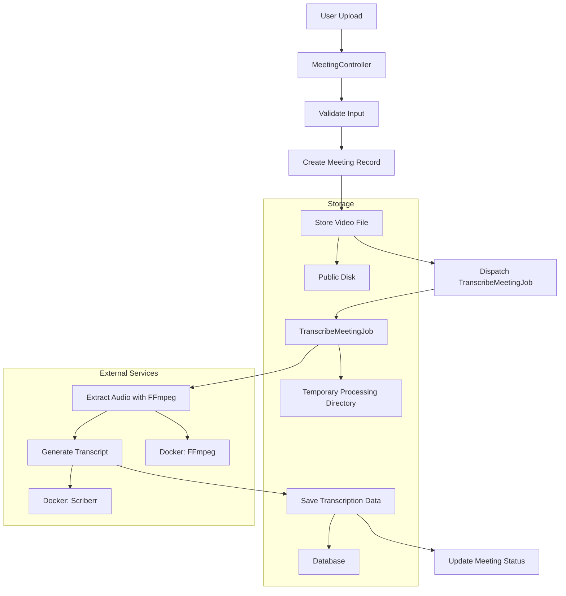
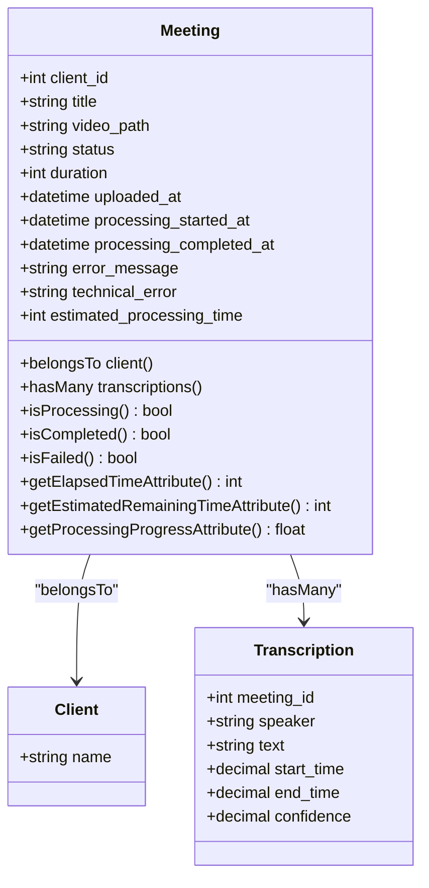
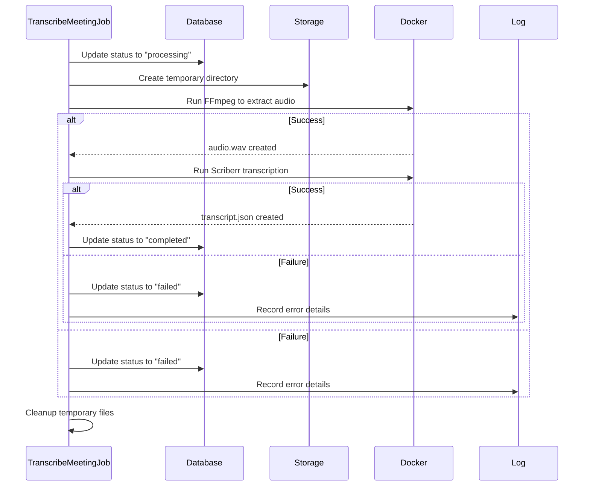
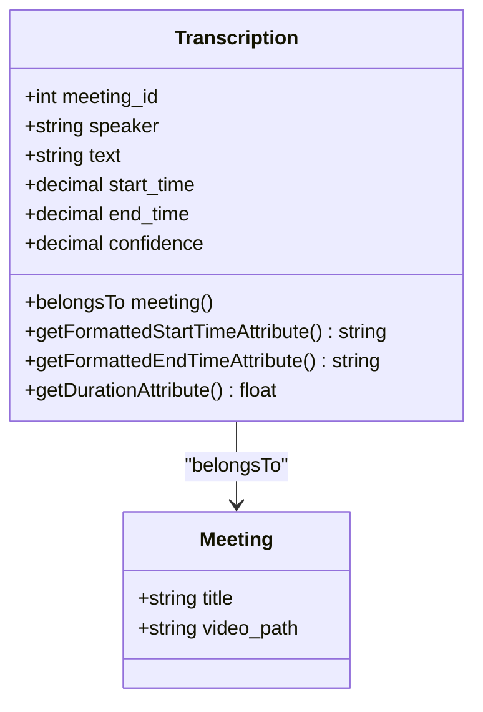

# File Storage Management


## Table of Contents
1. [Introduction](#introduction)
2. [Filesystem Configuration](#filesystem-configuration)
3. [Meeting Video Upload Process](#meeting-video-upload-process)
4. [Directory Structure and File Organization](#directory-structure-and-file-organization)
5. [File Security and Access Control](#file-security-and-access-control)
6. [Retention and Cleanup Policies](#retention-and-cleanup-policies)
7. [Cloud Storage Integration](#cloud-storage-integration)
8. [Large File Handling and Optimization](#large-file-handling-and-optimization)
9. [Backup and Disaster Recovery](#backup-and-disaster-recovery)
10. [Architecture Overview](#architecture-overview)
11. [Detailed Component Analysis](#detailed-component-analysis)

## Introduction
This document provides a comprehensive overview of the file storage architecture for uploaded meeting videos and generated transcriptions in the MeetingAI application. It details the configuration, upload workflow, directory structure, security measures, and processing pipeline that enable secure and efficient handling of large media files. The system leverages Laravel's filesystem abstraction to support both local and cloud-based storage, with robust error handling and scalability considerations.

## Filesystem Configuration

The file storage behavior is governed by the `filesystems.php` configuration file, which defines multiple disks for different use cases. The default disk is determined by the `FILESYSTEM_DISK` environment variable, defaulting to `local` if not specified.

**Key Configuration Settings:**
- **Default Disk**: Controlled by `env('FILESYSTEM_DISK', 'local')`
- **Local Private Disk**: Stores sensitive files under `storage/app/private`
- **Public Disk**: Stores user-uploaded videos under `storage/app/public` with public visibility
- **S3 Disk**: Configured for AWS S3 integration with credentials from environment variables

Symbolic links are created via the `storage:link` Artisan command to make the `storage/app/public` directory accessible through the web interface at `/storage`.


```php
'links' => [
    public_path('storage') => storage_path('app/public'),
],
```


This configuration enables direct URL access to uploaded videos while keeping other application data private.

**Section sources**
- [filesystems.php](file://config/filesystems.php#L1-L81)

## Meeting Video Upload Process

The `MeetingController` handles the complete video upload workflow, from validation to storage and job dispatching. The process ensures data integrity and proper error handling throughout.

### Upload Validation
The `store` method applies strict validation rules:
- **Title**: Required string, max 255 characters
- **Client ID**: Must reference an existing client
- **Video File**: 
  - Required file input
  - Allowed types: MP4, MOV, AVI, WebM
  - Size between 1MB and 500MB


```php
$validated = $request->validate([
    'title' => 'required|string|max:255',
    'client_id' => 'required|exists:clients,id',
    'video' => [
        'required',
        'file',
        File::types(['mp4', 'mov', 'avi', 'webm'])
            ->max(500 * 1024) // 500MB max
            ->min(1024) // 1MB min
    ]
]);
```


### Storage Workflow
1. Create a `Meeting` record with status "pending"
2. Store video using `storeAs()` method on the public disk
3. Organize files in structured directories: `meetings/{client_id}/{meeting_id}/video.{extension}`
4. Update meeting record with video path and metadata
5. Dispatch `TranscribeMeetingJob` for processing

The controller implements comprehensive error handling, cleaning up database records if file storage fails.

**Section sources**
- [MeetingController.php](file://app/Http/Controllers/MeetingController.php#L1-L305)

## Directory Structure and File Organization

The system uses a hierarchical directory structure to organize meeting assets:


```
storage/
├── app/
│   ├── private/          # Private application data
│   └── public/           # Publicly accessible uploaded videos
│       └── meetings/
│           └── {client_id}/
│               └── {meeting_id}/
│                   └── video.{original_extension}
├── {meeting_id}/         # Temporary processing directory
│   ├── audio.wav         # Extracted audio
│   └── transcript.json   # Generated transcription
└── framework/            # Laravel framework cache
```


### Storage Locations
- **Uploaded Videos**: Stored permanently in `storage/app/public/meetings/{client_id}/{meeting_id}/`
- **Processing Artifacts**: Temporary files created in `storage/{meeting_id}/` during transcription
- **Transcription Output**: JSON file generated by the transcription microservice

The directory structure enables efficient organization by client and meeting, facilitating cleanup and access control.

**Section sources**
- [MeetingController.php](file://app/Http/Controllers/MeetingController.php#L1-L305)
- [TranscribeMeetingJob.php](file://app/Jobs/TranscribeMeetingJob.php#L1-L400)

## File Security and Access Control

The system implements multiple layers of security to protect uploaded files:

### Visibility Management
- **Public Disk**: Used for videos that need to be streamed in the web interface
- **Private Disk**: Default storage for sensitive application data
- **Symbolic Links**: Only public storage is linked to the web-accessible directory

### Access Verification
The `MeetingController@show` method verifies file existence before generating URLs:


```php
if ($meeting->video_path) {
    if (Storage::disk('public')->exists($meeting->video_path)) {
        $videoUrl = asset('storage/' . $meeting->video_path);
    } else {
        $videoError = 'Video file not found. It may have been moved or deleted.';
    }
}
```


### Input Validation
- File integrity checks using `$videoFile->isValid()`
- MIME type validation through Laravel's File rule
- Server-side validation (cannot be bypassed by client)

### Error Monitoring
All file access issues are logged with context:
- Missing video files
- Storage failures
- Permission errors

This approach balances accessibility needs with security requirements, allowing video playback while maintaining audit trails for file integrity.

**Section sources**
- [MeetingController.php](file://app/Http/Controllers/MeetingController.php#L1-L305)
- [filesystems.php](file://config/filesystems.php#L1-L81)

## Retention and Cleanup Policies

The system implements automated cleanup procedures to manage storage usage:

### Automatic Cleanup
The `TranscribeMeetingJob` cleans up temporary processing files:


```php
private function cleanupTempFiles(): void
{
    $storageDir = base_path() . DIRECTORY_SEPARATOR . 'storage' . DIRECTORY_SEPARATOR . $meetingId;
    // Delete .wav and .json files
    // Remove directory if empty
}
```


### Manual Cleanup
The `MeetingController@destroy` method implements cascading deletion:
1. Delete video file from public disk
2. Remove containing directory if empty
3. Delete meeting record from database

### Error-Related Cleanup
If upload fails after meeting creation:
- Delete the meeting record
- No file cleanup needed (file not yet stored)

### Processing Artifacts
Temporary files (`audio.wav`, `transcript.json`) are stored in `storage/{meeting_id}/` and cleaned up after processing completes, regardless of success or failure.

This layered approach ensures that temporary files don't accumulate while preserving uploaded videos until explicitly deleted.

**Section sources**
- [TranscribeMeetingJob.php](file://app/Jobs/TranscribeMeetingJob.php#L1-L400)
- [MeetingController.php](file://app/Http/Controllers/MeetingController.php#L1-L305)

## Cloud Storage Integration

The system supports cloud storage through Laravel's filesystem abstraction, with AWS S3 as the primary cloud provider.

### S3 Configuration
The `filesystems.php` file includes a pre-configured S3 disk:


```php
's3' => [
    'driver' => 's3',
    'key' => env('AWS_ACCESS_KEY_ID'),
    'secret' => env('AWS_SECRET_ACCESS_KEY'),
    'region' => env('AWS_DEFAULT_REGION'),
    'bucket' => env('AWS_BUCKET'),
    'url' => env('AWS_URL'),
    'endpoint' => env('AWS_ENDPOINT'),
    'use_path_style_endpoint' => env('AWS_USE_PATH_STYLE_ENDPOINT', false),
],
```


### Environment-Based Configuration
Storage behavior can be changed via environment variables:
- `FILESYSTEM_DISK`: Switch between `local` and `s3`
- AWS credentials and region settings
- Custom endpoint for S3-compatible services

### Migration Strategy
To switch to S3 storage:
1. Set `FILESYSTEM_DISK=s3` in `.env`
2. Configure AWS credentials
3. Update `TranscribeMeetingJob` to access files via S3 URLs or temporary local copies

The current implementation stores uploaded videos on the public disk, which can be either local or S3 depending on configuration, providing flexibility for different deployment environments.

**Section sources**
- [filesystems.php](file://config/filesystems.php#L1-L81)
- [MeetingController.php](file://app/Http/Controllers/MeetingController.php#L1-L305)

## Large File Handling and Optimization

The system includes several optimizations for handling large video files:

### Upload Constraints
- Maximum size: 500MB
- Minimum size: 1MB (prevents empty uploads)
- Supported formats: MP4, MOV, AVI, WebM (common video formats)

### Server Resource Management
- Disk space check before upload:

```php
$requiredSpace = $videoFile->getSize() * 1.5; // Account for processing overhead
$availableSpace = disk_free_space(storage_path('app/public'));
```


### Processing Optimization
The `TranscribeMeetingJob` implements several performance optimizations:

#### Docker-Based Processing
- Uses `jrottenberg/ffmpeg` Docker image for video-to-audio conversion
- Uses custom `scriberr-local` image for transcription
- Isolated environment prevents dependency conflicts

#### Parallel Processing
- Automatically detects CPU core count:

```php
$threads = $this->getCpuThreads();
```

- Supports Windows, macOS, and Linux systems
- Falls back to 2 threads if detection fails

#### Resource Limits
- Job timeout: 3600 seconds (1 hour)
- Retry mechanism with exponential backoff: [60, 300, 900] seconds
- Maximum of 3 attempts per job

### Streaming Considerations
- Videos stored in web-friendly formats (MP4, WebM)
- Direct URL access via public storage link
- No transcoding for playback (original format preserved)

These optimizations ensure reliable processing of large files while protecting server resources.

**Section sources**
- [MeetingController.php](file://app/Http/Controllers/MeetingController.php#L1-L305)
- [TranscribeMeetingJob.php](file://app/Jobs/TranscribeMeetingJob.php#L1-L400)

## Backup and Disaster Recovery

The system relies on a combination of application-level and infrastructure-level strategies for data protection:

### Critical Data Categories
1. **Uploaded Videos**: Primary user content
2. **Transcription Results**: Processed output
3. **Meeting Metadata**: Database records

### Backup Strategies
#### Database
- Not directly configured in provided files
- Expected to be handled at infrastructure level
- Contains meeting metadata and relationships

#### File Storage
- No explicit backup configuration in code
- Relies on external backup solutions for:
  - `storage/app/public/` (uploaded videos)
  - `storage/{meeting_id}/` (transcription outputs)

### Disaster Recovery
#### Job Resilience
- Queue retry mechanism with 3 attempts
- 30-minute retry window
- Exponential backoff strategy

#### Error Handling
- Comprehensive logging of all processing errors
- User-friendly error messages
- Technical error details stored in database

#### Data Integrity
- Transactional-like behavior:
  - Create meeting record first
  - Store file
  - Update record with file path
- Rollback on failure (delete meeting record)

### Recommendations
For production deployment:
1. Implement regular backups of `storage/app/public/`
2. Configure database backups with point-in-time recovery
3. Consider S3 with versioning for cloud storage
4. Implement monitoring for disk space and job failures

**Section sources**
- [TranscribeMeetingJob.php](file://app/Jobs/TranscribeMeetingJob.php#L1-L400)
- [MeetingController.php](file://app/Http/Controllers/MeetingController.php#L1-L305)

## Architecture Overview

The file storage architecture follows a modular design with clear separation of concerns between components.





**Diagram sources**
- [MeetingController.php](file://app/Http/Controllers/MeetingController.php#L1-L305)
- [TranscribeMeetingJob.php](file://app/Jobs/TranscribeMeetingJob.php#L1-L400)

## Detailed Component Analysis

### Meeting Model Analysis

The `Meeting` model serves as the central entity for managing meeting data and relationships.





**Key Features:**
- **Fillable Attributes**: Defines mass-assignable fields
- **Casts**: Converts timestamps and integers appropriately
- **Appended Attributes**: Computed properties for UI display
- **Relationships**: Links to Client and Transcription models
- **Status Methods**: Helper methods for status checking
- **Accessors**: Computed attributes for time formatting and progress

The model uses Laravel's Eloquent ORM features to provide a rich interface for meeting data management.

**Diagram sources**
- [Meeting.php](file://app/Models/Meeting.php#L1-L179)

**Section sources**
- [Meeting.php](file://app/Models/Meeting.php#L1-L179)

### TranscribeMeetingJob Analysis

The transcription job implements a robust processing pipeline with comprehensive error handling.





**Key Processing Steps:**
1. **Initialization**: Accepts Meeting model via constructor
2. **Status Update**: Changes meeting status to "processing"
3. **Environment Setup**: Creates temporary directory
4. **Audio Extraction**: Uses Dockerized FFmpeg to convert video to WAV
5. **Transcription**: Uses Dockerized transcription service
6. **Completion**: Updates status and cleans up

**Error Handling:**
- Comprehensive try-catch blocks
- Detailed logging
- User-friendly error messages
- Automatic cleanup on failure
- Retry mechanism with backoff

The job is configured with sensible defaults:
- 1-hour timeout
- 3 retry attempts
- 30-minute retry window

**Diagram sources**
- [TranscribeMeetingJob.php](file://app/Jobs/TranscribeMeetingJob.php#L1-L400)

**Section sources**
- [TranscribeMeetingJob.php](file://app/Jobs/TranscribeMeetingJob.php#L1-L400)

### Transcription Model Analysis

The `Transcription` model manages the segmented output of the transcription process.





**Key Features:**
- **Fillable Attributes**: Defines mass-assignable fields
- **Casts**: Ensures precision for time and confidence values
- **Relationship**: Belongs to a single Meeting
- **Accessors**: 
  - Formatted time display
  - Segment duration calculation

The model supports speaker diarization (identifying different speakers) and confidence scoring, enabling rich transcription data.

**Diagram sources**
- [Transcription.php](file://app/Models/Transcription.php#L1-L51)

**Section sources**
- [Transcription.php](file://app/Models/Transcription.php#L1-L51)

**Referenced Files in This Document**   
- [filesystems.php](file://config/filesystems.php)
- [MeetingController.php](file://app/Http/Controllers/MeetingController.php)
- [Meeting.php](file://app/Models/Meeting.php)
- [TranscribeMeetingJob.php](file://app/Jobs/TranscribeMeetingJob.php)
- [Transcription.php](file://app/Models/Transcription.php)