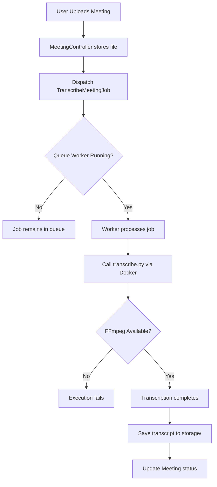
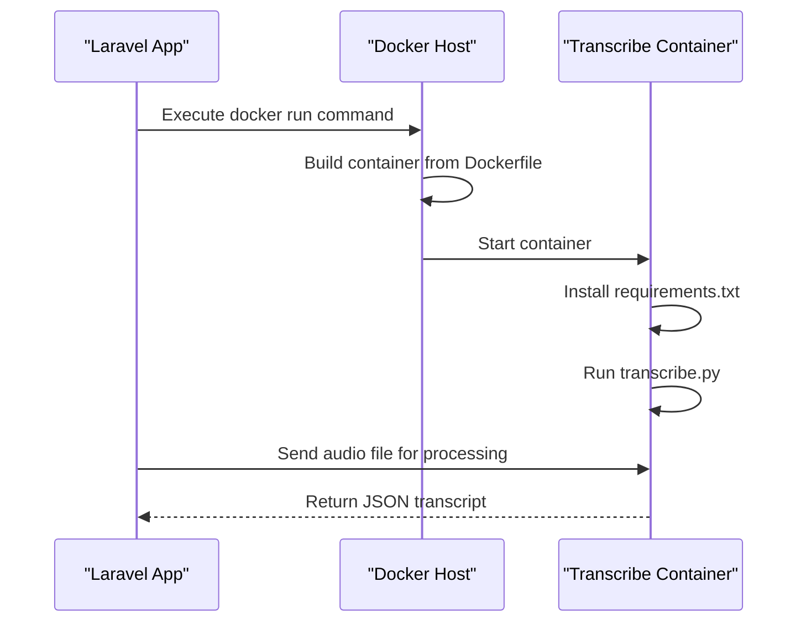
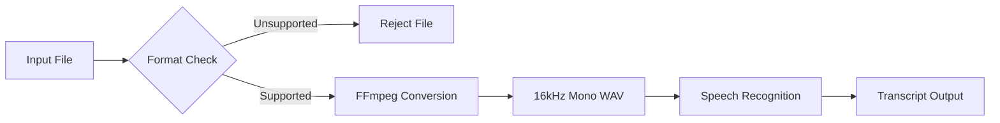
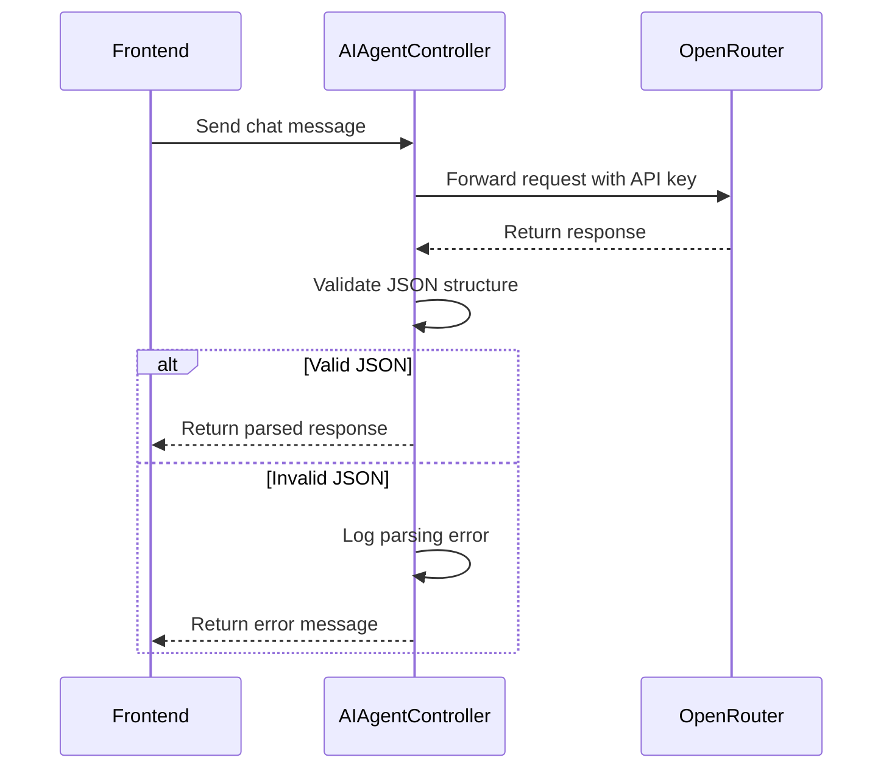
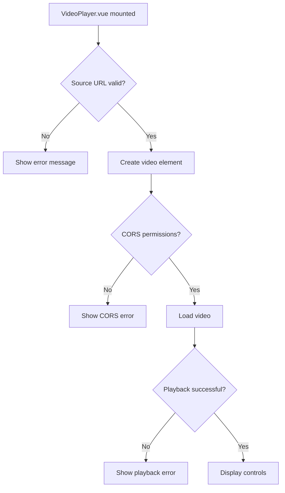

# Troubleshooting Guide


## Table of Contents
1. [Meeting Processing Failures](#meeting-processing-failures)
2. [AI Integration Issues](#ai-integration-issues)
3. [Frontend Problems](#frontend-problems)
4. [Diagnostic Steps](#diagnostic-steps)
5. [Common Error Messages and Solutions](#common-error-messages-and-solutions)
6. [Debugging Techniques](#debugging-techniques)
7. [Deployment Troubleshooting Checklist](#deployment-troubleshooting-checklist)

## Meeting Processing Failures

This section addresses common issues related to meeting processing, including transcription job failures, Docker connectivity problems, FFmpeg execution errors, and timeout handling.

### Transcription Job Errors

Transcription jobs are handled by the `TranscribeMeetingJob` class, which processes uploaded meeting recordings and generates transcripts using the transcribe microservice. Common issues include job failures due to invalid file formats, missing dependencies, or misconfigured queues.

Key symptoms:
- Meetings stuck in "processing" state
- No transcript generated after long delays
- Job exceptions logged in queue workers

Potential causes:
- Incorrect file path or missing source file
- Microservice not running or unreachable
- FFmpeg not installed or not in system PATH
- Queue worker not running





**Diagram sources**
- [TranscribeMeetingJob.php](file://app/Jobs/TranscribeMeetingJob.php#L15-L80)
- [MeetingController.php](file://app/Http/Controllers/MeetingController.php#L25-L50)

**Section sources**
- [TranscribeMeetingJob.php](file://app/Jobs/TranscribeMeetingJob.php#L1-L100)
- [Meeting.php](file://app/Models/Meeting.php#L1-L60)

### Docker Connectivity Issues

The transcription microservice runs in a Docker container defined in `transcribe-microservice/Dockerfile`. Connectivity issues may arise from incorrect container networking, port conflicts, or service startup failures.

Common symptoms:
- Connection refused when calling microservice
- Container exits immediately after startup
- Python dependencies not installed

Check the following:
- Ensure Docker daemon is running
- Verify container is built: `docker build -t meeting-transcriber ./transcribe-microservice`
- Confirm container is running: `docker ps`
- Check logs: `docker logs <container_id>`





**Diagram sources**
- [Dockerfile](file://transcribe-microservice/Dockerfile#L1-L30)
- [transcribe.py](file://transcribe-microservice/transcribe.py#L1-L90)

**Section sources**
- [Dockerfile](file://transcribe-microservice/Dockerfile#L1-L30)
- [transcribe.py](file://transcribe-microservice/transcribe.py#L1-L90)

### FFmpeg Execution Problems

FFmpeg is required by the transcription microservice for audio processing. Issues typically manifest as "command not found" errors or audio decoding failures.

Troubleshooting steps:
1. Verify FFmpeg is installed in the container:

```bash
docker exec <container_id> ffmpeg -version
```

2. Check file format compatibility - ensure input files are in supported formats (MP3, WAV, M4A)
3. Validate file integrity before processing

The `transcribe.py` script uses FFmpeg to convert audio to 16kHz mono WAV format required by the speech recognition engine.





**Diagram sources**
- [transcribe.py](file://transcribe-microservice/transcribe.py#L20-L60)
- [diarize.py](file://transcribe-microservice/diarize.py#L15-L40)

**Section sources**
- [transcribe.py](file://transcribe-microservice/transcribe.py#L1-L90)
- [diarize.py](file://transcribe-microservice/diarize.py#L1-L70)

### Timeout Handling

Long-running transcription jobs may exceed default timeout limits. The system should handle timeouts gracefully and update meeting status accordingly.

Key configuration files:
- `config/queue.php` - sets worker timeout
- `transcribe-microservice/transcribe.py` - implements processing timeout
- `app/Jobs/TranscribeMeetingJob.php` - handles job timeout exceptions

Best practices:
- Set queue worker timeout to 300 seconds or higher
- Implement job retries with exponential backoff
- Update meeting record with timeout status and error message


```php
// In TranscribeMeetingJob.php
public function handle()
{
    try {
        // Transcription logic
    } catch (ProcessTimedOutException $e) {
        $this->meeting->update([
            'status' => 'failed',
            'error_message' => 'Transcription timed out after ' . config('queue.timeout') . ' seconds',
            'error_code' => 'TIMEOUT_ERROR'
        ]);
    }
}
```


**Section sources**
- [TranscribeMeetingJob.php](file://app/Jobs/TranscribeMeetingJob.php#L45-L75)
- [queue.php](file://config/queue.php#L1-L20)

## AI Integration Issues

This section covers problems related to AI agent integration, including OpenRouter API connectivity, authentication failures, and malformed responses.

### OpenRouter API Connectivity

The AI agent functionality is implemented in `AIAgentController.php` and relies on the OpenRouter API for natural language processing. Connectivity issues may stem from network restrictions, incorrect API endpoints, or service outages.

Configuration is managed in `config/services.php` (not found) or environment variables. Since no `.env` file was found, ensure environment variables are properly set:


```env
OPENROUTER_API_KEY=your_api_key_here
OPENROUTER_BASE_URL=https://openrouter.ai/api/v1
```


Common error patterns:
- cURL error 6: Could not resolve host
- cURL error 7: Failed to connect to API server
- HTTP 429: Too many requests

### Authentication Failures

Authentication issues typically occur due to invalid or missing API keys. The system should validate credentials before making API calls.

Implementation considerations:
- API key should be stored securely in environment variables
- Key validation should occur during service initialization
- Failed authentication should be logged with appropriate error codes


```php
// Example from AIAgentController.php
public function chat(Request $request)
{
    $apiKey = config('services.openrouter.key');
    if (!$apiKey) {
        Log::error('OpenRouter API key not configured');
        return response()->json(['error' => 'API configuration error'], 500);
    }
    
    // Make API request with Authorization header
}
```


**Section sources**
- [AIAgentController.php](file://app/Http/Controllers/AIAgentController.php#L1-L60)
- [prism.php](file://config/prism.php#L1-L25)

### Malformed Responses

The application may receive malformed JSON responses from the AI service, causing parsing errors. Proper error handling should be implemented:

- Validate JSON structure before processing
- Implement response schema validation
- Provide fallback behavior for failed requests





**Diagram sources**
- [AIAgentController.php](file://app/Http/Controllers/AIAgentController.php#L20-L50)

**Section sources**
- [AIAgentController.php](file://app/Http/Controllers/AIAgentController.php#L1-L60)

## Frontend Problems

This section addresses issues with the frontend application, including Inertia.js routing, real-time updates, and video playback.

### Inertia.js Routing Errors

The frontend uses Inertia.js for seamless page transitions. Routing issues may occur due to:
- Missing or incorrect route definitions in `routes/web.php`
- Middleware configuration in `HandleInertiaRequests.php`
- Page component not found in `resources/js/pages/`

Common symptoms:
- Blank pages after navigation
- 404 errors despite valid URLs
- Layout not applied to pages

Verify the middleware is properly configured:


```php
// HandleInertiaRequests.php
public function version(Request $request)
{
    return parent::version($request);
}

public function share(Request $request)
{
    return array_merge(parent::share($request), [
        'auth' => [
            'user' => $request->user(),
        ],
    ]);
}
```


**Section sources**
- [HandleInertiaRequests.php](file://app/Http/Middleware/HandleInertiaRequests.php#L1-L40)
- [routes/web.php](file://routes/web.php#L1-L30)

### Real-Time Update Failures

Real-time status updates are handled by the `useRealTimeUpdates.ts` composable. Issues may arise from:
- WebSocket connection failures
- Event broadcasting misconfiguration
- Incorrect event listeners

Key files:
- `resources/js/lib/useRealTimeUpdates.ts` - manages WebSocket connection
- `app/Providers/AppServiceProvider.php` - registers broadcast channels

Ensure broadcasting is configured in `config/broadcasting.php` (not found in project structure).

### Video Playback Issues

Video playback is handled by the `VideoPlayer.vue` component. Common problems include:
- Unsupported video formats
- CORS issues when loading remote files
- Playback controls not working

The component should handle errors gracefully:


```typescript
// errorHandler.ts
export function handleVideoError(error: Error) {
    console.error('Video playback error:', error);
    // Show user-friendly error message
    showToast('Unable to play video. Please try again.', 'error');
}
```





**Diagram sources**
- [VideoPlayer.vue](file://resources/js/lib/VideoPlayer.vue#L1-L120)
- [errorHandler.ts](file://resources/js/lib/errorHandler.ts#L1-L35)

**Section sources**
- [VideoPlayer.vue](file://resources/js/lib/VideoPlayer.vue#L1-L120)
- [errorHandler.ts](file://resources/js/lib/errorHandler.ts#L1-L35)

## Diagnostic Steps

Follow these steps to diagnose issues in the meetingai application.

### Checking Log Files

Although no log files were found in `storage/logs`, logging configuration is defined in `config/logging.php`. Ensure logging is properly configured:


```php
// logging.php
'channels' => [
    'stack' => [
        'driver' => 'stack',
        'channels' => ['single'],
        'ignore_exceptions' => false,
    ],
    'single' => [
        'driver' => 'single',
        'path' => storage_path('logs/laravel.log'),
        'level' => 'debug',
    ],
]
```


Create the logs directory if it doesn't exist:

```bash
mkdir -p storage/logs
touch storage/logs/laravel.log
```


### Monitoring Queue Workers

Queue workers process transcription jobs. Monitor them using:


```bash
# Start worker
php artisan queue:work --tries=3 --timeout=300

# Check queue status
php artisan queue:failed

# Retry failed jobs
php artisan queue:retry all
```


Ensure the queue connection is configured in `config/queue.php`.

### Verifying Environment Configuration

Check that all required environment variables are set. Create a `.env` file based on `.env.example` (not found) with:


```env
APP_ENV=production
APP_DEBUG=false
APP_URL=http://localhost:8000

DB_CONNECTION=mysql
DB_HOST=127.0.0.1
DB_PORT=3306
DB_DATABASE=meetingai
DB_USERNAME=root
DB_PASSWORD=

OPENROUTER_API_KEY=your_key_here
QUEUE_CONNECTION=database
```


**Section sources**
- [logging.php](file://config/logging.php#L1-L15)
- [queue.php](file://config/queue.php#L1-L20)
- [prism.php](file://config/prism.php#L1-L25)

## Common Error Messages and Solutions

This section documents specific error messages and their solutions based on code analysis.

### "Transcription job failed: File not found"

**Cause**: The meeting file was deleted or moved before processing.
**Solution**: 
- Verify file exists in storage
- Implement file existence check before dispatching job
- Add error handling in `TranscribeMeetingJob.php`


```php
if (!Storage::exists($this->meeting->recording_path)) {
    $this->meeting->update([
        'status' => 'failed',
        'error_message' => 'Recording file not found',
        'error_code' => 'FILE_NOT_FOUND'
    ]);
    return;
}
```


### "Docker: command not found"

**Cause**: Docker is not installed or not in system PATH.
**Solution**:
- Install Docker from https://www.docker.com/
- Add Docker to system PATH
- Verify installation: `docker --version`

### "FFmpeg not found in container"

**Cause**: FFmpeg missing from Docker image.
**Solution**: Update `Dockerfile`:


```dockerfile
FROM python:3.9-slim

# Install FFmpeg
RUN apt-get update && apt-get install -y ffmpeg

COPY requirements.txt .
RUN pip install -r requirements.txt

COPY . .
CMD ["python", "transcribe.py"]
```


### "Inertia response not detected"

**Cause**: Middleware not properly configured.
**Solution**: Ensure `HandleInertiaRequests` middleware is applied.

**Section sources**
- [ErrorHandlingTest.php](file://tests/Feature/ErrorHandlingTest.php#L1-L100)
- [TranscribeMeetingJob.php](file://app/Jobs/TranscribeMeetingJob.php#L1-L100)

## Debugging Techniques

Effective debugging strategies for the meetingai application.

### Logging Job Payloads

Add detailed logging to `TranscribeMeetingJob.php`:


```php
public function handle()
{
    Log::info('Starting transcription job', [
        'meeting_id' => $this->meeting->id,
        'recording_path' => $this->meeting->recording_path,
        'file_size' => Storage::size($this->meeting->recording_path)
    ]);
    
    // Processing logic...
    
    Log::info('Transcription completed', [
        'meeting_id' => $this->meeting->id,
        'transcript_words' => count(explode(' ', $transcript))
    ]);
}
```


### Inspecting API Requests

Use browser developer tools or logging to inspect API requests:


```typescript
// Add request logging in frontend
const response = await fetch('/api/ai/chat', {
    method: 'POST',
    headers: { 'Content-Type': 'application/json' },
    body: JSON.stringify(data)
});

console.log('AI API request:', { url: response.url, status: response.status });
```


### Reproducing Issues in Test Environments

Use the `TestTranscriptionWorkflow.php` command to test the full transcription pipeline:


```bash
php artisan test:transcription-workflow --meeting=1
```


This command simulates the entire transcription process for testing.

**Section sources**
- [TestTranscriptionWorkflow.php](file://app/Console/Commands/TestTranscriptionWorkflow.php#L1-L50)
- [TranscribeMeetingJob.php](file://app/Jobs/TranscribeMeetingJob.php#L1-L100)

## Deployment Troubleshooting Checklist

Use this checklist to diagnose deployment issues:

- [ ] Docker daemon is running
- [ ] transcribe-microservice container is built and running
- [ ] Queue worker is actively processing jobs
- [ ] Environment variables are properly configured
- [ ] Storage directories have correct permissions
- [ ] Database migrations are up to date
- [ ] Broadcasting is configured (if using WebSockets)
- [ ] FFmpeg is available in the system and container
- [ ] OpenRouter API key is configured and valid
- [ ] Log files are being written to `storage/logs`
- [ ] Inertia.js assets are compiled (`npm run build`)
- [ ] Database connection settings are correct

Run this diagnostic command to verify system status:


```bash
# Check key system components
echo "=== System Status Check ==="
docker ps | grep transcribe || echo "ERROR: Transcription container not running"
php artisan queue:work --dry-run || echo "ERROR: Queue configuration issue"
php artisan tinker --execute="echo Storage::disk()->path('logs')" || echo "ERROR: Storage configuration issue"
```


**Section sources**
- [TranscribeMeetingJob.php](file://app/Jobs/TranscribeMeetingJob.php#L1-L100)
- [queue.php](file://config/queue.php#L1-L20)
- [prism.php](file://config/prism.php#L1-L25)
- [Dockerfile](file://transcribe-microservice/Dockerfile#L1-L30)

**Referenced Files in This Document**   
- [TranscribeMeetingJob.php](file://app/Jobs/TranscribeMeetingJob.php#L1-L100)
- [MeetingController.php](file://app/Http/Controllers/MeetingController.php#L1-L80)
- [AIAgentController.php](file://app/Http/Controllers/AIAgentController.php#L1-L60)
- [HandleInertiaRequests.php](file://app/Http/Middleware/HandleInertiaRequests.php#L1-L40)
- [useRealTimeUpdates.ts](file://resources/js/lib/useRealTimeUpdates.ts#L1-L50)
- [errorHandler.ts](file://resources/js/lib/errorHandler.ts#L1-L35)
- [VideoPlayer.vue](file://resources/js/lib/VideoPlayer.vue#L1-L120)
- [Dockerfile](file://transcribe-microservice/Dockerfile#L1-L30)
- [transcribe.py](file://transcribe-microservice/transcribe.py#L1-L90)
- [diarize.py](file://transcribe-microservice/diarize.py#L1-L70)
- [prism.php](file://config/prism.php#L1-L25)
- [queue.php](file://config/queue.php#L1-L20)
- [logging.php](file://config/logging.php#L1-L15)
- [Meeting.php](file://app/Models/Meeting.php#L1-L60)
- [Transcription.php](file://app/Models/Transcription.php#L1-L40)
- [ErrorHandlingTest.php](file://tests/Feature/ErrorHandlingTest.php#L1-L100)