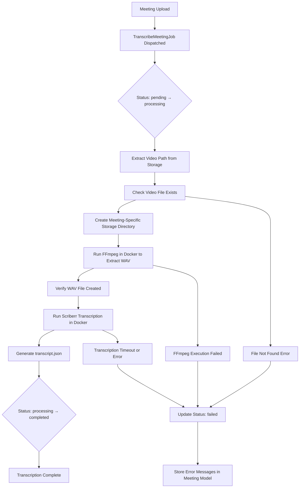
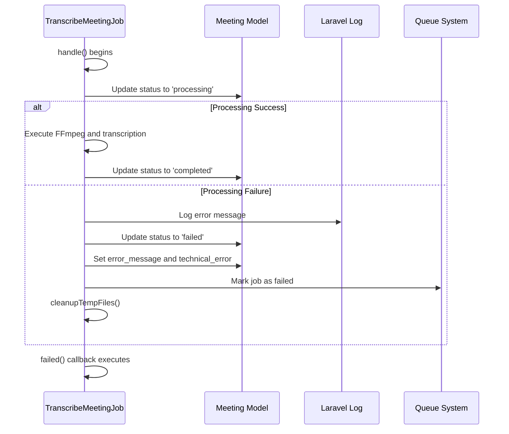
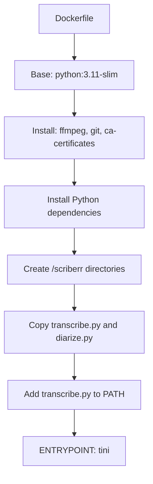
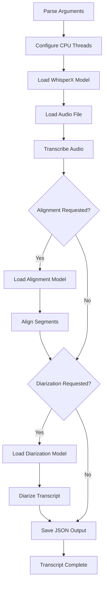

# Meeting Processing Issues


## Table of Contents
1. [Introduction](#introduction)
2. [Core Processing Flow](#core-processing-flow)
3. [Error Handling in TranscribeMeetingJob](#error-handling-in-transcribemeetingjob)
4. [Common Failure Scenarios](#common-failure-scenarios)
5. [Docker and Container Execution](#docker-and-container-execution)
6. [Transcription Microservice Logic](#transcription-microservice-logic)
7. [Queue Configuration and Retry Mechanisms](#queue-configuration-and-retry-mechanisms)
8. [Diagnostic and Debugging Techniques](#diagnostic-and-debugging-techniques)
9. [Solutions and Best Practices](#solutions-and-best-practices)

## Introduction
This document provides a comprehensive guide to troubleshooting meeting processing failures in the MeetingAI system. The system processes uploaded video meetings by extracting audio, transcribing speech, and optionally performing speaker diarization. Failures can occur at various stages including Docker execution, FFmpeg processing, audio extraction, and transcription job timeouts. This guide details the architecture, failure handling mechanisms, diagnostic procedures, and solutions for common issues.

## Core Processing Flow





**Diagram sources**
- [TranscribeMeetingJob.php](file://app/Jobs/TranscribeMeetingJob.php#L31-L199)

**Section sources**
- [TranscribeMeetingJob.php](file://app/Jobs/TranscribeMeetingJob.php#L31-L199)

## Error Handling in TranscribeMeetingJob

The `TranscribeMeetingJob` class implements robust error handling through Laravel's queue system and custom error management. When an exception occurs during processing, the job catches it, logs the error, updates the meeting status to "failed", and stores both user-friendly and technical error messages.





**Diagram sources**
- [TranscribeMeetingJob.php](file://app/Jobs/TranscribeMeetingJob.php#L318-L328)

**Section sources**
- [TranscribeMeetingJob.php](file://app/Jobs/TranscribeMeetingJob.php#L318-L398)

### Error Field Management
The Meeting model includes two dedicated error fields that are updated when processing fails:

- **error_message**: User-friendly message explaining the issue in non-technical terms
- **technical_error**: Raw exception message for debugging purposes

These fields were added via migration:


```php
// database/migrations/2025_08_10_160251_add_error_fields_to_meetings_table.php
Schema::table('meetings', function (Blueprint $table) {
    $table->text('error_message')->nullable()->after('processing_completed_at');
    $table->text('technical_error')->nullable()->after('error_message');
});
```


The `failed()` method in `TranscribeMeetingJob` maps technical exceptions to user-friendly messages using the `getUserFriendlyErrorMessage()` helper method.

**Section sources**
- [2025_08_10_160251_add_error_fields_to_meetings_table.php](file://database/migrations/2025_08_10_160251_add_error_fields_to_meetings_table.php#L14-L15)
- [Meeting.php](file://app/Models/Meeting.php#L22-L23)
- [TranscribeMeetingJob.php](file://app/Jobs/TranscribeMeetingJob.php#L318-L352)

## Common Failure Scenarios

### Transcription Job Timeouts
The `TranscribeMeetingJob` has a 1-hour timeout (`public $timeout = 3600`). Large audio files or resource-constrained environments may cause the job to exceed this limit.

**Symptoms**:
- Job fails with "Command failed (exit 1): timeout" message
- `error_message`: "Transcription took too long to complete. This may happen with very large files."
- Processing directory may contain partial WAV file

**Root Causes**:
- Very long meeting recordings (>2 hours)
- Insufficient CPU resources for transcription model
- High system load causing slow processing

### Docker Container Startup Failures
The system relies on Docker containers for both FFmpeg audio extraction and WhisperX transcription.

**Common Error Patterns**:
- "Docker: command not found" - Docker not installed or not in PATH
- "Cannot connect to the Docker daemon" - Docker service not running
- "Image not found" - Required images not pulled (`jrottenberg/ffmpeg:latest`, `scriberr-local:latest`)

**Configuration**:
Docker images are configurable via environment variables:

```php
$ffmpegImage = config('services.ffmpeg.image', 'jrottenberg/ffmpeg:latest');
$scriberrImage = config('services.scriberr.image', 'scriberr-local:latest');
```


### FFmpeg Execution Errors
FFmpeg runs in a Docker container to extract WAV audio from the input video.

**Command Structure**:

```bash
docker run --rm -v "/host/in:/in/" -v "/host/out:/out" jrottenberg/ffmpeg:latest -hide_banner -y -i "/in/input.mp4" -vn -acodec pcm_s16le -ar 16000 -ac 1 "/out/audio.wav"
```


**Common Issues**:
- **Unsupported video formats**: FFmpeg may fail to decode certain codecs
- **Corrupted video files**: Damaged files cause FFmpeg to exit with error
- **Permission issues**: Docker cannot access mounted volumes
- **Missing input file**: Video file was deleted or moved after upload

**Error Handling**:
The job verifies the WAV output file exists after FFmpeg execution:

```php
if (!File::exists($wavPath)) {
    throw new \RuntimeException("WAV conversion did not produce expected file at: {$wavPath}");
}
```


### Audio Extraction Problems
Even with valid video files, audio extraction can fail due to:

- **Videos without audio tracks**: Screen recordings or presentations with no spoken content
- **Unusual sample rates or channel configurations**: FFmpeg command assumes mono, 16kHz output
- **File permission issues**: The storage directory must be writable by the PHP process and Docker container

The system creates a meeting-specific directory under `storage/{meeting_id}` with permissions 0755 to ensure accessibility.

**Section sources**
- [TranscribeMeetingJob.php](file://app/Jobs/TranscribeMeetingJob.php#L63-L142)

## Docker and Container Execution

### Container Configuration
The transcription microservice uses a custom Docker image defined in the Dockerfile:





**Diagram sources**
- [Dockerfile](file://transcribe-microservice/Dockerfile#L1-L53)

**Section sources**
- [Dockerfile](file://transcribe-microservice/Dockerfile#L1-L53)

### Volume Mounting Strategy
The system uses Docker volume mounting to share files between host and container:

- **Input**: Video directory mounted as `/in/`
- **Output**: Meeting storage directory mounted as `/out/`
- **Audio**: WAV file mounted as `/input.wav`
- **Transcript**: JSON file mounted as `/transcript.json`

The `dockerPath()` method ensures proper path formatting across operating systems:

```php
private function dockerPath(string $path): string
{
    $real = realpath($path) ?: $path;
    $real = $this->processPathForLocalTesting($real);
    return str_replace('\\', '/', $real);
}
```


## Transcription Microservice Logic

### transcribe.py Processing Pipeline
The transcription script follows a multi-stage process:





**Diagram sources**
- [transcribe.py](file://transcribe-microservice/transcribe.py#L1-L201)

**Section sources**
- [transcribe.py](file://transcribe-microservice/transcribe.py#L1-L201)

### Error Handling in Python Scripts
The microservice includes defensive programming to handle various failure modes:

- **Model loading failures**: Graceful fallback when `asr_options` is not supported
- **Float16 compute issues**: Automatic downgrade to float32
- **Diarization failures**: Continues with transcript without speaker labels
- **CUDA memory issues**: Explicit memory cleanup before and after diarization

The `diarize.py` script includes comprehensive error handling:

```python
except Exception as e:
    print(f"Diarization failed: {str(e)}")
    # Fallback: Assign "unknown" to original segments
    for segment in transcript["segments"]:
        segment["speaker"] = "unknown"
    return transcript
```


## Queue Configuration and Retry Mechanisms

### Queue Settings
The system uses Laravel's queue configuration with database driver as default:


```php
// config/queue.php
'default' => env('QUEUE_CONNECTION', 'database'),
'connections' => [
    'database' => [
        'driver' => 'database',
        'table' => 'jobs',
        'retry_after' => 90,
    ],
],
'failed' => [
    'driver' => env('QUEUE_FAILED_DRIVER', 'database-uuids'),
    'table' => 'failed_jobs',
],
```


**Section sources**
- [queue.php](file://config/queue.php#L1-L113)

### Job Retry Configuration
The `TranscribeMeetingJob` implements multiple retry mechanisms:

- **Maximum attempts**: 3 tries (`public $tries = 3`)
- **Retry window**: 30 minutes from first attempt (`retryUntil()`)
- **Backoff strategy**: Exponential backoff with [60, 300, 900] seconds


```php
public function backoff(): array
{
    return [60, 300, 900]; // 1 minute, 5 minutes, 15 minutes
}

public function retryUntil(): \DateTime
{
    return now()->addMinutes(30);
}
```


Failed jobs are logged to the `failed_jobs` table for later analysis.

**Section sources**
- [TranscribeMeetingJob.php](file://app/Jobs/TranscribeMeetingJob.php#L378-L398)
- [queue.php](file://config/queue.php#L105-L110)

## Diagnostic and Debugging Techniques

### Checking Job Payloads
When troubleshooting, first verify the job payload contains the correct meeting data:


```php
// Check job serialization
$job = new TranscribeMeetingJob($meeting);
dd($job->meeting->toArray());
```


### Verifying Docker Service Availability
Ensure Docker is running and accessible:


```bash
# Test Docker connectivity
docker ps

# Test required images
docker images | grep -E "(ffmpeg|scriberr)"

# Test basic container execution
docker run --rm hello-world
```


### Inspecting Container Logs
The system logs all container output through Laravel's logging system:


```php
$process->run(function ($type, $buffer) {
    if ($type === Process::OUT) {
        Log::info(trim($buffer));
    } else {
        Log::warning(trim($buffer));
    }
});
```


Check `storage/logs/laravel.log` for container output and errors.

### Validating File Permissions
Ensure proper directory permissions for processing:


```bash
# Verify storage directory is writable
ls -la storage/
ls -la storage/{meeting_id}/

# Check file ownership
ps aux | grep php  # Identify PHP process user
ls -la storage/    # Verify user can write
```


### Simulating Job Execution
For development debugging, simulate job execution:


```php
// In a test or tinker session
$meeting = Meeting::find(1);
$job = new TranscribeMeetingJob($meeting);
$job->handle(); // Execute synchronously
```


### Logging Intermediate Steps
The `transcribe.py` script includes extensive logging:

- Model loading progress
- CPU thread configuration
- Memory usage before/after diarization
- Segment count statistics
- File save confirmation

Enable verbose logging by modifying the script to include additional print statements for debugging specific issues.

**Section sources**
- [TranscribeMeetingJob.php](file://app/Jobs/TranscribeMeetingJob.php#L278-L305)
- [transcribe.py](file://transcribe-microservice/transcribe.py#L1-L201)
- [diarize.py](file://transcribe-microservice/diarize.py#L1-L131)

## Solutions and Best Practices

### Handling Missing Video Files
**Solution**: Implement pre-processing validation and file existence checks.


```php
// Before dispatching job
if (!Storage::disk('public')->exists($meeting->video_path)) {
    $meeting->update([
        'status' => 'failed',
        'error_message' => 'The video file could not be found. It may have been moved or deleted.',
        'technical_error' => 'Video file missing: ' . $meeting->video_path
    ]);
    return;
}
```


### Supporting Additional Formats
**Solution**: Extend FFmpeg command to handle more formats or validate input before processing.


```php
// Add format detection before processing
$ffprobeCmd = "ffprobe -v quiet -print_format json -show_format -show_streams {$videoPath}";
$result = shell_exec($ffprobeCmd);
$mediaInfo = json_decode($result, true);
```


### Preventing Resource Exhaustion
**Solution**: Implement resource monitoring and limits.


```php
// In TranscribeMeetingJob
private function checkSystemResources(): void
{
    $freeMemory = memory_get_usage();
    $diskSpace = disk_free_space(storage_path());
    
    if ($diskSpace < 100 * 1024 * 1024) { // Less than 100MB
        throw new \RuntimeException("Insufficient disk space for processing");
    }
}
```


### Improving Error Messages
Enhance user-friendly error messages based on specific technical errors:


```php
private function getUserFriendlyErrorMessage(\Throwable $exception): string
{
    $message = $exception->getMessage();

    if (str_contains($message, 'Video file not found')) {
        return 'The video file could not be found. It may have been moved or deleted.';
    }

    if (str_contains($message, 'WAV conversion')) {
        return 'Failed to process the video file. The file may be corrupted or in an unsupported format.';
    }

    // ... other specific mappings
}
```


### Monitoring and Alerts
Implement monitoring for:
- Queue length and processing times
- Docker container health
- Disk space usage
- Failed job rates

Set up alerts for repeated failures or resource constraints.

**Section sources**
- [TranscribeMeetingJob.php](file://app/Jobs/TranscribeMeetingJob.php#L329-L352)
- [transcribe.py](file://transcribe-microservice/transcribe.py#L1-L201)
- [queue.php](file://config/queue.php#L1-L113)

**Referenced Files in This Document**   
- [TranscribeMeetingJob.php](file://app/Jobs/TranscribeMeetingJob.php)
- [queue.php](file://config/queue.php)
- [transcribe.py](file://transcribe-microservice/transcribe.py)
- [diarize.py](file://transcribe-microservice/diarize.py)
- [Dockerfile](file://transcribe-microservice/Dockerfile)
- [Meeting.php](file://app/Models/Meeting.php)
- [2025_08_10_160251_add_error_fields_to_meetings_table.php](file://database/migrations/2025_08_10_160251_add_error_fields_to_meetings_table.php)