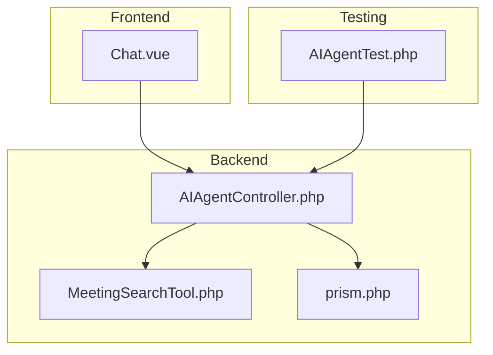
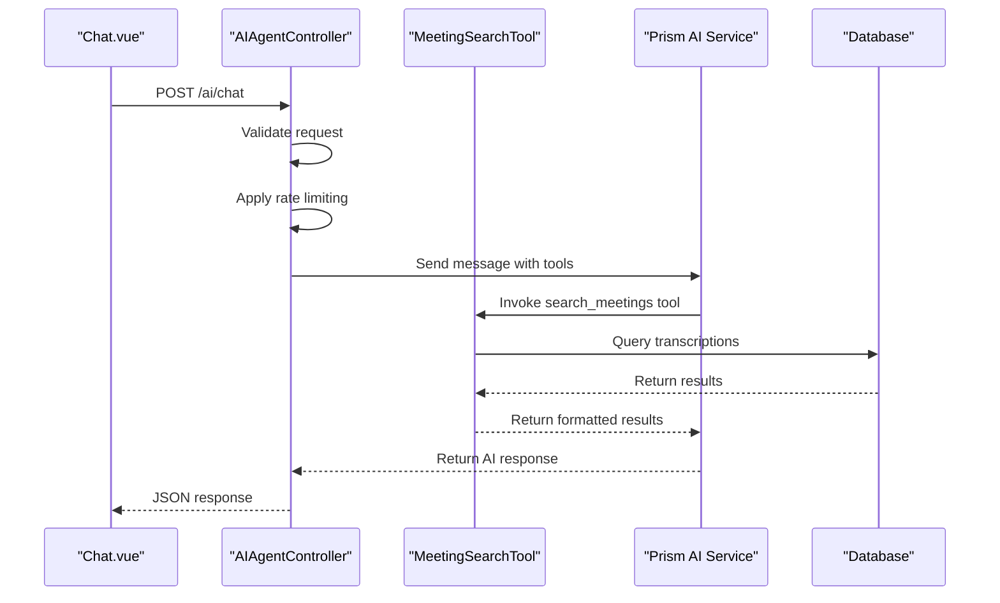
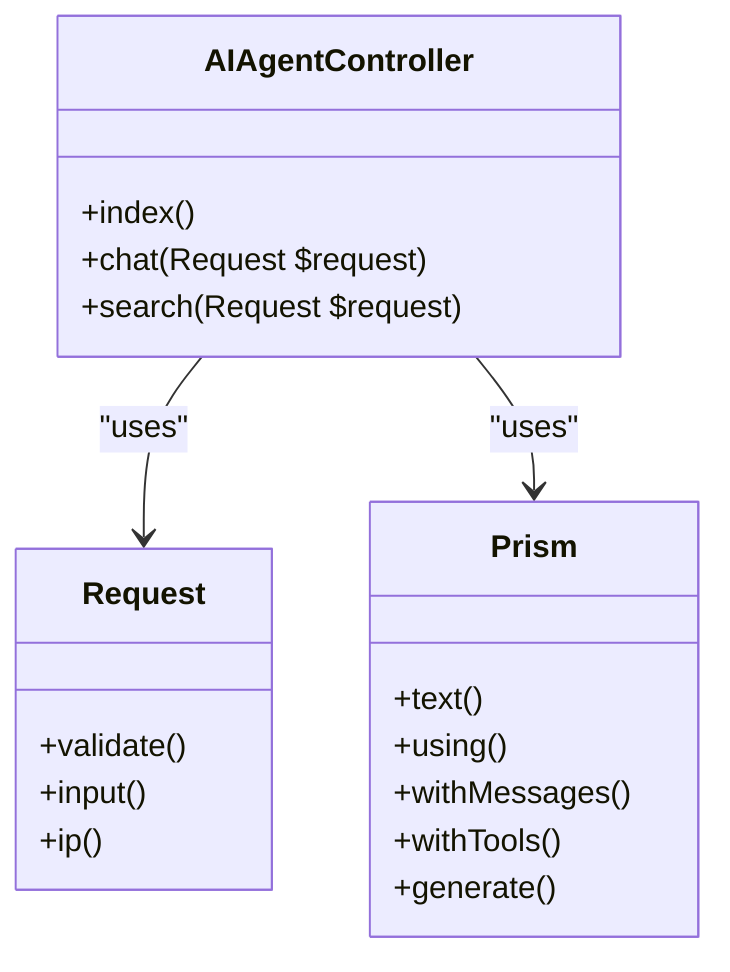
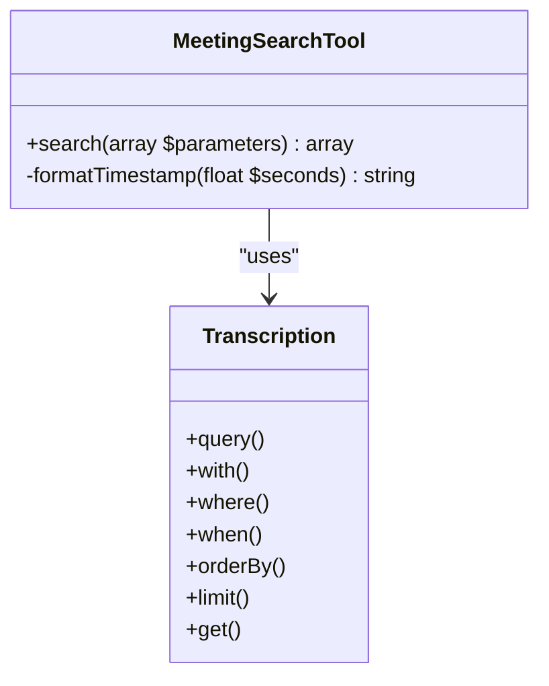
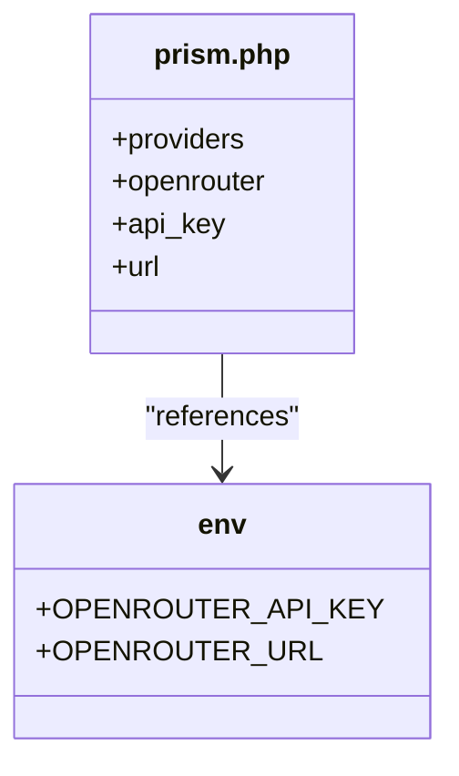
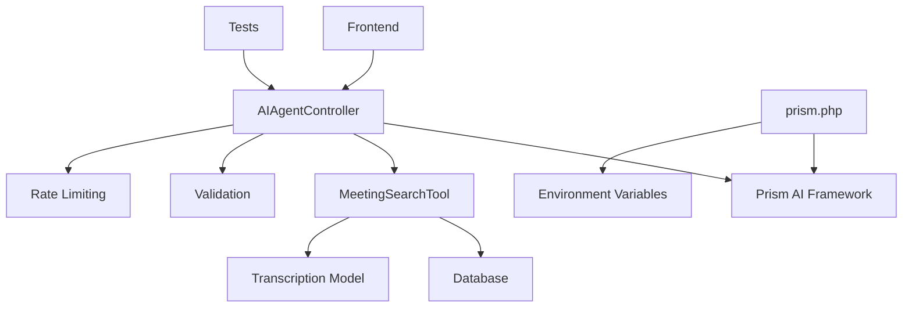

# AI Integration Issues


## Table of Contents
1. [Introduction](#introduction)
2. [Project Structure](#project-structure)
3. [Core Components](#core-components)
4. [Architecture Overview](#architecture-overview)
5. [Detailed Component Analysis](#detailed-component-analysis)
6. [Dependency Analysis](#dependency-analysis)
7. [Performance Considerations](#performance-considerations)
8. [Troubleshooting Guide](#troubleshooting-guide)
9. [Conclusion](#conclusion)

## Introduction
This document provides a comprehensive analysis of AI integration issues within the meetingai application. It focuses on diagnosing and resolving problems related to OpenRouter API connectivity, authentication failures, rate limiting, and malformed JSON responses. The document explains how the AIAgentController processes requests and integrates tools like MeetingSearchTool, details configuration requirements in prism.php, and provides troubleshooting steps for common issues such as empty search results, parsing errors, and timeout exceptions.

## Project Structure
The project follows a standard Laravel application structure with clear separation of concerns. The core AI integration components are located in specific directories:

- **app/Http/Controllers**: Contains AIAgentController for handling AI chat requests
- **app/Tools**: Houses tool implementations like MeetingSearchTool
- **config**: Stores configuration files including prism.php for AI service settings
- **tests/Feature**: Contains AIAgentTest for testing AI functionality
- **resources/js/pages/AI**: Frontend implementation for the AI chat interface





**Diagram sources**
- [AIAgentController.php](file://app/Http/Controllers/AIAgentController.php)
- [MeetingSearchTool.php](file://app/Tools/MeetingSearchTool.php)
- [prism.php](file://config/prism.php)
- [AIAgentTest.php](file://tests/Feature/AIAgentTest.php)
- [Chat.vue](file://resources/js/pages/AI/Chat.vue)

**Section sources**
- [AIAgentController.php](file://app/Http/Controllers/AIAgentController.php)
- [MeetingSearchTool.php](file://app/Tools/MeetingSearchTool.php)
- [prism.php](file://config/prism.php)

## Core Components
The AI integration system consists of several key components that work together to provide intelligent meeting transcription analysis. The AIAgentController handles incoming chat requests and coordinates with AI services, while the MeetingSearchTool enables searching through meeting transcriptions. The prism.php configuration file stores API credentials and service settings.

**Section sources**
- [AIAgentController.php](file://app/Http/Controllers/AIAgentController.php)
- [MeetingSearchTool.php](file://app/Tools/MeetingSearchTool.php)
- [prism.php](file://config/prism.php)

## Architecture Overview
The AI integration architecture follows a client-server pattern with tool-based AI functionality. The frontend Chat.vue component sends requests to the AIAgentController, which processes them using the Prism AI framework. The controller can invoke tools like MeetingSearchTool to retrieve relevant meeting data.





**Diagram sources**
- [AIAgentController.php](file://app/Http/Controllers/AIAgentController.php)
- [MeetingSearchTool.php](file://app/Tools/MeetingSearchTool.php)
- [Chat.vue](file://resources/js/pages/AI/Chat.vue)

## Detailed Component Analysis

### AIAgentController Analysis
The AIAgentController is responsible for handling AI chat requests and managing the interaction between the user and the AI service. It implements validation, rate limiting, and error handling.





**Diagram sources**
- [AIAgentController.php](file://app/Http/Controllers/AIAgentController.php)

**Section sources**
- [AIAgentController.php](file://app/Http/Controllers/AIAgentController.php#L0-L182)

### MeetingSearchTool Analysis
The MeetingSearchTool provides functionality to search through meeting transcriptions based on various criteria. It returns formatted results with highlighted search terms and timestamps.





**Diagram sources**
- [MeetingSearchTool.php](file://app/Tools/MeetingSearchTool.php)

**Section sources**
- [MeetingSearchTool.php](file://app/Tools/MeetingSearchTool.php#L0-L85)

### Configuration Analysis
The prism.php configuration file contains settings for various AI providers, including OpenRouter. It uses environment variables to store sensitive information like API keys.





**Diagram sources**
- [prism.php](file://config/prism.php)

**Section sources**
- [prism.php](file://config/prism.php#L0-L55)

## Dependency Analysis
The AI integration system has several key dependencies that must be properly configured for the system to function correctly.





**Diagram sources**
- [AIAgentController.php](file://app/Http/Controllers/AIAgentController.php)
- [MeetingSearchTool.php](file://app/Tools/MeetingSearchTool.php)
- [prism.php](file://config/prism.php)

**Section sources**
- [AIAgentController.php](file://app/Http/Controllers/AIAgentController.php)
- [MeetingSearchTool.php](file://app/Tools/MeetingSearchTool.php)
- [prism.php](file://config/prism.php)

## Performance Considerations
The AI integration system implements several performance optimizations:

- **Rate Limiting**: Basic rate limiting using cache to prevent abuse (10 requests per minute per IP)
- **Request Validation**: Input validation to prevent processing invalid requests
- **Caching**: Potential for caching AI responses to reduce API calls
- **Timeout Handling**: Client-side timeout of 30 seconds to prevent hanging requests
- **Query Optimization**: Database queries use indexing and limiting to improve performance

## Troubleshooting Guide

### Common Issues and Solutions

**OpenRouter API Connectivity Issues**
- **Symptoms**: Network errors, connection timeouts
- **Causes**: Network connectivity problems, firewall restrictions, incorrect API URL
- **Solutions**: 
  - Verify network connectivity
  - Check OPENROUTER_URL environment variable
  - Test API endpoint with curl or Postman
  - Ensure firewall allows outbound connections to api.openrouter.ai

**Authentication Failures**
- **Symptoms**: 401 errors, "Invalid API key" messages
- **Causes**: Missing or incorrect API key in environment variables
- **Solutions**:
  - Verify OPENROUTER_API_KEY is set in .env file
  - Check for typos in the API key
  - Ensure the API key has proper permissions
  - Regenerate the API key if necessary

**Rate Limiting**
- **Symptoms**: 429 errors, "Too many requests" messages
- **Causes**: Exceeding request limits
- **Solutions**:
  - Implement exponential backoff in client code
  - Increase rate limit threshold in AIAgentController
  - Add client-side throttling
  - Monitor and analyze request patterns

**Malformed JSON Responses**
- **Symptoms**: JSON parsing errors, unexpected response format
- **Causes**: AI service returning invalid JSON, network corruption
- **Solutions**:
  - Implement JSON validation and error handling
  - Add response sanitization
  - Use try-catch blocks around JSON parsing
  - Log raw responses for debugging

### Error Response Examples

**Rate Limit Exceeded**

```json
{
  "success": false,
  "error": "Too many requests. Please wait a moment before sending another message."
}
```


**Network Error**

```json
{
  "success": false,
  "error": "Network error occurred. Please check your connection and try again."
}
```


**Timeout Error**

```json
{
  "success": false,
  "error": "The request timed out. Please try again with a shorter message."
}
```


**Empty Search Query**

```json
{
  "success": true,
  "data": {
    "error": "Search query cannot be empty"
  }
}
```


### Testing and Mocking

**Pest Test Cases for Mocking AI Responses**

```php
it('can search through meeting transcriptions directly', function () {
    // Create test data
    $client = Client::factory()->create(['name' => 'Test Client']);
    $meeting = Meeting::factory()->completed()->create([
        'client_id' => $client->id,
        'title' => 'Budget Planning Meeting'
    ]);
    
    Transcription::factory()->create([
        'meeting_id' => $meeting->id,
        'speaker' => 'John Doe',
        'text' => 'We need to discuss the budget allocation for next quarter',
        'start_time' => 30.5,
        'end_time' => 35.2,
        'confidence' => 0.95
    ]);
    
    // Test search functionality
    $response = $this->postJson('/ai/search', [
        'query' => 'budget',
        'limit' => 10
    ]);
    
    $response->assertStatus(200);
    $response->assertJson([
        'success' => true
    ]);
});
```


**Testing Strategies**
- Use factory classes to create test data
- Test edge cases like empty queries and invalid parameters
- Verify rate limiting behavior
- Test error handling scenarios
- Mock external API calls when necessary

### Troubleshooting Steps

1. **Validate API Key Permissions**
   - Check OPENROUTER_API_KEY environment variable
   - Verify the API key has appropriate permissions
   - Test the API key with a simple curl command

2. **Inspect HTTP Request Logs**
   - Check Laravel logs for error messages
   - Monitor network requests in browser developer tools
   - Use logging to track request/response cycles

3. **Test Tool Execution in Isolation**
   - Call MeetingSearchTool directly with test parameters
   - Verify database connectivity and query results
   - Test with different search criteria

4. **Verify Transcription Data Integrity**
   - Check that transcription records exist in the database
   - Validate data format and completeness
   - Ensure relationships between models are correct

**Section sources**
- [AIAgentController.php](file://app/Http/Controllers/AIAgentController.php)
- [MeetingSearchTool.php](file://app/Tools/MeetingSearchTool.php)
- [prism.php](file://config/prism.php)
- [AIAgentTest.php](file://tests/Feature/AIAgentTest.php)
- [Chat.vue](file://resources/js/pages/AI/Chat.vue)

## Conclusion
The AI integration in the meetingai application provides powerful functionality for analyzing meeting transcriptions through natural language interaction. By understanding the architecture, configuration requirements, and common issues, developers can effectively diagnose and resolve problems. Proper implementation of error handling, rate limiting, and testing strategies ensures a reliable and robust AI experience for users.

**Referenced Files in This Document**   
- [AIAgentController.php](file://app/Http/Controllers/AIAgentController.php)
- [MeetingSearchTool.php](file://app/Tools/MeetingSearchTool.php)
- [prism.php](file://config/prism.php)
- [AIAgentTest.php](file://tests/Feature/AIAgentTest.php)
- [Chat.vue](file://resources/js/pages/AI/Chat.vue)