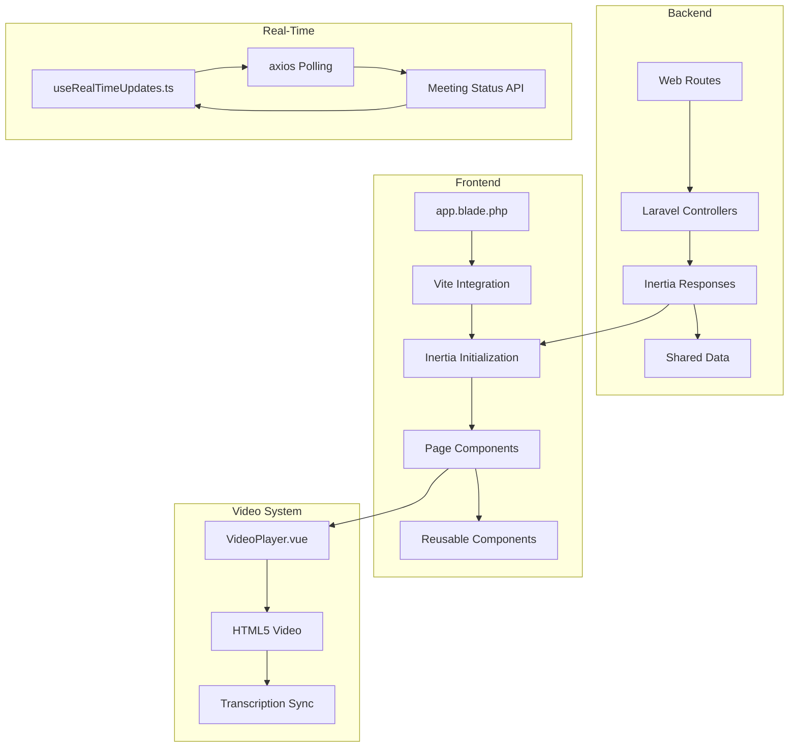
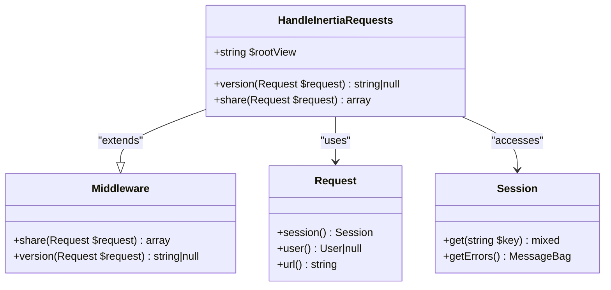
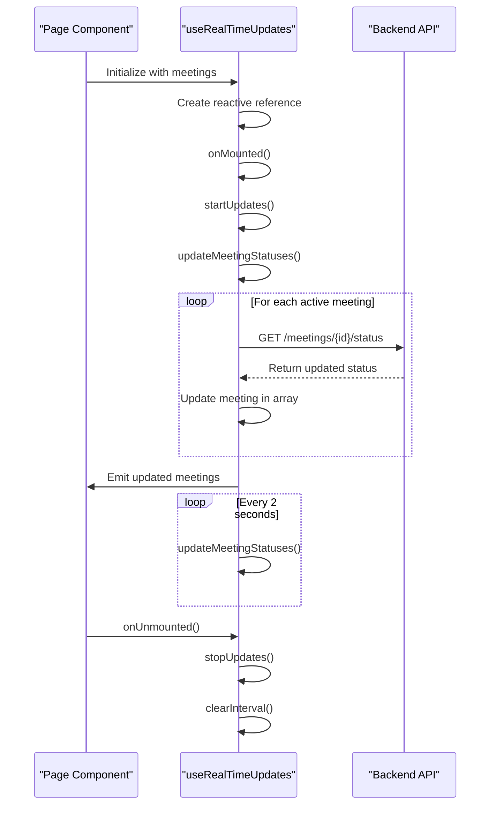

# Frontend and Real-Time Updates


## Table of Contents
1. [Introduction](#introduction)
2. [Project Structure](#project-structure)
3. [Inertia.js Integration and Routing](#inertiajs-integration-and-routing)
4. [Real-Time Updates Implementation](#real-time-updates-implementation)
5. [Video Playback System](#video-playback-system)
6. [Troubleshooting Guide](#troubleshooting-guide)

## Introduction
This document provides a comprehensive analysis of the frontend architecture and real-time functionality in the MeetingAI application. It focuses on three critical areas: Inertia.js integration for seamless page transitions, real-time status updates for meeting processing, and video playback with transcription synchronization. The documentation is designed to help developers understand, debug, and extend these core features, with detailed explanations of implementation patterns, common issues, and solutions.

## Project Structure
The MeetingAI application follows a standard Laravel-Vue.js architecture with Inertia.js as the bridge between the backend and frontend. The project is organized into conventional Laravel directories with a rich frontend component structure in the resources/js directory. The frontend is built with Vue 3 Composition API and TypeScript, providing type safety and modern development practices.

The key structural elements include:
- **app/Http/Controllers**: Laravel controllers handling API and page requests
- **app/Http/Middleware**: Middleware including Inertia.js integration
- **config/inertia.php**: Inertia.js configuration settings
- **resources/js/lib**: Shared Vue components and composables
- **resources/js/pages**: Top-level page components
- **resources/views/app.blade.php**: Main layout template





**Diagram sources**
- [HandleInertiaRequests.php](file://app/Http/Middleware/HandleInertiaRequests.php)
- [inertia.php](file://config/inertia.php)
- [app.blade.php](file://resources/views/app.blade.php)

**Section sources**
- [HandleInertiaRequests.php](file://app/Http/Middleware/HandleInertiaRequests.php)
- [inertia.php](file://config/inertia.php)
- [app.blade.php](file://resources/views/app.blade.php)

## Inertia.js Integration and Routing

### Configuration and Middleware
The Inertia.js integration is configured through both middleware and configuration files. The `HandleInertiaRequests` middleware extends the base Inertia middleware and defines shared data that is automatically passed to all Inertia responses. This includes flash messages, CSRF tokens, Ziggy route helpers, and user authentication data.

The `inertia.php` configuration file enables server-side rendering (SSR) and defines the testing configuration for locating page components. The SSR is configured to connect to a local service at http://127.0.0.1:13714, which pre-renders the initial page visit for better performance and SEO.





**Diagram sources**
- [HandleInertiaRequests.php](file://app/Http/Middleware/HandleInertiaRequests.php)

**Section sources**
- [HandleInertiaRequests.php](file://app/Http/Middleware/HandleInertiaRequests.php)
- [inertia.php](file://config/inertia.php)

### Page Transition Flow
The page transition process begins with the Laravel application routing requests through the `web.php` routes file. When a route returns an Inertia response, the `HandleInertiaRequests` middleware processes it, adding shared data and determining the appropriate Vue component to render based on the page name.

The main layout template (`app.blade.php`) initializes Inertia by including the Vite-managed JavaScript bundle and rendering the `@inertia` directive, which creates a div with the page data as a JSON payload. This allows Inertia to hydrate the Vue application with the initial page component and props.

Common issues with Inertia routing include:
- **Failed page transitions**: Often caused by incorrect component paths or missing page components
- **Prop serialization problems**: Occur when complex objects cannot be properly serialized to JSON
- **Stale data**: Happens when shared data is not properly updated between requests

Solutions include:
- Verifying component paths in the `inertia.php` configuration
- Using simple data types for props or implementing proper serialization
- Clearing cached data when necessary

## Real-Time Updates Implementation

### Connection Establishment and Maintenance
The real-time updates system is implemented in `useRealTimeUpdates.ts` as a Vue composable that uses polling to simulate WebSocket-like behavior. Instead of maintaining a persistent connection, it periodically fetches updated meeting status from the backend API.

The composable accepts an array of meeting objects and returns a reactive reference to updated meetings, along with control methods. When mounted, it immediately fetches the latest status and then sets up an interval to poll every 2 seconds. The polling only targets meetings with 'pending' or 'processing' status to optimize network usage.





**Diagram sources**
- [useRealTimeUpdates.ts](file://resources/js/lib/useRealTimeUpdates.ts)

**Section sources**
- [useRealTimeUpdates.ts](file://resources/js/lib/useRealTimeUpdates.ts)

### Reconnection Logic and Error Handling
The real-time updates system includes robust error handling for network failures and API errors. When a status update request fails, it logs the error to the console but continues polling other meetings. This fault tolerance ensures that a single failed request doesn't disrupt the entire update process.

The composable uses shallowRef to optimize reactivity, only triggering updates when the reference itself changes rather than on every property mutation. This improves performance when dealing with large numbers of meetings.

Key features of the implementation:
- **Selective polling**: Only active meetings are updated, reducing unnecessary network requests
- **Error isolation**: Failures for one meeting don't affect others
- **Automatic cleanup**: The interval is cleared when the component is unmounted to prevent memory leaks
- **Data preservation**: Existing meeting fields are preserved when merging updated status data

## Video Playback System

### Media Format and Compatibility
The video playback system is implemented in the `VideoPlayer.vue` component, which wraps the native HTML5 video element with a Vue interface. The component handles various video formats supported by the browser's media capabilities, relying on the browser's built-in codec support.

The component accepts a video URL as a prop and displays loading and error states appropriately. When a video fails to load, it provides detailed error information based on the MediaError code, offering user-friendly suggestions for resolution.


```mermaid
flowchart TD
Start([VideoPlayer Mounted]) --> ValidateURL["Validate video URL"]
ValidateURL --> LoadVideo["Load video source"]
LoadVideo --> CheckMetadata["Wait for loadedmetadata"]
CheckMetadata --> MetadataSuccess{"Metadata loaded?"}
MetadataSuccess --> |Yes| DisplayDuration["Display duration"]
MetadataSuccess --> |No| HandleError["Handle loading error"]
HandleError --> DetermineError["Determine error type"]
DetermineError --> ShowUserError["Show user-friendly error"]
ShowUserError --> OfferRetry["Offer retry option"]
OfferRetry --> End([Ready for playback])
subgraph "Error Types"
A[MediaError.MEDIA_ERR_ABORTED] --> "Loading aborted"
B[MediaError.MEDIA_ERR_NETWORK] --> "Network error"
C[MediaError.MEDIA_ERR_DECODE] --> "Decode error"
D[MediaError.MEDIA_ERR_SRC_NOT_SUPPORTED] --> "Format not supported"
end
```


**Diagram sources**
- [VideoPlayer.vue](file://resources/js/lib/VideoPlayer.vue)

**Section sources**
- [VideoPlayer.vue](file://resources/js/lib/VideoPlayer.vue)

### Buffering and Synchronization
The video player includes comprehensive buffering indicators and error recovery mechanisms. A loading overlay is displayed while the video metadata is being loaded, and an error overlay appears if playback fails. The component emits various events (timeUpdate, durationChange, play, pause, ended, error) that can be handled by parent components.

For transcription synchronization, the component watches for external currentTime changes and seeks to the specified time when there's a significant difference (>1 second). This allows the transcription viewer to control video playback by clicking on specific transcript segments.

Key features:
- **Loading state management**: Clear visual feedback during video loading
- **Error recovery**: Retry functionality with source reset
- **Synchronization**: Two-way communication between video and transcription
- **Responsive design**: Adapts to different screen sizes

## Troubleshooting Guide

### Inertia.js Issues
**Common Problems:**
- **Routing errors**: Verify that the component path in the Inertia response matches the actual file location in `resources/js/pages/`
- **Failed page transitions**: Check the browser console for JavaScript errors and verify that Vite is properly compiling assets
- **Prop serialization issues**: Ensure that props passed to Inertia responses are serializable to JSON (avoid closures, resources, or complex objects)

**Debugging Techniques:**
- Inspect network requests to verify Inertia response structure
- Check the console for JavaScript errors
- Validate that the correct component is being loaded by examining the page data in the DOM
- Use Inertia assertions in tests to verify component and prop expectations

### Real-Time Updates Issues
**Common Problems:**
- **Stale data**: Ensure that the polling interval is properly started and stopped
- **Excessive network requests**: Verify that only active meetings are being polled
- **Memory leaks**: Confirm that intervals are cleared when components are unmounted

**Debugging Techniques:**
- Monitor network tab for polling requests
- Check console for error messages from failed requests
- Verify that meeting status updates are properly reflected in the UI
- Test edge cases like network disconnection and reconnection

### Video Playback Issues
**Common Problems:**
- **Format compatibility**: The video format may not be supported by the user's browser
- **Buffering problems**: Network connectivity issues or large file sizes
- **Synchronization errors**: Timing discrepancies between video and transcription

**Debugging Techniques:**
- Inspect the video element's error property for specific error codes
- Check network requests for the video file
- Verify that time update events are being emitted correctly
- Test with different video formats and sizes
- Use the retry functionality to recover from transient errors

**Section sources**
- [HandleInertiaRequests.php](file://app/Http/Middleware/HandleInertiaRequests.php)
- [useRealTimeUpdates.ts](file://resources/js/lib/useRealTimeUpdates.ts)
- [VideoPlayer.vue](file://resources/js/lib/VideoPlayer.vue)

**Referenced Files in This Document**   
- [HandleInertiaRequests.php](file://app/Http/Middleware/HandleInertiaRequests.php)
- [inertia.php](file://config/inertia.php)
- [useRealTimeUpdates.ts](file://resources/js/lib/useRealTimeUpdates.ts)
- [VideoPlayer.vue](file://resources/js/lib/VideoPlayer.vue)
- [app.blade.php](file://resources/views/app.blade.php)