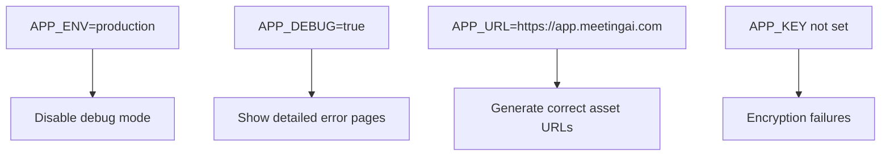
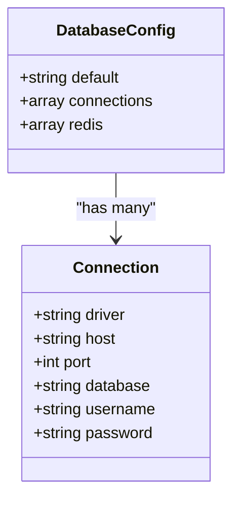
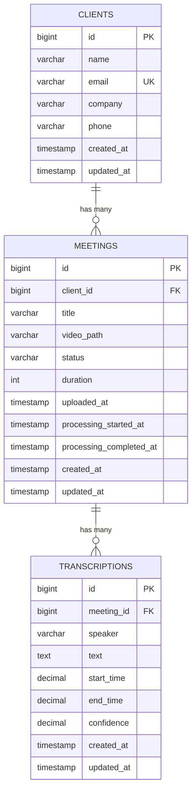
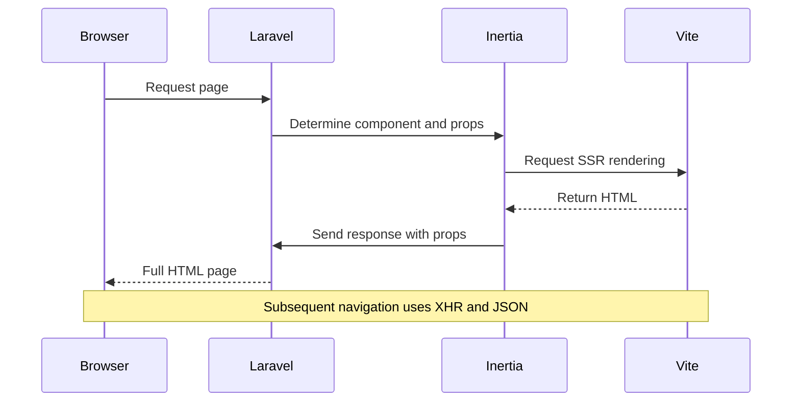

# Deployment and Configuration Problems


## Table of Contents
1. [Introduction](#introduction)
2. [Common Environment Misconfigurations](#common-environment-misconfigurations)
3. [Core Configuration Files Overview](#core-configuration-files-overview)
4. [Database Configuration and Migration Issues](#database-configuration-and-migration-issues)
5. [Asset Compilation and Inertia.js Integration](#asset-compilation-and-inertiajs-integration)
6. [Queue and Background Job Configuration](#queue-and-background-job-configuration)
7. [Session and Security Configuration](#session-and-security-configuration)
8. [Storage and Filesystem Setup](#storage-and-filesystem-setup)
9. [Troubleshooting Guide](#troubleshooting-guide)
10. [Production Deployment Checklist](#production-deployment-checklist)

## Introduction
This document provides a comprehensive guide to resolving deployment and environment configuration issues in the MeetingAI application. It covers common misconfigurations, explains the impact of key configuration files, and offers practical solutions for development, testing, and production environments. The application uses Laravel with Inertia.js and Vue, and relies on proper configuration of databases, queues, sessions, and asset compilation for reliable operation.

## Common Environment Misconfigurations

### Incorrect Database Credentials
One of the most frequent deployment issues arises from incorrect database credentials in the `.env` file. The `database.php` configuration pulls values such as `DB_HOST`, `DB_PORT`, `DB_DATABASE`, `DB_USERNAME`, and `DB_PASSWORD` from environment variables. If these are missing or incorrect, the application will fail to connect to the database.

**Example of problematic configuration:**

```env
DB_CONNECTION=mysql
DB_HOST=localhost
DB_PORT=3306
DB_DATABASE=meetingai
DB_USERNAME=root
DB_PASSWORD=wrongpassword
```


This will result in a "SQLSTATE[HY000] [1045] Access denied" error during deployment.

### Queue Driver Settings
The queue system is configured via `queue.php`, which defaults to the `database` driver. If the `QUEUE_CONNECTION` environment variable is not set correctly, or if the corresponding queue table (`jobs`) does not exist, background jobs like transcription processing will fail silently.

### Asset URL Mismatches
The `filesystems.php` configuration constructs the public URL for assets using `APP_URL.'/storage'`. If `APP_URL` is set incorrectly (e.g., `http://localhost` in production), users will receive 404 errors when trying to access uploaded files or cached assets.

**Section sources**
- [app.php](file://config/app.php#L0-L126)
- [database.php](file://config/database.php#L0-L174)
- [filesystems.php](file://config/filesystems.php#L0-L80)

## Core Configuration Files Overview

### Application Configuration (app.php)
The `app.php` file controls fundamental application behavior:

:Application Name: `APP_NAME` - Displayed in UI elements  
:Environment: `APP_ENV` - Determines configuration loading (production, staging, local)  
:Debug Mode: `APP_DEBUG` - When true, exposes stack traces (dangerous in production)  
:Application URL: `APP_URL` - Used for URL generation in emails and console commands  
:Encryption Key: `APP_KEY` - Must be set to a 32-character random string for secure encryption  





**Diagram sources**
- [app.php](file://config/app.php#L0-L126)

**Section sources**
- [app.php](file://config/app.php#L0-L126)

### Database Configuration (database.php)
This file defines all database connection options. The default connection is determined by `DB_CONNECTION`, which typically points to `sqlite`, `mysql`, or `pgsql`.

:Default Connection: `DB_CONNECTION` - Selected driver (sqlite, mysql, pgsql)  
:SQLite Database: `DB_DATABASE` - Path to SQLite file  
:MySQL/PostgreSQL: `DB_HOST`, `DB_PORT`, `DB_USERNAME`, `DB_PASSWORD` - Connection credentials  
:Redis Configuration: `REDIS_HOST`, `REDIS_PASSWORD`, `REDIS_PORT` - For cache and queue  

The configuration supports multiple connections, allowing different services (cache, queue, session) to use separate database instances.





**Diagram sources**
- [database.php](file://config/database.php#L0-L174)

**Section sources**
- [database.php](file://config/database.php#L0-L174)

## Database Configuration and Migration Issues

### Migration Schema Overview
The application uses Laravel migrations to manage database schema. Key tables include:

**Clients Table** (`clients`)
- id: Primary key
- name: Client name (required)
- email: Unique contact email (nullable)
- company: Organization name (nullable)
- phone: Contact number (nullable)
- timestamps: created_at, updated_at

**Meetings Table** (`meetings`)
- id: Primary key
- client_id: Foreign key to clients
- title: Meeting title
- video_path: Path to video file (500 char limit)
- status: Current processing status (default: pending)
- duration: Length in seconds (nullable)
- uploaded_at: Timestamp when uploaded
- processing_started_at: When transcription began
- processing_completed_at: When transcription finished

**Transcriptions Table** (`transcriptions`)
- id: Primary key
- meeting_id: Foreign key to meetings
- speaker: Identified speaker (nullable)
- text: Transcribed text
- start_time: Start time in seconds (millisecond precision)
- end_time: End time in seconds
- confidence: Accuracy score (0.00–1.00)





**Diagram sources**
- [2025_08_10_135157_create_clients_table.php](file://database/migrations/2025_08_10_135157_create_clients_table.php#L0-L31)
- [2025_08_10_135205_create_meetings_table.php](file://database/migrations/2025_08_10_135205_create_meetings_table.php#L0-L40)
- [2025_08_10_135210_create_transcriptions_table.php](file://database/migrations/2025_08_10_135210_create_transcriptions_table.php#L0-L38)

### Database Seeding Configuration
The application includes seeders to populate initial data:

- **ClientSeeder**: Creates sample clients including Acme Corporation, John Smith, Sarah Johnson, and a basic client without optional fields
- **MeetingSeeder**: Generates sample meetings associated with seeded clients
- **DatabaseSeeder**: Orchestrates the seeding process by calling ClientSeeder and MeetingSeeder

**Section sources**
- [ClientSeeder.php](file://database/seeders/ClientSeeder.php#L0-L43)
- [MeetingSeeder.php](file://database/seeders/MeetingSeeder.php#L0-L35)
- [DatabaseSeeder.php](file://database/seeders/DatabaseSeeder.php#L0-L21)

## Asset Compilation and Inertia.js Integration

### Vite Configuration
The `vite.config.ts` file configures the frontend build process:

:Input File: `resources/js/app.ts` - Entry point for client-side application  
:SSR Support: `resources/js/ssr.ts` - Server-side rendering entry  
:Plugins: Laravel Vite plugin, Tailwind CSS, Vue with asset URL transformation  

The configuration enables hot module replacement during development via the `refresh: true` option.

### Inertia.js Configuration
The `inertia.php` configuration enables server-side rendering (SSR) with the following settings:

:SSR Enabled: `true` - SSR is active  
:SSR URL: `http://127.0.0.1:13714` - Address of SSR service  
:Page Paths: `resources/js/pages` - Location of Inertia page components  
:Page Extensions: js, jsx, ts, tsx, vue - Supported file types  

### HandleInertiaRequests Middleware
This middleware (`HandleInertiaRequests.php`) shares key data with the frontend:

:Shared Data: Includes flash messages, CSRF token, app info, Ziggy routes, and user data  
:Root View: `app` - Blade template used as root  
:Versioning: Uses Laravel's asset versioning system  





**Diagram sources**
- [vite.config.ts](file://vite.config.ts#L0-L23)
- [inertia.php](file://config/inertia.php#L0-L52)
- [HandleInertiaRequests.php](file://app/Http/Middleware/HandleInertiaRequests.php#L0-L67)

**Section sources**
- [vite.config.ts](file://vite.config.ts#L0-L23)
- [inertia.php](file://config/inertia.php#L0-L52)
- [HandleInertiaRequests.php](file://app/Http/Middleware/HandleInertiaRequests.php#L0-L67)

## Queue and Background Job Configuration

### Queue Configuration (queue.php)
The queue system is configured to use the database as the default driver:

:Default Driver: `QUEUE_CONNECTION=database`  
:Database Table: `jobs` - Stores pending jobs  
:Retry After: 90 seconds - Time before retrying failed jobs  
:Failed Jobs: Stored in `failed_jobs` table using `database-uuids` driver  

Alternative drivers include Redis, SQS, and sync (for testing).

### TranscribeMeetingJob Implementation
The `TranscribeMeetingJob` processes audio/video files asynchronously:

:Job Chain: Upload → Process → Transcribe → Store  
:Error Handling: Captures and logs processing errors  
:Docker Integration: Uses `dockerPath` method to ensure correct path formatting  
:CPU Detection: Dynamically determines available CPU threads for processing  

**Section sources**
- [queue.php](file://config/queue.php#L0-L112)
- [TranscribeMeetingJob.php](file://app/Jobs/TranscribeMeetingJob.php#L200-L220)

## Session and Security Configuration

### Session Configuration (session.php)
The application uses database-backed sessions by default:

:Session Driver: `SESSION_DRIVER=database`  
:Session Lifetime: 120 minutes  
:Session Table: `sessions`  
:Cookie Security: `SESSION_SECURE_COOKIE` (HTTPS only), `SESSION_HTTP_ONLY` (JS inaccessible)  
:SameSite Policy: `lax` - Prevents CSRF attacks while allowing safe cross-site requests  

Sensitive settings like `SESSION_ENCRYPT` can encrypt session data, and `SESSION_PARTITIONED_COOKIE` supports partitioned cookies for enhanced isolation.

**Section sources**
- [session.php](file://config/session.php#L0-L217)

## Storage and Filesystem Setup

### Filesystem Configuration (filesystems.php)
The application defines three storage disks:

:Local Disk: `storage/app/private` - For private application files  
:Public Disk: `storage/app/public` with URL at `APP_URL/storage` - For user-accessible files  
:S3 Disk: AWS S3 integration using standard credentials  

The `links` array creates a symbolic link from `public/storage` to `storage/app/public`, enabling direct web access to uploaded files.

### Asset URL Resolution
The public URL for assets is constructed as:

```
env('APP_URL').'/storage'
```


If `APP_URL` is misconfigured (e.g., missing protocol or using localhost in production), asset URLs will be incorrect, breaking image, video, and file access.

**Section sources**
- [filesystems.php](file://config/filesystems.php#L0-L80)

## Troubleshooting Guide

### Testing Environment Discrepancies
1. Verify `.env` file exists and is loaded
2. Run `php artisan config:clear` and `php artisan cache:clear`
3. Check `config:cache` status and rebuild if necessary
4. Compare `APP_ENV` between environments

### Cache Configuration Errors
- **Issue**: Cache not working or returning stale data  
  **Solution**: Clear cache with `php artisan cache:clear` and verify `CACHE_DRIVER` setting

- **Issue**: Redis connection failures  
  **Solution**: Check `REDIS_HOST`, `REDIS_PASSWORD`, and `REDIS_PORT` in `.env`

### Session Handling Failures
- **Issue**: Users logged out unexpectedly  
  **Solution**: Verify `SESSION_LIFETIME` and `SESSION_EXPIRE_ON_CLOSE` settings

- **Issue**: Session data not persisting  
  **Solution**: Ensure database connection works and `sessions` table exists

### Database Migration Problems
- **Issue**: Migration fails with foreign key constraint  
  **Solution**: Ensure referenced tables exist and use correct order in migration filenames

- **Issue**: "Table already exists" errors  
  **Solution**: Check database state with `php artisan migrate:status`

## Production Deployment Checklist

### Optimize Queue Workers
- Run queue workers as services: `php artisan queue:work --daemon`
- Monitor worker processes and restart on failure
- Use Supervisor to manage worker processes

### Enable Error Logging
- Set `APP_DEBUG=false`
- Configure `LOG_CHANNEL=stack` with appropriate drivers
- Monitor `storage/logs/laravel.log` for errors
- Set up external logging (e.g., Sentry, Loggly)

### Secure API Keys
- Never commit `.env` files to version control
- Use environment variables for all credentials
- Rotate keys regularly
- Restrict API key permissions (e.g., OpenAI, AWS)

### Validate Storage Access
- Run `php artisan storage:link` to create public symlink
- Test file uploads and retrievals
- Verify S3 bucket policies if using cloud storage
- Check file permissions on server

### Final Verification Steps
1. Run `php artisan optimize` to cache configuration
2. Execute `php artisan route:cache` for route optimization
3. Test all critical workflows (upload, process, view)
4. Verify HTTPS is enforced in production
5. Confirm backup procedures are in place

**Referenced Files in This Document**   
- [app.php](file://config/app.php#L0-L126)
- [database.php](file://config/database.php#L0-L174)
- [filesystems.php](file://config/filesystems.php#L0-L80)
- [queue.php](file://config/queue.php#L0-L112)
- [session.php](file://config/session.php#L0-L217)
- [inertia.php](file://config/inertia.php#L0-L52)
- [vite.config.ts](file://vite.config.ts#L0-L23)
- [HandleInertiaRequests.php](file://app/Http/Middleware/HandleInertiaRequests.php#L0-L67)
- [2025_08_10_135157_create_clients_table.php](file://database/migrations/2025_08_10_135157_create_clients_table.php#L0-L31)
- [2025_08_10_135205_create_meetings_table.php](file://database/migrations/2025_08_10_135205_create_meetings_table.php#L0-L40)
- [2025_08_10_135210_create_transcriptions_table.php](file://database/migrations/2025_08_10_135210_create_transcriptions_table.php#L0-L38)
- [DatabaseSeeder.php](file://database/seeders/DatabaseSeeder.php#L0-L21)
- [ClientSeeder.php](file://database/seeders/ClientSeeder.php#L0-L43)
- [MeetingSeeder.php](file://database/seeders/MeetingSeeder.php#L0-L35)