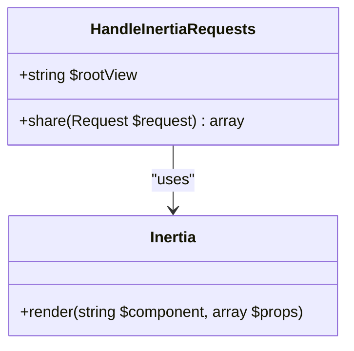
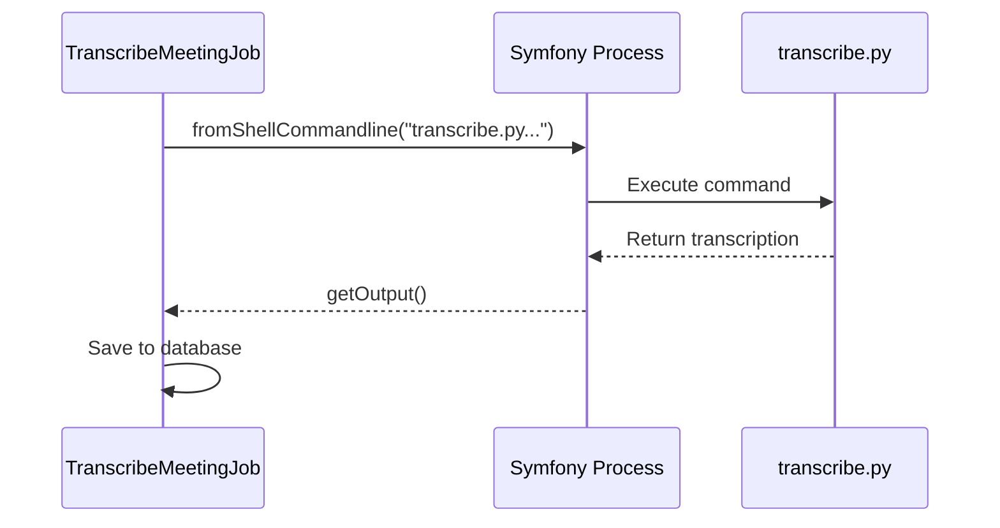
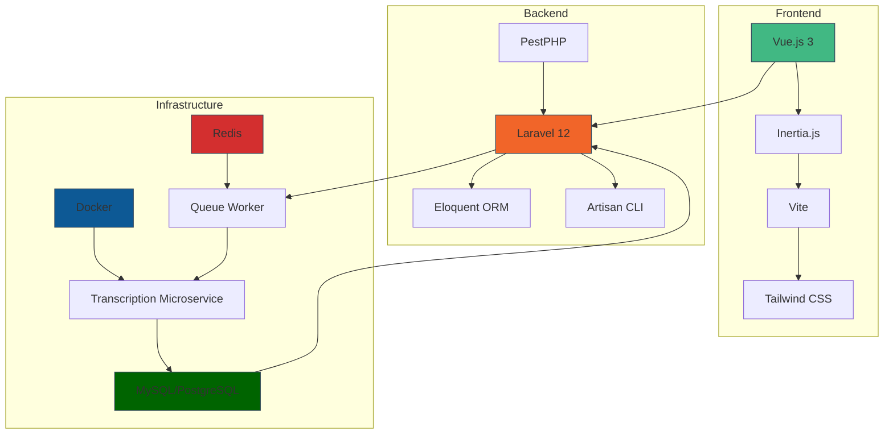

# Technology Stack


## Table of Contents
1. [Frontend Technologies](#frontend-technologies)  
2. [Backend Technologies](#backend-technologies)  
3. [Infrastructure](#infrastructure)  
4. [Supporting Tools](#supporting-tools)  
5. [Integration and Architecture Overview](#integration-and-architecture-overview)

## Frontend Technologies

The frontend of the meetingai application is built using modern JavaScript tooling and frameworks, designed for high performance, developer experience, and seamless integration with the Laravel backend.

### Vue.js 3 with Composition API
Vue.js 3 is used as the primary frontend framework, leveraging the Composition API for better code organization, reusability, and type safety. The Composition API allows developers to group related logic together, making complex components easier to manage.

The application's UI components are located in `resources/js/pages` and `resources/js/lib`, including pages such as `Meetings/Index.vue`, `Clients/Create.vue`, and reusable components like `TranscriptionViewer.vue` and `LoadingSpinner.vue`.

**Key Features:**
- Reactive state management via Vue’s reactivity system
- Component-based architecture for modularity
- Composition functions like `useRealTimeUpdates.ts` for shared logic

**Section sources**
- [resources/js/pages/Meetings/Index.vue](file://resources/js/pages/Meetings/Index.vue)
- [resources/js/lib/useRealTimeUpdates.ts](file://resources/js/lib/useRealTimeUpdates.ts)

### TypeScript
TypeScript is used throughout the frontend to provide static typing, improving code quality, IDE support, and refactoring safety. The `tsconfig.json` and `package.json` confirm TypeScript version `^5.2.2` is used.

Type definitions are organized in `resources/js/types/`, including global types and Ziggy route helpers.

**Section sources**
- [tsconfig.json](file://tsconfig.json)
- [package.json](file://package.json)
- [resources/js/types/index.ts](file://resources/js/types/index.ts)

### Inertia.js for Laravel Integration
Inertia.js enables seamless integration between the Laravel backend and Vue.js frontend by allowing server-side controllers to return frontend components as responses, eliminating the need for a separate API layer.

The `HandleInertiaRequests` middleware in `app/Http/Middleware/HandleInertiaRequests.php` configures Inertia’s root view and shared data (e.g., user, CSRF token, Ziggy routes).





**Diagram sources**
- [app/Http/Middleware/HandleInertiaRequests.php](file://app/Http/Middleware/HandleInertiaRequests.php)
- [config/inertia.php](file://config/inertia.php)

**Section sources**
- [app/Http/Middleware/HandleInertiaRequests.php](file://app/Http/Middleware/HandleInertiaRequests.php)
- [config/inertia.php](file://config/inertia.php)

### Tailwind CSS for Styling
Tailwind CSS is used for utility-first styling, enabling rapid UI development with minimal custom CSS. It is integrated via the `@tailwindcss/vite` plugin in the Vite configuration.

The base styles are defined in `resources/css/app.css`.

**Section sources**
- [resources/css/app.css](file://resources/css/app.css)
- [vite.config.ts](file://vite.config.ts)

### Vite for Module Bundling
Vite is used as the module bundler, providing fast development server startup and hot module replacement (HMR). It is configured in `vite.config.ts` with plugins for Laravel, Vue, and Tailwind CSS.


```typescript
import vue from '@vitejs/plugin-vue';
import laravel from 'laravel-vite-plugin';
import tailwindcss from '@tailwindcss/vite';

export default defineConfig({
    plugins: [
        laravel({
            input: ['resources/js/app.ts'],
            ssr: 'resources/js/ssr.ts',
            refresh: true,
        }),
        tailwindcss(),
        vue(),
    ],
});
```


**Section sources**
- [vite.config.ts](file://vite.config.ts)
- [package.json](file://package.json)

## Backend Technologies

The backend is built on Laravel 12 with PHP 8.2+, providing a robust, scalable foundation for the application.

### Laravel 12
Laravel 12 is the core backend framework, managing routing, controllers, middleware, and service providers. It is specified in `composer.json`:


```json
"laravel/framework": "^12.0"
```


Key controllers include:
- `MeetingController.php`: Manages meeting lifecycle
- `AIAgentController.php`: Handles AI chat interactions
- `ClientController.php`: Manages client data

**Section sources**
- [composer.json](file://composer.json)
- [app/Http/Controllers/MeetingController.php](file://app/Http/Controllers/MeetingController.php)

### PHP 8.2+
The application requires PHP 8.2 or higher, as specified in `composer.json`:


```json
"php": "^8.2"
```


This ensures access to modern PHP features like readonly properties, enums, and improved type system.

**Section sources**
- [composer.json](file://composer.json)

### Eloquent ORM
Eloquent is Laravel’s ORM, used to define models such as `User`, `Client`, `Meeting`, and `Transcription`. These models are located in `app/Models/` and interact with the database using expressive, fluent syntax.

Database migrations in `database/migrations/` define the schema, including relationships and indexes.

**Section sources**
- [app/Models/Meeting.php](file://app/Models/Meeting.php)
- [database/migrations/2025_08_10_135205_create_meetings_table.php](file://database/migrations/2025_08_10_135205_create_meetings_table.php)

### Artisan CLI
Laravel Artisan is used for development tasks, including:
- Running migrations (`php artisan migrate`)
- Starting the development server (`php artisan serve`)
- Managing queues (`php artisan queue:listen`)

Custom commands like `TestTranscriptionWorkflow.php` extend Artisan for application-specific tasks.

**Section sources**
- [app/Console/Commands/TestTranscriptionWorkflow.php](file://app/Console/Commands/TestTranscriptionWorkflow.php)

## Infrastructure

### Docker for Containerizing the Transcription Microservice
The transcription functionality is offloaded to a Python-based microservice containerized using Docker. The `transcribe-microservice/Dockerfile` defines a Python 3.11 environment with dependencies for Whisper/WhisperX and FFmpeg.

Key features:
- Multi-stage build with CPU/CUDA support toggle
- Use of `tini` as init process
- Pre-installed `ffmpeg` for audio processing


```dockerfile
FROM python:3.11-slim AS base
RUN apt-get update && apt-get install -y ffmpeg
COPY requirements.txt /app/requirements.txt
RUN pip install -r /app/requirements.txt
COPY transcribe.py /app/transcribe.py
ENTRYPOINT ["/usr/bin/tini", "--"]
```


**Section sources**
- [transcribe-microservice/Dockerfile](file://transcribe-microservice/Dockerfile)
- [transcribe-microservice/requirements.txt](file://transcribe-microservice/requirements.txt)

### Redis for Queue Management
Redis is used as the queue driver for asynchronous job processing. Configuration in `config/database.php` shows Redis is set as the default cache and queue connection.


```php
'redis' => [
    'client' => env('REDIS_CLIENT', 'phpredis'),
    'default' => [
        'host' => env('REDIS_HOST', '127.0.0.1'),
        'port' => env('REDIS_PORT', '6379'),
        'database' => env('REDIS_DB', '0'),
    ],
],
```


The queue configuration uses Redis for job storage, enabling scalable background processing via `php artisan queue:listen`.

**Section sources**
- [config/database.php](file://config/database.php)
- [config/queue.php](file://config/queue.php)

### MySQL/PostgreSQL for Database Storage
The application supports both MySQL and PostgreSQL, with SQLite as default for local development. The `config/database.php` file defines multiple database drivers:


```php
'default' => env('DB_CONNECTION', 'sqlite'),

'connections' => [
    'mysql' => [/* ... */],
    'pgsql' => [/* ... */],
    'sqlite' => [/* ... */],
],
```


This flexibility allows deployment in various environments while maintaining compatibility.

**Section sources**
- [config/database.php](file://config/database.php)

## Supporting Tools

### PestPHP for Testing
PestPHP is used as the primary testing framework, offering a clean, expressive syntax for unit, feature, and browser tests. It is specified in `composer.json` under `require-dev`:


```json
"pestphp/pest": "4.x-dev",
"pestphp/pest-plugin-laravel": "4.x-dev"
```


Tests are located in the `tests/` directory, including:
- `Feature/MeetingUploadTest.php`
- `Browser/VideoPlayerAndTranscriptionTest.php`
- `Unit/ExampleTest.php`

Pest enables snapshot testing, browser testing, and stress testing via plugins.

**Section sources**
- [composer.json](file://composer.json)
- [tests/Feature/MeetingUploadTest.php](file://tests/Feature/MeetingUploadTest.php)

### ESLint for Linting
ESLint is used to enforce code quality and consistency in the frontend. The configuration in `eslint.config.js` includes:
- Vue.js and TypeScript rules
- Prettier integration
- Custom rules like disabling `vue/multi-word-component-names`


```js
import { defineConfigWithVueTs } from '@vue/eslint-config-typescript';

export default defineConfigWithVueTs(
    vue.configs['flat/essential'],
    vueTsConfigs.recommended,
    {
        rules: {
            'vue/multi-word-component-names': 'off',
        },
    }
);
```


**Section sources**
- [eslint.config.js](file://eslint.config.js)
- [package.json](file://package.json)

### Symfony Process for Executing Shell Commands
Symfony Process is used to execute external shell commands, particularly in the `TranscribeMeetingJob.php` job, which interfaces with the Python transcription microservice.


```php
use Symfony\Component\Process\Process;
use Symfony\Component\Process\Exception\ProcessFailedException;

$process = Process::fromShellCommandline("transcribe.py --file {$path}");
$process->run();
```


This enables the Laravel application to delegate heavy audio processing to a specialized service while maintaining control over execution and error handling.





**Diagram sources**
- [app/Jobs/TranscribeMeetingJob.php](file://app/Jobs/TranscribeMeetingJob.php)
- [transcribe-microservice/transcribe.py](file://transcribe-microservice/transcribe.py)

**Section sources**
- [app/Jobs/TranscribeMeetingJob.php](file://app/Jobs/TranscribeMeetingJob.php)

## Integration and Architecture Overview

The meetingai application follows a modern full-stack architecture with clear separation of concerns:





**Diagram sources**
- [composer.json](file://composer.json)
- [package.json](file://package.json)
- [vite.config.ts](file://vite.config.ts)
- [config/database.php](file://config/database.php)
- [transcribe-microservice/Dockerfile](file://transcribe-microservice/Dockerfile)

This architecture enables high scalability, maintainability, and developer productivity by leveraging best-in-class tools for each layer.

**Referenced Files in This Document**   
- [composer.json](file://composer.json)
- [package.json](file://package.json)
- [vite.config.ts](file://vite.config.ts)
- [eslint.config.js](file://eslint.config.js)
- [config/database.php](file://config/database.php)
- [config/queue.php](file://config/queue.php)
- [config/cache.php](file://config/cache.php)
- [transcribe-microservice/Dockerfile](file://transcribe-microservice/Dockerfile)
- [app/Jobs/TranscribeMeetingJob.php](file://app/Jobs/TranscribeMeetingJob.php)
- [app/Http/Middleware/HandleInertiaRequests.php](file://app/Http/Middleware/HandleInertiaRequests.php)
- [config/inertia.php](file://config/inertia.php)
- [app/Tools/PrismMeetingSearchTool.php](file://app/Tools/PrismMeetingSearchTool.php)
- [app/Http/Controllers/AIAgentController.php](file://app/Http/Controllers/AIAgentController.php)