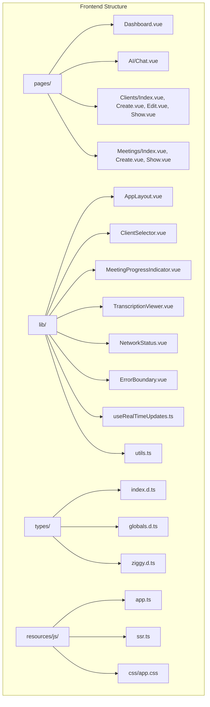
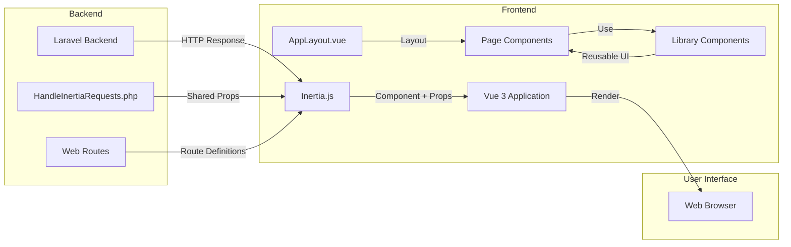

# Frontend Architecture


## Table of Contents
1. [Introduction](#introduction)
2. [Project Structure](#project-structure)
3. [Core Components](#core-components)
4. [Architecture Overview](#architecture-overview)
5. [Detailed Component Analysis](#detailed-component-analysis)
6. [Dependency Analysis](#dependency-analysis)
7. [Performance Considerations](#performance-considerations)
8. [Troubleshooting Guide](#troubleshooting-guide)
9. [Conclusion](#conclusion)

## Introduction
This document provides comprehensive architectural documentation for the Vue.js frontend of the meetingai application. The frontend is built using Vue 3 with TypeScript and follows a component-based architecture. It integrates with a Laravel backend through Inertia.js, enabling seamless page transitions without full reloads. The application is organized into reusable library components and page-specific components, with a focus on maintainability and scalability. Key features include real-time meeting status updates, transcription viewing, client management, and AI-powered meeting analysis.

## Project Structure
The frontend codebase is organized in a feature-based structure within the `resources/js` directory. The application is divided into three main sections: pages, reusable components (lib), and types. The `pages` directory contains top-level route components that correspond to different views in the application. The `lib` directory contains reusable UI components and utility functions that can be shared across multiple pages. The `types` directory defines TypeScript interfaces used throughout the application.





**Diagram sources**
- [AppLayout.vue](file://resources/js/lib/AppLayout.vue)
- [ClientSelector.vue](file://resources/js/lib/ClientSelector.vue)
- [MeetingProgressIndicator.vue](file://resources/js/lib/MeetingProgressIndicator.vue)
- [TranscriptionViewer.vue](file://resources/js/lib/TranscriptionViewer.vue)
- [useRealTimeUpdates.ts](file://resources/js/lib/useRealTimeUpdates.ts)
- [app.ts](file://resources/js/app.ts)

**Section sources**
- [AppLayout.vue](file://resources/js/lib/AppLayout.vue)
- [ClientSelector.vue](file://resources/js/lib/ClientSelector.vue)
- [MeetingProgressIndicator.vue](file://resources/js/lib/MeetingProgressIndicator.vue)
- [TranscriptionViewer.vue](file://resources/js/lib/TranscriptionViewer.vue)
- [useRealTimeUpdates.ts](file://resources/js/lib/useRealTimeUpdates.ts)
- [app.ts](file://resources/js/app.ts)

## Core Components
The meetingai frontend consists of several core components that provide the foundation for the application's user interface and functionality. These components are organized into reusable library components and page-specific components. The library components are designed to be shared across multiple pages, promoting consistency and reducing code duplication. The page components represent the main views of the application and are responsible for orchestrating the various library components to create a cohesive user experience.

**Section sources**
- [AppLayout.vue](file://resources/js/lib/AppLayout.vue)
- [ClientSelector.vue](file://resources/js/lib/ClientSelector.vue)
- [MeetingProgressIndicator.vue](file://resources/js/lib/MeetingProgressIndicator.vue)
- [TranscriptionViewer.vue](file://resources/js/lib/TranscriptionViewer.vue)

## Architecture Overview
The frontend architecture of the meetingai application is built on Vue 3 with TypeScript and leverages Inertia.js for seamless integration with the Laravel backend. The application follows a component-based architecture, where functionality is encapsulated in reusable components. Inertia.js acts as a bridge between the Laravel backend and Vue frontend, allowing server-side responses to be transformed into client-side component rendering without full page reloads.





**Diagram sources**
- [app.ts](file://resources/js/app.ts)
- [HandleInertiaRequests.php](file://app/Http/Middleware/HandleInertiaRequests.php)
- [app.blade.php](file://resources/views/app.blade.php)

## Detailed Component Analysis

### AppLayout.vue Analysis
The AppLayout.vue component serves as the main application layout, providing a consistent structure across all pages in the application. It includes the navigation bar, flash message display, and main content area. The layout also incorporates global components such as Toast and NetworkStatus, which are available throughout the application.


```mermaid
classDiagram
class AppLayout {
+mobileMenuOpen : boolean
+toastComponent : ref
+clearFlashMessage(type : 'success'|'error') : void
}
AppLayout --> ErrorBoundary : "wraps"
AppLayout --> Toast : "global"
AppLayout --> NetworkStatus : "global"
AppLayout --> Link : "@inertiajs/vue3"
AppLayout --> router : "@inertiajs/vue3"
note right of AppLayout
Main application layout component
Provides consistent UI across all pages
Handles navigation and global UI elements
end
```


**Diagram sources**
- [AppLayout.vue](file://resources/js/lib/AppLayout.vue#L0-L233)

**Section sources**
- [AppLayout.vue](file://resources/js/lib/AppLayout.vue#L0-L233)
- [Dashboard.vue](file://resources/js/pages/Dashboard.vue#L121-L194)

### ClientSelector.vue Analysis
The ClientSelector.vue component is a reusable form element that allows users to select a client from a dropdown list. It accepts a list of clients as a prop and emits updates when the selection changes. The component includes validation states and error messaging, making it suitable for use in forms.


```mermaid
classDiagram
class ClientSelector {
+id : string
+label : string
+placeholder : string
+modelValue : string|number|null
+clients : Client[]
+required : boolean
+errorMessage : string
+helpText : string
+hasError : boolean
}
ClientSelector --> Client : "uses"
note right of ClientSelector
Reusable client selection component
Supports validation and error states
Emits update : modelValue events
end
```


**Diagram sources**
- [ClientSelector.vue](file://resources/js/lib/ClientSelector.vue#L0-L62)
- [index.d.ts](file://resources/js/types/index.d.ts#L0-L54)

**Section sources**
- [ClientSelector.vue](file://resources/js/lib/ClientSelector.vue#L0-L62)
- [index.d.ts](file://resources/js/types/index.d.ts#L0-L54)

### MeetingProgressIndicator.vue Analysis
The MeetingProgressIndicator.vue component visually represents the processing status of a meeting. It displays different progress indicators based on the meeting's status (pending, processing, completed, or failed). The component shows progress bars, time estimates, and status messages to keep users informed about the meeting processing state.


```mermaid
classDiagram
class MeetingProgressIndicator {
+meeting : Meeting
}
class Meeting {
+id : number
+status : 'pending'|'processing'|'completed'|'failed'
+elapsed_time : number|null
+estimated_remaining_time : number|null
+processing_progress : number|null
+formatted_elapsed_time : string|null
+formatted_estimated_remaining_time : string|null
+queue_progress : number|null
+formatted_estimated_processing_time : string|null
}
MeetingProgressIndicator --> Meeting : "displays"
note right of MeetingProgressIndicator
Visual progress indicator for meeting processing
Shows different states : pending, processing, completed, failed
Displays progress bars and time estimates
end
```


**Diagram sources**
- [MeetingProgressIndicator.vue](file://resources/js/lib/MeetingProgressIndicator.vue#L0-L100)
- [index.d.ts](file://resources/js/types/index.d.ts#L0-L54)

**Section sources**
- [MeetingProgressIndicator.vue](file://resources/js/lib/MeetingProgressIndicator.vue#L0-L100)
- [index.d.ts](file://resources/js/types/index.d.ts#L0-L54)

### TranscriptionViewer.vue Analysis
The TranscriptionViewer.vue component displays the transcription of a meeting, allowing users to search through the text and navigate to specific time points. It includes search functionality, speaker identification, and timestamp navigation. The component highlights search results and automatically scrolls to the current playback position.


```mermaid
classDiagram
class TranscriptionViewer {
+transcriptions : Transcription[]
+currentTime : number
+searchQuery : string
+filteredTranscriptions : ComputedRef
+currentSegment : ComputedRef
+currentSegmentIndex : Ref
+transcriptionContainer : Ref
+transcriptionRefs : Ref
+isCurrentSegment(transcription) : boolean
+isSearchHighlighted(transcription) : boolean
+hasPrevious : ComputedRef
+hasNext : ComputedRef
+setTranscriptionRef(id, el) : void
+onTimestampClick(time) : void
+scrollToCurrentSegment() : Promise
+scrollToPrevious() : void
+scrollToNext() : void
+formatTime(seconds) : string
+formatDuration(seconds) : string
+highlightSearchTerm(text) : string
}
class Transcription {
+id : number
+speaker : string
+text : string
+start_time : number
+end_time : number
+confidence : number
}
TranscriptionViewer --> Transcription : "displays"
TranscriptionViewer --> "Emits" : "timestampClick"
note right of TranscriptionViewer
Comprehensive transcription display component
Supports search, navigation, and highlighting
Integrates with video playback via timestamp events
end
```


**Diagram sources**
- [TranscriptionViewer.vue](file://resources/js/lib/TranscriptionViewer.vue#L0-L245)
- [index.d.ts](file://resources/js/types/index.d.ts#L0-L54)

**Section sources**
- [TranscriptionViewer.vue](file://resources/js/lib/TranscriptionViewer.vue#L0-L245)
- [index.d.ts](file://resources/js/types/index.d.ts#L0-L54)

### useRealTimeUpdates.ts Analysis
The useRealTimeUpdates.ts composable provides real-time updates for meeting statuses by periodically polling the backend API. It automatically updates the meeting data when the status changes, ensuring the UI reflects the current state without requiring a full page refresh. The composable handles active meetings (pending or processing) and stops polling when all meetings are completed.


```mermaid
sequenceDiagram
participant Component as "Page Component"
participant Composable as "useRealTimeUpdates"
participant API as "Backend API"
Component->>Composable : useRealTimeUpdates(meetings)
Composable->>Composable : startUpdates()
Composable->>Composable : updateMeetingStatuses()
loop Every 2 seconds
Composable->>API : GET /meetings/{id}/status
API-->>Composable : Updated meeting data
Composable->>Composable : Update local meeting state
Composable->>Component : Update reactive reference
end
Component->>Composable : Component unmounted
Composable->>Composable : stopUpdates()
Composable->>Composable : Clear interval
note right of Composable
Real-time status updates via polling
Updates only active meetings
Automatically starts/stops based on lifecycle
end
```


**Diagram sources**
- [useRealTimeUpdates.ts](file://resources/js/lib/useRealTimeUpdates.ts#L0-L87)

**Section sources**
- [useRealTimeUpdates.ts](file://resources/js/lib/useRealTimeUpdates.ts#L0-L87)
- [Meetings/Index.vue](file://resources/js/pages/Meetings/Index.vue#L247-L301)

## Dependency Analysis
The frontend components have a clear dependency hierarchy, with reusable library components being used by page components. The Inertia.js integration creates a dependency between the Laravel backend and Vue frontend, with shared data passed through props. The component dependencies form a directed acyclic graph, with no circular dependencies present.


```mermaid
graph TD
AppLayout --> ErrorBoundary
AppLayout --> Toast
AppLayout --> NetworkStatus
AppLayout --> Link
ClientSelector --> Client
MeetingProgressIndicator --> Meeting
TranscriptionViewer --> Transcription
useRealTimeUpdates --> axios
app.ts --> Inertia
app.ts --> ZiggyVue
app.ts --> errorHandler
Pages --> AppLayout
Pages --> ClientSelector
Pages --> MeetingProgressIndicator
Pages --> TranscriptionViewer
Pages --> useRealTimeUpdates
HandleInertiaRequests --> Inertia
HandleInertiaRequests --> Ziggy
app.blade.php --> app.ts
app.blade.php --> page component
style AppLayout fill:#f9f,stroke:#333
style Pages fill:#bbf,stroke:#333
style Lib fill:#f96,stroke:#333
```


**Diagram sources**
- [package.json](file://package.json)
- [app.ts](file://resources/js/app.ts)
- [HandleInertiaRequests.php](file://app/Http/Middleware/HandleInertiaRequests.php)

**Section sources**
- [package.json](file://package.json)
- [app.ts](file://resources/js/app.ts)
- [HandleInertiaRequests.php](file://app/Http/Middleware/HandleInertiaRequests.php)

## Performance Considerations
The application implements several performance optimizations to ensure a smooth user experience. These include lazy loading of page components through Vite's dynamic imports, efficient state management using Vue's reactivity system, and targeted re-renders through component scoping. The real-time updates are optimized to only poll active meetings, reducing unnecessary network requests.

The use of shallowRef in the useRealTimeUpdates composable minimizes reactivity overhead when dealing with large arrays of meeting data. The TranscriptionViewer component implements virtual scrolling through the use of overflow-y-auto on a container, preventing performance issues with long transcriptions. The application also leverages Inertia.js's asset versioning and progress indicators to provide feedback during navigation.

For network efficiency, the application uses Axios for HTTP requests with built-in caching and error handling. The real-time updates are throttled to every 2 seconds, balancing responsiveness with server load. The component-based architecture allows for code splitting, where only the necessary components are loaded for each page view.

**Section sources**
- [useRealTimeUpdates.ts](file://resources/js/lib/useRealTimeUpdates.ts#L0-L87)
- [TranscriptionViewer.vue](file://resources/js/lib/TranscriptionViewer.vue#L0-L245)
- [app.ts](file://resources/js/app.ts#L0-L43)

## Troubleshooting Guide
When encountering issues with the frontend application, consider the following common problems and solutions:

1. **Page not updating after navigation**: Ensure that Inertia.js is properly configured in both the frontend and backend. Verify that the HandleInertiaRequests middleware is registered and that the root view is set to 'app'.

2. **Real-time updates not working**: Check that the useRealTimeUpdates composable is properly imported and used in the component. Verify that the backend API endpoint `/meetings/{id}/status` is accessible and returns the expected data format.

3. **TypeScript errors**: Ensure that the type definitions in index.d.ts match the actual data structure returned by the backend. Update the interfaces if the API response format has changed.

4. **Network status not updating**: Verify that the NetworkStatus component is properly registered as a global component in AppLayout.vue. Check that the browser has the necessary permissions to detect online/offline status.

5. **Inertia visits not working**: Confirm that the route names used in router.visit() or Link components match the routes defined in web.php. Use the Ziggy helper to generate correct URLs.

6. **Component props not receiving data**: Check that the backend controller is properly passing data to the Inertia response using the ->with() method or by including it in the response array.

7. **CSS not applying**: Ensure that app.css is properly imported in app.ts and that Vite is correctly processing the CSS files.

**Section sources**
- [app.ts](file://resources/js/app.ts#L0-L43)
- [HandleInertiaRequests.php](file://app/Http/Middleware/HandleInertiaRequests.php#L0-L67)
- [app.blade.php](file://resources/views/app.blade.php#L0-L23)
- [index.d.ts](file://resources/js/types/index.d.ts#L0-L54)

## Conclusion
The frontend architecture of the meetingai application demonstrates a well-structured Vue 3 application with TypeScript that effectively integrates with a Laravel backend through Inertia.js. The component-based design promotes reusability and maintainability, while the use of TypeScript ensures type safety throughout the codebase. The real-time updates system provides a responsive user experience without requiring full page reloads.

The application follows modern web development practices, including proper state management, error handling, and performance optimization. The clear separation of concerns between reusable components and page-specific components makes the codebase easy to navigate and extend. The integration with Laravel through Inertia.js provides a seamless experience that combines the benefits of server-side rendering with the interactivity of a single-page application.

Future improvements could include implementing WebSockets for real-time updates instead of polling, adding more comprehensive unit and integration tests, and enhancing accessibility features throughout the application. The current architecture provides a solid foundation for these enhancements while maintaining code quality and developer productivity.

**Referenced Files in This Document**   
- [AppLayout.vue](file://resources/js/lib/AppLayout.vue)
- [ClientSelector.vue](file://resources/js/lib/ClientSelector.vue)
- [MeetingProgressIndicator.vue](file://resources/js/lib/MeetingProgressIndicator.vue)
- [TranscriptionViewer.vue](file://resources/js/lib/TranscriptionViewer.vue)
- [useRealTimeUpdates.ts](file://resources/js/lib/useRealTimeUpdates.ts)
- [app.ts](file://resources/js/app.ts)
- [HandleInertiaRequests.php](file://app/Http/Middleware/HandleInertiaRequests.php)
- [app.blade.php](file://resources/views/app.blade.php)
- [index.d.ts](file://resources/js/types/index.d.ts)
- [NetworkStatus.vue](file://resources/js/lib/NetworkStatus.vue)
- [ErrorBoundary.vue](file://resources/js/lib/ErrorBoundary.vue)