# Component Library


## Table of Contents
1. [Introduction](#introduction)
2. [Core Components Overview](#core-components-overview)
3. [Detailed Component Analysis](#detailed-component-analysis)
   - [AppLayout.vue](#applayoutvue)
   - [ClientSelector.vue](#clientselectorvue)
   - [MeetingProgressIndicator.vue](#meetingprogressindicatorvue)
   - [MeetingStatusBadge.vue](#meetingstatusbadgevue)
   - [TranscriptionViewer.vue](#transcriptionviewervue)
   - [VideoPlayer.vue](#videoplayervue)
   - [LoadingSpinner.vue](#loadingspinnervue)
   - [Toast.vue](#toastvue)
   - [ErrorBoundary.vue](#errorboundaryvue)
   - [NetworkStatus.vue](#networkstatusvue)
4. [Component Integration Examples](#component-integration-examples)
5. [Architecture and Design Patterns](#architecture-and-design-patterns)
6. [TypeScript Interfaces](#typescript-interfaces)
7. [Styling and Accessibility](#styling-and-accessibility)
8. [Conclusion](#conclusion)

## Introduction
The Component Library document provides a comprehensive overview of the reusable Vue.js UI components in the MeetingAI application. These components form the foundation of the frontend architecture, promoting consistency, reusability, and maintainability across the application. The library includes layout components, status indicators, interactive controls, and utility components that work together to create a cohesive user experience. This documentation details each component's purpose, implementation, props, events, and usage patterns, with examples from parent pages to illustrate real-world integration.

## Core Components Overview
The reusable UI component library consists of ten core components that serve distinct purposes in the application:

- **AppLayout.vue**: Provides consistent page structure with navigation and flash messaging
- **ClientSelector.vue**: Enables client context switching across the application
- **MeetingProgressIndicator.vue**: Visualizes processing status with progress bars and timing information
- **MeetingStatusBadge.vue**: Displays status labels with contextual icons and retry functionality
- **TranscriptionViewer.vue**: Renders synchronized transcripts with search and playback integration
- **VideoPlayer.vue**: Handles video rendering with Inertia integration and error handling
- **LoadingSpinner.vue**: Provides visual feedback for asynchronous operations
- **Toast.vue**: Manages user notifications with different severity levels
- **ErrorBoundary.vue**: Implements graceful error handling at the component level
- **NetworkStatus.vue**: Monitors connectivity and displays connection status

These components work together to create a robust, user-friendly interface for managing and viewing meeting content.

## Detailed Component Analysis

### AppLayout.vue
The AppLayout component provides a consistent page structure across the application with navigation, flash messaging, and error boundary protection.

**Props**
- No props defined

**Slots**
- Default slot for page content

**Internal Logic**
- Implements responsive navigation with mobile menu toggle
- Displays flash messages (success/error) from Inertia state
- Uses ErrorBoundary to wrap content for error isolation
- Manages navigation state highlighting based on current route

**Accessibility Features**
- Semantic HTML structure with proper heading hierarchy
- Keyboard navigation support for menu
- ARIA labels for interactive elements
- High contrast colors for text and background


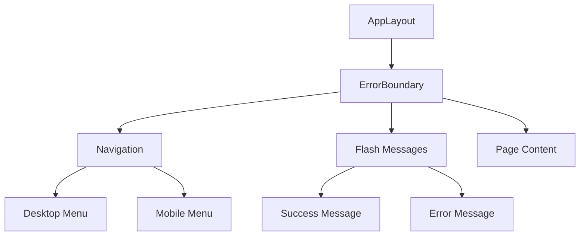


**Diagram sources**
- [AppLayout.vue](file://resources/js/lib/AppLayout.vue#L1-L234)

**Section sources**
- [AppLayout.vue](file://resources/js/lib/AppLayout.vue#L1-L234)
- [Meetings/Show.vue](file://resources/js/pages/Meetings/Show.vue#L1-L344)
- [AI/Chat.vue](file://resources/js/pages/AI/Chat.vue#L1-L307)

### ClientSelector.vue
The ClientSelector component provides a dropdown for client context switching with validation and error display.

**Props**
- `id`: string (default: "client-selector")
- `label`: string (default: "Client")
- `placeholder`: string (default: "Select a client...")
- `modelValue`: string | number | null (required)
- `clients`: Client[] (required)
- `required`: boolean (default: false)
- `errorMessage`: string
- `helpText`: string

**Events**
- `update:modelValue`: Emitted when selection changes

**Internal Logic**
- Uses computed property `hasError` to determine if error styling should be applied
- Binds value to modelValue prop with update event
- Displays error message or help text below the select element
- Formats client display text with company name in parentheses when available

**Accessibility Features**
- Proper label association with for/id attributes
- Required field indication with asterisk
- Descriptive error messages
- Keyboard navigation support for dropdown


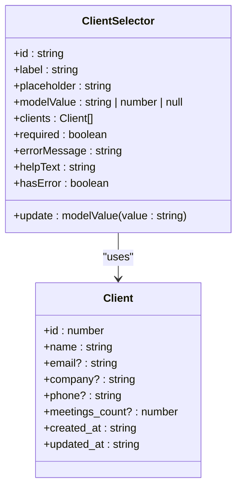


**Diagram sources**
- [ClientSelector.vue](file://resources/js/lib/ClientSelector.vue#L1-L63)
- [index.ts](file://resources/js/types/index.ts#L1-L57)

**Section sources**
- [ClientSelector.vue](file://resources/js/lib/ClientSelector.vue#L1-L63)

### MeetingProgressIndicator.vue
The MeetingProgressIndicator component visualizes the processing status of meetings with progress bars and timing information.

**Props**
- `meeting`: Meeting (required) - Contains status and progress information

**Visual States**
- **Processing**: Blue progress bar showing processing progress percentage
- **Pending**: Yellow progress bar showing queue progress percentage
- **Completed**: Green checkmark with processing duration
- **Failed**: Red warning icon with error message

**Internal Logic**
- Conditionally renders different progress indicators based on meeting status
- Displays progress percentage and formatted time information
- Shows elapsed time, remaining time, and estimated processing time
- Uses CSS transitions for smooth progress bar animations

**Accessibility Features**
- Text-based progress information for screen readers
- Color-coded status with corresponding icons
- Clear labeling of time information
- Responsive design for different screen sizes


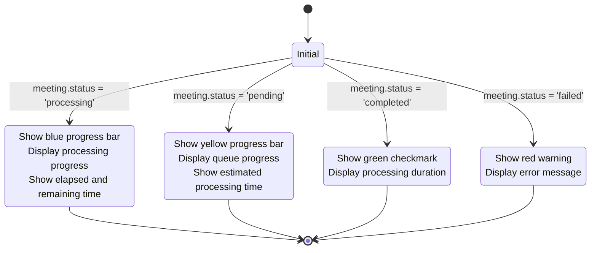


**Diagram sources**
- [MeetingProgressIndicator.vue](file://resources/js/lib/MeetingProgressIndicator.vue#L1-L101)

**Section sources**
- [MeetingProgressIndicator.vue](file://resources/js/lib/MeetingProgressIndicator.vue#L1-L101)

### MeetingStatusBadge.vue
The MeetingStatusBadge component displays status labels with contextual icons, error details, and retry functionality.

**Props**
- `meeting`: Meeting | null
- `showProgress`: boolean (default: true)
- `canRetry`: boolean (default: true)
- `isRetrying`: boolean (default: false)

**Events**
- `retry`: Emitted when retry button is clicked

**Internal Logic**
- Computes status classes and icons based on meeting status
- Shows loading spinner when meeting is not available
- Displays error details modal when status is failed and error message exists
- Implements retry functionality with loading state
- Shows technical error details in a collapsible section

**Accessibility Features**
- Icon and text combination for status indication
- Descriptive titles for action buttons
- Keyboard navigation support for buttons
- Screen reader-friendly error details


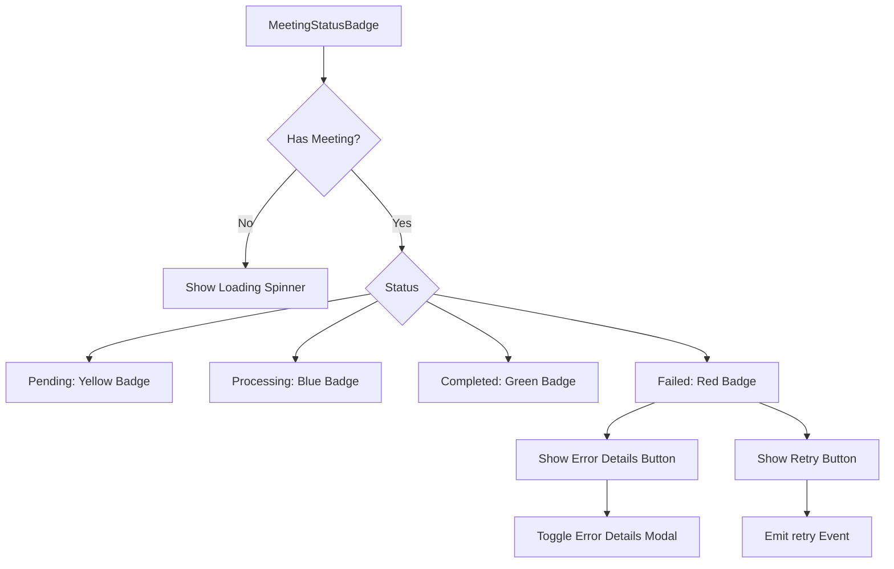


**Diagram sources**
- [MeetingStatusBadge.vue](file://resources/js/lib/MeetingStatusBadge.vue#L1-L284)

**Section sources**
- [MeetingStatusBadge.vue](file://resources/js/lib/MeetingStatusBadge.vue#L1-L284)

### TranscriptionViewer.vue
The TranscriptionViewer component renders synchronized transcripts with search functionality and playback integration.

**Props**
- `transcriptions`: Transcription[] (required)
- `currentTime`: number (required)

**Events**
- `timestampClick`: Emitted when a timestamp is clicked

**Internal Logic**
- Implements search functionality with real-time filtering
- Highlights current segment based on video playback time
- Scrolls to current segment when time updates
- Supports navigation between segments with previous/next buttons
- Formats time display in HH:MM:SS or MM:SS format
- Highlights search terms in transcription text

**Accessibility Features**
- Keyboard navigation support
- Screen reader-friendly transcript structure
- Clear visual indication of current segment
- Search functionality with accessible input


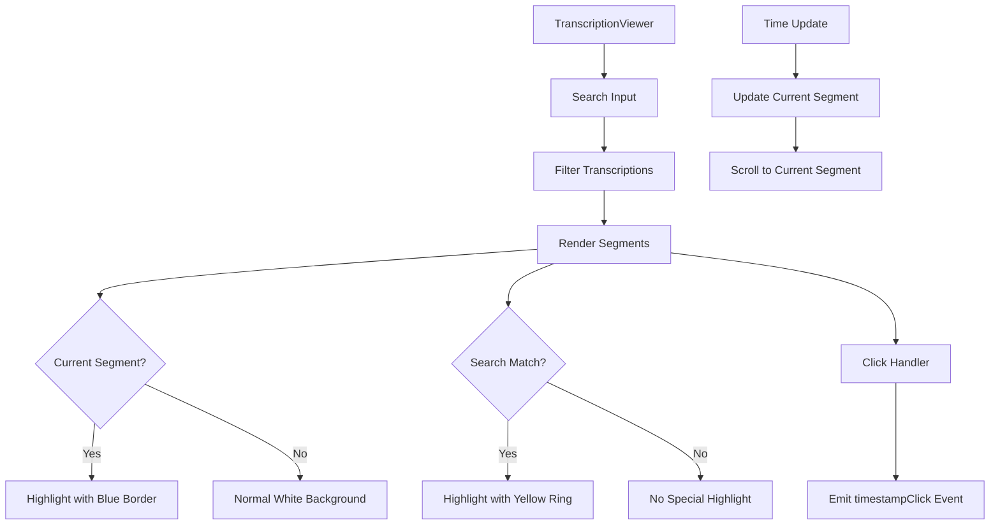


**Diagram sources**
- [TranscriptionViewer.vue](file://resources/js/lib/TranscriptionViewer.vue#L1-L246)

**Section sources**
- [TranscriptionViewer.vue](file://resources/js/lib/TranscriptionViewer.vue#L1-L246)

### VideoPlayer.vue
The VideoPlayer component handles video rendering with Inertia integration and comprehensive error handling.

**Props**
- `videoUrl`: string (required)
- `currentTime`: number (default: 0)

**Events**
- `timeUpdate`: Emitted when video time changes
- `durationChange`: Emitted when video duration is known
- `play`: Emitted when video starts playing
- `pause`: Emitted when video is paused
- `ended`: Emitted when video ends
- `error`: Emitted when video loading fails

**Internal Logic**
- Synchronizes video currentTime with external time changes
- Displays loading overlay during video loading
- Shows error overlay with retry functionality when video fails to load
- Formats time display for current and total duration
- Handles various video error types with appropriate user messages
- Integrates with toast notifications for error reporting

**Accessibility Features**
- Native video player controls
- Keyboard navigation support
- Error messages with actionable retry button
- Clear display of playback status


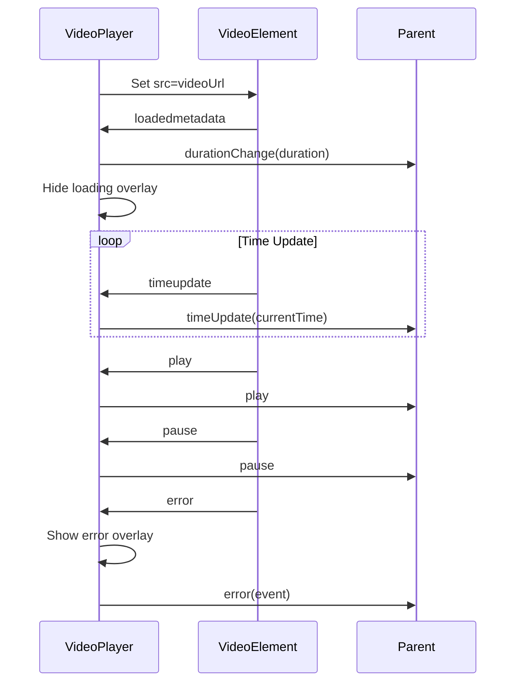


**Diagram sources**
- [VideoPlayer.vue](file://resources/js/lib/VideoPlayer.vue#L1-L248)

**Section sources**
- [VideoPlayer.vue](file://resources/js/lib/VideoPlayer.vue#L1-L248)

### LoadingSpinner.vue
The LoadingSpinner component provides visual feedback for asynchronous operations with customizable appearance.

**Props**
- `size`: 'sm' | 'md' | 'lg' | 'xl' (default: 'md')
- `color`: string (default: '#3B82F6')
- `text`: string
- `subtext`: string
- `overlay`: boolean (default: false)
- `fullscreen`: boolean (default: false)
- `showDot`: boolean (default: false)

**Internal Logic**
- Computes CSS classes based on props for responsive styling
- Supports different sizes with corresponding spinner, dot, and text sizes
- Implements overlay and fullscreen modes for different use cases
- Shows optional inner dot for enhanced visual appeal
- Displays optional text and subtext below the spinner

**Accessibility Features**
- Screen reader announcement of loading state
- Sufficient size for visibility
- High contrast between spinner and background
- Clear indication of loading purpose with text


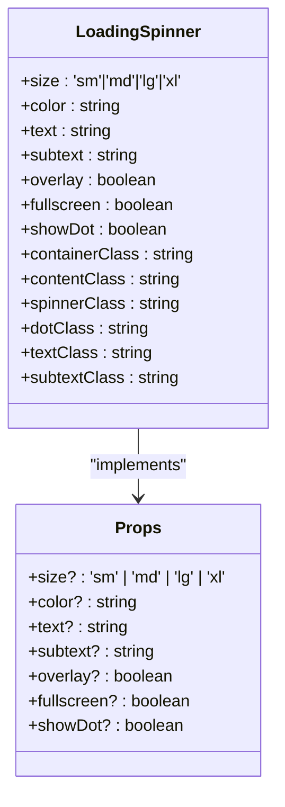


**Diagram sources**
- [LoadingSpinner.vue](file://resources/js/lib/LoadingSpinner.vue#L1-L109)

**Section sources**
- [LoadingSpinner.vue](file://resources/js/lib/LoadingSpinner.vue#L1-L109)

### Toast.vue
The Toast component manages user notifications with different severity levels and action buttons.

**Props**
- None (manages internal state)

**Events**
- None (exposes methods for external use)

**Internal Logic**
- Maintains a queue of toast notifications
- Supports different types: success, error, warning, info
- Implements auto-dismissal with configurable duration
- Supports action buttons with primary/non-primary styling
- Uses teleport to render at body level for proper z-index
- Implements smooth transitions for entrance and exit

**Global Methods**
- `showSuccess(title, message, options)`
- `showError(title, message, options)`
- `showWarning(title, message, options)`
- `showInfo(title, message, options)`
- `clearAll()`

**Accessibility Features**
- Screen reader announcements for new toasts
- Keyboard navigation support for action buttons
- Sufficient color contrast for readability
- Clear visual distinction between toast types


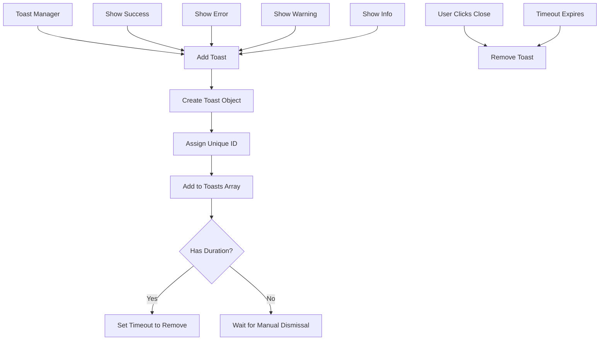


**Diagram sources**
- [Toast.vue](file://resources/js/lib/Toast.vue#L1-L252)

**Section sources**
- [Toast.vue](file://resources/js/lib/Toast.vue#L1-L252)

### ErrorBoundary.vue
The ErrorBoundary component implements graceful error handling at the component level.

**Props**
- None

**Events**
- None

**Internal Logic**
- Uses Vue's onErrorCaptured hook to catch errors from child components
- Displays user-friendly error message with retry and navigation options
- Shows technical details in a collapsible section
- Implements retry functionality by reloading the page
- Provides navigation to home/dashboard

**Accessibility Features**
- Clear error message with actionable steps
- Keyboard navigation support for buttons
- Screen reader-friendly error presentation
- High contrast colors for visibility


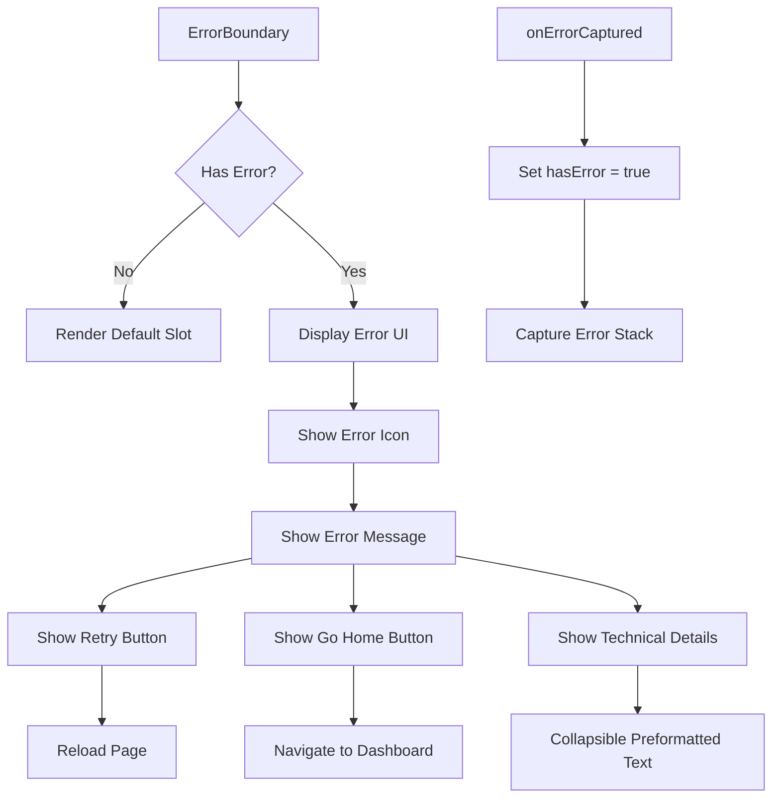


**Diagram sources**
- [ErrorBoundary.vue](file://resources/js/lib/ErrorBoundary.vue#L1-L67)

**Section sources**
- [ErrorBoundary.vue](file://resources/js/lib/ErrorBoundary.vue#L1-L67)

### NetworkStatus.vue
The NetworkStatus component monitors connectivity and displays connection status.

**Props**
- None

**Events**
- None

**Internal Logic**
- Uses browser's online/offline events to track connectivity
- Displays offline banner when connection is lost
- Shows reconnected banner when connection is restored
- Automatically hides reconnected banner after 3 seconds
- Exposes isOnline state for other components to use

**Accessibility Features**
- Clear visual indication of connection status
- Screen reader announcements for status changes
- Sufficient color contrast for visibility
- Persistent display until connection is restored


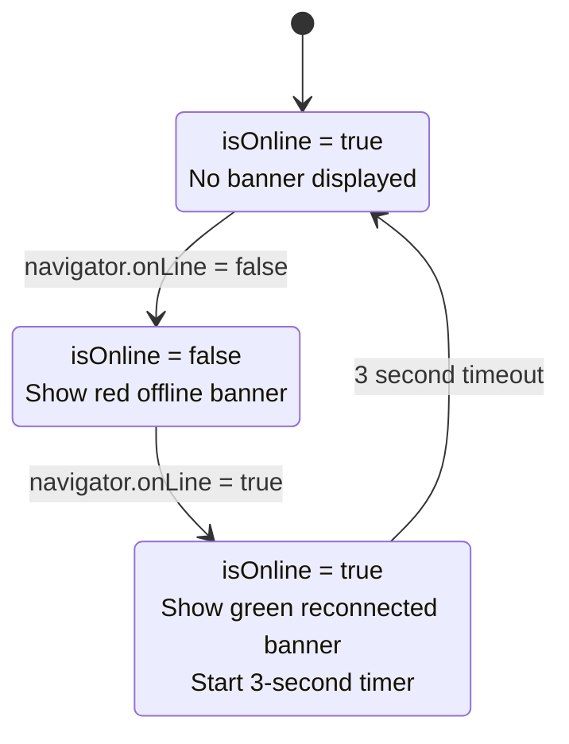


**Diagram sources**
- [NetworkStatus.vue](file://resources/js/lib/NetworkStatus.vue#L1-L99)

**Section sources**
- [NetworkStatus.vue](file://resources/js/lib/NetworkStatus.vue#L1-L99)

## Component Integration Examples

### Meetings/Show.vue Integration
The Meetings/Show.vue page demonstrates the integration of multiple components in a real-world scenario:

- **AppLayout**: Wraps the entire page for consistent structure
- **MeetingStatusBadge**: Displays meeting status with retry functionality
- **VideoPlayer**: Renders the meeting video with playback controls
- **TranscriptionViewer**: Shows synchronized transcripts with search
- **MeetingProgressIndicator**: Visualizes processing status for pending/processing meetings

The page implements bidirectional synchronization between the video player and transcription viewer, allowing users to click on transcript segments to jump to specific moments in the video and automatically scrolling to the current segment as the video plays.


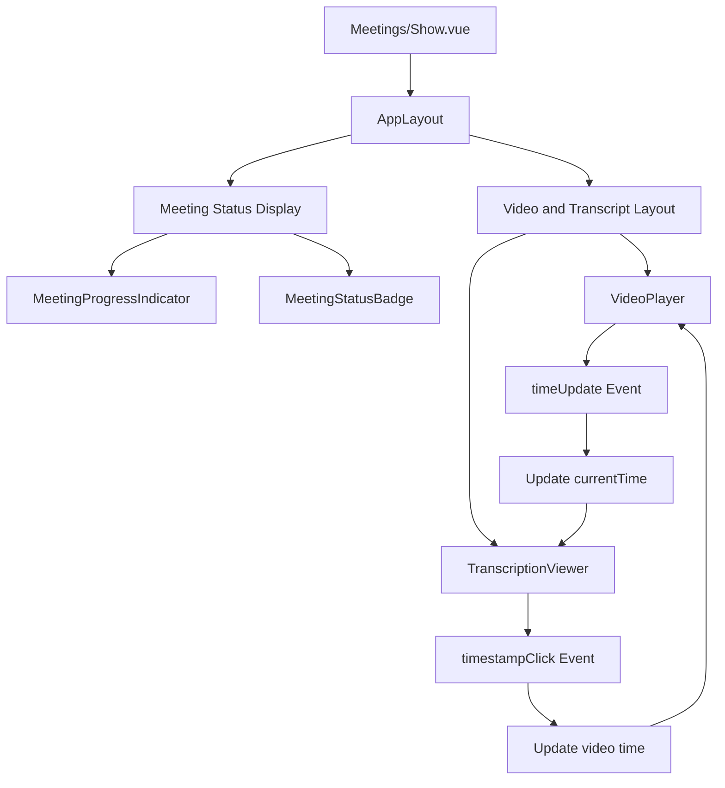


**Diagram sources**
- [Meetings/Show.vue](file://resources/js/pages/Meetings/Show.vue#L1-L344)

**Section sources**
- [Meetings/Show.vue](file://resources/js/pages/Meetings/Show.vue#L1-L344)

### AI/Chat.vue Integration
The AI/Chat.vue page demonstrates a different integration pattern:

- **AppLayout**: Provides consistent page structure
- **Toast**: Used internally for error handling in the chat functionality
- **NetworkStatus**: Monitors connectivity for API requests

The page implements an AI chat interface that searches through meeting transcriptions, with the Toast component used to display error messages when network requests fail or rate limits are exceeded.


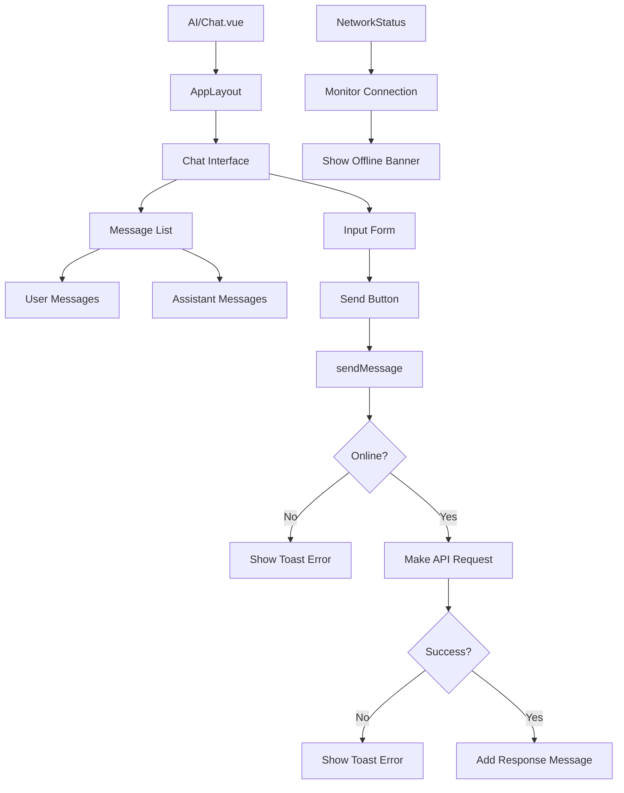


**Diagram sources**
- [AI/Chat.vue](file://resources/js/pages/AI/Chat.vue#L1-L307)

**Section sources**
- [AI/Chat.vue](file://resources/js/pages/AI/Chat.vue#L1-L307)

## Architecture and Design Patterns
The component library follows several key architectural patterns:

### Composition API Pattern
All components use Vue 3's Composition API with `<script setup>` syntax, providing a more concise and type-safe approach to component development. This pattern allows for better code organization and reusability of logic through custom composables.

### Type Safety with TypeScript
The library leverages TypeScript interfaces to ensure type safety across components. Key interfaces like Meeting and Transcription are defined in a central types file and imported where needed, ensuring consistency and enabling better IDE support.

### Event-Driven Architecture
Components communicate through a clear event-driven pattern, emitting events for user interactions and state changes while receiving props for configuration and data. This unidirectional data flow makes the application more predictable and easier to debug.

### Reusability and Single Responsibility
Each component follows the single responsibility principle, focusing on one specific UI concern. This makes components highly reusable across different parts of the application while remaining focused and maintainable.

### Accessibility-First Design
The components are designed with accessibility in mind, following WCAG guidelines with proper semantic HTML, keyboard navigation support, and screen reader compatibility.

## TypeScript Interfaces
The component library relies on several TypeScript interfaces defined in `resources/js/types/index.ts`:

**Client Interface**

```typescript
export interface Client {
  id: number
  name: string
  email?: string
  company?: string
  phone?: string
  meetings_count?: number
  created_at: string
  updated_at: string
}
```


**Meeting Interface**

```typescript
export interface Meeting {
  id: number
  title: string
  client_id: number
  client: Client
  status: 'pending' | 'processing' | 'completed' | 'failed'
  video_path: string
  duration: number | null
  uploaded_at: string
  processing_started_at: string | null
  processing_completed_at: string | null
  created_at: string
  updated_at: string
  transcriptions?: Transcription[]
}
```


**Transcription Interface**

```typescript
export interface Transcription {
  id: number
  meeting_id: number
  speaker: string
  text: string
  start_time: number
  end_time: number
  confidence: number
  created_at: string
  updated_at: string
  meeting?: Meeting
}
```


These interfaces ensure type consistency across components and provide clear documentation of the data structure expected by each component.

## Styling and Accessibility
The component library uses Tailwind CSS for styling, following a utility-first approach that promotes consistency and maintainability. Key styling principles include:

- **Consistent Spacing**: Using Tailwind's spacing scale (px-4, py-2, etc.) for uniform spacing
- **Color Palette**: Leveraging a consistent color scheme with gray, blue, green, yellow, and red variants
- **Responsive Design**: Implementing mobile-first responsive layouts
- **Hover States**: Providing visual feedback for interactive elements
- **Focus States**: Ensuring keyboard accessibility with visible focus indicators

Accessibility considerations include:
- Semantic HTML structure with proper heading hierarchy
- ARIA attributes for interactive elements
- Sufficient color contrast for text and background
- Keyboard navigation support for all interactive components
- Screen reader-friendly error messages and status updates
- Proper form labeling and input associations

## Conclusion
The reusable UI component library in the MeetingAI application demonstrates a well-structured, maintainable approach to frontend development. By creating focused, reusable components with clear APIs and consistent styling, the library promotes code reuse, reduces duplication, and ensures a cohesive user experience across the application. The integration of TypeScript provides type safety and better developer experience, while the use of modern Vue 3 features like the Composition API and Teleport enables more flexible and powerful component patterns. The components work together seamlessly, as demonstrated in the Meetings/Show.vue and AI/Chat.vue pages, creating a robust foundation for the application's user interface.

**Referenced Files in This Document**   
- [AppLayout.vue](file://resources/js/lib/AppLayout.vue)
- [ClientSelector.vue](file://resources/js/lib/ClientSelector.vue)
- [MeetingProgressIndicator.vue](file://resources/js/lib/MeetingProgressIndicator.vue)
- [MeetingStatusBadge.vue](file://resources/js/lib/MeetingStatusBadge.vue)
- [TranscriptionViewer.vue](file://resources/js/lib/TranscriptionViewer.vue)
- [VideoPlayer.vue](file://resources/js/lib/VideoPlayer.vue)
- [LoadingSpinner.vue](file://resources/js/lib/LoadingSpinner.vue)
- [Toast.vue](file://resources/js/lib/Toast.vue)
- [ErrorBoundary.vue](file://resources/js/lib/ErrorBoundary.vue)
- [NetworkStatus.vue](file://resources/js/lib/NetworkStatus.vue)
- [Meetings/Show.vue](file://resources/js/pages/Meetings/Show.vue)
- [AI/Chat.vue](file://resources/js/pages/AI/Chat.vue)
- [index.ts](file://resources/js/types/index.ts)