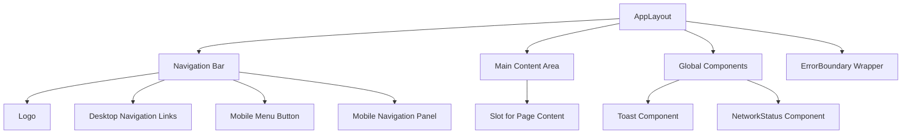
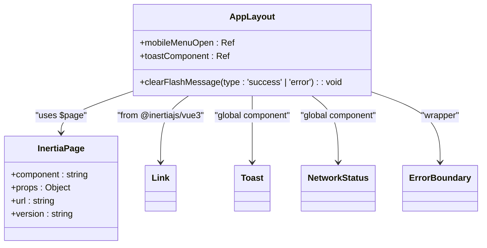
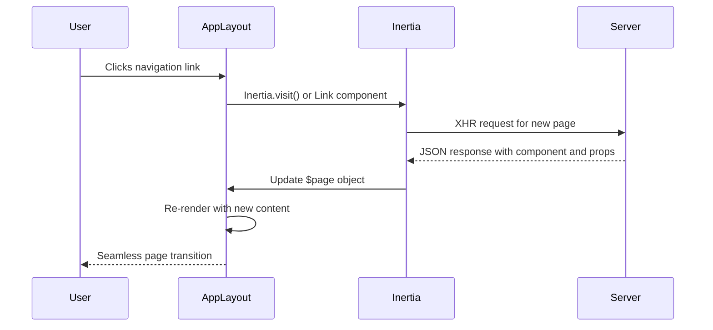

# AppLayout


## Table of Contents
1. [Introduction](#introduction)
2. [Core Functionality](#core-functionality)
3. [Props and Configuration](#props-and-configuration)
4. [Slot Usage and Content Insertion](#slot-usage-and-content-insertion)
5. [Inertia.js Integration](#inertiajs-integration)
6. [Responsive Design with Tailwind CSS](#responsive-design-with-tailwind-css)
7. [Accessibility and Semantic HTML](#accessibility-and-semantic-html)
8. [TypeScript Interface Definitions](#typescript-interface-definitions)
9. [Usage Examples](#usage-examples)
10. [Performance Considerations](#performance-considerations)

## Introduction
The AppLayout component serves as the foundational layout wrapper for all pages in the Vue.js frontend of the MeetingAI application. It provides a consistent structural framework, navigation scaffolding, and responsive behavior across the entire application. As a critical architectural component, AppLayout ensures visual and functional consistency while enabling seamless page transitions through its integration with Inertia.js. This documentation provides a comprehensive analysis of the component's structure, functionality, and implementation details.

## Core Functionality
AppLayout functions as the primary container for all application views, establishing a uniform user experience through standardized navigation, responsive behavior, and error handling. The component wraps all page content within a consistent structure that includes a navigation bar, main content area, and global UI components. It leverages Vue's composition API with TypeScript for type safety and maintainability.

The layout implements a responsive design that adapts to different screen sizes, providing a mobile-friendly experience with a collapsible navigation menu on smaller devices. It also incorporates global components such as Toast notifications and NetworkStatus indicators that are available across all pages without requiring individual imports.





**Diagram sources**
- [AppLayout.vue](file://resources/js/lib/AppLayout.vue)

**Section sources**
- [AppLayout.vue](file://resources/js/lib/AppLayout.vue)

## Props and Configuration
The AppLayout component does not explicitly define props in its current implementation, instead deriving its state from the Inertia.js page object. The component dynamically determines the active navigation state by examining the current page component name through `$page.component`. This approach allows the layout to automatically highlight the appropriate navigation link based on the current route without requiring explicit prop passing from child components.

The title of the page is managed at the application level through the Inertia.js integration in the Laravel blade template, rather than being passed as a prop to AppLayout. This centralized approach ensures consistent title management across the application.





**Diagram sources**
- [AppLayout.vue](file://resources/js/lib/AppLayout.vue)
- [globals.d.ts](file://resources/js/types/globals.d.ts)

**Section sources**
- [AppLayout.vue](file://resources/js/lib/AppLayout.vue)

## Slot Usage and Content Insertion
AppLayout utilizes Vue's slot system to enable dynamic content insertion, providing a flexible mechanism for rendering page-specific content within the consistent layout structure. The component defines a single default slot that serves as the container for all page content.


```vue
<!-- Main Content -->
<main>
  <slot />
</main>
```


This slot-based approach allows child components like Dashboard.vue and Meetings/Show.vue to inject their specific content while inheriting the consistent navigation and styling provided by the layout. The slot is placed within a `<main>` element, contributing to the semantic HTML structure and accessibility of the application.

The simplicity of using a single default slot rather than named slots reflects a design decision to maintain a straightforward layout structure, with the understanding that complex page compositions can be handled within the individual page components themselves.

**Section sources**
- [AppLayout.vue](file://resources/js/lib/AppLayout.vue)

## Inertia.js Integration
AppLayout is deeply integrated with Inertia.js, which enables seamless page transitions without full page reloads. The component leverages Inertia's routing and state management capabilities to create a smooth single-page application experience while maintaining the benefits of server-side rendering.

The navigation links within AppLayout use Inertia's Link component, which intercepts click events and performs AJAX requests to fetch new page content. This allows for instant page transitions while preserving the application's state and scroll position where appropriate.





The component also accesses the Inertia page object through `$page.component` to determine the active navigation state, eliminating the need for explicit route matching logic. This tight integration with Inertia.js's state management system ensures that the layout remains synchronized with the current application state.

**Diagram sources**
- [AppLayout.vue](file://resources/js/lib/AppLayout.vue)
- [app.blade.php](file://resources/views/app.blade.php)

**Section sources**
- [AppLayout.vue](file://resources/js/lib/AppLayout.vue)

## Responsive Design with Tailwind CSS
AppLayout implements a responsive design using Tailwind CSS utility classes, providing an optimal user experience across different device sizes. The component employs a mobile-first approach with strategic breakpoints to adapt the layout for various screen widths.

On mobile devices (less than 768px), the navigation is collapsed into a hamburger menu that can be toggled by the user. The desktop navigation links are hidden using the `hidden md:flex` class combination, while the mobile menu button is displayed with `md:hidden`. When the mobile menu is open, it slides in from the right using Tailwind's transition and transform utilities.


```html
<!-- Desktop navigation -->
<div class="hidden md:flex space-x-6">...</div>

<!-- Mobile menu button -->
<button class="md:hidden" @click="mobileMenuOpen = true">...</button>

<!-- Mobile navigation panel -->
<Transition ...>
  <div v-show="mobileMenuOpen" class="md:hidden">...</div>
</Transition>
```


The layout also uses Tailwind's responsive spacing utilities to adjust padding and margins at different breakpoints, ensuring proper spacing and alignment across devices. The `max-w-7xl mx-auto px-4 sm:px-6 lg:px-8` classes on the container element provide a consistent max-width with appropriate horizontal padding that increases on larger screens.

**Section sources**
- [AppLayout.vue](file://resources/js/lib/AppLayout.vue)

## Accessibility and Semantic HTML
AppLayout incorporates several accessibility features and follows semantic HTML principles to ensure an inclusive user experience. The component uses appropriate HTML5 semantic elements such as `<nav>` for the navigation section and `<main>` for the primary content area, which helps screen readers and other assistive technologies understand the page structure.

The navigation links are implemented using Inertia's Link component, which maintains standard link behavior while enhancing it with Inertia's transition capabilities. This ensures that keyboard navigation and screen reader accessibility are preserved. The mobile menu button includes appropriate ARIA attributes and keyboard event handling to support users who navigate with keyboards or screen readers.

The component also wraps its content in an ErrorBoundary, which provides a fallback UI in case of rendering errors. This error boundary includes clear error messages and actionable buttons ("Try Again" and "Go to Dashboard"), making it easier for users to recover from unexpected issues.

The use of proper heading hierarchy, sufficient color contrast, and focus indicators on interactive elements further enhances the accessibility of the layout.

**Section sources**
- [AppLayout.vue](file://resources/js/lib/AppLayout.vue)

## TypeScript Interface Definitions
While the AppLayout component itself does not define explicit TypeScript interfaces for props (as it doesn't accept props directly), it relies on the global type definitions established in the application's type system. The component interacts with the Inertia page object, which is typed through the extension of the PageProps interface in the global declarations.


```typescript
// From globals.d.ts
declare module '@inertiajs/core' {
    interface PageProps extends InertiaPageProps, AppPageProps {}
}
```


This type extension ensures that the `$page` object is properly typed throughout the application, including within the AppLayout component. The component also uses Vue's Ref type from the Composition API for its reactive state variables:


```typescript
const mobileMenuOpen = ref(false)
const toastComponent = ref()
```


These declarations are implicitly typed as `Ref<boolean>` and `Ref<Toast>` respectively, providing type safety for the component's internal state.

**Section sources**
- [AppLayout.vue](file://resources/js/lib/AppLayout.vue)
- [globals.d.ts](file://resources/js/types/globals.d.ts)

## Usage Examples
The AppLayout component is used as the base layout for all pages in the application. Child components wrap their content with AppLayout to inherit the consistent structure and navigation.

### Dashboard.vue Usage

```vue
<template>
  <AppLayout>
    <template #header>
      <h2 class="font-semibold text-xl text-gray-800">Dashboard</h2>
    </template>

    <div class="py-12">
      <div class="max-w-7xl mx-auto sm:px-6 lg:px-8">
        <!-- Dashboard content -->
      </div>
    </div>
  </AppLayout>
</template>
```


### Meetings/Show.vue Usage

```vue
<template>
  <AppLayout>
    <template #header>
      <h2 class="font-semibold text-xl text-gray-800">
        Meeting: {{ meeting.title }}
      </h2>
    </template>

    <div class="py-12">
      <!-- Meeting details and video player -->
    </div>
  </AppLayout>
</template>
```


In both examples, the page-specific content is inserted into the AppLayout through the default slot, while the header slot (if used) can provide page-specific header content. The AppLayout automatically sets the active navigation state based on the current route, highlighting the appropriate menu item.

**Section sources**
- [AppLayout.vue](file://resources/js/lib/AppLayout.vue)
- [Dashboard.vue](file://resources/js/pages/Dashboard.vue)
- [Meetings/Show.vue](file://resources/js/pages/Meetings/Show.vue)

## Performance Considerations
The AppLayout component is designed with performance in mind, leveraging several optimization strategies to ensure efficient rendering and minimal overhead.

As a layout component, AppLayout benefits from Inertia.js's page transition system, which avoids full page reloads and only updates the necessary parts of the DOM when navigating between pages. This results in faster perceived performance and reduced server load.

The component is instantiated once per application session and reused across page transitions, eliminating the need for repeated creation and destruction of the layout structure. This reusability reduces JavaScript execution overhead and improves overall application responsiveness.

The use of Vue's built-in Transition component for the mobile menu ensures smooth animations without requiring additional animation libraries, minimizing bundle size. The conditional rendering of the mobile menu panel (only when open) also helps reduce the initial render complexity.

The integration with Inertia.js's partial reloads (`preserveState: true`) allows the layout to maintain its state across related page navigations, further enhancing performance by avoiding unnecessary re-renders of the entire layout structure.

**Section sources**
- [AppLayout.vue](file://resources/js/lib/AppLayout.vue)
- [app.blade.php](file://resources/views/app.blade.php)

**Referenced Files in This Document**   
- [AppLayout.vue](file://resources/js/lib/AppLayout.vue)
- [app.blade.php](file://resources/views/app.blade.php)
- [globals.d.ts](file://resources/js/types/globals.d.ts)
- [Dashboard.vue](file://resources/js/pages/Dashboard.vue)
- [Meetings/Show.vue](file://resources/js/pages/Meetings/Show.vue)