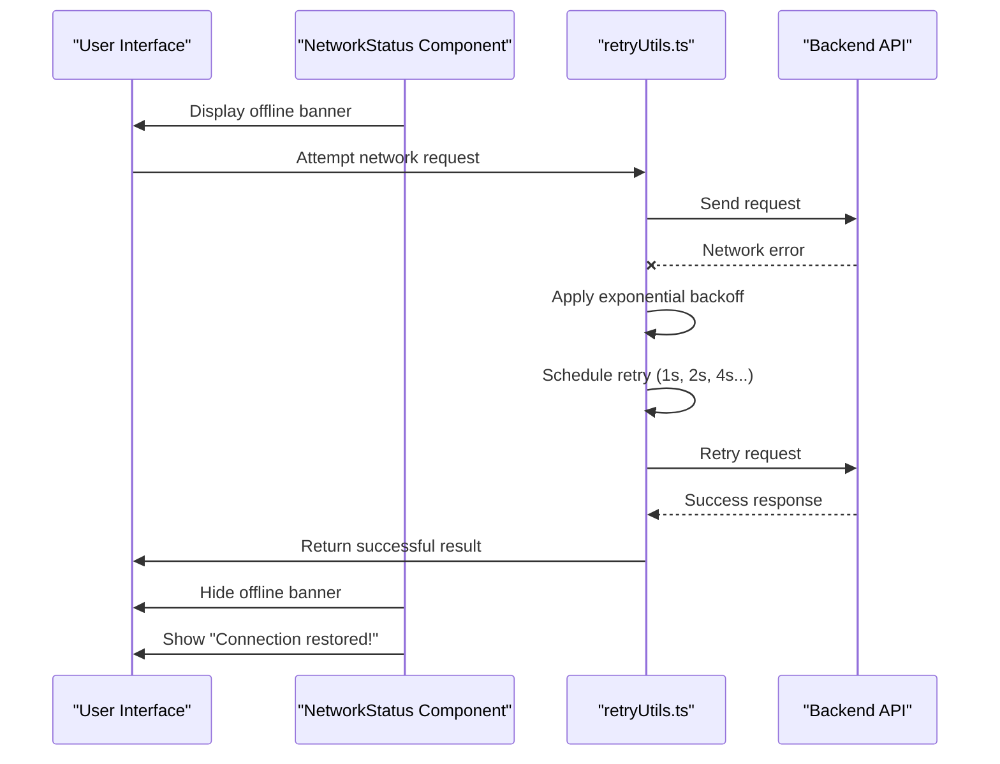
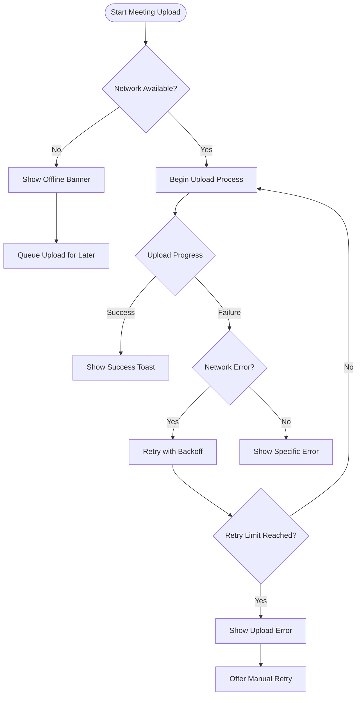

# NetworkStatus


## Table of Contents
1. [Introduction](#introduction)
2. [Core Functionality](#core-functionality)
3. [Integration with retryUtils.ts](#integration-with-retryutilsts)
4. [Usage in MeetingUpload Workflows](#usage-in-meetingupload-workflows)
5. [Visual Design and Styling](#visual-design-and-styling)
6. [Accessibility Features](#accessibility-features)
7. [Performance and Event Handling](#performance-and-event-handling)
8. [Configuration and Customization](#configuration-and-customization)
9. [Troubleshooting Guide](#troubleshooting-guide)

## Introduction
The NetworkStatus component is a critical user interface element that monitors and displays the application's connectivity state. It provides real-time feedback to users about their internet connection status, helping them understand when certain features may be unavailable due to network outages. This component plays a vital role in enhancing user experience by preventing failed operations during connectivity issues and providing clear guidance for recovery.

**Section sources**
- [NetworkStatus.vue](file://resources/js/lib/NetworkStatus.vue#L1-L99)

## Core Functionality

The NetworkStatus component implements reactive detection of online/offline events using the browser's Navigator API. It monitors the `navigator.onLine` property and responds to `online` and `offline` events to provide immediate visual feedback to users.

When a user loses internet connectivity, the component displays a prominent red banner at the top of the screen with the message "No internet connection. Some features may not work properly." This warning appears with a smooth slide-down animation and remains visible until the connection is restored.

Upon reconnection, a temporary green success message "Connection restored!" appears, which automatically fades out after 3 seconds. The component uses Vue's reactivity system with `ref` to track the connection state and employs proper lifecycle management by adding event listeners on mount and removing them on unmount to prevent memory leaks.


```mermaid
stateDiagram-v2
[*] --> InitialState
InitialState --> Online : navigator.onLine = true
InitialState --> Offline : navigator.onLine = false
Online --> Offline : "offline" event
Offline --> Online : "online" event
Online --> Reconnected : showReconnected timeout
Reconnected --> Online : 3-second timer expires
state InitialState {
[*] --> CheckNavigatorOnline
CheckNavigatorOnline --> Online : navigator.onLine === true
CheckNavigatorOnline --> Offline : navigator.onLine === false
}
state Online {
[*] --> DisplayNormalUI
note right : isOnline = true
}
state Offline {
[*] --> ShowOfflineBanner
note right : Displays red banner<br/>Prevents network operations
}
state Reconnected {
[*] --> ShowSuccessBanner
note right : showReconnected = true<br/>Timer starts (3s)
}
```


**Diagram sources**
- [NetworkStatus.vue](file://resources/js/lib/NetworkStatus.vue#L1-L99)

**Section sources**
- [NetworkStatus.vue](file://resources/js/lib/NetworkStatus.vue#L1-L99)

## Integration with retryUtils.ts

The NetworkStatus component works in conjunction with retryUtils.ts to provide robust network request recovery mechanisms. While NetworkStatus handles the UI aspect of connectivity monitoring, retryUtils.ts implements the logic for automatic request recovery during network outages.

The retryUtils.ts file exports several functions that implement retry strategies with configurable options:

- **retry**: Generic retry function with configurable attempts, delay, and backoff strategy
- **retryNetworkRequest**: Specialized for network requests with intelligent retry conditions
- **retryFileUpload**: Specifically designed for file uploads with appropriate error handling
- **CircuitBreaker**: Prevents cascading failures by temporarily halting requests after repeated failures

These utilities integrate with the network status detection by checking error types and status codes to determine whether a request should be retried. For example, network errors, timeouts, and 5xx server errors trigger automatic retries with exponential backoff.





**Diagram sources**
- [NetworkStatus.vue](file://resources/js/lib/NetworkStatus.vue#L1-L99)
- [retryUtils.ts](file://resources/js/lib/retryUtils.ts#L1-L234)

**Section sources**
- [retryUtils.ts](file://resources/js/lib/retryUtils.ts#L1-L234)

## Usage in MeetingUpload Workflows

In MeetingUpload workflows, where connectivity is critical, the NetworkStatus component plays a crucial role in preventing failed operations and providing feedback. The component is integrated into the application layout, ensuring it's available across all pages, including the meeting upload interface.

When uploading a meeting recording, the system combines network status monitoring with retry logic to handle temporary connectivity issues. If a network interruption occurs during upload, the system automatically retries the request with exponential backoff rather than immediately failing.

The Create.vue component for meeting uploads implements additional error handling that complements the global NetworkStatus component. It includes a retry mechanism with a maximum of three attempts before requiring user intervention. This layered approach ensures robustness in critical workflows.





**Diagram sources**
- [Create.vue](file://resources/js/pages/Meetings/Create.vue#L1-L439)
- [NetworkStatus.vue](file://resources/js/lib/NetworkStatus.vue#L1-L99)

**Section sources**
- [Create.vue](file://resources/js/pages/Meetings/Create.vue#L1-L439)

## Visual Design and Styling

The NetworkStatus component uses Tailwind CSS for styling, providing a clean and modern appearance that integrates well with the application's design system. The visual indicators for connection status are designed to be highly visible while maintaining a non-intrusive presence.

For offline status, the component displays a fixed red banner (`bg-red-600`) at the top of the screen with white text for high contrast. The banner includes an alert icon (a circle with an exclamation mark) and clear messaging about the connection issue. The styling includes padding, font styling, and a high z-index (50) to ensure it appears above other content.

For reconnection status, a green banner (`bg-green-600`) appears with a checkmark icon to indicate successful reconnection. Both banners use smooth transition animations with the "slide-down" class that animates the transform property for a professional appearance.

The component uses Flexbox (`flex items-center justify-center space-x-2`) to align the icon and text horizontally with appropriate spacing. The SVG icons are sized consistently (w-4 h-4) and use the current text color for stroke.

**Section sources**
- [NetworkStatus.vue](file://resources/js/lib/NetworkStatus.vue#L1-L99)

## Accessibility Features

The NetworkStatus component includes several accessibility considerations to ensure all users receive status change notifications. Although explicit ARIA attributes are not present in the current implementation, the component provides feedback through multiple channels:

1. **Visual indicators**: High-contrast colors and prominent positioning ensure visibility
2. **Text content**: Clear, descriptive messages explain the current status
3. **Iconography**: Standard icons reinforce the meaning of status messages
4. **Animation**: Smooth transitions help draw attention to status changes

For users relying on screen readers, the dynamic content updates should be detected by assistive technologies due to the DOM changes, though adding explicit ARIA live regions could further enhance accessibility. The text content is semantic and descriptive, using phrases like "No internet connection" and "Connection restored" that clearly communicate the status.

The component could be enhanced with ARIA live regions to programmatically announce status changes to screen reader users, ensuring they receive immediate feedback about connectivity changes without needing to visually scan the interface.

**Section sources**
- [NetworkStatus.vue](file://resources/js/lib/NetworkStatus.vue#L1-L99)

## Performance and Event Handling

The NetworkStatus component demonstrates efficient performance characteristics in its event handling implementation. It uses the browser's native online/offline events, which are optimized at the browser level and have minimal performance overhead.

Event listeners are properly managed using Vue's `onMounted` and `onUnmounted` lifecycle hooks, ensuring that:
- Listeners are added only when the component is mounted
- Listeners are removed when the component is destroyed
- No memory leaks occur from orphaned event handlers

The component uses a timeout (`reconnectedTimeout`) to automatically hide the reconnection message after 3 seconds. This timeout is properly cleared in the `handleOffline` method and in the `onUnmounted` hook to prevent potential issues with stale timers.

The use of Vue's reactivity system with `ref` ensures that only necessary re-renders occur when the connection status changes. The component leverages Vue's efficient diffing algorithm to minimize DOM updates.

No performance bottlenecks are evident in the implementation, as the component performs minimal computation and relies on the browser's optimized event system for network detection.

**Section sources**
- [NetworkStatus.vue](file://resources/js/lib/NetworkStatus.vue#L1-L99)

## Configuration and Customization

Currently, the NetworkStatus component has limited configuration options exposed through its API. However, several aspects could be customized:

- **Timeout threshold**: The 3-second duration for the reconnection message is hardcoded but could be made configurable
- **Offline messaging**: The message "No internet connection. Some features may not work properly." is hardcoded but could be customized
- **Reconnection messaging**: The "Connection restored!" message could be customized
- **Styling**: Colors, positioning, and animation properties could be made configurable

The component exposes the `isOnline` state through `defineExpose`, allowing parent components to access the network status for conditional logic. This enables other components to adapt their behavior based on connectivity.

Potential enhancements could include:
- Props for customizing messages
- Props for configuring timeout durations
- Props for styling customization
- Events for programmatic control of the status indicators

These customizations would make the component more flexible for different use cases while maintaining its core functionality.

**Section sources**
- [NetworkStatus.vue](file://resources/js/lib/NetworkStatus.vue#L1-L99)

## Troubleshooting Guide

### False Offline Detections
The `navigator.onLine` API may sometimes report false offline status because it only checks if the browser has network access, not whether it can reach the internet. This can occur when:
- Connected to a network without internet access (e.g., captive portals)
- Experiencing DNS resolution issues
- Having firewall restrictions

**Solutions:**
1. Implement additional connectivity checks by attempting to fetch a small resource from your server
2. Use the CircuitBreaker pattern from retryUtils.ts to distinguish between temporary and persistent failures
3. Combine navigator.onLine with application-level ping requests

### Delayed Status Updates
Network status changes may not be detected immediately due to browser implementation differences.

**Solutions:**
1. Ensure event listeners are properly attached and not blocked by other code
2. Verify that no errors occur in the event handlers
3. Test across different browsers and network conditions

### Integration Issues
When the NetworkStatus component doesn't appear or function correctly:

**Check:**
1. Ensure AppLayout.vue properly imports and includes the NetworkStatus component
2. Verify that the component is rendered in the DOM
3. Check browser console for JavaScript errors
4. Confirm that the Teleport component is functioning correctly

The errorHandler.ts file provides additional context for network-related errors, categorizing them as 'network' type with appropriate user messages and suggestions for recovery, which complements the NetworkStatus component's functionality.

**Section sources**
- [NetworkStatus.vue](file://resources/js/lib/NetworkStatus.vue#L1-L99)
- [errorHandler.ts](file://resources/js/lib/errorHandler.ts#L1-L326)
- [retryUtils.ts](file://resources/js/lib/retryUtils.ts#L1-L234)

**Referenced Files in This Document**   
- [NetworkStatus.vue](file://resources/js/lib/NetworkStatus.vue)
- [retryUtils.ts](file://resources/js/lib/retryUtils.ts)
- [AppLayout.vue](file://resources/js/lib/AppLayout.vue)
- [Create.vue](file://resources/js/pages/Meetings/Create.vue)
- [errorHandler.ts](file://resources/js/lib/errorHandler.ts)