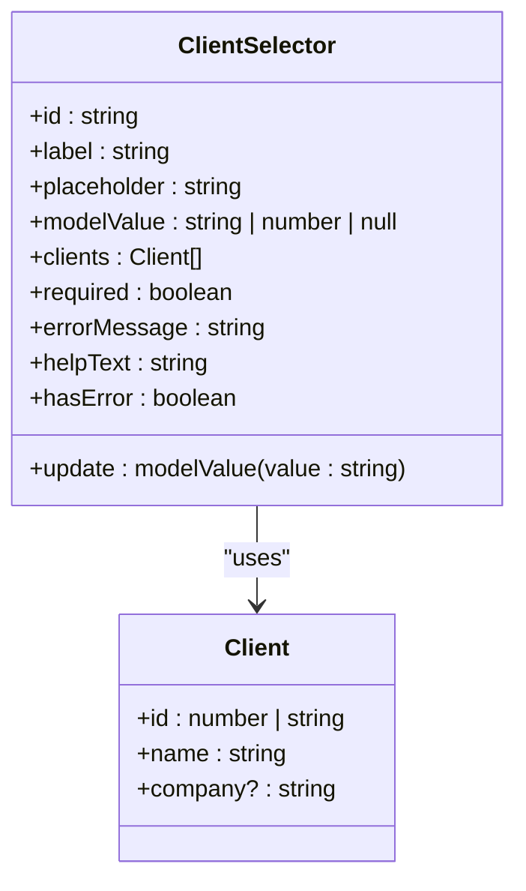
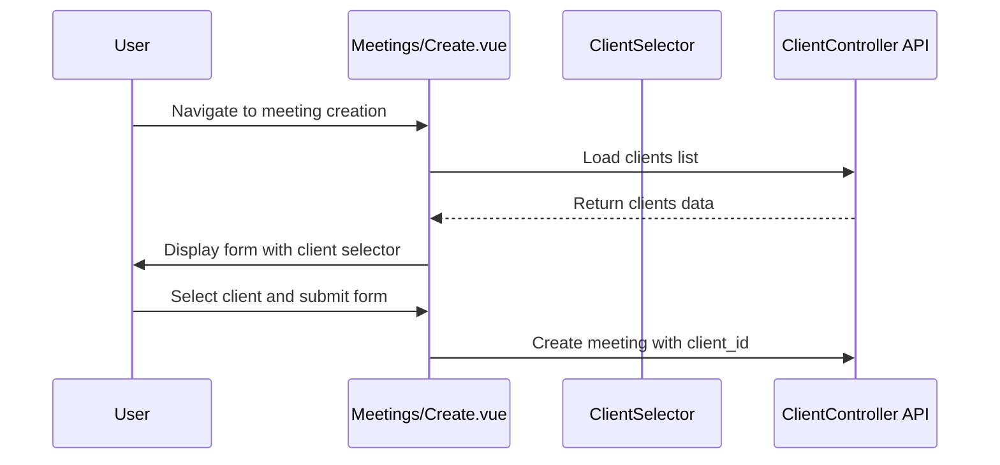

# ClientSelector


## Table of Contents
1. [Introduction](#introduction)
2. [Component Overview](#component-overview)
3. [Props and Events](#props-and-events)
4. [Integration with ClientController API](#integration-with-clientcontroller-api)
5. [Usage Examples](#usage-examples)
6. [Accessibility Features](#accessibility-features)
7. [Styling with Tailwind CSS](#styling-with-tailwind-css)
8. [Error States and Empty Client Lists](#error-states-and-empty-client-lists)
9. [Performance Considerations](#performance-considerations)
10. [Troubleshooting Common Issues](#troubleshooting-common-issues)

## Introduction
The ClientSelector component is a reusable Vue.js component that enables users to switch between client organizations within the application. This document provides a comprehensive analysis of its functionality, integration points, and implementation details. The component serves as a critical interface element for maintaining client context across various application features, particularly in meeting management and AI-powered chat functionalities.

## Component Overview
The ClientSelector component is implemented as a Vue 3 composition API component using TypeScript. It renders a standard HTML select element with options populated from a list of client organizations. The component follows Vue's form input binding patterns using the `v-model` directive through the `modelValue` prop and `update:modelValue` event.

The component is designed to be flexible and reusable, accepting various props to customize its appearance and behavior. It displays client names and, when available, company information in parentheses. The component handles basic form validation states through error message display and visual indicators.

**Section sources**
- [ClientSelector.vue](file://resources/js/lib/ClientSelector.vue#L1-L62)

## Props and Events
The ClientSelector component exposes several props to control its behavior and appearance:

**Props:**
- `id`: string - The HTML ID attribute for the select element (default: "client-selector")
- `label`: string - The label text displayed above the select element (default: "Client")
- `placeholder`: string - The placeholder option text (default: "Select a client...")
- `modelValue`: string | number | null - The currently selected client ID (required)
- `clients`: Client[] - Array of client objects containing id, name, and optional company properties (required)
- `required`: boolean - Whether the field is required (default: false)
- `errorMessage`: string - Error message to display when validation fails
- `helpText`: string - Helper text to display below the select element

**Emitted Events:**
- `update:modelValue`: Emitted when the user selects a different client, passing the selected client's ID as a string parameter. This enables two-way binding with the v-model directive.

The component uses Vue's `withDefaults` function to provide default values for optional props. It also computes the `hasError` property based on the presence of an error message, which is used to apply appropriate styling to the select element.





**Diagram sources**
- [ClientSelector.vue](file://resources/js/lib/ClientSelector.vue#L35-L62)

**Section sources**
- [ClientSelector.vue](file://resources/js/lib/ClientSelector.vue#L35-L62)

## Integration with ClientController API
The ClientSelector component receives its client data from parent components, which typically fetch this data from the backend via the ClientController API endpoint. The ClientController.php file defines the API endpoints that serve client data to the frontend application.

The `index` method in ClientController retrieves all clients from the database, including their meeting counts, and returns them in a response that is rendered by the Inertia.js framework. The clients are ordered alphabetically by name and include a meetings_count attribute that indicates how many meetings are associated with each client.


```php
public function index(): Response
{
    $clients = Client::withCount('meetings')
        ->orderBy('name')
        ->get();

    return Inertia::render('Clients/Index', [
        'clients' => $clients
    ]);
}
```


This data structure is then passed down to components that use the ClientSelector, ensuring that the client list is always up-to-date and consistent across the application. The API does not include specific endpoints for searching or filtering clients, suggesting that the complete list is loaded once and used throughout the user's session.

**Diagram sources**
- [ClientController.php](file://app/Http/Controllers/ClientController.php#L10-L18)

**Section sources**
- [ClientController.php](file://app/Http/Controllers/ClientController.php#L10-L18)

## Usage Examples
### Meetings/Create.vue Integration
In the Meetings/Create.vue component, the ClientSelector pattern is implemented directly with a select element rather than using the ClientSelector component. This implementation demonstrates how client context affects meeting creation functionality.

The component receives a list of clients as a prop and displays them in a dropdown menu. When creating a new meeting, the selected client is associated with the meeting record. The component also provides a link to create a new client if the desired client is not in the list.





**Diagram sources**
- [Meetings/Create.vue](file://resources/js/pages/Meetings/Create.vue#L1-L438)
- [ClientController.php](file://app/Http/Controllers/ClientController.php#L10-L18)

**Section sources**
- [Meetings/Create.vue](file://resources/js/pages/Meetings/Create.vue#L1-L438)

### AI/Chat.vue Integration
In the AI/Chat.vue component, client context is crucial for filtering search results. Although the ClientSelector component is not directly used in this file, the AI assistant uses client information to provide relevant search results from meeting transcriptions.

When users ask questions, the AI system can filter results by client, ensuring that responses are contextually relevant. The search results include the client name, allowing users to understand which client's meetings contain the information they're seeking.

The AI system integrates with the MeetingSearchTool, which can filter results by client_id, demonstrating how client context propagates through the application's AI features.

**Section sources**
- [AI/Chat.vue](file://resources/js/pages/AI/Chat.vue#L1-L306)
- [MeetingSearchTool.php](file://app/Tools/MeetingSearchTool.php#L38-L72)

## Accessibility Features
The ClientSelector component implements several accessibility features to ensure it is usable by all users:

1. **Proper Labeling**: The component uses a semantic `<label>` element with a `for` attribute that matches the select element's ID, ensuring screen readers can properly associate the label with the input.

2. **Keyboard Navigation**: As a native select element, it supports standard keyboard navigation including tabbing, arrow key selection, and form submission via Enter.

3. **Visual Feedback**: The component provides visual feedback for focus states with Tailwind CSS classes that enhance the ring around the select element when focused.

4. **Error Messaging**: Error messages are displayed in red text below the select element, with appropriate semantic HTML (paragraph elements) that screen readers can announce.

5. **Required Field Indication**: Required fields are indicated both visually with a red asterisk and programmatically through the `required` attribute on the select element.

The component could be further improved with additional ARIA attributes such as `aria-invalid` when an error is present, and `aria-describedby` to explicitly associate the error message and help text with the select element.

**Section sources**
- [ClientSelector.vue](file://resources/js/lib/ClientSelector.vue#L1-L62)

## Styling with Tailwind CSS
The ClientSelector component uses Tailwind CSS for all styling, following the project's design system. The styling is implemented directly in the template with utility classes.

Key styling features include:
- **Base Styling**: The select element has padding, rounded corners, and a shadow for depth
- **Border and Ring**: A light gray border with a focus ring that changes color based on state
- **Focus States**: Enhanced focus styles with a blue-indigo ring when focused
- **Error States**: Red border and focus ring when an error is present
- **Typography**: Consistent text sizing and leading for readability

The component uses conditional class binding to apply error styles when the `hasError` computed property is true. This approach keeps the styling logic simple and maintainable.


```html
<select
  class="block w-full rounded-md border-0 py-1.5 text-gray-900 shadow-sm ring-1 ring-inset ring-gray-300 focus:ring-2 focus:ring-inset focus:ring-indigo-600 sm:text-sm sm:leading-6"
  :class="{ 'ring-red-500 focus:ring-red-500': hasError }"
>
```


**Section sources**
- [ClientSelector.vue](file://resources/js/lib/ClientSelector.vue#L1-L62)

## Error States and Empty Client Lists
The ClientSelector component handles error states through the `errorMessage` prop. When this prop has a value, the component displays the error message in red text below the select element and applies red styling to the border and focus ring.

For empty client lists, the component relies on the parent component to handle the state. Since the select element is populated by iterating over the `clients` prop, an empty array will result in only the placeholder option being displayed. Users will not be able to select a client in this state.

The component does not include specific handling for empty client lists, such as displaying a message or providing a link to create a new client. This functionality is implemented in parent components like Meetings/Create.vue, which includes a "Don't see your client? Create a new client" link.

Potential improvements could include:
- Adding a prop to display a message when the client list is empty
- Including a slot for custom content when no clients are available
- Providing a callback prop for handling "create new client" actions

**Section sources**
- [ClientSelector.vue](file://resources/js/lib/ClientSelector.vue#L1-L62)
- [Meetings/Create.vue](file://resources/js/pages/Meetings/Create.vue#L1-L438)

## Performance Considerations
The current implementation of the ClientSelector component has several performance characteristics:

1. **No Built-in Caching**: The component itself does not implement caching. Client data caching is handled at the application level by Inertia.js and the browser's network cache.

2. **No Lazy Loading**: All clients are loaded at once rather than using pagination or virtual scrolling, which could impact performance with large client lists.

3. **No Search/Filter**: The component does not include search or filtering capabilities, which could make it difficult to use with large client lists.

4. **Simple Rendering**: The component uses a simple v-for loop to render options, which is efficient for small to medium lists but could become sluggish with hundreds of clients.

The application does not appear to implement client-side caching of the client list in localStorage or Vuex. Instead, it relies on Inertia.js's page visit cache and standard HTTP caching mechanisms.

For improved performance with large datasets, potential enhancements could include:
- Implementing debounced search functionality
- Adding virtual scrolling for large lists
- Implementing client-side caching with localStorage
- Adding pagination or infinite scrolling

**Section sources**
- [ClientSelector.vue](file://resources/js/lib/ClientSelector.vue#L1-L62)
- [ClientController.php](file://app/Http/Controllers/ClientController.php#L10-L18)

## Troubleshooting Common Issues
### Stale Selection Issues
If users experience stale client selections, this is likely due to:
- **Page Caching**: Inertia.js may be serving a cached version of the page. Solution: Ensure proper cache invalidation when client data changes.
- **Missing State Updates**: Parent components may not be properly updating the modelValue prop. Solution: Verify two-way binding is correctly implemented.

### API Failures
When the ClientController API fails to return data:
- **Check Authentication**: Ensure the user has valid authentication credentials
- **Verify Permissions**: Confirm the user has permission to access client data
- **Inspect Network Requests**: Use browser developer tools to examine the API response

### Empty Client List
If no clients appear in the selector:
- **Verify Data Seeding**: Check that the database has been seeded with client data
- **Confirm API Response**: Ensure the ClientController index method returns clients
- **Check Prop Binding**: Verify the clients prop is properly passed to the component

### Accessibility Issues
To address potential accessibility problems:
- **Add ARIA Attributes**: Implement aria-invalid and aria-describedby for better screen reader support
- **Ensure Keyboard Navigation**: Test that all functionality is accessible via keyboard
- **Verify Color Contrast**: Ensure text and background colors meet WCAG guidelines

**Section sources**
- [ClientSelector.vue](file://resources/js/lib/ClientSelector.vue#L1-L62)
- [ClientController.php](file://app/Http/Controllers/ClientController.php#L10-L18)
- [Meetings/Create.vue](file://resources/js/pages/Meetings/Create.vue#L1-L438)

**Referenced Files in This Document**   
- [ClientSelector.vue](file://resources/js/lib/ClientSelector.vue)
- [ClientController.php](file://app/Http/Controllers/ClientController.php)
- [Meetings/Create.vue](file://resources/js/pages/Meetings/Create.vue)
- [AI/Chat.vue](file://resources/js/pages/AI/Chat.vue)