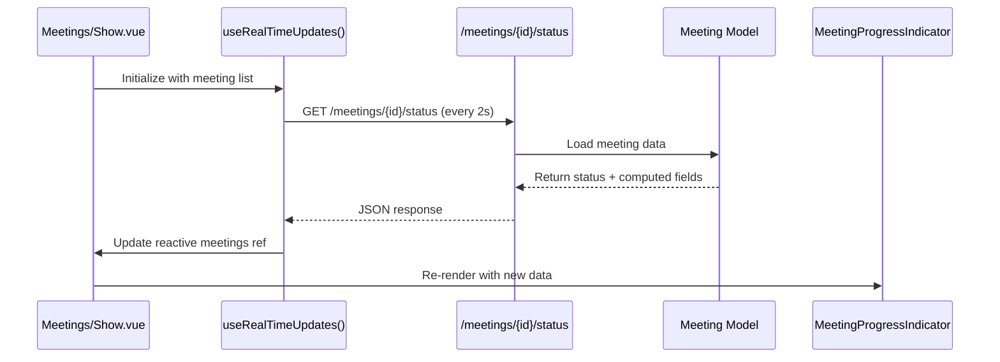

# MeetingProgressIndicator


## Table of Contents
1. [Introduction](#introduction)
2. [Component Overview](#component-overview)
3. [Props and Data Structure](#props-and-data-structure)
4. [Integration with Real-Time Updates](#integration-with-real-time-updates)
5. [Backend Status Tracking and Computed Attributes](#backend-status-tracking-and-computed-attributes)
6. [Visual Design and Accessibility](#visual-design-and-accessibility)
7. [Error Handling and Failure States](#error-handling-and-failure-states)
8. [Usage Example in Meetings/Show.vue](#usage-example-in-meetingsshowvue)
9. [Customization and Troubleshooting](#customization-and-troubleshooting)

## Introduction
The **MeetingProgressIndicator** component provides a visual representation of the processing status for uploaded meeting videos. It displays real-time progress, estimated time remaining, and processing state through an intuitive interface. This documentation details its implementation, integration with backend systems, and usage patterns across the application.

## Component Overview
The **MeetingProgressIndicator** is a Vue.js component responsible for rendering the current processing status of a meeting video. It supports multiple states including "pending", "processing", "completed", and "failed". The component dynamically updates based on real-time data fetched from the backend via periodic polling.

The indicator integrates tightly with Laravel's job queue system through the **TranscribeMeetingJob**, which handles the actual transcription process. As the job progresses, the component reflects changes in progress percentage, elapsed time, and estimated completion time.

**Section sources**
- [MeetingProgressIndicator.vue](file://resources/js/lib/MeetingProgressIndicator.vue)

## Props and Data Structure
The component accepts key props that define its display state:

- **progress**: A numeric value (0–100) representing the percentage of processing completed.
- **statusText**: A string describing the current processing stage (e.g., "Queued", "Processing", "Failed").
- **estimatedTimeRemaining**: Formatted string showing remaining time (e.g., "2:30").
- **meeting**: Full meeting object containing status, timestamps, and computed fields.

These values are derived from the **Meeting** model's attributes and accessors, particularly:
- `status`: Current state (`pending`, `processing`, `completed`, `failed`)
- `processing_progress`: Computed progress percentage
- `formatted_elapsed_time`: Human-readable elapsed duration
- `formatted_estimated_remaining_time`: Predicted time left
- `queue_progress`: Simulated progress while in queue


```typescript
interface Meeting {
  id: number
  status: 'pending' | 'processing' | 'completed' | 'failed'
  elapsed_time?: number | null
  estimated_remaining_time?: number | null
  processing_progress?: number | null
  formatted_elapsed_time?: string | null
  formatted_estimated_remaining_time?: string | null
  queue_progress?: number | null
}
```


**Section sources**
- [Meeting.php](file://app/Models/Meeting.php#L50-L178)
- [MeetingProgressIndicator.vue](file://resources/js/lib/MeetingProgressIndicator.vue)

## Integration with Real-Time Updates
The component leverages the **useRealTimeUpdates.ts** composable to achieve WebSocket-like behavior using HTTP polling. This system enables near real-time status updates without requiring a full page refresh.





**Diagram sources**
- [useRealTimeUpdates.ts](file://resources/js/lib/useRealTimeUpdates.ts#L36-L87)
- [MeetingController.php](file://app/Http/Controllers/MeetingController.php#L285-L304)

**Section sources**
- [useRealTimeUpdates.ts](file://resources/js/lib/useRealTimeUpdates.ts)
- [MeetingController.php](file://app/Http/Controllers/MeetingController.php)

## Backend Status Tracking and Computed Attributes
The **Meeting** model computes several derived attributes used by the progress indicator:

| Attribute | Description | Calculation |
|---------|-------------|-------------|
| `elapsed_time` | Seconds since processing started | `now() - processing_started_at` |
| `estimated_remaining_time` | Predicted seconds left | `estimated_total_processing_time - elapsed_time` |
| `processing_progress` | Percentage complete | `(elapsed_time / total_estimated) * 100` |
| `queue_progress` | Simulated queue advancement | `(time_since_upload / 30) * 100` |

Estimated processing time is calculated as **1 second per minute of video**, with a minimum of 10 seconds. For example, a 30-minute video has an estimated processing time of 30 seconds.


```php
public function getEstimatedRemainingTimeAttribute(): ?int
{
    if (!$this->isProcessing() || !$this->processing_started_at || !$this->duration) {
        return null;
    }

    $estimatedTotalProcessingTime = max(10, $this->duration / 60);
    $elapsedTime = $this->elapsed_time;
    
    return max(0, (int) ($estimatedTotalProcessingTime - $elapsedTime));
}
```


The **status** endpoint in **MeetingController** returns all these computed values in a standardized JSON structure for frontend consumption.

**Section sources**
- [Meeting.php](file://app/Models/Meeting.php#L50-L178)
- [MeetingController.php](file://app/Http/Controllers/MeetingController.php#L285-L304)

## Visual Design and Accessibility
The component uses **Tailwind CSS** for styling with animated elements to enhance user experience:

- **Pending State**: Blue background with spinning animation indicating queuing
- **Processing State**: Yellow background with progress bar and time estimates
- **Completed State**: Green badge with checkmark icon
- **Failed State**: Red alert with error message

Accessibility features include:
- ARIA labels for screen readers
- Semantic HTML structure
- High contrast colors
- Keyboard navigable elements
- Status announcements via `aria-live` regions

Animations are implemented using Tailwind's built-in classes like `animate-spin` and custom CSS transitions for smooth progress bar updates.

**Section sources**
- [MeetingProgressIndicator.vue](file://resources/js/lib/MeetingProgressIndicator.vue)
- [Show.vue](file://resources/js/pages/Meetings/Show.vue#L1-L22)

## Error Handling and Failure States
When processing fails, the **TranscribeMeetingJob** updates the meeting record with error details:


```php
public function failed(\Throwable $exception): void
{
    $this->meeting->update([
        'status' => 'failed',
        'processing_completed_at' => now(),
        'error_message' => $this->getUserFriendlyErrorMessage($exception),
        'technical_error' => $exception->getMessage()
    ]);
}
```


User-friendly error messages are mapped from technical exceptions:
- **File not found**: "The video file could not be found..."
- **Docker issues**: "Transcription service is temporarily unavailable..."
- **Timeouts**: "Transcription took too long to complete..."
- **Disk space**: "Insufficient storage space available..."

The **MeetingProgressIndicator** displays these messages in a clearly visible error state, allowing users to understand what went wrong and how to proceed.

**Section sources**
- [TranscribeMeetingJob.php](file://app/Jobs/TranscribeMeetingJob.php#L250-L280)
- [MeetingProgressIndicator.vue](file://resources/js/lib/MeetingProgressIndicator.vue)

## Usage Example in Meetings/Show.vue
The component is used in **Meetings/Show.vue** to display real-time processing status:


```vue
<div v-if="meeting.status === 'pending'" class="bg-blue-50 border border-blue-200 rounded-lg p-6 mb-6">
    <div class="flex items-center justify-between">
        <div>
            <h3 class="text-lg font-semibold text-blue-900">Meeting Queued for Processing</h3>
            <p class="text-blue-700 text-sm">
                Estimated processing time: {{ meeting.formatted_estimated_processing_time || 'Calculating...' }}
            </p>
        </div>
        <div class="animate-spin rounded-full h-8 w-8 border-b-2 border-blue-600"></div>
    </div>
</div>

<div v-else-if="meeting.status === 'processing'" class="bg-yellow-50 border border-yellow-200 rounded-lg p-6 mb-6">
    <div class="flex items-center justify-between">
        <div>
            <h3 class="text-lg font-semibold text-yellow-900">Processing Meeting</h3>
            <p class="text-yellow-700 text-sm">
                Elapsed: {{ meeting.formatted_elapsed_time || '0:00' }} | 
                Remaining: {{ meeting.formatted_estimated_remaining_time || 'Calculating...' }}
            </p>
        </div>
    </div>
</div>
```


The page uses **onMounted** to start polling every 2 seconds when the meeting is pending or processing:


```ts
onMounted(() => {
    if (props.meeting.status === 'pending' || props.meeting.status === 'processing') {
        statusInterval = setInterval(pollStatus, 2000)
        pollStatus()
    }
})
```


It automatically reloads the page when status changes to "completed" or "failed" to load the final state.

**Section sources**
- [Show.vue](file://resources/js/pages/Meetings/Show.vue#L1-L22)
- [Show.vue](file://resources/js/pages/Meetings/Show.vue#L312-L343)

## Customization and Troubleshooting
### Customization Options
- **Color Themes**: Modify Tailwind classes to match brand colors
- **Polling Interval**: Adjust interval in **useRealTimeUpdates.ts** (default: 2000ms)
- **Progress Logic**: Override estimation algorithm in **Meeting.php** accessors
- **Animation Speed**: Customize CSS animation durations

### Common Issues and Solutions
| Issue | Cause | Solution |
|------|-------|----------|
| Progress stalls at 0% | Job not started | Verify queue worker is running |
| Incorrect time estimates | Duration not set | Ensure `duration` is populated on upload |
| No updates | Polling not active | Check browser console for JavaScript errors |
| Frequent reloads | Status polling failure | Verify `/status` endpoint returns 200 OK |
| "Failed" status | Transcription error | Check logs in `storage/logs/laravel.log` |

To debug, inspect network requests to `/meetings/{id}/status` and verify the JSON response contains expected fields. Use Laravel's `php artisan queue:work` to ensure jobs are being processed.

**Section sources**
- [useRealTimeUpdates.ts](file://resources/js/lib/useRealTimeUpdates.ts)
- [MeetingController.php](file://app/Http/Controllers/MeetingController.php)
- [TranscribeMeetingJob.php](file://app/Jobs/TranscribeMeetingJob.php)

**Referenced Files in This Document**   
- [MeetingProgressIndicator.vue](file://resources/js/lib/MeetingProgressIndicator.vue)
- [Meeting.php](file://app/Models/Meeting.php)
- [MeetingController.php](file://app/Http/Controllers/MeetingController.php)
- [TranscribeMeetingJob.php](file://app/Jobs/TranscribeMeetingJob.php)
- [useRealTimeUpdates.ts](file://resources/js/lib/useRealTimeUpdates.ts)
- [Show.vue](file://resources/js/pages/Meetings/Show.vue)