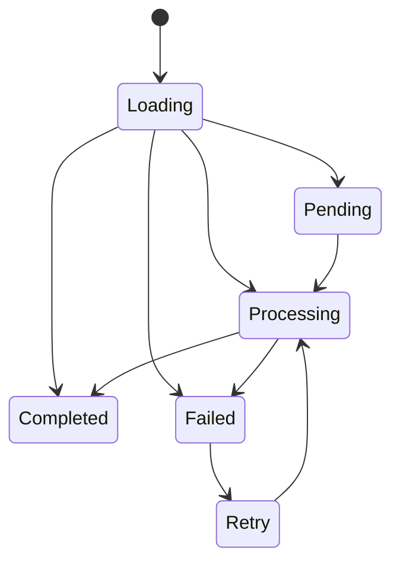
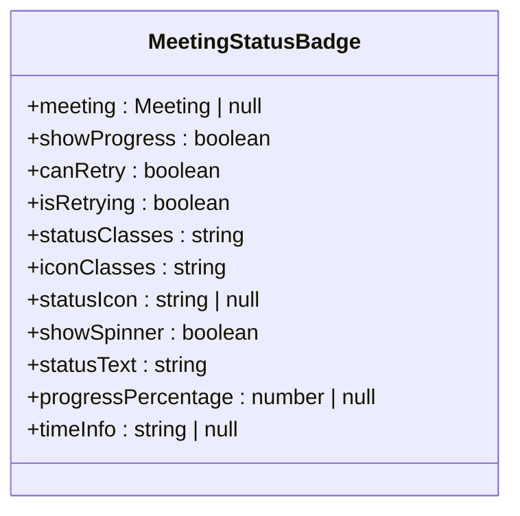
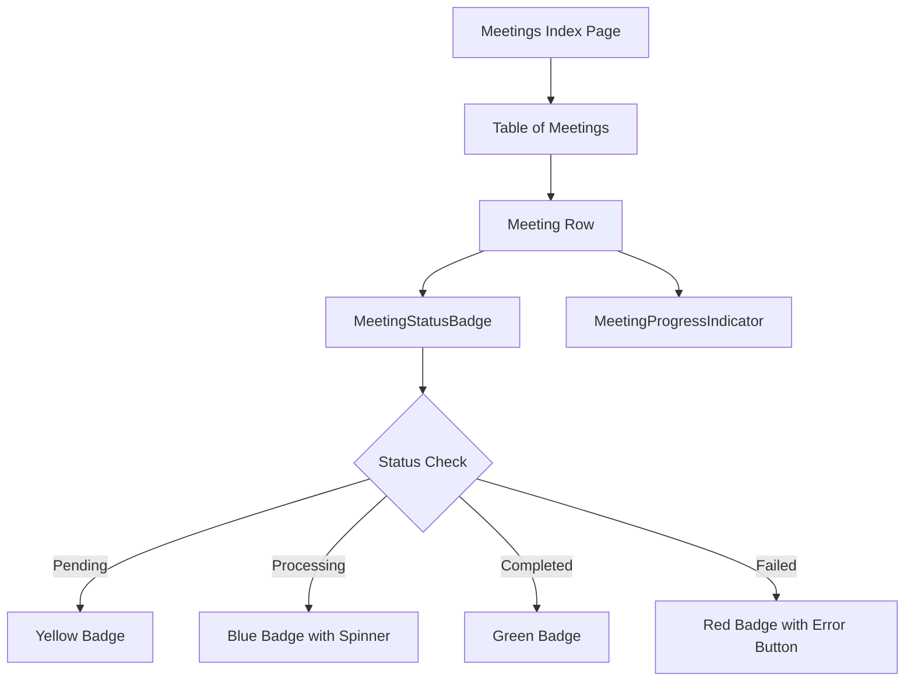
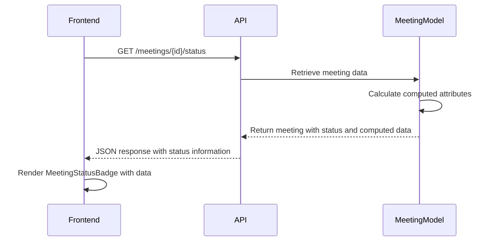

# MeetingStatusBadge


## Table of Contents
1. [Introduction](#introduction)
2. [Component Overview](#component-overview)
3. [Props and Configuration](#props-and-configuration)
4. [Status Mapping and Visual Representation](#status-mapping-and-visual-representation)
5. [Usage Examples](#usage-examples)
6. [Accessibility Features](#accessibility-features)
7. [Internationalization Considerations](#internationalization-considerations)
8. [Error Handling and Troubleshooting](#error-handling-and-troubleshooting)
9. [Integration with Meeting Model](#integration-with-meeting-model)

## Introduction
The MeetingStatusBadge component provides a visual indicator of a meeting's processing status within the MeetingAI application. This component displays the current state of a meeting (e.g., 'Pending', 'Processing', 'Completed', 'Failed') using color-coded badges with appropriate icons and text. The component is designed to be reusable across different views and provides additional functionality for error details and retry operations when processing fails.

**Section sources**
- [MeetingStatusBadge.vue](file://e:/Herd/meetingai/resources/js/lib/MeetingStatusBadge.vue)

## Component Overview
The MeetingStatusBadge component is a Vue 3 component implemented with the Composition API and TypeScript. It displays the current processing status of a meeting with visual indicators that help users quickly understand the meeting's state. The component handles multiple states including loading, normal operation, and error conditions.

The component renders differently based on whether a meeting object is provided. When no meeting is available, it displays a loading state with a spinning animation. When a meeting is present, it displays a badge with status-specific styling, optional icons, and status text.





**Diagram sources**
- [MeetingStatusBadge.vue](file://e:/Herd/meetingai/resources/js/lib/MeetingStatusBadge.vue#L0-L283)

**Section sources**
- [MeetingStatusBadge.vue](file://e:/Herd/meetingai/resources/js/lib/MeetingStatusBadge.vue#L0-L283)

## Props and Configuration
The MeetingStatusBadge component accepts several props that control its behavior and appearance:

**Props Interface**

```typescript
interface Props {
  meeting?: Meeting | null
  showProgress?: boolean
  canRetry?: boolean
  isRetrying?: boolean
}
```


**:meeting**  
- **Type**: `Meeting | null | undefined`
- **Description**: The meeting object containing status and related data
- **Required**: No (component shows loading state when not provided)
- **Default**: `undefined`

**:showProgress**  
- **Type**: `boolean`
- **Description**: Controls whether progress information should be displayed
- **Required**: No
- **Default**: `true`

**:canRetry**  
- **Type**: `boolean`
- **Description**: Determines if the retry button should be shown for failed meetings
- **Required**: No
- **Default**: `true`

**:isRetrying**  
- **Type**: `boolean`
- **Description**: Indicates whether a retry operation is currently in progress
- **Required**: No
- **Default**: `false`

The component also emits a `retry` event when the retry button is clicked, allowing parent components to handle the retry logic.

**Section sources**
- [MeetingStatusBadge.vue](file://e:/Herd/meetingai/resources/js/lib/MeetingStatusBadge.vue#L187-L283)

## Status Mapping and Visual Representation
The component maps backend status codes to visual representations using Tailwind CSS classes, icons, and text labels. Each status has a distinct color scheme that conveys the urgency and nature of the state.

### Status Classes
The component uses computed properties to determine the appropriate CSS classes for each status:





**Diagram sources**
- [MeetingStatusBadge.vue](file://e:/Herd/meetingai/resources/js/lib/MeetingStatusBadge.vue#L187-L283)

### Status Color Coding
The component uses a color-coded system to convey meeting status:

- **Pending**: Yellow (`bg-yellow-100 text-yellow-800`)
  - Represents meetings waiting in the processing queue
  - Uses a clock icon to indicate waiting state
  - Conveys moderate urgency

- **Processing**: Blue (`bg-blue-100 text-blue-800`)
  - Represents meetings currently being processed
  - Uses a spinning animation during active processing
  - Conveys active work in progress

- **Completed**: Green (`bg-green-100 text-green-800`)
  - Represents successfully processed meetings
  - Uses a checkmark icon to indicate success
  - Conveys completion and success

- **Failed**: Red (`bg-red-100 text-red-800`)
  - Represents meetings that encountered errors during processing
  - Uses an X icon to indicate failure
  - Conveys high urgency and requires user attention

- **Unknown/Default**: Gray (`bg-gray-100 text-gray-800`)
  - Represents unrecognized or undefined states
  - Used as a fallback for unexpected status values

The color choices follow standard UX conventions where red indicates errors, green indicates success, yellow indicates warnings or pending states, and blue indicates informational or processing states.

**Section sources**
- [MeetingStatusBadge.vue](file://e:/Herd/meetingai/resources/js/lib/MeetingStatusBadge.vue#L187-L230)

## Usage Examples
The MeetingStatusBadge component is used in multiple views throughout the application to provide consistent status visualization.

### Meetings Index View
In the Meetings index page, the component is used to display the status of each meeting in the list:


```vue
<MeetingStatusBadge :status="meeting.status" :meeting="meeting" />
```


The component is integrated within a table that lists all meetings, providing at-a-glance status overview for multiple meetings simultaneously. It's paired with the MeetingProgressIndicator component to show additional progress information when applicable.





**Diagram sources**
- [Index.vue](file://e:/Herd/meetingai/resources/js/pages/Meetings/Index.vue#L0-L357)
- [MeetingStatusBadge.vue](file://e:/Herd/meetingai/resources/js/lib/MeetingStatusBadge.vue)

**Section sources**
- [Index.vue](file://e:/Herd/meetingai/resources/js/pages/Meetings/Index.vue#L0-L357)

### Clients Show View
In the Client details view, the component could be used to display the status of meetings associated with a specific client. However, the current implementation in Clients/Show.vue uses a simpler status display without the full MeetingStatusBadge component, instead implementing a basic status badge directly in the template.

This represents an opportunity for consistency improvement by replacing the inline implementation with the standardized MeetingStatusBadge component.

**Section sources**
- [Show.vue](file://e:/Herd/meetingai/resources/js/pages/Clients/Show.vue#L0-L184)

## Accessibility Features
The MeetingStatusBadge component incorporates several accessibility features to ensure it is usable by all users, including those with disabilities.

### Visual Design
The component uses high-contrast color combinations that meet WCAG 2.1 AA accessibility standards:
- Yellow badge: `bg-yellow-100` (light yellow background) with `text-yellow-800` (dark yellow text)
- Blue badge: `bg-blue-100` (light blue background) with `text-blue-800` (dark blue text)
- Green badge: `bg-green-100` (light green background) with `text-green-800` (dark green text)
- Red badge: `bg-red-100` (light red background) with `text-red-800` (dark red text)

These combinations provide sufficient contrast between text and background colors, making the status text readable for users with color vision deficiencies.

### Interactive Elements
The component includes appropriate ARIA attributes and keyboard navigation support:
- Buttons have descriptive titles that are read by screen readers
- Interactive elements are focusable and can be operated via keyboard
- The error details button has a title attribute: "Show error details"
- The retry button has a title attribute: "Retry processing"

### Loading State
When no meeting data is available, the component displays a loading state with both a visual spinner and the text "Loading..." This dual indication helps users understand that content is being fetched, benefiting both sighted users and screen reader users.

**Section sources**
- [MeetingStatusBadge.vue](file://e:/Herd/meetingai/resources/js/lib/MeetingStatusBadge.vue#L0-L283)

## Internationalization Considerations
The current implementation of the MeetingStatusBadge component has limited internationalization support. Status labels are hardcoded in English:

- Pending → "Pending"
- Processing → "Processing"
- Completed → "Completed"
- Failed → "Failed"
- Unknown → "Unknown"
- Loading → "Loading..."

For a production application that needs to support multiple languages, these strings should be externalized to a localization system. The component would need to be updated to use a translation function or service to retrieve the appropriate labels based on the user's language preference.

Potential improvements for internationalization:
1. Integrate with a Vue i18n solution or similar localization library
2. Create language files with status label translations
3. Update the `statusText` computed property to use translated strings
4. Add support for right-to-left (RTL) languages if needed

The hardcoded strings represent a limitation for global deployment, but the component's structure makes it relatively straightforward to add proper internationalization support.

**Section sources**
- [MeetingStatusBadge.vue](file://e:/Herd/meetingai/resources/js/lib/MeetingStatusBadge.vue#L228-L271)

## Error Handling and Troubleshooting
The MeetingStatusBadge component includes robust error handling features, particularly for failed meeting processing states.

### Error Visualization
When a meeting fails processing, the component provides enhanced error visualization:
- Displays a red status badge with an error icon
- Shows an information button (i) that reveals error details when clicked
- Displays a retry button when retry operations are allowed
- Shows a detailed error modal with both user-friendly and technical error messages

The error details include:
- A user-friendly error message in the main content
- A "Try Again" button to retry processing
- A "Show Technical Details" toggle for developers
- The raw technical error in a collapsible section with syntax highlighting

### Common Issues and Troubleshooting
Several issues can cause incorrect status display, and the component includes mechanisms to address them:

**Synchronization Issues**
The application uses real-time updates to keep meeting statuses current. The `useRealTimeUpdates` composable polls the server every 2 seconds for active meetings (pending or processing). If status updates are not reflecting correctly:
1. Check network connectivity
2. Verify the real-time update interval is functioning
3. Ensure the API endpoint `/meetings/{id}/status` is returning correct data

**Invalid State Transitions**
The Meeting model defines valid status transitions. If a meeting appears to be in an invalid state:
1. Check the database for the meeting's status field
2. Verify the state transition logic in the backend processing jobs
3. Ensure the frontend is properly handling API responses

**Loading State Issues**
If the component remains in the loading state:
1. Verify the meeting prop is being passed correctly
2. Check for JavaScript errors in the console
3. Ensure the parent component has the meeting data available

**Retry Functionality Issues**
If the retry button is not working:
1. Verify the `canRetry` prop is set to true
2. Check that the parent component is handling the `retry` event
3. Ensure the backend retry endpoint is functioning

The component's design follows the fail-safe principle by providing clear visual feedback when errors occur and offering recovery options when possible.

**Section sources**
- [MeetingStatusBadge.vue](file://e:/Herd/meetingai/resources/js/lib/MeetingStatusBadge.vue#L0-L283)
- [Meeting.php](file://e:/Herd/meetingai/app/Models/Meeting.php#L0-L179)

## Integration with Meeting Model
The MeetingStatusBadge component is tightly integrated with the backend Meeting model, which defines the status field and related attributes.

### Meeting Model Status Field
The Meeting model in `app/Models/Meeting.php` defines the status field with the following possible values:
- `pending`: Meeting is queued for processing
- `processing`: Meeting is currently being processed
- `completed`: Processing completed successfully
- `failed`: Processing encountered an error

The model includes accessor methods to determine the state:
- `isProcessing()`: Returns true if status is 'processing'
- `isCompleted()`: Returns true if status is 'completed'
- `isFailed()`: Returns true if status is 'failed'

### Computed Attributes
The Meeting model provides several computed attributes that the frontend uses for status visualization:
- `elapsed_time`: Seconds since processing started
- `estimated_remaining_time`: Estimated seconds remaining for processing
- `processing_progress`: Percentage of processing completed
- `formatted_elapsed_time`: Human-readable elapsed time
- `formatted_estimated_remaining_time`: Human-readable estimated remaining time
- `queue_progress`: Progress while in the queue (for pending meetings)

These attributes are appended to the model and automatically included in API responses, allowing the MeetingStatusBadge component to display rich status information without additional calculations.





**Diagram sources**
- [Meeting.php](file://e:/Herd/meetingai/app/Models/Meeting.php#L0-L179)
- [MeetingStatusBadge.vue](file://e:/Herd/meetingai/resources/js/lib/MeetingStatusBadge.vue)

**Section sources**
- [Meeting.php](file://e:/Herd/meetingai/app/Models/Meeting.php#L0-L179)

**Referenced Files in This Document**   
- [MeetingStatusBadge.vue](file://e:/Herd/meetingai/resources/js/lib/MeetingStatusBadge.vue)
- [Index.vue](file://e:/Herd/meetingai/resources/js/pages/Meetings/Index.vue)
- [Show.vue](file://e:/Herd/meetingai/resources/js/pages/Clients/Show.vue)
- [Meeting.php](file://e:/Herd/meetingai/app/Models/Meeting.php)