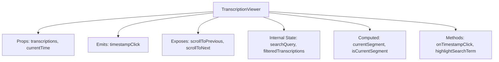
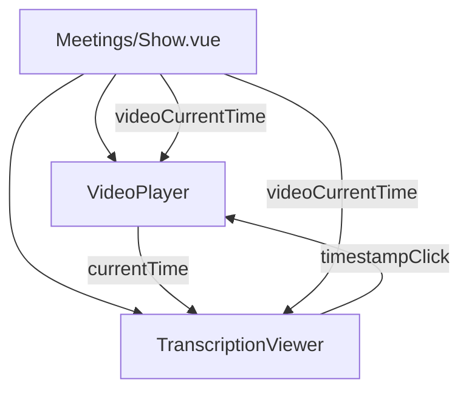
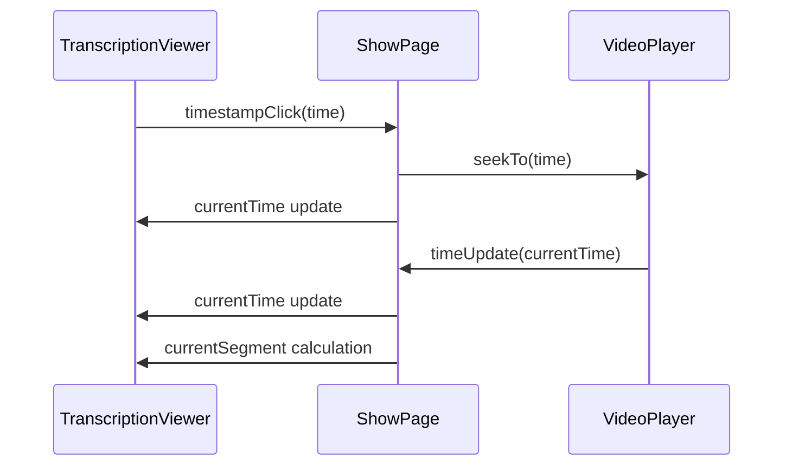
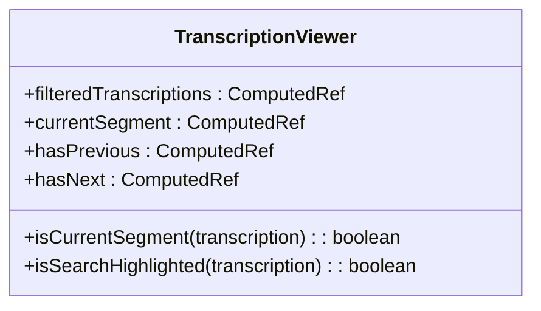
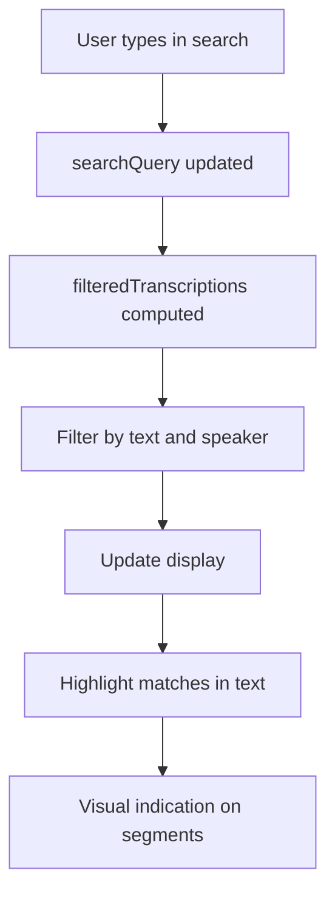
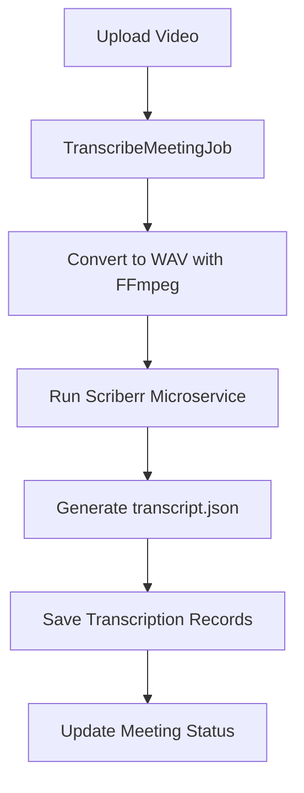

# TranscriptionViewer


## Table of Contents
1. [Introduction](#introduction)
2. [Component Architecture](#component-architecture)
3. [Transcription Data Structure](#transcription-data-structure)
4. [Integration with VideoPlayer](#integration-with-videoplayer)
5. [Internal Logic and State Management](#internal-logic-and-state-management)
6. [Search Functionality](#search-functionality)
7. [Performance Optimization](#performance-optimization)
8. [Accessibility Features](#accessibility-features)
9. [Styling with Tailwind CSS](#styling-with-tailwind-css)
10. [Common Issues and Solutions](#common-issues-and-solutions)
11. [Backend Processing Workflow](#backend-processing-workflow)

## Introduction
The TranscriptionViewer component renders segmented transcriptions with speaker identification and enables synchronized playback with the video player. It allows users to click on transcript entries to jump to specific video positions, with automatic highlighting of the current segment during playback. The component supports search functionality, keyboard navigation, and responsive design.

**Section sources**
- [TranscriptionViewer.vue](file://resources/js/lib/TranscriptionViewer.vue#L1-L246)

## Component Architecture
The TranscriptionViewer component is a Vue 3 composition API component that displays transcription segments with speaker labels, timestamps, and text content. It integrates with the VideoPlayer component through shared state management and event emission.





**Diagram sources**
- [TranscriptionViewer.vue](file://resources/js/lib/TranscriptionViewer.vue#L1-L246)

**Section sources**
- [TranscriptionViewer.vue](file://resources/js/lib/TranscriptionViewer.vue#L1-L246)

## Transcription Data Structure
The transcription data follows a consistent structure across frontend and backend components, with each segment containing speaker identification, text content, timing information, and confidence scores.

### TypeScript Interface

```typescript
interface Transcription {
  id: number
  meeting_id: number
  speaker: string
  text: string
  start_time: number
  end_time: number
  confidence: number
  created_at: string
  updated_at: string
  meeting?: Meeting
}
```


### Database Schema
The Transcription model in Laravel defines the database structure with appropriate casts for decimal values:


```php
protected $casts = [
    'start_time' => 'decimal:3',
    'end_time' => 'decimal:3',
    'confidence' => 'decimal:2',
];
```


### Backend Attributes
The model includes accessor methods for formatted display:


```php
public function getFormattedStartTimeAttribute(): string
{
    $minutes = floor($this->start_time / 60);
    $seconds = $this->start_time % 60;
    return sprintf('%02d:%05.2f', $minutes, $seconds);
}
```


**Diagram sources**
- [index.ts](file://resources/js/types/index.ts#L27-L38)
- [Transcription.php](file://app/Models/Transcription.php#L0-L49)

**Section sources**
- [index.ts](file://resources/js/types/index.ts#L27-L38)
- [Transcription.php](file://app/Models/Transcription.php#L0-L49)
- [transcript.json](file://storage/22/transcript.json)

## Integration with VideoPlayer
The TranscriptionViewer and VideoPlayer components are integrated in the Meetings/Show.vue page, creating a synchronized playback experience where transcript segments are highlighted as the video plays.

### Parent Component Integration




### Event Flow




**Diagram sources**
- [Show.vue](file://resources/js/pages/Meetings/Show.vue#L0-L344)
- [VideoPlayer.vue](file://resources/js/lib/VideoPlayer.vue#L1-L248)
- [TranscriptionViewer.vue](file://resources/js/lib/TranscriptionViewer.vue#L1-L246)

**Section sources**
- [Show.vue](file://resources/js/pages/Meetings/Show.vue#L0-L344)

## Internal Logic and State Management
The component manages several internal states and computed properties to provide a responsive user experience.

### State Variables
- `transcriptionContainer`: Reference to the scrollable container
- `transcriptionRefs`: Map of segment IDs to DOM elements
- `searchQuery`: Current search input value
- `currentSegmentIndex`: Index of the currently active segment

### Computed Properties




### Key Methods
- `setTranscriptionRef()`: Maps segment IDs to their DOM elements
- `onTimestampClick()`: Emits timestamp click event
- `scrollToCurrentSegment()`: Scrolls the current segment into view
- `formatTime()`: Formats seconds into HH:MM:SS or MM:SS format
- `formatDuration()`: Formats duration for display

**Diagram sources**
- [TranscriptionViewer.vue](file://resources/js/lib/TranscriptionViewer.vue#L1-L246)

**Section sources**
- [TranscriptionViewer.vue](file://resources/js/lib/TranscriptionViewer.vue#L1-L246)

## Search Functionality
The component includes robust search functionality that filters transcription segments and highlights matching text.

### Search Implementation




### Highlighting Logic
The `highlightSearchTerm` function uses regex to wrap matching text in mark elements:


```typescript
const highlightSearchTerm = (text: string): string => {
  if (!searchQuery.value.trim()) return text
  const query = searchQuery.value.trim()
  const regex = new RegExp(`(${query})`, 'gi')
  return text.replace(regex, '<mark class="bg-yellow-200 px-1 rounded">$1</mark>')
}
```


**Diagram sources**
- [TranscriptionViewer.vue](file://resources/js/lib/TranscriptionViewer.vue#L1-L246)

**Section sources**
- [TranscriptionViewer.vue](file://resources/js/lib/TranscriptionViewer.vue#L202-L208)

## Performance Optimization
The component implements several performance optimizations to handle large transcripts efficiently.

### Virtual Scrolling Alternative
While the current implementation doesn't use virtual scrolling, it employs efficient Vue reactivity patterns:

- Computed properties for filtered results
- Efficient DOM updates through Vue's reactivity system
- Direct element references for scrolling operations

### Scroll Optimization
The `scrollToCurrentSegment` function uses Vue's `nextTick` to ensure the DOM is updated before scrolling:


```typescript
const scrollToCurrentSegment = async () => {
  if (!currentSegment.value || !transcriptionContainer.value) return
  await nextTick()
  const element = transcriptionRefs.value.get(currentSegment.value.id)
  if (element) {
    element.scrollIntoView({
      behavior: 'smooth',
      block: 'center'
    })
  }
}
```


**Section sources**
- [TranscriptionViewer.vue](file://resources/js/lib/TranscriptionViewer.vue#L148-L160)

## Accessibility Features
The component includes several accessibility features to support keyboard navigation and screen readers.

### Keyboard Navigation
The component exposes methods for programmatic navigation:


```typescript
defineExpose({
  scrollToPrevious,
  scrollToNext,
  hasPrevious,
  hasNext,
  currentSegmentIndex,
  filteredTranscriptions
})
```


### Semantic HTML
- Proper heading hierarchy with h3 for the transcription title
- Descriptive labels and titles for interactive elements
- Keyboard-friendly navigation controls
- Visual focus indicators

**Section sources**
- [TranscriptionViewer.vue](file://resources/js/lib/TranscriptionViewer.vue#L1-L246)

## Styling with Tailwind CSS
The component uses Tailwind CSS for responsive, utility-first styling with a clean, modern appearance.

### Key Styling Features
- Responsive layout with max-h-96 overflow-y-auto for scrollable content
- Hover effects with hover:bg-gray-100 transition-colors
- Visual feedback for current segment with bg-blue-100 border-l-4 border-blue-500
- Search highlighting with bg-yellow-200 mark elements
- Responsive typography with text-sm, text-xs classes

### Custom Styles
The component includes scoped CSS for deep styling of mark elements:


```css
:deep(mark) {
  background-color: rgb(254 240 138);
  padding: 0.125rem 0.25rem;
  border-radius: 0.25rem;
}
```


**Section sources**
- [TranscriptionViewer.vue](file://resources/js/lib/TranscriptionViewer.vue#L238-L245)

## Common Issues and Solutions
This section addresses common issues that may arise with the TranscriptionViewer component and provides solutions.

### Desynchronization Between Transcript and Video
**Issue**: The transcript highlighting may not match the video playback position.

**Solutions**:
1. Ensure accurate timing data in transcription segments
2. Verify proper event propagation between components
3. Implement debounce for time updates to prevent rapid state changes
4. Check for floating-point precision issues in time calculations

### Handling Malformed Transcription Data
**Issue**: Invalid or missing transcription data can cause rendering issues.

**Solutions**:
1. Implement data validation in the component:

```typescript
const filteredTranscriptions = computed(() => {
  if (!searchQuery.value.trim()) {
    return props.transcriptions.filter(t => 
      t.start_time !== undefined && 
      t.end_time !== undefined && 
      t.text !== undefined
    )
  }
  // ... rest of filter logic
})
```


2. Provide fallback values for missing speaker information:

```vue
<span class="font-medium text-gray-900 text-sm">
  {{ transcription.speaker || 'Unknown Speaker' }}
</span>
```


3. Add error boundaries to prevent component crashes

**Section sources**
- [TranscriptionViewer.vue](file://resources/js/lib/TranscriptionViewer.vue#L1-L246)

## Backend Processing Workflow
The transcription data is generated through a backend processing workflow that converts video files to audio and processes them with a transcription microservice.

### Processing Pipeline




### Microservice Configuration
The transcription microservice runs in Docker with the following parameters:
- Model size: medium
- Language: ro (Romanian)
- Diarization: enabled
- Alignment: enabled
- Device: cpu
- Compute type: int8
- Threads: dynamically determined

### Transcript Output Format
The microservice produces a JSON file with segmented transcription data that is then parsed and stored in the database as individual Transcription records.

**Diagram sources**
- [TranscribeMeetingJob.php](file://app/Jobs/TranscribeMeetingJob.php#L1-L400)
- [README.md](file://transcribe-microservice/README.md#L1-L77)

**Section sources**
- [TranscribeMeetingJob.php](file://app/Jobs/TranscribeMeetingJob.php#L1-L400)
- [README.md](file://transcribe-microservice/README.md#L1-L77)
- [transcript.json](file://storage/22/transcript.json)

**Referenced Files in This Document**   
- [TranscriptionViewer.vue](file://resources/js/lib/TranscriptionViewer.vue)
- [VideoPlayer.vue](file://resources/js/lib/VideoPlayer.vue)
- [Show.vue](file://resources/js/pages/Meetings/Show.vue)
- [Transcription.php](file://app/Models/Transcription.php)
- [TranscribeMeetingJob.php](file://app/Jobs/TranscribeMeetingJob.php)
- [index.ts](file://resources/js/types/index.ts)
- [transcript.json](file://storage/22/transcript.json)
- [README.md](file://transcribe-microservice/README.md)