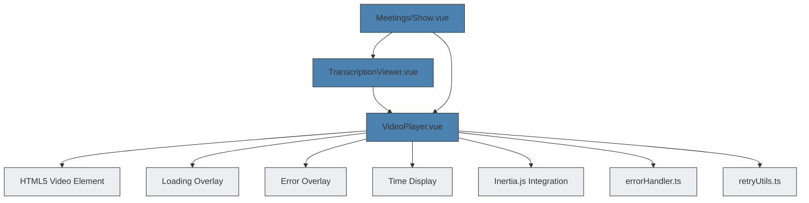
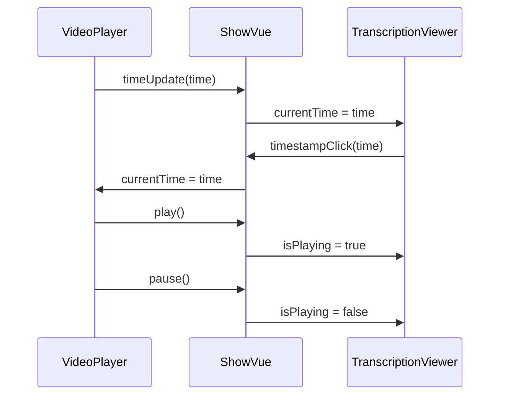

# VideoPlayer


## Table of Contents
1. [Introduction](#introduction)
2. [Core Components](#core-components)
3. [Architecture Overview](#architecture-overview)
4. [Detailed Component Analysis](#detailed-component-analysis)
5. [Integration with TranscriptionViewer](#integration-with-transcriptionviewer)
6. [Usage in Meetings/Show.vue](#usage-in-meetingsshowvue)
7. [Performance Considerations](#performance-considerations)
8. [Error Handling and Troubleshooting](#error-handling-and-troubleshooting)
9. [Accessibility and Responsive Design](#accessibility-and-responsive-design)

## Introduction
The VideoPlayer component is a Vue 3 composition API component responsible for rendering video content and managing playback controls within the meeting recording interface. It integrates with Inertia.js for server-side data synchronization and coordinates with the TranscriptionViewer component to enable synchronized navigation between video playback and transcription timestamps. The component handles loading states, error recovery, and provides a clean, accessible interface for users to interact with recorded meetings.

**Section sources**
- [VideoPlayer.vue](file://resources/js/lib/VideoPlayer.vue#L0-L247)

## Core Components

The VideoPlayer component is built using Vue 3's `<script setup>` syntax with TypeScript support. It wraps the native HTML5 `<video>` element with custom overlays for loading and error states, while exposing a clean API for parent components to control playback and synchronize with other components.

Key features include:
- **Video rendering**: Uses native HTML5 video element with responsive Tailwind CSS styling
- **State management**: Tracks playback state, duration, current time, and error conditions
- **Event emission**: Emits time updates, play/pause/ended events, and error information
- **External synchronization**: Responds to external currentTime prop changes for transcription sync
- **Error recovery**: Implements retry mechanism with user feedback via toast notifications

**Section sources**
- [VideoPlayer.vue](file://resources/js/lib/VideoPlayer.vue#L0-L247)

## Architecture Overview





**Diagram sources**
- [VideoPlayer.vue](file://resources/js/lib/VideoPlayer.vue#L0-L247)
- [TranscriptionViewer.vue](file://resources/js/lib/TranscriptionViewer.vue#L0-L245)
- [Meetings/Show.vue](file://resources/js/pages/Meetings/Show.vue#L0-L343)

## Detailed Component Analysis

### VideoPlayer.vue Implementation

The VideoPlayer component uses Vue 3's reactivity system to manage video state and respond to events from the native video element.

#### Props and Emits

```typescript
interface Props {
  videoUrl: string
  currentTime?: number
}

interface Emits {
  (e: 'timeUpdate', time: number): void
  (e: 'durationChange', duration: number): void
  (e: 'play'): void
  (e: 'pause'): void
  (e: 'ended'): void
  (e: 'error', error: Event): void
}
```


The component accepts a `videoUrl` prop to specify the video source and an optional `currentTime` prop for synchronization with transcription timestamps. It emits events for time updates, duration changes, playback state changes, and errors.

#### State Management
The component maintains several reactive state variables:
- `videoElement`: Reference to the native video element
- `isLoading`: Boolean flag for loading state
- `hasError`: Boolean flag for error state
- `duration`: Total video duration in seconds
- `currentTime`: Current playback position in seconds
- `isPlaying`: Boolean flag for playback state

#### Lifecycle and Watchers
The component uses a watcher to respond to external changes in the `currentTime` prop, ensuring synchronization with the transcription viewer:


```typescript
watch(() => props.currentTime, (newTime) => {
  if (videoElement.value && Math.abs(videoElement.value.currentTime - newTime) > 1) {
    videoElement.value.currentTime = newTime
  }
})
```


This ensures that when a user clicks on a transcription timestamp, the video player seeks to the correct position.

#### Exposed Methods
The component exposes methods for parent components to control playback:


```typescript
defineExpose({
  seekTo,
  play,
  pause,
  videoElement
})
```


These methods allow parent components to programmatically control the video player without direct access to the DOM element.

**Section sources**
- [VideoPlayer.vue](file://resources/js/lib/VideoPlayer.vue#L0-L247)

## Integration with TranscriptionViewer

The VideoPlayer component works in tandem with the TranscriptionViewer component to provide synchronized playback and navigation. This integration is facilitated through shared state and event communication.

### Synchronization Mechanism
The components are synchronized through a shared `videoCurrentTime` ref in the parent component (Meetings/Show.vue). When the video plays, it emits `timeUpdate` events that update this shared state, which is then passed to the TranscriptionViewer as a prop. Conversely, when a user clicks on a transcription segment, the TranscriptionViewer emits a `timestampClick` event that updates the shared state, which the VideoPlayer responds to by seeking to the new time.

### Event Flow




**Diagram sources**
- [VideoPlayer.vue](file://resources/js/lib/VideoPlayer.vue#L0-L247)
- [TranscriptionViewer.vue](file://resources/js/lib/TranscriptionViewer.vue#L0-L245)
- [Meetings/Show.vue](file://resources/js/pages/Meetings/Show.vue#L0-L343)

## Usage in Meetings/Show.vue

The VideoPlayer component is used in the Meetings/Show.vue page, which displays recorded meetings with synchronized transcription viewing.

### Layout Strategy
The component implements a responsive layout that adapts to screen size:
- On large screens (≥1024px): Video and transcription are displayed side-by-side in a two-column layout
- On smaller screens: Components are stacked vertically in a single-column layout

This is achieved through Tailwind CSS grid classes and a computed property that detects screen size:


```typescript
const isLargeScreen = computed(() => {
    if (typeof window === 'undefined') return true
    return window.innerWidth >= 1024 // lg breakpoint
})
```


### Component Integration
The VideoPlayer is integrated with several other components:
- **AppLayout**: Main application layout wrapper
- **MeetingStatusBadge**: Displays meeting processing status
- **TranscriptionViewer**: Synchronized transcription display
- **Link**: Inertia.js link component for navigation

### State Synchronization
The parent component maintains shared state for synchronization:


```typescript
const videoCurrentTime = ref(0)
const videoDuration = ref(0)
const isVideoPlaying = ref(false)
```


These refs are passed to both the VideoPlayer and TranscriptionViewer components, enabling bidirectional synchronization.

**Section sources**
- [Meetings/Show.vue](file://resources/js/pages/Meetings/Show.vue#L0-L343)

## Performance Considerations

The VideoPlayer component implements several performance optimizations to ensure smooth playback and efficient resource usage.

### Lazy Loading
While not explicitly implemented in the component, the video element's native loading behavior combined with Inertia.js server-side rendering ensures that videos are only loaded when the page is accessed. The component's loading overlay provides visual feedback during video loading.

### Memory Management
The component properly cleans up event listeners and intervals when unmounted:


```typescript
onUnmounted(() => {
    if (statusInterval) {
        clearInterval(statusInterval)
    }
})
```


This prevents memory leaks when navigating away from the page.

### Buffering Strategy
The component relies on the browser's native video buffering mechanisms, which automatically manage preload behavior based on the `preload` attribute (default behavior is "metadata" for the video element). This balances quick startup with bandwidth efficiency.

### Rendering Optimization
The component uses Vue's reactivity system efficiently:
- Computed properties for derived state
- Event delegation through the native video element
- Minimal DOM updates through reactive refs

**Section sources**
- [VideoPlayer.vue](file://resources/js/lib/VideoPlayer.vue#L0-L247)
- [Meetings/Show.vue](file://resources/js/pages/Meetings/Show.vue#L0-L343)

## Error Handling and Troubleshooting

The VideoPlayer component implements comprehensive error handling to provide a resilient user experience.

### Error Detection
The component listens for the native video element's error event and extracts detailed error information:


```typescript
const onError = (error: Event) => {
    isLoading.value = false
    hasError.value = true
    
    const videoError = videoElement.value?.error
    if (videoError) {
        console.error('Video error:', {
            code: videoError.code,
            message: videoError.message,
            url: props.videoUrl
        })
    }
}
```


### Error Types
The component handles four types of media errors:
- **MEDIA_ERR_ABORTED**: Loading was aborted
- **MEDIA_ERR_NETWORK**: Network error during loading
- **MEDIA_ERR_DECODE**: Video format not supported or corrupted
- **MEDIA_ERR_SRC_NOT_SUPPORTED**: Video format not supported by browser

### User Feedback
For each error type, the component provides user-friendly messages and suggestions through the toast notification system:


```typescript
window.toast.error(
    errorMessage,
    suggestions.join(' • '),
    {
        actions: [
            {
                label: 'Retry',
                handler: retryLoad,
                primary: true
            }
        ]
    }
)
```


### Recovery Mechanism
The component implements a retry mechanism that clears the video source and reloads it:


```typescript
const retryLoad = () => {
    if (videoElement.value) {
        hasError.value = false
        isLoading.value = true
        
        videoElement.value.removeAttribute('src')
        videoElement.value.load()
        
        setTimeout(() => {
            if (videoElement.value) {
                videoElement.value.src = props.videoUrl
                videoElement.value.load()
            }
        }, 100)
    }
}
```


This approach often resolves transient network issues or loading problems.

**Section sources**
- [VideoPlayer.vue](file://resources/js/lib/VideoPlayer.vue#L0-L247)
- [errorHandler.ts](file://resources/js/lib/errorHandler.ts#L0-L325)

## Accessibility and Responsive Design

The VideoPlayer component implements several accessibility and responsive design features to ensure usability across devices and for users with different needs.

### Accessibility Features
- **Keyboard controls**: The native video element provides built-in keyboard accessibility (space to play/pause, arrow keys to seek)
- **Screen reader support**: Semantic HTML structure with appropriate labels
- **Focus management**: Visual focus indicators for interactive elements
- **Color contrast**: Sufficient contrast between text and background in overlays

### Responsive Design
The component uses Tailwind CSS for responsive styling:
- **Flexible container**: `w-full h-auto` ensures the video scales to container width
- **Responsive overlays**: Absolute positioning ensures overlays work at all screen sizes
- **Adaptive layout**: Integration with parent component's responsive grid system

### User Experience
The component provides several UX enhancements:
- **Loading feedback**: Animated spinner with "Loading video..." text
- **Error recovery**: Clear error messages with retry button
- **Time display**: Formatted current time and duration
- **Playback status**: Visual indication of playing/paused state

**Section sources**
- [VideoPlayer.vue](file://resources/js/lib/VideoPlayer.vue#L0-L247)
- [Meetings/Show.vue](file://resources/js/pages/Meetings/Show.vue#L0-L343)

**Referenced Files in This Document**   
- [VideoPlayer.vue](file://resources/js/lib/VideoPlayer.vue)
- [TranscriptionViewer.vue](file://resources/js/lib/TranscriptionViewer.vue)
- [Meetings/Show.vue](file://resources/js/pages/Meetings/Show.vue)
- [errorHandler.ts](file://resources/js/lib/errorHandler.ts)