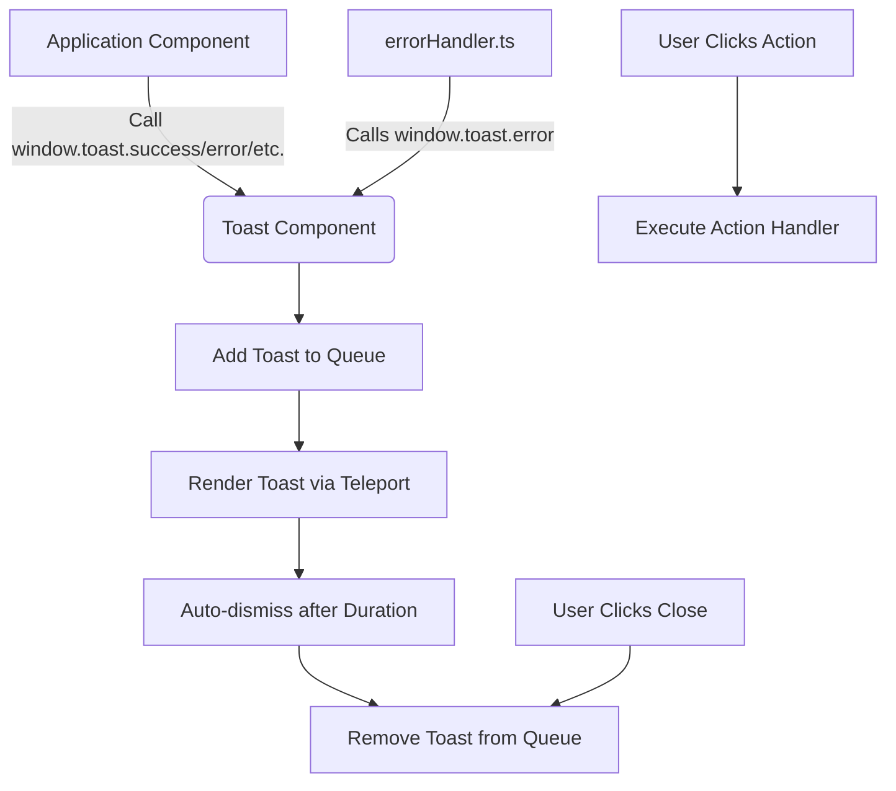
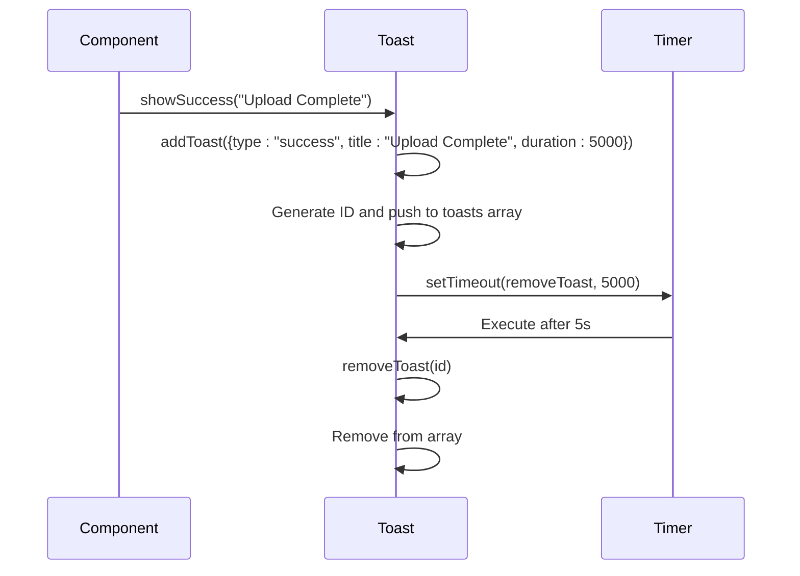
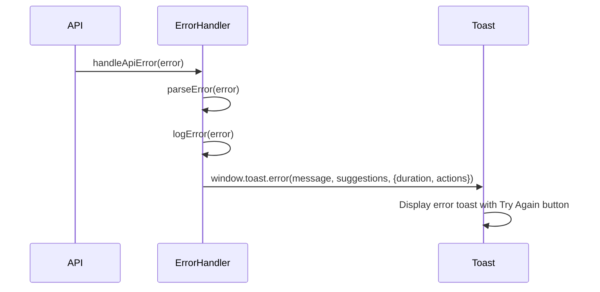

# Toast

## Table of Contents
1. [Introduction](#introduction)
2. [Core Components](#core-components)
3. [Architecture Overview](#architecture-overview)
4. [Detailed Component Analysis](#detailed-component-analysis)
5. [Integration with Error Handling](#integration-with-error-handling)
6. [Accessibility and User Experience](#accessibility-and-user-experience)
7. [Customization Options](#customization-options)
8. [Troubleshooting Guide](#troubleshooting-guide)

## Introduction
The Toast component is a user interface element designed to display temporary notifications in response to user actions or system events. It provides visual feedback for operations such as successful file uploads, errors, warnings, and informational messages. Implemented using Vue 3's Composition API with TypeScript, the component supports multiple toast types, customizable durations, and action buttons. Toasts are managed through a queue system and displayed using smooth animations powered by Vue's transition system. The component is globally accessible, enabling any part of the application to trigger notifications without direct imports.

## Core Components

The Toast component consists of several key parts: a reactive toast queue, methods for adding and removing toasts, predefined convenience functions for common toast types (success, error, warning, info), and global exposure via the `window.toast` object. It uses Tailwind CSS for styling and Vue's Teleport feature to render outside the main app container, ensuring visibility regardless of the current view's z-index.

**Section sources**
- [Toast.vue](file://resources/js/lib/Toast.vue#L1-L251)

## Architecture Overview

**Diagram sources**
- [Toast.vue](file://resources/js/lib/Toast.vue#L1-L251)
- [errorHandler.ts](file://resources/js/lib/errorHandler.ts#L1-L325)

## Detailed Component Analysis

### Toast Interface and Props
The Toast component defines a TypeScript interface that specifies the structure of each toast message:

**:Toast Interface**
- **id**: string - Unique identifier generated using random string
- **type**: 'success' | 'error' | 'warning' | 'info' - Visual category determining color and icon
- **title**: string - Primary message text (required)
- **message**: string (optional) - Secondary descriptive text
- **duration**: number (optional) - Time in milliseconds before auto-dismissal (default: 5000)
- **actions**: Array of ToastAction objects with label, handler function, and optional primary flag

**:ToastAction Interface**
- **label**: string - Text displayed on the button
- **handler**: () => void - Function executed when button is clicked
- **primary**: boolean (optional) - If true, renders as a primary (blue) button

**Section sources**
- [Toast.vue](file://resources/js/lib/Toast.vue#L154-L161)

### Queue Management System
The component maintains a reactive array of toasts using Vue's `ref`. When a new toast is added, it is assigned a unique ID and pushed into the queue. The system automatically removes toasts after their specified duration unless duration is set to 0.

**:Queue Methods**
- **addToast**: Adds a new toast to the queue, assigns ID, and sets up auto-removal timer
- **removeToast**: Removes a toast by ID using array splice
- **clearAll**: Clears all toasts from the queue
- **showSuccess/showError/showWarning/showInfo**: Convenience wrappers for common toast types

The queue is rendered using Vue's `TransitionGroup` to animate the addition and removal of multiple toasts.

**Diagram sources**
- [Toast.vue](file://resources/js/lib/Toast.vue#L165-L186)

**Section sources**
- [Toast.vue](file://resources/js/lib/Toast.vue#L157-L209)

### Animation and Transitions
The Toast component uses Vue's built-in transition system to provide smooth entrance and exit animations. The `TransitionGroup` component wraps the list of toasts, applying CSS classes for different transition states.

**:Transition Classes**
- **toast-enter-active**: Applied during enter transition (0.3s ease)
- **toast-enter-from**: Initial state - fully transparent and translated right
- **toast-leave-to**: Final state - fully transparent and translated right
- **toast-move**: Applied when toasts reorder (0.3s ease)

These transitions create a sliding effect from right to left when toasts appear and disappear.

**Section sources**
- [Toast.vue](file://resources/js/lib/Toast.vue#L206-L251)

### Styling and Visual Hierarchy
The component uses Tailwind CSS utility classes to create a clean, modern design with appropriate visual hierarchy:

**:Styling Features**
- **Positioning**: Fixed to top-right corner (`top-4 right-4`)
- **Spacing**: Vertical spacing between toasts (`space-y-2`)
- **Card Design**: White background, shadow, rounded corners, ring border
- **Type-based Styling**: Left border color varies by type (green=success, red=error, yellow=warning, blue=info)
- **Typography**: Small font size, appropriate text colors for readability
- **Icons**: SVG icons for each toast type (checkmark, cross, exclamation, info)
- **Close Button**: Accessible close button with screen reader text

The design ensures high visibility while maintaining a non-intrusive presence.

**Section sources**
- [Toast.vue](file://resources/js/lib/Toast.vue#L0-L35)

## Integration with Error Handling

The Toast component is tightly integrated with the application's error handling system through `errorHandler.ts`. This integration allows automatic display of user-friendly error messages when exceptions occur.

**:Error Handling Flow**
1. An error occurs in the application
2. `errorHandler.handleError()` parses the error and categorizes it
3. `errorHandler.showErrorNotification()` calls `window.toast.error()`
4. Toast displays with appropriate message and duration
5. For recoverable errors, a "Try Again" action button is provided

**:Special Behavior by Error Type**
- **Network errors**: Duration set to 0 (persistent until user action)
- **Validation errors**: Suggest corrective actions
- **Server errors**: Recommend retry after waiting
- **Client errors**: Suggest page refresh

This integration ensures consistent error presentation across the application.

**Diagram sources**
- [errorHandler.ts](file://resources/js/lib/errorHandler.ts#L237-L290)

**Section sources**
- [errorHandler.ts](file://resources/js/lib/errorHandler.ts#L188-L325)

## Accessibility and User Experience

The Toast component includes several accessibility features to ensure usability for all users:

**:Accessibility Features**
- **Keyboard Dismissal**: Focusable close button with keyboard navigation
- **Screen Reader Support**: "Close" text marked with `sr-only` class
- **Focus Management**: Close button receives focus when toast appears
- **ARIA Roles**: Implicit roles through semantic HTML
- **Color Contrast**: Sufficient contrast between text and background
- **Motion Considerations**: Smooth but not excessive animations

**:User Experience Considerations**
- **Auto-dismiss**: Toasts disappear after default 5 seconds (configurable)
- **Manual Dismissal**: Users can close individual toasts
- **Stacking**: Multiple toasts stack vertically without overlapping
- **Non-blocking**: Toasts don't prevent interaction with the rest of the UI
- **Global Availability**: Accessible from any component via `window.toast`

These features ensure that notifications are helpful without being disruptive.

**Section sources**
- [Toast.vue](file://resources/js/lib/Toast.vue#L121-L124)

## Customization Options

The Toast component offers several customization options for different use cases:

**:Positioning**
- Currently fixed to top-right corner
- Position could be customized by modifying the wrapper div classes
- Potential enhancement: Support for different positions (top-left, bottom-right, etc.)

**:Theming**
- Colors are based on Tailwind's color palette
- Theme could be extended by adding custom color variants
- Supports dark mode through application-wide theme system

**:Behavior**
- Duration can be customized per toast (including persistent toasts with duration: 0)
- Action buttons can be added with custom handlers
- Types can be extended with additional variants

**:Global Methods**
The component exposes a global API through `window.toast`:
- **toast.success(title, message, options)**
- **toast.error(title, message, options)**
- **toast.warning(title, message, options)**
- **toast.info(title, message, options)**
- **toast.remove(id)**
- **toast.clear()**

This global registration pattern enables easy access from any JavaScript context.

**Section sources**
- [Toast.vue](file://resources/js/lib/Toast.vue#L206-L251)

## Troubleshooting Guide

### Common Issues and Solutions

**:Toast Stacking Issues**
- **Problem**: Toasts overlap or display incorrectly when many appear rapidly
- **Solution**: The component uses `TransitionGroup` with proper spacing; ensure no CSS conflicts
- **Prevention**: Limit rapid toast creation in application logic

**:Memory Leaks**
- **Problem**: Toasts not being properly cleaned up
- **Analysis**: The component uses `setTimeout` with proper cleanup in `removeToast`
- **Verification**: Each toast has a corresponding removal mechanism
- **Risk Assessment**: Low risk of memory leaks due to proper array management and timer cleanup

**:Global Registration Conflicts**
- **Problem**: `window.toast` might conflict with other libraries
- **Solution**: The component checks `typeof window !== 'undefined'` before assignment
- **Best Practice**: The global registration occurs only once on component mount

**:Accessibility Concerns**
- **Problem**: Screen reader users might miss transient toasts
- **Solution**: Consider adding ARIA live regions for critical notifications
- **Enhancement**: Add keyboard shortcuts for dismissing all toasts

**:Integration Issues**
- **Problem**: `errorHandler.ts` calls `window.toast` before it's available
- **Solution**: The errorHandler checks for `window.toast` existence before calling
- **Timing**: Toast component should be initialized early in the application lifecycle

**Section sources**
- [Toast.vue](file://resources/js/lib/Toast.vue#L157-L209)
- [errorHandler.ts](file://resources/js/lib/errorHandler.ts#L237-L290)

**Referenced Files in This Document**   
- [Toast.vue](file://resources/js/lib/Toast.vue)
- [errorHandler.ts](file://resources/js/lib/errorHandler.ts)