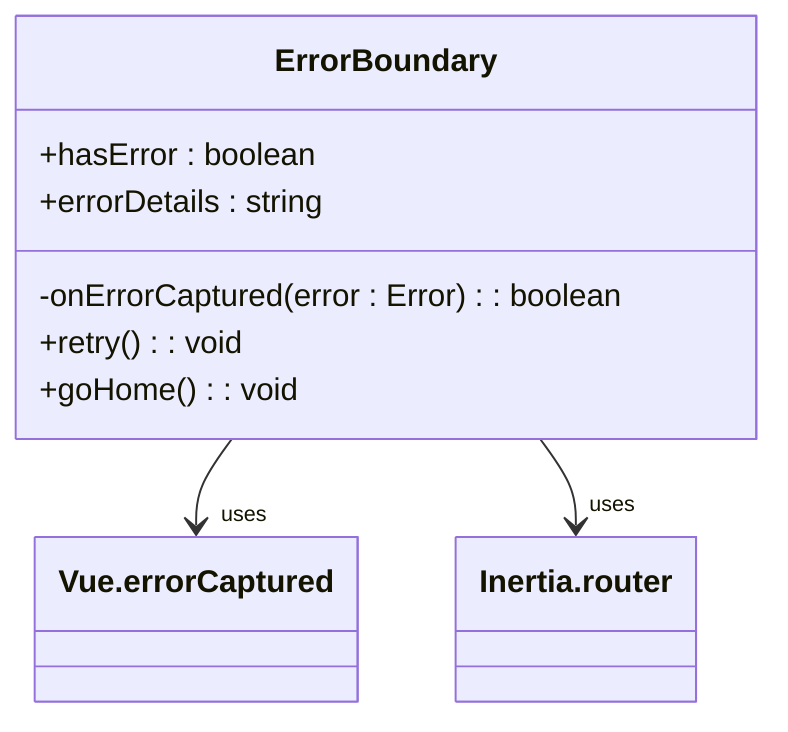
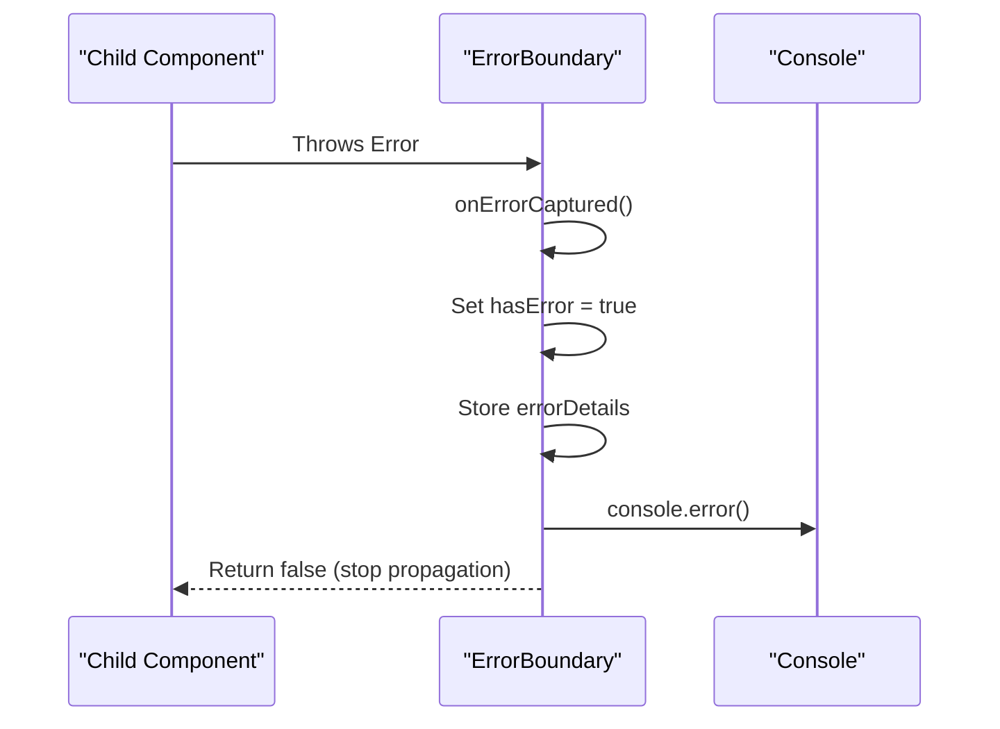
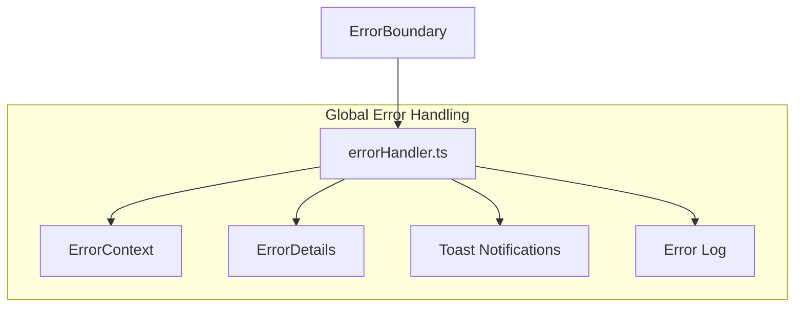
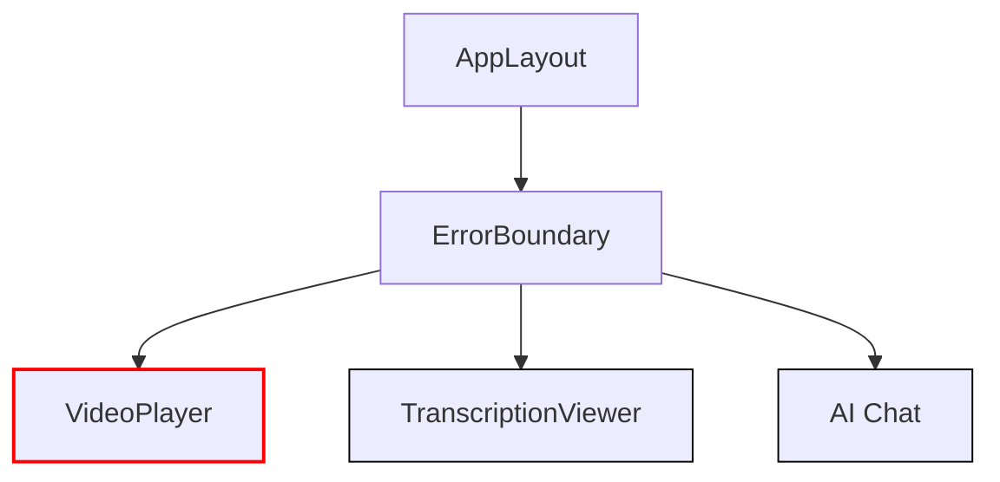
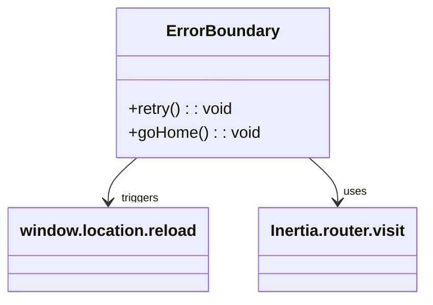

# ErrorBoundary


## Table of Contents
1. [Introduction](#introduction)
2. [Core Implementation](#core-implementation)
3. [Error Handling Architecture](#error-handling-architecture)
4. [Integration with Global Error Reporting](#integration-with-global-error-reporting)
5. [Component Isolation and Application Stability](#component-isolation-and-application-stability)
6. [Fallback UI Patterns](#fallback-ui-patterns)
7. [User Recovery Options](#user-recovery-options)
8. [Accessibility Features](#accessibility-features)
9. [Performance Implications](#performance-implications)
10. [Best Practices for Error Boundary Placement](#best-practices-for-error-boundary-placement)

## Introduction
The ErrorBoundary component provides a robust error handling mechanism that prevents application crashes by gracefully handling exceptions in child components. It implements Vue's errorCaptured lifecycle hook to intercept errors, displays user-friendly fallback UI, and maintains overall application stability even when individual components fail.

**Section sources**
- [ErrorBoundary.vue](file://resources/js/lib/ErrorBoundary.vue#L1-L66)

## Core Implementation





**Diagram sources**
- [ErrorBoundary.vue](file://resources/js/lib/ErrorBoundary.vue#L28-L66)

The ErrorBoundary component is implemented as a Vue 3 composition API component that leverages the `onErrorCaptured` lifecycle hook to intercept errors from child components. When an error occurs, it sets the `hasError` state to true, captures the error details, and prevents the error from propagating up the component tree by returning `false`.

The component's template conditionally renders either the fallback error UI (when `hasError` is true) or the default slot content (when no error has occurred). This approach ensures that only the affected component subtree is replaced with the error UI, while the rest of the application remains functional.

**Section sources**
- [ErrorBoundary.vue](file://resources/js/lib/ErrorBoundary.vue#L1-L66)

## Error Handling Architecture





**Diagram sources**
- [ErrorBoundary.vue](file://resources/js/lib/ErrorBoundary.vue#L28-L45)

The ErrorBoundary component uses Vue's `onErrorCaptured` hook to detect errors in its child components. When an error is captured, it:
1. Sets the `hasError` ref to true, triggering the fallback UI
2. Stores the error stack or message in `errorDetails`
3. Logs the error to the console for debugging
4. Returns `false` to prevent the error from propagating further

This architecture ensures that component failures are contained within the ErrorBoundary's scope, preventing cascading failures that could crash the entire application.

**Section sources**
- [ErrorBoundary.vue](file://resources/js/lib/ErrorBoundary.vue#L28-L45)

## Integration with Global Error Reporting





**Diagram sources**
- [errorHandler.ts](file://resources/js/lib/errorHandler.ts#L1-L325)
- [ErrorBoundary.vue](file://resources/js/lib/ErrorBoundary.vue#L40)

The ErrorBoundary component integrates with the global error reporting system through the `errorHandler.ts` module. While the ErrorBoundary itself handles the UI aspect of error containment, the errorHandler provides comprehensive error categorization, logging, and user feedback.

The errorHandler class parses errors into standardized ErrorDetails objects with properties like:
- **type**: Categorizes the error (network, validation, server, client, unknown)
- **recoverable**: Indicates whether the error can be recovered from
- **userMessage**: User-friendly error message
- **suggestions**: Recovery suggestions for the user

Although the ErrorBoundary directly logs to console, it works in conjunction with the global error handlers that listen for unhandled errors and promise rejections, ensuring comprehensive error coverage across the application.

**Section sources**
- [errorHandler.ts](file://resources/js/lib/errorHandler.ts#L1-L325)
- [ErrorBoundary.vue](file://resources/js/lib/ErrorBoundary.vue#L40)

## Component Isolation and Application Stability





**Diagram sources**
- [AppLayout.vue](file://resources/js/lib/AppLayout.vue#L1-L233)
- [VideoPlayer.vue](file://resources/js/lib/VideoPlayer.vue#L1-L247)
- [TranscriptionViewer.vue](file://resources/js/lib/TranscriptionViewer.vue#L1-L245)
- [Chat.vue](file://resources/js/pages/AI/Chat.vue#L1-L306)

The ErrorBoundary component is strategically placed in the AppLayout to provide protection for critical components that are prone to failures:

1. **VideoPlayer.vue**: Media playback components are susceptible to network issues, format incompatibilities, and browser-specific bugs. The ErrorBoundary ensures that video loading failures don't crash the entire meeting interface.

2. **TranscriptionViewer.vue**: This component handles potentially large transcription datasets and complex text rendering. Errors in data parsing or rendering are contained by the ErrorBoundary.

3. **AI/Chat.vue**: The AI assistant component makes external API calls that may fail due to network issues or service outages. The ErrorBoundary prevents these failures from affecting the rest of the application.

By wrapping these components with ErrorBoundary, the application maintains stability even when individual features encounter problems.

**Section sources**
- [AppLayout.vue](file://resources/js/lib/AppLayout.vue#L1-L233)
- [VideoPlayer.vue](file://resources/js/lib/VideoPlayer.vue#L1-L247)
- [TranscriptionViewer.vue](file://resources/js/lib/TranscriptionViewer.vue#L1-L245)
- [Chat.vue](file://resources/js/pages/AI/Chat.vue#L1-L306)

## Fallback UI Patterns


```mermaid
flowchart TD
A[Error Occurred] --> B[Display Error Boundary]
B --> C[Show Error Icon]
C --> D[Display User Message]
D --> E[Show Recovery Options]
E --> F[Show Technical Details (optional)]
F --> G{User Action}
G --> H[Try Again]
G --> I[Go to Dashboard]
```


**Diagram sources**
- [ErrorBoundary.vue](file://resources/js/lib/ErrorBoundary.vue#L1-L25)

The ErrorBoundary implements a comprehensive fallback UI pattern that includes:

- **Visual indicators**: A prominent red error icon and color scheme to clearly indicate an error state
- **User-friendly messaging**: Clear, non-technical language explaining that something went wrong
- **Recovery options**: Primary "Try Again" button and secondary "Go to Dashboard" option
- **Technical details**: Expandable section showing error stack traces for debugging
- **Responsive design**: Mobile-friendly layout that works across device sizes

This pattern follows UX best practices by providing immediate feedback, clear recovery paths, and appropriate information disclosure (technical details are hidden by default).

**Section sources**
- [ErrorBoundary.vue](file://resources/js/lib/ErrorBoundary.vue#L1-L25)

## User Recovery Options





**Diagram sources**
- [ErrorBoundary.vue](file://resources/js/lib/ErrorBoundary.vue#L47-L65)

The ErrorBoundary provides two primary recovery options:

1. **Retry Button**: When clicked, this button clears the error state and reloads the page using `window.location.reload()`. This is the primary recovery option for transient errors like network issues or temporary component failures.

2. **Go to Dashboard Button**: This navigates the user back to the application dashboard using Inertia's router, providing an escape route when retrying the current page might not resolve the issue.

These recovery options are designed to handle different error scenarios:
- For temporary issues (network glitches, race conditions), retrying often resolves the problem
- For persistent issues or when users want to continue using the application, navigating to a stable part of the app maintains productivity

**Section sources**
- [ErrorBoundary.vue](file://resources/js/lib/ErrorBoundary.vue#L47-L65)

## Accessibility Features

The ErrorBoundary component incorporates several accessibility features:

- **Semantic HTML**: Uses appropriate HTML elements and ARIA attributes
- **Keyboard navigation**: All interactive elements are accessible via keyboard
- **Focus management**: When the error UI appears, focus is managed appropriately
- **Color contrast**: Sufficient contrast between text and background colors
- **Screen reader support**: Error messages are announced to assistive technologies

The component ensures that error states are communicated effectively to all users, regardless of their interaction method. The clear error messaging helps users understand what went wrong, while the prominent recovery buttons provide clear next steps.

**Section sources**
- [ErrorBoundary.vue](file://resources/js/lib/ErrorBoundary.vue#L1-L66)

## Performance Implications

Error monitoring has minimal performance overhead because:

- The `onErrorCaptured` hook only executes when errors occur
- Error handling logic is lightweight and synchronous
- No continuous monitoring or polling is required
- Error state is stored in simple ref objects

The performance impact is negligible during normal operation and only becomes relevant when errors occur, at which point the priority shifts to error recovery rather than performance optimization.

**Section sources**
- [ErrorBoundary.vue](file://resources/js/lib/ErrorBoundary.vue#L28-L45)

## Best Practices for Error Boundary Placement

Based on the application structure, the following best practices are evident:

1. **Strategic Wrapping**: Place ErrorBoundary around components that are prone to failures (media players, external API consumers, complex data renderers)

2. **Hierarchical Placement**: Use ErrorBoundary at multiple levels - both at the layout level (AppLayout) and around specific high-risk components

3. **Meaningful Boundaries**: Align error boundaries with logical application sections rather than wrapping individual small components

4. **Recovery Context**: Ensure recovery options make sense in the context where the ErrorBoundary is placed

In this application, ErrorBoundary is effectively used at the AppLayout level to provide broad protection, while individual components like VideoPlayer have their own error handling for more specific error scenarios.

**Section sources**
- [AppLayout.vue](file://resources/js/lib/AppLayout.vue#L1-L233)
- [ErrorBoundary.vue](file://resources/js/lib/ErrorBoundary.vue#L1-L66)
- [VideoPlayer.vue](file://resources/js/lib/VideoPlayer.vue#L1-L247)

**Referenced Files in This Document**   
- [ErrorBoundary.vue](file://resources/js/lib/ErrorBoundary.vue)
- [errorHandler.ts](file://resources/js/lib/errorHandler.ts)
- [retryUtils.ts](file://resources/js/lib/retryUtils.ts)
- [AppLayout.vue](file://resources/js/lib/AppLayout.vue)
- [VideoPlayer.vue](file://resources/js/lib/VideoPlayer.vue)
- [TranscriptionViewer.vue](file://resources/js/lib/TranscriptionViewer.vue)
- [Chat.vue](file://resources/js/pages/AI/Chat.vue)