# Pages Structure


## Table of Contents
1. [Introduction](#introduction)
2. [Project Structure](#project-structure)
3. [Core Components](#core-components)
4. [Architecture Overview](#architecture-overview)
5. [Detailed Component Analysis](#detailed-component-analysis)
6. [Inertia.js Integration and Routing](#inertiajs-integration-and-routing)
7. [Data Fetching and Form Handling](#data-fetching-and-form-handling)
8. [Navigation and Conditional Rendering](#navigation-and-conditional-rendering)
9. [SEO and Server-Side Rendering](#seo-and-server-side-rendering)
10. [Conclusion](#conclusion)

## Introduction
This document provides a comprehensive analysis of the page-level components in the Vue.js frontend of the MeetingAI application. It details the routing and organization of top-level views, including Dashboard.vue as the application home, Welcome.vue for onboarding, Meetings pages for upload and playback workflows, Clients pages for organization management, and AI/Chat.vue for conversational search. The document explains how Inertia.js connects Laravel routes to these components, describes data fetching patterns, form submissions, navigation flows, conditional rendering, and integration with library components.

## Project Structure
The frontend page components are organized in a feature-based structure within the `resources/js/pages` directory. This structure groups related components by their functional domain, making it easier to locate and maintain code. The main categories are AI, Clients, and Meetings, along with top-level pages like Dashboard and Welcome.


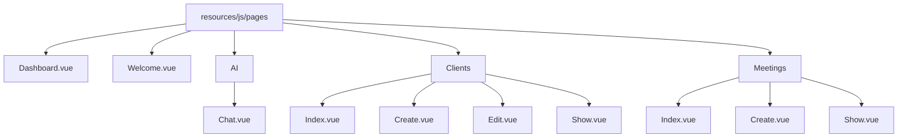


**Diagram sources**
- [Dashboard.vue](file://resources/js/pages/Dashboard.vue)
- [Welcome.vue](file://resources/js/pages/Welcome.vue)
- [AI/Chat.vue](file://resources/js/pages/AI/Chat.vue)
- [Clients/Index.vue](file://resources/js/pages/Clients/Index.vue)
- [Meetings/Index.vue](file://resources/js/pages/Meetings/Index.vue)

**Section sources**
- [Dashboard.vue](file://resources/js/pages/Dashboard.vue)
- [Welcome.vue](file://resources/js/pages/Welcome.vue)
- [AI/Chat.vue](file://resources/js/pages/AI/Chat.vue)
- [Clients/Index.vue](file://resources/js/pages/Clients/Index.vue)
- [Meetings/Index.vue](file://resources/js/pages/Meetings/Index.vue)

## Core Components
The application's core page components serve distinct purposes in the user experience. Dashboard.vue provides an overview of the system's activity, Welcome.vue serves as an onboarding screen, Meetings pages handle the upload and playback workflow, Clients pages manage organization data, and AI/Chat.vue enables conversational search through meeting content.

## Architecture Overview
The application follows a hybrid architecture using Inertia.js to connect a Laravel backend with a Vue.js frontend. This allows for server-side rendering while maintaining a single-page application feel. The architecture separates concerns between routing, data fetching, component rendering, and state management.


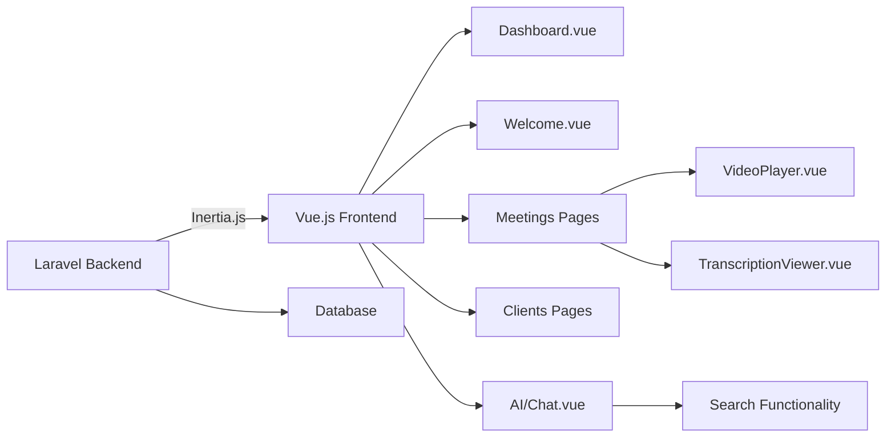


**Diagram sources**
- [app.ts](file://resources/js/app.ts)
- [Dashboard.vue](file://resources/js/pages/Dashboard.vue)
- [Welcome.vue](file://resources/js/pages/Welcome.vue)
- [Meetings/Index.vue](file://resources/js/pages/Meetings/Index.vue)
- [Clients/Index.vue](file://resources/js/pages/Clients/Index.vue)
- [AI/Chat.vue](file://resources/js/pages/AI/Chat.vue)

## Detailed Component Analysis

### Dashboard Analysis
The Dashboard.vue component serves as the application home, providing an overview of key metrics and recent activity. It displays statistics for clients and meetings, shows recent meetings in a table, and highlights top clients.


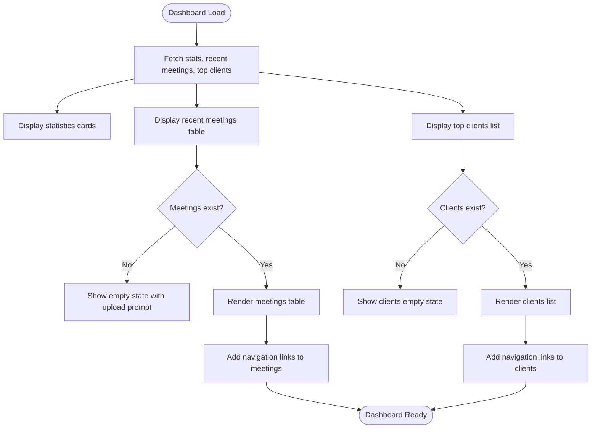


**Diagram sources**
- [Dashboard.vue](file://resources/js/pages/Dashboard.vue)

**Section sources**
- [Dashboard.vue](file://resources/js/pages/Dashboard.vue)

### Welcome Analysis
The Welcome.vue component serves as an onboarding screen for new users. It provides guidance on getting started with the application and includes links to key resources and documentation.


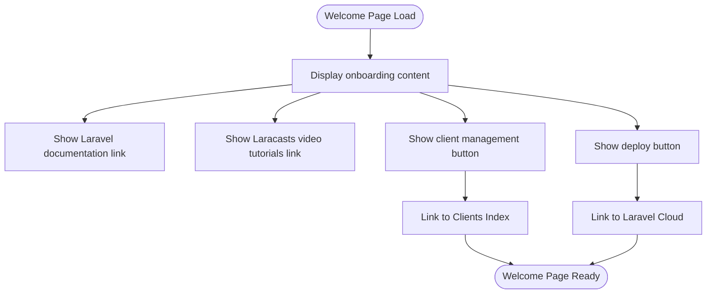


**Diagram sources**
- [Welcome.vue](file://resources/js/pages/Welcome.vue)

**Section sources**
- [Welcome.vue](file://resources/js/pages/Welcome.vue)

### Meetings Pages Analysis
The Meetings pages handle the upload and playback workflow for meeting recordings. The Index.vue component displays a list of meetings with filtering capabilities, while Show.vue provides detailed playback and transcription viewing.

#### Meetings Index Analysis
The Meetings Index.vue component displays a list of meetings with filtering and sorting capabilities. It includes a filter form for client, status, date range, and sorting options.


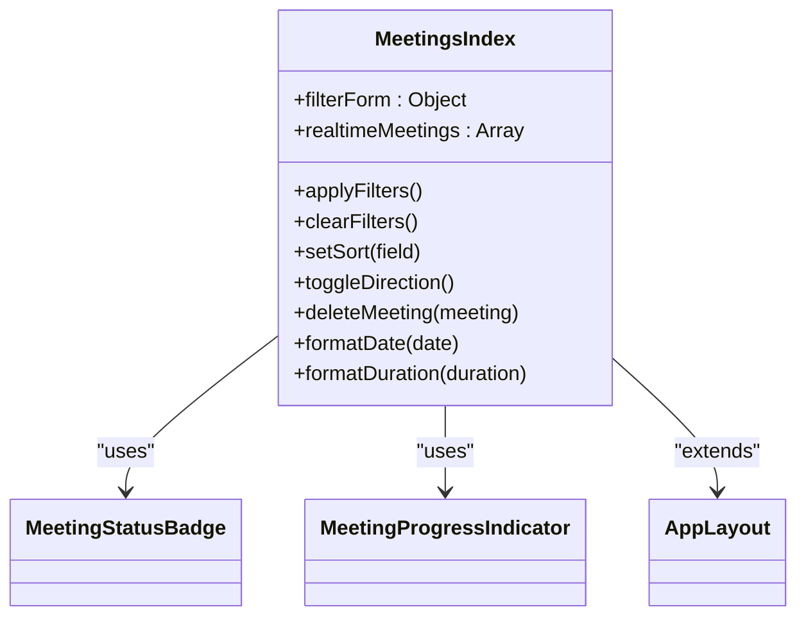


**Diagram sources**
- [Meetings/Index.vue](file://resources/js/pages/Meetings/Index.vue)

**Section sources**
- [Meetings/Index.vue](file://resources/js/pages/Meetings/Index.vue)

#### Meetings Show Analysis
The Meetings Show.vue component provides detailed playback and transcription viewing for a specific meeting. It handles different meeting statuses (pending, processing, completed) and integrates video playback with transcription synchronization.


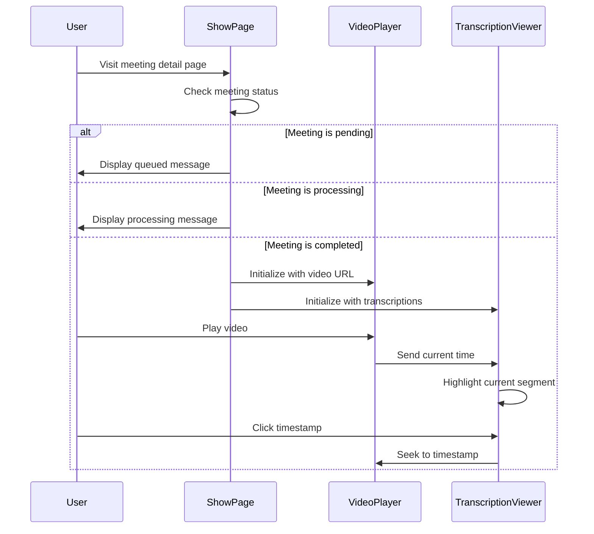


**Diagram sources**
- [Meetings/Show.vue](file://resources/js/pages/Meetings/Show.vue)

**Section sources**
- [Meetings/Show.vue](file://resources/js/pages/Meetings/Show.vue)

### Clients Pages Analysis
The Clients pages manage organization data and client accounts. The Index.vue component displays a table of clients, while Create.vue, Edit.vue, and Show.vue handle client creation, editing, and detailed viewing.

#### Clients Index Analysis
The Clients Index.vue component displays a table of clients with their associated meeting counts. It includes functionality for deleting clients, with validation to prevent deletion of clients with existing meetings.


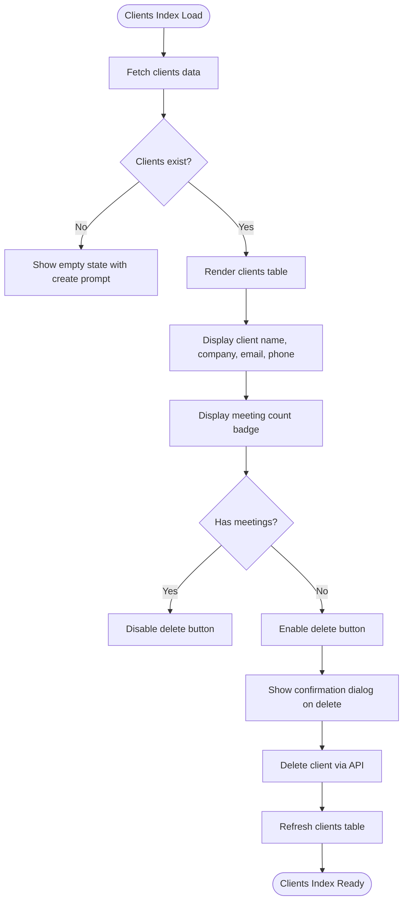


**Diagram sources**
- [Clients/Index.vue](file://resources/js/pages/Clients/Index.vue)

**Section sources**
- [Clients/Index.vue](file://resources/js/pages/Clients/Index.vue)

### AI Chat Analysis
The AI/Chat.vue component enables conversational search through meeting transcriptions. Users can ask natural language questions about meeting content, and the AI assistant returns relevant search results with context.


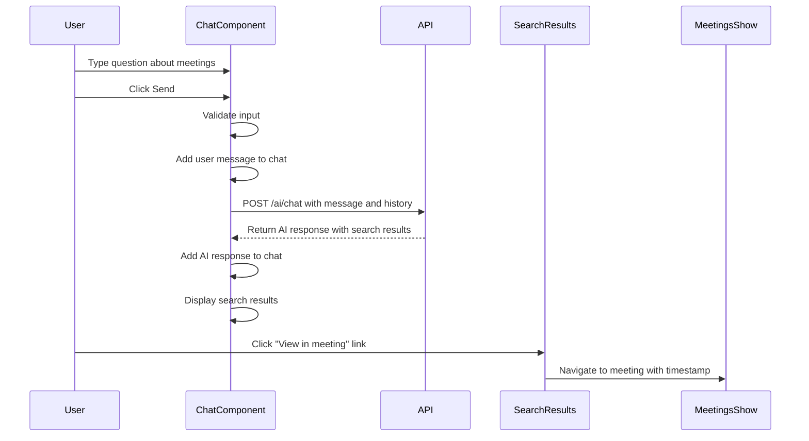


**Diagram sources**
- [AI/Chat.vue](file://resources/js/pages/AI/Chat.vue)

**Section sources**
- [AI/Chat.vue](file://resources/js/pages/AI/Chat.vue)

## Inertia.js Integration and Routing
Inertia.js serves as the bridge between the Laravel backend and Vue.js frontend, enabling seamless navigation without full page reloads. The integration is configured in app.ts, where createInertiaApp sets up the application with the necessary plugins and error handling.

The routing system uses Laravel's route names, which are referenced in Vue components using the route() helper function. This allows components to generate URLs for navigation without hardcoding paths. The HandleInertiaRequests middleware in Laravel prepares the page data that is passed to the Vue components.


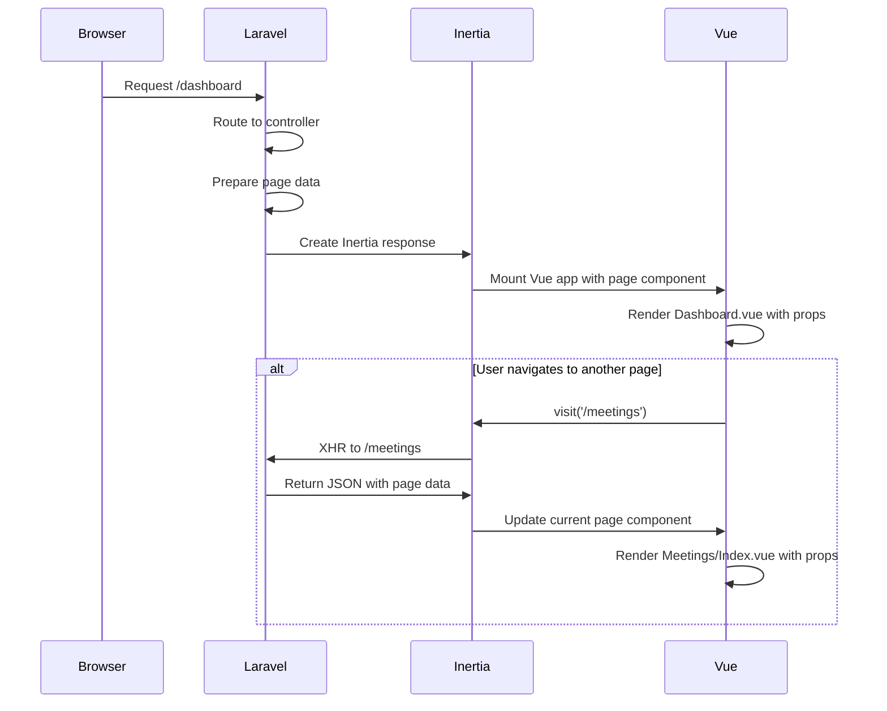


**Diagram sources**
- [app.ts](file://resources/js/app.ts)
- [HandleInertiaRequests.php](file://app/Http/Middleware/HandleInertiaRequests.php)
- [Dashboard.vue](file://resources/js/pages/Dashboard.vue)
- [Meetings/Index.vue](file://resources/js/pages/Meetings/Index.vue)

**Section sources**
- [app.ts](file://resources/js/app.ts)
- [HandleInertiaRequests.php](file://app/Http/Middleware/HandleInertiaRequests.php)

## Data Fetching and Form Handling
Data fetching in this application primarily occurs through Inertia's page props, which are passed from Laravel controllers to Vue components. When a page is loaded, the server prepares the necessary data and sends it as props to the corresponding Vue component.

Form handling follows standard Inertia patterns, with form submissions typically handled through the router object from @inertiajs/vue3. For example, in the Clients pages, form submissions for creating or editing clients use router.post() or router.put() methods to submit data to the server.


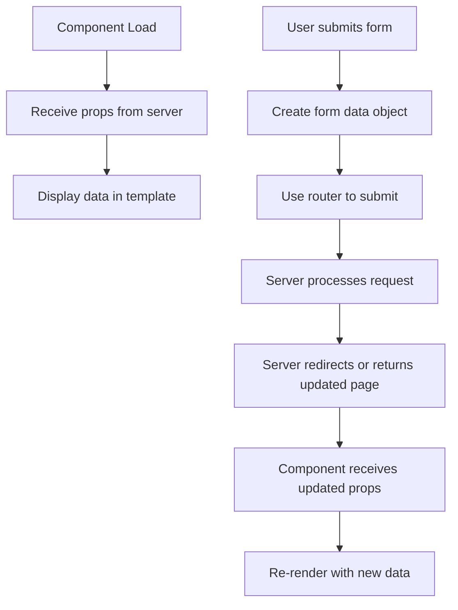


**Section sources**
- [Clients/Create.vue](file://resources/js/pages/Clients/Create.vue)
- [Clients/Edit.vue](file://resources/js/pages/Clients/Edit.vue)
- [Meetings/Create.vue](file://resources/js/pages/Meetings/Create.vue)

## Navigation and Conditional Rendering
Navigation in the application is handled through Inertia's visit() method, which is accessed via the Link component or router object. The Link component is used throughout the application for navigation between pages, providing a seamless single-page application experience.

Conditional rendering is used extensively to display different content based on user permissions, meeting status, or data availability. For example, the Meetings/Show.vue component displays different content based on whether the meeting is pending, processing, or completed.


```mermaid
flowchart TD
A[User clicks navigation link] --> B[Link component calls visit()]
B --> C[Inertia makes XHR to new URL]
C --> D[Laravel returns JSON with page data]
D --> E[Inertia updates current page component]
E --> F[Vue re-renders with new component]
G[Component loads] --> H[Check data conditions]
H --> I{Meeting status?}
I --> |Pending| J[Show queued message]
I --> |Processing| K[Show processing message]
I --> |Completed| L[Show video and transcription]
M[Check user permissions] --> N{Has permission?}
N --> |Yes| O[Show content]
N --> |No| P[Show access denied]
```


**Section sources**
- [Dashboard.vue](file://resources/js/pages/Dashboard.vue)
- [Meetings/Show.vue](file://resources/js/pages/Meetings/Show.vue)
- [Clients/Index.vue](file://resources/js/pages/Clients/Index.vue)

## SEO and Server-Side Rendering
The application supports server-side rendering (SSR) through the ssr.ts configuration file, which enables better SEO and improved initial load performance. The SSR setup uses createInertiaApp on the server side with renderToString to generate HTML on the server before sending it to the client.

The title function in both app.ts and ssr.ts ensures that page titles are properly set for SEO, with a consistent pattern of "Page Title - App Name". This helps search engines understand the content and context of each page.


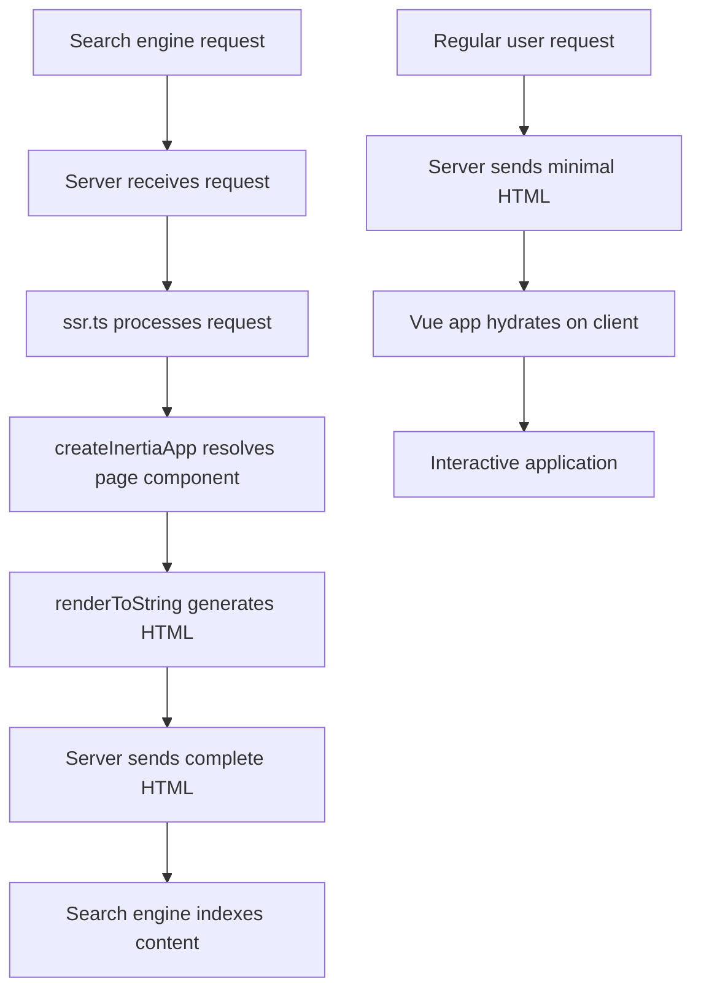


**Diagram sources**
- [ssr.ts](file://resources/js/ssr.ts)
- [app.ts](file://resources/js/app.ts)

**Section sources**
- [ssr.ts](file://resources/js/ssr.ts)
- [app.ts](file://resources/js/app.ts)

## Conclusion
The page structure of the MeetingAI application is well-organized and follows best practices for a Vue.js application integrated with Laravel via Inertia.js. The feature-based directory structure makes it easy to locate and maintain components, while the use of Inertia.js provides a seamless user experience with efficient data fetching and navigation. The application effectively handles different states and permissions through conditional rendering, and supports SEO through server-side rendering capabilities. The integration between Laravel routes and Vue components is clean and maintainable, using the route() helper for navigation and Inertia's visit() method for page transitions.

**Referenced Files in This Document**   
- [Dashboard.vue](file://resources/js/pages/Dashboard.vue)
- [Welcome.vue](file://resources/js/pages/Welcome.vue)
- [Meetings/Index.vue](file://resources/js/pages/Meetings/Index.vue)
- [Meetings/Show.vue](file://resources/js/pages/Meetings/Show.vue)
- [Meetings/Create.vue](file://resources/js/pages/Meetings/Create.vue)
- [Clients/Index.vue](file://resources/js/pages/Clients/Index.vue)
- [Clients/Show.vue](file://resources/js/pages/Clients/Show.vue)
- [Clients/Create.vue](file://resources/js/pages/Clients/Create.vue)
- [Clients/Edit.vue](file://resources/js/pages/Clients/Edit.vue)
- [AI/Chat.vue](file://resources/js/pages/AI/Chat.vue)
- [app.ts](file://resources/js/app.ts)
- [ssr.ts](file://resources/js/ssr.ts)
- [HandleInertiaRequests.php](file://app/Http/Middleware/HandleInertiaRequests.php)