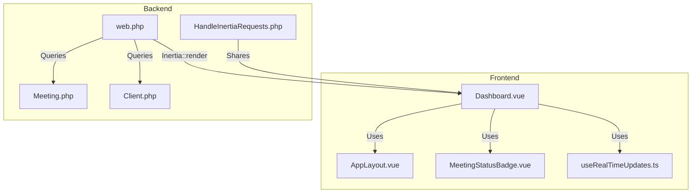
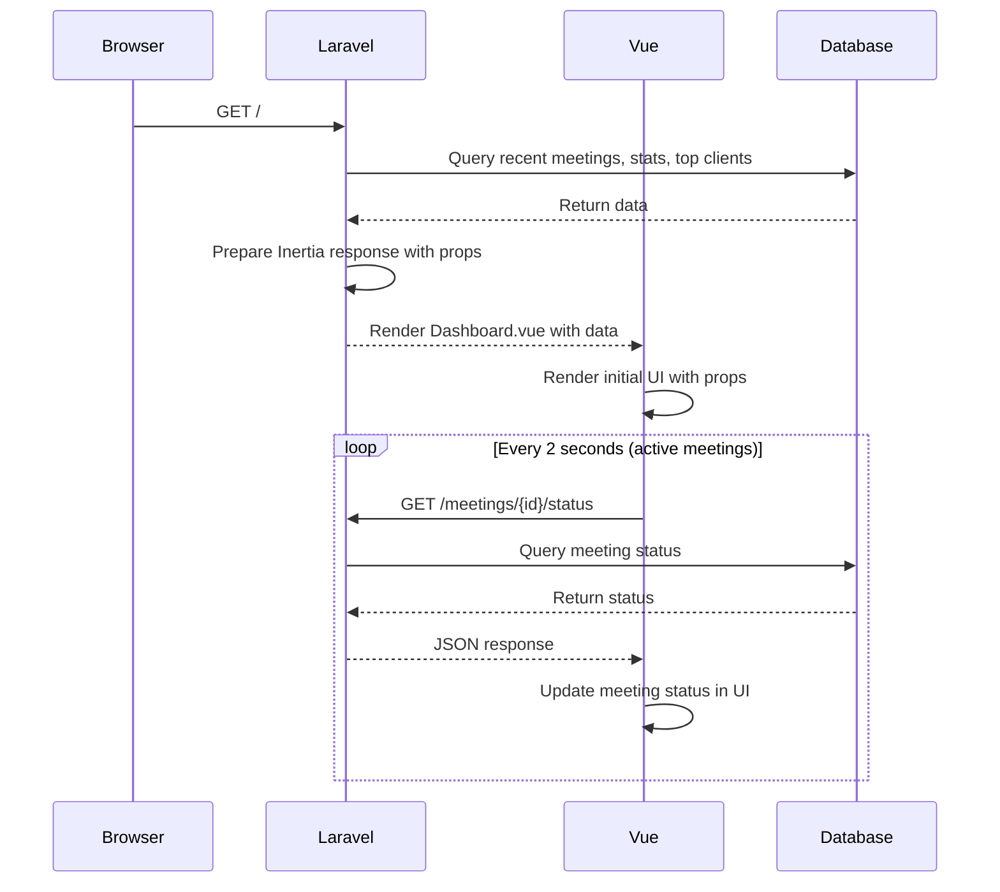
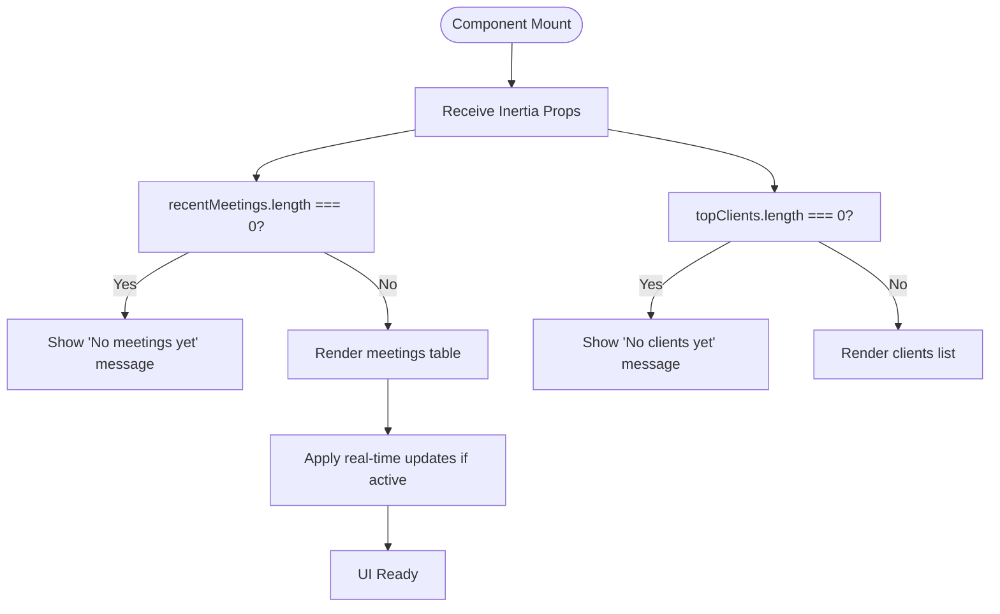
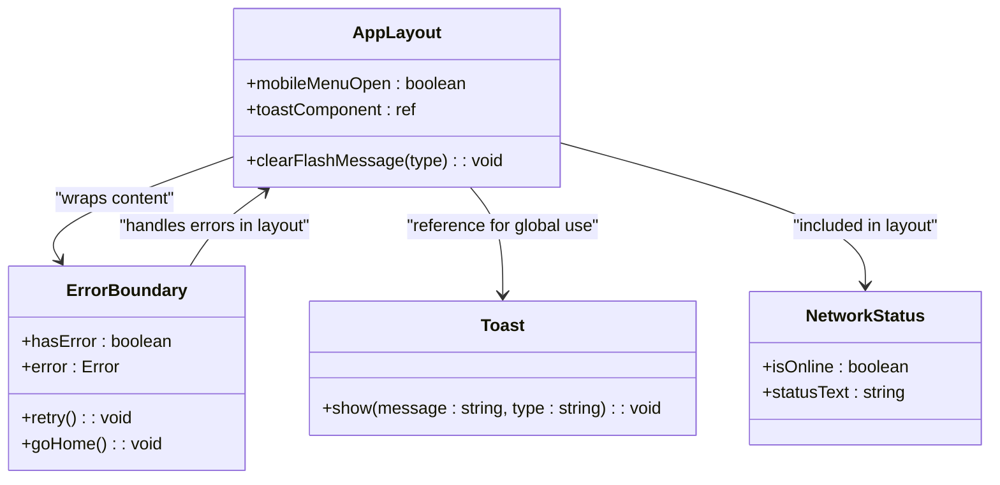
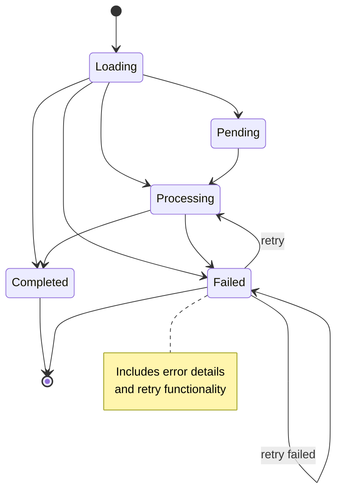
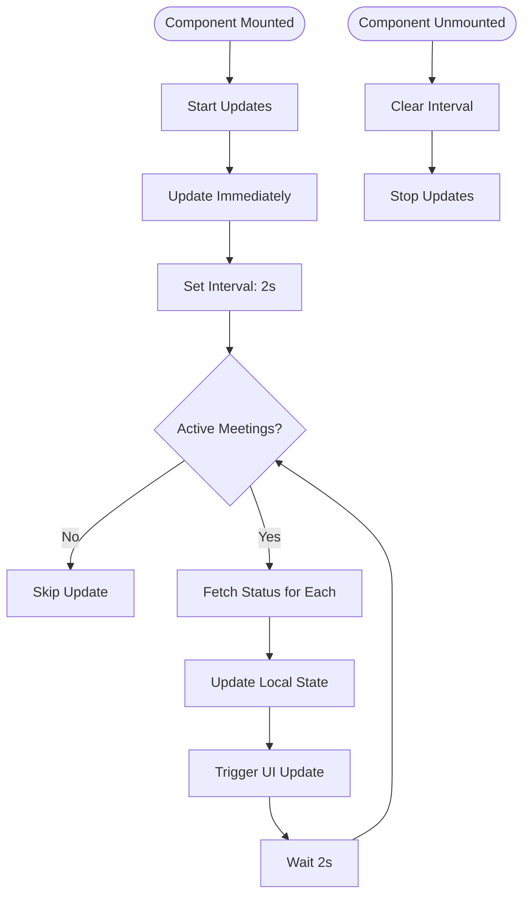
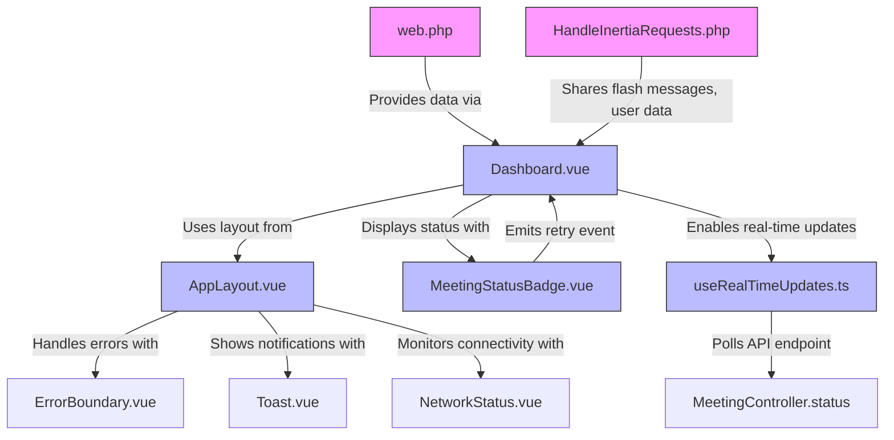

# Dashboard Page


## Table of Contents
1. [Introduction](#introduction)
2. [Project Structure](#project-structure)
3. [Core Components](#core-components)
4. [Architecture Overview](#architecture-overview)
5. [Detailed Component Analysis](#detailed-component-analysis)
6. [Dependency Analysis](#dependency-analysis)
7. [Performance Considerations](#performance-considerations)
8. [Troubleshooting Guide](#troubleshooting-guide)
9. [Conclusion](#conclusion)

## Introduction
The Dashboard page serves as the primary landing view for the MeetingAI application, providing users with a comprehensive overview of their recent meetings, client activity, and key system statistics. It functions as a central hub that enables quick access to core workflows such as uploading new meetings, managing clients, and interacting with the AI assistant. Built using Vue 3 with TypeScript and Inertia.js for seamless integration with the Laravel backend, the Dashboard leverages real-time updates to reflect processing status changes without requiring manual refreshes. This document provides a detailed analysis of its implementation, data flow, UI components, and integration points within the broader application architecture.

## Project Structure
The Dashboard page is located within the frontend component hierarchy at `resources/js/pages/Dashboard.vue`, following a feature-based organization pattern. It is wrapped by the `AppLayout.vue` component, which provides consistent navigation and UI scaffolding across all pages. The Dashboard relies on several shared components from the `resources/js/lib/` directory, including `MeetingStatusBadge.vue` for status visualization and `useRealTimeUpdates.ts` for live data synchronization. Data is delivered from the Laravel backend via Inertia props defined in the `web.php` route file, with shared session data managed through the `HandleInertiaRequests.php` middleware.





**Diagram sources**
- [Dashboard.vue](file://resources/js/pages/Dashboard.vue#L1-L195)
- [AppLayout.vue](file://resources/js/lib/AppLayout.vue#L1-L234)
- [web.php](file://routes/web.php#L1-L47)
- [HandleInertiaRequests.php](file://app/Http/Middleware/HandleInertiaRequests.php#L1-L68)

**Section sources**
- [Dashboard.vue](file://resources/js/pages/Dashboard.vue#L1-L195)
- [web.php](file://routes/web.php#L1-L47)

## Core Components
The Dashboard page is composed of several key components that work together to deliver its functionality:
- **AppLayout.vue**: Provides consistent navigation, flash messaging, and error boundary wrapping
- **MeetingStatusBadge.vue**: Visualizes meeting status with appropriate icons, colors, and interactive elements for failed meetings
- **useRealTimeUpdates.ts**: Composable function that enables automatic polling of meeting status updates
- **Inertia Link Component**: Enables client-side navigation without full page reloads
- **Tailwind CSS**: Powers the responsive layout and visual styling

These components are orchestrated through Vue 3's Composition API with TypeScript, ensuring type safety and maintainable code structure.

**Section sources**
- [Dashboard.vue](file://resources/js/pages/Dashboard.vue#L1-L195)
- [AppLayout.vue](file://resources/js/lib/AppLayout.vue#L1-L234)
- [MeetingStatusBadge.vue](file://resources/js/lib/MeetingStatusBadge.vue#L1-L284)
- [useRealTimeUpdates.ts](file://resources/js/lib/useRealTimeUpdates.ts#L1-L88)

## Architecture Overview
The Dashboard follows a unidirectional data flow pattern where the Laravel backend prepares data and passes it to the Vue frontend via Inertia props. The frontend then renders this data and enhances it with real-time capabilities through periodic API polling. This architecture separates concerns between data preparation (backend) and presentation (frontend), while maintaining a reactive user experience.





**Diagram sources**
- [web.php](file://routes/web.php#L1-L47)
- [Dashboard.vue](file://resources/js/pages/Dashboard.vue#L1-L195)
- [useRealTimeUpdates.ts](file://resources/js/lib/useRealTimeUpdates.ts#L1-L88)

## Detailed Component Analysis

### Dashboard.vue Analysis
The Dashboard component serves as the main view for the application, presenting summary statistics, recent meetings, and top clients. It receives data through Inertia props from the Laravel backend and renders it using a responsive grid layout powered by Tailwind CSS.

#### Data Reception and Initialization
The component receives three main data sets via Inertia props:
- **recentMeetings**: Array of meeting objects with client relationships
- **stats**: Object containing various meeting and client counts
- **topClients**: Array of clients ordered by meeting count


```typescript
interface Props {
  recentMeetings: Meeting[]
  stats: Stats
  topClients: ClientLite[]
}

const props = defineProps<Props>()

const recentMeetings = props.recentMeetings || []
const stats = props.stats || {
  total_clients: 0,
  total_meetings: 0,
  completed_meetings: 0,
  processing_meetings: 0,
  pending_meetings: 0,
  failed_meetings: 0
}
const topClients = props.topClients || []
```


The component includes fallback values to handle empty states gracefully, ensuring the UI remains functional even when no data is available.

#### UI Structure and Layout
The Dashboard employs a responsive grid system with different column configurations based on screen size:
- Mobile: Single column layout
- Small screens: Two-column stats, single-column content
- Large screens: Five-column stats, three-column main content

The header section contains the page title and three primary action buttons that navigate to key workflows:
- Upload Meeting: Links to meetings.create route
- Manage Clients: Links to clients.index route
- Open AI Assistant: Links to ai.chat route

#### Conditional UI Elements
The component implements several conditional rendering patterns based on user state:
- Empty states for recent meetings and top clients when no data exists
- Conditional formatting of date strings with fallback to "-" for missing dates
- Responsive layout adjustments based on viewport size





**Diagram sources**
- [Dashboard.vue](file://resources/js/pages/Dashboard.vue#L1-L195)

**Section sources**
- [Dashboard.vue](file://resources/js/pages/Dashboard.vue#L1-L195)

### AppLayout.vue Analysis
The AppLayout component provides consistent UI scaffolding across all application pages, including navigation, flash messaging, and global components.

#### Navigation System
The layout implements a responsive navigation system with:
- Desktop: Horizontal navigation bar with active state highlighting
- Mobile: Hamburger menu that expands to reveal navigation links
- Active route detection using `$page.component` to highlight current page

The navigation includes links to Dashboard, Clients, Meetings, and AI Assistant, with visual feedback on hover and active states.

#### Flash Messaging
The layout supports Inertia flash messages with animated transitions:
- Success messages with green styling and check icon
- Error messages with red styling and X icon
- Smooth slide-down animations using Vue's Transition component
- Dismiss buttons to clear messages without page reload

Messages are cleared by reloading the page without flash data, preserving the current view state.

#### Global Components
The layout includes several global components:
- **ErrorBoundary**: Catches and displays JavaScript errors gracefully
- **Toast**: Provides temporary notifications (referenced but not shown)
- **NetworkStatus**: Monitors and displays connection status (referenced but not shown)





**Diagram sources**
- [AppLayout.vue](file://resources/js/lib/AppLayout.vue#L1-L234)
- [ErrorBoundary.vue](file://resources/js/lib/ErrorBoundary.vue#L1-L30)

**Section sources**
- [AppLayout.vue](file://resources/js/lib/AppLayout.vue#L1-L234)

### MeetingStatusBadge.vue Analysis
The MeetingStatusBadge component provides a consistent visual representation of meeting status across the application.

#### Status Visualization
The component displays different visual states based on meeting status:
- **Pending**: Yellow badge with clock icon
- **Processing**: Blue badge with spinner animation
- **Completed**: Green badge with checkmark icon
- **Failed**: Red badge with X icon and interactive elements


```typescript
const statusClasses = computed(() => {
  if (!props.meeting) return 'bg-gray-100 text-gray-800'
  
  switch (props.meeting.status) {
    case 'pending':
      return 'bg-yellow-100 text-yellow-800'
    case 'processing':
      return 'bg-blue-100 text-blue-800'
    case 'completed':
      return 'bg-green-100 text-green-800'
    case 'failed':
      return 'bg-red-100 text-red-800'
    default:
      return 'bg-gray-100 text-gray-800'
  }
})
```


#### Interactive Features
For failed meetings, the component provides additional functionality:
- **Error Details Button**: Clickable icon that reveals error message
- **Retry Button**: Allows users to retry processing, with disabled state during retry attempts
- **Error Details Modal**: Slide-down panel showing error message and technical details
- **Retry Actions**: Emit 'retry' event to parent component for handling

The component uses Vue's reactivity system to update its appearance based on prop changes, including support for real-time updates.





**Diagram sources**
- [MeetingStatusBadge.vue](file://resources/js/lib/MeetingStatusBadge.vue#L1-L284)

**Section sources**
- [MeetingStatusBadge.vue](file://resources/js/lib/MeetingStatusBadge.vue#L1-L284)

### useRealTimeUpdates.ts Analysis
The useRealTimeUpdates composable provides real-time status updates for meetings without requiring page refreshes.

#### Implementation Pattern
The composable follows the Vue 3 Composition API pattern with TypeScript generics to maintain type safety:


```typescript
export function useRealTimeUpdates<T extends BaseMeeting>(meetings: T[])
```


It accepts an array of meeting objects and returns a reactive reference to updated meetings along with control functions.

#### Update Mechanism
The composable implements a polling mechanism that:
1. Filters meetings to only those with 'pending' or 'processing' status
2. Makes individual API requests for each active meeting
3. Merges updated data while preserving existing fields
4. Updates the reactive reference to trigger UI re-renders


```typescript
const updateMeetingStatuses = async () => {
  const activeMeetings = updatedMeetings.value.filter(
    (meeting) => meeting.status === 'pending' || meeting.status === 'processing'
  )

  if (activeMeetings.length === 0) {
    return
  }

  const updatePromises = activeMeetings.map(async (meeting) => {
    const response = await axios.get(`/meetings/${meeting.id}/status`)
    const updatedData = response.data as Partial<T>
    
    // Merge updated data while preserving existing fields
    updatedMeetings.value[index] = {
      ...(updatedMeetings.value[index] as T),
      ...(updatedData as T),
    }
  })

  await Promise.all(updatePromises)
}
```


#### Lifecycle Management
The composable automatically manages the update interval:
- **onMounted**: Starts updates immediately and sets 2-second interval
- **onUnmounted**: Cleans up interval to prevent memory leaks
- **startUpdates()**: Manual start function
- **stopUpdates()**: Manual stop function

Error handling is implemented with try-catch blocks and console logging to prevent crashes from failed requests.





**Diagram sources**
- [useRealTimeUpdates.ts](file://resources/js/lib/useRealTimeUpdates.ts#L1-L88)

**Section sources**
- [useRealTimeUpdates.ts](file://resources/js/lib/useRealTimeUpdates.ts#L1-L88)

## Dependency Analysis
The Dashboard page has a well-defined dependency chain that connects the frontend and backend components:





**Diagram sources**
- [web.php](file://routes/web.php#L1-L47)
- [HandleInertiaRequests.php](file://app/Http/Middleware/HandleInertiaRequests.php#L1-L68)
- [Dashboard.vue](file://resources/js/pages/Dashboard.vue#L1-L195)
- [AppLayout.vue](file://resources/js/lib/AppLayout.vue#L1-L234)
- [MeetingStatusBadge.vue](file://resources/js/lib/MeetingStatusBadge.vue#L1-L284)
- [useRealTimeUpdates.ts](file://resources/js/lib/useRealTimeUpdates.ts#L1-L88)

**Section sources**
- [web.php](file://routes/web.php#L1-L47)
- [HandleInertiaRequests.php](file://app/Http/Middleware/HandleInertiaRequests.php#L1-L68)

## Performance Considerations
The Dashboard implementation includes several performance optimizations:

### Efficient Data Fetching
The backend route fetches only necessary data with appropriate database queries:
- Recent meetings: Limited to 5 records with client relationship
- Statistics: Calculated using COUNT queries with WHERE clauses
- Top clients: Limited to 5 records with meetings count

### Real-Time Updates Optimization
The useRealTimeUpdates composable optimizes polling behavior:
- Only polls meetings with 'pending' or 'processing' status
- Uses shallowRef for efficient reactivity
- Implements error handling to prevent cascading failures
- Automatically stops when no active meetings exist

### Rendering Performance
The frontend employs several Vue performance patterns:
- Computed properties for derived state (statusClasses, statusText)
- Event delegation through Inertia Link component
- Conditional rendering to avoid unnecessary DOM elements
- Efficient reactivity through props and refs

### Network Efficiency
The architecture minimizes network overhead:
- Initial data delivered in single Inertia response
- Subsequent updates only for active meetings
- Small JSON payloads for status updates
- Caching opportunities through browser and server layers

## Troubleshooting Guide
This section addresses common issues and their solutions for the Dashboard page.

### Data Not Loading
**Symptoms**: Empty dashboard, loading spinner, or error messages
**Possible Causes**:
- Backend route not returning data
- Database connection issues
- Inertia configuration problems

**Solutions**:
1. Verify the root route `/` is defined in web.php
2. Check database connectivity and table contents
3. Ensure HandleInertiaRequests middleware is properly configured
4. Inspect browser console for JavaScript errors

### Real-Time Updates Not Working
**Symptoms**: Meeting status not updating automatically
**Possible Causes**:
- Polling interval not starting
- API endpoint `/meetings/{id}/status` not accessible
- Network connectivity issues

**Solutions**:
1. Verify useRealTimeUpdates is properly imported and called
2. Check that active meetings have 'pending' or 'processing' status
3. Test the status API endpoint directly
4. Inspect network tab for failed requests

### Styling Issues
**Symptoms**: Layout problems, missing colors, or broken responsiveness
**Possible Causes**:
- Tailwind CSS not properly configured
- Missing or incorrect class names
- Cache issues with CSS files

**Solutions**:
1. Verify Tailwind is included in the build process
2. Check for typos in class names
3. Clear browser and build caches
4. Verify responsive breakpoints are correctly implemented

### Navigation Problems
**Symptoms**: Links not working or causing full page reloads
**Possible Causes**:
- Inertia Link component not properly imported
- Route names incorrect or missing
- JavaScript errors preventing client-side navigation

**Solutions**:
1. Verify `import { Link } from '@inertiajs/vue3'` is present
2. Check route names in web.php match those used in templates
3. Inspect console for JavaScript errors
4. Ensure Ziggy is properly configured for route generation

**Section sources**
- [Dashboard.vue](file://resources/js/pages/Dashboard.vue#L1-L195)
- [web.php](file://routes/web.php#L1-L47)
- [useRealTimeUpdates.ts](file://resources/js/lib/useRealTimeUpdates.ts#L1-L88)

## Conclusion
The Dashboard page serves as a critical entry point and information hub for the MeetingAI application, effectively combining data visualization, workflow access, and real-time updates into a cohesive user experience. Its implementation demonstrates a well-architected approach to modern web development, leveraging the Inertia.js bridge between Laravel and Vue to create a seamless single-page application experience. The component's design prioritizes usability with responsive layouts, clear visual hierarchies, and intuitive navigation, while its technical implementation emphasizes performance, maintainability, and robust error handling. Through the use of composable functions like useRealTimeUpdates, the Dashboard achieves real-time capabilities without sacrificing code clarity or introducing unnecessary complexity. This balanced approach makes the Dashboard both user-friendly and developer-friendly, serving as a strong foundation for the application's core functionality.

**Referenced Files in This Document**   
- [Dashboard.vue](file://resources/js/pages/Dashboard.vue#L1-L195)
- [AppLayout.vue](file://resources/js/lib/AppLayout.vue#L1-L234)
- [MeetingStatusBadge.vue](file://resources/js/lib/MeetingStatusBadge.vue#L1-L284)
- [useRealTimeUpdates.ts](file://resources/js/lib/useRealTimeUpdates.ts#L1-L88)
- [web.php](file://routes/web.php#L1-L47)
- [HandleInertiaRequests.php](file://app/Http/Middleware/HandleInertiaRequests.php#L1-L68)