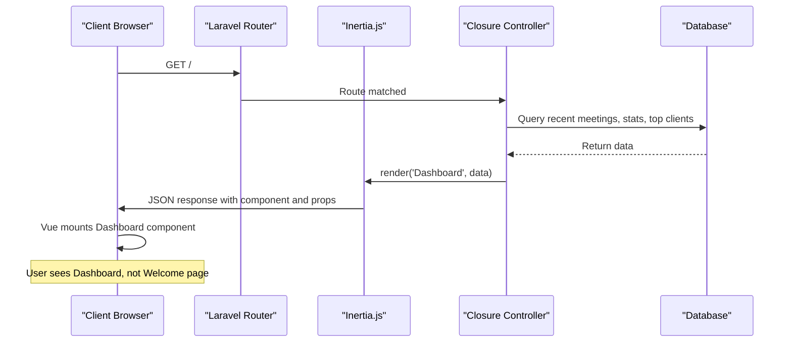
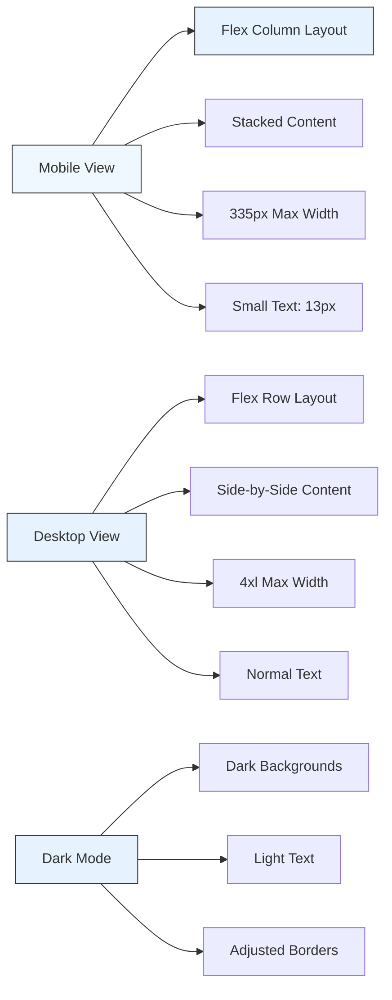

# Welcome Page


## Table of Contents
1. [Introduction](#introduction)
2. [Routing and Authentication Flow](#routing-and-authentication-flow)
3. [Template Structure and UI Components](#template-structure-and-ui-components)
4. [Inertia Integration and Server-Side Rendering](#inertia-integration-and-server-side-rendering)
5. [Call-to-Action and Navigation Elements](#call-to-action-and-navigation-elements)
6. [Responsive Design and Tailwind CSS Implementation](#responsive-design-and-tailwind-css-implementation)
7. [SEO and Performance Considerations](#seo-and-performance-considerations)

## Introduction
The Welcome page serves as the onboarding and landing view for new users of the MeetingAI application. It is designed to introduce users to the platform's core functionality, guide first-time users through initial actions, and provide a visually engaging entry point. The page leverages modern web technologies including Inertia.js for seamless client-server integration, Vue 3 for reactive UI components, and Tailwind CSS for responsive design. Despite its name, the Welcome page is not the actual landing page for authenticated users, as the root route (`/`) is configured to render the Dashboard component instead.

**Section sources**
- [Welcome.vue](file://resources/js/pages/Welcome.vue#L0-L770)
- [web.php](file://routes/web.php#L0-L46)

## Routing and Authentication Flow
The application's routing configuration reveals a critical detail: the root path `/` is mapped to a closure that renders the Dashboard component, not the Welcome page. This indicates that the Welcome page is likely not directly accessible via the main route and may be used in specific onboarding scenarios or as a fallback for unauthenticated users in certain contexts. The routing logic in `web.php` returns Inertia-rendered Dashboard view with preloaded data including recent meetings, statistics, and top clients. The authentication state is implicitly managed through Inertia's shared data mechanism in the `HandleInertiaRequests` middleware, which includes the authenticated user object in the shared props when available.





**Diagram sources**
- [web.php](file://routes/web.php#L4-L23)
- [HandleInertiaRequests.php](file://app/Http/Middleware/HandleInertiaRequests.php#L30-L67)

**Section sources**
- [web.php](file://routes/web.php#L4-L23)
- [HandleInertiaRequests.php](file://app/Http/Middleware/HandleInertiaRequests.php#L30-L67)

## Template Structure and UI Components
The Welcome.vue template is structured as a marketing-oriented landing page with a split layout. The left side contains textual content and call-to-action buttons, while the right side features decorative SVG illustrations. The page uses a flexbox-based layout with responsive breakpoints for different screen sizes. Key UI components include a heading, instructional text, a checklist of onboarding steps, and action buttons. The design incorporates subtle animations with CSS transitions for opacity and transform properties, creating a smooth entrance effect when the page loads. The template uses Inertia's `Head` component to manage document head elements including title and external stylesheet links to Inter font from rsms.me.


```mermaid
flowchart TD
A[Welcome Page] --> B[Main Container]
B --> C[Left Panel - Content]
B --> D[Right Panel - Illustration]
C --> E[Heading: "Let's get started"]
C --> F[Instructional Text]
C --> G[Checklist Items]
C --> H[Call-to-Action Buttons]
D --> I[SVG Logo]
D --> J[Decorative SVG Elements]
I --> K[Laravel Logo Path Elements]
J --> L[Multiple Layered SVG Paths]
style A fill:#f0f8ff,stroke:#333
style B fill:#e6f3ff,stroke:#333
style C fill:#cce6ff,stroke:#333
style D fill:#cce6ff,stroke:#333
```


**Diagram sources**
- [Welcome.vue](file://resources/js/pages/Welcome.vue#L0-L199)

**Section sources**
- [Welcome.vue](file://resources/js/pages/Welcome.vue#L0-L199)

## Inertia Integration and Server-Side Rendering
The Welcome page is integrated with Inertia.js, which enables a seamless SPA-like experience while maintaining server-side rendering capabilities. The application's Inertia configuration in `inertia.php` shows that server-side rendering is enabled with a local SSR service running at `http://127.0.0.1:13714`. This configuration allows the initial page load to be pre-rendered on the server for improved performance and SEO. The `app.blade.php` root template includes the `@inertia` directive that serves as the mounting point for Vue components, along with `@vite` for asset loading and `@inertiaHead` for managing document head content. The `HandleInertiaRequests` middleware shares essential data such as flash messages, CSRF token, app configuration, Ziggy route helper, and user authentication state with the client-side application.


```mermaid
graph TB
subgraph "Server"
A[app.blade.php]
B[Inertia Middleware]
C[SSR Service]
D[Welcome.vue]
end
subgraph "Client"
E[Browser]
F[Vue Application]
end
E --> A: Initial Request
A --> B: Loads Inertia
B --> C: SSR Enabled
C --> D: Pre-renders Welcome.vue
D --> E: HTML Response
E --> F: Hydrates Vue App
F --> E: Interactive SPA
style A fill:#4CAF50,stroke:#333
style B fill:#2196F3,stroke:#333
style C fill:#FF9800,stroke:#333
style D fill:#9C27B0,stroke:#333
style E fill:#607D8B,stroke:#333
style F fill:#E91E63,stroke:#333
```


**Diagram sources**
- [app.blade.php](file://resources/views/app.blade.php#L0-L23)
- [inertia.php](file://config/inertia.php#L0-L52)
- [HandleInertiaRequests.php](file://app/Http/Middleware/HandleInertiaRequests.php#L0-L67)

**Section sources**
- [app.blade.php](file://resources/views/app.blade.php#L0-L23)
- [inertia.php](file://config/inertia.php#L0-L52)
- [HandleInertiaRequests.php](file://app/Http/Middleware/HandleInertiaRequests.php#L0-L67)

## Call-to-Action and Navigation Elements
The Welcome page includes two primary call-to-action buttons: "Manage Clients" and "Deploy now". The "Manage Clients" button uses Inertia's `Link` component to navigate to the clients index route, enabling client-side navigation without full page reloads. The "Deploy now" button is a standard anchor tag that opens the Laravel Cloud website in a new tab. The page also contains two informational links to Laravel documentation and Laracasts video tutorials, both opening in new tabs. These navigation elements are styled with consistent button designs using Tailwind CSS classes, featuring rounded corners, padding, and hover effects that change border and background colors. The links are positioned in a horizontal layout with a gap between them, optimized for both mobile and desktop viewing.

**Section sources**
- [Welcome.vue](file://resources/js/pages/Welcome.vue#L0-L199)

## Responsive Design and Tailwind CSS Implementation
The Welcome page implements responsive design using Tailwind CSS with a mobile-first approach. The layout uses a flexbox container with `flex-col-reverse` on small screens and `lg:flex-row` on larger screens, creating a stacked layout on mobile that becomes side-by-side on desktop. The page has constrained width with `max-w-[335px]` on mobile and `lg:max-w-4xl` on desktop, ensuring readability across devices. Typography uses responsive text sizes with explicit pixel values for fine control. The design incorporates dark mode support with conditional classes that change background colors, text colors, and border colors based on the user's preferred color scheme. SVG illustrations are sized responsively with `w-full` and `max-w-none` to fill their containers while maintaining aspect ratio.





**Diagram sources**
- [Welcome.vue](file://resources/js/pages/Welcome.vue#L0-L199)

**Section sources**
- [Welcome.vue](file://resources/js/pages/Welcome.vue#L0-L199)

## SEO and Performance Considerations
The Welcome page incorporates several SEO and performance optimizations. The `Head` component sets the page title to "Welcome" and includes preconnect links to rsms.me for faster font loading. The page uses server-side rendering through Inertia's SSR capabilities, which improves initial load performance and search engine visibility. The design minimizes external dependencies by using inline SVGs for illustrations rather than image files, reducing HTTP requests. The page implements lazy loading for non-critical assets and uses efficient CSS with Tailwind's utility-first approach to minimize file size. The responsive design ensures good performance across devices, and the dark mode support enhances user experience. However, the current routing configuration that serves the Dashboard instead of the Welcome page at the root route may impact the intended onboarding flow and SEO strategy for new users.

**Section sources**
- [Welcome.vue](file://resources/js/pages/Welcome.vue#L0-L199)
- [inertia.php](file://config/inertia.php#L0-L52)
- [app.blade.php](file://resources/views/app.blade.php#L0-L23)

**Referenced Files in This Document**   
- [Welcome.vue](file://resources/js/pages/Welcome.vue)
- [web.php](file://routes/web.php)
- [HandleInertiaRequests.php](file://app/Http/Middleware/HandleInertiaRequests.php)
- [app.blade.php](file://resources/views/app.blade.php)
- [inertia.php](file://config/inertia.php)
- [Dashboard.vue](file://resources/js/pages/Dashboard.vue)