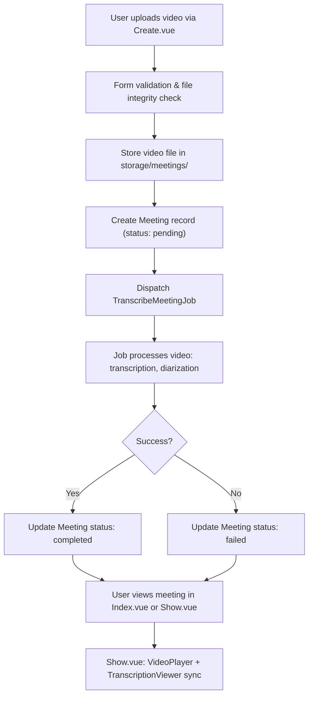
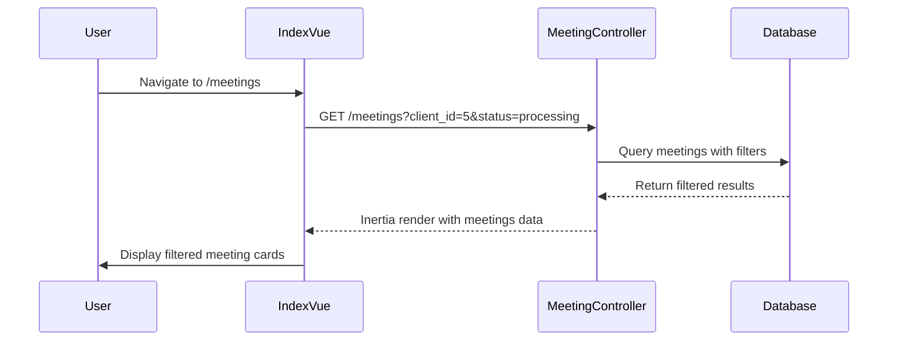
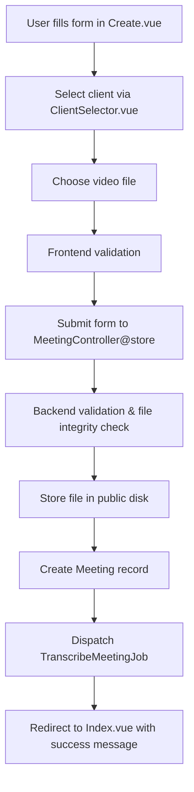
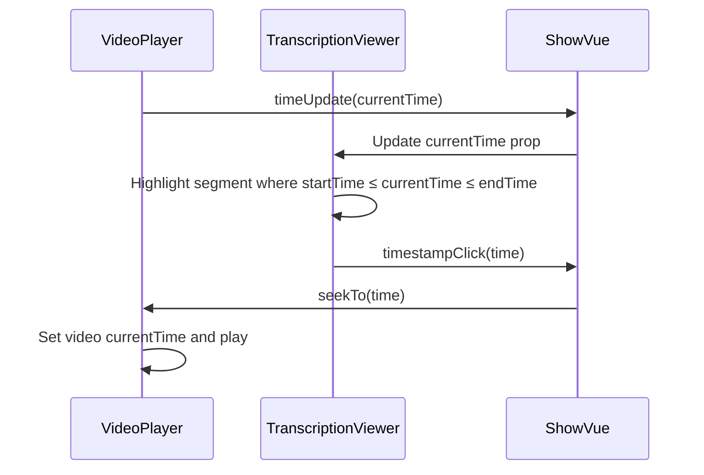
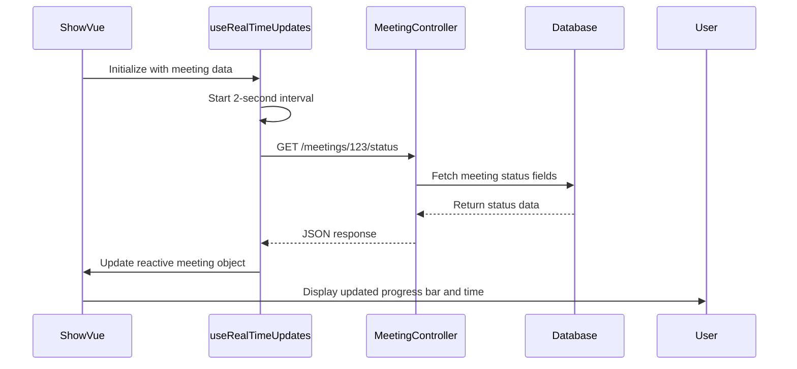
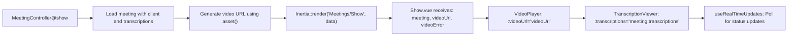
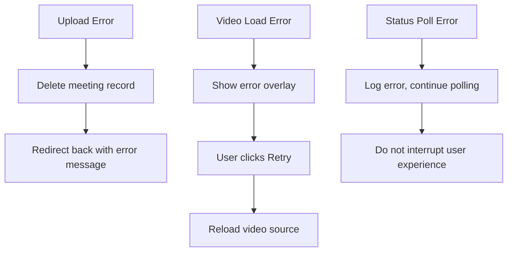

# Meetings Pages

## Table of Contents
1. [Introduction](#introduction)
2. [Workflow Overview](#workflow-overview)
3. [Index Page: Meeting List and Filtering](#index-page-meeting-list-and-filtering)
4. [Create Page: Meeting Upload and Form Handling](#create-page-meeting-upload-and-form-handling)
5. [Show Page: Playback and Transcription Viewer](#show-page-playback-and-transcription-viewer)
6. [Real-Time Status Updates](#real-time-status-updates)
7. [Component Integration and Data Flow](#component-integration-and-data-flow)
8. [Error Handling and Recovery](#error-handling-and-recovery)

## Introduction
This document provides a comprehensive overview of the Meetings page group in the MeetingAI application. It details the end-to-end workflow from uploading a meeting video to viewing the processed transcription synchronized with video playback. The system is built using Laravel with Inertia.js for frontend integration, Vue 3 for component-based UI, and a job queue for asynchronous processing. The documentation covers the three main pages—Index, Create, and Show—along with their supporting components, data models, and backend controllers.

**Section sources**
- [MeetingController.php](file://app/Http/Controllers/MeetingController.php#L1-L305)
- [web.php](file://routes/web.php#L1-L47)

## Workflow Overview
The meeting processing workflow begins with a user uploading a video file through the **Create.vue** page. The system validates the file, stores it, creates a **Meeting** record with status "pending", and dispatches a **TranscribeMeetingJob** for background processing. The **Index.vue** page displays all meetings with status badges and progress indicators. As the job processes, the status updates to "processing" and eventually "completed" or "failed". Users can navigate to **Show.vue** to view the video and synchronized transcription. Real-time status updates are handled via periodic polling using the **useRealTimeUpdates** composable.

**Diagram sources**
- [MeetingController.php](file://app/Http/Controllers/MeetingController.php#L100-L150)
- [TranscribeMeetingJob.php](file://app/Jobs/TranscribeMeetingJob.php)
- [Transcription.php](file://app/Models/Transcription.php#L1-L51)

## Index Page: Meeting List and Filtering
The **Index.vue** page displays a paginated list of meetings with filtering capabilities. It fetches data via Inertia from the **MeetingController@index** method, which supports filtering by client, status, and date range. The page renders meeting cards that include metadata and a **MeetingStatusBadge** indicating the current processing state.

### Client and Status Filtering
Users can filter meetings by selecting a client from a dropdown or choosing a status ("All", "Pending", "Processing", "Completed", "Failed"). The filters are preserved in the URL query string using `withQueryString()`.

**Diagram sources**
- [MeetingController.php](file://app/Http/Controllers/MeetingController.php#L10-L60)
- [Index.vue](file://resources/js/pages/Meetings/Index.vue)

**Section sources**
- [MeetingController.php](file://app/Http/Controllers/MeetingController.php#L10-L90)
- [Index.vue](file://resources/js/pages/Meetings/Index.vue)

## Create Page: Meeting Upload and Form Handling
The **Create.vue** page provides a form for uploading a new meeting video. It integrates **ClientSelector.vue** to choose the associated client and handles file input with validation and progress feedback.

### Form Validation and File Handling
The form enforces validation rules:
- **Title**: Required, max 255 characters
- **Client**: Required, must exist in database
- **Video**: Required, file types (MP4, MOV, AVI, WebM), size between 1MB and 500MB

The backend (**MeetingController@store**) performs additional checks:
- File validity (`$videoFile->isValid()`)
- Sufficient disk space (1.5x file size)
- Secure storage path under `meetings/{client_id}/{meeting_id}/video.ext`

Upon successful upload, the meeting is stored with status "pending" and an estimated processing time is calculated (1 second per minute of video).

**Diagram sources**
- [MeetingController.php](file://app/Http/Controllers/MeetingController.php#L100-L150)
- [Create.vue](file://resources/js/pages/Meetings/Create.vue)

**Section sources**
- [MeetingController.php](file://app/Http/Controllers/MeetingController.php#L90-L150)
- [Create.vue](file://resources/js/pages/Meetings/Create.vue)
- [ClientSelector.vue](file://resources/js/lib/ClientSelector.vue)

## Show Page: Playback and Transcription Viewer
The **Show.vue** page enables synchronized video playback and transcription viewing. It integrates **VideoPlayer.vue** and **TranscriptionViewer.vue** components, linking them through time-based events.

### Synchronization Mechanism
When the video plays, time updates are emitted to **TranscriptionViewer.vue**, which highlights the current segment. Clicking a transcription segment seeks the video to the corresponding timestamp.

### Component Integration
- **VideoPlayer.vue**: Handles video loading, playback controls, error recovery (retry), and emits time updates.
- **TranscriptionViewer.vue**: Displays transcription segments with speaker labels, timestamps, and search highlighting. Supports navigation between segments.
- **MeetingProgressIndicator.vue**: Shows processing progress (queue or processing) with elapsed/remaining time.

**Section sources**
- [Show.vue](file://resources/js/pages/Meetings/Show.vue)
- [VideoPlayer.vue](file://resources/js/lib/VideoPlayer.vue)
- [TranscriptionViewer.vue](file://resources/js/lib/TranscriptionViewer.vue)
- [MeetingProgressIndicator.vue](file://resources/js/lib/MeetingProgressIndicator.vue)

## Real-Time Status Updates
Meetings in "pending" or "processing" status receive real-time updates via the **useRealTimeUpdates** composable. This Vue utility polls the `/meetings/{id}/status` endpoint every 2 seconds while the component is mounted.

### Implementation Details
- **useRealTimeUpdates.ts**: Accepts an array of meetings and returns a reactive `updatedMeetings` ref.
- **Polling Logic**: Only active meetings (pending/processing) are updated.
- **Automatic Cleanup**: Interval is cleared when the component unmounts.

The backend **MeetingController@status** returns a JSON response with current status, progress percentages, and formatted time strings.

**Diagram sources**
- [useRealTimeUpdates.ts](file://resources/js/lib/useRealTimeUpdates.ts#L1-L87)
- [MeetingController.php](file://app/Http/Controllers/MeetingController.php#L270-L305)
- [web.php](file://routes/web.php#L45)

**Section sources**
- [useRealTimeUpdates.ts](file://resources/js/lib/useRealTimeUpdates.ts#L1-L87)
- [MeetingController.php](file://app/Http/Controllers/MeetingController.php#L270-L305)

## Component Integration and Data Flow
The meeting pages use Inertia.js for seamless data transfer between Laravel backend and Vue frontend. Each page receives data via props passed from the controller.

### Data Flow Example: Show Page

### Conditional Rendering
The UI adapts based on meeting status:
- **Pending**: Queue progress bar with estimated processing time
- **Processing**: Processing progress bar with elapsed/remaining time
- **Completed**: Success badge and enabled playback/transcription
- **Failed**: Error badge with retry suggestion

**Section sources**
- [MeetingController.php](file://app/Http/Controllers/MeetingController.php#L190-L260)
- [Show.vue](file://resources/js/pages/Meetings/Show.vue)
- [MeetingProgressIndicator.vue](file://resources/js/lib/MeetingProgressIndicator.vue)

## Error Handling and Recovery
The system implements comprehensive error handling at multiple levels.

### Upload and Processing Errors
- **File Upload**: Validates file integrity, size, and type; rolls back meeting creation on failure.
- **Storage**: Checks disk space before upload; logs missing video files.
- **Job Processing**: TranscribeMeetingJob handles transcription errors and updates meeting status accordingly.

### Frontend Error Recovery
- **VideoPlayer.vue**: Displays error overlay with retry button; logs detailed MediaError codes.
- **useRealTimeUpdates.ts**: Gracefully handles failed status requests with console logging.
- **Form Validation**: Provides user-friendly error messages for invalid inputs.

**Section sources**
- [MeetingController.php](file://app/Http/Controllers/MeetingController.php#L130-L150)
- [VideoPlayer.vue](file://resources/js/lib/VideoPlayer.vue#L150-L200)
- [useRealTimeUpdates.ts](file://resources/js/lib/useRealTimeUpdates.ts#L50-L70)

**Referenced Files in This Document**   
- [MeetingController.php](file://app/Http/Controllers/MeetingController.php#L1-L305)
- [Meeting.php](file://app/Models/Meeting.php#L1-L25)
- [Transcription.php](file://app/Models/Transcription.php#L1-L51)
- [Create.vue](file://resources/js/pages/Meetings/Create.vue)
- [Index.vue](file://resources/js/pages/Meetings/Index.vue)
- [Show.vue](file://resources/js/pages/Meetings/Show.vue)
- [ClientSelector.vue](file://resources/js/lib/ClientSelector.vue)
- [VideoPlayer.vue](file://resources/js/lib/VideoPlayer.vue)
- [TranscriptionViewer.vue](file://resources/js/lib/TranscriptionViewer.vue)
- [MeetingProgressIndicator.vue](file://resources/js/lib/MeetingProgressIndicator.vue)
- [useRealTimeUpdates.ts](file://resources/js/lib/useRealTimeUpdates.ts)
- [web.php](file://routes/web.php#L1-L47)