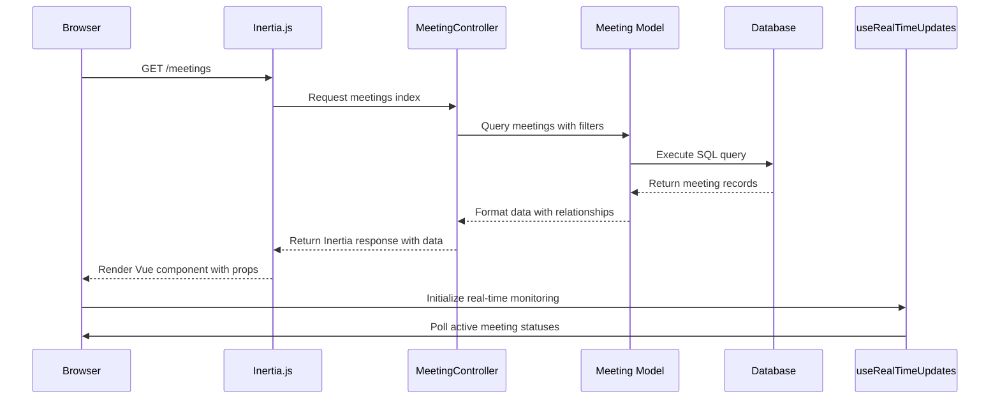
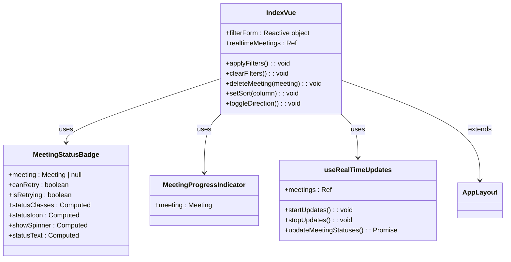
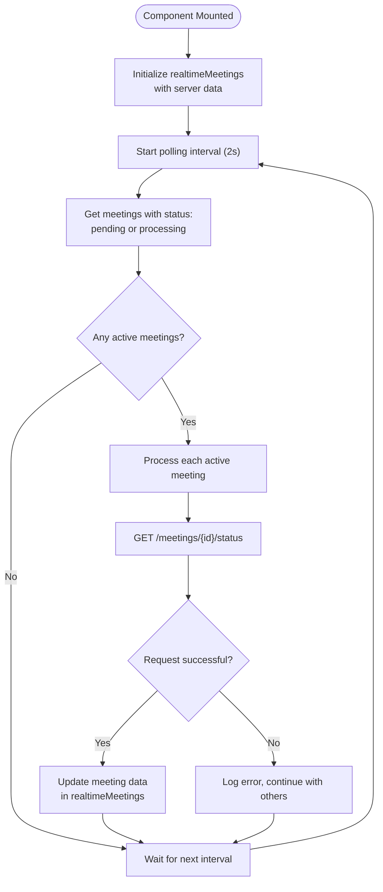
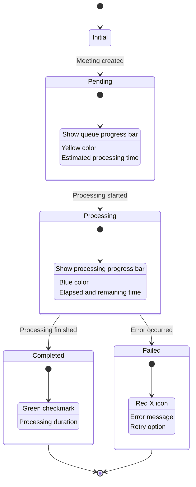
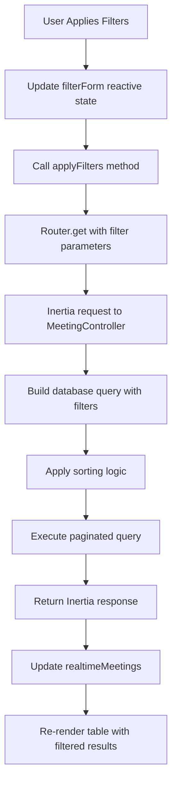
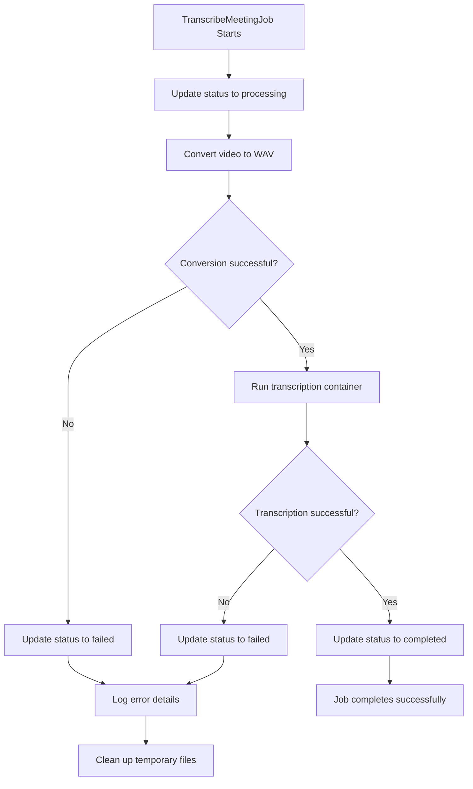

# Meetings Index Page

## Table of Contents
1. [Introduction](#introduction)
2. [Core Components and Data Flow](#core-components-and-data-flow)
3. [Meetings Index Page Structure](#meetings-index-page-structure)
4. [Real-Time Status Updates](#real-time-status-updates)
5. [UI/UX Patterns for Meeting Statuses](#uiux-patterns-for-meeting-statuses)
6. [Filtering and Sorting Mechanism](#filtering-and-sorting-mechanism)
7. [Performance and Scalability](#performance-and-scalability)
8. [Error Handling and User Feedback](#error-handling-and-user-feedback)
9. [Backend Processing Workflow](#backend-processing-workflow)
10. [Troubleshooting Guide](#troubleshooting-guide)

## Introduction
The Meetings Index page serves as the central dashboard for managing and monitoring meetings within the application. It provides a comprehensive view of all meetings, allowing users to filter, sort, and track the processing status of uploaded video files in real time. The page is built using Vue 3 with TypeScript and leverages Inertia.js for seamless server-side rendering and client-side interactivity. It integrates with a Laravel backend to fetch meeting data and employs real-time updates to reflect changes in meeting processing status without requiring page reloads.

## Core Components and Data Flow
The Meetings Index page orchestrates several key components to deliver a responsive and informative user experience. The data flow begins with a request to the backend `MeetingController`, which retrieves meeting records from the database and passes them to the frontend via Inertia.js. The frontend then renders meeting cards with status indicators and progress bars, while continuously monitoring active meetings for status changes through a real-time update mechanism.

**Diagram sources**
- [MeetingController.php](file://app/Http/Controllers/MeetingController.php#L25-L60)
- [Index.vue](file://resources/js/pages/Meetings/Index.vue#L200-L210)
- [useRealTimeUpdates.ts](file://resources/js/lib/useRealTimeUpdates.ts#L15-L25)

**Section sources**
- [Index.vue](file://resources/js/pages/Meetings/Index.vue)
- [MeetingController.php](file://app/Http/Controllers/MeetingController.php)

## Meetings Index Page Structure
The Meetings Index page is structured as a Vue 3 component that extends `AppLayout` and displays meetings in a tabular format with comprehensive filtering capabilities. The page is divided into three main sections: the header with page title and upload button, the filter controls, and the meetings table with pagination.

### Component Composition
The page imports several key components:
- `AppLayout`: Provides the overall application layout structure
- `MeetingStatusBadge`: Displays status indicators with appropriate styling
- `MeetingProgressIndicator`: Shows processing progress for active meetings
- `useRealTimeUpdates`: Composable for real-time status monitoring

The component receives props from the backend including paginated meetings, client list, and current filter settings. It uses reactive state to manage filter form data and applies Inertia.js navigation when filters are submitted.

**Diagram sources**
- [Index.vue](file://resources/js/pages/Meetings/Index.vue#L200-L356)
- [MeetingStatusBadge.vue](file://resources/js/lib/MeetingStatusBadge.vue)
- [MeetingProgressIndicator.vue](file://resources/js/lib/MeetingProgressIndicator.vue)
- [useRealTimeUpdates.ts](file://resources/js/lib/useRealTimeUpdates.ts)

**Section sources**
- [Index.vue](file://resources/js/pages/Meetings/Index.vue)

## Real-Time Status Updates
The Meetings Index page implements real-time updates through the `useRealTimeUpdates` composable, which continuously monitors meetings in 'pending' or 'processing' states and updates their status without requiring a page refresh.

### Implementation Details
The composable works by:
1. Initializing with the current list of meetings from the server
2. Setting up an interval to poll the status of active meetings every 2 seconds
3. Making individual API requests to `/meetings/{id}/status` for each active meeting
4. Merging the updated status data while preserving existing fields
5. Updating the reactive reference to trigger UI re-renders

**Diagram sources**
- [useRealTimeUpdates.ts](file://resources/js/lib/useRealTimeUpdates.ts#L15-L87)

**Section sources**
- [useRealTimeUpdates.ts](file://resources/js/lib/useRealTimeUpdates.ts)

## UI/UX Patterns for Meeting Statuses
The application employs consistent visual patterns to communicate meeting statuses and processing progress to users. These patterns are implemented through the `MeetingStatusBadge` and `MeetingProgressIndicator` components.

### Status Badge Design
The `MeetingStatusBadge` component displays different visual indicators based on the meeting status:

- **Pending**: Yellow badge with clock icon, indicating the meeting is waiting in the processing queue
- **Processing**: Blue badge with spinner animation, showing active transcription
- **Completed**: Green badge with checkmark icon, indicating successful processing
- **Failed**: Red badge with X icon, indicating processing errors

For failed meetings, additional interactive elements are provided:
- Error details button (i icon) to reveal error messages
- Retry button (circular arrow) to attempt processing again
- Technical details dropdown for developers

### Progress Visualization
The `MeetingProgressIndicator` component provides detailed progress information:

**Diagram sources**
- [MeetingStatusBadge.vue](file://resources/js/lib/MeetingStatusBadge.vue)
- [MeetingProgressIndicator.vue](file://resources/js/lib/MeetingProgressIndicator.vue)

**Section sources**
- [MeetingStatusBadge.vue](file://resources/js/lib/MeetingStatusBadge.vue#L0-L283)
- [MeetingProgressIndicator.vue](file://resources/js/lib/MeetingProgressIndicator.vue)

## Filtering and Sorting Mechanism
The Meetings Index page provides comprehensive filtering and sorting capabilities to help users find specific meetings among potentially large datasets.

### Filter Implementation
The filtering system includes:
- **Client filter**: Dropdown to select meetings for a specific client
- **Status filter**: Dropdown to filter by meeting status (pending, processing, completed, failed)
- **Date range**: Date pickers to filter meetings by upload date
- **Sorting**: Column-based sorting with direction toggle

When filters are applied, the page uses Inertia.js to make a GET request to the backend with the filter parameters, preserving the current scroll position and state.

### Backend Filtering Logic
The `MeetingController::index()` method handles filtering by:
1. Building a query with optional client, status, and date filters
2. Applying sorting based on user selection (uploaded_at, title, client, status, duration)
3. Paginating results (15 per page) with preserved query string
4. Returning data to the frontend via Inertia.js

**Diagram sources**
- [Index.vue](file://resources/js/pages/Meetings/Index.vue#L250-L275)
- [MeetingController.php](file://app/Http/Controllers/MeetingController.php#L25-L80)

**Section sources**
- [Index.vue](file://resources/js/pages/Meetings/Index.vue)
- [MeetingController.php](file://app/Http/Controllers/MeetingController.php)

## Performance and Scalability
The Meetings Index page implements several performance optimizations to handle large datasets efficiently.

### Pagination Strategy
The page uses server-side pagination with 15 meetings per page, reducing initial load time and memory usage. The backend `MeetingController` leverages Laravel's built-in pagination to efficiently retrieve only the required data from the database.

### Real-Time Update Optimization
The real-time update system is optimized to minimize unnecessary network requests:
- Only meetings in 'pending' or 'processing' states are polled
- Updates occur every 2 seconds (configurable)
- Individual status requests are made in parallel
- Failed requests are logged but don't interrupt the update cycle

### Data Structure Efficiency
The `Meeting` model uses several performance-enhancing features:
- **Appended attributes**: Computed fields like `elapsed_time`, `processing_progress`, and `queue_progress` are calculated on-demand rather than stored in the database
- **Eager loading**: The controller uses `with('client')` to prevent N+1 query problems when displaying client names
- **Selective field retrieval**: The client list query retrieves only `id` and `name` fields

## Error Handling and User Feedback
The application provides comprehensive error handling and user feedback mechanisms across both frontend and backend components.

### Frontend Error States
The Meetings Index page handles several error scenarios:
- **Empty state**: Displayed when no meetings match the current filters
- **Failed meetings**: Clearly indicated with red badges and error details
- **Network errors**: Handled by the real-time update system with console logging

### Backend Error Handling
The `TranscribeMeetingJob` implements robust error handling:
- **Exception types**: Different error messages are provided for various failure modes (file not found, Docker issues, timeouts, etc.)
- **Retry mechanism**: Jobs can be retried up to 3 times with increasing backoff intervals
- **Cleanup**: Temporary files are removed when jobs fail
- **Logging**: Comprehensive logging of errors and processing steps

**Diagram sources**
- [TranscribeMeetingJob.php](file://app/Jobs/TranscribeMeetingJob.php#L50-L200)

**Section sources**
- [TranscribeMeetingJob.php](file://app/Jobs/TranscribeMeetingJob.php)

## Backend Processing Workflow
The meeting transcription process follows a multi-stage workflow orchestrated by the `TranscribeMeetingJob`.

### Processing Pipeline
1. **Job Initialization**: The job is dispatched when a meeting is uploaded
2. **Status Update**: Meeting status changes from 'pending' to 'processing'
3. **Video Conversion**: The input video is converted to WAV format using FFmpeg in a Docker container
4. **Transcription**: The audio is processed by the Scriberr transcription service
5. **Completion**: Meeting status is updated to 'completed' or 'failed'

### Technical Implementation
The workflow uses Docker containers for isolation and consistency:
- **FFmpeg container**: Handles video-to-audio conversion
- **Scriberr container**: Performs speech-to-text transcription with speaker diarization
- **Host integration**: The job detects CPU threads to optimize processing performance

The system also handles various edge cases:
- **File validation**: Checks for valid uploads and sufficient disk space
- **Path resolution**: Handles different operating system path formats
- **Resource management**: Cleans up temporary files after processing

## Troubleshooting Guide
This section addresses common issues that may occur with the Meetings Index page and provides solutions.

### Stale Data Issues
**Symptoms**: Meeting statuses are not updating in real time.

**Possible Causes and Solutions**:
- **Network connectivity issues**: Check browser developer tools for failed API requests to `/meetings/{id}/status`
- **CORS configuration**: Ensure the backend allows requests from the frontend origin
- **Rate limiting**: Verify that the 2-second polling interval is not being blocked
- **Component lifecycle**: Confirm that `onUnmounted` properly clears the update interval

### Failed API Requests
**Symptoms**: Filter applications or real-time updates are failing.

**Troubleshooting Steps**:
1. Check browser console for JavaScript errors
2. Verify the Inertia.js route names are correct (`meetings.index`, `meetings.show`, etc.)
3. Ensure the Laravel routes are properly defined in `routes/web.php`
4. Confirm the `MeetingController::status()` method is accessible and returns proper JSON

### Processing Failures
**Common Error Messages and Solutions**:
- **"Video file not found"**: Verify the file was properly stored in the public disk and the path is correct
- **"Failed to process video file"**: Check that the input format is supported and the file is not corrupted
- **"Transcription service unavailable"**: Ensure Docker is running and the transcription containers are available
- **"Insufficient storage space"**: Free up disk space or adjust the storage configuration

### Performance Optimization
For large meeting datasets:
- **Increase pagination size**: Modify the `paginate(15)` parameter in the controller
- **Optimize database queries**: Add indexes on frequently filtered columns (client_id, status, uploaded_at)
- **Implement infinite scroll**: Replace pagination with infinite scroll for better user experience
- **Cache frequently accessed data**: Implement Redis caching for client lists and meeting metadata

**Section sources**
- [Index.vue](file://resources/js/pages/Meetings/Index.vue)
- [useRealTimeUpdates.ts](file://resources/js/lib/useRealTimeUpdates.ts)
- [MeetingController.php](file://app/Http/Controllers/MeetingController.php)
- [TranscribeMeetingJob.php](file://app/Jobs/TranscribeMeetingJob.php)

**Referenced Files in This Document**   
- [Index.vue](file://resources/js/pages/Meetings/Index.vue)
- [MeetingStatusBadge.vue](file://resources/js/lib/MeetingStatusBadge.vue)
- [MeetingProgressIndicator.vue](file://resources/js/lib/MeetingProgressIndicator.vue)
- [useRealTimeUpdates.ts](file://resources/js/lib/useRealTimeUpdates.ts)
- [MeetingController.php](file://app/Http/Controllers/MeetingController.php)
- [Meeting.php](file://app/Models/Meeting.php)
- [TranscribeMeetingJob.php](file://app/Jobs/TranscribeMeetingJob.php)