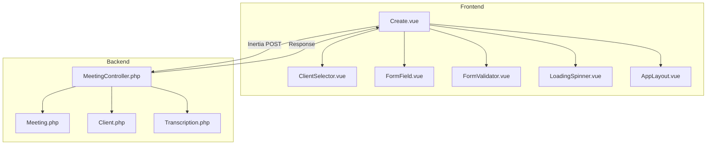
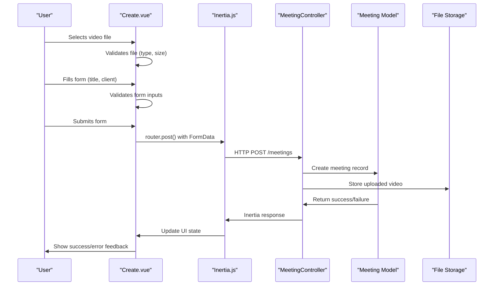
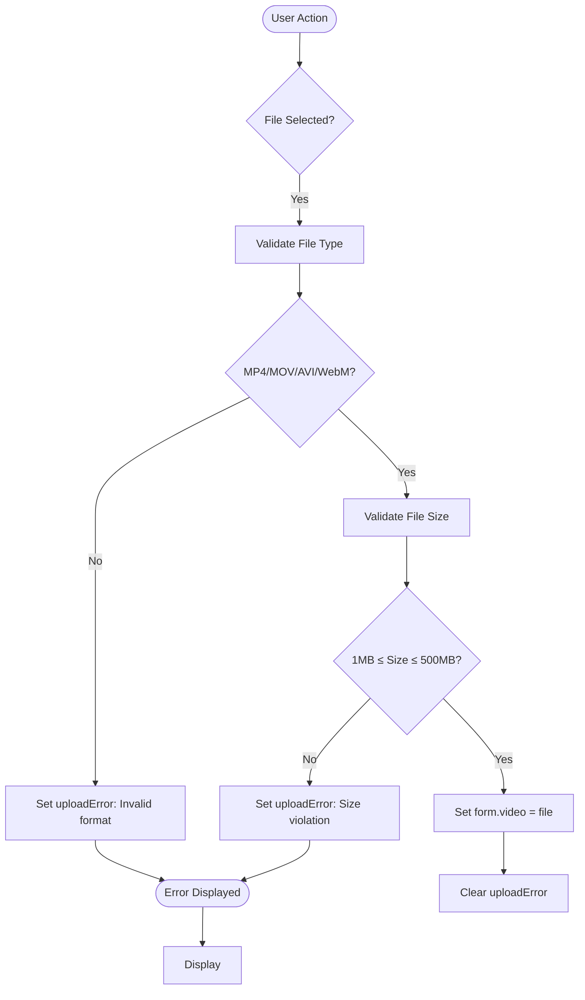
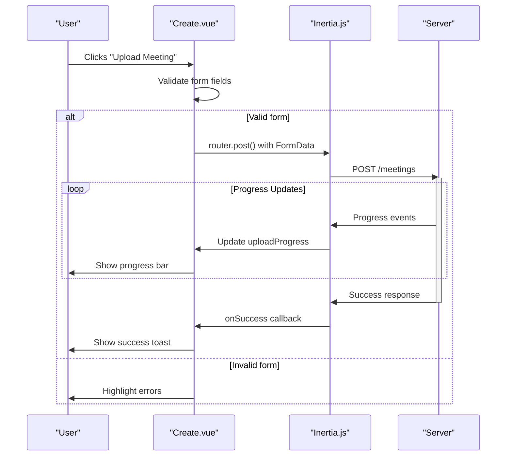
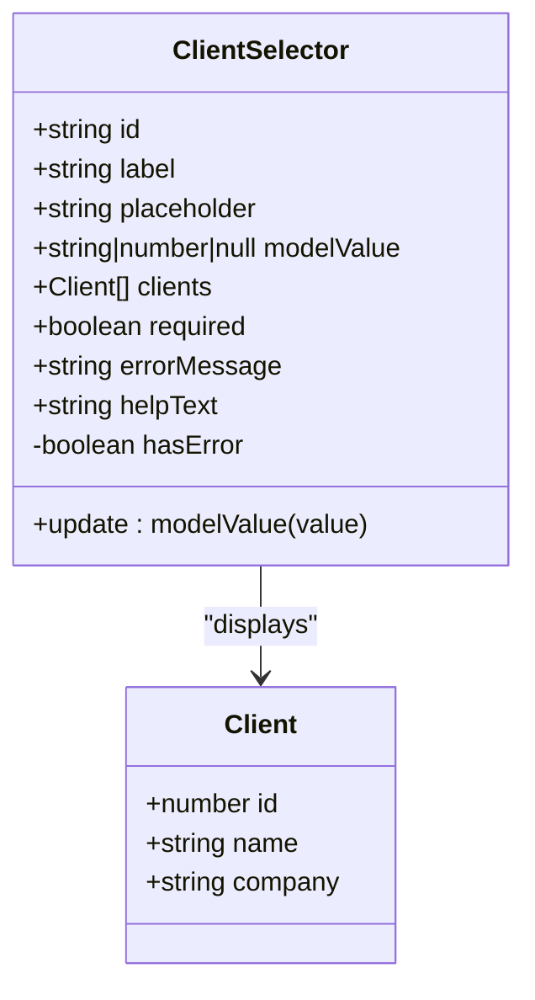
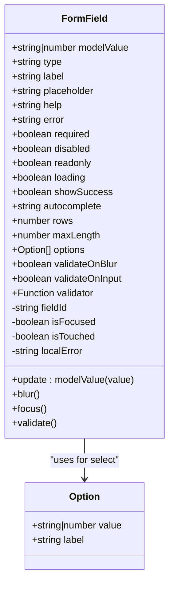
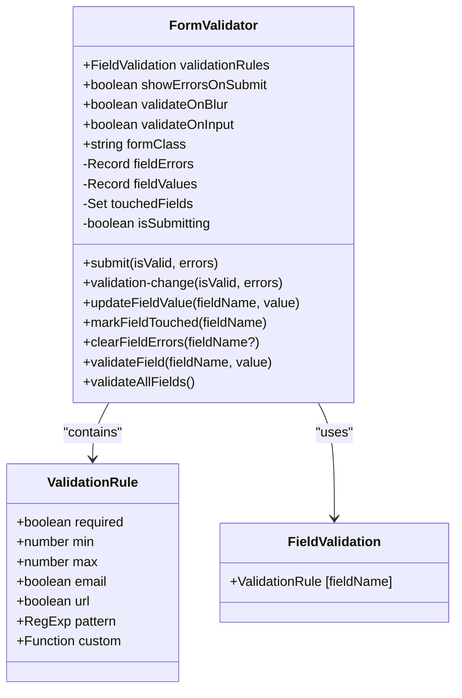
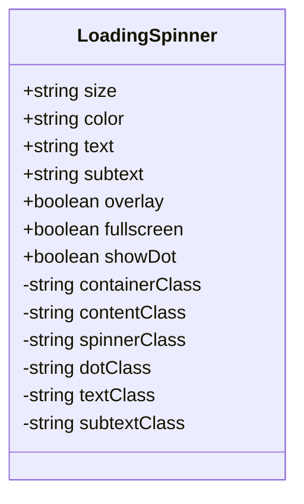
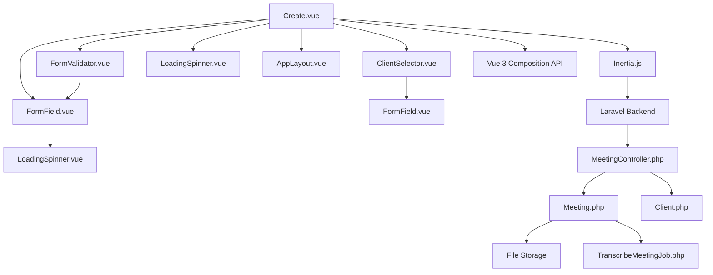
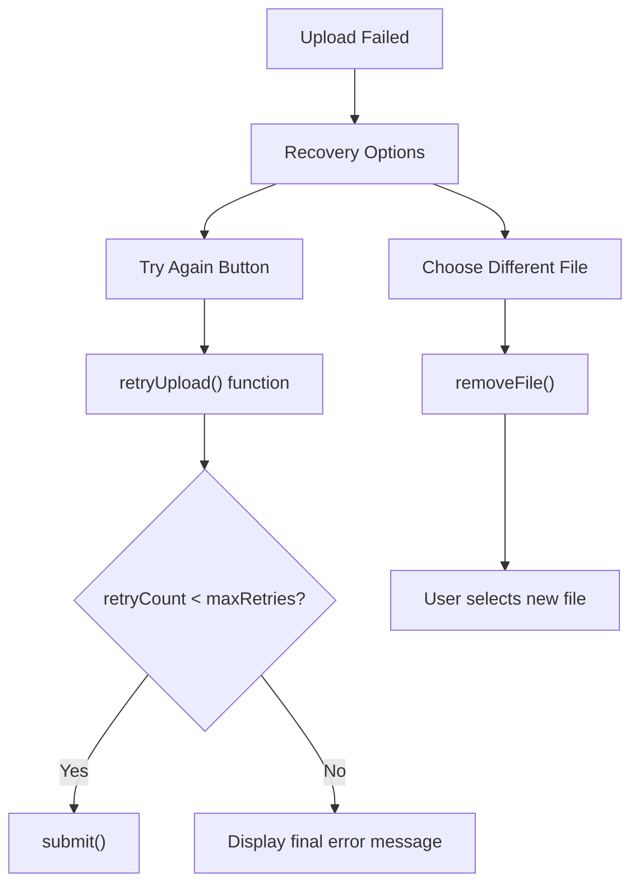

# Meeting Upload Page

## Table of Contents
1. [Introduction](#introduction)
2. [Project Structure](#project-structure)
3. [Core Components](#core-components)
4. [Architecture Overview](#architecture-overview)
5. [Detailed Component Analysis](#detailed-component-analysis)
6. [Dependency Analysis](#dependency-analysis)
7. [Performance Considerations](#performance-considerations)
8. [Troubleshooting Guide](#troubleshooting-guide)
9. [Conclusion](#conclusion)

## Introduction
The Meeting Upload page (Create.vue) provides a user interface for uploading meeting video files, associating them with clients, and initiating automated transcription and analysis workflows. This document details the implementation of the file upload workflow, including client selection, form validation, progress feedback, error handling, and integration with backend services via Inertia.js. The system supports drag-and-drop file uploads, real-time validation, and robust error recovery mechanisms for reliable large file processing.

## Project Structure
The application follows a Laravel-Vue hybrid architecture with Inertia.js for frontend-backend integration. The meeting upload functionality is primarily implemented in the frontend Vue components within the `resources/js/pages/Meetings/` directory, while server-side handling occurs in Laravel controllers and models.

**Diagram sources**
- [Create.vue](file://resources/js/pages/Meetings/Create.vue)
- [MeetingController.php](file://app/Http/Controllers/MeetingController.php)

**Section sources**
- [Create.vue](file://resources/js/pages/Meetings/Create.vue)
- [MeetingController.php](file://app/Http/Controllers/MeetingController.php)

## Core Components
The meeting upload workflow is built around several reusable Vue components that handle specific aspects of the user interface and interaction:

- **Create.vue**: Main page component for meeting uploads
- **ClientSelector.vue**: Client association component
- **FormField.vue**: Generic form input component with validation
- **FormValidator.vue**: Form-level validation manager
- **LoadingSpinner.vue**: Upload progress and loading feedback
- **AppLayout.vue**: Base application layout wrapper

These components work together to provide a cohesive user experience for uploading and processing meeting videos.

**Section sources**
- [Create.vue](file://resources/js/pages/Meetings/Create.vue)
- [ClientSelector.vue](file://resources/js/lib/ClientSelector.vue)
- [FormField.vue](file://resources/js/lib/FormField.vue)
- [FormValidator.vue](file://resources/js/lib/FormValidator.vue)
- [LoadingSpinner.vue](file://resources/js/lib/LoadingSpinner.vue)

## Architecture Overview
The meeting upload system follows a client-server architecture with Inertia.js facilitating communication between the Vue frontend and Laravel backend. The workflow begins with client-side form validation and file selection, proceeds through Inertia form submission, and concludes with server-side processing and response handling.

**Diagram sources**
- [Create.vue](file://resources/js/pages/Meetings/Create.vue#L200-L438)
- [MeetingController.php](file://app/Http/Controllers/MeetingController.php)

**Section sources**
- [Create.vue](file://resources/js/pages/Meetings/Create.vue)
- [MeetingController.php](file://app/Http/Controllers/MeetingController.php)

## Detailed Component Analysis

### Create.vue Analysis
The Create.vue component implements the main meeting upload interface with comprehensive file handling, form validation, and progress feedback.

#### File Upload and Validation
The component implements both click-to-upload and drag-and-drop interfaces for video file selection. It validates files client-side before upload based on type, size, and format requirements.

**Diagram sources**
- [Create.vue](file://resources/js/pages/Meetings/Create.vue#L270-L310)

**Section sources**
- [Create.vue](file://resources/js/pages/Meetings/Create.vue#L200-L438)

#### Form Submission Workflow
The form submission process integrates Inertia.js for seamless page transitions while providing real-time progress feedback and error recovery options.

**Diagram sources**
- [Create.vue](file://resources/js/pages/Meetings/Create.vue#L312-L380)

**Section sources**
- [Create.vue](file://resources/js/pages/Meetings/Create.vue#L312-L380)

### ClientSelector.vue Analysis
The ClientSelector.vue component provides a reusable interface for selecting clients from a dropdown list, with support for error states and help text.

**Diagram sources**
- [ClientSelector.vue](file://resources/js/lib/ClientSelector.vue)

**Section sources**
- [ClientSelector.vue](file://resources/js/lib/ClientSelector.vue)

### FormField.vue Analysis
The FormField.vue component implements a generic form input field with built-in validation, error handling, and visual feedback for various input types.

**Diagram sources**
- [FormField.vue](file://resources/js/lib/FormField.vue)

**Section sources**
- [FormField.vue](file://resources/js/lib/FormField.vue)

### FormValidator.vue Analysis
The FormValidator.vue component provides form-level validation management, coordinating validation rules and error states across multiple form fields.

**Diagram sources**
- [FormValidator.vue](file://resources/js/lib/FormValidator.vue)

**Section sources**
- [FormValidator.vue](file://resources/js/lib/FormValidator.vue)

### LoadingSpinner.vue Analysis
The LoadingSpinner.vue component provides visual feedback for loading states and upload progress, with configurable size, color, and text.

**Diagram sources**
- [LoadingSpinner.vue](file://resources/js/lib/LoadingSpinner.vue)

**Section sources**
- [LoadingSpinner.vue](file://resources/js/lib/LoadingSpinner.vue)

## Dependency Analysis
The meeting upload components have a clear dependency hierarchy, with higher-level components composing lower-level reusable elements.

**Diagram sources**
- [Create.vue](file://resources/js/pages/Meetings/Create.vue)
- [ClientSelector.vue](file://resources/js/lib/ClientSelector.vue)
- [MeetingController.php](file://app/Http/Controllers/MeetingController.php)

**Section sources**
- [Create.vue](file://resources/js/pages/Meetings/Create.vue)
- [MeetingController.php](file://app/Http/Controllers/MeetingController.php)

## Performance Considerations
The meeting upload system implements several performance optimizations to handle large video files efficiently:

- **Chunked Uploads**: While not explicitly implemented in the current code, the 500MB limit suggests consideration for large file handling
- **Client-side Validation**: Immediate feedback on file type and size prevents unnecessary server requests
- **Progress Feedback**: Real-time upload progress keeps users informed during potentially long operations
- **Memory Management**: File objects are managed through refs and cleared on removal
- **Event Listeners**: Proper cleanup of global drag events prevents memory leaks

The system could be enhanced with actual chunked upload implementation for files approaching the 500MB limit, which would improve reliability and allow for resumable uploads.

**Section sources**
- [Create.vue](file://resources/js/pages/Meetings/Create.vue#L270-L310)

## Troubleshooting Guide
Common issues and their solutions for the meeting upload functionality:

### File Upload Issues
**Problem**: "File size must be less than 500MB" error
- **Cause**: Video file exceeds maximum size limit
- **Solution**: Compress video or split into smaller segments

**Problem**: "Please select a valid video file" error
- **Cause**: File format not supported (must be MP4, MOV, AVI, or WebM)
- **Solution**: Convert file to supported format using video conversion tools

**Problem**: Upload progress stalls or fails
- **Cause**: Network interruption or server timeout
- **Solution**: Check internet connection, retry upload, or contact administrator

### Form Validation Issues
**Problem**: Required fields not highlighted
- **Cause**: JavaScript error preventing validation
- **Solution**: Check browser console for errors, refresh page

**Problem**: Client selection not persisting
- **Cause**: Page navigation issue with query parameters
- **Solution**: Ensure client_id parameter is correctly passed in URL

### Error Recovery Scenarios
The system provides built-in error recovery mechanisms:

**Diagram sources**
- [Create.vue](file://resources/js/pages/Meetings/Create.vue#L382-L398)

**Section sources**
- [Create.vue](file://resources/js/pages/Meetings/Create.vue#L382-L398)

## Conclusion
The Meeting Upload page provides a robust, user-friendly interface for uploading meeting videos with comprehensive validation, progress feedback, and error recovery. The implementation leverages reusable Vue components for form handling, client selection, and loading states, integrated with Laravel backend services through Inertia.js. Key strengths include client-side validation to prevent unnecessary server requests, real-time progress feedback, and a resilient error recovery system. Future enhancements could include actual chunked upload support for very large files and improved accessibility features.

**Referenced Files in This Document**   
- [Create.vue](file://resources/js/pages/Meetings/Create.vue)
- [ClientSelector.vue](file://resources/js/lib/ClientSelector.vue)
- [FormField.vue](file://resources/js/lib/FormField.vue)
- [FormValidator.vue](file://resources/js/lib/FormValidator.vue)
- [LoadingSpinner.vue](file://resources/js/lib/LoadingSpinner.vue)
- [MeetingController.php](file://app/Http/Controllers/MeetingController.php)
- [app.blade.php](file://resources/views/app.blade.php)
- [HandleInertiaRequests.php](file://app/Http/Middleware/HandleInertiaRequests.php)