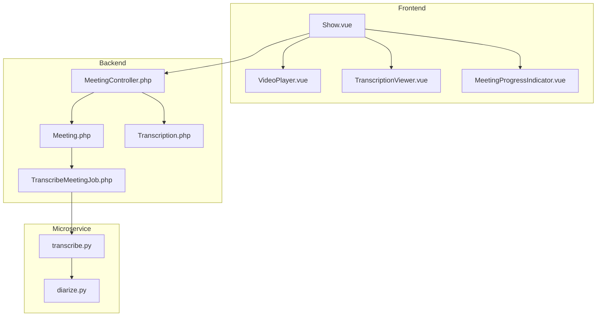
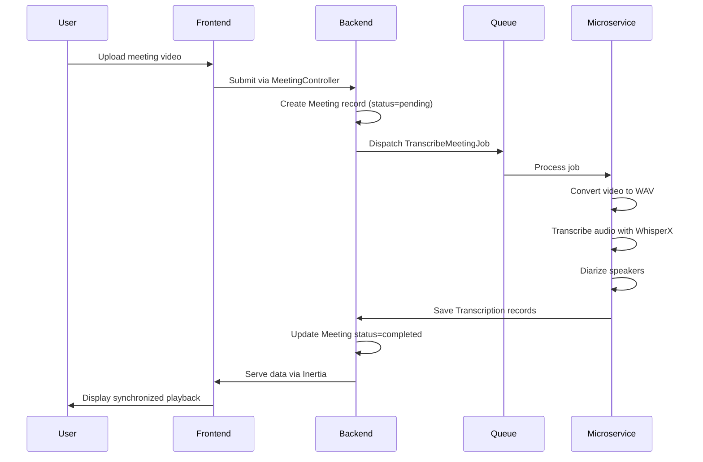
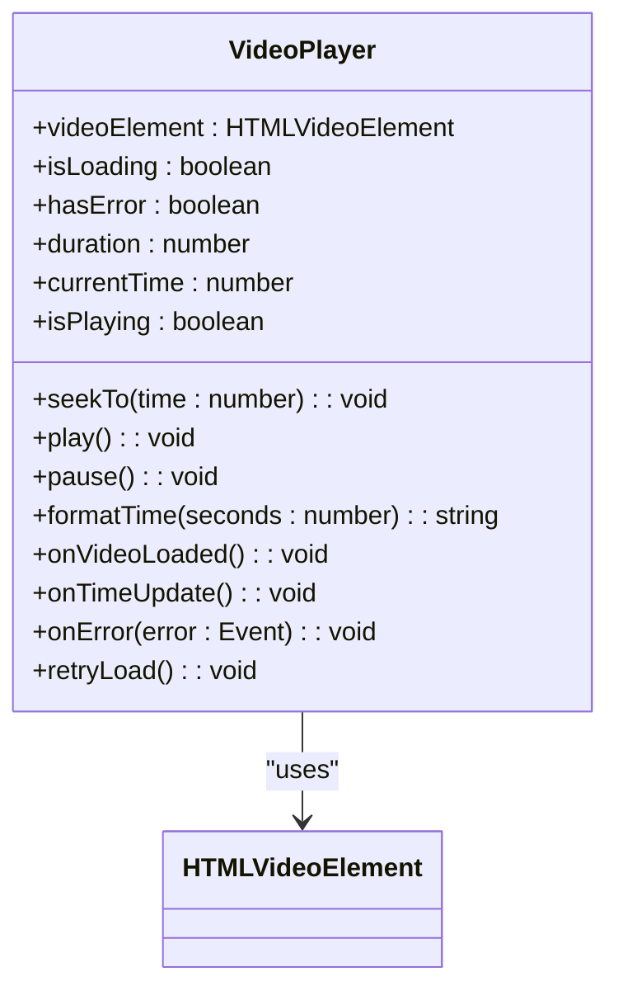
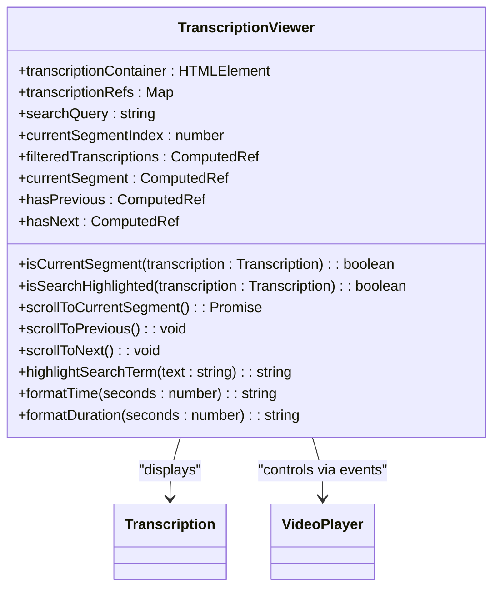
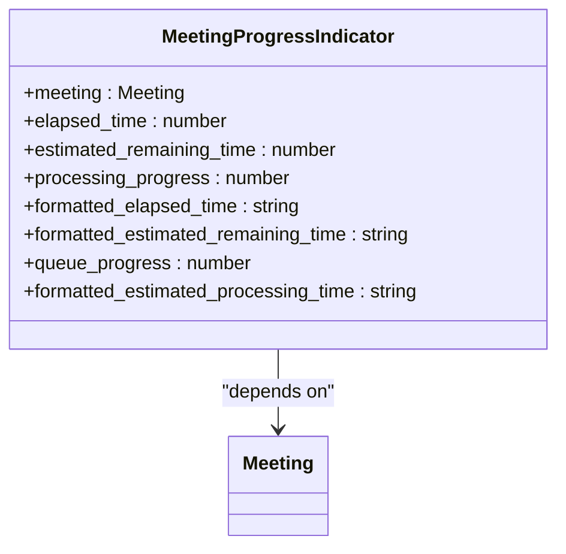
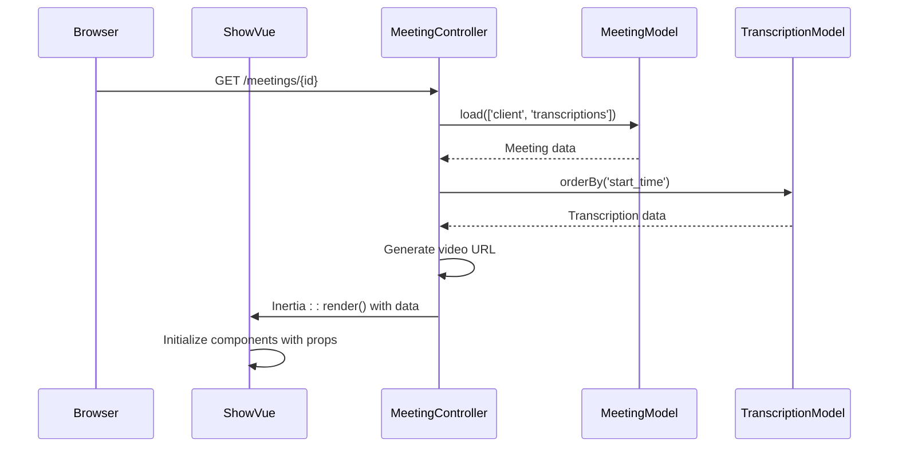
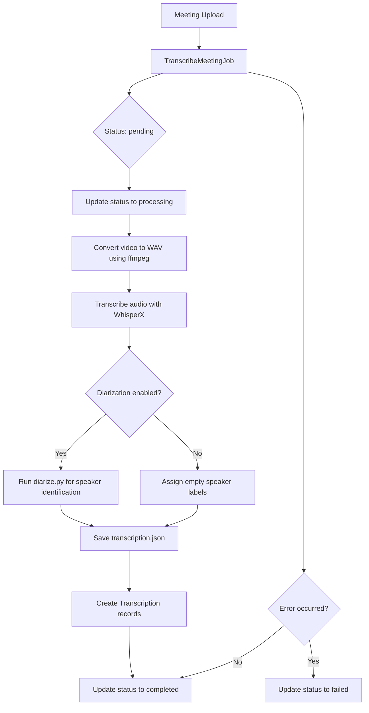
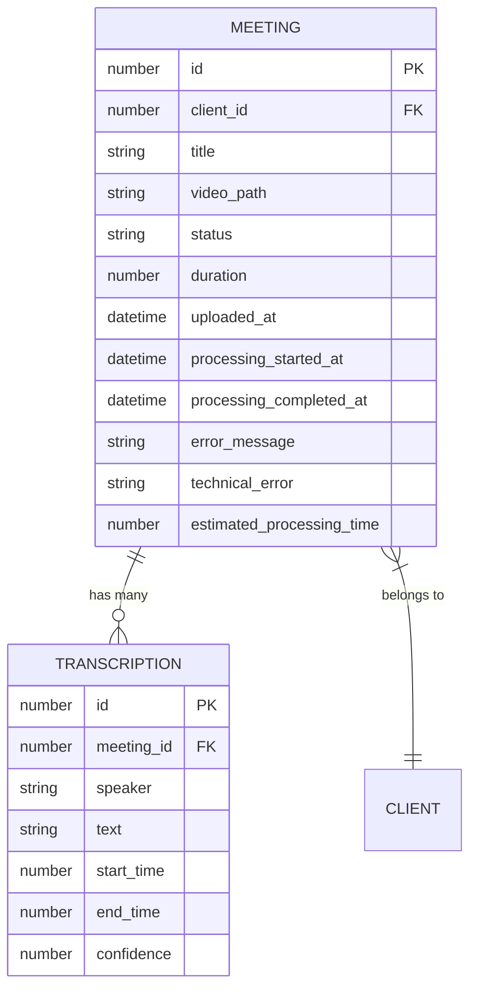

# Meeting Playback and Transcription Viewer

## Table of Contents
1. [Introduction](#introduction)
2. [Project Structure](#project-structure)
3. [Core Components](#core-components)
4. [Architecture Overview](#architecture-overview)
5. [Detailed Component Analysis](#detailed-component-analysis)
6. [Data Flow and Backend Processing](#data-flow-and-backend-processing)
7. [Performance Considerations](#performance-considerations)
8. [Troubleshooting Guide](#troubleshooting-guide)
9. [Conclusion](#conclusion)

## Introduction
This document provides a comprehensive analysis of the Meeting Playback and Transcription Viewer system, focusing on synchronized video and transcription display. The system enables users to view meeting recordings alongside real-time highlighted transcriptions, with features including speaker identification, text search, and navigation controls. The documentation covers frontend components, backend models, data flow via Inertia.js, and the transcription processing pipeline. Special attention is given to synchronization mechanisms, error handling, and performance optimization for large files.

## Project Structure
The application follows a Laravel-Vue.js hybrid architecture with Inertia.js for frontend integration. The project is organized into backend (PHP/Laravel) and frontend (Vue.js/TypeScript) components, with a microservice for transcription processing.

**Diagram sources**
- [Show.vue](file://resources/js/pages/Meetings/Show.vue)
- [MeetingController.php](file://app/Http/Controllers/MeetingController.php)
- [TranscribeMeetingJob.php](file://app/Jobs/TranscribeMeetingJob.php)

**Section sources**
- [Show.vue](file://resources/js/pages/Meetings/Show.vue)
- [MeetingController.php](file://app/Http/Controllers/MeetingController.php)

## Core Components
The system's core functionality is built around three main Vue.js components: VideoPlayer.vue for media playback, TranscriptionViewer.vue for synchronized transcription display, and MeetingProgressIndicator.vue for processing status visualization. These components work together to provide a seamless playback experience with real-time transcription highlighting.

**Section sources**
- [VideoPlayer.vue](file://resources/js/lib/VideoPlayer.vue)
- [TranscriptionViewer.vue](file://resources/js/lib/TranscriptionViewer.vue)
- [MeetingProgressIndicator.vue](file://resources/js/lib/MeetingProgressIndicator.vue)

## Architecture Overview
The system follows a client-server architecture with a transcription microservice. The frontend Vue.js application communicates with the Laravel backend via Inertia.js, which serves data from Eloquent models. When a meeting is uploaded, a queued job processes the video through a Dockerized transcription microservice that uses WhisperX for speech-to-text conversion and speaker diarization.

**Diagram sources**
- [MeetingController.php](file://app/Http/Controllers/MeetingController.php)
- [TranscribeMeetingJob.php](file://app/Jobs/TranscribeMeetingJob.php)
- [transcribe.py](file://transcribe-microservice/transcribe.py)

## Detailed Component Analysis

### VideoPlayer Component Analysis
The VideoPlayer component integrates with the browser's native media API to control video playback. It exposes methods for seeking, playing, and pausing, while emitting time update events that synchronize with the transcription display.

**Diagram sources**
- [VideoPlayer.vue](file://resources/js/lib/VideoPlayer.vue)

**Section sources**
- [VideoPlayer.vue](file://resources/js/lib/VideoPlayer.vue)

### TranscriptionViewer Component Analysis
The TranscriptionViewer component displays meeting transcriptions with real-time highlighting of the current segment based on video playback time. It supports text search with highlighting and allows clicking on timestamps to seek the video player.

**Diagram sources**
- [TranscriptionViewer.vue](file://resources/js/lib/TranscriptionViewer.vue)

**Section sources**
- [TranscriptionViewer.vue](file://resources/js/lib/TranscriptionViewer.vue)

### MeetingProgressIndicator Component Analysis
The MeetingProgressIndicator component visualizes the processing status of meetings, showing progress bars and time estimates for queued and processing meetings, and appropriate indicators for completed or failed states.

**Diagram sources**
- [MeetingProgressIndicator.vue](file://resources/js/lib/MeetingProgressIndicator.vue)

**Section sources**
- [MeetingProgressIndicator.vue](file://resources/js/lib/MeetingProgressIndicator.vue)

## Data Flow and Backend Processing

### Data Flow from Backend to Frontend
The data flow begins with the MeetingController serving meeting data via Inertia.js to the Show.vue page. The controller loads the meeting with its transcriptions and generates a signed URL for video playback.

**Diagram sources**
- [MeetingController.php](file://app/Http/Controllers/MeetingController.php)
- [Show.vue](file://resources/js/pages/Meetings/Show.vue)

**Section sources**
- [MeetingController.php](file://app/Http/Controllers/MeetingController.php)
- [Show.vue](file://resources/js/pages/Meetings/Show.vue)

### Transcription Processing Pipeline
The transcription processing pipeline is triggered when a meeting is uploaded. A queued job processes the video through a series of steps including format conversion, speech-to-text transcription, and speaker diarization.

**Diagram sources**
- [TranscribeMeetingJob.php](file://app/Jobs/TranscribeMeetingJob.php)
- [transcribe.py](file://transcribe-microservice/transcribe.py)
- [diarize.py](file://transcribe-microservice/diarize.py)

**Section sources**
- [TranscribeMeetingJob.php](file://app/Jobs/TranscribeMeetingJob.php)
- [transcribe.py](file://transcribe-microservice/transcribe.py)

### Model Relationships and Data Structure
The backend models define the core data structure with Meeting and Transcription having a one-to-many relationship. The Meeting model includes calculated attributes for processing progress and time estimates.

**Diagram sources**
- [Meeting.php](file://app/Models/Meeting.php)
- [Transcription.php](file://app/Models/Transcription.php)

**Section sources**
- [Meeting.php](file://app/Models/Meeting.php)
- [Transcription.php](file://app/Models/Transcription.php)

## Performance Considerations
The system implements several performance optimizations to handle large transcription files and ensure smooth synchronization:

1. **Lazy Loading**: Transcription data is loaded only when the meeting status is 'completed' and video is available
2. **Virtual Scrolling**: The TranscriptionViewer limits rendering to visible segments through CSS overflow
3. **Efficient Updates**: The system uses Vue's reactivity system with computed properties to minimize re-renders
4. **Debounced Search**: Text search is implemented with reactive properties that automatically update filtered results
5. **Memory Management**: The VideoPlayer component properly cleans up event listeners and references on unmount

For large files, the system may experience performance issues with transcription search or scrolling. In such cases, implementing virtual scrolling with Intersection Observer API would further improve performance by rendering only visible segments.

## Troubleshooting Guide

### Sync Drift Issues
**Symptoms**: Transcription highlighting does not match video playback position
**Solutions**:
1. Verify that transcription timestamps are in seconds and match the video duration
2. Check that the VideoPlayer's timeupdate event is properly synchronized with the TranscriptionViewer
3. Ensure the browser's media API is not experiencing buffering issues
4. Validate that the transcription file was properly aligned during processing

**Section sources**
- [VideoPlayer.vue](file://resources/js/lib/VideoPlayer.vue)
- [TranscriptionViewer.vue](file://resources/js/lib/TranscriptionViewer.vue)

### Playback Errors
**Symptoms**: Video fails to load or play
**Solutions**:
1. Check that the video file exists at the specified path in storage
2. Verify the video URL is properly generated with asset() helper
3. Ensure the public disk is properly configured in filesystems.php
4. Check browser console for specific media errors (MEDIA_ERR_SRC_NOT_SUPPORTED, etc.)
5. Test with different video formats (MP4 recommended)

**Section sources**
- [VideoPlayer.vue](file://resources/js/lib/VideoPlayer.vue)
- [MeetingController.php](file://app/Http/Controllers/MeetingController.php)

### Missing Transcription Data
**Symptoms**: No transcription displayed despite completed status
**Solutions**:
1. Verify the TranscribeMeetingJob completed successfully without errors
2. Check that transcription.json was generated in the storage directory
3. Ensure the database contains Transcription records for the meeting
4. Validate that the meeting model properly loads the transcriptions relationship
5. Check for any JavaScript errors in the TranscriptionViewer component

**Section sources**
- [TranscribeMeetingJob.php](file://app/Jobs/TranscribeMeetingJob.php)
- [Transcription.php](file://app/Models/Transcription.php)
- [TranscriptionViewer.vue](file://resources/js/lib/TranscriptionViewer.vue)

### Processing Failures
**Symptoms**: Meeting status remains pending or processing indefinitely
**Solutions**:
1. Check queue worker is running: `php artisan queue:work`
2. Verify Docker is running and accessible
3. Ensure ffmpeg and transcription containers are available
4. Check storage space availability
5. Review logs for specific error messages in storage/logs/laravel.log

**Section sources**
- [TranscribeMeetingJob.php](file://app/Jobs/TranscribeMeetingJob.php)
- [transcribe.py](file://transcribe-microservice/transcribe.py)

## Conclusion
The Meeting Playback and Transcription Viewer system provides a robust solution for synchronized video and transcription display. The architecture effectively separates concerns between frontend presentation and backend processing, with a well-defined data flow from upload to playback. Key strengths include real-time synchronization, speaker identification, and comprehensive error handling. For future improvements, implementing virtual scrolling for large transcriptions and adding WebSocket-based real-time updates would enhance performance and user experience. The system demonstrates a solid implementation of modern web technologies for media processing and display.

**Referenced Files in This Document**   
- [Show.vue](file://resources/js/pages/Meetings/Show.vue)
- [VideoPlayer.vue](file://resources/js/lib/VideoPlayer.vue)
- [TranscriptionViewer.vue](file://resources/js/lib/TranscriptionViewer.vue)
- [MeetingProgressIndicator.vue](file://resources/js/lib/MeetingProgressIndicator.vue)
- [Meeting.php](file://app/Models/Meeting.php)
- [Transcription.php](file://app/Models/Transcription.php)
- [MeetingController.php](file://app/Http/Controllers/MeetingController.php)
- [TranscribeMeetingJob.php](file://app/Jobs/TranscribeMeetingJob.php)
- [transcribe.py](file://transcribe-microservice/transcribe.py)
- [diarize.py](file://transcribe-microservice/diarize.py)