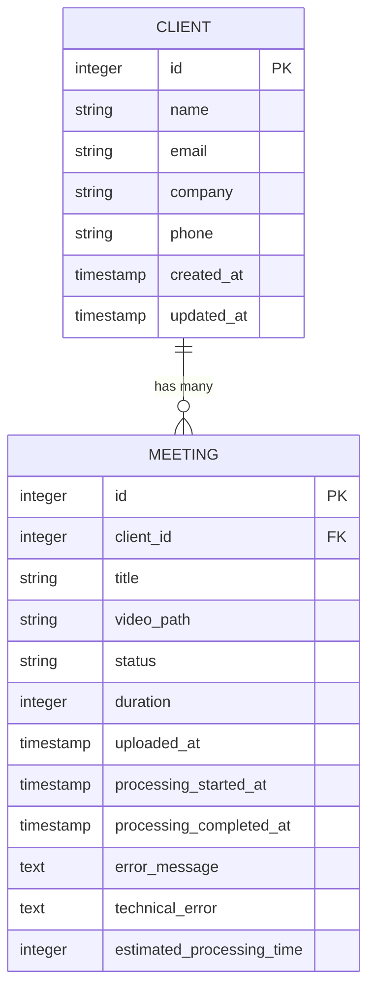
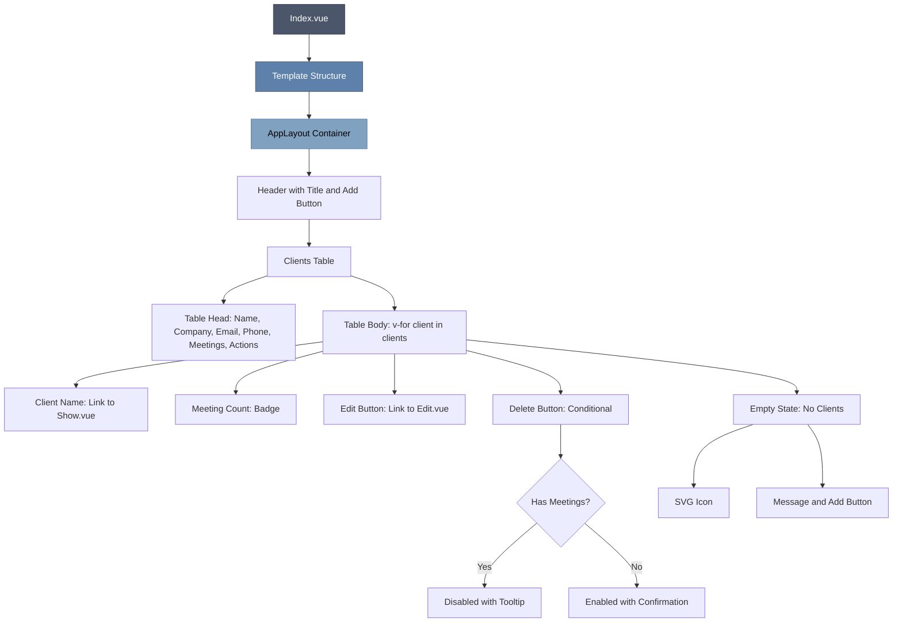
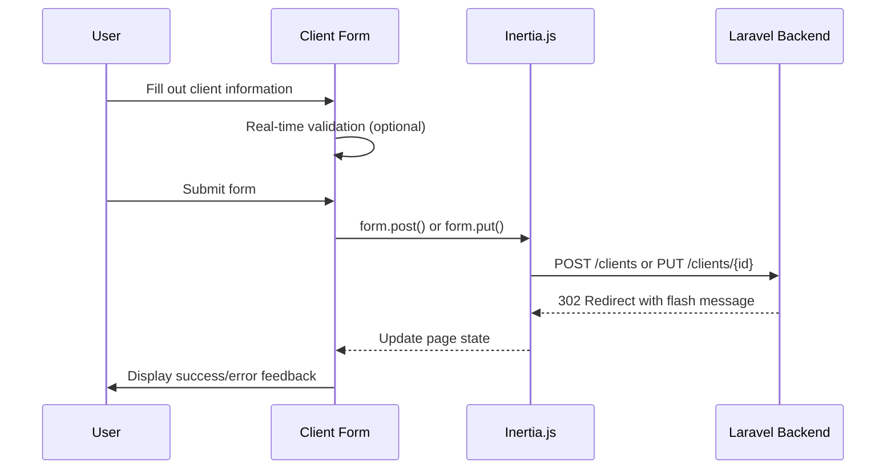
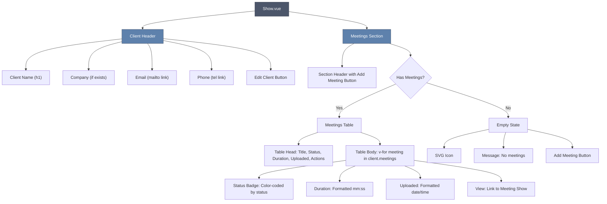
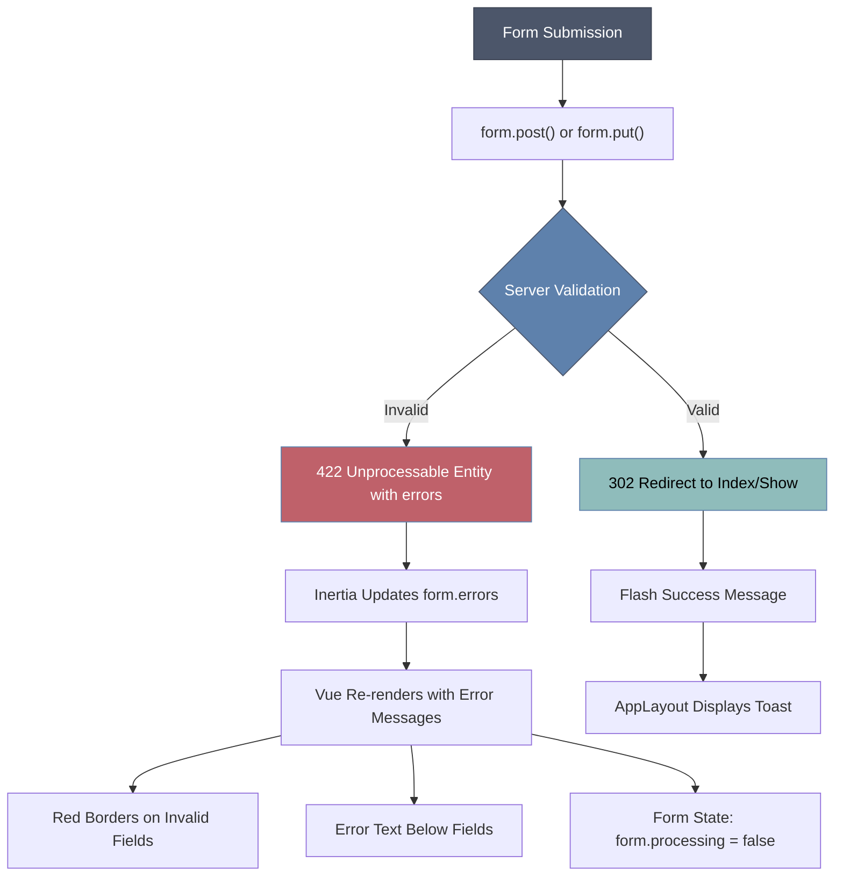
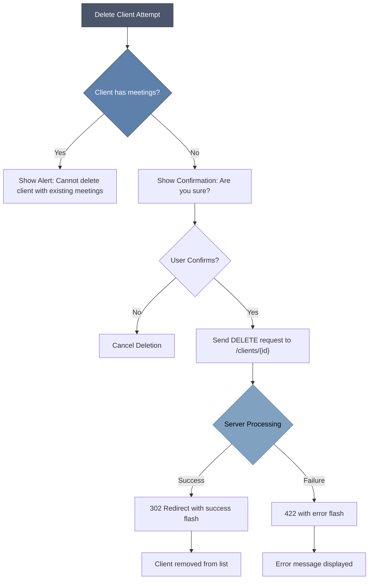
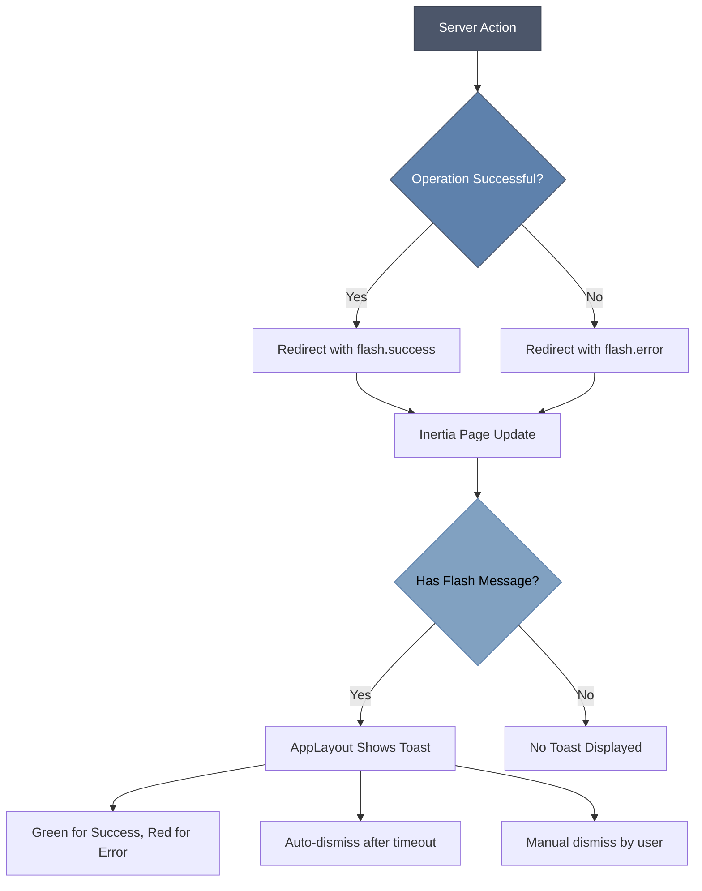

# Clients Pages


## Table of Contents
1. [Clients Pages](#clients-pages)
2. [Overview of Client Management](#overview-of-client-management)
3. [Client Entity and Data Model](#client-entity-and-data-model)
4. [Routing and Navigation](#routing-and-navigation)
5. [Index Page: Client List](#index-page-client-list)
6. [Create and Edit Pages: Form Handling](#create-and-edit-pages-form-handling)
7. [Show Page: Client Details and Meetings](#show-page-client-details-and-meetings)
8. [Form Validation and User Feedback](#form-validation-and-user-feedback)
9. [Data Consistency and Deletion Rules](#data-consistency-and-deletion-rules)
10. [Integration with Flash Messages](#integration-with-flash-messages)

## Overview of Client Management

The Clients page group provides a complete interface for managing client entities within the MeetingAI application. Clients serve as organizational units for meetings, enabling users to group, track, and manage interactions by client account. The system supports four primary operations: listing clients (Index), creating new clients (Create), modifying existing clients (Edit), and viewing client details with associated meetings (Show). These pages follow a consistent design pattern using Vue 3 with the Inertia.js framework for seamless page transitions and state management.

**Section sources**
- [Index.vue](file://resources/js/pages/Clients/Index.vue#L1-L121)
- [Create.vue](file://resources/js/pages/Clients/Create.vue#L1-L127)
- [Edit.vue](file://resources/js/pages/Clients/Edit.vue#L1-L130)
- [Show.vue](file://resources/js/pages/Clients/Show.vue#L1-L184)

## Client Entity and Data Model

The Client entity represents a business contact or organization and serves as a container for related meetings. Each client has basic contact metadata including name, email, company, and phone number. The data model is implemented with a one-to-many relationship to the Meeting entity, meaning each client can have multiple associated meetings.





**Diagram sources**
- [Client.php](file://app/Models/Client.php#L0-L27)
- [Meeting.php](file://app/Models/Meeting.php#L0-L178)

**Section sources**
- [Client.php](file://app/Models/Client.php#L0-L27)
- [Meeting.php](file://app/Models/Meeting.php#L0-L178)

## Routing and Navigation

Client pages are accessed through RESTful routes defined in the web.php file. The routes follow Laravel's resource pattern, automatically generating endpoints for index, create, store, show, edit, update, and destroy operations. Routing parameters are handled by Inertia.js, which enables client-side navigation while maintaining server-side rendering capabilities.


```mermaid
flowchart TD
A["GET /clients"] --> B[Index.vue]
C["GET /clients/create"] --> D[Create.vue]
E["POST /clients"] --> F[ClientController@store]
G["GET /clients/{id}"] --> H[Show.vue]
I["GET /clients/{id}/edit"] --> J[Edit.vue]
K["PUT/PATCH /clients/{id}"] --> L[ClientController@update]
M["DELETE /clients/{id}"] --> N[ClientController@destroy]
B --> C
B --> G
D --> A
H --> J
H --> O["GET /meetings/create?client_id={id}"]
J --> H
J --> A
```


**Diagram sources**
- [web.php](file://routes/web.php#L0-L46)

**Section sources**
- [web.php](file://routes/web.php#L0-L46)

## Index Page: Client List

The Index.vue component renders a comprehensive list of all clients in a tabular format. The table displays key client information including name, company, email, phone, and the number of associated meetings. Each row provides edit and delete actions, with the delete button conditionally disabled when a client has existing meetings to prevent data integrity issues.

The page includes a prominent "Add Client" button that navigates to the creation form. When no clients exist, a descriptive empty state is shown with guidance and a call-to-action button. Client names are clickable links that navigate to the respective Show page for detailed view.





**Diagram sources**
- [Index.vue](file://resources/js/pages/Clients/Index.vue#L1-L121)

**Section sources**
- [Index.vue](file://resources/js/pages/Clients/Index.vue#L1-L121)

## Create and Edit Pages: Form Handling

The Create.vue and Edit.vue components share nearly identical form structures, demonstrating a reusable design pattern for client data entry. Both pages utilize Inertia's useForm helper to manage form state, validation errors, and submission processing. The form includes fields for client name (required), email, company, and phone number, arranged in a responsive grid layout.

The Create page initializes an empty form, while the Edit page pre-populates fields with existing client data passed as a prop. Both forms use the same validation rules and visual feedback mechanisms. Upon submission, Create.vue sends a POST request to store the new client, while Edit.vue sends a PUT request to update the existing record.





**Diagram sources**
- [Create.vue](file://resources/js/pages/Clients/Create.vue#L1-L127)
- [Edit.vue](file://resources/js/pages/Clients/Edit.vue#L1-L130)

**Section sources**
- [Create.vue](file://resources/js/pages/Clients/Create.vue#L1-L127)
- [Edit.vue](file://resources/js/pages/Clients/Edit.vue#L1-L130)

## Show Page: Client Details and Meetings

The Show.vue component provides a detailed view of a specific client, including all contact information and a summary of associated meetings. The page header displays the client's name, company, email (as a mailto link), and phone (as a tel link) in a clean, readable format with an "Edit Client" button for quick modifications.

Below the header, the meetings section lists all meetings associated with the client in a table format. The table includes meeting title, status (with color-coded badges), duration, upload date, and a "View" action. Status badges use different colors based on meeting state: green for completed, yellow for processing, red for failed, and gray for pending. When no meetings exist, an empty state with a call-to-action to add a meeting is displayed.





**Diagram sources**
- [Show.vue](file://resources/js/pages/Clients/Show.vue#L1-L184)

**Section sources**
- [Show.vue](file://resources/js/pages/Clients/Show.vue#L1-L184)

## Form Validation and User Feedback

Form validation is implemented using Inertia's built-in form handling rather than the FormValidator.vue component. The useForm helper automatically manages validation errors returned from the server, displaying them beneath the corresponding fields. Visual feedback includes red borders on invalid fields and red text for error messages.

The name field is required and validated on the server side. Email fields are validated for proper format. The UI provides immediate feedback during form submission, with buttons showing "Creating..." or "Updating..." text while processing, and being disabled during submission to prevent duplicate requests.





**Section sources**
- [Create.vue](file://resources/js/pages/Clients/Create.vue#L29-L63)
- [Edit.vue](file://resources/js/pages/Clients/Edit.vue#L30-L65)
- [FormValidator.vue](file://resources/js/lib/FormValidator.vue#L0-L238)

## Data Consistency and Deletion Rules

The system enforces data consistency between clients and their associated meetings through both UI and backend rules. The frontend prevents deletion of clients with existing meetings by disabling the delete button and showing an alert when clicked. This is implemented in the deleteClient function in Index.vue, which checks the meetings_count property before allowing deletion.

The backend reinforces this rule through the ClientController, which should reject delete requests for clients with meetings. This dual-layer protection ensures referential integrity, as meetings depend on their parent client. When a client is successfully deleted, all associated meetings would typically be handled according to business rules (either deleted or orphaned, though the exact behavior depends on the controller implementation).





**Section sources**
- [Index.vue](file://resources/js/pages/Clients/Index.vue#L102-L120)
- [Client.php](file://app/Models/Client.php#L0-L27)
- [Meeting.php](file://app/Models/Meeting.php#L0-L178)

## Integration with Flash Messages

User feedback is provided through flash messages integrated with the AppLayout.vue component. After successful client creation, update, or deletion, the server redirects with a flash message that is displayed as a toast notification at the top of the page. Success messages appear with a green background and checkmark icon, while error messages appear with a red background and cross icon.

The AppLayout component listens for flash messages in the page props and displays them using Vue transitions for a smooth user experience. Messages can be dismissed manually by clicking the close button. This feedback mechanism is crucial for confirming successful operations and informing users of validation or business rule errors.





**Diagram sources**
- [AppLayout.vue](file://resources/js/lib/AppLayout.vue#L122-L199)

**Section sources**
- [AppLayout.vue](file://resources/js/lib/AppLayout.vue#L122-L199)

**Referenced Files in This Document**   
- [Index.vue](file://resources/js/pages/Clients/Index.vue)
- [Create.vue](file://resources/js/pages/Clients/Create.vue)
- [Edit.vue](file://resources/js/pages/Clients/Edit.vue)
- [Show.vue](file://resources/js/pages/Clients/Show.vue)
- [FormValidator.vue](file://resources/js/lib/FormValidator.vue)
- [Client.php](file://app/Models/Client.php)
- [Meeting.php](file://app/Models/Meeting.php)
- [web.php](file://routes/web.php)
- [AppLayout.vue](file://resources/js/lib/AppLayout.vue)