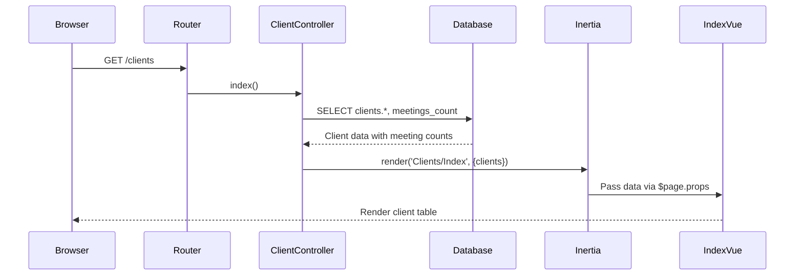
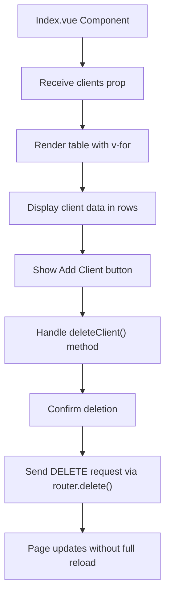
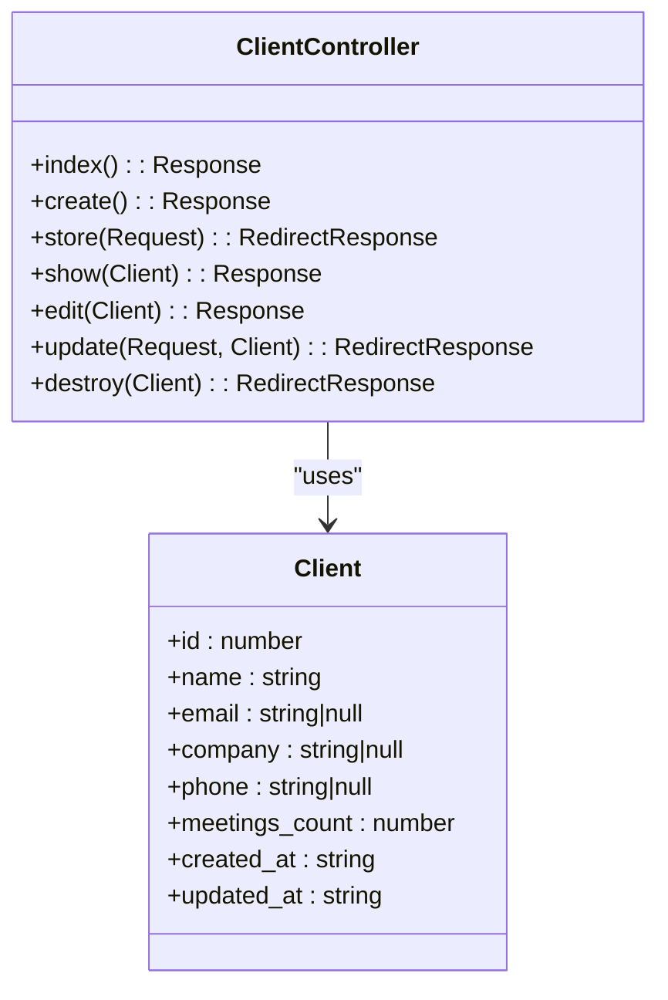
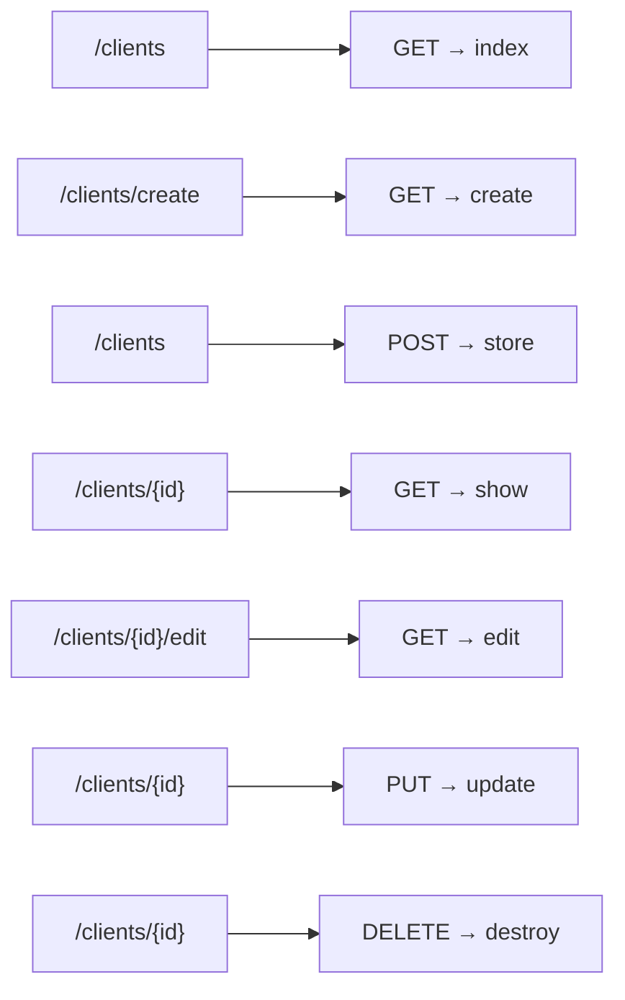
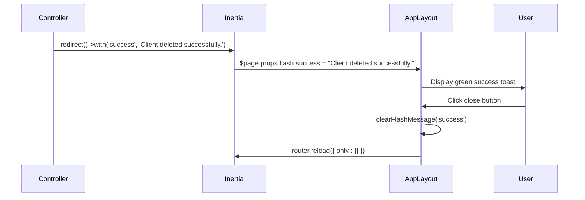
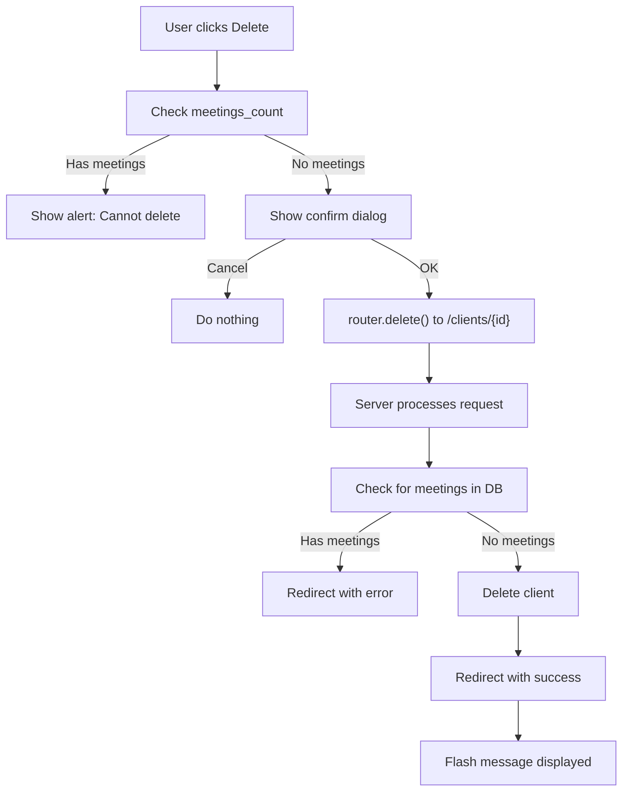
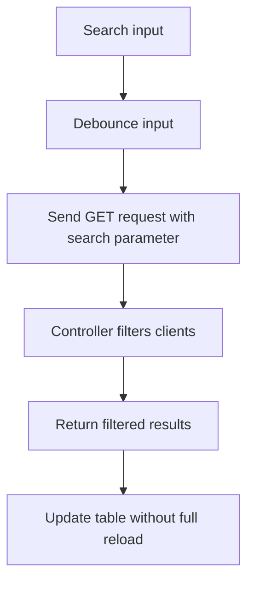

# Clients Index Page


## Table of Contents
1. [Clients Index Page](#clients-index-page)
2. [Data Flow Overview](#data-flow-overview)
3. [Frontend Implementation](#frontend-implementation)
4. [Backend Controller Logic](#backend-controller-logic)
5. [Client Data Structure](#client-data-structure)
6. [Routing Configuration](#routing-configuration)
7. [Flash Message Handling](#flash-message-handling)
8. [Delete Operation Workflow](#delete-operation-workflow)
9. [UI and User Experience](#ui-and-user-experience)
10. [Potential Enhancements](#potential-enhancements)

## Data Flow Overview

The Clients Index page operates within a modern Laravel-Vue stack using Inertia.js for seamless frontend-backend integration. The data flow begins with a user navigating to the `/clients` route, which triggers the `index` method of `ClientController`. This method retrieves client data from the database and passes it to the `Clients/Index` Vue component via Inertia's `render` method. The frontend then renders the data in a responsive table format with interactive elements for editing and deleting clients.





**Diagram sources**
- [ClientController.php](file://app/Http/Controllers/ClientController.php#L15-L22)
- [Index.vue](file://resources/js/pages/Clients/Index.vue#L1-L121)

**Section sources**
- [ClientController.php](file://app/Http/Controllers/ClientController.php#L15-L22)
- [Index.vue](file://resources/js/pages/Clients/Index.vue#L1-L121)

## Frontend Implementation

The `Index.vue` component serves as the primary interface for viewing and managing clients. It uses Vue 3's `<script setup>` syntax with TypeScript for type safety. The component receives client data as a prop and renders it in a responsive table with columns for name, company, email, phone, meeting count, and action buttons.

Key features of the frontend implementation include:
- Responsive table design using Tailwind CSS
- Inertia Links for navigation to create, view, and edit clients
- Inline delete button with conditional disable logic
- Empty state display when no clients exist
- Type-safe props using the `Client` interface





**Diagram sources**
- [Index.vue](file://resources/js/pages/Clients/Index.vue#L1-L121)

**Section sources**
- [Index.vue](file://resources/js/pages/Clients/Index.vue#L1-L121)

## Backend Controller Logic

The `ClientController` class handles all client-related operations, with the `index` method specifically responsible for serving the Clients Index page. This method uses Eloquent's `withCount` to efficiently retrieve the number of meetings associated with each client, orders the results by client name, and passes the data to the Inertia view.

The controller also implements proper resource routing with methods for create, store, show, edit, update, and destroy operations. The `destroy` method includes business logic to prevent deletion of clients that have associated meetings, ensuring data integrity.





**Diagram sources**
- [ClientController.php](file://app/Http/Controllers/ClientController.php#L1-L95)
- [index.ts](file://resources/js/types/index.ts#L1-L9)

**Section sources**
- [ClientController.php](file://app/Http/Controllers/ClientController.php#L1-L95)

## Client Data Structure

The Client entity is defined with a consistent structure across both frontend and backend. The TypeScript interface in `index.ts` matches the database model and Eloquent resource structure, ensuring type safety throughout the application.

The Client interface includes:
- Basic identification fields (id, name)
- Contact information (email, company, phone)
- Metadata (created_at, updated_at)
- Computed property (meetings_count) for displaying meeting statistics


```typescript
export interface Client {
  id: number
  name: string
  email?: string
  company?: string
  phone?: string
  meetings_count?: number
  created_at: string
  updated_at: string
}
```


**Section sources**
- [index.ts](file://resources/js/types/index.ts#L1-L9)

## Routing Configuration

The application uses Laravel's resource routing to define all client-related endpoints. The `web.php` routes file contains a single `Route::resource` declaration that automatically creates RESTful routes for the `ClientController`.

This configuration provides the following routes:
- `GET /clients` → `index()` method
- `GET /clients/create` → `create()` method
- `POST /clients` → `store()` method
- `GET /clients/{client}` → `show()` method
- `GET /clients/{client}/edit` → `edit()` method
- `PUT/PATCH /clients/{client}` → `update()` method
- `DELETE /clients/{client}` → `destroy()` method





**Diagram sources**
- [web.php](file://routes/web.php#L44-L44)

**Section sources**
- [web.php](file://routes/web.php#L44-L44)

## Flash Message Handling

The application implements a robust flash message system for user feedback. Success and error messages are passed from the backend via Laravel's session flash mechanism and rendered in the `AppLayout.vue` component.

When a client is successfully created, updated, or deleted, the backend sets a success flash message using `with('success', 'message')`. If an operation fails (such as attempting to delete a client with meetings), an error flash message is set instead.

The `AppLayout.vue` component checks for flash messages in `$page.props.flash` and displays them as toast notifications with appropriate icons and colors. Users can dismiss these messages by clicking the close button.





**Diagram sources**
- [ClientController.php](file://app/Http/Controllers/ClientController.php#L75-L95)
- [AppLayout.vue](file://resources/js/lib/AppLayout.vue#L153-L178)

**Section sources**
- [AppLayout.vue](file://resources/js/lib/AppLayout.vue#L153-L178)

## Delete Operation Workflow

The delete functionality implements a multi-layered approach to ensure data integrity and provide a good user experience:

1. **Frontend Validation**: The delete button is disabled if the client has any meetings (using `meetings_count`)
2. **User Confirmation**: A browser confirmation dialog appears before deletion
3. **Backend Validation**: The controller checks for associated meetings before deletion
4. **Feedback**: Appropriate success or error message is displayed

The frontend uses Inertia's `router.delete` method to send a DELETE request to the server, which processes the request and redirects back to the index page with a flash message.





**Diagram sources**
- [Index.vue](file://resources/js/pages/Clients/Index.vue#L98-L108)
- [ClientController.php](file://app/Http/Controllers/ClientController.php#L75-L95)

**Section sources**
- [Index.vue](file://resources/js/pages/Clients/Index.vue#L98-L108)
- [ClientController.php](file://app/Http/Controllers/ClientController.php#L75-L95)

## UI and User Experience

The Clients Index page prioritizes usability with several thoughtful design choices:

- **Responsive Design**: The table adapts to different screen sizes using Tailwind's responsive utilities
- **Visual Hierarchy**: Clear headings and consistent spacing guide the user's attention
- **Empty State**: When no clients exist, a helpful message with a call-to-action button is displayed
- **Action Buttons**: Edit and Delete actions are clearly visible in each row
- **Navigation**: Consistent header navigation allows easy switching between Dashboard, Clients, Meetings, and AI Assistant

The page uses subtle hover effects on table rows and buttons to provide interactive feedback, and the color scheme (blue for actions, red for delete) follows common web conventions.

**Section sources**
- [Index.vue](file://resources/js/pages/Clients/Index.vue#L1-L121)
- [AppLayout.vue](file://resources/js/lib/AppLayout.vue#L1-L234)

## Potential Enhancements

Several improvements could be made to enhance the functionality and user experience:

### Pagination Implementation
Currently, all clients are loaded at once. For large datasets, implementing pagination would improve performance:


```typescript
// Frontend would receive paginated data
interface PaginatedClients {
  data: Client[]
  current_page: number
  last_page: number
  per_page: number
  total: number
}

// Backend would use paginate() instead of get()
$clients = Client::withCount('meetings')->orderBy('name')->paginate(10);
```


### Search and Filtering
Adding search functionality would help users find specific clients:





### Loading States
Implementing explicit loading states would improve perceived performance:


```vue
<div v-if="loading" class="flex justify-center py-8">
  <LoadingSpinner />
</div>
```


### Bulk Actions
Allowing selection of multiple clients for bulk operations:


```vue
<td>
  <input type="checkbox" :value="client.id" v-model="selectedClients">
</td>
```


**Section sources**
- [index.ts](file://resources/js/types/index.ts#L50-L57)
- [ClientController.php](file://app/Http/Controllers/ClientController.php#L15-L22)

**Referenced Files in This Document**  
- [Index.vue](file://resources/js/pages/Clients/Index.vue#L1-L121)
- [ClientController.php](file://app/Http/Controllers/ClientController.php#L1-L95)
- [web.php](file://routes/web.php#L1-L47)
- [index.ts](file://resources/js/types/index.ts#L1-L57)
- [AppLayout.vue](file://resources/js/lib/AppLayout.vue#L1-L234)