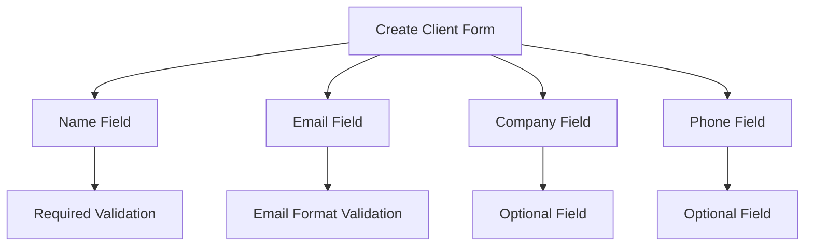
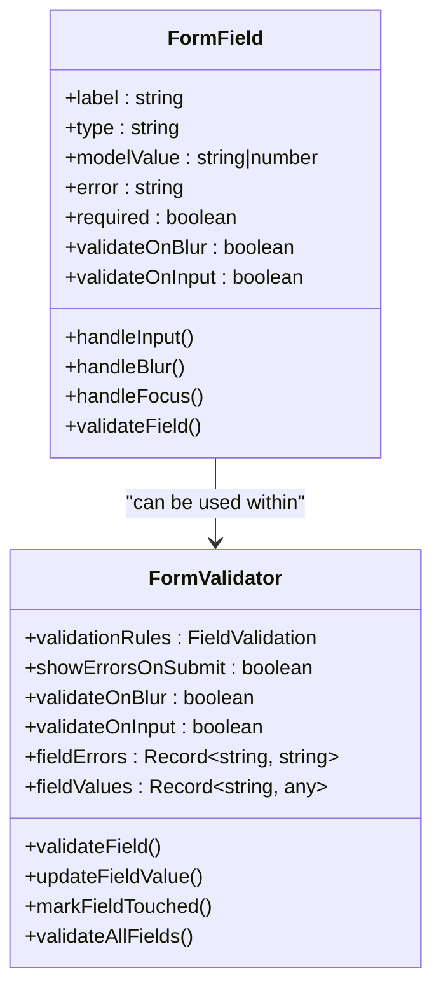
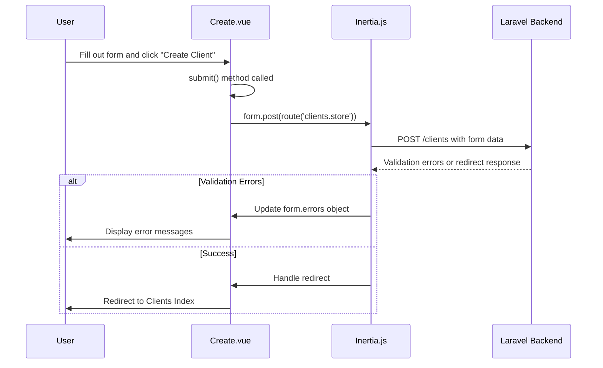
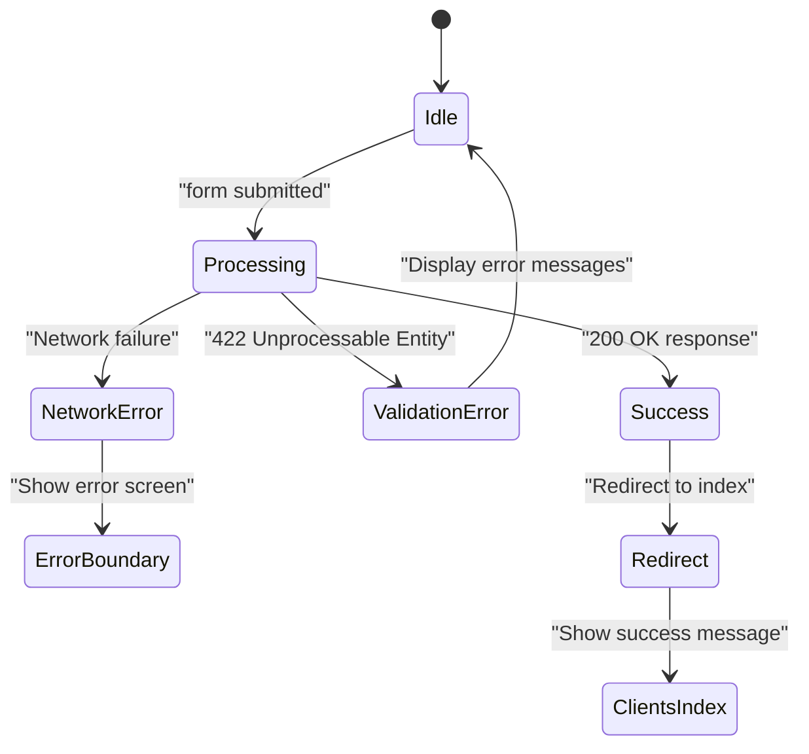

# Clients Create Page


## Table of Contents
1. [Introduction](#introduction)
2. [Form Structure and Fields](#form-structure-and-fields)
3. [Shared Component Integration](#shared-component-integration)
4. [Form Submission Process](#form-submission-process)
5. [Backend Validation and Error Handling](#backend-validation-and-error-handling)
6. [Success Redirection and State Management](#success-redirection-and-state-management)
7. [Error Boundaries and Loading States](#error-boundaries-and-loading-states)
8. [Code Example: Frontend-Backend Interaction](#code-example-frontend-backend-interaction)

## Introduction
The Clients Create page (`Create.vue`) enables users to add a new client to the system through a structured form interface. This document details the implementation of the form, its integration with shared components for consistent input handling, validation mechanisms, submission logic using Inertia.js, and interaction with the Laravel backend. The page follows modern Vue 3 composition API patterns and leverages Inertia's form helper for state management and submission.

**Section sources**
- [Create.vue](file://resources/js/pages/Clients/Create.vue#L1-L126)

## Form Structure and Fields
The form in `Create.vue` collects essential client information through four primary fields:
- **Name**: Required field for the client's name
- **Email**: Optional email address with format validation
- **Company**: Optional company name
- **Phone**: Optional phone number

The layout uses a responsive grid system with two columns on larger screens and single-column stacking on smaller devices. Required fields are marked with a red asterisk, and each input includes real-time error messaging below when validation fails.





**Diagram sources**
- [Create.vue](file://resources/js/pages/Clients/Create.vue#L29-L99)

**Section sources**
- [Create.vue](file://resources/js/pages/Clients/Create.vue#L29-L99)

## Shared Component Integration
Although the current implementation uses direct input elements, the application provides reusable components `FormField.vue` and `FormValidator.vue` for consistent form handling across the application.

`FormField.vue` is a flexible input component that supports various types (text, email, textarea, select) with built-in validation states, error messages, loading indicators, and success indicators. It handles focus states, blur events, and emits input changes appropriately.

`FormValidator.vue` provides a wrapper for form validation with support for rules like required, min/max length, email format, URL validation, and custom validation functions. It can validate on blur or input and exposes validation state to child components via slots.

While these components are not currently used in `Create.vue`, they represent the application's standard approach to form management and could be integrated to enhance consistency.





**Diagram sources**
- [FormField.vue](file://resources/js/lib/FormField.vue#L1-L324)
- [FormValidator.vue](file://resources/js/lib/FormValidator.vue#L1-L239)

**Section sources**
- [FormField.vue](file://resources/js/lib/FormField.vue#L1-L324)
- [FormValidator.vue](file://resources/js/lib/FormValidator.vue#L1-L239)

## Form Submission Process
The form submission process is managed through Inertia.js's `useForm` composable, which provides a reactive form object with built-in state management. When the user submits the form:

1. The `submit()` method is triggered by the form's `@submit.prevent` directive
2. The form data is sent via `form.post(route('clients.store'))`
3. The `useForm` helper automatically manages loading state through the `processing` property
4. During submission, the submit button displays "Creating..." and is disabled

The form state is initialized with empty values for all fields, and the `useForm` composable tracks both the data and any validation errors returned from the server.





**Diagram sources**
- [Create.vue](file://resources/js/pages/Clients/Create.vue#L100-L126)
- [ClientController.php](file://app/Http/Controllers/ClientController.php#L20-L35)

**Section sources**
- [Create.vue](file://resources/js/pages/Clients/Create.vue#L100-L126)

## Backend Validation and Error Handling
The backend validation occurs in the `ClientController@store` method, which uses Laravel's validation system to ensure data integrity:

- **Name**: Required, string, max 255 characters
- **Email**: Optional, must be valid email format, must be unique in the clients table
- **Company**: Optional, string, max 255 characters
- **Phone**: Optional, string, max 255 characters

When validation fails, Laravel automatically redirects back with error messages stored in the session. Inertia.js automatically makes these errors available on the `form.errors` object, which the frontend displays beneath the corresponding fields.

The validation rules are defined in the `store` method of `ClientController`, and the unique email constraint prevents duplicate client entries.


```mermaid
flowchart TD
A[Form Submission] --> B{Validation Rules}
B --> C[Name: required|string|max:255]
B --> D[Email: nullable|email|unique:clients,email]
B --> E[Company: nullable|string|max:255]
B --> F[Phone: nullable|string|max:255]
C --> G{Valid?}
D --> G
E --> G
F --> G
G --> |No| H[Return validation errors]
G --> |Yes| I[Create Client record]
H --> J[Display errors in form]
I --> K[Redirect with success message]
```


**Diagram sources**
- [ClientController.php](file://app/Http/Controllers/ClientController.php#L20-L35)

**Section sources**
- [ClientController.php](file://app/Http/Controllers/ClientController.php#L20-L35)

## Success Redirection and State Management
Upon successful client creation, the backend returns a redirect response to the clients index page with a success message stored in the session. This is handled through Laravel's redirect helper:


```php
return redirect()->route('clients.index')
    ->with('success', 'Client created successfully.');
```


The success message is made available to the frontend through the shared `flash` props in `HandleInertiaRequests` middleware, which exposes session flash messages to the Vue components. The form state is automatically reset upon successful submission due to the page redirect, ensuring a clean state when returning to the create form.

The `useForm` composable manages the submission state through its `processing` property, which disables the submit button during the request and enables the loading indicator.

**Section sources**
- [ClientController.php](file://app/Http/Controllers/ClientController.php#L33-L35)
- [HandleInertiaRequests.php](file://app/Http/Middleware/HandleInertiaRequests.php#L30-L67)

## Error Boundaries and Loading States
The application implements robust error handling through the `ErrorBoundary.vue` component, which catches unhandled JavaScript errors and displays a user-friendly error screen with options to retry or navigate to the dashboard. This component uses Vue's `onErrorCaptured` lifecycle hook to intercept errors.

Loading states are managed through:
- The `form.processing` property from `useForm`, which indicates submission status
- The `LoadingSpinner.vue` component for visual loading indicators
- Button state management (disabled during processing)

The error boundary ensures that JavaScript exceptions do not crash the entire application, while the form's built-in error display handles validation errors from the backend.





**Diagram sources**
- [ErrorBoundary.vue](file://resources/js/lib/ErrorBoundary.vue#L1-L66)
- [LoadingSpinner.vue](file://resources/js/lib/LoadingSpinner.vue#L1-L108)

**Section sources**
- [ErrorBoundary.vue](file://resources/js/lib/ErrorBoundary.vue#L1-L66)
- [LoadingSpinner.vue](file://resources/js/lib/LoadingSpinner.vue#L1-L108)

## Code Example: Frontend-Backend Interaction
The following example demonstrates the complete interaction between the Vue component and Laravel controller:

**Frontend (Create.vue):**

```vue
<script setup lang="ts">
import { Link, useForm } from '@inertiajs/vue3'

const form = useForm({
  name: '',
  email: '',
  company: '',
  phone: '',
})

const submit = () => {
  form.post(route('clients.store'))
}
</script>

<template>
  <form @submit.prevent="submit">
    <input v-model="form.name" type="text" required />
    <p v-if="form.errors.name">{{ form.errors.name }}</p>
    
    <input v-model="form.email" type="email" />
    <p v-if="form.errors.email">{{ form.errors.email }}</p>
    
    <button :disabled="form.processing">
      {{ form.processing ? 'Creating...' : 'Create Client' }}
    </button>
  </form>
</template>
```


**Backend (ClientController.php):**

```php
public function store(Request $request): RedirectResponse
{
    $validated = $request->validate([
        'name' => 'required|string|max:255',
        'email' => 'nullable|email|unique:clients,email',
        'company' => 'nullable|string|max:255',
        'phone' => 'nullable|string|max:255',
    ]);

    Client::create($validated);

    return redirect()->route('clients.index')
        ->with('success', 'Client created successfully.');
}
```


This interaction demonstrates the seamless integration between the frontend form and backend controller, with automatic error handling and state management provided by Inertia.js.

**Section sources**
- [Create.vue](file://resources/js/pages/Clients/Create.vue#L1-L126)
- [ClientController.php](file://app/Http/Controllers/ClientController.php#L20-L35)
- [Client.php](file://app/Models/Client.php#L1-L28)

**Referenced Files in This Document**   
- [Create.vue](file://resources/js/pages/Clients/Create.vue)
- [ClientController.php](file://app/Http/Controllers/ClientController.php)
- [Client.php](file://app/Models/Client.php)
- [FormField.vue](file://resources/js/lib/FormField.vue)
- [FormValidator.vue](file://resources/js/lib/FormValidator.vue)
- [AppLayout.vue](file://resources/js/lib/AppLayout.vue)
- [ErrorBoundary.vue](file://resources/js/lib/ErrorBoundary.vue)
- [LoadingSpinner.vue](file://resources/js/lib/LoadingSpinner.vue)