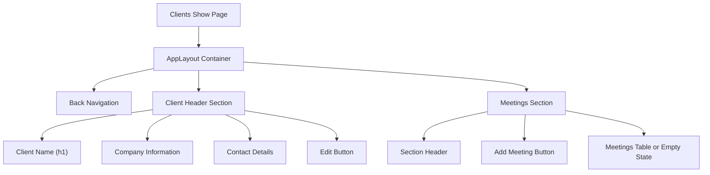
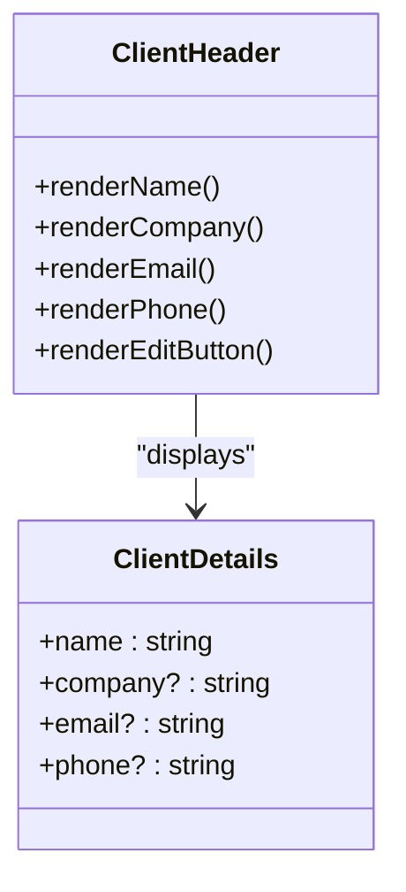
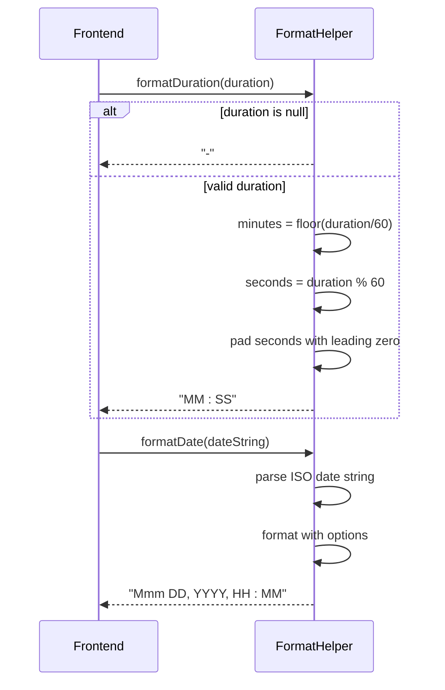

# Clients Show Page


## Table of Contents
1. [Clients Show Page](#clients-show-page)
2. [Data Retrieval and Backend Integration](#data-retrieval-and-backend-integration)
3. [UI Layout and Components](#ui-layout-and-components)
4. [Client Details Section](#client-details-section)
5. [Meetings Table and Display Logic](#meetings-table-and-display-logic)
6. [Conditional Rendering and Empty States](#conditional-rendering-and-empty-states)
7. [Navigation and User Actions](#navigation-and-user-actions)
8. [TypeScript Interface Definitions](#typescript-interface-definitions)
9. [Error Handling and Edge Cases](#error-handling-and-edge-cases)

## Data Retrieval and Backend Integration

The Clients Show page retrieves client data and associated meetings through a well-defined backend-to-frontend integration using Inertia.js and Laravel's routing system. When a user navigates to the show page, the route parameter (client ID) is automatically injected into the `ClientController@show` method via Laravel's route model binding.

The backend implementation in `ClientController.php` loads the client with its associated meetings, ordered by creation date in descending order:


```php
public function show(Client $client): Response
{
    $client->load(['meetings' => function ($query) {
        $query->orderBy('created_at', 'desc');
    }]);

    return Inertia::render('Clients/Show', [
        'client' => $client
    ]);
}
```


This approach ensures that the client data and all related meetings are fetched in a single request, minimizing database queries through eager loading. The `load` method prevents the N+1 query problem by retrieving all meetings in one additional query rather than querying for each client individually.

The route is defined implicitly through Laravel's resource routing system, which creates RESTful routes including `clients/{client}` for the show action. The `{client}` parameter is automatically resolved to a `Client` model instance.

**Section sources**
- [ClientController.php](file://app/Http/Controllers/ClientController.php#L51-L60)
- [Client.php](file://app/Models/Client.php#L1-L27)

## UI Layout and Components

The Clients Show page follows a clean, responsive layout built with Tailwind CSS and organized into distinct sections. The page structure is wrapped in an `AppLayout` component that provides consistent application chrome including headers, navigation, and footers.

The layout consists of two primary sections:
1. Client Header - Displays client identification and contact information
2. Meetings Section - Lists all meetings associated with the client

The page uses a max-width container (`max-w-7xl`) with responsive padding that adjusts based on screen size (px-4 on small screens, px-8 on large screens). This ensures optimal readability across device sizes.

Navigation elements are strategically placed:
- A "Back to Clients" link at the top-left for easy navigation to the clients index
- An "Edit Client" button aligned with the client name for quick access to editing
- An "Add Meeting" button prominently displayed above the meetings table

The design follows accessibility best practices with proper heading hierarchy (h1 for client name, h2 for section titles) and semantic HTML elements.





**Diagram sources**
- [Show.vue](file://resources/js/pages/Clients/Show.vue#L1-L183)

**Section sources**
- [Show.vue](file://resources/js/pages/Clients/Show.vue#L1-L183)

## Client Details Section

The client details section displays comprehensive information about the client in a clean, readable format. The client's name is prominently displayed as an h1 element with bold font weight, establishing visual hierarchy.

Contact information is conditionally rendered based on data availability:
- Company name (if provided)
- Email address with mailto: link for direct communication
- Phone number with tel: link for direct calling

Each piece of information is wrapped in a paragraph element with consistent styling (text-sm, text-gray-600) and includes a bold label ("Company:", "Email:", "Phone:") for clarity. The use of conditional rendering (`v-if`) ensures that only available information is displayed, preventing empty fields from appearing in the UI.

The section uses Flexbox for responsive layout, stacking elements vertically on small screens and aligning them horizontally on larger screens (sm:flex). The edit button is positioned to the right on larger screens and below the content on smaller screens, maintaining usability across devices.





**Diagram sources**
- [Show.vue](file://resources/js/pages/Clients/Show.vue#L20-L55)

**Section sources**
- [Show.vue](file://resources/js/pages/Clients/Show.vue#L20-L55)

## Meetings Table and Display Logic

The meetings section presents a comprehensive table of all meetings associated with the client, displaying key information in a structured format. The table includes the following columns:
- **Title**: Meeting title with emphasis on readability
- **Status**: Visual badge indicating meeting processing status
- **Duration**: Formatted video duration in MM:SS format
- **Uploaded**: Date and time of upload in human-readable format
- **Actions**: Link to view the individual meeting

The status badges use color-coded styling to quickly communicate the processing state:
- Completed: Green badge
- Processing: Yellow badge
- Failed: Red badge
- Pending/Other: Gray badge

The duration is formatted using the `formatDuration` helper method, which converts seconds into a MM:SS format with zero-padded seconds. For null or undefined durations, it displays a dash (-) as a placeholder.

Date formatting uses the browser's `toLocaleDateString` method with specific options to ensure consistent formatting across locales: short month name, numeric day and year, with 24-hour time format.





**Diagram sources**
- [Show.vue](file://resources/js/pages/Clients/Show.vue#L100-L150)

**Section sources**
- [Show.vue](file://resources/js/pages/Clients/Show.vue#L80-L183)

## Conditional Rendering and Empty States

The page implements sophisticated conditional rendering to handle various data states and provide an optimal user experience. The meetings section uses Vue's `v-if` directive to display different content based on whether meetings exist:


```vue
<div v-if="client.meetings?.length" class="overflow-hidden">
  <!-- Table of meetings -->
</div>
<div v-else class="px-6 py-14 text-center text-sm text-gray-500">
  <!-- Empty state with illustration and call-to-action -->
</div>
```


The empty state is particularly well-designed, featuring:
- A SVG illustration of a video camera to reinforce the concept of meetings
- Clear messaging: "No meetings" and "This client doesn't have any meetings yet."
- A prominent "Add Meeting" button as a call-to-action
- Consistent styling with the rest of the application

The conditional check `client.meetings?.length` uses optional chaining to safely access the length property, preventing errors if the meetings property is undefined. This defensive programming approach enhances application stability.

The empty state not only informs users of the current condition but also guides them toward the next action, reducing cognitive load and improving usability.

**Section sources**
- [Show.vue](file://resources/js/pages/Clients/Show.vue#L150-L183)

## Navigation and User Actions

The page provides multiple navigation pathways and user actions to facilitate efficient workflow:

1. **Back Navigation**: A prominent "← Back to Clients" link allows users to return to the clients index page using the `route('clients.index')` helper.

2. **Client Editing**: An "Edit Client" button navigates to the client edit page with `route('clients.edit', client.id)`, passing the client ID as a parameter.

3. **Meeting Creation**: Two "Add Meeting" buttons (above the table and in the empty state) navigate to the meeting creation page with the client pre-selected: `route('meetings.create', { client_id: client.id })`.

4. **Meeting Viewing**: Each meeting in the table has a "View" link that navigates to the individual meeting show page using `route('meetings.show', meeting.id)`.

All navigation is handled through Inertia's `Link` component, which enables client-side transitions without full page reloads, creating a seamless single-page application experience.

The use of route names (rather than hardcoded URLs) provides flexibility and maintainability, allowing route changes without updating multiple view files.

**Section sources**
- [Show.vue](file://resources/js/pages/Clients/Show.vue#L10-L15)

## TypeScript Interface Definitions

The frontend uses TypeScript interfaces to define the structure of client and meeting data, ensuring type safety and improving developer experience. Based on analysis of multiple Vue components, the following interface definitions can be inferred:


```typescript
interface Client {
  id: number
  name: string
  email?: string
  company?: string
  phone?: string
}

type MeetingLite = {
  id: number
  title: string
  status: 'pending' | 'processing' | 'completed' | 'failed'
  uploaded_at: string
  duration: number | null
}

type ClientWithMeetings = Client & {
  meetings?: MeetingLite[]
}
```


These interfaces are used in the `Props` definition for the Show.vue component:


```typescript
interface Props {
  client: ClientWithMeetings
}
```


The `ClientWithMeetings` type extends the base `Client` interface with an optional `meetings` array containing `MeetingLite` objects. This composition pattern allows for flexible data structures while maintaining type safety.

The meeting status is strongly typed as a union of literal strings, preventing invalid status values and enabling better IDE support and refactoring.

**Section sources**
- [Show.vue](file://resources/js/pages/Clients/Show.vue#L160-L183)
- [Create.vue](file://resources/js/pages/Meetings/Create.vue#L195-L205)
- [Index.vue](file://resources/js/pages/Meetings/Index.vue#L220-L225)
- [Show.vue](file://resources/js/pages/Meetings/Show.vue#L205-L210)

## Error Handling and Edge Cases

The implementation includes several considerations for error handling and edge cases:

1. **Missing Data**: The template uses optional chaining (`client.meetings?.length`) and nullish coalescing patterns to handle potentially missing data gracefully.

2. **Invalid Duration**: The `formatDuration` function checks for null or undefined duration values and returns a dash (-) as a placeholder.

3. **Route Parameters**: The use of Inertia.js and Laravel's route model binding automatically handles invalid client IDs by returning a 404 response when a client cannot be found.

4. **Empty Collections**: The empty state for meetings provides a user-friendly experience when no meetings exist, rather than displaying a blank section.

5. **Conditional Rendering**: Contact information is only rendered when available, preventing empty labels from appearing in the UI.

The backend controller also contributes to error handling by using Laravel's automatic model resolution, which returns a 404 HTTP response if the requested client ID does not exist in the database.

The integration between frontend and backend follows the principle of fail-safe defaults, ensuring that the application remains usable even when data is incomplete or edge cases occur.

**Section sources**
- [Show.vue](file://resources/js/pages/Clients/Show.vue#L1-L183)
- [ClientController.php](file://app/Http/Controllers/ClientController.php#L51-L60)

**Referenced Files in This Document**   
- [Show.vue](file://resources/js/pages/Clients/Show.vue#L1-L183)
- [ClientController.php](file://app/Http/Controllers/ClientController.php#L51-L60)
- [Client.php](file://app/Models/Client.php#L1-L27)
- [Meeting.php](file://app/Models/Meeting.php#L1-L178)
- [Create.vue](file://resources/js/pages/Meetings/Create.vue#L195-L205)
- [Index.vue](file://resources/js/pages/Meetings/Index.vue#L220-L225)
- [Show.vue](file://resources/js/pages/Meetings/Show.vue#L205-L210)