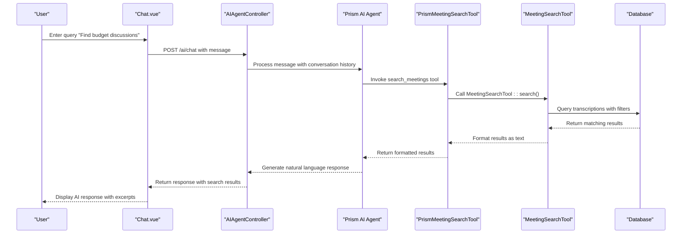
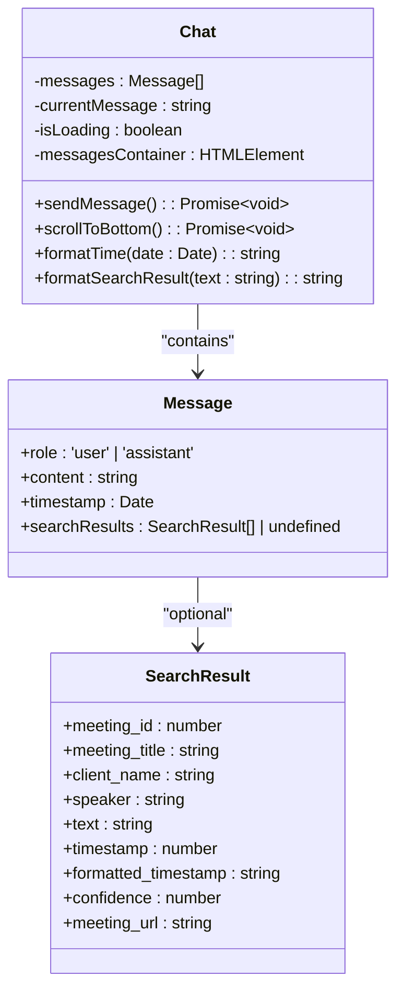
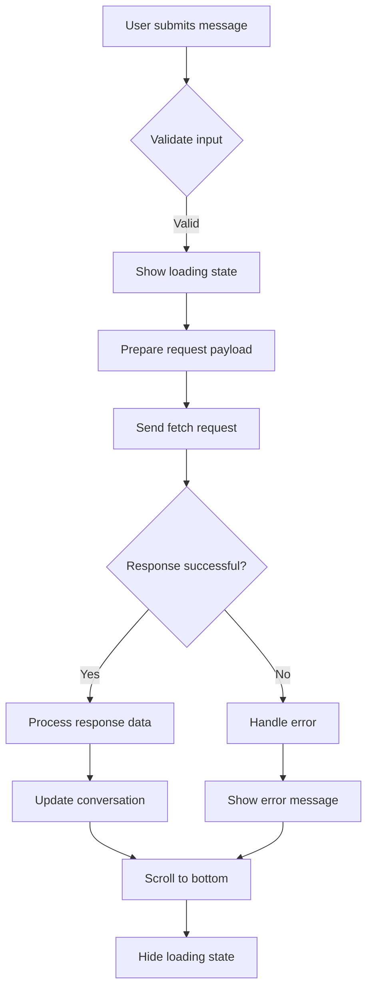
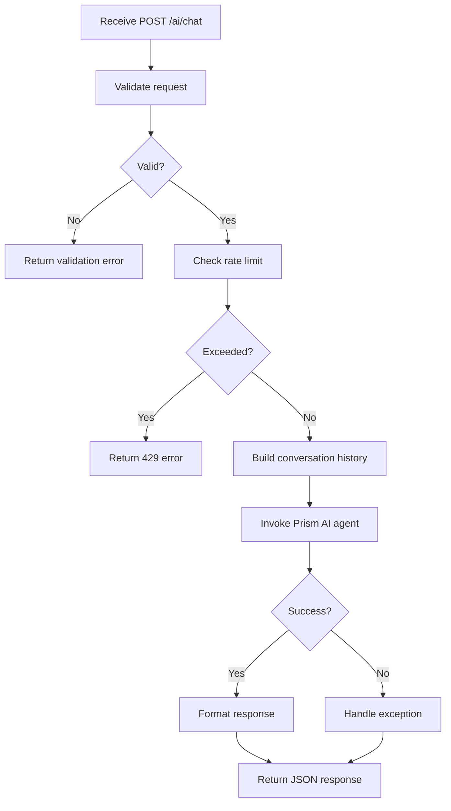
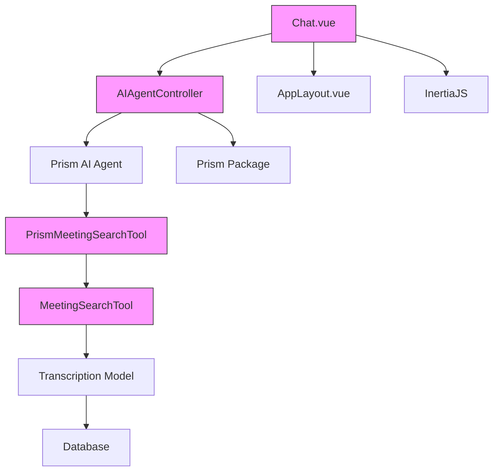

# AI Chat Page


## Table of Contents
1. [Introduction](#introduction)
2. [Project Structure](#project-structure)
3. [Core Components](#core-components)
4. [Architecture Overview](#architecture-overview)
5. [Detailed Component Analysis](#detailed-component-analysis)
6. [Dependency Analysis](#dependency-analysis)
7. [Performance Considerations](#performance-considerations)
8. [Troubleshooting Guide](#troubleshooting-guide)
9. [Conclusion](#conclusion)

## Introduction
The AI Chat Page provides a conversational interface that enables users to search through meeting transcriptions using natural language queries. This document details the implementation of the chat-based UI, including message input handling, streaming response display, integration with the AIAgentController API endpoint, and the underlying AI agent workflow. The system leverages a Prism AI agent with access to a MeetingSearchTool to retrieve relevant excerpts from meeting content and present them in a user-friendly format with timestamped links to specific video moments.

## Project Structure
The AI Chat functionality is implemented across multiple layers of the application, following a clean separation of concerns between frontend and backend components. The feature is organized under specific directories for frontend components, backend controllers, and AI tools.


```mermaid
graph TB
subgraph "Frontend"
A[resources/js/pages/AI/Chat.vue]
B[resources/js/lib/AppLayout.vue]
end
subgraph "Backend"
C[app/Http/Controllers/AIAgentController.php]
D[app/Tools/PrismMeetingSearchTool.php]
E[app/Tools/MeetingSearchTool.php]
F[routes/web.php]
end
A --> C : "POST /ai/chat"
C --> D : "Uses"
D --> E : "Delegates"
F --> C : "Routes"
style A fill:#f9f,stroke:#333
style C fill:#f9f,stroke:#333
style D fill:#f9f,stroke:#333
style E fill:#f9f,stroke:#333
```


**Diagram sources**
- [Chat.vue](file://resources/js/pages/AI/Chat.vue)
- [AIAgentController.php](file://app/Http/Controllers/AIAgentController.php)
- [PrismMeetingSearchTool.php](file://app/Tools/PrismMeetingSearchTool.php)
- [MeetingSearchTool.php](file://app/Tools/MeetingSearchTool.php)
- [web.php](file://routes/web.php)

**Section sources**
- [Chat.vue](file://resources/js/pages/AI/Chat.vue)
- [AIAgentController.php](file://app/Http/Controllers/AIAgentController.php)

## Core Components
The AI Chat Page consists of several core components that work together to provide a seamless conversational search experience. The main components include the Chat.vue frontend component, the AIAgentController backend controller, the PrismMeetingSearchTool AI tool interface, and the MeetingSearchTool core search implementation. These components follow a layered architecture where user interactions on the frontend trigger API calls to the backend, which processes requests using AI agents and specialized tools to retrieve and format meeting content.

**Section sources**
- [Chat.vue](file://resources/js/pages/AI/Chat.vue#L1-L307)
- [AIAgentController.php](file://app/Http/Controllers/AIAgentController.php#L1-L183)

## Architecture Overview
The AI Chat Page implements a client-server architecture with a Vue.js frontend communicating with a Laravel backend through RESTful API endpoints. The system uses an AI agent pattern where natural language queries are processed by a Prism AI agent that can invoke specialized tools to retrieve information from meeting transcriptions.





**Diagram sources**
- [Chat.vue](file://resources/js/pages/AI/Chat.vue#L1-L307)
- [AIAgentController.php](file://app/Http/Controllers/AIAgentController.php#L1-L183)
- [PrismMeetingSearchTool.php](file://app/Tools/PrismMeetingSearchTool.php#L1-L50)
- [MeetingSearchTool.php](file://app/Tools/MeetingSearchTool.php#L1-L86)

## Detailed Component Analysis

### AI Chat Frontend Component
The Chat.vue component implements the user interface for the AI meeting assistant, providing a chat-based interface where users can ask natural language questions about their meeting content.

#### Component Structure and UI Patterns
The component follows a single-file component structure with template, script, and style sections. It uses a clean, modern UI with distinct styling for user and assistant messages, loading indicators, and search result displays.





**Diagram sources**
- [Chat.vue](file://resources/js/pages/AI/Chat.vue#L1-L307)

#### Message Input and Submission System
The message input system provides a form with a text input field and submit button. The input is bound to the currentMessage reactive property using v-model, and form submission is handled by the sendMessage method which prevents default form behavior.

The input system includes several UX features:
- Disabled state when loading to prevent duplicate submissions
- Validation to ensure non-empty messages
- Auto-focus on the input field after submission
- Clearing the input field after successful submission

**Section sources**
- [Chat.vue](file://resources/js/pages/AI/Chat.vue#L119-L172)

#### Conversation History and Scroll Behavior
The component maintains conversation history in the messages array, which stores Message objects with role, content, timestamp, and optional search results. The UI displays messages in chronological order with different styling for user and assistant messages.

Scroll behavior is managed automatically to keep the newest messages visible:
- After sending a message or receiving a response, the scrollToBottom method is called
- The method uses nextTick to ensure the DOM is updated before scrolling
- The messages container is scrolled to its maximum scroll position


```javascript
const scrollToBottom = async () => {
  await nextTick()
  if (messagesContainer.value) {
    messagesContainer.value.scrollTop = messagesContainer.value.scrollHeight
  }
}
```


**Section sources**
- [Chat.vue](file://resources/js/pages/AI/Chat.vue#L119-L172)

### Backend API Integration
The AI Chat Page integrates with the backend through the AIAgentController API endpoint, which processes natural language queries and returns AI-generated responses.

#### API Request Flow
The frontend sends POST requests to the /ai/chat endpoint with the following structure:
- message: The user's natural language query
- conversation_history: Previous messages in the conversation
- CSRF token for security

The request includes proper headers for content type, CSRF protection, and AJAX identification.





**Diagram sources**
- [Chat.vue](file://resources/js/pages/AI/Chat.vue#L170-L244)

#### Error Handling and Retry Logic
The component implements comprehensive error handling to provide a resilient user experience:
- Network connectivity checks using navigator.onLine
- Request timeout with AbortController (30 seconds)
- HTTP status code handling for common errors
- Retry logic with exponential backoff for network errors
- User-friendly error messages and toast notifications

The retry system attempts up to 3 times with increasing delays between attempts, providing users with options to retry failed requests.


```javascript
if (retryCount < maxRetries && (
  error.name === 'NetworkError' || 
  error.message.includes('fetch') ||
  error.message.includes('Server error')
)) {
  retryCount++
  console.log(`Retrying request (attempt ${retryCount}/${maxRetries})`)
  await new Promise(resolve => setTimeout(resolve, 1000 * retryCount))
  return attemptSend()
}
```


**Section sources**
- [Chat.vue](file://resources/js/pages/AI/Chat.vue#L206-L244)

### AI Agent and Tool Integration
The backend AI agent system processes user queries by leveraging specialized tools to search through meeting content and generate natural language responses.

#### AIAgentController Implementation
The AIAgentController handles chat requests through its chat method, which:
- Validates input parameters (message length, conversation history)
- Implements rate limiting based on IP address (10 requests per minute)
- Constructs a conversation history with system, user, and assistant messages
- Invokes the Prism AI agent with the MeetingSearchTool
- Returns structured JSON responses with success status, response text, and tool calls





**Diagram sources**
- [AIAgentController.php](file://app/Http/Controllers/AIAgentController.php#L41-L182)

#### Tool Calling Mechanism
The system uses a tool calling pattern where the AI agent can invoke the search_meetings tool to retrieve information from meeting transcriptions. The PrismMeetingSearchTool acts as an adapter between the AI agent and the core MeetingSearchTool.

The tool is configured with:
- Name: search_meetings
- Description: Search through meeting transcriptions
- Parameters: query (required), client_id (optional), speaker (optional), limit (optional)

When invoked, the tool calls the static search method of MeetingSearchTool with the provided parameters and formats the results for the AI agent.

**Section sources**
- [PrismMeetingSearchTool.php](file://app/Tools/PrismMeetingSearchTool.php#L1-L50)

#### Meeting Search Implementation
The MeetingSearchTool provides the core functionality for searching through meeting transcriptions. It queries the database for transcription records that match the search criteria and formats the results with relevant context.

Key features of the search implementation:
- Database query with text search using LIKE operator
- Optional filtering by client and speaker
- Result limiting to prevent excessive data transfer
- Text highlighting of search terms using markdown-style bold
- Timestamp formatting for human-readable display
- Error handling with graceful degradation


```php
public static function search(array $parameters): array
{
    $query = $parameters['query'] ?? '';
    $clientId = $parameters['client_id'] ?? null;
    $speaker = $parameters['speaker'] ?? null;
    $limit = $parameters['limit'] ?? 10;

    if (empty($query)) {
        return [
            'error' => 'Search query cannot be empty'
        ];
    }

    try {
        $results = Transcription::query()
            ->with(['meeting.client'])
            ->where('text', 'like', "%{$query}%")
            ->when($clientId, function ($q) use ($clientId) {
                return $q->whereHas('meeting', function ($q) use ($clientId) {
                    $q->where('client_id', $clientId);
                });
            })
            ->when($speaker, function ($q) use ($speaker) {
                return $q->where('speaker', 'like', "%{$speaker}%");
            })
            ->orderBy('start_time', 'asc')
            ->limit($limit)
            ->get()
            ->map(function ($transcription) use ($query) {
                // Highlight the search term in the text
                $highlightedText = str_ireplace(
                    $query,
                    "**{$query}**",
                    $transcription->text
                );

                return [
                    'meeting_id' => $transcription->meeting->id,
                    'meeting_title' => $transcription->meeting->title,
                    'client_name' => $transcription->meeting->client->name,
                    'speaker' => $transcription->speaker,
                    'text' => $highlightedText,
                    'timestamp' => (float) $transcription->start_time,
                    'formatted_timestamp' => self::formatTimestamp($transcription->start_time),
                    'confidence' => $transcription->confidence,
                    'meeting_url' => route('meetings.show', $transcription->meeting->id)
                ];
            })
            ->toArray();

        return [
            'results' => $results,
            'total_found' => count($results),
            'search_query' => $query,
            'client_filter' => $clientId,
            'speaker_filter' => $speaker
        ];

    } catch (\Exception $e) {
        return [
            'error' => 'Search failed: ' . $e->getMessage()
        ];
    }
}
```


**Section sources**
- [MeetingSearchTool.php](file://app/Tools/MeetingSearchTool.php#L1-L86)

## Dependency Analysis
The AI Chat Page has several key dependencies that enable its functionality. These dependencies form a clear hierarchy from the user interface to the data access layer.





**Diagram sources**
- [Chat.vue](file://resources/js/pages/AI/Chat.vue)
- [AIAgentController.php](file://app/Http/Controllers/AIAgentController.php)
- [PrismMeetingSearchTool.php](file://app/Tools/PrismMeetingSearchTool.php)
- [MeetingSearchTool.php](file://app/Tools/MeetingSearchTool.php)

## Performance Considerations
The AI Chat Page implementation includes several performance optimizations to ensure a responsive user experience:

- **Rate Limiting**: The backend implements rate limiting (10 requests per minute per IP) to prevent abuse and ensure system stability.
- **Request Timeout**: Frontend requests have a 30-second timeout to prevent hanging requests.
- **Result Limiting**: Search results are limited to prevent excessive data transfer and processing.
- **Efficient Database Queries**: The search implementation uses indexed database queries with appropriate filtering and limiting.
- **Lazy Loading**: The UI only loads and renders visible messages, with scrolling handling for long conversations.
- **Error Recovery**: Retry logic with exponential backoff helps recover from transient network issues.

## Troubleshooting Guide
Common issues and their solutions for the AI Chat Page:

**No Results Found**
- Ensure the search query is not empty or only whitespace
- Verify that meetings with transcriptions exist in the database
- Check that the search query matches text in the transcriptions (case-insensitive)

**Network Errors**
- Verify internet connectivity
- Check that the API endpoint (/ai/chat) is accessible
- Ensure CSRF token is being properly included in requests
- Confirm the server is running and not experiencing high load

**Rate Limiting**
- Wait 60 seconds after reaching the limit (10 requests per minute)
- Check server logs for rate limiting messages
- Consider increasing the rate limit in development environments

**Authentication Issues**
- Refresh the page if session has expired (401 errors)
- Ensure user is properly logged in
- Verify that session cookies are being sent with requests

**Tool Invocation Failures**
- Check server logs for errors in AIAgentController
- Verify that the Prism AI agent is properly configured
- Ensure the MeetingSearchTool has access to the database
- Confirm that transcription data exists and is properly formatted

**Section sources**
- [Chat.vue](file://resources/js/pages/AI/Chat.vue)
- [AIAgentController.php](file://app/Http/Controllers/AIAgentController.php)
- [MeetingSearchTool.php](file://app/Tools/MeetingSearchTool.php)

## Conclusion
The AI Chat Page provides a powerful conversational interface for searching meeting content using natural language queries. The implementation follows a clean architecture with well-defined components and clear separation of concerns between frontend and backend. The system leverages AI agent patterns with specialized tools to retrieve and present relevant information from meeting transcriptions, including timestamped excerpts that link directly to specific video moments. The user interface is designed for accessibility and ease of use, with thoughtful handling of loading states, error conditions, and conversation history. The integration between the Vue.js frontend and Laravel backend is robust, with comprehensive error handling and retry logic to ensure a reliable user experience.

**Referenced Files in This Document**   
- [Chat.vue](file://resources/js/pages/AI/Chat.vue)
- [AIAgentController.php](file://app/Http/Controllers/AIAgentController.php)
- [PrismMeetingSearchTool.php](file://app/Tools/PrismMeetingSearchTool.php)
- [MeetingSearchTool.php](file://app/Tools/MeetingSearchTool.php)
- [AppLayout.vue](file://resources/js/lib/AppLayout.vue)
- [web.php](file://routes/web.php)