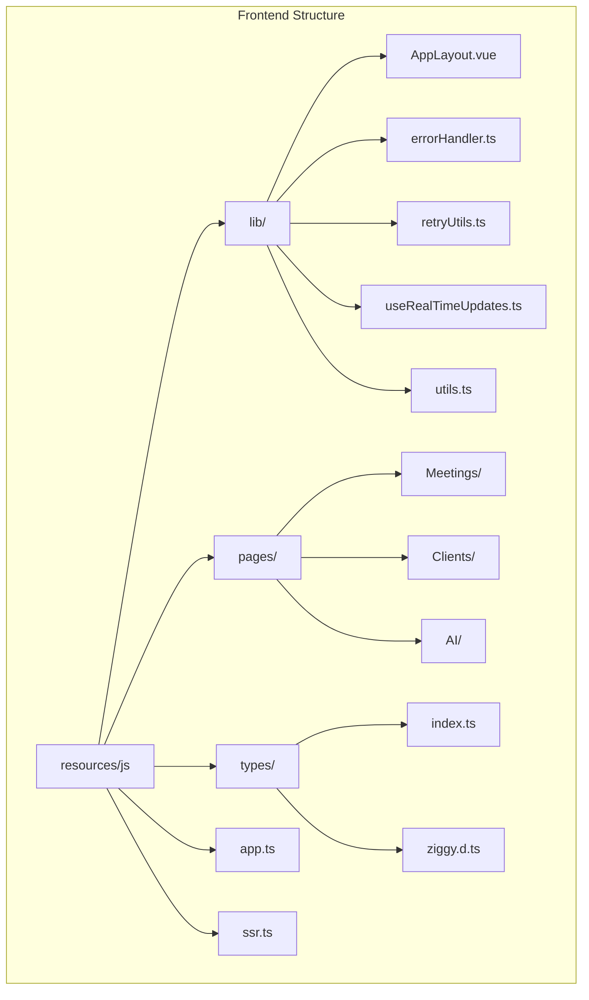
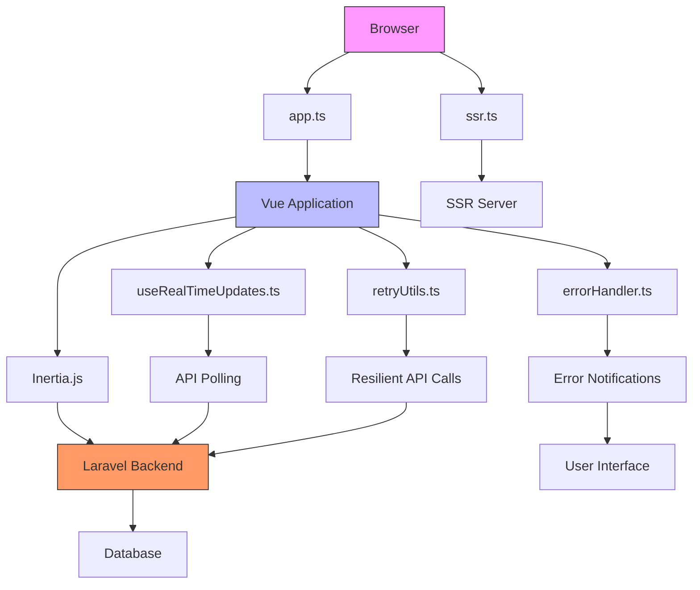
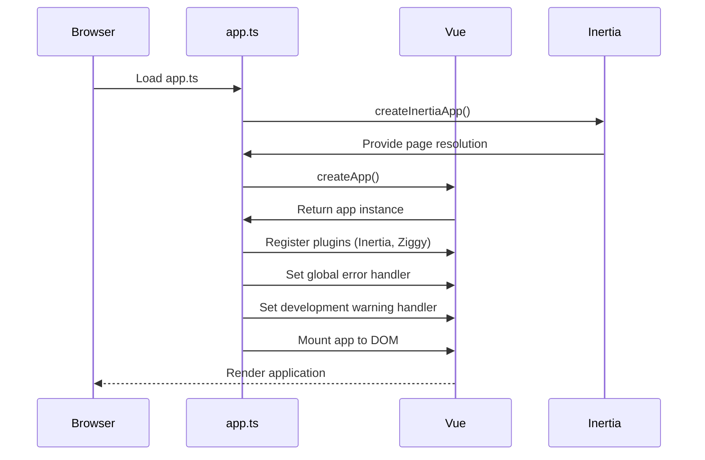
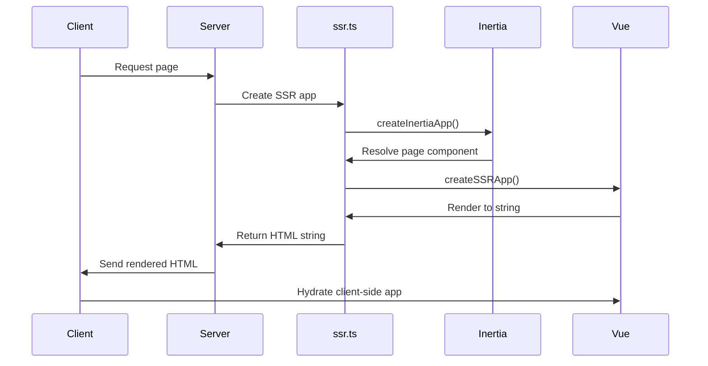
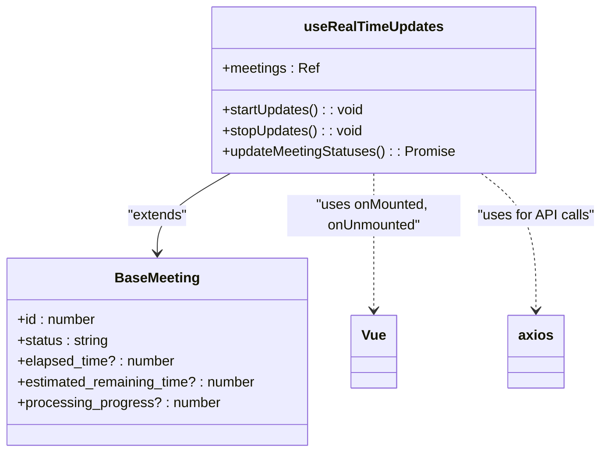
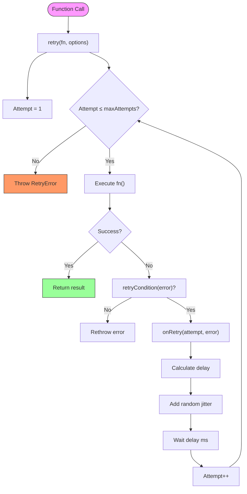
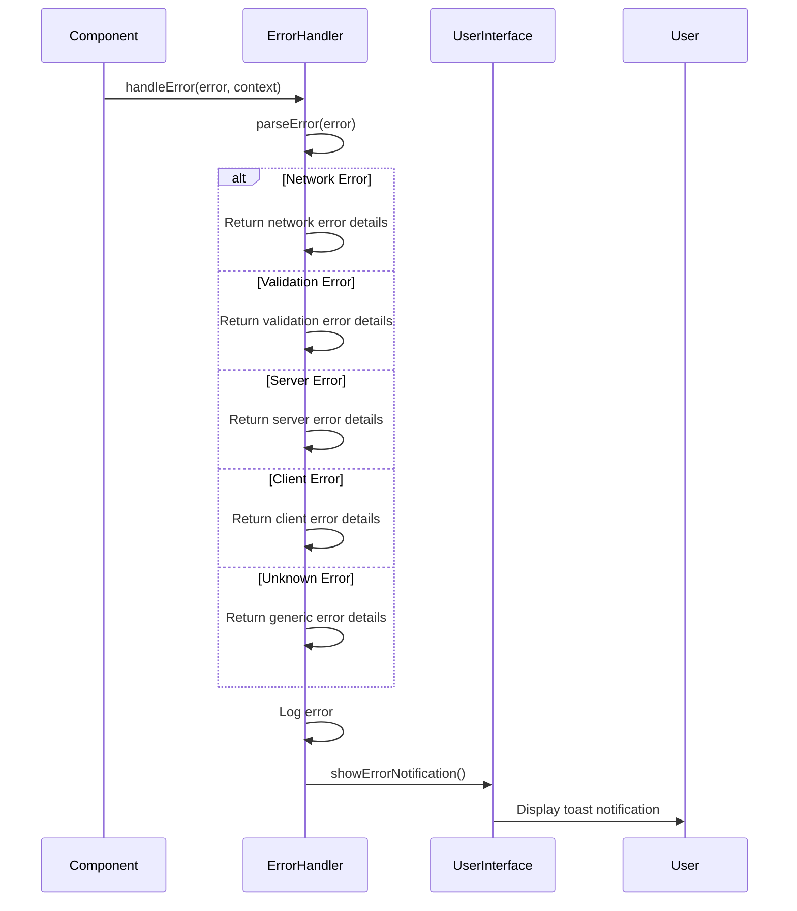
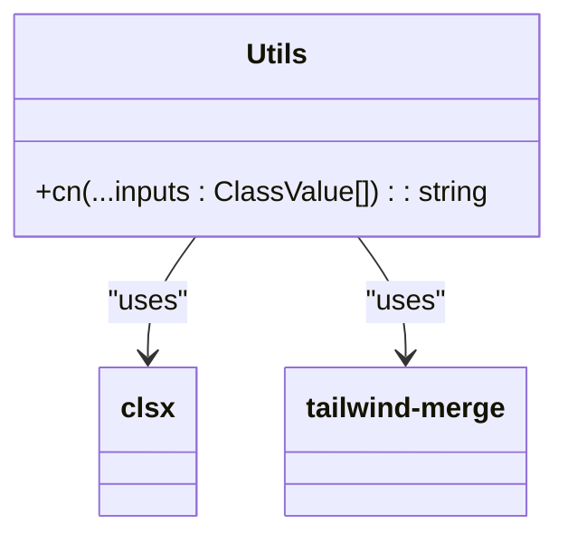
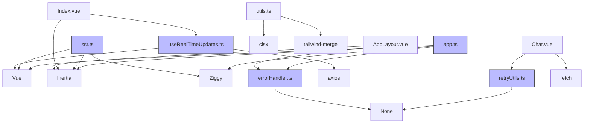

# State Management and API Communication

## Table of Contents
1. [Introduction](#introduction)
2. [Project Structure](#project-structure)
3. [Core Components](#core-components)
4. [Architecture Overview](#architecture-overview)
5. [Detailed Component Analysis](#detailed-component-analysis)
6. [Dependency Analysis](#dependency-analysis)
7. [Performance Considerations](#performance-considerations)
8. [Troubleshooting Guide](#troubleshooting-guide)
9. [Conclusion](#conclusion)

## Introduction
This document provides a comprehensive analysis of the state management and API communication patterns in the frontend of the MeetingAI application. It details how Vue.js, Inertia.js, and supporting utilities are used to manage application state, handle real-time updates, ensure resilient API communication, and maintain type safety. The system leverages modern frontend practices including composable functions, centralized error handling, exponential backoff retry mechanisms, and server-side rendering for improved performance and user experience.

## Project Structure
The frontend codebase is organized under the `resources/js` directory with a clear separation of concerns:
- `lib/`: Shared Vue components and utility modules (e.g., error handling, real-time updates)
- `pages/`: Page-level components organized by feature (Meetings, Clients, AI)
- `types/`: TypeScript interfaces and type definitions
- Root level: Entry points (`app.ts`, `ssr.ts`) and global configuration

This structure follows a feature-based organization that enhances maintainability and scalability.

**Diagram sources**
- [app.ts](file://resources/js/app.ts)
- [useRealTimeUpdates.ts](file://resources/js/lib/useRealTimeUpdates.ts)
- [retryUtils.ts](file://resources/js/lib/retryUtils.ts)
- [errorHandler.ts](file://resources/js/lib/errorHandler.ts)
- [index.ts](file://resources/js/types/index.ts)

**Section sources**
- [app.ts](file://resources/js/app.ts)
- [ssr.ts](file://resources/js/ssr.ts)

## Core Components
The application's frontend architecture centers around several key components that handle state management, API communication, and error handling. These include the Vue and Inertia initialization in `app.ts`, server-side rendering setup in `ssr.ts`, real-time updates via polling in `useRealTimeUpdates.ts`, resilient API calls with exponential backoff in `retryUtils.ts`, and centralized error processing in `errorHandler.ts`. Together, these components create a robust foundation for handling complex state and communication requirements in a modern web application.

**Section sources**
- [app.ts](file://resources/js/app.ts#L1-L43)
- [ssr.ts](file://resources/js/ssr.ts#L1-L31)
- [useRealTimeUpdates.ts](file://resources/js/lib/useRealTimeUpdates.ts#L1-L87)
- [retryUtils.ts](file://resources/js/lib/retryUtils.ts#L1-L233)
- [errorHandler.ts](file://resources/js/lib/errorHandler.ts#L1-L325)

## Architecture Overview
The application follows a modern Vue 3 + Inertia.js architecture with server-side rendering support. The frontend is bootstrapped through `app.ts` which initializes Vue, Inertia, and global configurations including error handling. The `ssr.ts` file provides server-side rendering capabilities for improved initial load performance. State management is handled through composable functions like `useRealTimeUpdates.ts` that provide reactive state, while API communication is enhanced with retry mechanisms from `retryUtils.ts` and centralized error handling via `errorHandler.ts`.

**Diagram sources**
- [app.ts](file://resources/js/app.ts#L1-L43)
- [ssr.ts](file://resources/js/ssr.ts#L1-L31)
- [useRealTimeUpdates.ts](file://resources/js/lib/useRealTimeUpdates.ts#L1-L87)
- [retryUtils.ts](file://resources/js/lib/retryUtils.ts#L1-L233)
- [errorHandler.ts](file://resources/js/lib/errorHandler.ts#L1-L325)

## Detailed Component Analysis

### Vue and Inertia Initialization (app.ts)
The `app.ts` file serves as the entry point for the Vue application, initializing Vue with Inertia integration and global configurations. It sets up the Inertia app with page resolution, title formatting, and plugin registration. The file also configures global error and warning handlers that integrate with the centralized error handling system.

**Diagram sources**
- [app.ts](file://resources/js/app.ts#L1-L43)

**Section sources**
- [app.ts](file://resources/js/app.ts#L1-L43)

### Server-Side Rendering Setup (ssr.ts)
The `ssr.ts` file configures server-side rendering for the application, enabling faster initial page loads and improved SEO. It uses Inertia's SSR capabilities to render Vue components on the server before sending them to the client. The file sets up the SSR server with proper page resolution and component registration.

**Diagram sources**
- [ssr.ts](file://resources/js/ssr.ts#L1-L31)

**Section sources**
- [ssr.ts](file://resources/js/ssr.ts#L1-L31)

### Real-Time Updates Implementation (useRealTimeUpdates.ts)
The `useRealTimeUpdates.ts` composable provides real-time status updates for meetings through periodic API polling. It uses Vue's reactivity system to maintain updated meeting data and automatically manages the polling lifecycle based on component mounting and unmounting.

**Diagram sources**
- [useRealTimeUpdates.ts](file://resources/js/lib/useRealTimeUpdates.ts#L1-L87)

**Section sources**
- [useRealTimeUpdates.ts](file://resources/js/lib/useRealTimeUpdates.ts#L1-L87)

### Resilient API Calls (retryUtils.ts)
The `retryUtils.ts` file implements a comprehensive retry system for API calls with exponential backoff, jitter, and customizable retry conditions. It includes utility functions for different retry scenarios and a circuit breaker pattern to prevent cascading failures.

**Diagram sources**
- [retryUtils.ts](file://resources/js/lib/retryUtils.ts#L1-L233)

**Section sources**
- [retryUtils.ts](file://resources/js/lib/retryUtils.ts#L1-L233)

### Centralized Error Handling (errorHandler.ts)
The `errorHandler.ts` file implements a centralized error handling system that categorizes errors, provides user-friendly messages, and displays appropriate notifications. It handles various error types including network, validation, server, and client errors.

**Diagram sources**
- [errorHandler.ts](file://resources/js/lib/errorHandler.ts#L1-L325)

**Section sources**
- [errorHandler.ts](file://resources/js/lib/errorHandler.ts#L1-L325)

### Shared Helper Functions (utils.ts)
The `utils.ts` file provides shared utility functions used throughout the application. Currently, it exports a `cn` function that combines `clsx` and `tailwind-merge` for conditional class name management with proper Tailwind CSS class merging.

**Diagram sources**
- [utils.ts](file://resources/js/lib/utils.ts#L1-L7)

**Section sources**
- [utils.ts](file://resources/js/lib/utils.ts#L1-L7)

## Dependency Analysis
The frontend components have a well-defined dependency structure that promotes reusability and maintainability. The core dependencies include:

**Diagram sources**
- [app.ts](file://resources/js/app.ts#L1-L43)
- [ssr.ts](file://resources/js/ssr.ts#L1-L31)
- [useRealTimeUpdates.ts](file://resources/js/lib/useRealTimeUpdates.ts#L1-L87)
- [retryUtils.ts](file://resources/js/lib/retryUtils.ts#L1-L233)
- [errorHandler.ts](file://resources/js/lib/errorHandler.ts#L1-L325)
- [utils.ts](file://resources/js/lib/utils.ts#L1-L7)
- [Index.vue](file://resources/js/pages/Meetings/Index.vue)
- [Chat.vue](file://resources/js/pages/AI/Chat.vue)
- [AppLayout.vue](file://resources/js/lib/AppLayout.vue)

**Section sources**
- [app.ts](file://resources/js/app.ts#L1-L43)
- [ssr.ts](file://resources/js/ssr.ts#L1-L31)
- [useRealTimeUpdates.ts](file://resources/js/lib/useRealTimeUpdates.ts#L1-L87)
- [retryUtils.ts](file://resources/js/lib/retryUtils.ts#L1-L233)
- [errorHandler.ts](file://resources/js/lib/errorHandler.ts#L1-L325)
- [utils.ts](file://resources/js/lib/utils.ts#L1-L7)

## Performance Considerations
The application implements several performance optimizations:

1. **Server-Side Rendering**: Enabled through `ssr.ts` and configured in `inertia.php`, providing faster initial page loads and improved SEO.

2. **Efficient Polling**: The `useRealTimeUpdates.ts` composable only polls for meetings that are in 'pending' or 'processing' status, reducing unnecessary API calls.

3. **Exponential Backoff**: The retry system in `retryUtils.ts` uses exponential backoff with jitter to prevent overwhelming the server during high load or failure conditions.

4. **Conditional Class Merging**: The `cn` utility in `utils.ts` efficiently merges Tailwind CSS classes while avoiding conflicts.

5. **Error Throttling**: The error handler limits the in-memory error log to 50 entries to prevent memory leaks.

6. **Network Awareness**: Components can detect online/offline status and adjust behavior accordingly, improving user experience during connectivity issues.

## Troubleshooting Guide
Common issues and their solutions:

**Section sources**
- [errorHandler.ts](file://resources/js/lib/errorHandler.ts#L1-L325)
- [retryUtils.ts](file://resources/js/lib/retryUtils.ts#L1-L233)
- [useRealTimeUpdates.ts](file://resources/js/lib/useRealTimeUpdates.ts#L1-L87)

### Network Connectivity Issues
- **Symptoms**: "Connection problem" messages, failed API calls
- **Solutions**: 
  - Check internet connection
  - Refresh the page
  - Wait and retry (automatic retries with exponential backoff will occur)

### API Rate Limiting
- **Symptoms**: "Too many requests" errors (429 status)
- **Solutions**:
  - Wait before making additional requests
  - Avoid rapid button clicks
  - The system automatically handles rate limiting with retry mechanisms

### Session Expiration
- **Symptoms**: "Your session has expired" messages (401 status)
- **Solutions**:
  - Refresh the page
  - Log in again if prompted

### Server Errors
- **Symptoms**: "We're experiencing technical difficulties" messages (5xx status)
- **Solutions**:
  - Wait a few minutes and try again
  - Contact support if the problem persists
  - The retry system will automatically attempt to recover

### Real-Time Updates Not Working
- **Symptoms**: Meeting status not updating
- **Solutions**:
  - Check network connectivity
  - Verify the component is mounted (updates start on mount, stop on unmount)
  - Ensure the meeting is in 'pending' or 'processing' status (only these are polled)

## Conclusion
The MeetingAI application employs a robust set of patterns for state management and API communication. The architecture combines Vue 3's reactivity system with Inertia.js for seamless page transitions, while implementing sophisticated patterns for real-time updates, resilient API calls, and centralized error handling. The use of TypeScript ensures type safety throughout the application, and the modular structure promotes maintainability and scalability. These patterns work together to create a responsive, reliable, and user-friendly application that can handle the complexities of real-time meeting processing and transcription.

**Referenced Files in This Document**   
- [app.ts](file://resources/js/app.ts)
- [ssr.ts](file://resources/js/ssr.ts)
- [useRealTimeUpdates.ts](file://resources/js/lib/useRealTimeUpdates.ts)
- [retryUtils.ts](file://resources/js/lib/retryUtils.ts)
- [errorHandler.ts](file://resources/js/lib/errorHandler.ts)
- [utils.ts](file://resources/js/lib/utils.ts)
- [index.ts](file://resources/js/types/index.ts)
- [ziggy.d.ts](file://resources/js/types/ziggy.d.ts)
- [AppLayout.vue](file://resources/js/lib/AppLayout.vue)
- [Index.vue](file://resources/js/pages/Meetings/Index.vue)
- [Chat.vue](file://resources/js/pages/AI/Chat.vue)
- [app.blade.php](file://resources/views/app.blade.php)
- [inertia.php](file://config/inertia.php)