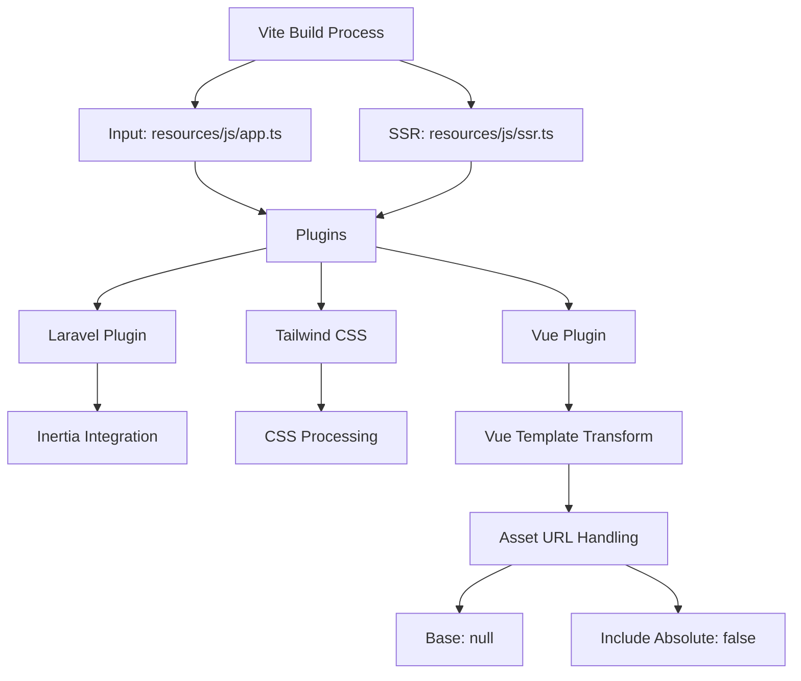
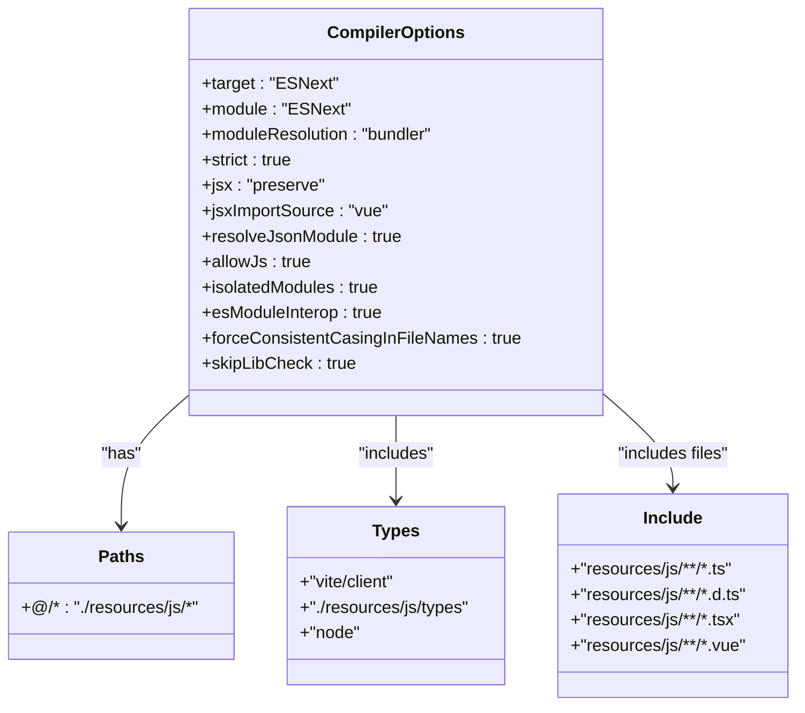
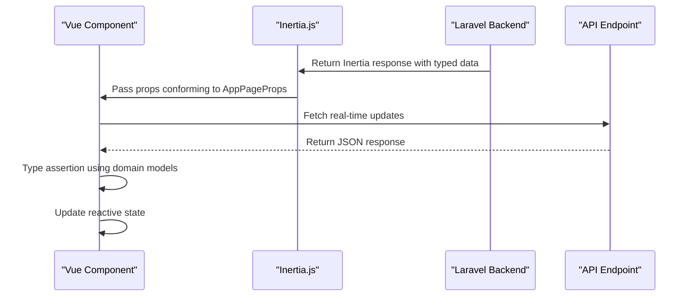
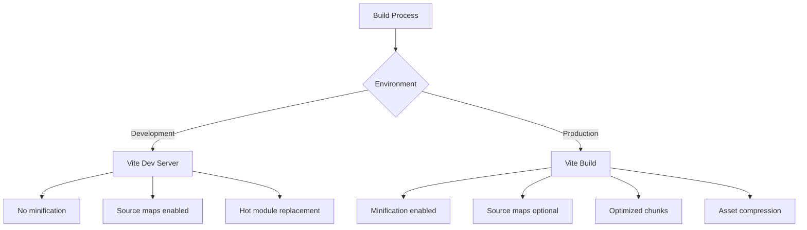

# Build Process and Type System


## Table of Contents
1. [Introduction](#introduction)
2. [Vite Configuration](#vite-configuration)
3. [TypeScript Configuration](#typescript-configuration)
4. [Custom Type Definitions](#custom-type-definitions)
5. [Type Sharing and Usage in Components](#type-sharing-and-usage-in-components)
6. [Build Optimization Techniques](#build-optimization-techniques)
7. [Conclusion](#conclusion)

## Introduction
This document provides a comprehensive overview of the frontend build process and type system in the MeetingAI application. It details the Vite configuration for asset handling, module resolution, and development server settings. The TypeScript configuration is analyzed for strict type checking and compatibility with Vue 3's Composition API. Custom type definitions are documented, including domain models, module augmentations, global variables, and type-safe routing. The integration of types between frontend and backend via Ziggy is explained, along with usage patterns in components. Finally, build optimization techniques such as code splitting and tree-shaking are covered.

## Vite Configuration

The Vite configuration in `vite.config.ts` sets up the frontend build process with support for Vue 3, Inertia.js, and Tailwind CSS. It defines input files, server settings, and plugin integrations essential for development and production builds.





**Diagram sources**
- [vite.config.ts](file://vite.config.ts#L1-L23)

**Section sources**
- [vite.config.ts](file://vite.config.ts#L1-L23)

### Asset Handling and Aliases
Vite handles assets through the Vue plugin configuration, specifically transforming asset URLs in templates. The `transformAssetUrls` option is configured to prevent base URL rewriting and exclude absolute URLs from transformation, ensuring correct asset resolution in the Laravel environment.

The configuration also establishes path aliases through TypeScript's `tsconfig.json` (not Vite directly), where `@/*` maps to `./resources/js/*`. This enables cleaner imports like `@/lib/AppLayout.vue` instead of relative paths.

### Plugins
The build process utilizes three core plugins:
- **Laravel Plugin**: Integrates with Laravel's asset pipeline, specifying the entry point (`resources/js/app.ts`) and SSR file (`resources/js/ssr.ts`). Enables hot module replacement via `refresh: true`.
- **Tailwind CSS Plugin**: Processes Tailwind directives and generates optimized CSS.
- **Vue Plugin**: Enables Vue 3 single-file component support with template asset URL transformation.

### Development Server Settings
While not explicitly configured in this file, Vite's default development server is used with Laravel's built-in server. The configuration implicitly supports hot module replacement through the Laravel plugin's `refresh` option, enabling fast feedback during development.

## TypeScript Configuration

The `tsconfig.json` file configures TypeScript for strict type checking, modern JavaScript support, and seamless integration with Vue 3 and Vite.





**Diagram sources**
- [tsconfig.json](file://tsconfig.json#L1-L127)

**Section sources**
- [tsconfig.json](file://tsconfig.json#L1-L127)

### Strict Type Checking
The configuration enables comprehensive type safety through `"strict": true`, which activates:
- Implicit `any` detection
- Null and undefined checking
- Function type safety
- Property initialization validation
- Binding/call/apply method checking

This ensures robust type checking across the codebase, catching potential runtime errors during development.

### Module Resolution
Key module resolution settings include:
- **moduleResolution: "bundler"**: Optimized for modern bundlers like Vite
- **paths**: Maps `@/*` to `./resources/js/*` for convenient imports
- **types**: Includes Vite's client types, project type definitions, and Node.js types
- **resolveJsonModule**: Allows importing JSON files directly

### Compatibility with Vue 3
The configuration supports Vue 3's Composition API through:
- **jsx: "preserve"** and **jsxImportSource: "vue"**: Enables Vue's JSX/TSX support
- **include**: Processes `.vue` files for type checking
- **vite/client** in types: Provides Vite-specific types like `ImportMeta`

## Custom Type Definitions

The application defines a comprehensive type system in the `resources/js/types` directory, covering domain models, module augmentations, global variables, and routing.

### Domain Models (index.ts)
The `index.ts` file defines TypeScript interfaces for core domain entities:


```mermaid
classDiagram
class Client {
+id : number
+name : string
+email? : string
+company? : string
+phone? : string
+meetings_count? : number
+created_at : string
+updated_at : string
}
class Meeting {
+id : number
+title : string
+client_id : number
+client : Client
+status : 'pending' | 'processing' | 'completed' | 'failed'
+video_path : string
+duration : number | null
+uploaded_at : string
+processing_started_at : string | null
+processing_completed_at : string | null
+created_at : string
+updated_at : string
+transcriptions? : Transcription[]
}
class Transcription {
+id : number
+meeting_id : number
+speaker : string
+text : string
+start_time : number
+end_time : number
+confidence : number
+created_at : string
+updated_at : string
+meeting? : Meeting
}
class PaginatedResponse~T~ {
+data : T[]
+links : Array<{url : string | null, label : string, active : boolean}>
+from : number
+to : number
+total : number
+current_page : number
+last_page : number
+per_page : number
}
Meeting --> Client : "has"
Meeting --> Transcription : "has many"
Transcription --> Meeting : "belongs to"
```


**Diagram sources**
- [resources/js/types/index.ts](file://resources/js/types/index.ts#L1-L56)

**Section sources**
- [resources/js/types/index.ts](file://resources/js/types/index.ts#L1-L56)

These interfaces represent the core data structures used throughout the application, with proper relationships and optional properties reflecting the API response structure.

### Module Augmentations (index.d.ts)
The `index.d.ts` file extends existing types from third-party libraries:


```typescript
export type AppPageProps<T extends Record<string, unknown> = Record<string, unknown>> = T & {
    name: string;
    quote: { message: string; author: string };
    auth: Auth;
    ziggy: Config & { location: string };
    csrf_token: string;
    flash?: {
        success?: string;
        error?: string;
    };
};
```


It also redefines `Client` and `Meeting` interfaces to match the Laravel backend's JSON structure, ensuring type consistency between frontend and backend.

### Global Variables (globals.d.ts)
This file declares global types and variables available throughout the application:


```mermaid
classDiagram
class ImportMetaEnv {
+VITE_APP_NAME : string
+[key : string] : string | boolean | undefined
}
class ImportMeta {
+env : ImportMetaEnv
+glob : <T>(pattern : string) => Record<string, () => Promise<T>>
}
class PageProps {
+auth : Auth
+ziggy : Config & { location : string }
+csrf_token : string
+flash? : { success? : string; error? : string }
}
class ComponentCustomProperties {
+$inertia : typeof Router
+$page : Page
+$headManager : ReturnType<typeof createHeadManager>
+route : typeof route
}
ImportMeta --> ImportMetaEnv
PageProps --> Auth
PageProps --> Config
ComponentCustomProperties --> Router
ComponentCustomProperties --> Page
ComponentCustomProperties --> createHeadManager
ComponentCustomProperties --> route
```


**Diagram sources**
- [resources/js/types/globals.d.ts](file://resources/js/types/globals.d.ts#L1-L26)

**Section sources**
- [resources/js/types/globals.d.ts](file://resources/js/types/globals.d.ts#L1-L26)

Key declarations include:
- Vite's `ImportMeta` with environment variables
- Inertia's `PageProps` interface extended with application-specific properties
- Vue component custom properties for `$inertia`, `$page`, and `route`

### Type-Safe Route Generation (ziggy.d.ts)
The `ziggy.d.ts` file provides type safety for route generation:


```typescript
declare global {
    let route: typeof route;
}

declare module 'vue' {
    interface ComponentCustomProperties {
        route: typeof route;
    }
}
```


This makes the `route()` helper available globally and on all Vue components with full type inference, enabling autocompletion and compile-time validation of route names and parameters.

## Type Sharing and Usage in Components

Types are shared between frontend and backend through Inertia.js's data transfer mechanism and used extensively in components for props, emits, and API responses.

### Frontend-Backend Type Sharing
The application uses Inertia.js to pass typed data from Laravel to Vue components. The `AppPageProps` interface in `index.d.ts` defines the structure of data passed from the backend, including:
- Authentication state (`auth`)
- CSRF token
- Flash messages
- Ziggy route configuration
- Page-specific props

When a Laravel controller returns an Inertia response, it passes data that conforms to these types, ensuring type safety across the full stack.

### Component Usage Patterns
In the `Meetings/Show.vue` component, types are used for props definition:


```typescript
interface Meeting {
    id: number
    title: string
    client: Client
    status: 'pending' | 'processing' | 'completed' | 'failed'
    // ... other properties
}

interface Props {
    meeting: Meeting
    videoUrl: string | null
}

const props = defineProps<Props>()
```


This ensures the component receives correctly typed data from the parent or Inertia response.

### API Response Typing
The `useRealTimeUpdates.ts` composable demonstrates API response typing:


```typescript
export function useRealTimeUpdates<T extends BaseMeeting>(meetings: T[]) {
    // ...
    const updateMeetingStatuses = async () => {
        // ...
        const response = await axios.get(`/meetings/${meeting.id}/status`)
        const updatedData = response.data as Partial<T>
        // ...
    }
}
```


The function uses generics to preserve the specific type of meeting objects while updating their status from API responses.





**Diagram sources**
- [resources/js/pages/Meetings/Show.vue](file://resources/js/pages/Meetings/Show.vue#L200-L343)
- [resources/js/lib/useRealTimeUpdates.ts](file://resources/js/lib/useRealTimeUpdates.ts#L1-L38)

**Section sources**
- [resources/js/pages/Meetings/Show.vue](file://resources/js/pages/Meetings/Show.vue#L200-L343)
- [resources/js/lib/useRealTimeUpdates.ts](file://resources/js/lib/useRealTimeUpdates.ts#L1-L38)

## Build Optimization Techniques

The build process incorporates several optimization techniques for improved performance and developer experience.

### Code Splitting
While not explicitly configured in `vite.config.ts`, Vite automatically implements code splitting based on:
- Dynamic imports (`import()`)
- Route-based splitting in single-page applications
- Dependency boundaries

The use of `import.meta.glob` in `app.ts` enables automatic code splitting for pages:


```typescript
resolve: (name) => resolvePageComponent(`./pages/${name}.vue`, import.meta.glob<DefineComponent>('./pages/**/*.vue'))
```


This creates separate chunks for each page component, loading them only when needed.

### Tree-Shaking
Tree-shaking is enabled by default in Vite through:
- ES modules syntax (`import`/`export`)
- Rollup-based build process (Vite uses Rollup for production builds)
- Dead code elimination

The configuration supports tree-shaking through:
- `"module": "ESNext"` in `tsconfig.json`
- Properly structured ES modules in the codebase
- Side-effect-free dependencies

### Environment-Specific Bundling
The build process differentiates between development and production environments:





**Diagram sources**
- [vite.config.ts](file://vite.config.ts#L1-L23)
- [tsconfig.json](file://tsconfig.json#L1-L127)

Key differences include:
- **Development**: Fast cold start, HMR, full source maps
- **Production**: Minification, code splitting, asset optimization

The `noEmit: true` setting in `tsconfig.json` indicates that TypeScript is used only for type checking, while Vite handles the actual code transformation and bundling.

## Conclusion
The MeetingAI application employs a robust build process and type system that ensures type safety, developer productivity, and optimal performance. The Vite configuration provides a modern development experience with seamless integration of Vue 3, Inertia.js, and Tailwind CSS. TypeScript is configured for strict type checking with proper module resolution and Vue 3 compatibility. Custom type definitions establish a comprehensive type system for domain models, module augmentations, and global variables. Types are shared between frontend and backend through Inertia.js, enabling full-stack type safety. The build process leverages Vite's automatic optimizations including code splitting and tree-shaking, with environment-specific bundling for optimal development and production performance.

**Referenced Files in This Document**   
- [vite.config.ts](file://vite.config.ts)
- [tsconfig.json](file://tsconfig.json)
- [resources/js/types/index.ts](file://resources/js/types/index.ts)
- [resources/js/types/index.d.ts](file://resources/js/types/index.d.ts)
- [resources/js/types/globals.d.ts](file://resources/js/types/globals.d.ts)
- [resources/js/types/ziggy.d.ts](file://resources/js/types/ziggy.d.ts)
- [resources/js/app.ts](file://resources/js/app.ts)
- [resources/js/pages/Meetings/Show.vue](file://resources/js/pages/Meetings/Show.vue)
- [resources/js/lib/useRealTimeUpdates.ts](file://resources/js/lib/useRealTimeUpdates.ts)