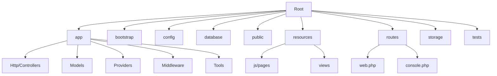
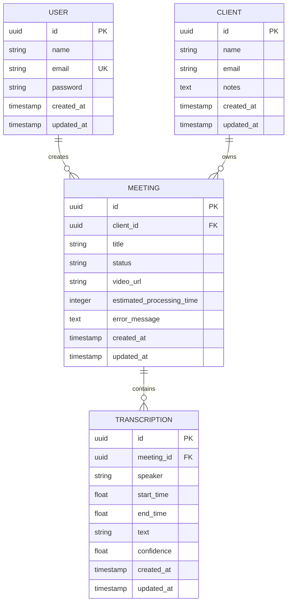
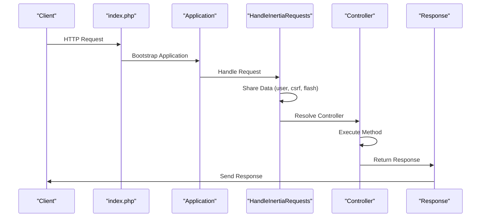
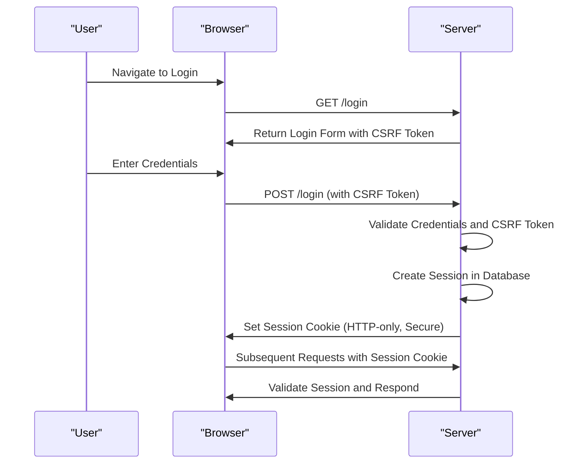
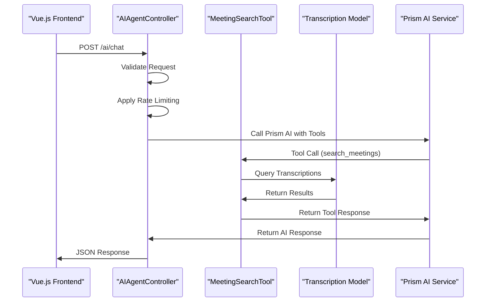
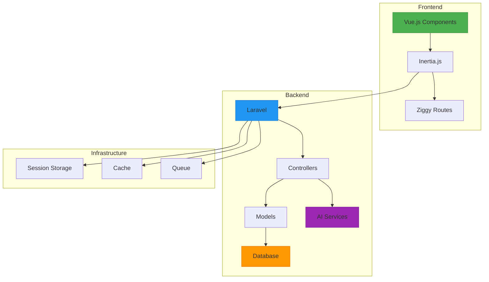

# Backend Architecture


## Table of Contents
1. [Introduction](#introduction)
2. [Project Structure](#project-structure)
3. [MVC Architecture Implementation](#mvc-architecture-implementation)
4. [Routing System](#routing-system)
5. [Middleware and Request Lifecycle](#middleware-and-request-lifecycle)
6. [Service Container and Providers](#service-container-and-providers)
7. [Configuration System](#configuration-system)
8. [Authentication and Session Management](#authentication-and-session-management)
9. [Inertia.js Integration](#inertiajs-integration)
10. [AI Functionality and JSON APIs](#ai-functionality-and-json-apis)
11. [Architecture Overview](#architecture-overview)

## Introduction
The meetingai application is a Laravel-based backend system designed to manage meeting recordings, transcriptions, and client information. The architecture follows the Model-View-Controller (MVC) pattern with Inertia.js enabling seamless integration between the Laravel backend and Vue.js frontend. This document provides a comprehensive analysis of the backend architecture, detailing the implementation of core components, request lifecycle, authentication, and AI-powered features.

## Project Structure
The project follows a standard Laravel directory structure with additional components for AI integration and real-time processing. Key directories include `app` for application logic, `config` for configuration, `routes` for request routing, `resources` for frontend assets, and `tests` for automated testing.





**Diagram sources**
- [app](file://app)
- [resources](file://resources)
- [routes](file://routes)

**Section sources**
- [Project Structure](file://#project-structure)

## MVC Architecture Implementation
The application implements the MVC pattern with clear separation of concerns between models, views, and controllers.

### Models
Models represent database entities and relationships:
- **User**: Authentication and authorization
- **Client**: Client information with multiple meetings
- **Meeting**: Meeting recordings with transcription status
- **Transcription**: Transcribed text segments with timestamps





**Diagram sources**
- [User.php](file://app/Models/User.php)
- [Client.php](file://app/Models/Client.php)
- [Meeting.php](file://app/Models/Meeting.php)
- [Transcription.php](file://app/Models/Transcription.php)

### Controllers
Controllers handle HTTP requests and coordinate between models and views:
- **AIAgentController**: Handles AI chat and search functionality
- **ClientController**: Manages client CRUD operations
- **MeetingController**: Handles meeting uploads and status tracking

**Section sources**
- [AIAgentController.php](file://app/Http/Controllers/AIAgentController.php)
- [ClientController.php](file://app/Http/Controllers/ClientController.php)
- [MeetingController.php](file://app/Http/Controllers/MeetingController.php)

## Routing System
The routing system is defined in `web.php` and `console.php`, with route grouping and middleware application.

### Web Routes
The `web.php` file defines all HTTP routes with Inertia.js integration:


```php
Route::get('/', function () {
    // Dashboard rendering with Inertia
});

Route::resource('clients', ClientController::class);
Route::resource('meetings', MeetingController::class);

Route::get('meetings/{meeting}/status', [MeetingController::class, 'status']);
Route::get('ai/chat', [AIAgentController::class, 'index']);
Route::post('ai/chat', [AIAgentController::class, 'chat']);
Route::post('ai/search', [AIAgentController::class, 'search']);
```


```mermaid
flowchart TD
A[HTTP Request] --> B{Route Match?}
B --> |Yes| C[Apply Middleware]
C --> D[Call Controller Method]
D --> E[Return Response]
B --> |No| F[404 Not Found]
subgraph Routes
G[/] --> H[Dashboard]
I[clients] --> J[ClientController]
K[meetings] --> L[MeetingController]
M[ai/chat] --> N[AIAgentController]
O[ai/search] --> P[AIAgentController]
end
```


**Diagram sources**
- [web.php](file://routes/web.php#L1-L47)

### Console Routes
The `console.php` file defines Artisan commands:


```php
Artisan::command('inspire', function () {
    $this->comment(Inspiring::quote());
})->purpose('Display an inspiring quote');
```


**Section sources**
- [web.php](file://routes/web.php#L1-L47)
- [console.php](file://routes/console.php#L1-L9)

## Middleware and Request Lifecycle
The request lifecycle begins at `public/index.php` and proceeds through middleware to controller resolution.

### Entry Point
The `public/index.php` file serves as the application entry point:


```php
define('LARAVEL_START', microtime(true));

if (file_exists($maintenance = __DIR__.'/../storage/framework/maintenance.php')) {
    require $maintenance;
}

require __DIR__.'/../vendor/autoload.php';

$app = require_once __DIR__.'/../bootstrap/app.php';
$app->handleRequest(Request::capture());
```


### Middleware Pipeline
The `HandleInertiaRequests` middleware configures Inertia.js integration:


```php
class HandleInertiaRequests extends Middleware
{
    protected $rootView = 'app';

    public function share(Request $request): array
    {
        return array_merge(parent::share($request), [
            'flash' => [
                'success' => fn () => $request->session()->get('success'),
                'error' => fn () => $request->session()->get('error'),
            ],
            'errors' => function () use ($request) {
                return $request->session()->get('errors')
                    ? $request->session()->get('errors')->getBag('default')->getMessages()
                    : (object) [];
            },
            'csrf_token' => fn () => csrf_token(),
            'app' => [
                'name' => config('app.name'),
                'url' => config('app.url'),
                'environment' => config('app.env'),
            ],
            'ziggy' => [
                ...(new Ziggy)->toArray(),
                'location' => $request->url(),
            ],
            'user' => fn () => $request->user()
                ? $request->user()->only('id', 'name', 'email')
                : null,
        ]);
    }
}
```





**Diagram sources**
- [index.php](file://public/index.php#L1-L21)
- [HandleInertiaRequests.php](file://app/Http/Middleware/HandleInertiaRequests.php#L1-L68)

**Section sources**
- [index.php](file://public/index.php#L1-L21)
- [HandleInertiaRequests.php](file://app/Http/Middleware/HandleInertiaRequests.php#L1-L68)

## Service Container and Providers
The service container manages class dependencies and injections, with service providers bootstrapping application services.

### AppServiceProvider
The `AppServiceProvider` is the primary service provider:


```php
class AppServiceProvider extends ServiceProvider
{
    public function register(): void
    {
        // Register application services
    }

    public function boot(): void
    {
        // Bootstrap application services
    }
}
```


Currently, the service provider is empty, indicating that service bindings are either defined elsewhere or using Laravel's automatic resolution.

**Section sources**
- [AppServiceProvider.php](file://app/Providers/AppServiceProvider.php#L1-L25)

## Configuration System
The configuration system uses environment-specific settings stored in the `config` directory.

### Key Configuration Files
- **app.php**: Application name, environment, URL, and timezone
- **session.php**: Session driver, lifetime, and security settings
- **auth.php**: Authentication guards and user providers
- **inertia.php**: Inertia.js server-side rendering configuration

### Session Configuration
The session is configured to use the database driver with CSRF protection:


```php
'driver' => env('SESSION_DRIVER', 'database'),
'lifetime' => (int) env('SESSION_LIFETIME', 120),
'expire_on_close' => env('SESSION_EXPIRE_ON_CLOSE', false),
'encrypt' => env('SESSION_ENCRYPT', false),
'http_only' => env('SESSION_HTTP_ONLY', true),
'same_site' => env('SESSION_SAME_SITE', 'lax'),
```


**Section sources**
- [app.php](file://config/app.php#L1-L127)
- [session.php](file://config/session.php#L1-L218)
- [auth.php](file://config/auth.php#L1-L116)
- [inertia.php](file://config/inertia.php#L1-L51)

## Authentication and Session Management
The application uses Laravel's built-in authentication system with session-based authentication.

### Authentication Flow
1. User logs in via credentials
2. Session is created and stored in the database
3. CSRF token is generated for form protection
4. User information is shared via Inertia.js props

### Security Features
- **CSRF Protection**: Tokens are automatically generated and validated
- **Session Security**: HTTP-only cookies, SameSite=lax, and secure flags
- **Rate Limiting**: Implemented in AI endpoints to prevent abuse





**Section sources**
- [session.php](file://config/session.php#L1-L218)
- [auth.php](file://config/auth.php#L1-L116)
- [HandleInertiaRequests.php](file://app/Http/Middleware/HandleInertiaRequests.php#L1-L68)

## Inertia.js Integration
Inertia.js enables seamless SPA-like experiences with server-side rendering.

### Configuration
Server-side rendering is enabled with a local SSR service:


```php
'ssr' => [
    'enabled' => true,
    'url' => 'http://127.0.0.1:13714',
],
```


### Data Sharing
The `HandleInertiaRequests` middleware shares essential data with the frontend:

- **Flash messages**: Success, error, warning, info
- **Validation errors**: Session-based error messages
- **CSRF token**: For form security
- **Application info**: Name, URL, environment
- **Ziggy routes**: JavaScript-accessible named routes
- **Authenticated user**: ID, name, email

**Section sources**
- [inertia.php](file://config/inertia.php#L1-L51)
- [HandleInertiaRequests.php](file://app/Http/Middleware/HandleInertiaRequests.php#L1-L68)

## AI Functionality and JSON APIs
The application integrates AI functionality through dedicated controllers and tools.

### AIAgentController
Handles AI chat and search functionality with rate limiting and error handling:


```php
public function chat(Request $request)
{
    $request->validate([
        'message' => 'required|string|max:1000',
        'conversation_history' => 'array|max:50'
    ]);

    // Rate limiting
    $cacheKey = 'ai_chat_' . $request->ip();
    $requestCount = cache()->get($cacheKey, 0);
    
    if ($requestCount >= 10) {
        return response()->json([...], 429);
    }
    
    // AI processing with Prism
    $response = Prism::text()
        ->using(Provider::OpenRouter, 'openai/gpt-oss-120b')
        ->withMessages($messages)
        ->withTools([new PrismMeetingSearchTool()])
        ->generate();
        
    return response()->json([...]);
}
```


### MeetingSearchTool
Provides search functionality across meeting transcriptions:


```php
public static function search(array $parameters): array
{
    return Transcription::query()
        ->with(['meeting.client'])
        ->where('text', 'like', "%{$query}%")
        ->when($clientId, function ($q) use ($clientId) {
            return $q->whereHas('meeting', function ($q) use ($clientId) {
                $q->where('client_id', $clientId);
            });
        })
        ->when($speaker, function ($q) use ($speaker) {
            return $q->where('speaker', 'like', "%{$speaker}%");
        })
        ->orderBy('start_time', 'asc')
        ->limit($limit)
        ->get()
        ->map(function ($transcription) use ($query) {
            // Highlight search terms
            $highlightedText = str_ireplace(
                $query,
                "**{$query}**",
                $transcription->text
            );
            
            return [...];
        })
        ->toArray();
}
```





**Diagram sources**
- [AIAgentController.php](file://app/Http/Controllers/AIAgentController.php#L1-L183)
- [MeetingSearchTool.php](file://app/Tools/MeetingSearchTool.php#L1-L86)

**Section sources**
- [AIAgentController.php](file://app/Http/Controllers/AIAgentController.php#L1-L183)
- [MeetingSearchTool.php](file://app/Tools/MeetingSearchTool.php#L1-L86)
- [PrismMeetingSearchTool.php](file://app/Tools/PrismMeetingSearchTool.php#L1-L50)

## Architecture Overview
The meetingai application follows a modern Laravel architecture with Inertia.js integration for a seamless frontend experience.





**Diagram sources**
- [web.php](file://routes/web.php#L1-L47)
- [HandleInertiaRequests.php](file://app/Http/Middleware/HandleInertiaRequests.php#L1-L68)
- [AIAgentController.php](file://app/Http/Controllers/AIAgentController.php#L1-L183)
- [Models](file://app/Models)

**Referenced Files in This Document**   
- [web.php](file://routes/web.php#L1-L47)
- [console.php](file://routes/console.php#L1-L9)
- [HandleInertiaRequests.php](file://app/Http/Middleware/HandleInertiaRequests.php#L1-L68)
- [AppServiceProvider.php](file://app/Providers/AppServiceProvider.php#L1-L25)
- [app.php](file://config/app.php#L1-L127)
- [session.php](file://config/session.php#L1-L218)
- [auth.php](file://config/auth.php#L1-L116)
- [inertia.php](file://config/inertia.php#L1-L51)
- [index.php](file://public/index.php#L1-L21)
- [AIAgentController.php](file://app/Http/Controllers/AIAgentController.php#L1-L183)
- [MeetingSearchTool.php](file://app/Tools/MeetingSearchTool.php#L1-L86)
- [PrismMeetingSearchTool.php](file://app/Tools/PrismMeetingSearchTool.php#L1-L50)
- [ClientController.php](file://app/Http/Controllers/ClientController.php)
- [MeetingController.php](file://app/Http/Controllers/MeetingController.php)
- [User.php](file://app/Models/User.php)
- [Client.php](file://app/Models/Client.php)
- [Meeting.php](file://app/Models/Meeting.php)
- [Transcription.php](file://app/Models/Transcription.php)