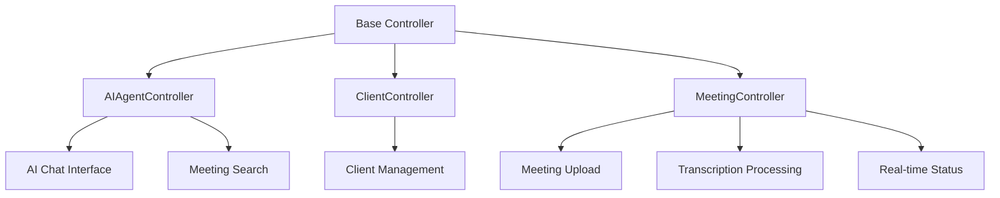
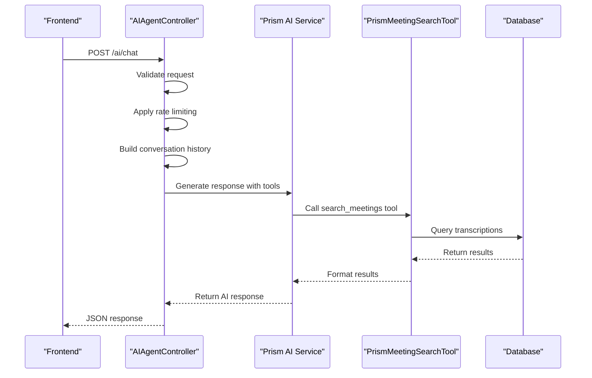
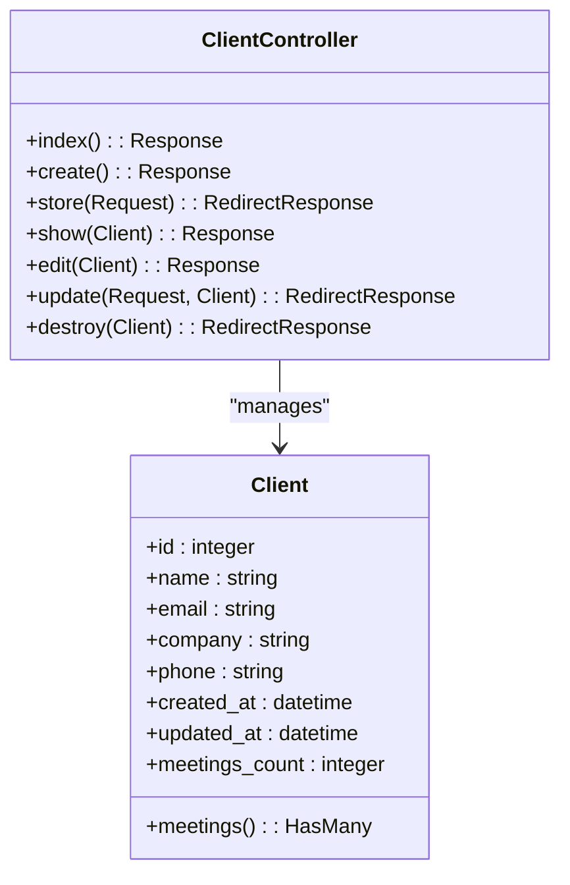
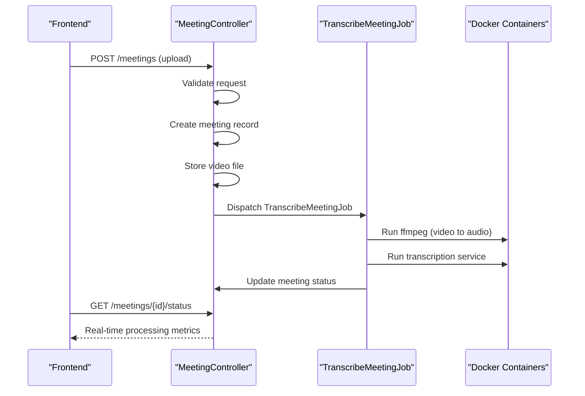
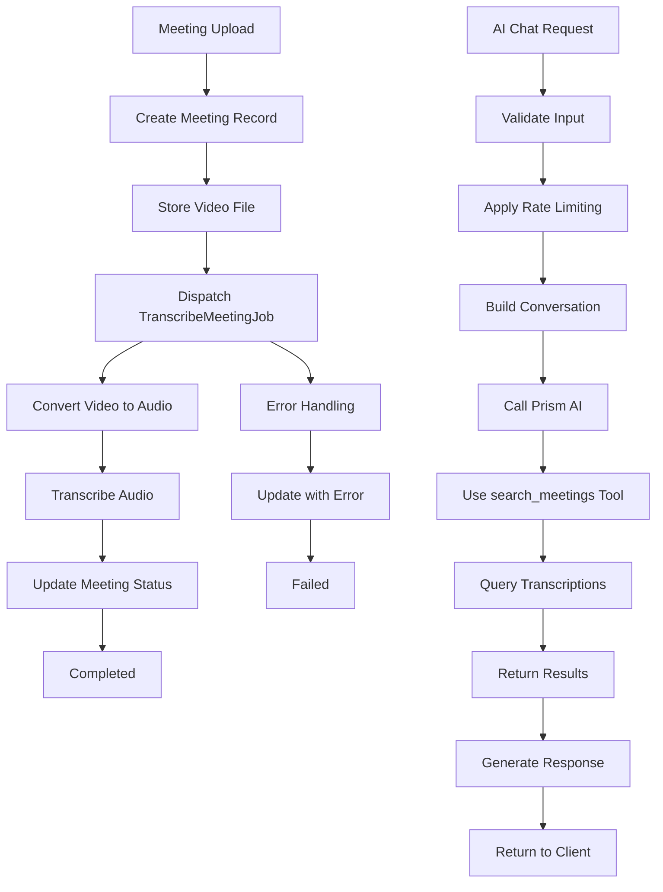

# Backend Controllers


## Table of Contents
1. [Introduction](#introduction)
2. [Core Controllers Overview](#core-controllers-overview)
3. [Base Controller and Inertia Integration](#base-controller-and-inertia-integration)
4. [AIAgentController: AI Chat and Search Handling](#aiagentcontroller-ai-chat-and-search-handling)
5. [ClientController: Client CRUD Operations](#clientcontroller-client-crud-operations)
6. [MeetingController: Meeting Management](#meetingcontroller-meeting-management)
7. [Job and Service Integration](#job-and-service-integration)
8. [Error Handling and API Consistency](#error-handling-and-api-consistency)
9. [Conclusion](#conclusion)

## Introduction
This document provides comprehensive documentation for the backend controllers in the meetingai Laravel application. It details the architecture, responsibilities, and implementation of key controllers including AIAgentController, ClientController, and MeetingController. The documentation covers HTTP route mappings, request validation, business logic delegation, response types, and integration with jobs and AI services. Special attention is given to the integration with Inertia.js for frontend rendering and the use of Laravel's job queue system for asynchronous processing.

## Core Controllers Overview
The meetingai application implements a controller-based architecture following Laravel conventions. The core controllers handle distinct domains of functionality:
- **AIAgentController**: Manages AI-powered chat and search interactions
- **ClientController**: Handles CRUD operations for client entities
- **MeetingController**: Manages meeting uploads, processing, and display

All controllers extend a base Controller class and leverage Inertia.js for frontend integration. The application uses resource routing for RESTful endpoints and additional named routes for specialized functionality like real-time status updates and AI interactions.





**Diagram sources**
- [Controller.php](file://app/Http/Controllers/Controller.php)
- [AIAgentController.php](file://app/Http/Controllers/AIAgentController.php)
- [ClientController.php](file://app/Http/Controllers/ClientController.php)
- [MeetingController.php](file://app/Http/Controllers/MeetingController.php)

**Section sources**
- [AIAgentController.php](file://app/Http/Controllers/AIAgentController.php)
- [ClientController.php](file://app/Http/Controllers/ClientController.php)
- [MeetingController.php](file://app/Http/Controllers/MeetingController.php)

## Base Controller and Inertia Integration
The base Controller class serves as the foundation for all application controllers, providing shared functionality and establishing the integration pattern with Inertia.js.


```php
<?php

namespace App\Http\Controllers;

abstract class Controller
{
    //
}
```


The integration with Inertia.js is managed through the HandleInertiaRequests middleware, which configures the root view and shares common data across all Inertia responses.


```php
<?php

namespace App\Http\Middleware;

use Illuminate\Http\Request;
use Inertia\Middleware;
use Tighten\Ziggy\Ziggy;

class HandleInertiaRequests extends Middleware
{
    protected $rootView = 'app';

    public function share(Request $request): array
    {
        return array_merge(parent::share($request), [
            'flash' => [
                'success' => fn () => $request->session()->get('success'),
                'error' => fn () => $request->session()->get('error'),
            ],
            'errors' => function () use ($request) {
                return $request->session()->get('errors')
                    ? $request->session()->get('errors')->getBag('default')->getMessages()
                    : (object) [];
            },
            'csrf_token' => fn () => csrf_token(),
            'app' => [
                'name' => config('app.name'),
                'url' => config('app.url'),
                'environment' => config('app.env'),
            ],
            'ziggy' => [
                ...(new Ziggy)->toArray(),
                'location' => $request->url(),
            ],
            'user' => fn () => $request->user()
                ? $request->user()->only('id', 'name', 'email')
                : null,
        ]);
    }
}
```


This middleware automatically shares flash messages, validation errors, CSRF tokens, application configuration, routing information (via Ziggy), and user data with all Inertia views, enabling seamless frontend integration.

**Section sources**
- [Controller.php](file://app/Http/Controllers/Controller.php#L1-L9)
- [HandleInertiaRequests.php](file://app/Http/Middleware/HandleInertiaRequests.php#L1-L67)

## AIAgentController: AI Chat and Search Handling
The AIAgentController handles AI-powered interactions, including natural language chat and semantic search through meeting transcriptions.

### Public Methods and Routes
The controller implements two primary endpoints for AI interactions:

**HTTP Routes (web.php):**

```php
Route::get('ai/chat', [AIAgentController::class, 'index'])->name('ai.chat');
Route::post('ai/chat', [AIAgentController::class, 'chat'])->name('ai.chat.send');
Route::post('ai/search', [AIAgentController::class, 'search'])->name('ai.search');
```


### index() Method
Displays the AI chat interface using Inertia.js.

**Method Signature:**

```php
public function index()
```


**Response:** Inertia view `AI/Chat`

### chat() Method
Handles AI chat requests with the Prism AI service, incorporating conversation history and tool integration.

**Method Signature:**

```php
public function chat(Request $request)
```


**Request Parameters:**
- `message`: Required string (max 1000 characters)
- `conversation_history`: Optional array (max 50 items)

**Validation Logic:**

```php
$request->validate([
    'message' => 'required|string|max:1000',
    'conversation_history' => 'array|max:50'
]);
```


**Business Logic:**
1. Implements rate limiting (10 requests per minute per IP)
2. Constructs conversation history with system, user, and assistant messages
3. Integrates with Prism AI service using the `search_meetings` tool
4. Logs processing metrics for monitoring

**Response Type:** JSON with structure:

```json
{
    "success": true,
    "response": "AI response text",
    "tool_calls": [...]
}
```


### search() Method
Provides direct search functionality through meeting transcriptions.

**Method Signature:**

```php
public function search(Request $request)
```


**Request Parameters:**
- `query`: Required string (max 500 characters)
- `client_id`: Optional integer (must reference valid client)
- `speaker`: Optional string (max 255 characters)
- `limit`: Optional integer (1-50)

**Validation Logic:**

```php
$request->validate([
    'query' => 'present|nullable|string|max:500',
    'client_id' => 'nullable|integer|exists:clients,id',
    'speaker' => 'nullable|string|max:255',
    'limit' => 'nullable|integer|min:1|max:50'
]);
```


**Business Logic:**
1. Delegates search to MeetingSearchTool
2. Returns structured search results with highlighted text
3. Handles empty queries with user-friendly response

**Response Type:** JSON with search results or error





**Diagram sources**
- [AIAgentController.php](file://app/Http/Controllers/AIAgentController.php#L1-L182)
- [PrismMeetingSearchTool.php](file://app/Tools/PrismMeetingSearchTool.php#L1-L30)
- [MeetingSearchTool.php](file://app/Tools/MeetingSearchTool.php#L1-L85)

**Section sources**
- [AIAgentController.php](file://app/Http/Controllers/AIAgentController.php#L1-L182)
- [web.php](file://routes/web.php#L1-L46)

## ClientController: Client CRUD Operations
The ClientController manages all aspects of client entity lifecycle, implementing standard CRUD operations with Inertia.js integration.

### Public Methods and Routes
The controller uses Laravel's resource routing for RESTful endpoints.

**HTTP Routes (web.php):**

```php
Route::resource('clients', ClientController::class);
```


### index() Method
Retrieves all clients with meeting count for display.

**Method Signature:**

```php
public function index(): Response
```


**Business Logic:**
- Loads clients with `meetings_count` via `withCount`
- Orders by client name
- Returns Inertia view with client data

**Response:** Inertia view `Clients/Index` with clients collection

### create() Method
Displays the client creation form.

**Method Signature:**

```php
public function create(): Response
```


**Response:** Inertia view `Clients/Create`

### store() Method
Creates a new client with validation.

**Method Signature:**

```php
public function store(Request $request): RedirectResponse
```


**Request Parameters:**
- `name`: Required string (max 255 characters)
- `email`: Optional email (must be unique)
- `company`: Optional string (max 255 characters)
- `phone`: Optional string (max 255 characters)

**Validation Logic:**

```php
$validated = $request->validate([
    'name' => 'required|string|max:255',
    'email' => 'nullable|email|unique:clients,email',
    'company' => 'nullable|string|max:255',
    'phone' => 'nullable|string|max:255',
]);
```


**Business Logic:**
- Validates input data
- Creates client record
- Redirects to index with success message

**Response:** Redirect to clients index

### show() Method
Displays a specific client and their meetings.

**Method Signature:**

```php
public function show(Client $client): Response
```


**Business Logic:**
- Loads client with meetings (ordered by creation date)
- Returns Inertia view with client data

**Response:** Inertia view `Clients/Show` with client data

### edit() Method
Displays the client edit form.

**Method Signature:**

```php
public function edit(Client $client): Response
```


**Response:** Inertia view `Clients/Edit` with client data

### update() Method
Updates an existing client with validation.

**Method Signature:**

```php
public function update(Request $request, Client $client): RedirectResponse
```


**Validation Logic:**

```php
$validated = $request->validate([
    'name' => 'required|string|max:255',
    'email' => [
        'nullable',
        'email',
        Rule::unique('clients', 'email')->ignore($client->id)
    ],
    'company' => 'nullable|string|max:255',
    'phone' => 'nullable|string|max:255',
]);
```


**Business Logic:**
- Validates input (ignoring current client's email)
- Updates client record
- Redirects to index with success message

**Response:** Redirect to clients index

### destroy() Method
Deletes a client if they have no associated meetings.

**Method Signature:**

```php
public function destroy(Client $client): RedirectResponse
```


**Business Logic:**
- Checks if client has meetings (prevents deletion)
- Deletes client if no meetings exist
- Redirects with appropriate message

**Response:** Redirect to clients index





**Diagram sources**
- [ClientController.php](file://app/Http/Controllers/ClientController.php#L1-L94)
- [Client.php](file://app/Models/Client.php#L1-L27)

**Section sources**
- [ClientController.php](file://app/Http/Controllers/ClientController.php#L1-L94)
- [web.php](file://routes/web.php#L1-L46)

## MeetingController: Meeting Management
The MeetingController handles meeting uploads, processing, display, and real-time status updates.

### Public Methods and Routes
The controller uses resource routing with an additional endpoint for real-time status.

**HTTP Routes (web.php):**

```php
Route::resource('meetings', MeetingController::class);
Route::get('meetings/{meeting}/status', [MeetingController::class, 'status'])->name('meetings.status');
```


### index() Method
Retrieves meetings with filtering and sorting capabilities.

**Method Signature:**

```php
public function index(Request $request): Response
```


**Filtering Parameters:**
- `client_id`: Filter by client
- `status`: Filter by meeting status
- `date_from`: Filter by upload date (from)
- `date_to`: Filter by upload date (to)

**Sorting Options:**
- `uploaded_at`, `title`, `status`, `duration`, `client`

**Business Logic:**
- Applies filters based on request parameters
- Implements sorting (including client name sorting via join)
- Paginates results (15 per page)
- Returns Inertia view with meetings and filter data

**Response:** Inertia view `Meetings/Index` with paginated meetings

### create() Method
Displays the meeting creation form.

**Method Signature:**

```php
public function create(): Response
```


**Business Logic:**
- Retrieves all clients for selection
- Returns Inertia view with clients data

**Response:** Inertia view `Meetings/Create` with clients

### store() Method
Handles meeting upload and initiates transcription processing.

**Method Signature:**

```php
public function store(Request $request): RedirectResponse
```


**Request Parameters:**
- `title`: Required string (max 255 characters)
- `client_id`: Required integer (must reference valid client)
- `video`: Required video file (MP4, MOV, AVI, WebM; 1MB-500MB)

**Validation Logic:**

```php
$validated = $request->validate([
    'title' => 'required|string|max:255',
    'client_id' => 'required|exists:clients,id',
    'video' => [
        'required',
        'file',
        File::types(['mp4', 'mov', 'avi', 'webm'])
            ->max(500 * 1024)
            ->min(1024)
    ]
]);
```


**Business Logic:**
1. Validates file integrity and available disk space
2. Creates meeting record with status "pending"
3. Stores video file in organized structure
4. Updates meeting with video path and estimated processing time
5. Dispatches TranscribeMeetingJob for asynchronous processing
6. Handles various error conditions with appropriate cleanup

**Response:** Redirect to meetings index with success message

### show() Method
Displays a specific meeting with video and transcription data.

**Method Signature:**

```php
public function show(Meeting $meeting): Response
```


**Business Logic:**
- Loads meeting with client and transcriptions
- Generates video URL for frontend playback
- Validates video file existence
- Handles missing video files gracefully

**Response:** Inertia view `Meetings/Show` with meeting data

### update() Method
Updates meeting metadata.

**Method Signature:**

```php
public function update(Request $request, Meeting $meeting): RedirectResponse
```


**Response:** Redirect to meeting show page

### destroy() Method
Deletes a meeting and associated video file.

**Method Signature:**

```php
public function destroy(Meeting $meeting): RedirectResponse
```


**Business Logic:**
- Deletes video file if it exists
- Removes empty directories
- Deletes meeting record

**Response:** Redirect to meetings index

### status() Method
Provides real-time status updates for meeting processing.

**Method Signature:**

```php
public function status(Meeting $meeting)
```


**Response Type:** JSON with processing metrics:
- Current status
- Elapsed processing time
- Estimated remaining time
- Processing progress percentage
- Queue progress (for pending meetings)





**Diagram sources**
- [MeetingController.php](file://app/Http/Controllers/MeetingController.php#L1-L304)
- [TranscribeMeetingJob.php](file://app/Jobs/TranscribeMeetingJob.php#L1-L399)
- [Meeting.php](file://app/Models/Meeting.php#L1-L178)

**Section sources**
- [MeetingController.php](file://app/Http/Controllers/MeetingController.php#L1-L304)
- [web.php](file://routes/web.php#L1-L46)

## Job and Service Integration
The application integrates with background jobs and external services for asynchronous processing and AI capabilities.

### TranscribeMeetingJob Integration
The MeetingController dispatches the TranscribeMeetingJob when a meeting is uploaded:


```php
TranscribeMeetingJob::dispatch($meeting);
```


The job implements the following processing pipeline:
1. Updates meeting status to "processing"
2. Converts video to WAV audio using ffmpeg in Docker
3. Transcribes audio using the Scriberr service in Docker
4. Updates meeting status to "completed" or "failed"

**Key Features:**
- 1-hour timeout
- 3 retry attempts with exponential backoff
- Comprehensive error handling and logging
- Temporary file cleanup
- User-friendly error messages

### AI Service Integration
The AIAgentController integrates with the Prism AI service through the PrismMeetingSearchTool:


```php
$response = Prism::text()
    ->using(Provider::OpenRouter, 'openai/gpt-oss-120b')
    ->withMessages($messages)
    ->withTools([new PrismMeetingSearchTool()])
    ->generate();
```


The tool enables the AI to search through meeting transcriptions using natural language queries, providing a conversational interface to the application's data.





**Diagram sources**
- [TranscribeMeetingJob.php](file://app/Jobs/TranscribeMeetingJob.php#L1-L399)
- [MeetingController.php](file://app/Http/Controllers/MeetingController.php#L1-L304)
- [AIAgentController.php](file://app/Http/Controllers/AIAgentController.php#L1-L182)

**Section sources**
- [TranscribeMeetingJob.php](file://app/Jobs/TranscribeMeetingJob.php#L1-L399)
- [MeetingController.php](file://app/Http/Controllers/MeetingController.php#L1-L304)
- [AIAgentController.php](file://app/Http/Controllers/AIAgentController.php#L1-L182)

## Error Handling and API Consistency
The application implements consistent error handling patterns across all controllers.

### HTTP Status Codes
- **200**: Successful requests
- **302**: Redirects (form submissions)
- **408**: Request timeout
- **422**: Validation errors
- **429**: Rate limiting
- **500**: Server errors
- **503**: Service unavailable

### Error Response Format
JSON responses use a consistent structure:

```json
{
    "success": false,
    "error": "User-friendly error message"
}
```


### Exception Handling
Controllers implement try-catch blocks for:
- Validation exceptions (422)
- Runtime exceptions (408, 429, 503)
- General exceptions (500)
- Specific error type detection for appropriate messaging

### Rate Limiting
The AIAgentController implements IP-based rate limiting:
- 10 requests per minute per IP
- Uses Laravel's cache system
- Returns 429 status with appropriate message

### Validation
All controllers use Laravel's validation system with:
- Custom error messages
- Appropriate validation rules
- Database existence checks
- Unique constraints with ignore rules

**Section sources**
- [AIAgentController.php](file://app/Http/Controllers/AIAgentController.php#L1-L182)
- [ClientController.php](file://app/Http/Controllers/ClientController.php#L1-L94)
- [MeetingController.php](file://app/Http/Controllers/MeetingController.php#L1-L304)

## Conclusion
The meetingai application implements a well-structured controller architecture that effectively separates concerns and provides robust functionality. The controllers follow Laravel conventions while extending them with application-specific features like AI integration and real-time processing updates. Key strengths include:

1. **Clean Separation of Concerns**: Each controller handles a distinct domain with focused responsibilities.
2. **Consistent API Design**: Uniform response formats and error handling across endpoints.
3. **Effective Frontend Integration**: Seamless Inertia.js integration for modern SPAs.
4. **Robust Error Handling**: Comprehensive exception handling with user-friendly messages.
5. **Asynchronous Processing**: Background job system for resource-intensive tasks.
6. **AI Integration**: Natural language interface to application data through the Prism service.

The architecture demonstrates best practices in Laravel development, providing a maintainable and scalable foundation for the application's functionality.

**Referenced Files in This Document**   
- [AIAgentController.php](file://app/Http/Controllers/AIAgentController.php)
- [ClientController.php](file://app/Http/Controllers/ClientController.php)
- [Controller.php](file://app/Http/Controllers/Controller.php)
- [MeetingController.php](file://app/Http/Controllers/MeetingController.php)
- [HandleInertiaRequests.php](file://app/Http/Middleware/HandleInertiaRequests.php)
- [web.php](file://routes/web.php)
- [TranscribeMeetingJob.php](file://app/Jobs/TranscribeMeetingJob.php)
- [MeetingSearchTool.php](file://app/Tools/MeetingSearchTool.php)
- [PrismMeetingSearchTool.php](file://app/Tools/PrismMeetingSearchTool.php)
- [Meeting.php](file://app/Models/Meeting.php)
- [Client.php](file://app/Models/Client.php)
- [Transcription.php](file://app/Models/Transcription.php)