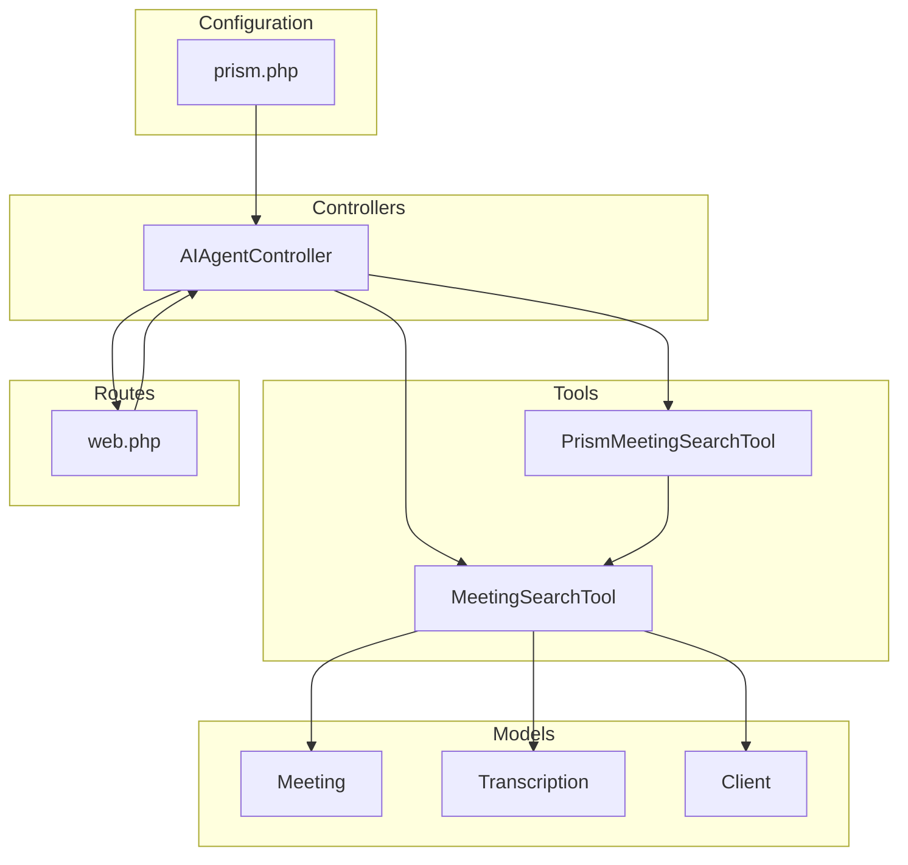
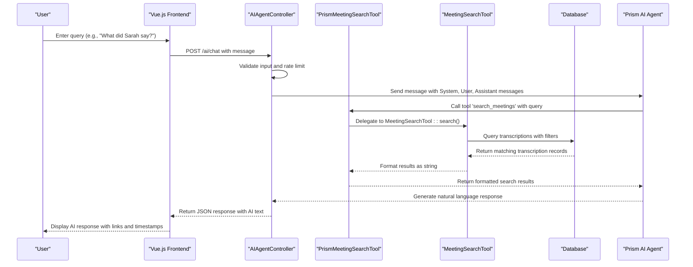
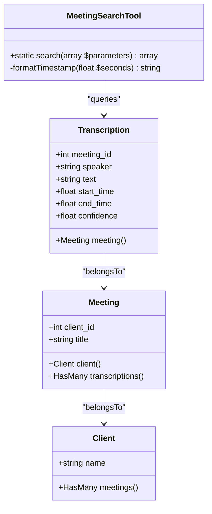
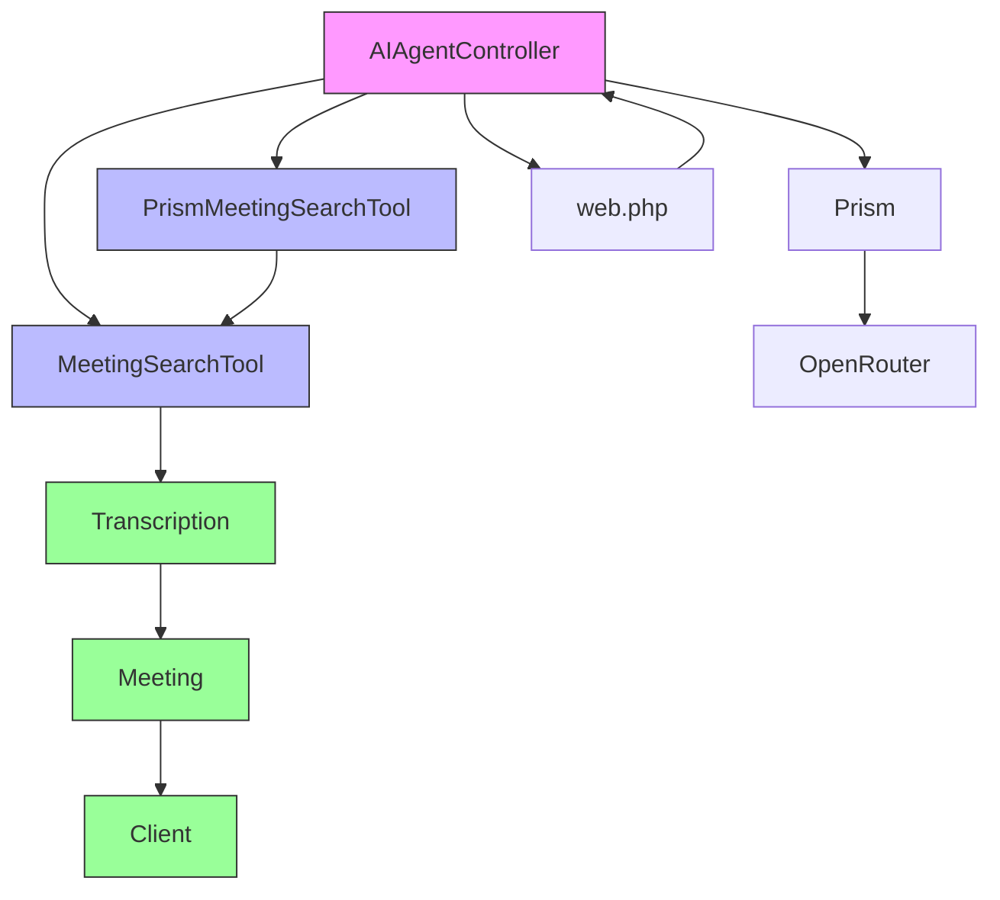

# AIAgentController


## Table of Contents
1. [Introduction](#introduction)
2. [Project Structure](#project-structure)
3. [Core Components](#core-components)
4. [Architecture Overview](#architecture-overview)
5. [Detailed Component Analysis](#detailed-component-analysis)
6. [Dependency Analysis](#dependency-analysis)
7. [Performance Considerations](#performance-considerations)
8. [Troubleshooting Guide](#troubleshooting-guide)
9. [Conclusion](#conclusion)

## Introduction
The **AIAgentController** is a central component in the MeetingAI application responsible for enabling AI-powered conversational search and meeting content querying. It leverages the **Prism AI agent system** to process natural language queries and retrieve relevant information from transcribed meeting content. This document provides a comprehensive analysis of the controller's functionality, integration with AI tools, HTTP routing, request validation, error handling, and data flow.

The controller supports two primary functions: interactive chat via the `chat()` method and direct search via the `search()` method. It integrates with custom tools such as `MeetingSearchTool` and `PrismMeetingSearchTool` to extract meeting excerpts based on user queries. Security measures include rate limiting, input validation, and structured error responses.

## Project Structure
The AIAgentController is part of a Laravel-based application with a modular structure separating concerns into controllers, models, tools, and configuration files. The key directories involved are:
- `app/Http/Controllers/` – Contains the AIAgentController
- `app/Tools/` – Houses AI integration tools
- `app/Models/` – Defines data models for meetings, transcriptions, and clients
- `routes/` – Configures web routes
- `config/` – Stores AI provider settings





**Diagram sources**
- [AIAgentController.php](file://app/Http/Controllers/AIAgentController.php)
- [MeetingSearchTool.php](file://app/Tools/MeetingSearchTool.php)
- [PrismMeetingSearchTool.php](file://app/Tools/PrismMeetingSearchTool.php)
- [Meeting.php](file://app/Models/Meeting.php)
- [Transcription.php](file://app/Models/Transcription.php)
- [Client.php](file://app/Models/Client.php)
- [web.php](file://routes/web.php)
- [prism.php](file://config/prism.php)

**Section sources**
- [AIAgentController.php](file://app/Http/Controllers/AIAgentController.php)
- [MeetingSearchTool.php](file://app/Tools/MeetingSearchTool.php)
- [PrismMeetingSearchTool.php](file://app/Tools/PrismMeetingSearchTool.php)
- [Meeting.php](file://app/Models/Meeting.php)
- [Transcription.php](file://app/Models/Transcription.php)
- [Client.php](file://app/Models/Client.php)
- [web.php](file://routes/web.php)
- [prism.php](file://config/prism.php)

## Core Components
The core components of the AIAgentController system include:
- **AIAgentController**: Handles HTTP requests for chat and search
- **MeetingSearchTool**: Performs database queries on transcriptions
- **PrismMeetingSearchTool**: Integrates with the Prism AI agent as a callable tool
- **Prism AI Service**: External AI provider configured via `prism.php`
- **Meeting and Transcription Models**: Represent meeting data and speech segments

These components work together to transform natural language queries into structured database searches and return enriched results through an AI interface.

**Section sources**
- [AIAgentController.php](file://app/Http/Controllers/AIAgentController.php#L1-L182)
- [MeetingSearchTool.php](file://app/Tools/MeetingSearchTool.php#L1-L85)
- [PrismMeetingSearchTool.php](file://app/Tools/PrismMeetingSearchTool.php#L1-L49)
- [Meeting.php](file://app/Models/Meeting.php#L1-L178)
- [Transcription.php](file://app/Models/Transcription.php#L1-L49)

## Architecture Overview
The AIAgentController operates within a layered architecture that integrates frontend interaction, backend processing, AI services, and persistent storage. User queries originate from the Vue.js frontend and are sent to the controller via defined routes. The controller validates input, applies rate limiting, and constructs a message sequence for the AI agent.

When a user asks a question about meeting content, the AI agent invokes the `search_meetings` tool (implemented by `PrismMeetingSearchTool`), which delegates to `MeetingSearchTool` to query the database. Results are formatted and returned to the AI agent, which generates a natural language response.





**Diagram sources**
- [AIAgentController.php](file://app/Http/Controllers/AIAgentController.php#L50-L180)
- [PrismMeetingSearchTool.php](file://app/Tools/PrismMeetingSearchTool.php#L15-L45)
- [MeetingSearchTool.php](file://app/Tools/MeetingSearchTool.php#L5-L80)
- [Transcription.php](file://app/Models/Transcription.php#L1-L49)
- [Meeting.php](file://app/Models/Meeting.php#L1-L178)

## Detailed Component Analysis

### AIAgentController Analysis
The **AIAgentController** handles two main endpoints: `/ai/chat` for conversational AI and `/ai/search` for direct search access.

#### Public Methods

**chat() Method**
- **HTTP Route**: `POST /ai/chat`
- **Purpose**: Enables conversational AI interaction with access to meeting content
- **Request Validation**:
  - `message`: Required string, max 1000 characters
  - `conversation_history`: Array, max 50 items
- **Rate Limiting**: 10 requests per minute per IP (cached using Laravel's cache system)
- **Security**: Input sanitization, rate limiting, structured error responses
- **Response Structure**:

```json
{
  "success": true,
  "response": "Found 2 relevant discussions...",
  "tool_calls": [
    {
      "name": "search_meetings",
      "arguments": {
        "query": "Sarah",
        "client_id": 1,
        "limit": 10
      }
    }
  ]
}
```


**search() Method**
- **HTTP Route**: `POST /ai/search`
- **Purpose**: Direct access to meeting search functionality
- **Request Validation**:
  - `query`: Present, nullable string, max 500 characters
  - `client_id`: Optional integer, must exist in clients table
  - `speaker`: Optional string, max 255 characters
  - `limit`: Optional integer, 1–50
- **Response Structure**:

```json
{
  "success": true,
  "data": {
    "results": [
      {
        "meeting_id": 1,
        "meeting_title": "Team Sync",
        "client_name": "Acme Corp",
        "speaker": "Sarah Johnson",
        "text": "**Sarah** discussed the timeline",
        "timestamp": 120.5,
        "formatted_timestamp": "02:00",
        "confidence": 0.95,
        "meeting_url": "/meetings/1?t=120.5"
      }
    ],
    "total_found": 1,
    "search_query": "Sarah"
  }
}
```


#### Code Example: chat() Method Signature

```php
public function chat(Request $request)
{
    $request->validate([
        'message' => 'required|string|max:1000',
        'conversation_history' => 'array|max:50'
    ]);
    
    // Rate limiting
    $cacheKey = 'ai_chat_' . $request->ip();
    $requestCount = cache()->get($cacheKey, 0);
    if ($requestCount >= 10) {
        return response()->json(['error' => 'Too many requests'], 429);
    }
    cache()->put($cacheKey, $requestCount + 1, 60);

    // Build message sequence
    $messages = [
        new SystemMessage("You are an AI assistant..."),
    ];

    // Add conversation history
    foreach ($request->conversation_history as $msg) {
        if ($msg['role'] === 'user') {
            $messages[] = new UserMessage($msg['content']);
        } elseif ($msg['role'] === 'assistant') {
            $messages[] = new AssistantMessage($msg['content']);
        }
    }

    // Add current message
    $messages[] = new UserMessage($request->message);

    // Call AI with tools
    $response = Prism::text()
        ->using(Provider::OpenRouter, 'openai/gpt-oss-120b')
        ->withMessages($messages)
        ->withTools([new PrismMeetingSearchTool()])
        ->generate();

    return response()->json([
        'success' => true,
        'response' => $response->text,
        'tool_calls' => array_map(fn($toolCall) => [
            'name' => $toolCall->name ?? null,
            'arguments' => method_exists($toolCall, 'arguments') ? $toolCall->arguments() : null,
        ], $response->toolCalls ?? [])
    ]);
}
```


**Section sources**
- [AIAgentController.php](file://app/Http/Controllers/AIAgentController.php#L50-L182)
- [web.php](file://routes/web.php#L40-L42)

### MeetingSearchTool Analysis
The **MeetingSearchTool** performs the actual database query on transcribed meeting content.

#### Implementation Details
- **Static Method**: `search(array $parameters)`
- **Parameters**:
  - `query`: Search term (required)
  - `client_id`: Filter by client (optional)
  - `speaker`: Filter by speaker name (optional)
  - `limit`: Maximum results (default: 10, max: 50)
- **Database Query**: Uses Eloquent to search `Transcription` model with `LIKE` operator
- **Eager Loading**: Loads related `meeting` and `client` data
- **Result Formatting**: Highlights search terms, formats timestamps, generates deep links

#### Code Example: search() Method

```php
public static function search(array $parameters): array
{
    $query = $parameters['query'] ?? '';
    $clientId = $parameters['client_id'] ?? null;
    $speaker = $parameters['speaker'] ?? null;
    $limit = $parameters['limit'] ?? 10;

    $results = Transcription::query()
        ->with(['meeting.client'])
        ->where('text', 'like', "%{$query}%")
        ->when($clientId, function ($q) use ($clientId) {
            return $q->whereHas('meeting', fn($q) => $q->where('client_id', $clientId));
        })
        ->when($speaker, function ($q) use ($speaker) {
            return $q->where('speaker', 'like', "%{$speaker}%");
        })
        ->orderBy('start_time', 'asc')
        ->limit($limit)
        ->get()
        ->map(function ($transcription) use ($query) {
            $highlightedText = str_ireplace($query, "**{$query}**", $transcription->text);
            return [
                'meeting_id' => $transcription->meeting->id,
                'meeting_title' => $transcription->meeting->title,
                'client_name' => $transcription->meeting->client->name,
                'speaker' => $transcription->speaker,
                'text' => $highlightedText,
                'timestamp' => (float)$transcription->start_time,
                'formatted_timestamp' => self::formatTimestamp($transcription->start_time),
                'confidence' => $transcription->confidence,
                'meeting_url' => route('meetings.show', $transcription->meeting->id)
            ];
        })
        ->toArray();

    return [
        'results' => $results,
        'total_found' => count($results),
        'search_query' => $query
    ];
}
```





**Diagram sources**
- [MeetingSearchTool.php](file://app/Tools/MeetingSearchTool.php#L5-L80)
- [Transcription.php](file://app/Models/Transcription.php#L1-L49)
- [Meeting.php](file://app/Models/Meeting.php#L1-L178)
- [Client.php](file://app/Models/Client.php#L1-L27)

**Section sources**
- [MeetingSearchTool.php](file://app/Tools/MeetingSearchTool.php#L5-L80)

### PrismMeetingSearchTool Analysis
The **PrismMeetingSearchTool** integrates the search functionality with the Prism AI agent system.

#### Implementation Details
- **Extends**: `Prism\Prism\Tool`
- **Tool Name**: `search_meetings`
- **Parameters**:
  - `query` (string, required)
  - `client_id` (string, optional)
  - `speaker` (string, optional)
  - `limit` (string, optional)
- **Execution Logic**: Delegates to `MeetingSearchTool::search()` and formats results as a string for the AI agent

#### Code Example: Tool Configuration

```php
class PrismMeetingSearchTool extends Tool
{
    public function __construct()
    {
        parent::__construct();
        
        $this->as('search_meetings')
            ->for('Search through meeting transcriptions...')
            ->withStringParameter('query', 'The search query...', true)
            ->withStringParameter('client_id', 'Optional client ID...', false)
            ->withStringParameter('speaker', 'Optional speaker name...', false)
            ->withStringParameter('limit', 'Maximum number of results...', false)
            ->using(function (string $query, $client_id = null, ?string $speaker = null, $limit = 10): string {
                $client_id = is_numeric($client_id) ? (int) $client_id : null;
                $limit = is_numeric($limit) ? max(1, min(50, (int) $limit)) : 10;

                $result = MeetingSearchTool::search([
                    'query' => $query,
                    'client_id' => $client_id,
                    'speaker' => $speaker,
                    'limit' => $limit
                ]);

                if (isset($result['error'])) {
                    return "Error: " . $result['error'];
                }

                if (empty($result['results'])) {
                    return "No results found for query: '{$query}'";
                }

                $output = "Found {$result['total_found']} results for '{$query}':\n\n";
                foreach ($result['results'] as $item) {
                    $output .= "**{$item['meeting_title']}** ({$item['client_name']})\n";
                    $output .= "Speaker: {$item['speaker']} at {$item['formatted_timestamp']}\n";
                    $output .= "Text: {$item['text']}\n";
                    $output .= "Link: {$item['meeting_url']}?t={$item['timestamp']}\n\n";
                }

                return $output;
            });
    }
}
```


**Section sources**
- [PrismMeetingSearchTool.php](file://app/Tools/PrismMeetingSearchTool.php#L1-L49)

## Dependency Analysis
The AIAgentController and its associated tools have the following dependencies:





**Diagram sources**
- [AIAgentController.php](file://app/Http/Controllers/AIAgentController.php)
- [PrismMeetingSearchTool.php](file://app/Tools/PrismMeetingSearchTool.php)
- [MeetingSearchTool.php](file://app/Tools/MeetingSearchTool.php)
- [Transcription.php](file://app/Models/Transcription.php)
- [Meeting.php](file://app/Models/Meeting.php)
- [Client.php](file://app/Models/Client.php)
- [web.php](file://routes/web.php)

**Section sources**
- [AIAgentController.php](file://app/Http/Controllers/AIAgentController.php)
- [PrismMeetingSearchTool.php](file://app/Tools/PrismMeetingSearchTool.php)
- [MeetingSearchTool.php](file://app/Tools/MeetingSearchTool.php)
- [Transcription.php](file://app/Models/Transcription.php)
- [Meeting.php](file://app/Models/Meeting.php)
- [Client.php](file://app/Models/Client.php)
- [web.php](file://routes/web.php)

## Performance Considerations
- **Rate Limiting**: Prevents abuse with 10 requests per minute per IP
- **Caching**: Uses Laravel's cache for rate limiting (not for query results)
- **Query Optimization**: Uses `LIKE` with wildcards; consider full-text search for large datasets
- **Eager Loading**: Prevents N+1 queries by loading `meeting.client` relationship
- **Input Validation**: Reduces processing of invalid requests
- **Timeout Handling**: AI requests include timeout logic with error recovery
- **Scalability**: Search is limited to 50 results; additional pagination could be implemented

## Troubleshooting Guide
Common issues and their solutions:

| Issue | Cause | Solution |
|-------|-------|----------|
| "Too many requests" error | Rate limit exceeded | Wait 60 seconds before retrying |
| "Invalid input" error | Missing or malformed request data | Ensure `message` is provided and under 1000 characters |
| "Request timed out" | AI service slow or overloaded | Try shorter queries or wait and retry |
| "AI service is currently busy" | Provider rate limiting | Wait and retry; check provider status |
| "Network error occurred" | Connectivity issue | Check network connection and retry |
| "No results found" | No matching transcriptions | Verify meeting has transcriptions and query terms exist |
| Empty response for valid query | Whitespace-only query | Trim input before sending |

Error handling includes detailed logging via Laravel's `Log` facade, capturing message content, IP address, and stack trace for debugging.

**Section sources**
- [AIAgentController.php](file://app/Http/Controllers/AIAgentController.php#L90-L180)
- [AIAgentTest.php](file://tests/Feature/AIAgentTest.php)

## Conclusion
The **AIAgentController** provides a robust interface for AI-powered search across meeting transcriptions. It effectively integrates with the Prism AI agent system through custom tools, enabling natural language queries to be transformed into structured database searches. The architecture emphasizes security, rate limiting, and error resilience while providing rich, contextual responses with deep links to relevant meeting segments.

Key strengths include:
- Clean separation between AI interaction and data retrieval
- Comprehensive input validation and error handling
- Efficient database queries with proper relationships
- Flexible tool-based AI integration
- User-friendly response formatting with timestamps and links

Future improvements could include full-text search indexing, result caching, and enhanced filtering options.

**Referenced Files in This Document**   
- [AIAgentController.php](file://app/Http/Controllers/AIAgentController.php)
- [MeetingSearchTool.php](file://app/Tools/MeetingSearchTool.php)
- [PrismMeetingSearchTool.php](file://app/Tools/PrismMeetingSearchTool.php)
- [web.php](file://routes/web.php)
- [prism.php](file://config/prism.php)
- [Meeting.php](file://app/Models/Meeting.php)
- [Transcription.php](file://app/Models/Transcription.php)
- [Client.php](file://app/Models/Client.php)
- [AIAgentTest.php](file://tests/Feature/AIAgentTest.php)